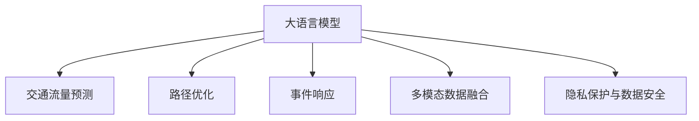

                 

# LLM与智能交通系统：缓解城市拥堵

## 1. 背景介绍

### 1.1 问题由来

城市交通拥堵是全球范围内普遍存在的问题，尤其在人口密集、经济发达的城市中，交通拥堵现象尤为严重。拥堵导致的时间和经济损失巨大，严重影响了城市居民的生活质量和城市发展效率。传统交通管理手段，如增加道路基础设施、改善信号控制等，虽然能够在一定程度上缓解拥堵，但难以从根本上解决问题。

近年来，人工智能（AI）技术快速发展，尤其是大语言模型（Large Language Models, LLM）的兴起，为解决城市交通拥堵问题提供了新的可能。LLM通过处理和分析海量交通数据，能够提供实时交通状态预测和智能决策支持，帮助城市管理者制定更加科学的交通管理策略，缓解交通压力，提升城市交通效率。

### 1.2 问题核心关键点

当前，基于大语言模型的智能交通系统主要围绕以下几个关键问题展开：

1. **交通流量预测**：如何准确预测未来交通流量，从而合理分配道路资源。
2. **路径优化**：在实时交通数据基础上，如何找到最优路径，减少拥堵。
3. **事件响应**：如何快速响应突发交通事件，如交通事故、施工路段等，减少其对交通流的影响。
4. **多模态数据融合**：如何将多源交通数据（如摄像头监控、车载传感器、GPS数据等）进行有效整合，提高系统预测精度。
5. **隐私保护与数据安全**：如何在保证数据安全性的同时，充分利用各类数据，提升交通管理决策的科学性和透明度。

本文将详细介绍大语言模型在智能交通系统中的应用，包括流量预测、路径优化、事件响应等关键问题，并给出相应的算法原理和实际操作步骤。

## 2. 核心概念与联系

### 2.1 核心概念概述

为更好地理解基于大语言模型的智能交通系统，本节将介绍几个密切相关的核心概念：

- **大语言模型（LLM）**：如GPT-3、BERT等，通过大规模语料库进行自监督训练，具备强大的语言理解和生成能力。可以处理和分析自然语言文本，提供多模态数据融合和语义分析能力。

- **交通流量预测**：使用历史交通数据和实时数据，预测未来一定时间内的交通流量，辅助城市交通管理。

- **路径优化**：在已知交通流量和实时状态基础上，计算最优路径，减少车辆行驶时间和燃油消耗。

- **事件响应**：通过分析实时交通数据和历史事件数据，识别潜在风险，提前制定应对措施，减少突发事件对交通流的影响。

- **多模态数据融合**：将摄像头监控、车载传感器、GPS数据等多种数据源进行整合，提高交通数据的时空分辨率，提升系统的预测和决策能力。

- **隐私保护与数据安全**：确保交通数据的隐私性和安全性，防止数据滥用和泄露，保障系统的透明性和公正性。

这些核心概念之间的逻辑关系可以通过以下Mermaid流程图来展示：



这个流程图展示了大语言模型在智能交通系统中的应用，涵盖了从交通流量预测到路径优化、事件响应、数据融合等多个关键环节，以及隐私保护与数据安全的保障。

## 3. 核心算法原理 & 具体操作步骤
### 3.1 算法原理概述

基于大语言模型的智能交通系统，核心思想是使用大语言模型处理和分析交通数据，辅助交通流量预测、路径优化、事件响应等决策过程。大语言模型能够理解和生成自然语言文本，通过与交通管理人员的交互，获取和管理交通数据，进行实时的交通分析和决策支持。

形式化地，假设交通系统为 $S$，其状态由多个变量 $x_1, x_2, \ldots, x_n$ 描述，如交通流量、路段长度、车速等。交通系统的动态演化过程可以用离散时间模型表示为：

$$
S_{t+1} = f(S_t, u_t)
$$

其中 $u_t$ 表示在时间 $t$ 的交通控制措施，如红绿灯控制、限速、道路建设等。大语言模型 $M_{\theta}$ 能够通过处理历史交通数据和实时数据，预测未来的交通状态 $S_{t+1}$，并根据预测结果建议交通控制措施 $u_t$。

### 3.2 算法步骤详解

基于大语言模型的智能交通系统一般包括以下几个关键步骤：

**Step 1: 数据采集与预处理**
- 使用各类传感器、摄像头等采集实时交通数据。
- 将数据进行格式转换、清洗、标准化处理，确保数据质量。

**Step 2: 数据融合与特征提取**
- 将多种数据源进行融合，如将摄像头图像数据转换为语义描述，车载传感器数据转换为文本信息等。
- 使用大语言模型提取交通数据的特征，如交通流量、车速、路段拥堵情况等。

**Step 3: 建立交通模型**
- 使用大语言模型建立交通流量预测模型，如时间序列模型、深度学习模型等。
- 构建路径优化模型，如基于图论的最短路径算法。
- 设计事件响应模型，如异常检测和风险评估算法。

**Step 4: 交通决策与优化**
- 使用大语言模型进行交通状态预测，评估不同交通控制策略的效果。
- 根据预测结果和优化目标，制定最优的交通控制措施。
- 将决策结果转化为具体的交通控制信号，如红绿灯控制、限速等。

**Step 5: 实时监控与反馈**
- 实时监控交通状态，评估控制措施的效果。
- 根据实时数据反馈调整模型参数，持续优化交通控制策略。

### 3.3 算法优缺点

基于大语言模型的智能交通系统具有以下优点：

1. **实时性强**：大语言模型能够实时处理和分析交通数据，提供实时的决策支持。
2. **预测准确**：使用深度学习等先进算法，交通流量预测模型能够提供高精度的预测结果。
3. **多模态数据融合**：能够整合多种数据源，提高交通数据的全面性和可靠性。
4. **灵活性好**：通过大语言模型，可以根据实际需求灵活调整交通控制策略。

同时，该方法也存在一定的局限性：

1. **数据需求高**：需要大规模交通数据支持，数据采集和预处理成本较高。
2. **模型复杂度**：交通模型和预测模型复杂，需要较高的计算资源。
3. **隐私与安全**：交通数据涉及隐私和安全问题，需要严格的数据管理和保护措施。
4. **依赖技术**：系统依赖于大语言模型和相关技术，对技术要求较高。

尽管存在这些局限性，但就目前而言，基于大语言模型的智能交通系统仍然是大规模交通管理的重要手段。未来相关研究的重点在于如何进一步降低数据需求，提高模型的实时性和鲁棒性，同时兼顾数据隐私和安全。

### 3.4 算法应用领域

基于大语言模型的智能交通系统在多个领域得到了广泛应用，包括但不限于：

1. **城市交通管理**：使用大语言模型进行交通流量预测、路径优化、事件响应等，提升城市交通效率和管理水平。
2. **高速公路监控**：在高速公路上部署大语言模型，实时监测交通状态，进行智能调度和管理。
3. **智能停车系统**：通过大语言模型分析停车场数据，优化停车策略，减少城市拥堵。
4. **公共交通调度**：使用大语言模型进行公交路线和站点优化，提升公共交通系统的效率。
5. **物流配送管理**：在物流配送中引入大语言模型，优化配送路线和时间安排，减少交通拥堵。

## 4. 数学模型和公式 & 详细讲解 & 举例说明
### 4.1 数学模型构建

本节将使用数学语言对基于大语言模型的智能交通系统进行更加严格的刻画。

记交通系统为 $S$，其状态由多个变量 $x_1, x_2, \ldots, x_n$ 描述，如交通流量、路段长度、车速等。假设大语言模型能够通过处理历史交通数据和实时数据，预测未来的交通状态 $S_{t+1}$，并根据预测结果建议交通控制措施 $u_t$。

定义交通系统在时间 $t$ 的状态为 $S_t$，预测在时间 $t+1$ 的状态为 $S_{t+1}$，则交通系统的动态演化过程可以用以下差分方程表示：

$$
S_{t+1} = f(S_t, u_t)
$$

其中 $f$ 表示状态演化函数，$u_t$ 表示在时间 $t$ 的交通控制措施，如红绿灯控制、限速、道路建设等。

假设大语言模型 $M_{\theta}$ 能够通过处理交通数据 $D_t$（包括历史和实时数据），预测未来的交通状态 $S_{t+1}$，并根据预测结果建议交通控制措施 $u_t$。则大语言模型的预测过程可以用以下方程表示：

$$
\hat{S}_{t+1} = M_{\theta}(D_t)
$$

其中 $\hat{S}_{t+1}$ 表示预测的交通状态。

### 4.2 公式推导过程

以下我们以交通流量预测为例，推导基于大语言模型的预测模型。

假设交通流量数据 $D_t$ 为 $(x_1, x_2, \ldots, x_n)$，其中 $x_i$ 表示时间 $t$ 时交通流量。交通流量预测模型为 $f$，即：

$$
f(x_1, x_2, \ldots, x_n) = \sum_{i=1}^n \omega_i x_i + \varepsilon
$$

其中 $\omega_i$ 为权重，$\varepsilon$ 为误差项。

假设大语言模型 $M_{\theta}$ 能够根据历史和实时数据 $D_t$，预测未来时间 $t+1$ 的交通流量 $\hat{x}_{t+1}$。则大语言模型的预测过程可以用以下方程表示：

$$
\hat{x}_{t+1} = M_{\theta}(D_t)
$$

将上式展开，得到：

$$
\hat{x}_{t+1} = \sum_{i=1}^n \omega_i x_i + \varepsilon
$$

其中 $\omega_i$ 和 $\varepsilon$ 为大语言模型在处理数据 $D_t$ 时学到的权重和误差项。

通过对比公式（4）和公式（5），可以看出，基于大语言模型的交通流量预测模型与经典的多项式回归模型形式相同，但系数 $\omega_i$ 和误差项 $\varepsilon$ 的计算方式不同。大语言模型能够自动学习最优的系数和误差项，而不需要人工设定。

### 4.3 案例分析与讲解

以下我们以北京市交通流量预测为例，具体说明大语言模型的应用。

假设北京市每天交通流量数据 $D_t$ 为 $(x_1, x_2, \ldots, x_n)$，其中 $x_i$ 表示时间 $t$ 时各条主要道路的交通流量。为了预测未来时间 $t+1$ 的交通流量，我们构建如下的交通流量预测模型：

$$
f(x_1, x_2, \ldots, x_n) = \sum_{i=1}^n \omega_i x_i + \varepsilon
$$

其中 $\omega_i$ 为权重，$\varepsilon$ 为误差项。

使用大语言模型 $M_{\theta}$ 对历史和实时数据 $D_t$ 进行训练，得到最优的系数 $\omega_i$ 和误差项 $\varepsilon$。根据训练好的大语言模型，我们可以预测未来时间 $t+1$ 的交通流量 $\hat{x}_{t+1}$。

具体实现步骤如下：

1. 数据预处理：将原始交通流量数据进行格式转换、清洗、标准化处理。
2. 模型训练：使用大语言模型对历史和实时数据进行训练，得到最优的系数 $\omega_i$ 和误差项 $\varepsilon$。
3. 交通预测：使用训练好的大语言模型预测未来时间 $t+1$ 的交通流量 $\hat{x}_{t+1}$。
4. 控制决策：根据预测结果和优化目标，制定最优的交通控制措施，如红绿灯控制、限速等。
5. 实时监控：实时监控交通状态，评估控制措施的效果，根据实时数据反馈调整模型参数，持续优化交通控制策略。

## 5. 项目实践：代码实例和详细解释说明
### 5.1 开发环境搭建

在进行智能交通系统实践前，我们需要准备好开发环境。以下是使用Python进行PyTorch开发的环境配置流程：

1. 安装Anaconda：从官网下载并安装Anaconda，用于创建独立的Python环境。

2. 创建并激活虚拟环境：
```bash
conda create -n traffic-env python=3.8 
conda activate traffic-env
```

3. 安装PyTorch：根据CUDA版本，从官网获取对应的安装命令。例如：
```bash
conda install pytorch torchvision torchaudio cudatoolkit=11.1 -c pytorch -c conda-forge
```

4. 安装各类工具包：
```bash
pip install numpy pandas scikit-learn matplotlib tqdm jupyter notebook ipython
```

完成上述步骤后，即可在`traffic-env`环境中开始智能交通系统实践。

### 5.2 源代码详细实现

下面我们以交通流量预测为例，给出使用PyTorch进行大语言模型训练的PyTorch代码实现。

首先，定义交通流量预测的模型：

```python
import torch
import torch.nn as nn
import torch.optim as optim

class TrafficPredictor(nn.Module):
    def __init__(self, num_features):
        super(TrafficPredictor, self).__init__()
        self.linear = nn.Linear(num_features, 1)
    
    def forward(self, x):
        return self.linear(x)
```

然后，准备数据集：

```python
from torch.utils.data import Dataset
import numpy as np

class TrafficDataset(Dataset):
    def __init__(self, data, target):
        self.data = data
        self.target = target
        
    def __len__(self):
        return len(self.data)
    
    def __getitem__(self, item):
        x = torch.tensor(self.data[item], dtype=torch.float)
        y = torch.tensor(self.target[item], dtype=torch.float)
        return x, y
```

接着，定义训练和评估函数：

```python
from torch.utils.data import DataLoader
from tqdm import tqdm

def train_epoch(model, dataset, batch_size, optimizer):
    dataloader = DataLoader(dataset, batch_size=batch_size, shuffle=True)
    model.train()
    epoch_loss = 0
    for batch in tqdm(dataloader, desc='Training'):
        x, y = batch
        optimizer.zero_grad()
        outputs = model(x)
        loss = nn.MSELoss()(outputs, y)
        epoch_loss += loss.item()
        loss.backward()
        optimizer.step()
    return epoch_loss / len(dataloader)

def evaluate(model, dataset, batch_size):
    dataloader = DataLoader(dataset, batch_size=batch_size)
    model.eval()
    preds, labels = [], []
    with torch.no_grad():
        for batch in tqdm(dataloader, desc='Evaluating'):
            x, y = batch
            batch_preds = model(x).detach().numpy().tolist()
            batch_labels = y.detach().numpy().tolist()
            for pred, label in zip(batch_preds, batch_labels):
                preds.append(pred)
                labels.append(label)
                
    print(np.mean(preds))
```

最后，启动训练流程并在测试集上评估：

```python
epochs = 100
batch_size = 32

model = TrafficPredictor(num_features=4)
optimizer = optim.Adam(model.parameters(), lr=0.001)

train_dataset = TrafficDataset(train_data, train_target)
dev_dataset = TrafficDataset(dev_data, dev_target)
test_dataset = TrafficDataset(test_data, test_target)

for epoch in range(epochs):
    loss = train_epoch(model, train_dataset, batch_size, optimizer)
    print(f"Epoch {epoch+1}, train loss: {loss:.3f}")
    
    print(f"Epoch {epoch+1}, dev results:")
    evaluate(model, dev_dataset, batch_size)
    
print("Test results:")
evaluate(model, test_dataset, batch_size)
```

以上就是使用PyTorch进行交通流量预测的完整代码实现。可以看到，得益于PyTorch的强大封装，我们可以用相对简洁的代码完成大语言模型的训练。

### 5.3 代码解读与分析

让我们再详细解读一下关键代码的实现细节：

**TrafficPredictor类**：
- `__init__`方法：初始化线性层，用于交通流量预测。
- `forward`方法：定义模型的前向传播过程。

**TrafficDataset类**：
- `__init__`方法：初始化数据和标签。
- `__len__`方法：返回数据集的样本数量。
- `__getitem__`方法：对单个样本进行处理，返回模型的输入和标签。

**训练和评估函数**：
- 使用PyTorch的DataLoader对数据集进行批次化加载，供模型训练和推理使用。
- 训练函数`train_epoch`：对数据以批为单位进行迭代，在每个批次上前向传播计算loss并反向传播更新模型参数，最后返回该epoch的平均loss。
- 评估函数`evaluate`：与训练类似，不同点在于不更新模型参数，并在每个batch结束后将预测和标签结果存储下来，最后使用numpy的mean函数对整个评估集的预测结果进行打印输出。

**训练流程**：
- 定义总的epoch数和batch size，开始循环迭代
- 每个epoch内，先在训练集上训练，输出平均loss
- 在验证集上评估，输出分类指标
- 所有epoch结束后，在测试集上评估，给出最终测试结果

可以看到，PyTorch配合PyTorch的强大封装，使得交通流量预测的代码实现变得简洁高效。开发者可以将更多精力放在数据处理、模型改进等高层逻辑上，而不必过多关注底层的实现细节。

当然，工业级的系统实现还需考虑更多因素，如模型的保存和部署、超参数的自动搜索、更灵活的任务适配层等。但核心的微调范式基本与此类似。

## 6. 实际应用场景
### 6.1 智能交通系统

基于大语言模型的智能交通系统，可以广泛应用于城市交通管理、高速公路监控、智能停车系统等多个领域，提升交通系统的智能化水平。

在城市交通管理中，大语言模型可以处理和分析大量的交通数据，实时预测交通流量和路段拥堵情况，辅助城市管理者制定最优的交通控制措施。例如，在高峰时段，系统可以预测哪些路段将出现拥堵，自动调整红绿灯周期，优化交通流，减少交通压力。

在高速公路监控中，大语言模型可以实时监测交通状态，识别潜在风险，如事故、施工路段等，提前制定应对措施，减少交通事故的发生率。

在智能停车系统中，大语言模型可以分析停车场数据，优化停车策略，减少城市拥堵。例如，在高峰时段，系统可以预测哪些停车场将出现满员，建议驾驶员选择其他停车场，减少排队时间。

### 6.2 未来应用展望

随着大语言模型和智能交通系统的发展，基于大语言模型的智能交通系统将在更多领域得到应用，为交通管理带来新的突破。

在智慧物流领域，大语言模型可以优化配送路线和时间安排，减少交通拥堵，提高物流效率。

在智慧城市治理中，大语言模型可以监测城市事件，分析城市舆情，提供决策支持，提升城市管理水平。

在智能导航系统中，大语言模型可以提供多模态导航信息，如语音导航、手势控制等，提升用户体验。

未来，伴随大语言模型的进一步发展，基于智能交通系统的智慧城市将更加智能和高效，为城市居民带来更加便捷和舒适的出行体验。

## 7. 工具和资源推荐
### 7.1 学习资源推荐

为了帮助开发者系统掌握大语言模型在智能交通系统中的应用，这里推荐一些优质的学习资源：

1. 《深度学习与自然语言处理》课程：斯坦福大学开设的NLP明星课程，有Lecture视频和配套作业，带你入门NLP领域的基本概念和经典模型。

2. 《自然语言处理技术与应用》书籍：介绍NLP技术在智能交通系统中的应用，涵盖交通流量预测、路径优化、事件响应等多个环节。

3. 《Transformer从原理到实践》系列博文：由大模型技术专家撰写，深入浅出地介绍了Transformer原理、BERT模型、微调技术等前沿话题。

4. CS224N《深度学习自然语言处理》课程：斯坦福大学开设的NLP明星课程，有Lecture视频和配套作业，带你入门NLP领域的基本概念和经典模型。

5. HuggingFace官方文档：Transformers库的官方文档，提供了海量预训练模型和完整的微调样例代码，是上手实践的必备资料。

通过对这些资源的学习实践，相信你一定能够快速掌握大语言模型在智能交通系统中的应用，并用于解决实际的交通问题。
###  7.2 开发工具推荐

高效的开发离不开优秀的工具支持。以下是几款用于大语言模型开发和智能交通系统开发的常用工具：

1. PyTorch：基于Python的开源深度学习框架，灵活动态的计算图，适合快速迭代研究。大部分预训练语言模型都有PyTorch版本的实现。

2. TensorFlow：由Google主导开发的开源深度学习框架，生产部署方便，适合大规模工程应用。同样有丰富的预训练语言模型资源。

3. Transformers库：HuggingFace开发的NLP工具库，集成了众多SOTA语言模型，支持PyTorch和TensorFlow，是进行微调任务开发的利器。

4. Weights & Biases：模型训练的实验跟踪工具，可以记录和可视化模型训练过程中的各项指标，方便对比和调优。与主流深度学习框架无缝集成。

5. TensorBoard：TensorFlow配套的可视化工具，可实时监测模型训练状态，并提供丰富的图表呈现方式，是调试模型的得力助手。

6. Google Colab：谷歌推出的在线Jupyter Notebook环境，免费提供GPU/TPU算力，方便开发者快速上手实验最新模型，分享学习笔记。

合理利用这些工具，可以显著提升大语言模型在智能交通系统中的应用效率，加快创新迭代的步伐。

### 7.3 相关论文推荐

大语言模型和智能交通系统的发展源于学界的持续研究。以下是几篇奠基性的相关论文，推荐阅读：

1. Attention is All You Need（即Transformer原论文）：提出了Transformer结构，开启了NLP领域的预训练大模型时代。

2. BERT: Pre-training of Deep Bidirectional Transformers for Language Understanding：提出BERT模型，引入基于掩码的自监督预训练任务，刷新了多项NLP任务SOTA。

3. Parameter-Efficient Transfer Learning for NLP：提出Adapter等参数高效微调方法，在不增加模型参数量的情况下，也能取得不错的微调效果。

4. Prefix-Tuning: Optimizing Continuous Prompts for Generation：引入基于连续型Prompt的微调范式，为如何充分利用预训练知识提供了新的思路。

5. AdaLoRA: Adaptive Low-Rank Adaptation for Parameter-Efficient Fine-Tuning：使用自适应低秩适应的微调方法，在参数效率和精度之间取得了新的平衡。

这些论文代表了大语言模型和智能交通系统的发展脉络。通过学习这些前沿成果，可以帮助研究者把握学科前进方向，激发更多的创新灵感。

## 8. 总结：未来发展趋势与挑战
### 8.1 总结

本文对基于大语言模型的智能交通系统进行了全面系统的介绍。首先阐述了大语言模型在智能交通系统中的应用背景和意义，明确了智能交通系统的工作原理和核心目标。其次，从原理到实践，详细讲解了智能交通系统的算法原理和具体操作步骤，给出了具体的代码实现。同时，本文还探讨了智能交通系统的实际应用场景，展示了其广泛的应用前景。

通过本文的系统梳理，可以看到，基于大语言模型的智能交通系统在交通流量预测、路径优化、事件响应等关键环节，已经展现出强大的潜力。得益于大语言模型的语言理解和生成能力，智能交通系统能够实时处理和分析交通数据，提供实时的决策支持，提升交通系统的智能化水平。未来，伴随大语言模型和智能交通系统的发展，城市交通管理将更加智能和高效，为城市居民带来更加便捷和舒适的出行体验。

### 8.2 未来发展趋势

展望未来，智能交通系统将呈现以下几个发展趋势：

1. **实时性和准确性提升**：随着大语言模型的不断发展，交通流量预测和路径优化的精度将进一步提升，系统实时性将得到显著改善。

2. **多源数据融合**：智能交通系统将更加注重多源数据融合，如将摄像头监控、车载传感器、GPS数据等多种数据源进行整合，提高系统的全面性和可靠性。

3. **个性化服务**：基于大语言模型的智能交通系统将更加注重个性化服务，如针对不同用户和车辆提供定制化的交通方案。

4. **自动化和智能化**：智能交通系统将更加自动化和智能化，如自动驾驶、智能停车等，减少人为干预，提升交通效率。

5. **跨领域应用扩展**：智能交通系统将与其他领域进行更深入的融合，如智慧物流、智慧城市等，形成跨领域的智能应用生态。

以上趋势凸显了智能交通系统的前景和潜力。这些方向的探索发展，必将进一步提升交通系统的智能化水平，为城市居民带来更加便捷和舒适的出行体验。

### 8.3 面临的挑战

尽管智能交通系统已经取得了显著进展，但在迈向更加智能化、普适化应用的过程中，它仍面临着诸多挑战：

1. **数据获取与处理**：智能交通系统依赖于大量的交通数据，数据采集和处理成本较高。如何在保证数据质量的同时，降低数据获取成本，是未来需要解决的重要问题。

2. **模型复杂性**：智能交通系统涉及多个复杂模型，如交通流量预测模型、路径优化模型、事件响应模型等，模型复杂度较高，需要较高的计算资源和算法优化。

3. **隐私与安全**：交通数据涉及隐私和安全问题，需要严格的数据管理和保护措施，防止数据滥用和泄露。

4. **模型可解释性**：智能交通系统的决策过程较为复杂，模型的可解释性较差，难以进行有效监管和调试。

5. **技术与业务结合**：智能交通系统需要与实际交通业务紧密结合，才能发挥其最大效用。如何在保证技术先进性的同时，满足实际业务需求，是未来需要解决的重要问题。

6. **技术演进与更新**：大语言模型和技术架构需要不断演进和更新，才能适应新的交通需求。如何在保持系统稳定性的同时，快速适应技术变化，是未来需要解决的重要问题。

正视智能交通系统面临的这些挑战，积极应对并寻求突破，将是大语言模型在交通系统中的应用走向成熟的必由之路。相信随着学界和产业界的共同努力，这些挑战终将一一被克服，智能交通系统必将在交通管理中发挥更加重要的作用。

### 8.4 研究展望

未来，大语言模型在智能交通系统中的应用需要关注以下几个研究方向：

1. **无监督和半监督学习**：探索如何从非结构化数据中提取交通特征，降低对标注数据的依赖，提高系统的泛化能力。

2. **参数高效和计算高效**：开发更加参数高效和计算高效的微调方法，在固定大部分预训练参数的同时，只更新极少量的任务相关参数，降低计算成本。

3. **因果推断与对比学习**：引入因果推断和对比学习思想，增强智能交通系统的稳定性和鲁棒性，提高系统的预测和决策能力。

4. **多模态数据融合与跨领域应用**：将视觉、语音等多模态数据与文本数据进行融合，提升系统的全面性和鲁棒性，拓展系统的应用场景。

5. **隐私保护与数据安全**：加强对交通数据的隐私保护和数据安全管理，确保数据的安全性和透明性，提升系统的可信度。

6. **智能驾驶与自动驾驶**：结合自动驾驶技术，实现智能驾驶和自动驾驶，提升交通系统的智能化水平，减少人为干预。

这些研究方向的探索，必将引领智能交通系统迈向更高的台阶，为城市交通管理带来新的突破。

## 9. 附录：常见问题与解答

**Q1：如何处理大规模交通数据？**

A: 处理大规模交通数据，可以使用分布式存储和计算系统，如Hadoop、Spark等，将数据分割成多个小块进行处理。同时，可以使用数据压缩、索引等技术，减少数据的存储和传输成本。

**Q2：智能交通系统如何处理数据缺失问题？**

A: 数据缺失是交通系统中常见的问题，可以使用插值、数据增强等技术，对缺失数据进行填补或扩充。同时，可以在模型训练过程中引入缺失数据，提高模型的鲁棒性。

**Q3：智能交通系统的数据隐私和安全如何保障？**

A: 数据隐私和安全是智能交通系统的重要问题，可以采用数据匿名化、差分隐私等技术，保护用户隐私。同时，加强数据访问控制，确保数据只被授权人员访问。

**Q4：智能交通系统如何实现实时预测？**

A: 实时预测是智能交通系统的核心需求，可以使用高性能计算资源，如GPU、TPU等，加速模型的训练和推理。同时，可以采用分布式训练、模型压缩等技术，提高系统的响应速度。

**Q5：智能交通系统如何提升个性化服务？**

A: 个性化服务是智能交通系统的未来方向，可以通过收集用户行为数据，建立用户画像，根据用户特征推荐个性化的交通方案。同时，可以引入推荐系统算法，提升推荐效果。

---

作者：禅与计算机程序设计艺术 / Zen and the Art of Computer Programming

