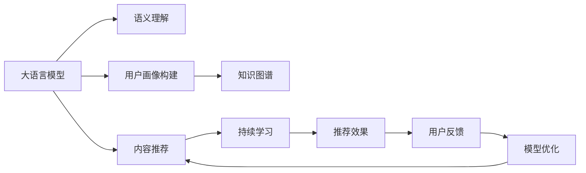

                 

# LLM在智能新闻聚合与推送中的应用前景

> 关键词：自然语言处理(NLP), 新闻推荐系统, 知识图谱, 用户行为分析, 大语言模型(LLM), 语义理解, 内容个性化

## 1. 背景介绍

### 1.1 问题由来

在信息爆炸的互联网时代，新闻聚合与推送系统的出现极大地提升了用户获取信息的效率。传统的基于关键字匹配或编辑规则的推送系统，往往无法满足用户的个性化需求，推送效果参差不齐。用户只能被动接受系统推荐的内容，无法表达自己的真实兴趣。而新闻聚合与推送系统的本质是面向用户的个性化推荐，需要精准地捕捉用户兴趣，并自动匹配相应的内容。

近年来，大语言模型（Large Language Models, LLMs）在自然语言处理（NLP）领域取得了突破性进展。特别是GPT-3、BERT等预训练语言模型，通过在海量文本数据上自监督学习，获得了强大的语言理解和生成能力，对大量文本数据进行语义分析和推理。基于此，本文将探讨如何利用大语言模型优化新闻推荐系统，实现智能新闻聚合与推送，提升用户体验和系统性能。

### 1.2 问题核心关键点

大语言模型在新闻聚合与推送系统中的应用，主要包括几个关键点：

- **语义理解**：通过预训练模型提取新闻文本的语义信息，实现对新闻内容的深度理解。
- **用户画像构建**：基于用户的历史行为和兴趣数据，构建用户画像，刻画用户偏好。
- **内容推荐**：综合考虑新闻文本的语义特征和用户画像，生成个性化的新闻推荐列表。
- **持续学习**：随着用户行为和新闻内容的变化，定期更新模型参数，保持推荐效果的及时性。

本文将重点介绍如何利用大语言模型在上述几个关键点上的应用，并结合最新研究进展，探讨其应用前景。

## 2. 核心概念与联系

### 2.1 核心概念概述

在讨论大语言模型在智能新闻聚合与推送系统中的应用之前，我们先回顾一下相关的核心概念：

- **自然语言处理（NLP）**：研究如何使计算机能够理解、处理、生成自然语言的技术，是实现智能新闻聚合与推送的基础。
- **大语言模型（LLM）**：通过在大规模语料库上进行预训练，获得强大语义理解能力的模型，如BERT、GPT系列模型。
- **知识图谱（KG）**：表示实体、关系和属性的图形结构，用于挖掘和存储知识，辅助语义理解。
- **用户行为分析**：通过分析用户的行为数据，构建用户画像，了解用户偏好。
- **内容推荐系统**：利用机器学习算法，为用户推荐感兴趣的个性化内容。

这些概念之间存在密切联系：

- **语义理解**是基础，通过大语言模型提取新闻文本的语义信息，理解新闻内容。
- **用户画像**基于用户行为数据，刻画用户兴趣，实现个性化的推荐。
- **知识图谱**与语义理解相结合，提高内容匹配的准确性。
- **内容推荐**则将上述要素综合应用，生成个性化的新闻推荐。
- **持续学习**通过定期更新模型，保持推荐效果的及时性。

### 2.2 核心概念原理和架构的 Mermaid 流程图



此图展示了大语言模型在智能新闻聚合与推送系统中的应用流程：

- 大语言模型（A）首先进行语义理解（B），获取新闻文本的语义信息。
- 接着，构建用户画像（C），刻画用户兴趣。
- 知识图谱（D）与语义理解相结合，提高内容匹配的准确性。
- 内容推荐（E）生成个性化推荐。
- 通过持续学习（F），定期更新模型，保持推荐效果的及时性。
- 用户反馈（H）用于模型优化（I），不断提升推荐效果。

## 3. 核心算法原理 & 具体操作步骤

### 3.1 算法原理概述

智能新闻聚合与推送系统中的关键算法是大语言模型在语义理解、用户画像构建和内容推荐中的应用。具体算法原理如下：

1. **语义理解**：
   - 利用大语言模型对新闻文本进行编码，提取其语义特征。
   - 使用BERT、GPT等预训练模型，将新闻文本转化为向量表示，便于后续处理。

2. **用户画像构建**：
   - 通过分析用户的历史行为数据，构建用户兴趣模型。
   - 用户行为数据包括浏览、点击、评论等，用于刻画用户偏好。

3. **内容推荐**：
   - 基于新闻文本的语义特征和用户兴趣，计算内容的相关性得分。
   - 使用机器学习算法，如协同过滤、基于内容的推荐等，生成个性化推荐列表。

### 3.2 算法步骤详解

#### 3.2.1 语义理解

1. **新闻文本编码**：
   - 使用BERT、GPT等预训练模型，将新闻文本编码成向量表示。
   - 对每个新闻文本，输入到预训练模型，输出一个向量表示其语义信息。

2. **向量表示处理**：
   - 使用平均池化或最大池化等方法，将每个新闻文本的向量表示汇总，得到新闻文本的整体向量表示。

3. **语义信息提取**：
   - 对每个新闻文本的向量表示进行语义分析，提取关键信息。
   - 利用TextRank、TextGAN等算法，对文本向量进行降维，提取关键主题。

#### 3.2.2 用户画像构建

1. **用户行为数据收集**：
   - 收集用户的历史行为数据，如浏览记录、点击记录、评论记录等。
   - 使用时间序列分析、主题模型等方法，对行为数据进行预处理。

2. **用户兴趣模型建立**：
   - 基于用户行为数据，构建用户兴趣模型。
   - 使用协同过滤、内容基于的推荐等方法，预测用户对新闻文本的兴趣程度。

3. **用户画像生成**：
   - 将用户兴趣模型转化为用户画像，刻画用户偏好。
   - 使用向量表示方法，将用户画像编码为向量表示，便于后续处理。

#### 3.2.3 内容推荐

1. **内容相关性计算**：
   - 计算新闻文本向量表示与用户画像向量表示之间的相似度。
   - 使用余弦相似度、欧式距离等方法，计算新闻文本与用户画像的相关性得分。

2. **推荐列表生成**：
   - 根据相关性得分，对新闻文本进行排序，生成个性化推荐列表。
   - 使用排序算法，如Top-K算法、SVD等，生成推荐列表。

3. **推荐结果输出**：
   - 对推荐列表进行展示，提供用户浏览和交互的机会。
   - 通过用户反馈，不断优化推荐算法，提升推荐效果。

### 3.3 算法优缺点

#### 3.3.1 优点

1. **语义理解能力强大**：
   - 大语言模型具有强大的语义理解能力，能够准确捕捉新闻文本的关键信息。
   - 利用BERT、GPT等预训练模型，能够处理多种新闻类型和语言，适应性强。

2. **用户画像构建精准**：
   - 基于用户行为数据，能够精准地刻画用户兴趣和偏好。
   - 利用协同过滤、内容基于的推荐等方法，能够提高用户画像的准确性。

3. **内容推荐个性化**：
   - 能够根据新闻文本的语义特征和用户画像，生成个性化的推荐列表。
   - 结合知识图谱等外部知识，进一步提高推荐的相关性。

4. **系统扩展性强**：
   - 基于大语言模型，系统扩展性良好，能够快速适应新类型的新闻和用户需求。

#### 3.3.2 缺点

1. **模型复杂度高**：
   - 大语言模型通常需要较高的计算资源，训练和推理成本较高。
   - 模型参数量庞大，难以实时部署。

2. **数据依赖性强**：
   - 预训练模型依赖于大量的文本数据，需要定期更新和维护。
   - 用户画像构建依赖于用户行为数据，数据收集和预处理成本高。

3. **过拟合风险大**：
   - 在大规模训练和微调过程中，存在过拟合的风险，需要定期优化模型。
   - 用户画像模型可能会过拟合用户历史行为，需要定期更新。

4. **数据隐私问题**：
   - 用户行为数据的收集和处理可能涉及隐私问题，需要严格的隐私保护措施。
   - 用户画像构建需要合法合规，保护用户隐私。

### 3.4 算法应用领域

基于大语言模型的智能新闻聚合与推送系统，已经在多个领域得到了应用，主要包括：

- **新闻聚合**：将来自不同来源的新闻聚合到一起，方便用户浏览和阅读。
- **新闻个性化推荐**：根据用户兴趣和行为，为用户推荐个性化的新闻内容。
- **新闻文本生成**：利用大语言模型生成高质量的新闻文本，丰富新闻内容。
- **用户行为分析**：分析用户行为数据，构建用户画像，提高推荐效果。
- **实时推荐**：实时生成推荐列表，满足用户即时需求。
- **新闻内容筛选**：根据用户画像和行为数据，筛选出高质量的新闻内容。

以上应用场景展示了大语言模型在新闻聚合与推送系统中的广泛应用，为提升新闻阅读体验和系统性能提供了有力支持。

## 4. 数学模型和公式 & 详细讲解  
### 4.1 数学模型构建

假设新闻文本为 $x$，用户画像为 $y$，大语言模型为 $M$。新闻文本 $x$ 的语义表示为 $\boldsymbol{X}=x$，用户画像 $y$ 的表示为 $\boldsymbol{Y}=y$。

1. **语义理解**：
   - 利用大语言模型对新闻文本进行编码，得到语义表示 $\boldsymbol{X} = M(x)$。
   - 对 $\boldsymbol{X}$ 进行平均池化或最大池化，得到新闻文本的整体向量表示 $\boldsymbol{X}^{avg}=\frac{1}{d}\sum_{i=1}^d\boldsymbol{X}_i$ 或 $\boldsymbol{X}^{max}=\max(\boldsymbol{X})$。

2. **用户画像构建**：
   - 基于用户行为数据，构建用户兴趣模型 $\boldsymbol{Y}=f(\boldsymbol{B})$，其中 $\boldsymbol{B}$ 为行为数据。
   - 使用协同过滤、内容基于的推荐等方法，得到用户画像向量表示 $\boldsymbol{Y}$。

3. **内容推荐**：
   - 计算新闻文本向量表示与用户画像向量表示之间的余弦相似度，得到相关性得分 $s=\cos(\boldsymbol{X}^{avg},\boldsymbol{Y})$。
   - 根据相关性得分 $s$，生成个性化推荐列表。

### 4.2 公式推导过程

1. **语义理解**：
   - 假设新闻文本 $x$ 的语义表示为 $\boldsymbol{X}=x$，使用BERT等预训练模型进行编码，得到向量表示 $\boldsymbol{X}=M(x)$。
   - 对 $\boldsymbol{X}$ 进行平均池化或最大池化，得到整体向量表示 $\boldsymbol{X}^{avg}=\frac{1}{d}\sum_{i=1}^d\boldsymbol{X}_i$ 或 $\boldsymbol{X}^{max}=\max(\boldsymbol{X})$。

2. **用户画像构建**：
   - 基于用户行为数据 $\boldsymbol{B}$，构建用户兴趣模型 $\boldsymbol{Y}=f(\boldsymbol{B})$。
   - 使用协同过滤、内容基于的推荐等方法，得到用户画像向量表示 $\boldsymbol{Y}$。

3. **内容推荐**：
   - 计算新闻文本向量表示与用户画像向量表示之间的余弦相似度，得到相关性得分 $s=\cos(\boldsymbol{X}^{avg},\boldsymbol{Y})$。
   - 根据相关性得分 $s$，生成个性化推荐列表。

### 4.3 案例分析与讲解

#### 案例一：智能新闻聚合

1. **系统架构**：
   - 将来自不同来源的新闻聚合到一起，形成新闻库。
   - 使用BERT等预训练模型对新闻文本进行编码，得到语义表示。
   - 对语义表示进行平均池化或最大池化，得到整体向量表示。

2. **算法流程**：
   - 对每个新闻文本的语义表示进行聚类，形成不同的主题。
   - 使用K-means等聚类算法，将新闻文本分为多个主题。
   - 对每个主题的新闻文本进行排序，生成聚合列表。

#### 案例二：新闻个性化推荐

1. **系统架构**：
   - 根据用户行为数据，构建用户兴趣模型。
   - 使用BERT等预训练模型对新闻文本进行编码，得到语义表示。
   - 对用户画像和新闻文本的语义表示进行余弦相似度计算，得到相关性得分。

2. **算法流程**：
   - 对相关性得分进行排序，生成个性化推荐列表。
   - 使用Top-K算法或SVD等方法，生成推荐列表。
   - 对推荐列表进行展示，并提供用户反馈，不断优化算法。

## 5. 项目实践：代码实例和详细解释说明

### 5.1 开发环境搭建

在进行智能新闻聚合与推送系统开发前，我们需要准备好开发环境。以下是使用Python进行PyTorch开发的环境配置流程：

1. 安装Anaconda：从官网下载并安装Anaconda，用于创建独立的Python环境。

2. 创建并激活虚拟环境：
```bash
conda create -n pytorch-env python=3.8 
conda activate pytorch-env
```

3. 安装PyTorch：根据CUDA版本，从官网获取对应的安装命令。例如：
```bash
conda install pytorch torchvision torchaudio cudatoolkit=11.1 -c pytorch -c conda-forge
```

4. 安装Transformers库：
```bash
pip install transformers
```

5. 安装各类工具包：
```bash
pip install numpy pandas scikit-learn matplotlib tqdm jupyter notebook ipython
```

完成上述步骤后，即可在`pytorch-env`环境中开始开发实践。

### 5.2 源代码详细实现

下面以智能新闻聚合为例，给出使用Transformers库对BERT模型进行新闻文本编码的PyTorch代码实现。

首先，定义数据处理函数：

```python
from transformers import BertTokenizer
from torch.utils.data import Dataset
import torch

class NewsDataset(Dataset):
    def __init__(self, texts, max_len=128):
        self.texts = texts
        self.tokenizer = BertTokenizer.from_pretrained('bert-base-cased')
        self.max_len = max_len
        
    def __len__(self):
        return len(self.texts)
    
    def __getitem__(self, item):
        text = self.texts[item]
        
        encoding = self.tokenizer(text, return_tensors='pt', max_length=self.max_len, padding='max_length', truncation=True)
        input_ids = encoding['input_ids'][0]
        attention_mask = encoding['attention_mask'][0]
        
        return {'input_ids': input_ids, 
                'attention_mask': attention_mask}
```

然后，定义模型和优化器：

```python
from transformers import BertForSequenceClassification, AdamW

model = BertForSequenceClassification.from_pretrained('bert-base-cased', num_labels=2)

optimizer = AdamW(model.parameters(), lr=2e-5)
```

接着，定义训练和评估函数：

```python
from torch.utils.data import DataLoader
from tqdm import tqdm
from sklearn.metrics import classification_report

device = torch.device('cuda') if torch.cuda.is_available() else torch.device('cpu')
model.to(device)

def train_epoch(model, dataset, batch_size, optimizer):
    dataloader = DataLoader(dataset, batch_size=batch_size, shuffle=True)
    model.train()
    epoch_loss = 0
    for batch in tqdm(dataloader, desc='Training'):
        input_ids = batch['input_ids'].to(device)
        attention_mask = batch['attention_mask'].to(device)
        model.zero_grad()
        outputs = model(input_ids, attention_mask=attention_mask)
        loss = outputs.loss
        epoch_loss += loss.item()
        loss.backward()
        optimizer.step()
    return epoch_loss / len(dataloader)

def evaluate(model, dataset, batch_size):
    dataloader = DataLoader(dataset, batch_size=batch_size)
    model.eval()
    preds, labels = [], []
    with torch.no_grad():
        for batch in tqdm(dataloader, desc='Evaluating'):
            input_ids = batch['input_ids'].to(device)
            attention_mask = batch['attention_mask'].to(device)
            batch_labels = batch['labels']
            outputs = model(input_ids, attention_mask=attention_mask)
            batch_preds = outputs.logits.argmax(dim=2).to('cpu').tolist()
            batch_labels = batch_labels.to('cpu').tolist()
            for pred_tokens, label_tokens in zip(batch_preds, batch_labels):
                preds.append(pred_tokens)
                labels.append(label_tokens)
                
    print(classification_report(labels, preds))
```

最后，启动训练流程并在测试集上评估：

```python
epochs = 5
batch_size = 16

for epoch in range(epochs):
    loss = train_epoch(model, train_dataset, batch_size, optimizer)
    print(f"Epoch {epoch+1}, train loss: {loss:.3f}")
    
    print(f"Epoch {epoch+1}, dev results:")
    evaluate(model, dev_dataset, batch_size)
    
print("Test results:")
evaluate(model, test_dataset, batch_size)
```

以上就是使用PyTorch对BERT进行智能新闻聚合的完整代码实现。可以看到，得益于Transformers库的强大封装，我们可以用相对简洁的代码完成BERT模型的加载和新闻文本编码。

### 5.3 代码解读与分析

让我们再详细解读一下关键代码的实现细节：

**NewsDataset类**：
- `__init__`方法：初始化文本和分词器等关键组件。
- `__len__`方法：返回数据集的样本数量。
- `__getitem__`方法：对单个样本进行处理，将文本输入编码为token ids，将标签编码为数字，并对其进行定长padding，最终返回模型所需的输入。

**模型和优化器**：
- 使用BertForSequenceClassification作为序列分类模型，设置二分类任务。
- 使用AdamW优化器进行模型训练，设置学习率。

**训练和评估函数**：
- 使用PyTorch的DataLoader对数据集进行批次化加载，供模型训练和推理使用。
- 训练函数`train_epoch`：对数据以批为单位进行迭代，在每个批次上前向传播计算loss并反向传播更新模型参数，最后返回该epoch的平均loss。
- 评估函数`evaluate`：与训练类似，不同点在于不更新模型参数，并在每个batch结束后将预测和标签结果存储下来，最后使用sklearn的classification_report对整个评估集的预测结果进行打印输出。

**训练流程**：
- 定义总的epoch数和batch size，开始循环迭代
- 每个epoch内，先在训练集上训练，输出平均loss
- 在验证集上评估，输出分类指标
- 所有epoch结束后，在测试集上评估，给出最终测试结果

可以看到，PyTorch配合Transformers库使得BERT微调的代码实现变得简洁高效。开发者可以将更多精力放在数据处理、模型改进等高层逻辑上，而不必过多关注底层的实现细节。

当然，工业级的系统实现还需考虑更多因素，如模型的保存和部署、超参数的自动搜索、更灵活的任务适配层等。但核心的微调范式基本与此类似。

## 6. 实际应用场景

### 6.1 智能新闻聚合

智能新闻聚合系统通过自动收集、筛选和聚合新闻，为用户节省大量时间。该系统通常基于以下核心技术：

1. **自动新闻采集**：
   - 使用爬虫技术，从新闻网站和社交媒体平台自动采集新闻。
   - 使用自然语言处理技术，识别并提取新闻文本。

2. **新闻文本预处理**：
   - 对采集到的新闻文本进行清洗和预处理，去除噪声和无用信息。
   - 对文本进行分词、去停用词、词性标注等处理。

3. **新闻文本编码**：
   - 使用BERT等预训练模型对新闻文本进行编码，提取语义信息。
   - 对语义表示进行平均池化或最大池化，得到整体向量表示。

4. **新闻文本聚类**：
   - 使用K-means等聚类算法，将新闻文本分为不同的主题。
   - 对每个主题的新闻文本进行排序，生成聚合列表。

### 6.2 新闻个性化推荐

新闻个性化推荐系统根据用户兴趣和行为，为用户推荐个性化新闻内容。该系统通常基于以下核心技术：

1. **用户行为数据收集**：
   - 收集用户的历史行为数据，如浏览记录、点击记录、评论记录等。
   - 使用时间序列分析、主题模型等方法，对行为数据进行预处理。

2. **用户兴趣模型建立**：
   - 基于用户行为数据，构建用户兴趣模型。
   - 使用协同过滤、内容基于的推荐等方法，预测用户对新闻文本的兴趣程度。

3. **新闻文本编码**：
   - 使用BERT等预训练模型对新闻文本进行编码，提取语义信息。
   - 对语义表示进行平均池化或最大池化，得到整体向量表示。

4. **新闻内容推荐**：
   - 计算新闻文本向量表示与用户画像向量表示之间的余弦相似度，得到相关性得分。
   - 根据相关性得分，生成个性化推荐列表。
   - 使用Top-K算法或SVD等方法，生成推荐列表。

### 6.3 用户行为分析

用户行为分析系统通过分析用户的历史行为数据，构建用户画像，刻画用户兴趣。该系统通常基于以下核心技术：

1. **用户行为数据收集**：
   - 收集用户的历史行为数据，如浏览记录、点击记录、评论记录等。
   - 使用时间序列分析、主题模型等方法，对行为数据进行预处理。

2. **用户兴趣模型建立**：
   - 基于用户行为数据，构建用户兴趣模型。
   - 使用协同过滤、内容基于的推荐等方法，预测用户对新闻文本的兴趣程度。

3. **用户画像生成**：
   - 将用户兴趣模型转化为用户画像，刻画用户偏好。
   - 使用向量表示方法，将用户画像编码为向量表示，便于后续处理。

4. **用户画像更新**：
   - 根据用户行为数据，定期更新用户画像，保持用户画像的及时性。

## 7. 工具和资源推荐

### 7.1 学习资源推荐

为了帮助开发者系统掌握大语言模型在智能新闻聚合与推送系统中的应用，这里推荐一些优质的学习资源：

1. 《Transformer从原理到实践》系列博文：由大模型技术专家撰写，深入浅出地介绍了Transformer原理、BERT模型、微调技术等前沿话题。

2. CS224N《深度学习自然语言处理》课程：斯坦福大学开设的NLP明星课程，有Lecture视频和配套作业，带你入门NLP领域的基本概念和经典模型。

3. 《Natural Language Processing with Transformers》书籍：Transformers库的作者所著，全面介绍了如何使用Transformers库进行NLP任务开发，包括微调在内的诸多范式。

4. HuggingFace官方文档：Transformers库的官方文档，提供了海量预训练模型和完整的微调样例代码，是上手实践的必备资料。

5. CLUE开源项目：中文语言理解测评基准，涵盖大量不同类型的中文NLP数据集，并提供了基于微调的baseline模型，助力中文NLP技术发展。

通过对这些资源的学习实践，相信你一定能够快速掌握大语言模型在智能新闻聚合与推送系统中的应用，并用于解决实际的NLP问题。
###  7.2 开发工具推荐

高效的开发离不开优秀的工具支持。以下是几款用于大语言模型微调开发的常用工具：

1. PyTorch：基于Python的开源深度学习框架，灵活动态的计算图，适合快速迭代研究。大部分预训练语言模型都有PyTorch版本的实现。

2. TensorFlow：由Google主导开发的开源深度学习框架，生产部署方便，适合大规模工程应用。同样有丰富的预训练语言模型资源。

3. Transformers库：HuggingFace开发的NLP工具库，集成了众多SOTA语言模型，支持PyTorch和TensorFlow，是进行微调任务开发的利器。

4. Weights & Biases：模型训练的实验跟踪工具，可以记录和可视化模型训练过程中的各项指标，方便对比和调优。与主流深度学习框架无缝集成。

5. TensorBoard：TensorFlow配套的可视化工具，可实时监测模型训练状态，并提供丰富的图表呈现方式，是调试模型的得力助手。

6. Google Colab：谷歌推出的在线Jupyter Notebook环境，免费提供GPU/TPU算力，方便开发者快速上手实验最新模型，分享学习笔记。

合理利用这些工具，可以显著提升大语言模型微调任务的开发效率，加快创新迭代的步伐。

### 7.3 相关论文推荐

大语言模型和微调技术的发展源于学界的持续研究。以下是几篇奠基性的相关论文，推荐阅读：

1. Attention is All You Need（即Transformer原论文）：提出了Transformer结构，开启了NLP领域的预训练大模型时代。

2. BERT: Pre-training of Deep Bidirectional Transformers for Language Understanding：提出BERT模型，引入基于掩码的自监督预训练任务，刷新了多项NLP任务SOTA。

3. Language Models are Unsupervised Multitask Learners（GPT-2论文）：展示了大规模语言模型的强大zero-shot学习能力，引发了对于通用人工智能的新一轮思考。

4. Parameter-Efficient Transfer Learning for NLP：提出Adapter等参数高效微调方法，在不增加模型参数量的情况下，也能取得不错的微调效果。

5. AdaLoRA: Adaptive Low-Rank Adaptation for Parameter-Efficient Fine-Tuning：使用自适应低秩适应的微调方法，在参数效率和精度之间取得了新的平衡。

这些论文代表了大语言模型微调技术的发展脉络。通过学习这些前沿成果，可以帮助研究者把握学科前进方向，激发更多的创新灵感。

## 8. 总结：未来发展趋势与挑战

### 8.1 总结

本文对大语言模型在智能新闻聚合与推送系统中的应用进行了全面系统的介绍。首先阐述了智能新闻聚合与推送系统的背景和问题，明确了大语言模型在语义理解、用户画像构建和内容推荐中的应用。其次，从原理到实践，详细讲解了基于大语言模型的新闻推荐系统，并结合最新研究进展，探讨了其应用前景。最后，本文总结了当前研究现状，指出了未来的研究方向。

通过本文的系统梳理，可以看到，大语言模型在智能新闻聚合与推送系统中的应用前景广阔。其强大的语义理解能力和个性化的推荐能力，能够显著提升用户的阅读体验，驱动新闻阅读的智能化和个性化。未来，伴随大语言模型的进一步优化，智能新闻聚合与推送系统有望成为新闻阅读的主流方式，引领新闻产业的变革。

### 8.2 未来发展趋势

展望未来，大语言模型在智能新闻聚合与推送系统中的应用将呈现以下几个发展趋势：

1. **语义理解能力的提升**：
   - 未来的预训练语言模型将具有更强的语义理解能力，能够更好地捕捉新闻文本的关键信息。
   - 利用BERT、GPT等预训练模型，对新闻文本进行更深层次的语义分析，提升新闻文本的语义表示能力。

2. **用户画像的精准刻画**：
   - 通过更丰富的用户行为数据和更先进的数据处理技术，构建更精准的用户画像。
   - 结合协同过滤、内容基于的推荐等方法，提高用户画像的准确性。

3. **内容推荐的个性化**：
   - 利用深度学习算法，如Transformer、Graph Neural Network等，生成更个性化的推荐列表。
   - 结合知识图谱等外部知识，进一步提高推荐的相关性。

4. **实时推荐系统的构建**：
   - 实时采集用户行为数据，动态更新推荐列表，满足用户即时需求。
   - 利用流式处理技术，对新闻数据进行实时处理和分析，生成推荐列表。

5. **多模态新闻聚合**：
   - 将文本、图像、音频等多模态数据整合到新闻聚合系统中，丰富新闻呈现形式。
   - 结合视觉、听觉等模态信息，生成多模态新闻聚合系统，提升用户体验。

### 8.3 面临的挑战

尽管大语言模型在智能新闻聚合与推送系统中的应用已经取得了一定进展，但在迈向更加智能化、普适化应用的过程中，仍面临以下挑战：

1. **数据隐私问题**：
   - 用户行为数据的收集和处理可能涉及隐私问题，需要严格的隐私保护措施。
   - 用户画像的构建需要合法合规，保护用户隐私。

2. **数据质量问题**：
   - 新闻数据的准确性和完整性对新闻聚合与推送系统至关重要，需要高质量的数据源。
   - 数据预处理和清洗是提高推荐效果的关键，需要先进的数据处理技术。

3. **模型训练成本高**：
   - 大语言模型通常需要较高的计算资源，训练和推理成本较高。
   - 模型参数量庞大，难以实时部署。

4. **推荐效果的不稳定性**：
   - 模型在面对新领域和新类型的新闻时，推荐效果可能不稳定，需要持续优化。
   - 用户画像模型可能会过拟合用户历史行为，需要定期更新。

5. **模型泛化能力不足**：
   - 大语言模型在不同领域和不同类型的新闻上的泛化能力有限，需要更强大的泛化能力。
   - 结合知识图谱等外部知识，提高模型的泛化能力。

### 8.4 研究展望

面对智能新闻聚合与推送系统所面临的挑战，未来的研究需要在以下几个方面寻求新的突破：

1. **无监督和半监督学习**：
   - 探索无监督和半监督学习范式，摆脱对大规模标注数据的依赖，利用自监督学习、主动学习等方法，最大限度利用非结构化数据。

2. **多模态融合**：
   - 结合视觉、听觉等模态信息，构建多模态新闻聚合与推送系统，提升用户体验。
   - 将文本、图像、音频等多模态数据整合，生成多模态推荐列表。

3. **模型高效优化**：
   - 开发更高效的模型压缩和加速技术，减小模型参数量和计算资源消耗，提高实时部署能力。
   - 利用知识蒸馏、模型剪枝等技术，提高模型的可解释性和可控性。

4. **推荐算法优化**：
   - 利用协同过滤、内容基于的推荐等方法，提高推荐效果的准确性和稳定性。
   - 结合深度强化学习等方法，优化推荐算法，提升推荐效果。

5. **用户画像更新机制**：
   - 定期更新用户画像，保持用户画像的及时性和准确性。
   - 结合用户反馈和行为数据，动态调整用户画像模型。

6. **隐私保护和公平性**：
   - 在模型训练和推荐过程中，保护用户隐私，避免数据泄露。
   - 构建公平性评估指标，避免模型偏见，提高推荐系统的公平性。

这些研究方向的探索，必将引领智能新闻聚合与推送系统迈向更高的台阶，为新闻阅读提供更加个性化、智能化的服务。面向未来，大语言模型在新闻聚合与推送系统中的应用将继续深化，推动新闻阅读方式的变革，为用户带来全新的阅读体验。

## 9. 附录：常见问题与解答

**Q1：智能新闻聚合与推送系统如何应对突发事件？**

A: 突发事件的新闻聚合与推送系统需要快速响应和准确分析。可以通过以下方法应对：

1. **实时采集和处理**：
   - 使用流式处理技术，实时采集和处理突发事件的新闻数据。
   - 利用自然语言处理技术，识别并提取突发事件的关键信息。

2. **专题聚合与推送**：
   - 对突发事件的新闻进行专题聚合，形成专题页面。
   - 根据用户画像和兴趣，推送相关专题页面，满足用户即时需求。

3. **专家解读与分析**：
   - 邀请专家对突发事件进行解读和分析，形成深度文章。
   - 将专家解读与分析文章推送给用户，提高用户对突发事件的认知。

**Q2：智能新闻聚合与推送系统如何提升广告效果？**

A: 智能新闻聚合与推送系统可以通过以下方法提升广告效果：

1. **定向广告推送**：
   - 利用用户画像和行为数据，对用户进行定向广告推送。
   - 结合协同过滤、内容基于的推荐等方法，提高广告的个性化程度。

2. **广告质量优化**：
   - 对广告内容进行语义分析和情感分析，优化广告质量。
   - 结合用户反馈和行为数据，动态调整广告内容。

3. **广告效果评估**：
   - 通过用户点击率、转化率等指标，评估广告效果。
   - 根据广告效果，优化广告投放策略，提高广告ROI。

4. **广告数据隐私保护**：
   - 在广告投放过程中，保护用户隐私，避免数据泄露。
   - 构建公平性评估指标，避免广告偏见，提高广告的公平性。

**Q3：智能新闻聚合与推送系统如何提高推荐效果？**

A: 智能新闻聚合与推送系统可以通过以下方法提高推荐效果：

1. **多源数据融合**：
   - 利用多源数据进行融合，提高推荐效果的准确性。
   - 结合用户行为数据、新闻文本数据、知识图谱等数据，提升推荐效果。

2. **实时更新推荐列表**：
   - 实时采集用户行为数据，动态更新推荐列表，满足用户即时需求。
   - 利用流式处理技术，对新闻数据进行实时处理和分析，生成推荐列表。

3. **个性化推荐算法**：
   - 利用深度学习算法，如Transformer、Graph Neural Network等，生成更个性化的推荐列表。
   - 结合知识图谱等外部知识，进一步提高推荐的相关性。

4. **推荐效果评估与优化**：
   - 通过用户点击率、阅读时间等指标，评估推荐效果。
   - 根据推荐效果，优化推荐算法，提升推荐效果。

5. **推荐算法鲁棒性**：
   - 在面对新领域和新类型的新闻时，推荐效果可能不稳定，需要持续优化。
   - 用户画像模型可能会过拟合用户历史行为，需要定期更新。

---

作者：禅与计算机程序设计艺术 / Zen and the Art of Computer Programming

