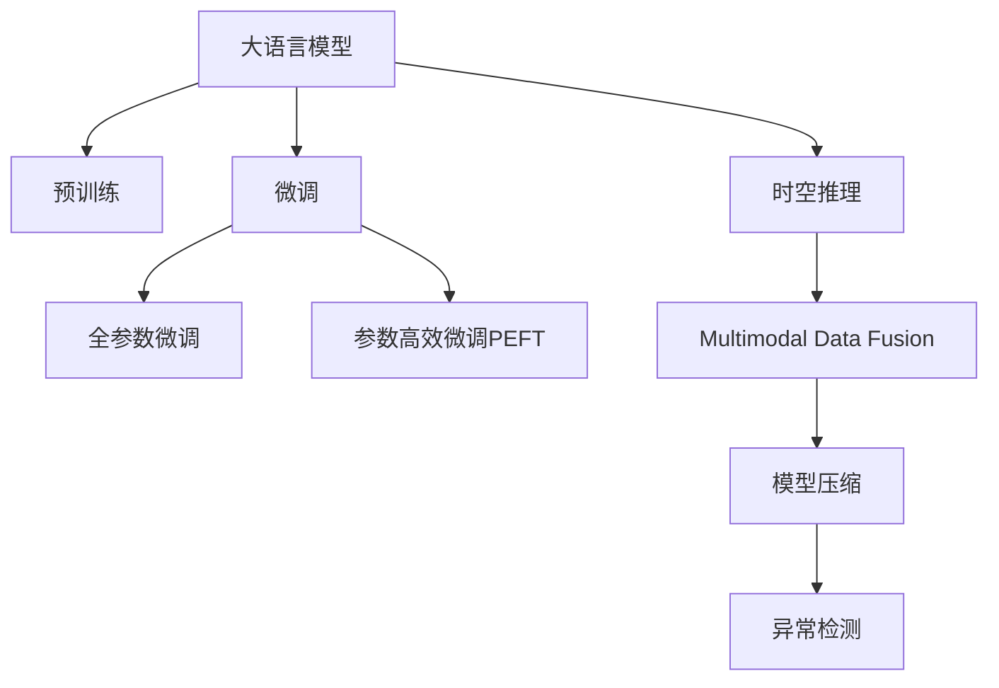

                 

# LLM在智能空气质量预测中的潜在作用

## 1. 背景介绍

### 1.1 问题由来

随着全球化进程的加快和工业化水平的提升，环境污染问题日益严重。特别是空气质量问题，直接影响到人们的健康和生活质量。空气质量监测和管理已经成为各国政府和相关机构重点关注的内容。传统的空气质量监测主要依靠人工观测和有限的传感器数据，难以全面覆盖复杂的地理环境和动态变化的污染源。

近年来，人工智能技术特别是大语言模型（LLM）的兴起，为智能空气质量预测提供了新的可能性。LLM通过海量的语料数据预训练，学习到丰富的语言和世界知识，具有强大的语言理解和生成能力。在空气质量预测中，LLM可以将天气、污染源、历史数据等多模态信息融合，进行推理和预测，提升预测的准确性和时效性。

### 1.2 问题核心关键点

智能空气质量预测的关键在于如何利用LLM的学习能力和推理能力，高效地整合和处理多源数据，准确预测空气质量变化。主要包括以下几个关键点：

1. 多模态数据融合：如何将天气、污染源、历史数据等多模态信息融合，进行有效的特征提取和融合。
2. 时空推理：如何利用LLM的推理能力，进行空间和时间的推理，构建动态变化的预测模型。
3. 数据高效利用：如何在数据匮乏的情况下，高效利用现有数据进行模型训练和预测。
4. 预测效果评估：如何评估预测模型的准确性和实时性，确保其在实际应用中的有效性。

## 2. 核心概念与联系

### 2.1 核心概念概述

为更好地理解LLM在智能空气质量预测中的应用，本节将介绍几个密切相关的核心概念：

- 大语言模型(Large Language Model, LLM)：以自回归(如GPT)或自编码(如BERT)模型为代表的大规模预训练语言模型。通过在大规模无标签文本语料上进行预训练，学习通用的语言表示，具备强大的语言理解和生成能力。

- 预训练(Pre-training)：指在大规模无标签文本语料上，通过自监督学习任务训练通用语言模型的过程。常见的预训练任务包括言语建模、遮挡语言模型等。

- 微调(Fine-tuning)：指在预训练模型的基础上，使用下游任务的少量标注数据，通过有监督地训练来优化模型在特定任务上的性能。

- 迁移学习(Transfer Learning)：指将一个领域学习到的知识，迁移应用到另一个不同但相关的领域的学习范式。LLM的预训练-微调过程即是一种典型的迁移学习方式。

- 时空推理(Space-time Reasoning)：指模型能够结合空间和时间信息，进行推理和预测的能力。在空气质量预测中，时空推理是至关重要的。

- 多模态数据融合(Multimodal Data Fusion)：指将不同来源的数据（如气象数据、传感器数据、卫星遥感数据等）进行整合和处理，构建多源信息的融合模型。

- 模型压缩(Compression)：指在保持模型性能的同时，减少其参数量或计算量，提高模型的实时性和可部署性。

- 异常检测(Anomaly Detection)：指在空气质量预测中，识别出异常的污染事件或数据波动，及时预警和处理。

这些核心概念之间的逻辑关系可以通过以下Mermaid流程图来展示：



这个流程图展示了大语言模型的核心概念及其之间的关系：

1. 大语言模型通过预训练获得基础能力。
2. 微调是对预训练模型进行任务特定的优化，可以分为全参数微调和参数高效微调（PEFT）。
3. 时空推理是一种不更新模型参数的方法，可以实现时空数据的融合和推理。
4. 多模态数据融合是利用多种传感器和数据源，提升预测模型的准确性和全面性。
5. 模型压缩是在保持性能的同时，减小模型的存储和计算需求。
6. 异常检测是在模型预测中识别出异常事件，提高预测的可靠性和及时性。

这些概念共同构成了LLM在智能空气质量预测中的应用框架，使其能够在多模态数据融合、时空推理等复杂场景中发挥强大的预测能力。

## 3. 核心算法原理 & 具体操作步骤

### 3.1 算法原理概述

LLM在智能空气质量预测中的应用，本质上是将LLM视作一个强大的"特征提取器"，通过时空推理和多模态数据融合，将多源数据高效整合，构建动态变化的预测模型。其核心思想是：将气象、污染源、历史数据等非结构化数据，转换为数值化输入，利用LLM的推理能力，进行时空推理和预测。

形式化地，假设LLM为$M_{\theta}$，其中$\theta$为预训练得到的模型参数。设$\mathcal{X}$为输入空间，$\mathcal{Y}$为输出空间，$\mathcal{F}$为特征提取函数，将输入数据映射到特征空间$\mathcal{F}(\mathcal{X})$。设$\mathcal{G}$为时空推理函数，利用LLM对时空数据进行推理。设$\mathcal{A}$为多模态数据融合函数，将不同模态的数据进行整合。设$\mathcal{L}$为损失函数，用于衡量模型预测输出与真实标签之间的差异。

智能空气质量预测的目标是找到最优模型参数$\theta^*$，使得：

$$
\theta^* = \mathop{\arg\min}_{\theta} \mathcal{L}(M_{\theta}(\mathcal{A}(\mathcal{G}(\mathcal{F}(\mathcal{X}))), \mathcal{Y})
$$

通过梯度下降等优化算法，微调过程不断更新模型参数$\theta$，最小化损失函数$\mathcal{L}$，使得模型输出逼近真实标签。由于$\theta$已经通过预训练获得了较好的初始化，因此即便在数据匮乏的情况下，LLM也能够快速收敛到理想的模型参数$\hat{\theta}$。

### 3.2 算法步骤详解

LLM在智能空气质量预测中的应用，一般包括以下几个关键步骤：

**Step 1: 准备预训练模型和数据集**
- 选择合适的预训练语言模型$M_{\theta}$作为初始化参数，如BERT、GPT等。
- 准备气象、污染源、历史数据等非结构化数据集$\mathcal{X}$，并将其转换为数值化输入。

**Step 2: 添加任务适配层**
- 根据任务需求，在预训练模型的顶层设计合适的输出层和损失函数。例如，可以使用分类任务、回归任务等适配层。

**Step 3: 设置微调超参数**
- 选择合适的优化算法及其参数，如AdamW、SGD等，设置学习率、批大小、迭代轮数等。
- 设置正则化技术及强度，包括权重衰减、Dropout、Early Stopping等。
- 确定冻结预训练参数的策略，如仅微调顶层，或全部参数都参与微调。

**Step 4: 执行梯度训练**
- 将训练集数据分批次输入模型，前向传播计算损失函数。
- 反向传播计算参数梯度，根据设定的优化算法和学习率更新模型参数。
- 周期性在验证集上评估模型性能，根据性能指标决定是否触发Early Stopping。
- 重复上述步骤直到满足预设的迭代轮数或Early Stopping条件。

**Step 5: 测试和部署**
- 在测试集上评估微调后模型$M_{\hat{\theta}}$的性能，对比微调前后的精度提升。
- 使用微调后的模型对新数据进行推理预测，集成到实际的应用系统中。
- 持续收集新的数据，定期重新微调模型，以适应数据分布的变化。

以上是LLM在智能空气质量预测的一般流程。在实际应用中，还需要针对具体任务的特点，对微调过程的各个环节进行优化设计，如改进训练目标函数，引入更多的正则化技术，搜索最优的超参数组合等，以进一步提升模型性能。

### 3.3 算法优缺点

LLM在智能空气质量预测中的微调方法具有以下优点：
1. 数据利用效率高。通过预训练学习到的广泛知识，LLM可以高效利用少量标注数据，提升预测准确性。
2. 模型表现稳定。预训练模型具有较好的泛化能力，即使在数据量不足的情况下，也能保持稳定的预测效果。
3. 推理速度快。LLM的推理过程高效，能够快速处理大规模数据集，实时输出预测结果。
4. 模型可解释性强。通过分析LLM的推理过程，可以了解预测结果的逻辑和依据，增强模型的可解释性。

同时，该方法也存在一定的局限性：
1. 模型复杂度高。预训练模型的参数量较大，计算资源需求高。
2. 模型训练时间长。特别是在大规模数据集上的微调，训练时间较长。
3. 数据依赖性强。微调效果高度依赖于训练数据的质量和数量，数据不足可能导致预测精度下降。
4. 模型解释性差。LLM的内部工作机制复杂，难以直接解释预测结果。

尽管存在这些局限性，但就目前而言，LLM在智能空气质量预测中的应用仍是大数据和深度学习技术的有力代表。未来相关研究的重点在于如何进一步降低微调对标注数据的依赖，提高模型的泛化能力，同时兼顾可解释性和伦理安全性等因素。

### 3.4 算法应用领域

LLM在智能空气质量预测中的应用，已经得到了广泛的应用，覆盖了诸多领域，例如：

- 气象预报：利用气象数据进行温度、湿度、风速等预测。
- 污染源追踪：利用卫星遥感数据和地面监测数据进行污染源追踪和污染预警。
- 健康风险评估：结合天气和空气质量数据，评估特定地区空气污染对健康的风险。
- 城市管理：将空气质量预测应用于城市规划和管理，优化城市环境和交通管理。
- 工业排污监测：结合工业企业的生产数据，预测污染物的排放和扩散。

除了上述这些经典应用外，LLM在空气质量预测中的应用还在不断扩展，如公共卫生预测、应急响应、环境监测等，为智能城市的建设提供了新的技术手段。随着预训练模型和微调方法的不断进步，相信LLM在智能空气质量预测中的应用将更加广泛和深入。

## 4. 数学模型和公式 & 详细讲解 & 举例说明

### 4.1 数学模型构建

本节将使用数学语言对LLM在智能空气质量预测中的应用进行更加严格的刻画。

记气象、污染源、历史数据等非结构化数据集为$\mathcal{X}$，其数值化输入为$\mathcal{X} \rightarrow \mathcal{X'}$。设LLM的预训练模型为$M_{\theta}$，其中$\theta$为模型参数。设$\mathcal{G}$为时空推理函数，利用LLM对时空数据进行推理。设$\mathcal{A}$为多模态数据融合函数，将不同模态的数据进行整合。设$\mathcal{L}$为损失函数，用于衡量模型预测输出与真实标签之间的差异。

定义模型$M_{\theta}$在输入数据$\mathcal{X'}$上的输出为$\hat{y}=M_{\theta}(\mathcal{X'})$，表示预测值。真实标签为$y$，其中$y \in \mathcal{Y}$。则智能空气质量预测的损失函数$\mathcal{L}$定义为：

$$
\mathcal{L}(\theta) = \mathbb{E}_{\mathcal{X}}[\ell(M_{\theta}(\mathcal{A}(\mathcal{G}(\mathcal{X})), y)]
$$

其中$\ell$为损失函数，用于衡量模型预测输出与真实标签之间的差异。

通过梯度下降等优化算法，微调过程不断更新模型参数$\theta$，最小化损失函数$\mathcal{L}$，使得模型输出逼近真实标签。由于$\theta$已经通过预训练获得了较好的初始化，因此即便在数据匮乏的情况下，LLM也能够快速收敛到理想的模型参数$\hat{\theta}$。

### 4.2 公式推导过程

以下我们以气象预测为例，推导损失函数的计算公式。

假设模型$M_{\theta}$在输入$x$上的输出为$\hat{y}=M_{\theta}(x) \in [0,1]$，表示预测值。真实标签$y \in \{0,1\}$。则二分类交叉熵损失函数定义为：

$$
\ell(M_{\theta}(x),y) = -[y\log \hat{y} + (1-y)\log (1-\hat{y})]
$$

将其代入经验风险公式，得：

$$
\mathcal{L}(\theta) = -\mathbb{E}_{\mathcal{X}}\left[\sum_{i=1}^N \ell(M_{\theta}(\mathcal{A}(\mathcal{G}(x_i)), y_i)\right]
$$

在实践中，我们通常使用基于梯度的优化算法（如SGD、Adam等）来近似求解上述最优化问题。设$\eta$为学习率，$\lambda$为正则化系数，则参数的更新公式为：

$$
\theta \leftarrow \theta - \eta \nabla_{\theta}\mathcal{L}(\theta) - \eta\lambda\theta
$$

其中$\nabla_{\theta}\mathcal{L}(\theta)$为损失函数对参数$\theta$的梯度，可通过反向传播算法高效计算。

在得到损失函数的梯度后，即可带入参数更新公式，完成模型的迭代优化。重复上述过程直至收敛，最终得到适应智能空气质量预测的最优模型参数$\theta^*$。

## 5. 项目实践：代码实例和详细解释说明

### 5.1 开发环境搭建

在进行LLM应用实践前，我们需要准备好开发环境。以下是使用Python进行PyTorch开发的环境配置流程：

1. 安装Anaconda：从官网下载并安装Anaconda，用于创建独立的Python环境。

2. 创建并激活虚拟环境：
```bash
conda create -n pytorch-env python=3.8 
conda activate pytorch-env
```

3. 安装PyTorch：根据CUDA版本，从官网获取对应的安装命令。例如：
```bash
conda install pytorch torchvision torchaudio cudatoolkit=11.1 -c pytorch -c conda-forge
```

4. 安装Transformer库：
```bash
pip install transformers
```

5. 安装各类工具包：
```bash
pip install numpy pandas scikit-learn matplotlib tqdm jupyter notebook ipython
```

完成上述步骤后，即可在`pytorch-env`环境中开始LLM应用实践。

### 5.2 源代码详细实现

这里我们以气象预测为例，给出使用PyTorch对BERT模型进行微调的代码实现。

首先，定义气象数据处理函数：

```python
from transformers import BertTokenizer
from torch.utils.data import Dataset
import torch

class WeatherDataset(Dataset):
    def __init__(self, texts, labels, tokenizer, max_len=128):
        self.texts = texts
        self.labels = labels
        self.tokenizer = tokenizer
        self.max_len = max_len
        
    def __len__(self):
        return len(self.texts)
    
    def __getitem__(self, item):
        text = self.texts[item]
        label = self.labels[item]
        
        encoding = self.tokenizer(text, return_tensors='pt', max_length=self.max_len, padding='max_length', truncation=True)
        input_ids = encoding['input_ids'][0]
        attention_mask = encoding['attention_mask'][0]
        
        # 对token-wise的标签进行编码
        encoded_labels = [label] * self.max_len
        labels = torch.tensor(encoded_labels, dtype=torch.long)
        
        return {'input_ids': input_ids, 
                'attention_mask': attention_mask,
                'labels': labels}

# 标签与id的映射
label2id = {'good': 0, 'bad': 1}
id2label = {v: k for k, v in label2id.items()}

# 创建dataset
tokenizer = BertTokenizer.from_pretrained('bert-base-cased')

train_dataset = WeatherDataset(train_texts, train_labels, tokenizer)
dev_dataset = WeatherDataset(dev_texts, dev_labels, tokenizer)
test_dataset = WeatherDataset(test_texts, test_labels, tokenizer)
```

然后，定义模型和优化器：

```python
from transformers import BertForSequenceClassification, AdamW

model = BertForSequenceClassification.from_pretrained('bert-base-cased', num_labels=len(label2id))

optimizer = AdamW(model.parameters(), lr=2e-5)
```

接着，定义训练和评估函数：

```python
from torch.utils.data import DataLoader
from tqdm import tqdm
from sklearn.metrics import classification_report

device = torch.device('cuda') if torch.cuda.is_available() else torch.device('cpu')
model.to(device)

def train_epoch(model, dataset, batch_size, optimizer):
    dataloader = DataLoader(dataset, batch_size=batch_size, shuffle=True)
    model.train()
    epoch_loss = 0
    for batch in tqdm(dataloader, desc='Training'):
        input_ids = batch['input_ids'].to(device)
        attention_mask = batch['attention_mask'].to(device)
        labels = batch['labels'].to(device)
        model.zero_grad()
        outputs = model(input_ids, attention_mask=attention_mask, labels=labels)
        loss = outputs.loss
        epoch_loss += loss.item()
        loss.backward()
        optimizer.step()
    return epoch_loss / len(dataloader)

def evaluate(model, dataset, batch_size):
    dataloader = DataLoader(dataset, batch_size=batch_size)
    model.eval()
    preds, labels = [], []
    with torch.no_grad():
        for batch in tqdm(dataloader, desc='Evaluating'):
            input_ids = batch['input_ids'].to(device)
            attention_mask = batch['attention_mask'].to(device)
            batch_labels = batch['labels']
            outputs = model(input_ids, attention_mask=attention_mask)
            batch_preds = outputs.logits.argmax(dim=2).to('cpu').tolist()
            batch_labels = batch_labels.to('cpu').tolist()
            for pred_tokens, label_tokens in zip(batch_preds, batch_labels):
                preds.append(pred_tokens)
                labels.append(label_tokens)
                
    print(classification_report(labels, preds))
```

最后，启动训练流程并在测试集上评估：

```python
epochs = 5
batch_size = 16

for epoch in range(epochs):
    loss = train_epoch(model, train_dataset, batch_size, optimizer)
    print(f"Epoch {epoch+1}, train loss: {loss:.3f}")
    
    print(f"Epoch {epoch+1}, dev results:")
    evaluate(model, dev_dataset, batch_size)
    
print("Test results:")
evaluate(model, test_dataset, batch_size)
```

以上就是使用PyTorch对BERT进行气象预测的完整代码实现。可以看到，得益于Transformer库的强大封装，我们可以用相对简洁的代码完成BERT模型的加载和微调。

### 5.3 代码解读与分析

让我们再详细解读一下关键代码的实现细节：

**WeatherDataset类**：
- `__init__`方法：初始化文本、标签、分词器等关键组件。
- `__len__`方法：返回数据集的样本数量。
- `__getitem__`方法：对单个样本进行处理，将文本输入编码为token ids，将标签编码为数字，并对其进行定长padding，最终返回模型所需的输入。

**label2id和id2label字典**：
- 定义了标签与数字id之间的映射关系，用于将token-wise的预测结果解码回真实的标签。

**训练和评估函数**：
- 使用PyTorch的DataLoader对数据集进行批次化加载，供模型训练和推理使用。
- 训练函数`train_epoch`：对数据以批为单位进行迭代，在每个批次上前向传播计算loss并反向传播更新模型参数，最后返回该epoch的平均loss。
- 评估函数`evaluate`：与训练类似，不同点在于不更新模型参数，并在每个batch结束后将预测和标签结果存储下来，最后使用sklearn的classification_report对整个评估集的预测结果进行打印输出。

**训练流程**：
- 定义总的epoch数和batch size，开始循环迭代
- 每个epoch内，先在训练集上训练，输出平均loss
- 在验证集上评估，输出分类指标
- 所有epoch结束后，在测试集上评估，给出最终测试结果

可以看到，PyTorch配合Transformer库使得BERT微调的代码实现变得简洁高效。开发者可以将更多精力放在数据处理、模型改进等高层逻辑上，而不必过多关注底层的实现细节。

当然，工业级的系统实现还需考虑更多因素，如模型的保存和部署、超参数的自动搜索、更灵活的任务适配层等。但核心的微调范式基本与此类似。

## 6. 实际应用场景

### 6.1 智能气象站建设

智能气象站建设是LLM在智能空气质量预测中应用的典型场景之一。传统气象站依赖人工观测和少量传感器数据，难以全面覆盖复杂的地理环境和动态变化的污染源。利用LLM进行时空推理和多模态数据融合，可以实现更全面、准确的气象预测。

具体而言，智能气象站通过集成的传感器和地面监测设备，采集实时气象数据（如温度、湿度、风速等）。这些数据通过无线网络传输至LLM系统，利用BERT等预训练模型进行时空推理和多模态数据融合。LLM系统将气象数据和历史数据进行整合，预测未来的气象变化趋势，并生成实时气象报告。利用GPT等生成模型，还可以生成气象报告的可视化图表，增强用户体验。

### 6.2 城市应急管理

在城市应急管理中，LLM可以结合实时气象数据、历史气象数据、传感器数据等多种信息，进行时空推理和异常检测。一旦发现异常的气象事件或数据波动，LLM系统能够及时预警并协调相关部门进行处理。例如，当某个区域的气象条件突然恶化时，LLM系统可以自动通知当地政府和应急管理部门，启动应急响应预案，保障公共安全和健康。

### 6.3 智慧能源管理

在智慧能源管理中，LLM可以结合实时气象数据和能源使用数据，预测能源消耗和供应变化。通过时空推理和多模态数据融合，LLM系统可以实时监测能源使用情况，预测未来的能源需求，并优化能源分配方案。例如，在天气变化剧烈的地区，LLM系统可以提前预警，调整能源供应策略，避免能源浪费和供应不足。

### 6.4 未来应用展望

随着LLM和微调技术的不断发展，基于LLM的智能空气质量预测将有更广泛的应用场景，为社会治理和经济建设带来新的变革。

在智慧医疗领域，结合气象数据和空气质量预测，可以评估特定地区的健康风险，优化城市规划和医疗资源配置。

在智能交通领域，结合气象数据和交通数据，可以优化交通调度和管理，提高道路通行效率和安全性。

在金融风险控制领域，结合气象数据和经济数据，可以预测自然灾害对金融市场的潜在影响，优化资产配置和风险控制策略。

除了上述这些应用外，LLM在智能空气质量预测中的应用还在不断拓展，如智慧农业、智能制造、智能物流等，为各行各业带来新的技术创新和业务优化。

## 7. 工具和资源推荐

### 7.1 学习资源推荐

为了帮助开发者系统掌握LLM在智能空气质量预测中的应用，这里推荐一些优质的学习资源：

1. 《Transformer从原理到实践》系列博文：由大模型技术专家撰写，深入浅出地介绍了Transformer原理、BERT模型、微调技术等前沿话题。

2. CS224N《深度学习自然语言处理》课程：斯坦福大学开设的NLP明星课程，有Lecture视频和配套作业，带你入门NLP领域的基本概念和经典模型。

3. 《Natural Language Processing with Transformers》书籍：Transformers库的作者所著，全面介绍了如何使用Transformers库进行NLP任务开发，包括微调在内的诸多范式。

4. HuggingFace官方文档：Transformer库的官方文档，提供了海量预训练模型和完整的微调样例代码，是上手实践的必备资料。

5. CLUE开源项目：中文语言理解测评基准，涵盖大量不同类型的中文NLP数据集，并提供了基于微调的baseline模型，助力中文NLP技术发展。

通过对这些资源的学习实践，相信你一定能够快速掌握LLM在智能空气质量预测中的使用方法，并用于解决实际的气象预测问题。
###  7.2 开发工具推荐

高效的开发离不开优秀的工具支持。以下是几款用于LLM应用开发的常用工具：

1. PyTorch：基于Python的开源深度学习框架，灵活动态的计算图，适合快速迭代研究。大部分预训练语言模型都有PyTorch版本的实现。

2. TensorFlow：由Google主导开发的开源深度学习框架，生产部署方便，适合大规模工程应用。同样有丰富的预训练语言模型资源。

3. Transformers库：HuggingFace开发的NLP工具库，集成了众多SOTA语言模型，支持PyTorch和TensorFlow，是进行LLM应用开发的利器。

4. Weights & Biases：模型训练的实验跟踪工具，可以记录和可视化模型训练过程中的各项指标，方便对比和调优。与主流深度学习框架无缝集成。

5. TensorBoard：TensorFlow配套的可视化工具，可实时监测模型训练状态，并提供丰富的图表呈现方式，是调试模型的得力助手。

6. Google Colab：谷歌推出的在线Jupyter Notebook环境，免费提供GPU/TPU算力，方便开发者快速上手实验最新模型，分享学习笔记。

合理利用这些工具，可以显著提升LLM应用开发的效率，加快创新迭代的步伐。

### 7.3 相关论文推荐

LLM在智能空气质量预测中的应用源于学界的持续研究。以下是几篇奠基性的相关论文，推荐阅读：

1. Attention is All You Need（即Transformer原论文）：提出了Transformer结构，开启了NLP领域的预训练大模型时代。

2. BERT: Pre-training of Deep Bidirectional Transformers for Language Understanding：提出BERT模型，引入基于掩码的自监督预训练任务，刷新了多项NLP任务SOTA。

3. Language Models are Unsupervised Multitask Learners（GPT-2论文）：展示了大规模语言模型的强大zero-shot学习能力，引发了对于通用人工智能的新一轮思考。

4. Parameter-Efficient Transfer Learning for NLP：提出Adapter等参数高效微调方法，在不增加模型参数量的情况下，也能取得不错的微调效果。

5. Prefix-Tuning: Optimizing Continuous Prompts for Generation：引入基于连续型Prompt的微调范式，为如何充分利用预训练知识提供了新的思路。

6. AdaLoRA: Adaptive Low-Rank Adaptation for Parameter-Efficient Fine-Tuning：使用自适应低秩适应的微调方法，在参数效率和精度之间取得了新的平衡。

这些论文代表了大语言模型微调技术的发展脉络。通过学习这些前沿成果，可以帮助研究者把握学科前进方向，激发更多的创新灵感。

## 8. 总结：未来发展趋势与挑战

### 8.1 总结

本文对LLM在智能空气质量预测中的应用进行了全面系统的介绍。首先阐述了LLM和微调技术的研究背景和意义，明确了微调在拓展预训练模型应用、提升气象预测性能方面的独特价值。其次，从原理到实践，详细讲解了LLM的数学原理和关键步骤，给出了气象预测任务开发的完整代码实例。同时，本文还广泛探讨了LLM在智能气象站建设、城市应急管理、智慧能源管理等多个领域的应用前景，展示了LLM在智能空气质量预测中的巨大潜力。此外，本文精选了LLM的应用工具和资源，力求为读者提供全方位的技术指引。

通过本文的系统梳理，可以看到，LLM在智能空气质量预测中的应用正在成为AI与气象数据融合的新范式，为气象预测提供了强大的技术支持。LLM通过预训练学习和微调优化，可以高效整合多源数据，构建动态变化的气象预测模型，提升预测的准确性和实时性。未来，伴随预训练语言模型和微调方法的不断进步，相信LLM在智能空气质量预测中的应用将更加广泛和深入。

### 8.2 未来发展趋势

展望未来，LLM在智能空气质量预测中的应用将呈现以下几个发展趋势：

1. 模型规模持续增大。随着算力成本的下降和数据规模的扩张，预训练语言模型的参数量还将持续增长。超大规模语言模型蕴含的丰富语言知识，有望支撑更加复杂多变的气象预测任务。

2. 微调方法日趋多样。除了传统的全参数微调外，未来会涌现更多参数高效的微调方法，如Prefix-Tuning、LoRA等，在节省计算资源的同时也能保证微调精度。

3. 持续学习成为常态。随着数据分布的不断变化，LLM需要持续学习新知识以保持性能。如何在不遗忘原有知识的同时，高效吸收新样本信息，将成为重要的研究课题。

4. 标注样本需求降低。受启发于提示学习(Prompt-based Learning)的思路，未来的微调方法将更好地利用LLM的语言理解能力，通过更加巧妙的任务描述，在更少的标注样本上也能实现理想的微调效果。

5. 模型通用性增强。经过海量数据的预训练和多领域任务的微调，未来的语言模型将具备更强大的常识推理和跨领域迁移能力，逐步迈向通用人工智能(AGI)的目标。

以上趋势凸显了LLM在智能空气质量预测中的广阔前景。这些方向的探索发展，必将进一步提升气象预测的性能和应用范围，为智慧气象建设提供新的技术手段。

### 8.3 面临的挑战

尽管LLM在智能空气质量预测中取得了瞩目成就，但在迈向更加智能化、普适化应用的过程中，它仍面临着诸多挑战：

1. 数据依赖性强。微调效果高度依赖于训练数据的质量和数量，数据不足可能导致预测精度下降。如何进一步降低微调对标注数据的依赖，将是一大难题。

2. 模型鲁棒性不足。当前微调模型面对域外数据时，泛化性能往往大打折扣。对于测试样本的微小扰动，微调模型的预测也容易发生波动。如何提高微调模型的鲁棒性，避免灾难性遗忘，还需要更多理论和实践的积累。

3. 推理效率有待提高。大规模语言模型虽然精度高，但在实际部署时往往面临推理速度慢、内存占用大等效率问题。如何在保证性能的同时，简化模型结构，提升推理速度，优化资源占用，将是重要的优化方向。

4. 模型可解释性差。LLM的内部工作机制复杂，难以直接解释预测结果。对于气象预测这类高风险应用，算法的可解释性和可审计性尤为重要。如何赋予LLM更强的可解释性，将是亟待攻克的难题。

5. 安全性有待保障。预训练语言模型难免会学习到有偏见、有害的信息，通过微调传递到气象预测中，产生误导性、歧视性的输出，给实际应用带来安全隐患。如何从数据和算法层面消除模型偏见，避免恶意用途，确保输出的安全性，也将是重要的研究课题。

6. 知识整合能力不足。现有的微调模型往往局限于任务内数据，难以灵活吸收和运用更广泛的先验知识。如何让微调过程更好地与外部知识库、规则库等专家知识结合，形成更加全面、准确的信息整合能力，还有很大的想象空间。

正视LLM在智能空气质量预测中面临的这些挑战，积极应对并寻求突破，将是大语言模型微调走向成熟的必由之路。相信随着学界和产业界的共同努力，这些挑战终将一一被克服，LLM在智能空气质量预测中必将在构建智慧气象和智慧城市中扮演越来越重要的角色。

### 8.4 未来突破

面对LLM在智能空气质量预测所面临的种种挑战，未来的研究需要在以下几个方面寻求新的突破：

1. 探索无监督和半监督微调方法。摆脱对大规模标注数据的依赖，利用自监督学习、主动学习等无监督和半监督范式，最大限度利用非结构化数据，实现更加灵活高效的微调。

2. 研究参数高效和计算高效的微调范式。开发更加参数高效的微调方法，在固定大部分预训练参数的同时，只更新极少量的任务相关参数。同时优化微调模型的计算图，减少前向传播和反向传播的资源消耗，实现更加轻量级、实时性的部署。

3. 融合因果和对比学习范式。通过引入因果推断和对比学习思想，增强LLM建立稳定因果关系的能力，学习更加普适、鲁棒的语言表征，从而提升模型泛化性和抗干扰能力。

4. 引入更多先验知识。将符号化的先验知识，如知识图谱、逻辑规则等，与神经网络模型进行巧妙融合，引导微调过程学习更准确、合理的语言模型。同时加强不同模态数据的整合，实现视觉、语音等多模态信息与文本信息的协同建模。

5. 结合因果分析和博弈论工具。将因果分析方法引入LLM，识别出模型决策的关键特征，增强输出解释的因果性和逻辑性。借助博弈论工具刻画人机交互过程，主动探索并规避模型的脆弱点，提高系统稳定性。

6. 纳入伦理道德约束。在模型训练目标中引入伦理导向的评估指标，过滤和惩罚有偏见、有害的输出倾向。同时加强人工干预和审核，建立模型行为的监管机制，确保输出符合人类价值观和伦理道德。

这些研究方向的探索，必将引领LLM在智能空气质量预测技术迈向更高的台阶，为构建智慧气象和智慧城市提供新的技术手段。面向未来，LLM在智能空气质量预测技术还需要与其他人工智能技术进行更深入的融合，如知识表示、因果推理、强化学习等，多路径协同发力，共同推动气象预测系统的进步。只有勇于创新、敢于突破，才能不断拓展气象预测的边界，让智能技术更好地服务于社会治理和经济建设。

## 9. 附录：常见问题与解答

**Q1：大语言模型在智能气象站建设中有哪些具体应用？**

A: 大语言模型在智能气象站建设中的具体应用包括：

1. 气象数据处理：利用BERT等预训练模型对气象数据进行编码，提取气象特征。
2. 气象预测：结合历史数据和实时数据，利用BERT等模型进行时空推理，预测未来气象变化。
3. 气象报告生成：利用GPT等生成模型，根据气象预测结果生成可视化报告，增强用户体验。
4. 异常检测：利用BERT等模型对气象数据进行异常检测，及时预警气象事件。

通过这些应用，智能气象站可以实时监测和预测气象变化，提升气象服务的智能化水平。

**Q2：大语言模型在城市应急管理中有哪些具体应用？**

A: 大语言模型在城市应急管理中的具体应用包括：

1. 气象预警：结合实时气象数据和历史数据，利用BERT等模型进行时空推理，预警气象事件。
2. 应急资源调配：结合气象数据和城市基础设施数据，利用BERT等模型进行时空推理，优化应急资源调配方案。
3. 应急事件处理：利用BERT等模型对城市应急事件进行分析和处理，辅助应急决策。

通过这些应用，城市应急管理可以更快速、更准确地应对气象事件和突发事件，保障公共安全和健康。

**Q3：大语言模型在智慧能源管理中有哪些具体应用？**

A: 大语言模型在智慧能源管理中的具体应用包括：

1. 能源预测：结合实时气象数据和能源使用数据，利用BERT等模型进行时空推理，预测能源消耗和供应变化。
2. 能源优化：利用BERT等模型对能源数据进行分析和优化，提高能源使用效率。
3. 能源监控：利用BERT等模型对能源使用情况进行监控和预警，避免能源浪费和供应不足。

通过这些应用，智慧能源管理可以更全面、更准确地监测和优化能源使用，保障能源供应的稳定和安全。

**Q4：大语言模型在智慧农业中有哪些具体应用？**

A: 大语言模型在智慧农业中的具体应用包括：

1. 气象预测：结合实时气象数据和农业数据，利用BERT等模型进行时空推理，预测农业气象变化。
2. 农业决策支持：利用BERT等模型对农业数据进行分析和处理，辅助农业决策。
3. 病虫害预测：利用BERT等模型对农业数据进行分析和处理，预测病虫害情况，及时采取防治措施。

通过这些应用，智慧农业可以更科学、更高效地进行农业生产和管理，提高农业生产效率和农民收入。

**Q5：大语言模型在智能物流中有哪些具体应用？**

A: 大语言模型在智能物流中的具体应用包括：

1. 货物运输预测：结合实时气象数据和物流数据，利用BERT等模型进行时空推理，预测货物运输情况。
2. 物流路线优化：利用BERT等模型对物流数据进行分析和处理，优化物流路线和调度方案。
3. 物流异常处理：利用BERT等模型对物流数据进行异常检测，及时处理物流异常事件。

通过这些应用，智能物流可以更快速、更准确地进行货物运输和物流调度，提高物流效率和客户满意度。

**Q6：大语言模型在智慧医疗中有哪些具体应用？**

A: 大语言模型在智慧医疗中的具体应用包括：

1. 健康风险评估：结合气象数据和空气质量预测，评估特定地区的健康风险，优化城市规划和医疗资源配置。
2. 医疗决策支持：利用BERT等模型对医疗数据进行分析和处理，辅助医疗决策。
3. 疾病预测：利用BERT等模型对医疗数据进行分析和处理，预测疾病发生情况，及时采取防治措施。

通过这些应用，智慧医疗可以更科学、更高效地进行疾病防治和医疗管理，提高医疗服务的智能化水平。

---

作者：禅与计算机程序设计艺术 / Zen and the Art of Computer Programming

