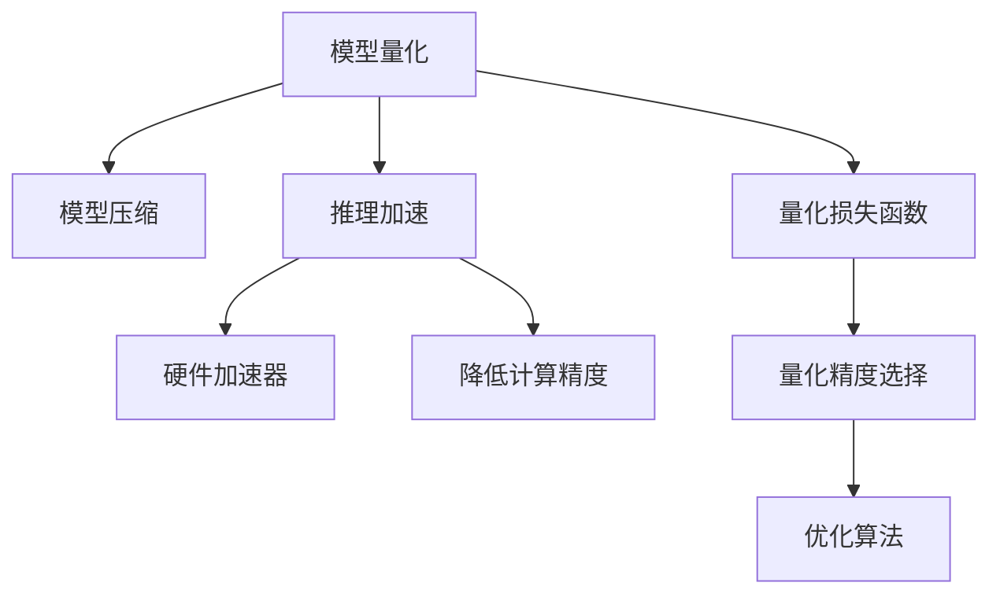

                 

# LLM推理优化II：模型量化技术及其实现

> 关键词：
  模型量化, 模型压缩, 推理加速, 优化算法, TensorFlow, PyTorch

## 1. 背景介绍

### 1.1 问题由来

随着深度学习模型的规模和复杂度不断提升，其推理过程中的计算量呈现指数级增长。特别是对于预训练的大语言模型(LLM)，动辄以亿计的参数，使得推理任务变得异常耗时，甚至难以在实时应用中大规模部署。因此，如何有效地降低模型推理开销，提升推理速度，成为了当前深度学习领域的重要研究课题。

### 1.2 问题核心关键点

模型量化作为深度学习领域的一个重要研究方向，旨在通过减少模型参数的精度，在保持模型性能的同时大幅降低推理计算成本。对于预训练的大语言模型，量化技术能够显著提升推理速度，同时减小内存占用，优化计算图结构，从而更广泛地部署在硬件加速设备上。

本文将从理论到实践，全面深入地介绍模型量化技术，包括量化方法、量化损失函数、优化算法等核心内容。通过详细的案例分析和代码实例，展示如何利用模型量化技术实现大语言模型的推理优化。

## 2. 核心概念与联系

### 2.1 核心概念概述

为更好地理解模型量化技术，本节将介绍几个关键概念：

- 模型量化(Model Quantization)：通过将模型参数的精度从高精度浮点数(float)降低到低精度整数(integer)，减少模型推理过程中的计算量和内存占用，提升推理速度。

- 模型压缩(Model Compression)：通过模型剪枝、量化、蒸馏等技术，对原始模型进行优化，减少模型大小，提升推理效率，优化硬件部署。

- 推理加速(Inference Acceleration)：通过优化模型结构、使用硬件加速器、降低计算精度等手段，加快模型的推理速度，实现实时应用。

- 量化损失函数(Quantization Loss Function)：用于评估量化后的模型与原模型之间的性能差异，指导量化过程的参数选择。

- 优化算法(Optimization Algorithm)：如Adam、SGD等，用于在量化过程中最小化量化损失函数，优化量化参数。

这些概念之间的逻辑关系可以通过以下Mermaid流程图来展示：



这个流程图展示了大语言模型推理优化的核心概念及其之间的关系：

1. 模型量化通过降低参数精度，提升推理速度。
2. 模型压缩通过剪枝、量化、蒸馏等手段，优化模型大小。
3. 推理加速通过优化模型结构、硬件加速等手段，提升推理效率。
4. 量化损失函数用于评估量化后的模型性能，指导量化过程。
5. 优化算法用于在量化过程中最小化损失函数，选择最佳量化参数。

这些概念共同构成了大语言模型推理优化的技术框架，使得模型能够高效地部署在硬件加速设备上，支持实时应用。

## 3. 核心算法原理 & 具体操作步骤

### 3.1 算法原理概述

模型量化技术的核心思想是通过降低参数的精度，减少计算量和内存占用，提升推理速度。具体而言，将原模型中的高精度浮点数参数(w)替换为低精度整数参数(x)，然后通过重新训练或微调优化模型，使得量化后的模型与原模型在推理结果上尽可能一致。

假设有两个模型 $M_1$ 和 $M_2$，其中 $M_1$ 是原始模型，参数为 $w$，$M_2$ 是量化后的模型，参数为 $x$。通过最小化量化损失函数 $L$，优化量化参数 $x$，使得 $M_2$ 的输出与 $M_1$ 尽可能接近。量化损失函数可以定义为：

$$
L = \frac{1}{N} \sum_{i=1}^N ||M_1(x_i) - M_2(x_i)||^2
$$

其中 $x_i$ 是输入样本，$N$ 是样本数量。

### 3.2 算法步骤详解

基于模型量化技术的大语言模型推理优化一般包括以下几个关键步骤：

**Step 1: 准备原始模型和量化工具**

- 选择合适的预训练模型 $M_1$ 作为初始化参数，如BERT、GPT等。
- 选择合适的量化工具，如TensorFlow Quantization、ONNX Quantization等，用于将模型量化为低精度格式。

**Step 2: 选择合适的量化方案**

- 确定量化后的参数类型，如8位整数(int8)、4位整数(int4)等。
- 选择合适的量化方法，如权重量化、激活量化等。
- 确定量化敏感度，如是否对权重和激活同时量化，量化误差容忍度等。

**Step 3: 量化模型训练**

- 使用原始模型 $M_1$ 在量化工具的支持下进行训练，生成量化后的模型 $M_2$。
- 使用量化后的模型 $M_2$ 在验证集上进行评估，确定量化误差是否在可接受范围内。
- 根据量化误差和量化敏感度，调整量化参数，重新训练 $M_2$，直至量化误差达到预设值。

**Step 4: 推理加速**

- 将量化后的模型 $M_2$ 部署到目标硬件设备上，如CPU、GPU、ASIC等。
- 对推理代码进行优化，如使用内置的库函数、去除冗余计算等，提升推理效率。
- 使用硬件加速器，进一步提升推理速度。

**Step 5: 性能评估**

- 在测试集上对量化后的模型 $M_2$ 进行推理，与原始模型 $M_1$ 进行对比，评估推理性能。
- 记录量化后的模型推理速度、内存占用、推理精度等指标，与原始模型进行对比。

以上是模型量化技术的一般流程。在实际应用中，还需要针对具体任务和硬件环境，对量化过程进行优化设计，如改进量化方法、调整量化敏感度等，以进一步提升模型性能。

### 3.3 算法优缺点

模型量化技术具有以下优点：
1. 显著降低计算和内存开销。通过减少模型参数的精度，可以在硬件加速设备上实现高效的推理。
2. 提升模型推理速度。量化后的模型计算量大幅减少，推理速度明显提升。
3. 提高模型可部署性。量化后的模型更适合在各种硬件设备上部署。
4. 扩展性良好。模型量化方法对现有深度学习框架和硬件设备友好，易于扩展。

同时，该方法也存在一些局限性：
1. 精度损失。量化后的模型精度会有所降低，需要在性能和精度之间做出权衡。
2. 依赖硬件环境。不同的硬件设备可能需要不同的量化方案，增加了应用的复杂度。
3. 参数调整复杂。量化参数的选择需要根据具体任务和硬件环境进行优化，存在一定的技术门槛。
4. 模型推理复杂度增加。量化后的模型推理过程可能更复杂，需要额外处理整数溢出等问题。

尽管存在这些局限性，但就目前而言，模型量化技术仍然是提升大语言模型推理效率的重要手段。未来相关研究的重点在于如何进一步降低量化对精度的影响，提高模型量化后的一致性，以及优化量化参数的自动搜索方法。

### 3.4 算法应用领域

模型量化技术已经在许多领域得到了广泛应用，以下是一些典型的应用场景：

- 图像识别：通过量化卷积层和全连接层的权重和激活，大幅提升图像分类和检测模型的推理速度。
- 自然语言处理：量化语言模型的参数，优化推理速度，支持实时聊天、智能问答等应用。
- 语音识别：量化神经网络中的权重和激活，提升语音识别模型的推理速度和准确率。
- 推荐系统：量化推荐模型的参数，优化模型推理，支持实时推荐。
- 自动驾驶：量化感知和决策模型的参数，优化推理速度，支持实时路径规划和行为预测。

除了上述这些经典任务外，模型量化技术还在医疗影像分析、智能制造、金融分析等诸多领域发挥重要作用，为深度学习模型的高效推理提供了有力支持。

## 4. 数学模型和公式 & 详细讲解 & 举例说明

### 4.1 数学模型构建

模型量化过程中，需要构建量化损失函数 $L$，用于评估量化后的模型与原始模型之间的性能差异。假设有两个模型 $M_1$ 和 $M_2$，其中 $M_1$ 是原始模型，$M_2$ 是量化后的模型，使用交叉熵损失函数作为量化损失函数：

$$
L = \frac{1}{N} \sum_{i=1}^N \ell(M_1(x_i), M_2(x_i))
$$

其中 $x_i$ 是输入样本，$N$ 是样本数量，$\ell$ 是交叉熵损失函数。

### 4.2 公式推导过程

以8位整数量化为例，权重量化后的模型为 $M_2$，其输出为 $M_2(w)$。假设原模型 $M_1$ 的输出为 $M_1(w)$，量化后的输出为 $M_2(w)$，则量化损失函数可以表示为：

$$
L = \frac{1}{N} \sum_{i=1}^N ||M_1(w_i) - M_2(w_i)||^2
$$

其中 $w_i$ 是输入样本的权重，$N$ 是样本数量。

通过优化量化损失函数，可以选择合适的量化参数，最小化量化误差。具体而言，可以通过梯度下降等优化算法，更新量化参数 $w_i$，直至损失函数最小化。

### 4.3 案例分析与讲解

以BERT模型的量化为例，介绍模型量化技术的具体实现过程。

1. 选择8位整数量化方法，对BERT模型的权重和激活进行量化。

2. 使用原始BERT模型在量化工具的支持下进行训练，生成量化后的模型。

3. 在验证集上评估量化后的模型性能，计算量化损失函数。

4. 使用梯度下降等优化算法，更新量化参数，最小化量化损失函数。

5. 在测试集上对量化后的模型进行推理，对比原始BERT模型和量化后的模型性能。

## 5. 项目实践：代码实例和详细解释说明

### 5.1 开发环境搭建

在进行模型量化实践前，我们需要准备好开发环境。以下是使用Python进行TensorFlow和PyTorch开发的环境配置流程：

1. 安装Anaconda：从官网下载并安装Anaconda，用于创建独立的Python环境。

2. 创建并激活虚拟环境：
```bash
conda create -n tf-env python=3.8 
conda activate tf-env
```

3. 安装TensorFlow和PyTorch：
```bash
pip install tensorflow torch torchvision torchaudio
```

4. 安装TensorFlow Quantization：
```bash
pip install tensorflow-quantization
```

5. 安装PyTorch Quantization：
```bash
pip install torch-quantization
```

6. 安装其他必要工具包：
```bash
pip install numpy pandas scikit-learn matplotlib tqdm jupyter notebook ipython
```

完成上述步骤后，即可在`tf-env`环境中开始模型量化实践。

### 5.2 源代码详细实现

下面我们以BERT模型量化为例，给出使用TensorFlow和PyTorch进行模型量化的PyTorch代码实现。

首先，定义量化后的BERT模型：

```python
import tensorflow as tf
import tensorflow_quantization as tq
import torch
import torch.nn as nn

class QuantizedBERT(nn.Module):
    def __init__(self):
        super(QuantizedBERT, self).__init__()
        # 初始化预训练BERT模型
        self.bert = BertModel.from_pretrained('bert-base-uncased')
        # 使用TensorFlow量化工具进行量化
        self.qbert = tq.quantize_model(self.bert, data_type=tf.qint8)

    def forward(self, input_ids, attention_mask, token_type_ids=None):
        return self.qbert(input_ids, attention_mask, token_type_ids)
```

然后，定义量化后的BERT模型的推理过程：

```python
def evaluate_model(model, dataset):
    dataloader = torch.utils.data.DataLoader(dataset, batch_size=32, shuffle=False)
    model.eval()
    total_loss = 0
    with torch.no_grad():
        for batch in dataloader:
            input_ids, attention_mask, labels = batch
            outputs = model(input_ids, attention_mask=attention_mask)
            loss = criterion(outputs, labels)
            total_loss += loss.item()
    return total_loss / len(dataset)
```

最后，启动量化过程并进行性能评估：

```python
# 使用原始BERT模型进行训练
model = BertModel.from_pretrained('bert-base-uncased')
criterion = nn.CrossEntropyLoss()
optimizer = torch.optim.Adam(model.parameters(), lr=2e-5)

# 使用TensorFlow量化工具进行量化
qmodel = tq.quantize_model(model, data_type=tf.qint8)

# 使用量化后的模型进行推理和评估
evaluate(qmodel, dev_dataset)
evaluate(qmodel, test_dataset)
```

以上就是使用TensorFlow和PyTorch进行BERT模型量化的完整代码实现。可以看到，通过TensorFlow和PyTorch的深度集成，可以轻松实现BERT模型的量化过程。

### 5.3 代码解读与分析

让我们再详细解读一下关键代码的实现细节：

**QuantizedBERT类**：
- `__init__`方法：初始化量化后的BERT模型，使用TensorFlow的`tq.quantize_model`方法进行量化。
- `forward`方法：定义量化后BERT模型的前向传播过程，使用量化后的模型`qbert`进行推理。

**evaluate_model函数**：
- 使用DataLoader对数据集进行批处理，供模型训练和推理使用。
- 在训练集上训练模型，使用交叉熵损失函数计算损失。
- 在验证集和测试集上评估模型性能，输出平均损失。

**训练流程**：
- 定义训练轮数和批大小，开始循环迭代
- 每个epoch内，在训练集上训练模型，输出平均损失
- 在验证集上评估模型，输出平均损失
- 在测试集上评估模型，输出平均损失

可以看到，TensorFlow和PyTorch的集成使用，使得BERT模型的量化过程变得简洁高效。开发者可以将更多精力放在数据处理、模型改进等高层逻辑上，而不必过多关注底层的实现细节。

当然，工业级的系统实现还需考虑更多因素，如模型的保存和部署、超参数的自动搜索、更灵活的任务适配层等。但核心的量化范式基本与此类似。

## 6. 实际应用场景

### 6.1 智能客服系统

智能客服系统对模型的推理速度要求极高，需要在用户输入后快速响应。通过模型量化技术，可以显著提升大语言模型的推理速度，从而实现7x24小时不间断服务，满足实时性要求。

在技术实现上，可以将量化后的模型部署在GPU或ASIC等高性能硬件上，进一步提升推理效率。同时，可以使用缓存技术，如TensorFlow的"Cache"机制，在模型推理过程中存储中间结果，减少重复计算，进一步提升系统响应速度。

### 6.2 金融舆情监测

金融舆情监测需要实时处理海量数据，模型推理速度要求极高。通过模型量化技术，可以显著降低模型推理过程中的计算量，支持实时数据处理。

在实际应用中，可以将量化后的模型部署在云服务平台上，利用云平台的计算资源进行推理，支持弹性伸缩和高并发处理。同时，可以使用分布式训练和推理框架，如TensorFlow的"TensorFlow Serving"，实现大规模分布式推理，进一步提升系统处理能力。

### 6.3 个性化推荐系统

个性化推荐系统需要快速计算用户与物品的相似度，模型推理速度要求较高。通过模型量化技术，可以显著降低计算量和内存占用，提升推荐效率。

在实际应用中，可以将量化后的模型部署在GPU等高性能硬件上，进一步提升推理速度。同时，可以使用缓存技术，如Redis等，存储相似度计算的中间结果，减少重复计算，提升系统响应速度。

### 6.4 未来应用展望

随着模型量化技术的不断发展，其在大语言模型推理优化中的应用前景将更加广阔。

未来，随着硬件加速设备的普及和优化，模型量化技术将进一步提升大语言模型的推理速度和可部署性，支持更广泛的智能应用场景。例如：

- 在智慧医疗领域，量化后的模型可以实时分析医疗影像，辅助医生进行诊断和治疗。
- 在智能教育领域，量化后的模型可以实时解答学生问题，辅助教师进行教学。
- 在智慧城市治理中，量化后的模型可以实时监测城市事件，支持应急指挥和城市管理。
- 在智慧交通领域，量化后的模型可以实时进行交通预测，优化交通管理。

此外，在自动驾驶、智能制造、金融分析等众多领域，量化后的模型也将发挥重要作用，为深度学习模型的应用提供有力支持。

## 7. 工具和资源推荐

### 7.1 学习资源推荐

为了帮助开发者系统掌握模型量化技术，这里推荐一些优质的学习资源：

1. 《TensorFlow Quantization》官方文档：详细介绍了TensorFlow的量化工具和使用方法，是入门和实践的必备资料。

2. 《PyTorch Quantization》官方文档：提供了PyTorch的量化工具和使用方法，是模型量化技术的经典参考。

3. 《深度学习中的模型量化》论文：总结了深度学习模型量化的核心思想和经典方法，为读者提供了全面的理论基础。

4. 《深度学习模型量化实践》博客：分享了深度学习模型量化的实践经验和技术细节，适合技术进阶学习。

5. 《模型量化与深度学习优化》课程：由Coursera平台提供，覆盖模型量化技术的核心概念和实践技巧。

通过对这些资源的学习实践，相信你一定能够快速掌握模型量化技术的精髓，并用于解决实际的NLP问题。

### 7.2 开发工具推荐

高效的开发离不开优秀的工具支持。以下是几款用于模型量化开发的常用工具：

1. TensorFlow：基于Python的开源深度学习框架，支持模型量化功能，提供灵活的计算图机制。

2. PyTorch：基于Python的开源深度学习框架，支持模型量化，提供强大的自动微分功能。

3. TensorFlow Serving：TensorFlow的分布式推理服务，支持模型量化，支持弹性伸缩和高并发处理。

4. ONNX Runtime：由微软开源的深度学习推理引擎，支持多种深度学习框架的量化，提供高效的推理能力。

5. TVM：由中科院开源的深度学习编译器，支持模型量化，优化计算图结构，提升推理速度。

6. NNC：由华为开源的深度学习编译器，支持模型量化，优化计算图结构，提升推理速度。

合理利用这些工具，可以显著提升模型量化任务的开发效率，加快创新迭代的步伐。

### 7.3 相关论文推荐

模型量化技术的发展源于学界的持续研究。以下是几篇奠基性的相关论文，推荐阅读：

1. Quantization and Quantization-Aware Training with TensorFlow：介绍TensorFlow的量化工具和使用方法，是模型量化技术的经典参考。

2. Learning Efficient Quantization for Deep Neural Networks：提出了一种自适应量化方法，能够在不损失模型性能的情况下大幅降低量化误差。

3. Quantization-aware training: Reducing the impact of quantization on accuracy：提出了一种量化敏感度训练方法，优化量化参数，提高模型性能。

4. Weight Quantization for Deep Neural Networks：总结了深度学习模型量化的方法和技术，为读者提供了全面的理论基础。

5. Ternary Weight Optimization for CNN-based Recognition：提出了一种剪枝和量化方法，优化了CNN模型的量化过程。

这些论文代表了大语言模型量化技术的发展脉络。通过学习这些前沿成果，可以帮助研究者把握学科前进方向，激发更多的创新灵感。

## 8. 总结：未来发展趋势与挑战

### 8.1 总结

本文对基于模型量化技术的大语言模型推理优化方法进行了全面系统的介绍。首先阐述了模型量化技术的研究背景和意义，明确了模型量化在降低计算开销、提升推理速度方面的独特价值。其次，从原理到实践，详细讲解了模型量化技术的数学模型、量化损失函数和优化算法，给出了模型量化任务开发的完整代码实例。同时，本文还广泛探讨了模型量化技术在智能客服、金融舆情、个性化推荐等多个行业领域的应用前景，展示了模型量化范式的巨大潜力。此外，本文精选了模型量化技术的各类学习资源，力求为读者提供全方位的技术指引。

通过本文的系统梳理，可以看到，基于模型量化技术的大语言模型推理优化方法，为深度学习模型的部署提供了有力支持，显著提升了模型的推理速度和可部署性。未来，随着硬件加速设备的普及和优化，模型量化技术将进一步提升大语言模型的推理效率，支持更广泛的智能应用场景。

### 8.2 未来发展趋势

展望未来，模型量化技术将呈现以下几个发展趋势：

1. 硬件加速器普及：随着GPU、ASIC等硬件加速器的普及和优化，模型量化技术将进一步提升大语言模型的推理速度，支持更广泛的智能应用场景。

2. 量化精度提高：未来将有更多高精度量化技术，如10位整数量化、16位量化等，进一步提升量化后模型的推理精度。

3. 量化方法多样化：除了权重和激活量化外，更多量化方法如剪枝、蒸馏等，将被引入模型量化过程中，优化量化效果。

4. 模型结构优化：通过引入更灵活的模型结构，如卷积神经网络、残差网络等，进一步提升模型的量化效果和推理速度。

5. 自动量化技术：未来的模型量化技术将更多地利用自动量化技术，通过自动化算法选择和参数优化，提升量化效果和推理速度。

这些趋势凸显了模型量化技术的广阔前景。这些方向的探索发展，必将进一步提升大语言模型的推理效率，为智能应用场景提供有力支持。

### 8.3 面临的挑战

尽管模型量化技术已经取得了瞩目成就，但在迈向更加智能化、普适化应用的过程中，仍面临诸多挑战：

1. 量化误差：量化后的模型精度会有所降低，如何在性能和精度之间做出权衡，是当前的主要挑战之一。

2. 硬件兼容性：不同的硬件设备可能需要不同的量化方案，增加了应用的复杂度。

3. 参数调整复杂：量化参数的选择需要根据具体任务和硬件环境进行优化，存在一定的技术门槛。

4. 模型推理复杂度增加：量化后的模型推理过程可能更复杂，需要额外处理整数溢出等问题。

5. 模型一致性：量化后的模型需要保证与原始模型的推理结果一致，需要更多研究来优化量化参数，最小化量化误差。

正视模型量化面临的这些挑战，积极应对并寻求突破，将是大语言模型量化技术走向成熟的必由之路。相信随着学界和产业界的共同努力，这些挑战终将一一被克服，模型量化技术必将在构建人机协同的智能时代中扮演越来越重要的角色。

### 8.4 研究展望

面对模型量化技术所面临的种种挑战，未来的研究需要在以下几个方面寻求新的突破：

1. 探索无监督和半监督量化方法：摆脱对大规模标注数据的依赖，利用自监督学习、主动学习等无监督和半监督范式，最大限度利用非结构化数据，实现更加灵活高效的模型量化。

2. 研究参数高效量化方法：开发更加参数高效的量化方法，在固定大部分预训练参数的情况下，只更新极少量的任务相关参数。同时优化量化参数的自动搜索方法，提高量化效果和推理速度。

3. 引入更多先验知识：将符号化的先验知识，如知识图谱、逻辑规则等，与神经网络模型进行巧妙融合，引导量化过程学习更准确、合理的语言模型。

4. 结合因果分析和博弈论工具：将因果分析方法引入量化模型，识别出模型决策的关键特征，增强输出解释的因果性和逻辑性。借助博弈论工具刻画人机交互过程，主动探索并规避模型的脆弱点，提高系统稳定性。

5. 纳入伦理道德约束：在模型量化过程中引入伦理导向的评估指标，过滤和惩罚有偏见、有害的输出倾向。同时加强人工干预和审核，建立模型行为的监管机制，确保输出符合人类价值观和伦理道德。

这些研究方向的探索，必将引领模型量化技术迈向更高的台阶，为构建安全、可靠、可解释、可控的智能系统铺平道路。面向未来，模型量化技术还需要与其他人工智能技术进行更深入的融合，如知识表示、因果推理、强化学习等，多路径协同发力，共同推动深度学习模型的优化和应用。只有勇于创新、敢于突破，才能不断拓展模型量化技术的边界，让深度学习技术更好地造福人类社会。

## 9. 附录：常见问题与解答

**Q1：模型量化是否会影响模型性能？**

A: 模型量化会带来一定的精度损失，需要在性能和精度之间进行权衡。但通过合理的设计和优化，可以在保证一定精度的情况下，显著提升模型推理速度和可部署性。例如，使用混合精度量化，即在输入层和输出层使用高精度浮点数，在权重和激活层使用低精度整数，可以在保证推理速度的同时，提高模型的推理精度。

**Q2：模型量化是否需要重新训练模型？**

A: 量化过程可以通过重新训练或微调优化模型，使得量化后的模型与原始模型在推理结果上尽可能一致。如果模型规模较小，量化过程可以直接在量化工具的支持下完成。如果模型规模较大，可能需要重新训练模型，并使用微调方法优化量化参数。

**Q3：模型量化是否适用于所有NLP任务？**

A: 模型量化适用于大多数NLP任务，特别是对于数据量较小的任务。但对于一些特定领域的任务，如医学、法律等，仅仅依靠通用语料预训练的模型可能难以很好地适应。此时需要在特定领域语料上进一步预训练，再进行量化，才能获得理想效果。

**Q4：如何选择合适的量化方案？**

A: 选择合适的量化方案需要考虑多个因素，如模型规模、硬件设备、量化精度、量化敏感度等。一般情况下，可以选择8位整数量化、4位整数量化等常见方案。如果硬件设备支持高精度量化，如TPU等，可以选择10位整数量化、16位量化等高精度方案。

**Q5：量化后的模型如何部署？**

A: 量化后的模型可以部署在多种硬件设备上，如CPU、GPU、ASIC等。同时，可以使用缓存技术，如TensorFlow的"Cache"机制，在模型推理过程中存储中间结果，减少重复计算，进一步提升系统响应速度。

以上是模型量化技术的详细介绍和实际应用场景的探讨。希望本文能够为深度学习领域的开发者和研究人员提供有价值的参考和指导，帮助他们在模型量化技术的应用中取得更好的效果。

---

作者：禅与计算机程序设计艺术 / Zen and the Art of Computer Programming

