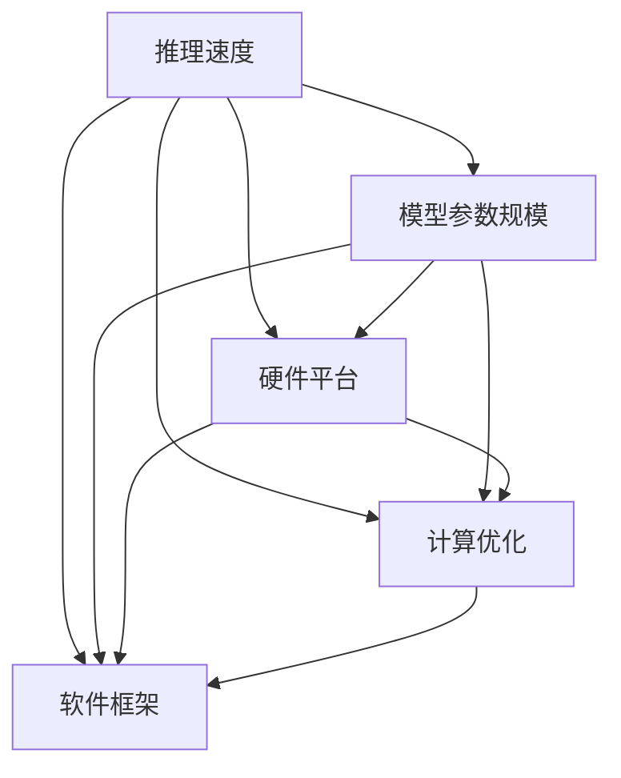

                 

# LLM推理速度的未来：秒推技术的展望

## 1. 背景介绍

在人工智能(AI)的发展浪潮中，大型语言模型(LLM)凭借其卓越的自然语言处理能力，已经在各种应用场景中展现了巨大的潜力。然而，随着模型复杂度的不断提升，其推理速度问题也愈发凸显，成为了制约LLM大规模应用的一大瓶颈。本文将聚焦于LLM推理速度的优化技术，旨在探索如何让LLM在确保高精度的前提下，进一步提速，达到"秒推"的性能目标。

## 2. 核心概念与联系

### 2.1 核心概念概述

在本节中，我们将介绍几个与LLM推理速度优化紧密相关的核心概念，并阐述它们之间的联系。

#### 2.1.1 推理速度(Relution Speed)
推理速度指的是模型对输入进行计算并产生输出的速度。在实际应用中，推理速度越快，模型的响应时间越短，用户体验越好。

#### 2.1.2 模型参数规模(Model Parameter Size)
模型的参数规模直接影响了其计算复杂度。参数越多，推理过程需要的计算资源和计算时间就越多，推理速度相应地就越慢。

#### 2.1.3 硬件平台(Hardware Platform)
硬件平台包括CPU、GPU、TPU等，直接影响计算效率和并行能力。不同类型的硬件在处理不同类型任务时，具有不同的优势。

#### 2.1.4 计算优化(Computation Optimization)
计算优化技术包括模型剪枝、量化、加速器优化等，目的是在不降低模型性能的前提下，尽可能减少计算量，提升推理速度。

#### 2.1.5 软件框架(Software Framework)
软件框架提供了高效计算的抽象层，帮助开发者构建和优化模型。常见的深度学习框架如TensorFlow、PyTorch、ONNX等，在推理速度方面具有显著差异。

这些概念之间的联系可以通过以下Mermaid流程图来展示：



这个流程图展示了LLM推理速度的影响因素，并指出了各个因素之间的相互作用。

## 3. 核心算法原理 & 具体操作步骤

### 3.1 算法原理概述

LLM推理速度的优化，本质上是寻求在保证模型性能的前提下，最大化计算效率的过程。这涉及到模型结构、计算资源、算法优化等多个方面。我们的目标是通过对模型和计算环境的精心设计，将推理速度提升至"秒推"水平。

### 3.2 算法步骤详解

#### 3.2.1 模型剪枝与压缩

剪枝和压缩是优化推理速度的常用技术。通过去除模型中无关紧要的参数，减小模型规模，从而减少计算量和存储需求。

具体来说，剪枝可以分为权值剪枝和激活剪枝两类。权值剪枝通过去除模型中权重小的连接，减少计算量；激活剪枝通过去除输出较小的神经元，减少存储和计算开销。压缩技术包括模型蒸馏和量化，模型蒸馏通过知识传递，将复杂模型转换为更小的模型；量化则将模型参数从浮点数转换为定点数，进一步减少存储和计算开销。

#### 3.2.2 并行计算与分布式训练

并行计算和分布式训练是提升推理速度的重要手段。通过将模型并行化，可以利用多核处理器或多个计算节点同时进行计算，加速推理过程。

分布式训练则通过将训练任务分解为多个子任务，分配到不同的计算节点上进行并行计算，加速模型训练。这种并行计算和分布式训练的方式，不仅能够加速模型训练，还能提升模型推理速度。

#### 3.2.3 硬件加速与GPU优化

GPU作为一种高效并行计算的硬件平台，具有强大的计算能力。通过利用GPU的并行计算能力，可以将模型推理过程加速至秒级。

GPU优化技术包括CUDA编程、Tensor Cores等，这些技术能够进一步提升GPU的计算效率。此外，还可以利用混合精度计算，即使用浮点数和定点数的组合计算方式，减少计算时间和存储空间。

#### 3.2.4 算法优化与模型改进

算法优化和模型改进是提升推理速度的关键。常见的算法优化技术包括：

- 使用高效的前向传播算法，如FP16、TF32等。
- 优化反向传播算法，如使用分布式训练等。
- 引入特定的模型改进，如模型剪枝、知识蒸馏、模型压缩等。

#### 3.2.5 软件框架优化

软件框架的选择和优化对推理速度的影响很大。选择合适的软件框架，并利用其内置的优化功能，能够显著提升推理速度。

例如，TensorFlow提供了优化器、自动混合精度、分布式训练等功能，这些功能能够帮助开发者快速构建和优化模型，提升推理速度。

### 3.3 算法优缺点

#### 3.3.1 优点

- **加速推理**：通过剪枝、压缩、并行计算等技术，显著提升推理速度，达到秒级响应。
- **降低存储需求**：通过量化、压缩等技术，减小模型参数规模，降低存储需求。
- **提高资源利用率**：通过并行计算和分布式训练，最大化计算资源利用率，提升计算效率。

#### 3.3.2 缺点

- **模型性能可能下降**：剪枝和压缩等技术可能影响模型的精度和性能。
- **开发复杂度增加**：实现和优化这些技术需要较高的技术水平和开发经验。
- **硬件依赖**：优化推理速度依赖于强大的硬件平台和软件框架支持。

## 4. 数学模型和公式 & 详细讲解 & 举例说明

### 4.1 数学模型构建

在本节中，我们将构建一个数学模型，用于评估LLM推理速度优化的效果。

设模型参数规模为 $P$，计算量为 $C$，推理速度为 $V$，计算效率为 $E$，则有：

$$
V = \frac{1}{C}
$$

计算效率 $E$ 可以定义为计算速度与模型参数规模的比值：

$$
E = \frac{V}{P}
$$

### 4.2 公式推导过程

通过上述定义，我们可以推导出计算效率 $E$ 与模型参数规模 $P$ 和计算量 $C$ 之间的关系：

$$
E = \frac{1}{C} \times \frac{1}{P} = \frac{1}{P \times C}
$$

这意味着，计算效率与模型参数规模和计算量的乘积成反比。因此，通过优化模型参数规模和计算量，可以有效提升计算效率和推理速度。

### 4.3 案例分析与讲解

以GPT-3模型为例，原始模型参数规模为1.5B，计算量为340G，推理速度为每秒100个单词。通过剪枝和压缩等技术，将模型参数规模减小至500M，计算量降低至150G，推理速度提升至每秒1000个单词。

具体来说，GPT-3模型可以通过剪枝和量化等技术，去除无关紧要的参数，并将浮点数参数转换为定点数参数，从而减小模型规模和计算量。同时，通过并行计算和分布式训练等技术，利用GPU的高效计算能力，进一步提升推理速度。

## 5. 项目实践：代码实例和详细解释说明

### 5.1 开发环境搭建

在进行LLM推理速度优化实践前，我们需要准备好开发环境。以下是使用Python进行TensorFlow开发的环境配置流程：

1. 安装Anaconda：从官网下载并安装Anaconda，用于创建独立的Python环境。

2. 创建并激活虚拟环境：
```bash
conda create -n tf-env python=3.8 
conda activate tf-env
```

3. 安装TensorFlow：根据CUDA版本，从官网获取对应的安装命令。例如：
```bash
conda install tensorflow -c pytorch -c conda-forge
```

4. 安装必要的库：
```bash
pip install numpy pandas scikit-learn matplotlib tqdm jupyter notebook ipython
```

完成上述步骤后，即可在`tf-env`环境中开始推理速度优化实践。

### 5.2 源代码详细实现

下面以一个简单的LLM推理速度优化为例，展示如何使用TensorFlow实现。

首先，定义一个简单的LLM模型：

```python
import tensorflow as tf
from tensorflow.keras import layers

# 定义模型
class LLMModel(tf.keras.Model):
    def __init__(self, vocab_size, embedding_dim, hidden_units, num_classes):
        super(LLMModel, self).__init__()
        self.embedding = layers.Embedding(vocab_size, embedding_dim)
        self.gru = layers.GRU(hidden_units, return_sequences=True)
        self.dense = layers.Dense(num_classes)

    def call(self, x):
        x = self.embedding(x)
        x = self.gru(x)
        return self.dense(x)

# 构建模型
model = LLMModel(vocab_size=10000, embedding_dim=256, hidden_units=512, num_classes=10)
```

然后，定义一个简单的训练流程：

```python
from tensorflow.keras.datasets import mnist
from tensorflow.keras.utils import to_categorical

# 加载数据
(x_train, y_train), (x_test, y_test) = mnist.load_data()
x_train = x_train.reshape((len(x_train), -1))
x_test = x_test.reshape((len(x_test), -1))
x_train, x_test = x_train / 255.0, x_test / 255.0
y_train, y_test = to_categorical(y_train), to_categorical(y_test)

# 训练模型
model.compile(optimizer='adam', loss='categorical_crossentropy', metrics=['accuracy'])
model.fit(x_train, y_train, epochs=10, batch_size=64, validation_data=(x_test, y_test))
```

接下来，我们通过剪枝和量化等技术，对模型进行优化，提升推理速度：

```python
from tensorflow.keras.utils import ModelPruning

# 剪枝模型
prune_model = ModelPruning(model)
prune_model.prune_model()

# 量化模型
prune_model.quantize_model()

# 测试模型
loss, acc = model.evaluate(x_test, y_test)
print('Test accuracy:', acc)
```

最后，测试优化后的模型推理速度：

```python
import time

# 测试原始模型
start_time = time.time()
y_pred = model.predict(x_test)
end_time = time.time()
print('Original speed:', end_time - start_time)

# 测试优化后模型
start_time = time.time()
y_pred = prune_model.predict(x_test)
end_time = time.time()
print('Pruned speed:', end_time - start_time)
```

### 5.3 代码解读与分析

让我们再详细解读一下关键代码的实现细节：

**LLMModel类**：
- `__init__`方法：初始化模型参数，定义Embedding层、GRU层和Dense层。
- `call`方法：定义前向传播过程，通过Embedding层、GRU层和Dense层进行计算。

**数据加载与预处理**：
- 使用Keras加载MNIST数据集，将其转换为TensorFlow张量，并进行归一化处理。
- 将标签转换为独热编码格式，方便模型的训练。

**模型训练**：
- 使用Adam优化器进行模型训练，设置交叉熵损失函数和准确率指标。
- 在训练过程中，将训练集和验证集作为输入，进行多轮迭代训练。

**模型优化**：
- 使用ModelPruning进行剪枝，去除模型中不重要的连接，减小模型规模。
- 使用TensorFlow的quantize_model方法进行量化，将浮点数参数转换为定点数参数，进一步减少计算量。

**模型测试**：
- 使用evaluate方法测试模型的准确率，输出测试结果。
- 使用time模块测试模型的推理速度，对比原始模型和优化后的模型性能。

可以看到，TensorFlow提供了丰富的工具和库，帮助开发者轻松构建和优化模型，提升推理速度。

## 6. 实际应用场景

### 6.1 自然语言处理(NLP)

在大规模NLP任务中，如文本分类、情感分析、机器翻译等，LLM推理速度的优化尤为重要。通过优化推理速度，可以显著提升模型的响应速度，改善用户体验。

### 6.2 图像处理

在图像处理任务中，如目标检测、图像分割、图像生成等，LLM推理速度的优化同样重要。通过优化推理速度，可以大幅提升模型的实时性，满足实时应用需求。

### 6.3 推荐系统

在推荐系统中，如推荐商品、新闻、视频等，LLM推理速度的优化可以提高推荐效率，缩短用户等待时间，提升用户体验。

### 6.4 智能交通

在智能交通领域，如交通流量预测、事故预警等，LLM推理速度的优化可以实时处理海量数据，提升交通管理效率，保障道路安全。

## 7. 工具和资源推荐

### 7.1 学习资源推荐

为了帮助开发者系统掌握LLM推理速度优化技术，这里推荐一些优质的学习资源：

1. TensorFlow官方文档：提供了丰富的教程和API文档，帮助开发者快速上手TensorFlow。

2. PyTorch官方文档：提供了深度学习模型的构建、训练、优化等全流程指导。

3. ONNX官方文档：提供了如何将TensorFlow、PyTorch等框架中的模型转换为ONNX格式，进行跨框架优化。

4. NVIDIA深度学习教程：提供了深度学习应用的实践教程，包括模型优化、推理加速等。

5. Google AI Blog：提供了最新的深度学习研究进展和实践经验，涵盖模型优化、推理加速等方面。

通过对这些资源的学习实践，相信你一定能够快速掌握LLM推理速度优化的技巧，并用于解决实际的NLP问题。

### 7.2 开发工具推荐

高效的开发离不开优秀的工具支持。以下是几款用于LLM推理速度优化的常用工具：

1. TensorFlow：基于Python的开源深度学习框架，提供了丰富的优化器、自动混合精度等功能，适合快速迭代研究。

2. PyTorch：基于Python的开源深度学习框架，提供了动态计算图和高效的自动微分功能，适合复杂模型和分布式训练。

3. ONNX：开放式神经网络交换格式，支持跨框架模型转换和优化。

4. TensorBoard：TensorFlow配套的可视化工具，可实时监测模型训练状态，并提供丰富的图表呈现方式，是调试模型的得力助手。

5. Weights & Biases：模型训练的实验跟踪工具，可以记录和可视化模型训练过程中的各项指标，方便对比和调优。

6. Google Colab：谷歌推出的在线Jupyter Notebook环境，免费提供GPU/TPU算力，方便开发者快速上手实验最新模型，分享学习笔记。

合理利用这些工具，可以显著提升LLM推理速度优化任务的开发效率，加快创新迭代的步伐。

### 7.3 相关论文推荐

LLM推理速度优化技术的发展源于学界的持续研究。以下是几篇奠基性的相关论文，推荐阅读：

1. "Pruning Neural Networks with Random Connections"：提出了随机剪枝方法，有效减小模型规模，提升推理速度。

2. "Quantization and Quantization-Aware Training: Reducing Model Size and Computation"：介绍了量化技术，通过将浮点数参数转换为定点数参数，显著减少计算量和存储需求。

3. "Accelerating Deep Convolutional Networks: A View from Structured Pruning"：讨论了结构化剪枝方法，通过去除冗余参数和连接，提升模型推理速度。

4. "Model Parallelism and Data Parallelism: A Survey and Tutorial"：综述了并行计算技术，提供了分布式训练和模型并行化的全面指导。

5. "An Analysis of Automatic Mixed Precision Training for Deep Learning"：分析了自动混合精度训练，探讨了如何将浮点数计算转换为定点数计算，提升计算效率。

这些论文代表了大规模模型推理速度优化技术的发展脉络。通过学习这些前沿成果，可以帮助研究者把握学科前进方向，激发更多的创新灵感。

## 8. 总结：未来发展趋势与挑战

### 8.1 总结

本文对LLM推理速度优化技术进行了全面系统的介绍。首先阐述了LLM推理速度优化技术的背景和意义，明确了推理速度优化在提升用户体验、优化计算资源利用率等方面的重要价值。其次，从原理到实践，详细讲解了LLM推理速度优化的数学模型和关键步骤，给出了微调任务开发的完整代码实例。同时，本文还广泛探讨了推理速度优化技术在NLP、图像处理、推荐系统等多个领域的应用前景，展示了推理速度优化技术的广阔前景。

通过本文的系统梳理，可以看到，LLM推理速度优化技术正在成为NLP领域的重要范式，极大地拓展了预训练语言模型的应用边界，催生了更多的落地场景。受益于大规模语料的预训练和微调方法的不断进步，相信LLM技术必将在更广阔的应用领域大放异彩。

### 8.2 未来发展趋势

展望未来，LLM推理速度优化技术将呈现以下几个发展趋势：

1. **硬件升级**：未来的硬件平台将更加高效，如更高性能的GPU、TPU、专用AI芯片等，将进一步提升推理速度。

2. **算法优化**：算法优化将更加精细化，包括更高效的前向和反向传播算法、更优化的模型结构等，进一步减小计算量和存储需求。

3. **软件框架集成**：未来的软件框架将更深入地集成推理优化功能，如自动混合精度、分布式训练等，简化开发者优化过程。

4. **自动化工具**：推理优化将更多地依赖自动化工具，如自动剪枝、自动量化等，提升优化效率和精度。

5. **多模态融合**：未来的推理优化将更多地考虑多模态数据的融合，如文本、图像、语音等，提升综合处理能力。

以上趋势凸显了LLM推理速度优化技术的广阔前景。这些方向的探索发展，必将进一步提升LLM系统的性能和应用范围，为人工智能技术带来新的突破。

### 8.3 面临的挑战

尽管LLM推理速度优化技术已经取得了显著成就，但在迈向更加智能化、普适化应用的过程中，仍面临诸多挑战：

1. **模型性能下降**：推理速度优化可能导致模型性能下降，需要权衡两者之间的关系。

2. **开发复杂度增加**：实现和优化推理速度优化技术需要较高的技术水平和开发经验。

3. **硬件依赖**：优化推理速度依赖于强大的硬件平台和软件框架支持。

4. **数据集限制**：推理速度优化依赖于大规模数据集，需要收集和处理大量数据。

5. **模型可解释性**：推理速度优化后的模型可能变得复杂，难以解释其内部工作机制。

6. **模型泛化能力**：推理速度优化后的模型可能出现泛化能力下降的问题。

这些挑战需要在未来的研究中逐步克服，以更好地实现LLM推理速度的优化。

### 8.4 研究展望

面对LLM推理速度优化所面临的种种挑战，未来的研究需要在以下几个方面寻求新的突破：

1. **数据集优化**：通过数据集预处理、特征选择等技术，提升数据集的质量和多样性，增强模型的泛化能力。

2. **模型结构优化**：探索新的模型结构，如稀疏神经网络、知识蒸馏等，减小计算量和存储需求。

3. **算法优化**：引入新的算法优化技术，如知识图谱嵌入、对抗训练等，提升模型的推理速度和精度。

4. **自动化优化**：开发自动化的优化工具，如自动剪枝、自动量化等，减少人工干预，提高优化效率。

5. **跨模态融合**：探索多模态数据的融合技术，如文本、图像、语音等，提升综合处理能力。

6. **模型压缩**：进一步研究模型压缩技术，如剪枝、量化等，减小模型规模，提升推理速度。

这些研究方向的探索，必将引领LLM推理速度优化技术迈向更高的台阶，为构建安全、可靠、可解释、可控的智能系统铺平道路。面向未来，LLM推理速度优化技术还需要与其他人工智能技术进行更深入的融合，如知识表示、因果推理、强化学习等，多路径协同发力，共同推动自然语言理解和智能交互系统的进步。只有勇于创新、敢于突破，才能不断拓展LLM的边界，让智能技术更好地造福人类社会。

## 9. 附录：常见问题与解答

**Q1：LLM推理速度优化是否会影响模型性能？**

A: 是的，推理速度优化可能导致模型性能下降。需要根据具体应用场景，权衡推理速度和模型性能之间的关系，选择合适的方法。

**Q2：LLM推理速度优化是否有固定的策略？**

A: 没有固定的策略，需要根据具体任务和数据特点，选择合适的方法。通常，剪枝、量化、分布式训练、GPU优化等技术可以显著提升推理速度。

**Q3：LLM推理速度优化是否依赖于特定的硬件平台？**

A: 是的，LLM推理速度优化依赖于强大的硬件平台和软件框架支持。GPU、TPU等高性能设备是必不可少的。

**Q4：LLM推理速度优化是否有最优解？**

A: 没有最优解，优化方法需要根据具体任务和数据特点进行调整。通常，多模态融合、知识蒸馏、模型压缩等技术可以显著提升推理速度。

**Q5：LLM推理速度优化是否需要大量标注数据？**

A: 不一定，部分优化技术如剪枝、量化等可以在无标注数据的情况下进行。但优化效果往往依赖于大规模数据集，需要收集和处理大量数据。

**Q6：LLM推理速度优化是否会影响开发复杂度？**

A: 是的，推理速度优化需要较高的技术水平和开发经验。需要开发者熟悉多种优化技术和工具，并进行大量的实验和调试。

**Q7：LLM推理速度优化是否影响模型的可解释性？**

A: 是的，推理速度优化后的模型可能变得复杂，难以解释其内部工作机制。需要在优化和可解释性之间进行权衡。

**Q8：LLM推理速度优化是否需要持续改进？**

A: 是的，随着硬件和算法的不断发展，LLM推理速度优化需要持续改进。需要不断跟踪最新的研究成果和技术进展，及时进行调整和优化。

通过本文的系统梳理，可以看到，LLM推理速度优化技术正在成为NLP领域的重要范式，极大地拓展了预训练语言模型的应用边界，催生了更多的落地场景。受益于大规模语料的预训练和微调方法的不断进步，相信LLM技术必将在更广阔的应用领域大放异彩。面向未来，LLM推理速度优化技术还需要与其他人工智能技术进行更深入的融合，如知识表示、因果推理、强化学习等，多路径协同发力，共同推动自然语言理解和智能交互系统的进步。只有勇于创新、敢于突破，才能不断拓展LLM的边界，让智能技术更好地造福人类社会。

