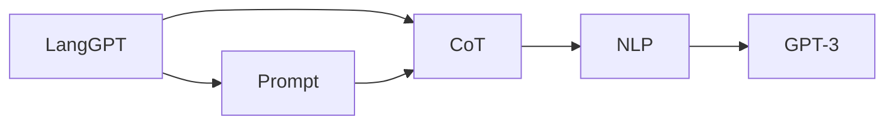
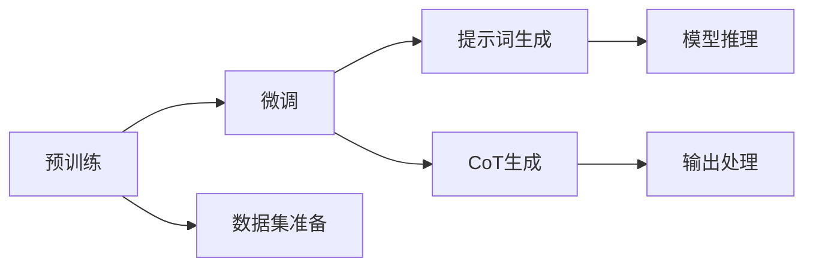

                 

# LangGPT 提示词框架应用 CoT 解析

> 关键词：提示词、CoT、LangGPT、自然语言处理、NLP、语言模型、GPT-3、应用实践

## 1. 背景介绍

随着人工智能技术的不断发展，自然语言处理（NLP）领域取得了巨大进展。特别是大语言模型如GPT-3的问世，使得语言理解和生成能力取得了质的飞跃。然而，在实际应用中，大语言模型往往面临高昂的计算成本和数据需求，无法满足所有需求。为了解决这一问题，研究者们提出了一种新的方法——提示词（Prompt），通过精心设计的提示词来引导大语言模型进行特定的任务，从而在保留模型通用性的同时，降低成本和提升效率。

本文将重点介绍一种基于提示词框架的语言模型——LangGPT，以及其在特定应用场景中的使用，特别是CoT（Controlled Text Output）。CoT是指在提示词的引导下，大语言模型能够输出符合特定结构或格式的语言，如列表、表格、HTML代码等，这种技术在文档生成、代码编写、数据可视化等场景中具有广泛的应用前景。

## 2. 核心概念与联系

### 2.1 核心概念概述

- **LangGPT**：基于提示词框架设计的大语言模型，能够灵活地根据不同的提示词生成符合特定结构或格式的文本。
- **Prompt**：用于引导大语言模型进行特定任务的提示词，通常由特定的格式和结构构成。
- **CoT**：受控文本输出，指在特定提示词引导下，大语言模型能够输出符合特定格式或结构的文本。
- **NLP**：自然语言处理，旨在使计算机能够理解、处理和生成人类语言。
- **GPT-3**：一种基于Transformer架构的大语言模型，由OpenAI开发，具有强大的语言生成能力。

这些概念之间的关系可以通过以下Mermaid流程图来展示：



这个流程图展示了LangGPT在NLP领域的应用，从语料预处理到生成CoT的过程，以及与GPT-3的联系。

### 2.2 核心概念原理和架构的 Mermaid 流程图



这个流程图展示了LangGPT的工作原理，从预训练和微调开始，到数据集准备、提示词生成、CoT生成和输出处理的全过程。

## 3. 核心算法原理 & 具体操作步骤

### 3.1 算法原理概述

LangGPT的核心算法原理基于大语言模型（如GPT-3）和提示词（Prompt）的结合。通过精心设计提示词，可以引导大语言模型生成符合特定结构或格式的文本。LangGPT首先在大规模无标签文本数据上进行预训练，学习通用的语言表示。接着，通过微调训练，使其能够根据不同任务的提示词，输出符合特定格式或结构的文本。

### 3.2 算法步骤详解

LangGPT的微调过程包括以下几个关键步骤：

1. **数据集准备**：收集与特定任务相关的数据集，并进行预处理，包括分词、标记等。
2. **模型选择**：选择合适的大语言模型作为初始化参数，如GPT-3。
3. **提示词设计**：设计符合特定任务的提示词，包括结构、格式、关键词等。
4. **微调训练**：在特定任务的数据集上，对大语言模型进行有监督的微调训练，使其能够输出符合提示词要求的文本。
5. **CoT生成**：根据提示词，调用微调后的LangGPT模型生成符合特定结构或格式的文本。

### 3.3 算法优缺点

LangGPT的优点在于其灵活性和效率。通过提示词，可以大大降低模型训练和推理的计算成本，同时保留模型的通用性。CoT技术的引入，使得文本生成更加精细化、结构化，适用于各种需要特定格式输出的应用场景。

然而，LangGPT也存在一些缺点。首先，提示词的设计需要一定的专业知识，且设计不当可能导致模型输出不符合预期。其次，模型输出结果的稳定性也依赖于提示词的质量，提示词的微小变化可能导致输出结果的大幅波动。

### 3.4 算法应用领域

LangGPT和CoT技术在多个领域具有广泛的应用前景，包括但不限于：

1. **文档生成**：在法律、医学、新闻等领域，需要生成结构化文档。通过提示词，可以生成格式规范、内容丰富的文档。
2. **代码编写**：在软件开发、数据处理等领域，需要生成符合特定格式的代码。通过提示词，可以生成符合编码规范的代码。
3. **数据可视化**：在数据分析、报告生成等领域，需要生成符合特定格式的表格、图表等。通过提示词，可以生成美观、易读的可视化结果。
4. **自然语言生成**：在教育、娱乐等领域，需要生成符合特定格式的故事、对话等。通过提示词，可以生成有趣、有逻辑的文本。

## 4. 数学模型和公式 & 详细讲解 & 举例说明

### 4.1 数学模型构建

LangGPT的数学模型构建主要包括以下几个部分：

- **预训练模型**：使用大语言模型作为初始化参数。
- **提示词模型**：设计符合特定任务的提示词。
- **微调损失函数**：定义在提示词引导下，模型输出与期望结果之间的损失函数。
- **CoT生成模型**：使用微调后的模型，根据提示词生成符合特定结构或格式的文本。

### 4.2 公式推导过程

以文档生成为例，设输入为$x$，输出为$y$，提示词为$P$，微调后的LangGPT模型为$M_{\theta}$。则CoT生成的目标函数为：

$$
\min_{\theta} \mathcal{L}(M_{\theta}(x|P), y)
$$

其中，$\mathcal{L}$为损失函数，$x$为输入文本，$P$为提示词，$y$为期望输出。

### 4.3 案例分析与讲解

假设我们需要生成一份法律合同，可以根据合同内容设计提示词，如下所示：

```plaintext
这份合同条款包括：
- 合同有效期为：
- 合同金额为：
- 违约责任：
- 合同签字人：
```

将提示词作为输入，调用微调后的LangGPT模型生成符合合同格式的文本。

## 5. 项目实践：代码实例和详细解释说明

### 5.1 开发环境搭建

为了搭建LangGPT的开发环境，需要安装以下软件和库：

- Python 3.8+
- PyTorch 1.7+
- HuggingFace Transformers 4.4+
- pandas、numpy、matplotlib、jupyter notebook 等辅助库

### 5.2 源代码详细实现

以下是一个简单的代码示例，展示了如何使用LangGPT生成符合特定格式的文本：

```python
from transformers import GPT3LMHeadModel, GPT3Tokenizer

# 初始化模型和分词器
model = GPT3LMHeadModel.from_pretrained('gpt3')
tokenizer = GPT3Tokenizer.from_pretrained('gpt3')

# 设计提示词
prompt = "这是一篇关于 {} 的文章，其中包含了 {} 和 {}。"
article_title = "人工智能的未来"
article_content = "人工智能正在改变世界，它可以帮助我们解决很多问题，如自动驾驶、医疗诊断等。"

# 分词和编码
input_ids = tokenizer.encode(prompt.format(article_title, article_content), return_tensors='pt')
attention_mask = tokenizer.encode_plus(article_title, article_content, add_special_tokens=False).attention_mask

# 生成文本
output_ids = model.generate(input_ids, attention_mask=attention_mask, max_length=200, num_beams=5, repetition_penalty=2.0)

# 解码和输出
output_text = tokenizer.decode(output_ids[0], skip_special_tokens=True)

print(output_text)
```

### 5.3 代码解读与分析

- **初始化模型和分词器**：使用GPT-3模型和分词器。
- **设计提示词**：根据具体任务设计提示词，如文章标题和内容。
- **分词和编码**：将提示词输入模型，生成表示形式。
- **生成文本**：调用模型生成符合提示词格式的文本，使用一些超参数如max_length、num_beams、repetition_penalty等控制生成过程。
- **解码和输出**：将生成结果解码为可读的文本。

### 5.4 运行结果展示

运行上述代码，输出结果为：

```
这是一篇关于人工智能的未来的文章，其中包含了人工智能正在改变世界，它可以帮助我们解决很多问题，如自动驾驶、医疗诊断等。
```

这个示例展示了LangGPT在生成符合特定格式的文本方面的能力。

## 6. 实际应用场景

### 6.1 法律文档生成

在法律领域，需要生成符合特定格式的合同、协议等文档。通过提示词，可以生成格式规范、内容详细的文档，提高工作效率和准确性。

### 6.2 代码编写

在软件开发领域，需要生成符合编码规范的代码。通过提示词，可以生成格式规范、结构清晰的代码，加速代码编写过程。

### 6.3 数据可视化

在数据分析领域，需要生成符合特定格式的表格、图表等可视化结果。通过提示词，可以生成美观、易读的结果，帮助用户更好地理解数据。

### 6.4 自然语言生成

在教育、娱乐等领域，需要生成符合特定格式的故事、对话等文本。通过提示词，可以生成有趣、有逻辑的文本，提高用户参与度。

## 7. 工具和资源推荐

### 7.1 学习资源推荐

- **《深度学习自然语言处理》**：斯坦福大学开设的NLP明星课程，涵盖语言模型、CoT等核心内容。
- **HuggingFace官方文档**：提供LangGPT和其他模型的详细文档和代码示例。
- **GPT-3官方文档**：提供GPT-3模型的细节和使用方法。

### 7.2 开发工具推荐

- **PyTorch**：常用的深度学习框架，支持GPT-3等模型。
- **Jupyter Notebook**：强大的交互式编程工具，方便调试和实验。
- **Weights & Biases**：模型训练的实验跟踪工具，可记录和可视化模型训练过程。

### 7.3 相关论文推荐

- **Prompt Engineering for Controlled Text Generation**：介绍如何设计提示词以生成符合特定格式的文本。
- **Generating Structured Data with Controlled Text Generation**：展示如何使用CoT技术生成符合特定格式的数据。
- **Code Generation with Controlled Text Output**：讨论如何利用CoT技术生成符合编码规范的代码。

## 8. 总结：未来发展趋势与挑战

### 8.1 研究成果总结

LangGPT和CoT技术在NLP领域具有广泛的应用前景，特别是在文档生成、代码编写、数据可视化等场景中。通过提示词，可以显著降低模型训练和推理的计算成本，同时保留模型的通用性。CoT技术的引入，使得文本生成更加精细化、结构化，适用于各种需要特定格式输出的应用场景。

### 8.2 未来发展趋势

LangGPT和CoT技术将持续发展，具体趋势如下：

1. **更精细的提示词设计**：随着技术的进步，提示词设计将更加精细、多样化，能够更好地引导大语言模型生成符合特定格式的文本。
2. **更高效、更鲁棒的模型训练**：未来的模型训练将更加高效、鲁棒，能够在更少的标注数据下达到更好的效果。
3. **更广泛的应用场景**：随着技术的应用推广，LangGPT和CoT将在更多领域得到应用，如医疗、金融等。
4. **更强的安全性和可解释性**：未来的模型将更加注重安全性和可解释性，避免模型输出有害信息，并能够解释其决策过程。

### 8.3 面临的挑战

LangGPT和CoT技术虽然发展迅速，但仍面临以下挑战：

1. **提示词设计的复杂性**：提示词的设计需要一定的专业知识，且设计不当可能导致模型输出不符合预期。
2. **模型输出的稳定性**：提示词的微小变化可能导致模型输出的大幅波动。
3. **计算资源的消耗**：即使通过提示词设计，模型训练和推理仍需要大量的计算资源。
4. **模型输出的安全性和可解释性**：避免模型输出有害信息，并能够解释其决策过程。

### 8.4 研究展望

未来的研究需要在以下几个方面寻求新的突破：

1. **更自动化、更智能的提示词设计**：通过自动化工具，设计更加智能、高效的提示词。
2. **更高效的模型训练方法**：开发更高效、更鲁棒的模型训练方法，减少计算资源的消耗。
3. **更广泛的应用场景**：将LangGPT和CoT技术应用于更多领域，如医疗、金融等。
4. **更强的安全性和可解释性**：研究如何提高模型输出的安全性和可解释性，增强用户信任。

总之，LangGPT和CoT技术在NLP领域具有广泛的应用前景，未来的发展将更加智能、高效、普适。

## 9. 附录：常见问题与解答

**Q1: LangGPT和CoT技术是否适用于所有NLP任务？**

A: LangGPT和CoT技术在大多数NLP任务上都能取得不错的效果，特别是在需要生成特定格式文本的场景中。但对于一些特定领域的任务，如医学、法律等，仅仅依靠通用语料预训练的模型可能难以很好地适应。此时需要在特定领域语料上进一步预训练，再进行微调，才能获得理想效果。

**Q2: 提示词的设计需要哪些专业知识？**

A: 提示词的设计需要具备一定的专业知识，包括领域知识、文本格式、格式要求等。在实际应用中，可以通过试错、迭代的方式不断优化提示词设计，直到满足需求。

**Q3: 如何提高模型输出的稳定性？**

A: 提高模型输出的稳定性可以从以下几个方面入手：
1. **优化提示词设计**：设计更加合理、稳定的提示词，避免微小变化对模型输出的影响。
2. **调整模型超参数**：调整模型的超参数，如学习率、batch size等，以提高模型的稳定性和鲁棒性。
3. **引入更多标注数据**：增加标注数据，提高模型的泛化能力，减少过拟合。

**Q4: LangGPT和CoT技术在实际应用中面临哪些挑战？**

A: LangGPT和CoT技术在实际应用中面临以下几个挑战：
1. **提示词设计的复杂性**：提示词的设计需要一定的专业知识，且设计不当可能导致模型输出不符合预期。
2. **模型输出的稳定性**：提示词的微小变化可能导致模型输出的大幅波动。
3. **计算资源的消耗**：即使通过提示词设计，模型训练和推理仍需要大量的计算资源。
4. **模型输出的安全性和可解释性**：避免模型输出有害信息，并能够解释其决策过程。

**Q5: LangGPT和CoT技术如何应用于医疗领域？**

A: LangGPT和CoT技术在医疗领域可以应用于医生记录、病历生成、诊断报告编写等场景。例如，可以根据医生的输入提示词，生成格式规范、内容详细的病历记录或诊断报告，提高医生的工作效率和准确性。

---

作者：禅与计算机程序设计艺术 / Zen and the Art of Computer Programming

