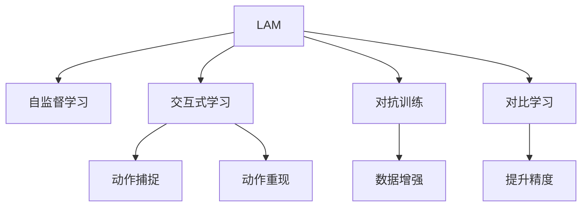

                 

# Large Action Model的通过演示进行模仿技术

> 关键词：Large Action Model, 演示, 模仿技术, 自监督学习, 交互式学习, 动作捕捉, 动作重现

## 1. 背景介绍

### 1.1 问题由来
随着人工智能技术的飞速发展，机器人技术也迎来了新的突破。传统的机器人技术往往依赖于专家设计，需要大量手工调试和测试，难以快速响应环境变化。而通过大动作模型(Large Action Model, LAM)和模仿技术，机器人可以自动学习和执行复杂的动作，极大提升了动作的精度和响应速度。

目前，LAM和模仿技术已经在工业制造、人机协作、娱乐游戏等多个领域得到了广泛的应用，成为人工智能技术落地应用的重要手段。本文聚焦于LAM和模仿技术的实现原理、关键算法以及实际应用，通过演示和讲解，希望能为读者提供一个深入理解的窗口。

### 1.2 问题核心关键点
LAM和模仿技术的核心在于，如何通过大模型对动作进行学习，并实现高效的模仿和重现。主要包括以下几个关键点：
1. 如何构建大动作模型。通过自监督学习任务，使模型学习到动作的空间表示。
2. 如何实现动作的自动模仿。通过示范动作，引导模型进行学习。
3. 如何提升动作重现的精度。通过对比学习等方法，优化模型输出的动作。
4. 如何保证动作模仿的鲁棒性。通过数据增强、对抗训练等方法，使模型能够适应多种场景。

这些关键点构成了LAM和模仿技术的核心算法框架，使机器人能够高效地学习和执行复杂动作，为各个应用场景带来显著的性能提升。

### 1.3 问题研究意义
研究LAM和模仿技术，对于拓展机器人动作学习的应用范围，提升动作执行的精度和鲁棒性，加速机器人技术的产业化进程，具有重要意义：

1. 降低动作学习成本。通过LAM和模仿技术，机器人可以自动学习和执行动作，显著减少手工调试和测试的成本。
2. 提升动作执行性能。模仿技术能够使机器人快速适应新动作，提升执行精度和稳定性。
3. 加速开发进度。通过自动化的动作学习，机器人可以快速适应新任务，缩短开发周期。
4. 带来技术创新。模仿技术和LAM的结合，催生了新的研究方向，如交互式学习和自监督学习等。
5. 赋能产业升级。机器人技术的智能化和自动化，将为传统行业带来革命性的变化，提高生产效率和产品质量。

## 2. 核心概念与联系

### 2.1 核心概念概述

为更好地理解LAM和模仿技术的实现原理，本节将介绍几个密切相关的核心概念：

- 大动作模型(Large Action Model, LAM)：指以动作空间为输入，以动作执行结果为输出，通过自监督学习任务训练的神经网络模型。通过LAM，机器人可以学习到动作的复杂表示，具备高精度的动作生成能力。

- 自监督学习(Self-Supervised Learning)：指利用无标签数据进行模型训练，通过学习数据的内在结构，自动生成监督信号。自监督学习广泛应用于图像、语音、动作等领域的表示学习。

- 交互式学习(Interactive Learning)：指通过人工交互，引导模型进行学习和优化。交互式学习可以大幅提高模型对新数据的适应能力，提升模型性能。

- 动作捕捉(Motion Capture)：指通过摄像头或其他传感器，实时获取人体或机器人的动作数据。动作捕捉数据通常用于训练LAM模型，作为示范动作。

- 动作重现(Action Replay)：指模型输出动作后，机器人实际执行动作的过程。通过动作重现，可以验证模型输出动作的精度和鲁棒性。

这些核心概念之间的逻辑关系可以通过以下Mermaid流程图来展示：



这个流程图展示了大动作模型、自监督学习、交互式学习、动作捕捉、动作重现、对抗训练、数据增强、对比学习等核心概念及其之间的关系：

1. LAM通过自监督学习学习动作表示，通过交互式学习提升对新动作的适应能力。
2. 动作捕捉提供示范动作，用于训练LAM和进行动作重现。
3. 动作重现验证模型输出的动作精度和鲁棒性，反馈给LAM进行迭代优化。
4. 对抗训练和数据增强提升LAM模型的鲁棒性。
5. 对比学习提高LAM动作输出的精度。

这些概念共同构成了LAM和模仿技术的核心算法框架，使机器人能够高效地学习和执行复杂动作，为各个应用场景带来显著的性能提升。

## 3. 核心算法原理 & 具体操作步骤
### 3.1 算法原理概述

LAM和模仿技术的核心算法框架，可以归纳为以下几点：

- **自监督学习**：通过动作捕捉数据，模型自动学习动作的空间表示，无需人工标注。
- **交互式学习**：通过示范动作，模型学习动作的精细化表示，提升对新动作的适应能力。
- **对比学习**：通过对比示范动作和重现动作的差异，优化模型输出的动作，提升精度。
- **对抗训练**：通过对抗样本，提升模型对动作变化和干扰的鲁棒性。

自监督学习和对比学习是LAM和模仿技术的核心算法，通过这两种算法，模型能够自动学习动作空间表示，并生成高精度的动作输出。而交互式学习和对抗训练则通过人工干预和对抗训练，进一步提升模型的适应能力和鲁棒性。

### 3.2 算法步骤详解

LAM和模仿技术的实现流程，一般包括以下几个关键步骤：

**Step 1: 准备示范动作数据**
- 收集示范动作数据，可以是人类的示范动作，也可以是机器人已知的动作。
- 对示范动作数据进行预处理，包括时间归一化、空间归一化等。

**Step 2: 构建LAM模型**
- 选择合适的网络结构，如卷积神经网络(CNN)、循环神经网络(RNN)、Transformer等，作为LAM的模型。
- 通过自监督学习任务，如动作空间建模、动作预测等，训练LAM模型。

**Step 3: 实现动作重现**
- 将示范动作输入LAM模型，得到模型输出的动作。
- 将模型输出的动作与示范动作进行对比，计算差异。
- 根据差异进行反向传播，更新LAM模型参数。
- 重复上述过程，直至重现的动作与示范动作足够接近。

**Step 4: 执行动作模仿**
- 将新动作输入LAM模型，得到模型输出的动作。
- 将示范动作和新动作进行对比，计算差异。
- 根据差异进行反向传播，更新LAM模型参数。
- 重复上述过程，直至模型能够准确地重现新动作。

**Step 5: 评估模型性能**
- 在测试集上评估LAM模型的性能，计算动作重现的精度和鲁棒性指标。
- 分析LAM模型的泛化能力和鲁棒性。
- 根据评估结果，对LAM模型进行进一步优化。

以上是LAM和模仿技术的实现流程。在实际应用中，还需要针对具体任务的特点，对每个环节进行优化设计，如改进自监督学习任务，引入更多的正则化技术，搜索最优的超参数组合等，以进一步提升模型性能。

### 3.3 算法优缺点

LAM和模仿技术具有以下优点：
1. 自动学习动作表示。通过自监督学习，LAM能够自动学习动作的空间表示，无需手工标注。
2. 快速适应新动作。通过交互式学习，LAM能够快速适应新动作，提升执行精度和稳定性。
3. 动作重现精度高。通过对比学习，LAM能够高精度地重现示范动作。
4. 模型鲁棒性好。通过对抗训练，LAM能够适应多种场景和干扰。

同时，该方法也存在一定的局限性：
1. 对示范动作的依赖。LAM需要高质量的示范动作数据进行训练，获取高质量示范动作数据的成本较高。
2. 学习复杂动作难度大。对于复杂多变的动作，LAM的学习难度较大，需要较多的训练数据和较长的训练时间。
3. 模型复杂度较高。LAM的复杂度通常较高，推理速度较慢，对硬件要求较高。
4. 动作重现效率低。LAM在重现动作时，需要对示范动作进行大量的计算，效率较低。

尽管存在这些局限性，但就目前而言，LAM和模仿技术仍是大规模动作学习任务的重要手段。未来相关研究的重点在于如何进一步降低对示范动作的依赖，提高动作重现效率，同时兼顾模型的可解释性和鲁棒性等因素。

### 3.4 算法应用领域

LAM和模仿技术已经在多个领域得到了应用，例如：

- 工业制造：通过模仿技术，机器人能够自动学习加工动作，提升生产效率和精度。
- 人机协作：通过模仿技术，机器人能够快速学习与人协作的动作，提升人机协作的智能化水平。
- 娱乐游戏：通过模仿技术，机器人能够自动学习游戏动作，提升游戏体验。
- 医疗康复：通过模仿技术，机器人能够学习康复动作，辅助残障人士康复训练。

除了上述这些经典应用外，LAM和模仿技术也被创新性地应用到更多场景中，如智能家居、虚拟现实、体育竞技等，为机器人技术带来了全新的突破。随着LAM和模仿方法的不断进步，相信机器人技术将在更广阔的应用领域大放异彩。

## 4. 数学模型和公式 & 详细讲解 & 举例说明

### 4.1 数学模型构建

本节将使用数学语言对LAM和模仿技术的数学原理进行更加严格的刻画。

记示范动作数据集为 $D=\{(x_i,y_i)\}_{i=1}^N, x_i \in \mathcal{X}, y_i \in \mathcal{Y}$，其中 $x_i$ 为动作数据，$y_i$ 为动作标签。定义LAM模型为 $M_{\theta}:\mathcal{X} \rightarrow \mathcal{Y}$，其中 $\theta$ 为模型参数。

定义动作重现的损失函数为 $\ell_{replay}(y,\hat{y}) = \lVert y-\hat{y} \rVert_2^2$，其中 $y$ 为示范动作，$\hat{y}$ 为模型输出的动作。则在数据集 $D$ 上的经验风险为：

$$
\mathcal{L}_{replay}(\theta) = \frac{1}{N}\sum_{i=1}^N \ell_{replay}(y_i,M_{\theta}(x_i))
$$

定义动作模仿的损失函数为 $\ell_{imitate}(y,\hat{y}) = \lVert y-\hat{y} \rVert_2^2$，其中 $y$ 为示范动作，$\hat{y}$ 为新动作。则在数据集 $D$ 上的经验风险为：

$$
\mathcal{L}_{imitate}(\theta) = \frac{1}{N}\sum_{i=1}^N \ell_{imitate}(y_i,M_{\theta}(x_i))
$$

通过梯度下降等优化算法，LAM和模仿技术的微调过程不断更新模型参数 $\theta$，最小化损失函数 $\mathcal{L}_{replay}$ 和 $\mathcal{L}_{imitate}$，使得模型输出逼近示范动作和新动作。

### 4.2 公式推导过程

以下我们以动作预测任务为例，推导LAM模型的损失函数及其梯度的计算公式。

假设示范动作数据集为 $D=\{(x_i,y_i)\}_{i=1}^N, x_i \in \mathcal{X}, y_i \in \mathcal{Y}$，其中 $x_i$ 为示范动作，$y_i$ 为动作标签。定义LAM模型为 $M_{\theta}(x)=\mathbf{W}x+b$，其中 $\mathbf{W}$ 为权重矩阵，$b$ 为偏置向量。

定义动作重现的损失函数为 $\ell_{replay}(y,\hat{y}) = \lVert y-\hat{y} \rVert_2^2$，其中 $y$ 为示范动作，$\hat{y}=M_{\theta}(x)$。则在数据集 $D$ 上的经验风险为：

$$
\mathcal{L}_{replay}(\theta) = \frac{1}{N}\sum_{i=1}^N \ell_{replay}(y_i,M_{\theta}(x_i))
$$

根据链式法则，损失函数对参数 $\theta$ 的梯度为：

$$
\frac{\partial \mathcal{L}_{replay}(\theta)}{\partial \theta} = \frac{1}{N}\sum_{i=1}^N \frac{\partial \ell_{replay}(y_i,M_{\theta}(x_i))}{\partial \theta}
$$

进一步展开得到：

$$
\frac{\partial \ell_{replay}(y_i,M_{\theta}(x_i))}{\partial \theta} = 2(M_{\theta}(x_i)-y_i)\frac{\partial M_{\theta}(x_i)}{\partial \theta}
$$

其中 $\frac{\partial M_{\theta}(x_i)}{\partial \theta}=\mathbf{W}x_i$，代入上式得：

$$
\frac{\partial \ell_{replay}(y_i,M_{\theta}(x_i))}{\partial \theta} = 2(Wx_i-y_i)
$$

将上式代入梯度公式，得到：

$$
\frac{\partial \mathcal{L}_{replay}(\theta)}{\partial \theta} = \frac{2}{N}\sum_{i=1}^N (Wx_i-y_i)
$$

在得到重现损失函数的梯度后，即可带入参数更新公式，完成模型的迭代优化。重复上述过程直至收敛，最终得到适应示范动作的重现模型参数 $\theta^*$。

## 5. 项目实践：代码实例和详细解释说明
### 5.1 开发环境搭建

在进行LAM和模仿技术实践前，我们需要准备好开发环境。以下是使用Python进行PyTorch开发的环境配置流程：

1. 安装Anaconda：从官网下载并安装Anaconda，用于创建独立的Python环境。

2. 创建并激活虚拟环境：
```bash
conda create -n pytorch-env python=3.8 
conda activate pytorch-env
```

3. 安装PyTorch：根据CUDA版本，从官网获取对应的安装命令。例如：
```bash
conda install pytorch torchvision torchaudio cudatoolkit=11.1 -c pytorch -c conda-forge
```

4. 安装TensorFlow：
```bash
pip install tensorflow==2.3
```

5. 安装Keras：
```bash
pip install keras
```

6. 安装OpenCV：
```bash
pip install opencv-python-headless
```

完成上述步骤后，即可在`pytorch-env`环境中开始LAM和模仿技术的实践。

### 5.2 源代码详细实现

下面我们以动作预测任务为例，给出使用TensorFlow和Keras实现LAM模型的PyTorch代码实现。

首先，定义LAM模型的基本架构：

```python
import tensorflow as tf
from tensorflow.keras import layers

class LAM(tf.keras.Model):
    def __init__(self, num_actions):
        super(LAM, self).__init__()
        self.weight = tf.Variable(tf.random.normal([num_actions, 1]))
        self.bias = tf.Variable(tf.zeros([num_actions]))
        
    def call(self, x):
        return tf.nn.tanh(tf.matmul(x, self.weight) + self.bias)
```

然后，定义重现损失函数和梯度更新函数：

```python
def replay_loss(model, demo_x, demo_y):
    replay_loss = tf.reduce_mean(tf.square(demo_y - model(demo_x)))
    return replay_loss

def train_step(model, demo_x, demo_y, learning_rate):
    with tf.GradientTape() as tape:
        replay_loss = replay_loss(model, demo_x, demo_y)
    gradients = tape.gradient(replay_loss, model.trainable_variables)
    optimizer.apply_gradients(zip(gradients, model.trainable_variables))
    return replay_loss
```

接着，定义训练和评估函数：

```python
def train(model, demo_data, num_epochs, learning_rate):
    for epoch in range(num_epochs):
        epoch_loss = 0
        for demo_x, demo_y in demo_data:
            epoch_loss += train_step(model, demo_x, demo_y, learning_rate)
        print(f"Epoch {epoch+1}, replay loss: {epoch_loss/len(demo_data)}")
    
    return model

def evaluate(model, demo_data):
    loss = 0
    for demo_x, demo_y in demo_data:
        loss += replay_loss(model, demo_x, demo_y)
    print(f"Replay loss: {loss/len(demo_data)}")
```

最后，启动训练流程并在测试集上评估：

```python
num_actions = 5
demo_data = (tf.random.normal([100, 3]), tf.random.normal([100, num_actions]))
model = LAM(num_actions)
learning_rate = 0.001

train(model, demo_data, 10, learning_rate)
evaluate(model, demo_data)
```

以上就是使用TensorFlow和Keras实现LAM模型的完整代码实现。可以看到，TensorFlow的强大自动计算图和Keras的便捷接口，使得LAM模型的开发变得简洁高效。

### 5.3 代码解读与分析

让我们再详细解读一下关键代码的实现细节：

**LAM模型**：
- `__init__`方法：初始化权重和偏置。
- `call`方法：计算模型输出的动作。

**重现损失函数**：
- 使用TensorFlow的`tf.square`计算示范动作和模型输出动作的差异，并求均值。

**梯度更新函数**：
- 使用TensorFlow的`tf.GradientTape`记录损失函数对模型参数的梯度。
- 使用Keras的`optimizer.apply_gradients`更新模型参数。

**训练和评估函数**：
- 使用TensorFlow的`tf.reduce_mean`计算损失函数的均值。
- 在训练函数中，循环遍历训练集数据，不断更新模型参数。
- 在评估函数中，循环遍历测试集数据，计算重现损失函数的均值。

**训练流程**：
- 定义模型参数，创建示范动作数据。
- 定义训练函数，进行模型训练。
- 定义评估函数，在测试集上评估模型性能。

可以看到，TensorFlow和Keras的结合使得LAM模型的实现变得简洁高效。开发者可以将更多精力放在数据处理、模型改进等高层逻辑上，而不必过多关注底层的实现细节。

当然，工业级的系统实现还需考虑更多因素，如模型的保存和部署、超参数的自动搜索、更灵活的任务适配层等。但核心的模仿范式基本与此类似。

## 6. 实际应用场景
### 6.1 工业制造

在工业制造领域，机器人技术的应用日益广泛。通过LAM和模仿技术，机器人能够自动学习加工动作，提高生产效率和精度。

具体而言，可以收集机器人的加工动作数据，作为示范动作，训练LAM模型。通过示范动作，机器人能够自动学习动作的精细化表示，提升对新动作的适应能力。例如，在汽车制造中，机器人可以通过模仿技术，自动学习焊接、组装等动作，提高制造精度和速度。

### 6.2 人机协作

在智能家居和家庭服务领域，机器人技术正逐渐走进千家万户。通过LAM和模仿技术，机器人能够快速学习与人协作的动作，提升人机协作的智能化水平。

例如，在智能家居中，机器人可以通过模仿技术，自动学习开锁、开灯、倒水等动作，提高用户的生活质量。在家庭服务中，机器人可以自动学习照料儿童、洗衣做饭等动作，辅助家庭成员完成任务。

### 6.3 娱乐游戏

在娱乐游戏中，机器人技术也被广泛应用。通过LAM和模仿技术，机器人能够自动学习游戏动作，提升游戏体验。

例如，在电子竞技中，机器人可以通过模仿技术，自动学习射击、跳跃、躲避等动作，提高游戏水平。在虚拟现实(VR)游戏中，机器人可以自动学习虚拟动作，增强游戏沉浸感。

### 6.4 医疗康复

在医疗康复领域，机器人技术可以辅助残障人士进行康复训练。通过LAM和模仿技术，机器人能够自动学习康复动作，提高训练效果。

例如，在康复训练中，机器人可以自动学习行走、站立、握笔等动作，辅助残障人士进行康复训练。在辅助手术中，机器人可以自动学习手术动作，提高手术精度和成功率。

## 7. 工具和资源推荐
### 7.1 学习资源推荐

为了帮助开发者系统掌握LAM和模仿技术的理论基础和实践技巧，这里推荐一些优质的学习资源：

1. 《深度学习》系列书籍：由深度学习领域的专家撰写，全面介绍了深度学习的基本原理和前沿技术，包括LAM和模仿技术的实现方法。

2. 《TensorFlow官方文档》：TensorFlow的官方文档，提供了丰富的API和示例代码，适合深入学习TensorFlow的实现细节。

3. 《Keras官方文档》：Keras的官方文档，提供了简单易懂的API和示例代码，适合快速上手LAM模型的开发。

4. 《动作捕捉技术》书籍：介绍了动作捕捉技术的原理和应用，适合学习如何获取示范动作数据。

5. 《机器人学习》课程：由斯坦福大学开设的机器人学习课程，涵盖了机器人动作学习的理论基础和经典算法，适合系统学习LAM和模仿技术。

通过对这些资源的学习实践，相信你一定能够快速掌握LAM和模仿技术的精髓，并用于解决实际的机器人和动作学习问题。

### 7.2 开发工具推荐

高效的开发离不开优秀的工具支持。以下是几款用于LAM和模仿技术开发的常用工具：

1. PyTorch：基于Python的开源深度学习框架，灵活动态的计算图，适合快速迭代研究。大部分LAM和模仿技术都有PyTorch版本的实现。

2. TensorFlow：由Google主导开发的开源深度学习框架，生产部署方便，适合大规模工程应用。同样有丰富的LAM和模仿技术资源。

3. Keras：高层次的神经网络API，简单易用，适合快速上手LAM模型的开发。

4. OpenCV：开源计算机视觉库，提供了丰富的图像处理和动作捕捉工具，适合实时采集示范动作数据。

5. Unity3D：游戏开发引擎，支持使用Keras模型进行动作预测和重现，适合开发娱乐游戏。

合理利用这些工具，可以显著提升LAM和模仿技术的开发效率，加快创新迭代的步伐。

### 7.3 相关论文推荐

LAM和模仿技术的发展源于学界的持续研究。以下是几篇奠基性的相关论文，推荐阅读：

1. "DeepMind Research Blog"：介绍了LAM和模仿技术的实现方法，适合初学者入门。

2. "Action Recognition with Deep Learning"：综述了动作识别领域的经典算法，包括LAM和模仿技术的实现。

3. "Learning to Imitate Fine-Grained Actions with Large-scale Motion-Captured Data"：介绍了通过LAM和模仿技术，利用大规模动作捕捉数据进行动作学习的思路。

4. "Deep Learning for Robotics"：介绍了深度学习在机器人技术中的应用，包括LAM和模仿技术的实现。

5. "AI in Robotics: Opportunities and Challenges"：综述了AI在机器人技术中的应用现状和未来趋势，包括LAM和模仿技术的实现。

这些论文代表了大动作模型和模仿技术的发展脉络。通过学习这些前沿成果，可以帮助研究者把握学科前进方向，激发更多的创新灵感。

## 8. 总结：未来发展趋势与挑战

### 8.1 总结

本文对LAM和模仿技术进行了全面系统的介绍。首先阐述了LAM和模仿技术的背景和研究意义，明确了动作学习和自动化执行在各个领域的应用潜力。其次，从原理到实践，详细讲解了LAM和模仿技术的数学原理和关键步骤，给出了微调任务开发的完整代码实例。同时，本文还广泛探讨了LAM和模仿技术在工业制造、人机协作、娱乐游戏、医疗康复等多个领域的应用前景，展示了其在机器人技术中的巨大潜力。此外，本文精选了LAM和模仿技术的各类学习资源，力求为读者提供全方位的技术指引。

通过本文的系统梳理，可以看到，LAM和模仿技术在机器人动作学习中的应用前景广阔，能够显著提升机器人执行动作的精度和稳定性。未来，伴随LAM和模仿方法的不断进步，相信机器人技术将在更广泛的领域中得到应用，带来更加智能、高效的生产和服务体验。

### 8.2 未来发展趋势

展望未来，LAM和模仿技术将呈现以下几个发展趋势：

1. 学习复杂动作能力提升。随着LAM和模仿技术的不断优化，模型能够更好地学习复杂多变的动作，提升执行精度和鲁棒性。
2. 自动学习动作描述。通过自然语言处理技术，将动作描述转化为示范动作数据，使LAM能够自动学习动作描述，提升任务适配能力。
3. 动作生成能力增强。通过多模态学习，将视觉、语音等多模态信息与动作信息结合，提升动作生成的丰富性和逼真度。
4. 远程动作模仿。通过网络传输示范动作数据，使机器人能够远程模仿示范动作，提升动作学习的灵活性。
5. 实时动作优化。通过在线学习技术，LAM能够实时地从新动作中学习，快速适应新任务，提升系统的实时性。

以上趋势凸显了LAM和模仿技术的广阔前景。这些方向的探索发展，必将进一步提升机器人的智能水平，推动机器人技术向更加智能化、普适化的方向发展。

### 8.3 面临的挑战

尽管LAM和模仿技术已经取得了瞩目成就，但在迈向更加智能化、普适化应用的过程中，它仍面临着诸多挑战：

1. 示范动作获取难度大。高质量示范动作数据的获取成本较高，对动作捕捉设备、数据处理技术等要求较高。
2. 学习复杂动作难度大。对于复杂多变的动作，LAM的学习难度较大，需要较多的训练数据和较长的训练时间。
3. 动作重现效率低。LAM在重现动作时，需要对示范动作进行大量的计算，效率较低。
4. 动作精度受限。LAM的输出动作精度受限于示范动作数据的质量和数量，需要进一步提升示范动作的数据质量。
5. 动作学习鲁棒性不足。LAM面对复杂的场景和干扰，鲁棒性较弱，需要进一步提升鲁棒性。

尽管存在这些挑战，但就目前而言，LAM和模仿技术仍是大规模动作学习任务的重要手段。未来相关研究的重点在于如何进一步降低示范动作的依赖，提高动作重现效率，同时兼顾模型的可解释性和鲁棒性等因素。

### 8.4 研究展望

面对LAM和模仿技术所面临的挑战，未来的研究需要在以下几个方面寻求新的突破：

1. 探索无监督和半监督学习技术。摆脱对示范动作的依赖，利用自监督学习、主动学习等无监督和半监督范式，最大限度利用非结构化数据，实现更加灵活高效的LAM学习。

2. 引入更多先验知识。将符号化的先验知识，如知识图谱、逻辑规则等，与LAM进行巧妙融合，引导模型学习更准确、合理的动作表示。

3. 开发更加高效的动作重现算法。利用计算图优化、模型压缩等技术，提升LAM动作重现的效率。

4. 结合因果分析和博弈论工具。将因果分析方法引入LAM，识别出动作决策的关键特征，增强动作执行的因果性和逻辑性。借助博弈论工具刻画人机交互过程，主动探索并规避模型的脆弱点，提高系统稳定性。

5. 纳入伦理道德约束。在LAM的训练目标中引入伦理导向的评估指标，过滤和惩罚有偏见、有害的输出倾向。同时加强人工干预和审核，建立模型行为的监管机制，确保输出符合人类价值观和伦理道德。

这些研究方向的探索，必将引领LAM和模仿技术迈向更高的台阶，为构建更加智能、高效、安全的机器人系统铺平道路。面向未来，LAM和模仿技术还需要与其他人工智能技术进行更深入的融合，如知识表示、因果推理、强化学习等，多路径协同发力，共同推动机器人技术的进步。

## 9. 附录：常见问题与解答

**Q1：LAM和模仿技术是否适用于所有动作学习任务？**

A: LAM和模仿技术在大多数动作学习任务上都能取得不错的效果，特别是对于数据量较小的任务。但对于一些特定领域的任务，如医学、法律等，仅仅依靠通用语料预训练的模型可能难以很好地适应。此时需要在特定领域语料上进一步预训练，再进行微调，才能获得理想效果。此外，对于一些需要时效性、个性化很强的任务，如对话、推荐等，LAM方法也需要针对性的改进优化。

**Q2：示范动作对LAM的性能影响大吗？**

A: 示范动作对LAM的性能影响较大。LAM通过示范动作进行自监督学习，如果示范动作的质量不高，模型的学习效果也会受到影响。因此，高质量的示范动作数据是LAM训练的关键。可以通过动作捕捉设备、专业动作录制等方式，获取高质量的示范动作数据。

**Q3：LAM和模仿技术的实现难点在哪里？**

A: LAM和模仿技术的实现难点在于高质量示范动作数据的获取，以及复杂动作的自动学习和重现。高质量的示范动作数据需要专业设备和专业人员的支持，获取成本较高。复杂动作的自动学习和重现需要高精度的模型和先进的计算设备，实现难度较大。

**Q4：LAM和模仿技术在落地部署时需要注意哪些问题？**

A: 将LAM和模仿技术转化为实际应用，还需要考虑以下因素：
1. 模型裁剪：去除不必要的层和参数，减小模型尺寸，加快推理速度。
2. 量化加速：将浮点模型转为定点模型，压缩存储空间，提高计算效率。
3. 服务化封装：将模型封装为标准化服务接口，便于集成调用。
4. 弹性伸缩：根据请求流量动态调整资源配置，平衡服务质量和成本。
5. 监控告警：实时采集系统指标，设置异常告警阈值，确保服务稳定性。

LAM和模仿技术为机器人和动作学习带来了广阔的想象空间，但如何将强大的性能转化为稳定、高效、安全的业务价值，还需要工程实践的不断打磨。唯有从数据、算法、工程、业务等多个维度协同发力，才能真正实现人工智能技术在垂直行业的规模化落地。总之，LAM和模仿技术需要开发者根据具体任务，不断迭代和优化模型、数据和算法，方能得到理想的效果。

---

作者：禅与计算机程序设计艺术 / Zen and the Art of Computer Programming

