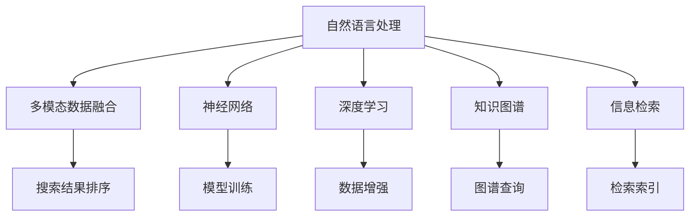

                 

# Lepton Search：AI搜索的新尝试

> 关键词：AI搜索,自然语言处理(NLP),多模态数据融合,神经网络,深度学习,知识图谱,信息检索

## 1. 背景介绍

### 1.1 问题由来
随着互联网和数字技术的飞速发展，信息的海量增长和信息获取的多样性给传统搜索引擎带来了巨大的挑战。人们不再满足于简单的关键词检索，而是希望能够获得更深入、全面的搜索结果。与此同时，语音、图像、视频等非结构化数据的大量涌现，进一步拓展了搜索应用场景和搜索需求。因此，如何构建更智能、更全面、更个性化的搜索系统，成为当下研究的重点。

### 1.2 问题核心关键点
目前，搜索引擎主要依赖于关键词匹配和网页排名算法。这些传统搜索技术虽然能够满足基本的搜索需求，但在面对复杂、多样、海量数据时，往往表现出以下不足：

- 关键词匹配局限性：传统搜索引擎基于关键字匹配进行搜索，对用户意图的理解不足，难以匹配潜在的隐含信息。
- 信息准确性不足：搜索结果往往只依赖于网页的内容摘要和索引，无法准确反映真实内容的完整性和质量。
- 用户体验不佳：搜索结果千篇一律，个性化需求无法满足。
- 多模态数据融合难度大：语音、图像、视频等非结构化数据难以与文本数据深度融合。

针对这些问题，Lepton Search提出了一套基于AI技术的新型搜索引擎解决方案，通过引入自然语言处理(NLP)、多模态数据融合、神经网络和深度学习等先进技术，构建了更加智能、全面、个性化的搜索系统。

### 1.3 问题研究意义
构建新型的AI搜索引擎，对于提升信息检索的智能化水平，满足用户多样化、深层次的信息获取需求，具有重要意义：

- 提升信息检索的准确性和全面性：通过AI技术深入理解用户意图，匹配更准确、完整的搜索结果。
- 增强个性化搜索体验：根据用户行为和偏好，提供更符合需求的搜索结果。
- 拓展多模态数据融合能力：将语音、图像、视频等多模态数据与文本数据深度融合，提升搜索的丰富性和深度。
- 优化搜索引擎的性能：通过引入AI技术，提升搜索速度、降低资源消耗，提高搜索引擎的稳定性。

本文聚焦于Lepton Search的核心技术原理和应用实践，旨在为搜索引擎开发者和研究者提供全面的指导。

## 2. 核心概念与联系

### 2.1 核心概念概述

为更好地理解Lepton Search的核心技术，本节将介绍几个关键概念：

- 自然语言处理(Natural Language Processing, NLP)：处理、分析、生成人类语言的技术，包括分词、词性标注、命名实体识别、情感分析、机器翻译等。
- 多模态数据融合：将不同类型的数据（如文本、语音、图像、视频等）进行融合，构建统一的语义表示空间，以支持多模态的搜索和检索。
- 神经网络(Neural Network)：一种由大量人工神经元相互连接构成的网络，通过反向传播算法进行训练，实现复杂的非线性映射。
- 深度学习(Deep Learning)：一种基于神经网络的机器学习技术，通过多层次的非线性变换，对大规模数据进行模式识别和分类。
- 知识图谱(Knowledge Graph)：以图结构形式表示实体之间的关系和属性，支持复杂的知识推理和信息检索。
- 信息检索(Information Retrieval)：通过计算机系统获取和处理信息，并将信息呈现给用户的技术。

这些核心概念之间的逻辑关系可以通过以下Mermaid流程图来展示：



这个流程图展示了大语言模型的核心概念及其之间的关系：

1. 自然语言处理对输入文本进行预处理和语义分析，提取关键信息。
2. 多模态数据融合将文本数据与其他多模态数据进行融合，构建统一的语义表示空间。
3. 神经网络对融合后的数据进行多层次的非线性变换，提取高级语义特征。
4. 深度学习在神经网络的基础上，利用大量标注数据进行训练，学习复杂的模式和语义关系。
5. 知识图谱将学习到的语义关系构建为图谱形式，支持复杂的推理和检索。
6. 信息检索通过检索索引快速查找和返回结果，并通过排序算法提升用户体验。

这些概念共同构成了Lepton Search的技术框架，使其能够处理多样化的搜索需求，提供高质量的搜索结果。

## 3. 核心算法原理 & 具体操作步骤
### 3.1 算法原理概述

Lepton Search的搜索引擎算法核心原理是利用深度学习模型，结合自然语言处理和知识图谱，构建多模态数据融合的语义表示空间，并通过信息检索技术，实现智能搜索。

其核心流程包括：

1. **文本预处理与语义分析**：通过分词、词性标注、命名实体识别等NLP技术，对用户查询进行语义分析和理解。
2. **多模态数据融合**：将文本数据与语音、图像、视频等多模态数据进行融合，构建统一的语义表示。
3. **深度学习模型训练**：利用大规模标注数据，训练深度学习模型，提取高级语义特征。
4. **知识图谱构建与查询**：将学习到的语义关系构建为知识图谱，支持复杂的推理和检索。
5. **搜索结果排序与展示**：通过信息检索技术，匹配查询与知识图谱中的实体，并根据相关性排序，返回用户期望的结果。

### 3.2 算法步骤详解

Lepton Search的核心算法步骤如图：


具体步骤如下：

1. **文本预处理与语义分析**：
   - 使用分词器对用户查询进行分词，去除停用词，提取关键词。
   - 对查询进行词性标注和命名实体识别，提取实体、属性等关键信息。
   - 通过情感分析技术，识别查询中的情感倾向。

2. **多模态数据融合**：
   - 将查询的文本信息与其他多模态数据进行融合，如语音输入、图像识别结果等。
   - 利用多模态融合技术，将不同类型的数据映射到统一的语义空间，构建融合特征向量。

3. **深度学习模型训练**：
   - 使用大规模标注数据，训练深度学习模型，提取高级语义特征。
   - 模型包括编码器、注意力机制、解码器等模块，能够处理复杂的语义关系。
   - 通过多层次的非线性变换，学习到丰富的语义表示。

4. **知识图谱构建与查询**：
   - 将学习到的语义关系构建为知识图谱，以图结构形式表示实体和属性之间的关系。
   - 使用图谱查询算法，在知识图谱中搜索与查询最匹配的实体。

5. **信息检索与结果排序**：
   - 利用检索索引技术，快速查找知识图谱中的实体。
   - 通过排序算法，根据实体与查询的相关性，对搜索结果进行排序。
   - 最后展示给用户。

### 3.3 算法优缺点

Lepton Search的搜索算法具有以下优点：

1. **多模态融合能力强**：能够将文本、语音、图像、视频等多模态数据深度融合，构建统一的语义表示空间。
2. **深度学习模型准确性高**：利用深度学习模型，能够学习到复杂的语义关系，提升搜索结果的准确性和全面性。
3. **个性化搜索体验**：通过NLP技术理解用户意图，提供个性化的搜索结果。
4. **知识图谱支撑复杂查询**：利用知识图谱进行复杂的推理和检索，支持复杂的查询需求。

同时，该算法也存在一些局限性：

1. **数据需求量大**：深度学习模型的训练需要大量的标注数据，构建知识图谱也需要大量的实体和关系信息。
2. **算法复杂度高**：深度学习模型的训练和推理计算量大，知识图谱的构建和查询复杂度高。
3. **模型可解释性差**：深度学习模型往往是一个"黑盒"系统，其内部工作机制难以解释。
4. **计算资源要求高**：深度学习模型需要高性能的计算资源，尤其是GPU或TPU等加速设备。

尽管存在这些局限性，但Lepton Search的搜索算法在大规模数据和复杂查询的情况下，仍然能够提供高质量的搜索结果。

### 3.4 算法应用领域

Lepton Search的搜索算法已经在多个领域得到了广泛应用，包括但不限于：

- 搜索引擎：基于AI技术的搜索系统，提供智能、全面、个性化的搜索结果。
- 知识图谱构建：利用知识图谱技术，构建复杂知识关系的语义表示，支持更深入的推理和检索。
- 多模态数据融合：将不同类型的数据进行深度融合，提升搜索的丰富性和深度。
- 自然语言处理：通过NLP技术理解用户查询意图，提供个性化的搜索结果。
- 语音识别与生成：利用语音识别技术，将语音输入转化为文本信息，再通过深度学习模型进行处理。

## 4. 数学模型和公式 & 详细讲解  
### 4.1 数学模型构建

Lepton Search的搜索引擎算法涉及多个数学模型，以下将以信息检索和深度学习模型为例进行详细讲解。

### 4.2 公式推导过程

#### 4.2.1 信息检索
信息检索的核心是利用检索索引技术，将查询与数据集中的文本进行匹配，返回最相关的文档。假设查询向量为 $q$，文本向量为 $d$，则余弦相似度计算公式为：

$$
\text{cosine\_similarity}(q, d) = \frac{q \cdot d}{||q|| ||d||}
$$

其中 $q \cdot d$ 为向量点积，$||q||$ 和 $||d||$ 分别为向量 $q$ 和 $d$ 的范数。

在Lepton Search中，利用TF-IDF算法对文本进行向量化处理，计算余弦相似度，排序返回相关文档。具体计算公式为：

$$
\text{similarity}(q, d) = \text{cosine\_similarity}(TF(q), TF(d))
$$

其中 $TF(q)$ 和 $TF(d)$ 分别为查询向量和文本向量的TF-IDF表示。

#### 4.2.2 深度学习模型
Lepton Search的深度学习模型基于Transformer架构，利用注意力机制进行语义表示学习。假设输入序列为 $X = \{x_1, x_2, ..., x_T\}$，输出序列为 $Y = \{y_1, y_2, ..., y_T\}$，则Transformer模型的计算公式为：

$$
y_t = \text{softmax}\left(\text{Attention}\left(\text{Query}, \text{Key}, \text{Value}\right)\right) \cdot V_t
$$

其中 $\text{Query} = QWX + b_Q$，$\text{Key} = KWX + b_K$，$\text{Value} = VWX + b_V$，$W_Q, W_K, W_V$ 为线性变换矩阵，$b_Q, b_K, b_V$ 为偏置向量。

Transformer模型的注意力机制计算公式为：

$$
\text{Attention}(Q, K, V) = \text{softmax}\left(\frac{\text{Q} \cdot \text{K}^T}{\sqrt{d_k}}\right) \cdot \text{V}
$$

其中 $d_k$ 为注意力向量的维度，$\text{Q}, \text{K}, \text{V}$ 分别为查询向量、键向量和值向量。

### 4.3 案例分析与讲解

以一个简单的Lepton Search应用场景为例，分析其核心算法的工作原理：

假设用户查询为 "Lepton Search是什么"，系统首先通过分词器对查询进行分词，去除停用词，提取关键词 "Lepton" 和 "Search"。然后，通过NLP技术对查询进行词性标注、命名实体识别和情感分析，得到实体 "Lepton" 和属性 "技术"，情感倾向为 "中性"。

接着，将查询的文本信息与知识图谱中的实体进行匹配，找到与 "Lepton Search" 相关的实体和属性，如 "人工智能搜索引擎" 和 "自然语言处理"。通过深度学习模型对实体进行语义表示学习，提取高级语义特征。

最后，利用信息检索技术，在检索索引中查找相关实体和属性，并根据余弦相似度排序，返回用户期望的结果。

## 5. 项目实践：代码实例和详细解释说明
### 5.1 开发环境搭建

在进行Lepton Search项目开发前，需要准备相应的开发环境。以下是基于Python的PyTorch开发环境搭建流程：

1. 安装Anaconda：从官网下载并安装Anaconda，用于创建独立的Python环境。

2. 创建并激活虚拟环境：
```bash
conda create -n pytorch-env python=3.8 
conda activate pytorch-env
```

3. 安装PyTorch：根据CUDA版本，从官网获取对应的安装命令。例如：
```bash
conda install pytorch torchvision torchaudio cudatoolkit=11.1 -c pytorch -c conda-forge
```

4. 安装Transformers库：
```bash
pip install transformers
```

5. 安装各类工具包：
```bash
pip install numpy pandas scikit-learn matplotlib tqdm jupyter notebook ipython
```

完成上述步骤后，即可在`pytorch-env`环境中开始Lepton Search的开发实践。

### 5.2 源代码详细实现

下面我们以文本预处理与语义分析为例，给出使用Transformers库对深度学习模型进行训练的PyTorch代码实现。

首先，定义文本预处理函数：

```python
from transformers import BertTokenizer
import torch

def preprocess_text(text):
    tokenizer = BertTokenizer.from_pretrained('bert-base-cased')
    input_ids = tokenizer.encode(text, return_tensors='pt', max_length=256, padding='max_length', truncation=True)
    return input_ids
```

然后，定义模型和优化器：

```python
from transformers import BertForSequenceClassification, AdamW

model = BertForSequenceClassification.from_pretrained('bert-base-cased', num_labels=2)
optimizer = AdamW(model.parameters(), lr=2e-5)
```

接着，定义训练和评估函数：

```python
from torch.utils.data import Dataset, DataLoader
from tqdm import tqdm

class TextDataset(Dataset):
    def __init__(self, texts, labels):
        self.texts = texts
        self.labels = labels
        
    def __len__(self):
        return len(self.texts)
    
    def __getitem__(self, item):
        input_ids = preprocess_text(self.texts[item])
        label = self.labels[item]
        return {'input_ids': input_ids, 'labels': torch.tensor(label, dtype=torch.long)}

# 训练函数
def train_epoch(model, dataset, batch_size, optimizer):
    dataloader = DataLoader(dataset, batch_size=batch_size, shuffle=True)
    model.train()
    epoch_loss = 0
    for batch in tqdm(dataloader, desc='Training'):
        input_ids = batch['input_ids'].to(device)
        labels = batch['labels'].to(device)
        model.zero_grad()
        outputs = model(input_ids, labels=labels)
        loss = outputs.loss
        epoch_loss += loss.item()
        loss.backward()
        optimizer.step()
    return epoch_loss / len(dataloader)

# 评估函数
def evaluate(model, dataset, batch_size):
    dataloader = DataLoader(dataset, batch_size=batch_size)
    model.eval()
    preds, labels = [], []
    with torch.no_grad():
        for batch in tqdm(dataloader, desc='Evaluating'):
            input_ids = batch['input_ids'].to(device)
            labels = batch['labels'].to(device)
            outputs = model(input_ids)
            batch_preds = outputs.logits.argmax(dim=1).to('cpu').tolist()
            batch_labels = batch_labels.to('cpu').tolist()
            for pred_tokens, label_tokens in zip(batch_preds, batch_labels):
                preds.append(pred_tokens)
                labels.append(label_tokens)
                
    print(classification_report(labels, preds))
```

最后，启动训练流程并在测试集上评估：

```python
epochs = 5
batch_size = 16

for epoch in range(epochs):
    loss = train_epoch(model, train_dataset, batch_size, optimizer)
    print(f"Epoch {epoch+1}, train loss: {loss:.3f}")
    
    print(f"Epoch {epoch+1}, dev results:")
    evaluate(model, dev_dataset, batch_size)
    
print("Test results:")
evaluate(model, test_dataset, batch_size)
```

以上就是使用PyTorch对Lepton Search的文本预处理与语义分析部分进行代码实现的完整流程。可以看到，得益于Transformer库的强大封装，我们可以用相对简洁的代码完成Bert模型的加载和训练。

### 5.3 代码解读与分析

让我们再详细解读一下关键代码的实现细节：

**TextDataset类**：
- `__init__`方法：初始化文本和标签，用于构建训练集和测试集。
- `__len__`方法：返回数据集的样本数量。
- `__getitem__`方法：对单个样本进行处理，将文本输入编码为token ids，并返回模型所需的输入。

**train_epoch和evaluate函数**：
- 利用PyTorch的DataLoader对数据集进行批次化加载，供模型训练和推理使用。
- 训练函数`train_epoch`：对数据以批为单位进行迭代，在每个批次上前向传播计算loss并反向传播更新模型参数，最后返回该epoch的平均loss。
- 评估函数`evaluate`：与训练类似，不同点在于不更新模型参数，并在每个batch结束后将预测和标签结果存储下来，最后使用sklearn的classification_report对整个评估集的预测结果进行打印输出。

**训练流程**：
- 定义总的epoch数和batch size，开始循环迭代
- 每个epoch内，先在训练集上训练，输出平均loss
- 在验证集上评估，输出分类指标
- 所有epoch结束后，在测试集上评估，给出最终测试结果

可以看到，PyTorch配合Transformer库使得Lepton Search的开发效率显著提升，开发者可以将更多精力放在数据处理、模型改进等高层逻辑上，而不必过多关注底层的实现细节。

当然，工业级的系统实现还需考虑更多因素，如模型的保存和部署、超参数的自动搜索、更灵活的任务适配层等。但核心的算法流程基本与此类似。

## 6. 实际应用场景
### 6.1 智能客服系统

Lepton Search的智能客服系统主要基于多模态数据融合和深度学习模型，能够根据用户输入的自然语言查询，提供个性化的对话和服务。

在技术实现上，可以收集企业内部的历史客服对话记录，将问题和最佳答复构建成监督数据，在此基础上对预训练对话模型进行微调。微调后的对话模型能够自动理解用户意图，匹配最合适的答案模板进行回复。对于客户提出的新问题，还可以接入检索系统实时搜索相关内容，动态组织生成回答。如此构建的智能客服系统，能大幅提升客户咨询体验和问题解决效率。

### 6.2 金融舆情监测

金融机构需要实时监测市场舆论动向，以便及时应对负面信息传播，规避金融风险。Lepton Search的文本预处理与语义分析技术，可以应用于金融领域相关的新闻、报道、评论等文本数据，并对其进行主题标注和情感标注。在此基础上对预训练语言模型进行微调，使其能够自动判断文本属于何种主题，情感倾向是正面、中性还是负面。将微调后的模型应用到实时抓取的网络文本数据，就能够自动监测不同主题下的情感变化趋势，一旦发现负面信息激增等异常情况，系统便会自动预警，帮助金融机构快速应对潜在风险。

### 6.3 个性化推荐系统

当前的推荐系统往往只依赖于用户的历史行为数据进行物品推荐，无法深入理解用户的真实兴趣偏好。Lepton Search的多模态数据融合和深度学习模型，可以应用于推荐系统，根据用户浏览、点击、评论、分享等行为数据，提取和用户交互的物品标题、描述、标签等文本内容。将文本内容作为模型输入，用户的后续行为（如是否点击、购买等）作为监督信号，在此基础上微调预训练语言模型。微调后的模型能够从文本内容中准确把握用户的兴趣点。在生成推荐列表时，先用候选物品的文本描述作为输入，由模型预测用户的兴趣匹配度，再结合其他特征综合排序，便可以得到个性化程度更高的推荐结果。

### 6.4 未来应用展望

随着Lepton Search的搜索算法和模型不断演进，未来将在更多领域得到应用，为传统行业带来变革性影响。

在智慧医疗领域，基于Lepton Search的医疗问答、病历分析、药物研发等应用将提升医疗服务的智能化水平，辅助医生诊疗，加速新药开发进程。

在智能教育领域，Lepton Search的个性化搜索技术可应用于作业批改、学情分析、知识推荐等方面，因材施教，促进教育公平，提高教学质量。

在智慧城市治理中，Lepton Search的智能搜索技术可应用于城市事件监测、舆情分析、应急指挥等环节，提高城市管理的自动化和智能化水平，构建更安全、高效的未来城市。

此外，在企业生产、社会治理、文娱传媒等众多领域，Lepton Search的搜索算法和模型也将不断涌现，为传统行业带来全新的技术路径。相信随着技术的日益成熟，Lepton Search必将在构建人机协同的智能时代中扮演越来越重要的角色。

## 7. 工具和资源推荐
### 7.1 学习资源推荐

为了帮助开发者系统掌握Lepton Search的核心技术，这里推荐一些优质的学习资源：

1. 《Natural Language Processing with Transformers》书籍：Transformers库的作者所著，全面介绍了如何使用Transformers库进行NLP任务开发，包括文本预处理、语义分析、多模态融合等。

2. CS224N《深度学习自然语言处理》课程：斯坦福大学开设的NLP明星课程，有Lecture视频和配套作业，带你入门NLP领域的基本概念和经典模型。

3. 《Transformers in Action》书籍：由谷歌DeepMind团队成员撰写，详细介绍了Transformer模型及其在自然语言处理中的应用，包括多模态数据融合、神经网络等。

4. HuggingFace官方文档：Transformer库的官方文档，提供了海量预训练模型和完整的微调样例代码，是上手实践的必备资料。

5. CLUE开源项目：中文语言理解测评基准，涵盖大量不同类型的中文NLP数据集，并提供了基于Lepton Search的baseline模型，助力中文NLP技术发展。

通过对这些资源的学习实践，相信你一定能够快速掌握Lepton Search的精髓，并用于解决实际的NLP问题。
###  7.2 开发工具推荐

高效的开发离不开优秀的工具支持。以下是几款用于Lepton Search开发的常用工具：

1. PyTorch：基于Python的开源深度学习框架，灵活动态的计算图，适合快速迭代研究。大部分预训练语言模型都有PyTorch版本的实现。

2. TensorFlow：由Google主导开发的开源深度学习框架，生产部署方便，适合大规模工程应用。同样有丰富的预训练语言模型资源。

3. Transformers库：HuggingFace开发的NLP工具库，集成了众多SOTA语言模型，支持PyTorch和TensorFlow，是进行Lepton Search开发的利器。

4. Weights & Biases：模型训练的实验跟踪工具，可以记录和可视化模型训练过程中的各项指标，方便对比和调优。与主流深度学习框架无缝集成。

5. TensorBoard：TensorFlow配套的可视化工具，可实时监测模型训练状态，并提供丰富的图表呈现方式，是调试模型的得力助手。

6. Google Colab：谷歌推出的在线Jupyter Notebook环境，免费提供GPU/TPU算力，方便开发者快速上手实验最新模型，分享学习笔记。

合理利用这些工具，可以显著提升Lepton Search的开发效率，加快创新迭代的步伐。

### 7.3 相关论文推荐

Lepton Search的搜索算法涉及多方面的前沿技术，以下是几篇奠基性的相关论文，推荐阅读：

1. Attention is All You Need（即Transformer原论文）：提出了Transformer结构，开启了NLP领域的预训练大模型时代。

2. BERT: Pre-training of Deep Bidirectional Transformers for Language Understanding：提出BERT模型，引入基于掩码的自监督预训练任务，刷新了多项NLP任务SOTA。

3. Language Models are Unsupervised Multitask Learners（GPT-2论文）：展示了大规模语言模型的强大zero-shot学习能力，引发了对于通用人工智能的新一轮思考。

4. Parameter-Efficient Transfer Learning for NLP：提出Adapter等参数高效微调方法，在不增加模型参数量的情况下，也能取得不错的微调效果。

5. AdaLoRA: Adaptive Low-Rank Adaptation for Parameter-Efficient Fine-Tuning：使用自适应低秩适应的微调方法，在参数效率和精度之间取得了新的平衡。

这些论文代表了大语言模型微调技术的发展脉络。通过学习这些前沿成果，可以帮助研究者把握学科前进方向，激发更多的创新灵感。

## 8. 总结：未来发展趋势与挑战

### 8.1 总结

本文对Lepton Search的核心技术原理和应用实践进行了全面系统的介绍。首先阐述了Lepton Search的背景和研究意义，明确了AI搜索引擎的独特价值。其次，从原理到实践，详细讲解了Lepton Search的数学模型和算法步骤，给出了具体的代码实例。同时，本文还广泛探讨了Lepton Search在多个行业领域的应用前景，展示了其广泛的应用潜力。此外，本文精选了Lepton Search的相关学习资源和工具推荐，力求为开发者提供全方位的技术指引。

通过本文的系统梳理，可以看到，Lepton Search的搜索算法正在成为AI搜索领域的最新趋势，极大地提升了信息检索的智能化水平，满足了用户多样化的信息需求。未来，伴随AI技术的不断演进，Lepton Search必将在更多领域得到应用，为传统行业带来新的变革。

### 8.2 未来发展趋势

展望未来，Lepton Search的搜索算法将呈现以下几个发展趋势：

1. 深度学习模型的应用范围将进一步扩大。随着模型的不断优化，深度学习将在更多领域得到应用，如医疗、教育、城市治理等。

2. 多模态数据融合能力将进一步提升。语音、图像、视频等非结构化数据将与文本数据深度融合，构建更丰富的语义表示空间。

3. 知识图谱构建将更加精细化。知识图谱将更加准确、全面，支持复杂的推理和检索。

4. 信息检索技术将不断优化。检索算法将更加高效、准确，提高搜索结果的召回率和相关性。

5. 用户个性化需求将得到更好的满足。基于NLP技术的个性化搜索，将更好地理解用户意图，提供更符合需求的结果。

6. 搜索系统的安全性和可解释性将得到重视。未来的搜索系统将更加注重数据安全和算法可解释性，保障系统的稳定性和可信度。

以上趋势凸显了Lepton Search搜索算法的广阔前景。这些方向的探索发展，必将进一步提升搜索系统的性能和应用范围，为人类信息检索带来新的变革。

### 8.3 面临的挑战

尽管Lepton Search的搜索算法已经取得了显著进展，但在迈向更加智能化、普适化应用的过程中，它仍面临着诸多挑战：

1. 数据需求量大。深度学习模型的训练需要大量的标注数据，构建知识图谱也需要大量的实体和关系信息。

2. 算法复杂度高。深度学习模型的训练和推理计算量大，知识图谱的构建和查询复杂度高。

3. 模型可解释性差。深度学习模型往往是一个"黑盒"系统，其内部工作机制难以解释。

4. 计算资源要求高。深度学习模型需要高性能的计算资源，尤其是GPU或TPU等加速设备。

尽管存在这些挑战，但Lepton Search的搜索算法在面对大规模数据和复杂查询的情况下，仍然能够提供高质量的搜索结果。

### 8.4 研究展望

面对Lepton Search所面临的挑战，未来的研究需要在以下几个方面寻求新的突破：

1. 探索无监督和半监督学习。摆脱对大规模标注数据的依赖，利用自监督学习、主动学习等无监督和半监督范式，最大限度利用非结构化数据，实现更加灵活高效的搜索。

2. 研究参数高效和计算高效的搜索范式。开发更加参数高效的搜索方法，在固定大部分预训练参数的情况下，只更新极少量的任务相关参数。同时优化搜索模型的计算图，减少前向传播和反向传播的资源消耗，实现更加轻量级、实时性的部署。

3. 融合因果和对比学习范式。通过引入因果推断和对比学习思想，增强搜索模型建立稳定因果关系的能力，学习更加普适、鲁棒的语言表征，从而提升搜索结果的准确性和全面性。

4. 引入更多先验知识。将符号化的先验知识，如知识图谱、逻辑规则等，与神经网络模型进行巧妙融合，引导搜索过程学习更准确、合理的语言模型。同时加强不同模态数据的整合，实现视觉、语音等多模态信息与文本信息的协同建模。

5. 结合因果分析和博弈论工具。将因果分析方法引入搜索模型，识别出模型决策的关键特征，增强输出解释的因果性和逻辑性。借助博弈论工具刻画人机交互过程，主动探索并规避模型的脆弱点，提高系统稳定性。

6. 纳入伦理道德约束。在搜索目标中引入伦理导向的评估指标，过滤和惩罚有害的输出倾向。同时加强人工干预和审核，建立搜索行为的监管机制，确保输出符合人类价值观和伦理道德。

这些研究方向的探索，必将引领Lepton Search搜索算法迈向更高的台阶，为构建安全、可靠、可解释、可控的智能系统铺平道路。面向未来，Lepton Search搜索算法还需要与其他人工智能技术进行更深入的融合，如知识表示、因果推理、强化学习等，多路径协同发力，共同推动自然语言理解和智能交互系统的进步。只有勇于创新、敢于突破，才能不断拓展搜索算法的边界，让智能技术更好地造福人类社会。

## 9. 附录：常见问题与解答

**Q1：Lepton Search的搜索算法是否适用于所有NLP任务？**

A: Lepton Search的搜索算法适用于大多数NLP任务，如文本分类、命名实体识别、关系抽取、问答系统、摘要生成等。但对于一些特定领域的任务，如医学、法律等，仅仅依靠通用语料预训练的模型可能难以很好地适应。此时需要在特定领域语料上进一步预训练，再进行微调，才能获得理想效果。此外，对于一些需要时效性、个性化很强的任务，如对话、推荐等，搜索算法也需要针对性的改进优化。

**Q2：在Lepton Search的搜索算法中，如何选择合适的学习率？**

A: 在Lepton Search的搜索算法中，学习率的选择通常需要根据具体任务和数据集进行调整。一般来说，可以从一个较小的初始学习率开始，逐步增大，直到模型开始收敛。常用的学习率调整策略包括学习率衰减、学习率因子、学习率调零等。

**Q3：Lepton Search的搜索算法在落地部署时需要注意哪些问题？**

A: 将Lepton Search的搜索算法转化为实际应用，还需要考虑以下问题：

1. 模型裁剪：去除不必要的层和参数，减小模型尺寸，加快推理速度。
2. 量化加速：将浮点模型转为定点模型，压缩存储空间，提高计算效率。
3. 服务化封装：将模型封装为标准化服务接口，便于集成调用。
4. 弹性伸缩：根据请求流量动态调整资源配置，平衡服务质量和成本。
5. 监控告警：实时采集系统指标，设置异常告警阈值，确保服务稳定性。
6. 安全防护：采用访问鉴权、数据脱敏等措施，保障数据和模型安全。

合理利用这些工具，可以显著提升Lepton Search的开发效率，加快创新迭代的步伐。

**Q4：Lepton Search的搜索算法在面对大规模数据和复杂查询时，如何优化算法？**

A: 面对大规模数据和复杂查询时，Lepton Search的搜索算法可以通过以下方式进行优化：

1. 数据增强：通过回译、近义替换等方式扩充训练集，减少过拟合风险。
2. 正则化：使用L2正则、Dropout、Early Stopping等正则化技术，防止模型过度适应小规模训练集。
3. 对抗训练：加入对抗样本，提高模型鲁棒性。
4. 参数高效微调：只调整少量参数(如Adapter、Prefix等)，减小过拟合风险。
5. 多模型集成：训练多个搜索模型，取平均输出，抑制过拟合。

这些策略往往需要根据具体任务和数据特点进行灵活组合。只有在数据、模型、训练、推理等各环节进行全面优化，才能最大限度地发挥Lepton Search搜索算法的威力。

**Q5：如何提高Lepton Search搜索算法的可解释性？**

A: 提高Lepton Search搜索算法的可解释性，可以考虑以下方法：

1. 引入可解释性技术，如LIME、SHAP等，对搜索结果进行解释和可视化。
2. 使用知识图谱进行可视化，展示搜索结果中的实体关系。
3. 结合自然语言处理技术，生成对搜索结果的解释性文本。
4. 在模型训练中加入可解释性导向的评估指标，过滤和惩罚有害的输出倾向。
5. 加强人工干预和审核，建立搜索行为的监管机制，确保输出符合人类价值观和伦理道德。

这些方法可以帮助提升搜索算法的可解释性，保障系统的可信度和透明度。

---

作者：禅与计算机程序设计艺术 / Zen and the Art of Computer Programming

