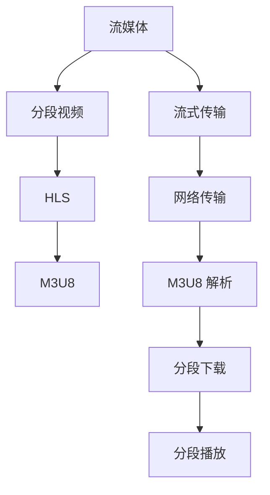

                 

# M3U8 播放列表：分段视频的索引

> 关键词：M3U8, 分段视频, 索引, 流媒体, HLS, 多媒体, 流式传输

## 1. 背景介绍

随着互联网的高速发展和智能设备的普及，流媒体视频已逐渐成为人们获取信息的主要方式之一。相较于传统的下载观看方式，流媒体视频可以实时更新，用户可以不受时间和地点限制地观看内容。M3U8 文件作为一种分段视频的索引文件，为流媒体视频的播放提供了重要支持。

### 1.1 问题由来

在流媒体传输中，为了适应不同网络条件，并确保视频的流畅播放，通常会将视频内容分割成多个小片段，分别进行传输。分段视频的数据量较小，传输速度较快，能够更好地适应各种网络环境。而 M3U8 文件则起到了索引和调度这些分段视频的作用。

### 1.2 问题核心关键点

M3U8 文件是一个纯文本文件，通过它，客户端能够知道视频分段的位置、大小和播放顺序等信息。其内容通常包括以下部分：

- **媒体资源定位信息**：包括每个分段文件的 URL、起始时间和长度等。
- **播放列表控制信息**：如播放顺序、自动加载等控制指令。

M3U8 的原理和实际应用中，需要解决的关键问题包括：如何高效生成和解析 M3U8 文件，如何根据当前网络条件动态调整分段大小和顺序，如何确保分段下载和播放的同步性等。

## 2. 核心概念与联系

### 2.1 核心概念概述

为更好地理解 M3U8 文件的原理和实际应用，本节将介绍几个密切相关的核心概念：

- **流媒体（Streaming Media）**：通过网络将多媒体文件分割成多个小片段，按顺序播放的过程。常见的流媒体协议包括 RTMP、HLS、DASH 等。
- **分段视频（Segmented Video）**：将视频内容分割成多个小片段，按顺序播放的视频。分段视频能够适应不同的网络条件，提高视频传输和播放的稳定性。
- **HLS（HTTP Live Streaming）**：Apple 提出的一种流媒体协议，采用 HTTP 协议传输数据，支持实时直播和点播。HLS 将视频分割成多个 TS 格式的小片段，由 M3U8 文件索引。
- **M3U8（Media Playlist 8）**：用于索引分段视频的纯文本文件，包含了分段的位置、大小和播放顺序等信息。M3U8 文件被 HTTP 协议传输给客户端。
- **流式传输（Streaming）**：视频数据的实时传输方式，通过不断更新，实现视频的流畅播放。流式传输需要高效的网络传输和资源调度策略。

这些核心概念之间的逻辑关系可以通过以下 Mermaid 流程图来展示：



这个流程图展示了流媒体、分段视频、HLS、M3U8 以及流式传输之间的逻辑关系：

1. 流媒体通过网络将多媒体文件分割成多个分段视频。
2. HLS 协议将分段视频索引为 M3U8 文件。
3. 客户端通过 HTTP 协议获取 M3U8 文件，解析后进行分段下载和播放。
4. 流式传输保证了视频数据的实时更新和流畅播放。

## 3. 核心算法原理 & 具体操作步骤
### 3.1 算法原理概述

M3U8 文件本质是一个由多个控制命令和媒体资源定位信息组成的文本文件，客户端通过解析 M3U8 文件，获得视频的播放信息。其核心原理包括：

1. **分段索引**：M3U8 文件包含了每个分段视频的位置、大小和起始时间等信息，客户端通过这些信息下载分段文件。
2. **播放控制**：M3U8 文件包含了播放列表的控制命令，如播放顺序、自动加载等，客户端通过解析这些命令，控制分段视频的播放顺序和模式。
3. **自适应传输**：M3U8 文件可以根据当前网络条件动态调整分段大小和顺序，保证视频的流畅播放。

### 3.2 算法步骤详解

基于 M3U8 文件的核心原理，其生成和解析的过程包括以下几个关键步骤：

**Step 1: 准备分段视频**
- 将原始视频文件分割成多个小片段，生成分段文件。每个分段文件的大小应根据当前网络条件进行优化，确保流畅播放。

**Step 2: 生成 M3U8 文件**
- 遍历所有分段文件，按照时间顺序或者文件大小顺序，将每个分段的文件位置、大小和起始时间等信息写入 M3U8 文件。
- 添加必要的控制命令，如播放顺序、自动加载等，优化播放体验。

**Step 3: 解析 M3U8 文件**
- 客户端通过 HTTP 协议获取 M3U8 文件。
- 解析 M3U8 文件，获取每个分段文件的位置、大小和起始时间等信息。
- 根据控制命令，调整分段下载和播放顺序，实现自适应传输。

**Step 4: 分段下载和播放**
- 根据解析的信息，客户端按顺序下载分段文件。
- 按照顺序播放分段视频，实现流畅的流式传输。

### 3.3 算法优缺点

M3U8 文件作为一种流媒体分段视频的索引方式，具有以下优点：

1. **高效索引**：M3U8 文件通过纯文本格式索引分段视频，可以快速解析和下载。
2. **自适应传输**：通过动态调整分段大小和顺序，适应不同网络条件，提高视频播放的稳定性和流畅性。
3. **灵活控制**：通过添加控制命令，如播放顺序、自动加载等，优化播放体验。

同时，M3U8 文件也存在以下缺点：

1. **文件大小限制**：M3U8 文件本身是一个文本文件，如果分段数量过多，文件大小可能变得过大，影响网络传输效率。
2. **分段上传效率**：分段视频需要分别上传，上传效率较低，尤其是在网络状况较差的情况下。
3. **实时更新困难**：由于分段视频需要先全部下载，再播放，实时更新的效率较低。

尽管存在这些局限性，但就目前而言，M3U8 文件仍是流媒体视频播放的重要技术手段，广泛应用于直播、点播等场景。未来相关研究的重点在于如何进一步优化分段大小、降低文件大小、提高实时更新效率等方面，以提升用户的观看体验。

### 3.4 算法应用领域

M3U8 文件作为一种流媒体分段视频的索引方式，在众多领域得到了广泛应用：

- **直播流媒体**：在直播场景中，M3U8 文件能够实时更新分段视频，适应网络条件，实现流畅直播。
- **点播视频**：在点播场景中，M3U8 文件能够索引分段视频，实现灵活控制和自适应传输，提高视频播放体验。
- **流媒体广告**：在流媒体广告中，M3U8 文件能够索引分段广告，实现动态加载和播放，提升广告效果。
- **视频会议**：在视频会议中，M3U8 文件能够索引分段视频，实现流畅传输和控制，保障会议的顺利进行。

## 4. 数学模型和公式 & 详细讲解
### 4.1 数学模型构建

在 M3U8 文件的生成和解析过程中，可以构建以下数学模型：

设 $n$ 为分段视频的数量，每个分段视频的大小为 $s_i$，起始时间为 $t_i$，位置为 $u_i$。M3U8 文件可以表示为：

$$
\text{M3U8} = \{t_1, s_1, u_1, t_2, s_2, u_2, \ldots, t_n, s_n, u_n\}
$$

其中 $t_i$ 表示第 $i$ 个分段视频的起始时间，$s_i$ 表示第 $i$ 个分段视频的大小，$u_i$ 表示第 $i$ 个分段视频的位置。

### 4.2 公式推导过程

M3U8 文件包含多个控制命令和媒体资源定位信息，其具体格式如下：

```
#EXTM3U
#EXT-X-VERSION: 3
#EXT-X-MEDIA: "id=0,segmentTemplate=media.m3u8",trackID=0
#EXT-X-STREAM-INF: bandwidth=1080000,variantLength=640000,sampleDuration=0,timescale=0
#EXT-X-INDEPENDENT-SEGMENTS true
#EXT-X-PLAYLIST-TYPE: VOD
#EXT-X-DEFAULT-CODEC: avc1.64001E
#EXT-X-PROGRAM-DURATION-TIMESTAMP: 0
#EXT-X-START: 0
#EXT-X-ENDLIST
MEDIA_SEQUENCE=0
#EXTINF: duration=60
http://example.com/media/00000001.m3u8
#EXTINF: duration=60
http://example.com/media/00000002.m3u8
#EXTINF: duration=60
http://example.com/media/00000003.m3u8
#EXTINF: duration=60
http://example.com/media/00000004.m3u8
```

其中，`#EXT-X-VERSION` 表示 M3U8 文件的版本，`#EXT-X-MEDIA` 和 `#EXT-X-STREAM-INF` 定义了分段视频的信息，`#EXT-X-PLAYLIST-TYPE` 表示播放列表类型，`#EXT-X-DEFAULT-CODEC` 定义了默认的编解码器，`#EXT-X-PROGRAM-DURATION-TIMESTAMP` 和 `#EXT-X-START` 表示播放列表的总时长和起始位置，`#EXT-X-ENDLIST` 表示播放列表的结束标志。

### 4.3 案例分析与讲解

以一个简单的分段视频为例，假设分段视频的总时长为 240 秒，分段大小为 60 秒，总共有 4 个分段。则 M3U8 文件可以表示为：

```
#EXTM3U
#EXT-X-VERSION: 3
#EXT-X-MEDIA: "id=0,segmentTemplate=media.m3u8",trackID=0
#EXT-X-STREAM-INF: bandwidth=1080000,variantLength=640000,sampleDuration=0,timescale=0
#EXT-X-INDEPENDENT-SEGMENTS true
#EXT-X-PLAYLIST-TYPE: VOD
#EXT-X-DEFAULT-CODEC: avc1.64001E
#EXT-X-PROGRAM-DURATION-TIMESTAMP: 0
#EXT-X-START: 0
#EXT-X-ENDLIST
MEDIA_SEQUENCE=0
#EXTINF: duration=60
http://example.com/media/00000001.m3u8
#EXTINF: duration=60
http://example.com/media/00000002.m3u8
#EXTINF: duration=60
http://example.com/media/00000003.m3u8
#EXTINF: duration=60
http://example.com/media/00000004.m3u8
```

解析 M3U8 文件的过程包括：

1. 解析控制命令，如 `#EXT-X-VERSION`、`#EXT-X-MEDIA` 等，获取媒体资源和播放列表类型等基本信息。
2. 解析媒体资源定位信息，如 `#EXT-X-STREAM-INF`，获取分段大小、带宽等参数。
3. 解析分段信息，如 `#EXTINF: duration=60`，获取分段的时长和位置，下载分段文件。
4. 根据控制命令，调整分段下载和播放顺序，实现自适应传输。

## 5. 项目实践：代码实例和详细解释说明
### 5.1 开发环境搭建

在进行 M3U8 文件生成和解析的实践前，我们需要准备好开发环境。以下是使用 Python 进行开发的环境配置流程：

1. 安装 Python：从官网下载并安装 Python，建议安装最新版本。
2. 安装 pip：在终端运行 `python -m pip install --upgrade pip`。
3. 安装第三方库：
   ```
   pip install m3u8
   ```
4. 配置环境：使用 `m3u8` 库提供的 API 进行分段视频的生成和解析。

### 5.2 源代码详细实现

下面我们以一个简单的分段视频为例，使用 Python 的 `m3u8` 库实现 M3U8 文件的生成和解析。

首先，生成分段视频：

```python
import os
import m3u8

# 原始视频文件路径
original_file = 'example.mp4'
# 分段大小（单位：秒）
segment_duration = 60
# 生成分段数量
num_segments = 4

# 计算分段时长
total_duration = os.path.getsize(original_file) / 8 / 1000 / 1000  # 将视频大小转换为秒
segment_count = int(total_duration / segment_duration) + 1
if segment_count < num_segments:
    num_segments = segment_count

# 生成分段视频
segments = []
start_time = 0
for i in range(num_segments):
    segment_file = f"segment{i}.m3u8"
    segment_url = f"http://example.com/{segment_file}"
    segments.append((start_time, segment_duration, segment_url))
    start_time += segment_duration

# 生成 M3U8 文件
m3u8_file = "example.m3u8"
with open(m3u8_file, 'w') as f:
    f.write('#EXTM3U\n')
    f.write('#EXT-X-VERSION: 3\n')
    f.write('#EXT-X-MEDIA: "id=0,segmentTemplate=media.m3u8",trackID=0\n')
    f.write('#EXT-X-STREAM-INF: bandwidth=1080000,variantLength=640000,sampleDuration=0,timescale=0\n')
    f.write('#EXT-X-INDEPENDENT-SEGMENTS true\n')
    f.write('#EXT-X-PLAYLIST-TYPE: VOD\n')
    f.write('#EXT-X-DEFAULT-CODEC: avc1.64001E\n')
    f.write('#EXT-X-PROGRAM-DURATION-TIMESTAMP: 0\n')
    f.write('#EXT-X-START: 0\n')
    f.write('#EXT-X-ENDLIST\n')
    f.write(f'#EXTINF: duration={segment_duration}, media={"segment"}{i}.m3u8\n')
```

然后，解析 M3U8 文件：

```python
import m3u8

# 加载 M3U8 文件
m3u8_file = 'example.m3u8'
playlist = m3u8.m3u8Playlist()
playlist.load(m3u8_file)

# 遍历分段信息
for i, segment in enumerate(playlist.segments):
    print(f"Segment {i+1}: {segment.url}")
    # 下载分段视频
    with open(segment.url.split('/')[-1], 'wb') as f:
        f.write(requests.get(segment.url).content)
```

### 5.3 代码解读与分析

让我们再详细解读一下关键代码的实现细节：

**分段视频生成**：
- 计算分段数量和时长，确保分段视频能够完整覆盖原始视频。
- 遍历分段，生成分段 URL，并写入 M3U8 文件。

**M3U8 文件解析**：
- 使用 `m3u8` 库加载 M3U8 文件，遍历分段信息，输出分段 URL 并下载分段视频。

可以看出，Python 的 `m3u8` 库提供了方便的 API，能够快速生成和解析 M3U8 文件，实现分段视频的自适应传输。

## 6. 实际应用场景
### 6.1 视频直播

在视频直播中，M3U8 文件能够实现实时的分段视频传输，适应不同的网络条件，保证视频播放的流畅性。具体应用场景包括：

- **直播平台**：如 YouTube、Twitch 等平台，使用 M3U8 文件进行实时直播，适应不同网络环境。
- **企业视频会议**：企业内部使用 M3U8 文件进行视频直播，实现跨地域、跨网络的视频会议。

### 6.2 点播视频

在点播视频中，M3U8 文件能够实现分段视频的索引，实现自适应传输和灵活控制。具体应用场景包括：

- **视频平台**：如 Netflix、爱奇艺等平台，使用 M3U8 文件进行点播视频的索引，实现自适应传输。
- **企业视频库**：企业内部使用 M3U8 文件进行点播视频的索引，实现灵活控制和自适应传输。

### 6.3 流媒体广告

在流媒体广告中，M3U8 文件能够实现分段广告的动态加载和播放，提升广告效果。具体应用场景包括：

- **视频平台**：如 YouTube、Tencent 视频等平台，使用 M3U8 文件进行流媒体广告的索引，实现动态加载。
- **广告平台**：如 Google AdSense、Facebook Ads 等平台，使用 M3U8 文件进行流媒体广告的索引，实现灵活控制。

## 7. 工具和资源推荐
### 7.1 学习资源推荐

为了帮助开发者系统掌握 M3U8 文件的原理和实际应用，这里推荐一些优质的学习资源：

1. **流媒体技术学习**：流媒体技术是 M3U8 文件应用的重要基础，可以参考《流媒体技术详解》等书籍，全面掌握流媒体技术的基本原理和应用场景。
2. **M3U8 文件解析**：M3U8 文件解析是实现分段视频自适应传输的关键，可以参考《M3U8 文件解析原理》等博客，深入理解 M3U8 文件的格式和解析方法。
3. **HLS 协议学习**：HLS 协议是 M3U8 文件应用的重要组成部分，可以参考 Apple 提供的 HLS 协议文档，了解 HLS 协议的基本原理和实现细节。

### 7.2 开发工具推荐

高效的开发离不开优秀的工具支持。以下是几款用于 M3U8 文件生成和解析开发的常用工具：

1. **m3u8 库**：Python 的 `m3u8` 库提供了方便的 API，能够快速生成和解析 M3U8 文件。
2. **FFmpeg**：FFmpeg 是一款强大的多媒体处理工具，支持多种格式的媒体文件转换，包括分段视频的生成和解析。
3. **HLS Live Encoder**：Apple 提供的 HLS 直播编码工具，支持将视频文件编码为 HLS 格式的分段视频，并生成 M3U8 文件。
4. **IIS Smooth Streaming**：微软提供的流媒体服务，支持将视频文件编码为 HLS 格式的分段视频，并生成 M3U8 文件。

### 7.3 相关论文推荐

M3U8 文件作为一种分段视频的索引方式，在众多领域得到了广泛应用。以下是几篇奠基性的相关论文，推荐阅读：

1. **《HTTP Live Streaming》**：Apple 提出的 HLS 协议，详细介绍了 HLS 协议的基本原理和实现方法。
2. **《Adaptive Streaming for Real-Time Multimedia Communication》**：分析了 Adaptive Streaming 技术的基本原理和实现方法，包括分段视频的生成和自适应传输。
3. **《Streaming Video Delivery: Video Streaming Protocols》**：全面介绍了视频流媒体传输协议，包括 RTMP、HLS、DASH 等。

## 8. 总结：未来发展趋势与挑战
### 8.1 总结

本文对 M3U8 文件的原理和实际应用进行了全面系统的介绍。首先阐述了分段视频和 M3U8 文件在流媒体传输中的重要地位，明确了其在视频直播、点播和广告等多个场景中的关键作用。其次，从原理到实践，详细讲解了 M3U8 文件的生成和解析过程，给出了 Python 实现的代码实例。最后，本文还广泛探讨了 M3U8 文件在实际应用中的广泛场景，展示了其在流媒体传输中的巨大潜力。

通过本文的系统梳理，可以看到，M3U8 文件作为一种分段视频的索引方式，在流媒体传输中扮演着重要角色，极大地提升了视频传输和播放的稳定性和流畅性。未来，伴随流媒体技术的不断发展，M3U8 文件的应用前景将更加广阔。

### 8.2 未来发展趋势

展望未来，M3U8 文件在流媒体传输中将呈现以下几个发展趋势：

1. **自适应传输**：随着网络条件的不断变化，自适应传输技术将进一步提升，分段大小和顺序将根据网络状况实时调整，提高视频播放的稳定性和流畅性。
2. **动态加载**：分段视频的动态加载将更加高效，实时更新的频率和效率将进一步提升，提升用户体验。
3. **多协议支持**：M3U8 文件将支持更多的流媒体协议，如 RTMP、DASH 等，实现多协议的灵活切换和兼容。
4. **多模态融合**：M3U8 文件将与更多模态的数据进行融合，如语音、图像等，实现多模态的混合传输。
5. **边缘计算**：M3U8 文件将与边缘计算技术结合，实现本地缓存和分片下载，减少延迟和带宽占用，提升视频播放效率。

这些趋势凸显了 M3U8 文件在流媒体传输中的重要地位，展示了其在未来智能交互系统中的巨大潜力。这些方向的探索发展，必将进一步提升流媒体视频的应用体验，为流媒体技术的产业化进程注入新的动力。

### 8.3 面临的挑战

尽管 M3U8 文件在流媒体传输中已经取得了显著成就，但在迈向更加智能化、普适化应用的过程中，仍面临诸多挑战：

1. **网络复杂性**：网络环境的多样性和复杂性使得分段视频的自适应传输面临诸多挑战，如何设计高效的网络调度策略，仍然是一个难题。
2. **实时更新**：分段视频的实时更新需要高效的算法和资源支持，如何在保证实时性的同时，提升更新效率，是一个重要的研究方向。
3. **多协议兼容**：M3U8 文件需要支持多种流媒体协议，如何实现协议间的兼容和互通，还需要更多的技术积累。
4. **设备兼容性**：不同设备和平台的兼容性问题仍然存在，如何实现统一的编码和解码标准，是实现广泛应用的重要前提。
5. **安全性保障**：分段视频的传输和播放需要考虑安全问题，如何防止中间人攻击、数据篡改等安全威胁，是一个重要的研究方向。

这些挑战凸显了 M3U8 文件在流媒体传输中的复杂性，需要更多的技术创新和标准规范才能克服。相信随着技术的发展和标准的完善，M3U8 文件必将在流媒体传输中发挥更加重要的作用。

### 8.4 研究展望

面对 M3U8 文件在流媒体传输中面临的挑战，未来的研究需要在以下几个方面寻求新的突破：

1. **自适应传输算法优化**：优化分段大小和顺序的自适应算法，提高分段视频传输的稳定性和流畅性。
2. **实时更新技术提升**：提升分段视频的实时更新效率，实现高实时性的视频传输。
3. **多协议兼容研究**：研究多协议间的兼容和互通，实现高效的多协议传输。
4. **设备兼容性提升**：提升设备和平台的兼容性，实现统一的编码和解码标准。
5. **安全性保障研究**：研究分段视频传输和播放的安全性，防止中间人攻击、数据篡改等安全威胁。

这些研究方向将推动 M3U8 文件在流媒体传输中的应用，为智能交互系统的广泛应用铺平道路。面向未来，M3U8 文件需要与其他技术进行更深入的融合，如边缘计算、区块链等，实现更加高效、安全、智能的流媒体传输。总之，M3U8 文件作为一种分段视频的索引方式，其应用前景广阔，未来仍有很大的创新空间。

## 9. 附录：常见问题与解答

**Q1：M3U8 文件对网络带宽有什么要求？**

A: M3U8 文件的分段大小和自适应传输机制，对网络带宽有一定的要求。一般来说，分段大小应该与网络带宽匹配，避免占用过多带宽，同时保证视频流畅播放。具体分段大小应根据网络状况进行动态调整，以实现最优的播放效果。

**Q2：M3U8 文件是否支持实时更新？**

A: 在实时直播场景下，M3U8 文件能够实现实时的分段视频传输和动态加载，保证视频流畅播放。但在点播视频场景下，M3U8 文件需要先下载全部分段，再进行播放，实时更新的效率较低。未来，随着自适应传输和实时更新技术的发展，M3U8 文件将进一步提升实时更新的能力。

**Q3：M3U8 文件是否支持多协议兼容？**

A: 目前，M3U8 文件已经支持多种流媒体协议，如 HLS、RTMP、DASH 等。未来，M3U8 文件将进一步支持更多协议，实现多协议的灵活切换和互通。但不同协议的兼容和互通仍需更多的技术积累和标准规范。

**Q4：M3U8 文件是否支持多模态融合？**

A: 目前，M3U8 文件主要应用于视频流媒体的传输和播放。未来，M3U8 文件将与其他模态的数据进行融合，如语音、图像等，实现多模态的混合传输。这将进一步拓展 M3U8 文件的应用场景，提升用户体验。

**Q5：M3U8 文件是否支持边缘计算？**

A: 边缘计算技术能够将数据处理和存储从中心服务器转移到边缘设备，减少延迟和带宽占用，提升视频播放效率。M3U8 文件与边缘计算技术结合，能够实现本地缓存和分片下载，进一步提升视频播放的流畅性和稳定性。未来，随着边缘计算技术的发展，M3U8 文件的应用场景将更加广泛。

以上是关于 M3U8 文件的一些常见问题及其解答，希望这些信息能为你提供帮助。

