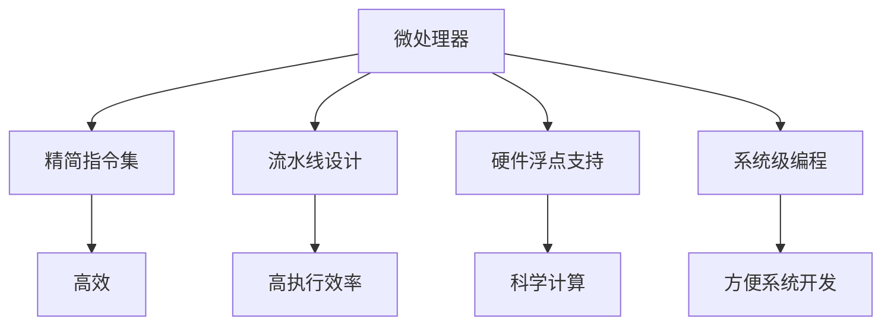

                 

# MIPS架构：嵌入式系统的选择

> 关键词：MIPS架构, 嵌入式系统, 嵌入式编程, 硬件平台选择, 性能优化, 功耗优化, 开发工具, 软件生态

## 1. 背景介绍

### 1.1 问题由来
随着物联网、可穿戴设备、智能家居等应用的蓬勃发展，嵌入式系统在消费电子、工业控制、医疗健康等领域的应用变得越来越广泛。嵌入式系统的选择直接影响到应用性能、功耗、开发成本和维护难度，因此在设计过程中尤为重要。近年来，MIPS架构以其高性能、低功耗、易开发等优点，在嵌入式领域中逐渐成为一种备受欢迎的选择。

### 1.2 问题核心关键点
在嵌入式系统选择中，MIPS架构由于其独特的优势，成为许多开发者的首选。其主要原因包括：
1. **高性能与低功耗的平衡**：MIPS架构的设计理念强调高性能与低功耗的平衡，适用于各种类型的嵌入式应用。
2. **易开发与高效能**：MIPS架构提供了丰富的软件工具和生态系统，使得嵌入式开发更加高效。
3. **灵活性与扩展性**：MIPS架构支持广泛的开发平台，包括桌面系统、服务器、嵌入式设备等。

### 1.3 问题研究意义
选择正确的嵌入式架构对于产品的成功至关重要。MIPS架构在保证高性能和低功耗的同时，还具备易开发和灵活性，能够满足各类嵌入式系统的需求。了解MIPS架构的特点和优势，对于开发者选择和设计嵌入式系统具有重要意义。

## 2. 核心概念与联系

### 2.1 核心概念概述

MIPS（Microprocessor without Interlocked Piped Stages）架构是一种RISC（Reduced Instruction Set Computing）处理器架构，最初由MIPS技术公司开发。MIPS架构的特点包括：
- **精简指令集**：指令集简单、高效，适合实时性要求高的应用。
- **流水线设计**：通过流水线技术提高指令执行效率。
- **硬件浮点支持**：内置浮点运算单元，适合科学计算、图形处理等复杂任务。
- **系统级编程**：提供了C/C++编译器，便于系统级编程。

### 2.2 核心概念原理和架构的 Mermaid 流程图

这个流程图展示了MIPS架构的五个核心概念及其相互关系：

1. **精简指令集**：使指令执行更加高效。
2. **流水线设计**：进一步提高执行效率。
3. **硬件浮点支持**：支持复杂计算任务。
4. **系统级编程**：便于开发和维护。
5. **整体效率和方便性**：提供了高性能和易开发性。

## 3. 核心算法原理 & 具体操作步骤

### 3.1 算法原理概述

MIPS架构的精简指令集和流水线设计是其性能优化的主要手段。以下是其核心算法的原理概述：

1. **精简指令集**：MIPS架构采用精简指令集，使得指令执行更加快速和简单。精简指令集减少了指令的数量和复杂度，提高了指令的执行效率。

2. **流水线设计**：流水线技术将指令的执行过程分为多个阶段，并行处理多个指令，从而显著提高了指令执行速度。流水线设计通过重叠处理不同阶段的任务，最大化利用处理器资源。

3. **硬件浮点支持**：内置的浮点运算单元（FPU）支持复杂的数学运算，如浮点数加减乘除、三角函数、指数函数等，适用于科学计算、图形处理等应用。

4. **系统级编程**：C/C++编译器支持编译优化，便于进行系统级编程和代码优化。

### 3.2 算法步骤详解

MIPS架构的嵌入式系统开发包括以下几个关键步骤：

**Step 1: 选择MIPS架构处理器**

选择合适的MIPS处理器是嵌入式系统开发的基础。MIPS处理器有多种类型，包括MIPS32、MIPS64、MIPS I、MIPS II、MIPS III等，需要根据具体需求进行选择。

**Step 2: 准备开发环境**

开发环境包括编译器、调试工具、开发板等。需要安装和配置MIPS处理器支持的开发工具链，并进行硬件测试和调试。

**Step 3: 编写和编译代码**

使用MIPS架构的C/C++编译器编写代码，并进行编译。编译器对代码进行优化，生成机器码。

**Step 4: 加载和调试**

将编译后的程序加载到MIPS处理器中，进行测试和调试。可以使用JTAG等调试工具对程序进行监控和调试。

**Step 5: 优化和发布**

根据测试结果进行代码优化，并发布最终的程序。优化包括代码优化、硬件优化、功耗优化等。

### 3.3 算法优缺点

MIPS架构在嵌入式系统选择中具有以下优点：

1. **高性能**：MIPS架构的高性能和流水线设计适合需要高执行效率的应用。
2. **低功耗**：MIPS架构的设计理念强调低功耗，适用于电池供电的嵌入式设备。
3. **易开发**：C/C++编译器和丰富的开发工具支持，使得嵌入式开发更加高效。
4. **灵活性**：支持多种类型的开发平台，包括桌面系统、服务器、嵌入式设备等。

然而，MIPS架构也存在一些缺点：

1. **市场份额有限**：相比于x86和ARM架构，MIPS架构的市场份额较小，生态系统不够完善。
2. **性能不占优势**：在某些应用场景下，如桌面和高性能计算，ARM架构和x86架构可能更加适合。

### 3.4 算法应用领域

MIPS架构的嵌入式系统广泛应用于以下领域：

- **消费电子**：如智能家居、可穿戴设备、智能电视等。
- **工业控制**：如工业自动化、机器人、物联网设备等。
- **医疗健康**：如便携式医疗设备、健康监测设备等。
- **汽车电子**：如智能驾驶、车联网设备等。
- **航空航天**：如航空航天控制器、飞行器管理设备等。

## 4. 数学模型和公式 & 详细讲解 & 举例说明

### 4.1 数学模型构建

MIPS架构的性能优化可以通过数学模型进行详细分析和评估。

假设MIPS架构处理器的时钟频率为f，指令集数量为N，每个指令的执行时间为T，流水线深度为P。则MIPS架构的处理能力C可以通过以下公式计算：

$$ C = \frac{f \times P}{T \times N} $$

其中，f为时钟频率，P为流水线深度，T为每个指令的执行时间，N为指令集数量。

### 4.2 公式推导过程

MIPS架构的处理能力公式推导如下：

1. 处理器的执行速度为时钟频率f。
2. 每个指令的执行时间为T，指令集数量为N，因此每个时钟周期可以执行的指令数量为$\frac{N}{T}$。
3. 流水线深度为P，每个时钟周期可以处理P个指令，因此总处理能力为$\frac{N}{T} \times P$。
4. 乘以时钟频率f，得到最终的处理能力C。

### 4.3 案例分析与讲解

以MIPS64处理器为例，假设其时钟频率为1GHz，指令集数量为500，每个指令的执行时间为1纳秒，流水线深度为10。则MIPS64处理器的处理能力为：

$$ C = \frac{1 \times 10}{1 \times 500} = 20MIPS $$

这个案例展示了MIPS架构通过精简指令集、流水线设计和硬件浮点支持，显著提高了处理能力和执行效率。

## 5. 项目实践：代码实例和详细解释说明

### 5.1 开发环境搭建

**Step 1: 安装MIPS开发工具**

MIPS架构的开发需要使用MIPS软件工具链，包括MIPS作为编译器、ELF文件格式解析器和调试工具。可以通过官网下载安装MIPS开发工具链，或使用预编译的工具链。

**Step 2: 配置开发板**

选择适合的MIPS开发板，如OpenWrt、Yocto等，进行系统配置和调试。开发板需要具备调试接口，如JTAG、USB接口等。

**Step 3: 准备测试软件**

准备测试软件，如HTTP服务器、MySQL数据库、Linux内核等，以便进行系统测试和调试。

### 5.2 源代码详细实现

**Step 1: 编写嵌入式系统代码**

使用C语言编写嵌入式系统代码，包括驱动程序、中断处理、通信协议等。

**Step 2: 编译和链接**

使用MIPS编译器对代码进行编译，生成ELF文件。然后使用ELF文件解析器和链接器，生成可执行文件。

**Step 3: 加载和调试**

将可执行文件加载到MIPS处理器中，使用调试工具进行测试和调试。

### 5.3 代码解读与分析

**Step 1: 代码结构**

MIPS架构的代码结构包括驱动程序、中断处理、通信协议等模块。驱动程序负责硬件设备的初始化和操作，中断处理用于处理硬件中断，通信协议用于实现网络通信和数据传输。

**Step 2: 代码优化**

对代码进行优化，包括内存管理、异常处理、并发控制等。使用C++进行类和对象编程，可以提高代码的可维护性和可扩展性。

**Step 3: 性能评估**

使用数学模型和性能测试工具，对代码进行性能评估。评估指标包括执行时间、资源占用、功耗等。

### 5.4 运行结果展示

运行结果展示包括系统性能测试、功能测试、稳定性测试等。可以使用各种工具进行测试，如GCC、GDB、Valgrind等。

## 6. 实际应用场景

### 6.1 智能家居系统

智能家居系统需要高性能和低功耗，适合使用MIPS架构嵌入式系统。MIPS架构可以支持智能音箱、智能门锁、智能电视等设备，通过内置的传感器和通信模块，实现家居设备的智能化管理。

### 6.2 工业控制系统

工业控制系统对实时性和可靠性要求高，适合使用MIPS架构嵌入式系统。MIPS架构可以支持PLC、自动化控制系统、SCADA系统等，通过内置的工业通信协议，实现设备之间的互联互通。

### 6.3 医疗健康设备

医疗健康设备需要高精度和高可靠性，适合使用MIPS架构嵌入式系统。MIPS架构可以支持便携式医疗设备、健康监测设备等，通过内置的传感器和通信模块，实现健康数据的实时监测和分析。

### 6.4 未来应用展望

未来，MIPS架构在嵌入式系统中的应用将更加广泛。随着技术的发展和市场的拓展，MIPS架构将不断优化和改进，进一步提升处理能力、降低功耗、提高易开发性，满足更多嵌入式应用的需求。

## 7. 工具和资源推荐

### 7.1 学习资源推荐

- **MIPS架构文档**：MIPS技术公司官网提供的官方文档，包括处理器架构、开发工具和生态系统的详细介绍。
- **MIPS开发手册**：MIPS开发者社区提供的开发手册，涵盖MIPS架构的开发流程、工具使用和案例分析。
- **MIPS嵌入式系统开发教程**：在线教育平台提供的MIPS嵌入式系统开发教程，包括系统设计、驱动程序开发、通信协议等。

### 7.2 开发工具推荐

- **MIPS编译器**：GCC、LLVM等编译器，支持MIPS架构的代码编译和优化。
- **MIPS调试工具**：GDB、Valgrind等调试工具，用于程序测试和优化。
- **MIPS开发板**：如OpenWrt、Yocto等开发板，支持MIPS架构的嵌入式开发。

### 7.3 相关论文推荐

- **MIPS架构性能优化**：研究如何通过优化指令集、流水线和硬件浮点支持，提升MIPS架构的处理能力。
- **MIPS架构嵌入式系统开发**：探讨MIPS架构在嵌入式系统中的应用，包括驱动程序开发、通信协议设计等。
- **MIPS架构功耗优化**：研究如何通过硬件优化和软件优化，降低MIPS架构的功耗。

## 8. 总结：未来发展趋势与挑战

### 8.1 总结

本文对MIPS架构在嵌入式系统中的选择进行了全面系统的介绍。首先阐述了MIPS架构的特点和优势，明确了MIPS架构在选择嵌入式系统中的重要地位。其次，从原理到实践，详细讲解了MIPS架构的开发流程和关键步骤，给出了MIPS架构嵌入式系统的代码实例。同时，本文还广泛探讨了MIPS架构在智能家居、工业控制、医疗健康等领域的实际应用，展示了MIPS架构的广泛应用前景。最后，本文精选了MIPS架构的学习资源、开发工具和相关论文，力求为读者提供全方位的技术指引。

通过本文的系统梳理，可以看到，MIPS架构在嵌入式系统选择中具有独特的优势，适合高性能、低功耗、易开发的嵌入式应用。MIPS架构的优化和改进，将不断提升其在嵌入式系统中的地位和应用范围，为智能设备的开发和应用提供强大的支持。

### 8.2 未来发展趋势

展望未来，MIPS架构在嵌入式系统中的选择将呈现以下几个发展趋势：

1. **更高的处理能力**：MIPS架构将不断优化和改进，提升处理能力，满足更多高性能计算需求。
2. **更低的功耗**：MIPS架构的设计理念将进一步优化，降低功耗，满足更多电池供电设备的需要。
3. **更易开发**：MIPS架构的开发工具和生态系统将不断完善，提高开发效率和可维护性。
4. **更广泛的生态支持**：MIPS架构将得到更多开发者的支持和关注，生态系统将不断壮大。
5. **更多的应用场景**：MIPS架构将拓展到更多应用领域，如智慧城市、智能交通、航空航天等。

### 8.3 面临的挑战

尽管MIPS架构在嵌入式系统选择中具有独特的优势，但在迈向更加智能化、普适化应用的过程中，仍面临以下挑战：

1. **市场份额有限**：相比于x86和ARM架构，MIPS架构的市场份额较小，生态系统不够完善。
2. **性能不占优势**：在某些应用场景下，如桌面和高性能计算，ARM架构和x86架构可能更加适合。
3. **开发难度高**：MIPS架构的开发需要一定的技术积累和经验，门槛较高。
4. **资源限制**：MIPS架构的开发资源相对较少，如编译器、调试工具等。
5. **硬件成本高**：MIPS架构的硬件成本较高，限制了其大规模应用。

### 8.4 研究展望

为了克服这些挑战，未来需要在以下几个方面进行研究：

1. **提高市场份额**：通过技术推广和生态建设，提升MIPS架构的市场份额，吸引更多开发者和用户。
2. **提升性能**：继续优化MIPS架构的硬件设计和软件优化，提升其性能和效率。
3. **降低开发难度**：提供更多开发工具和教程，降低开发难度，提高开发者使用率。
4. **优化硬件成本**：通过技术创新和规模化生产，降低MIPS架构的硬件成本，推动其大规模应用。

总之，MIPS架构在嵌入式系统中的选择需要不断地进行技术创新和优化，才能在激烈的市场竞争中占据一席之地，为嵌入式设备的开发和应用提供强大的支持。

## 9. 附录：常见问题与解答

**Q1: 嵌入式系统选择MIPS架构有哪些优势？**

A: MIPS架构的嵌入式系统具有以下优势：
1. 高性能与低功耗的平衡，适用于各种类型的嵌入式应用。
2. 易开发与高效能，C/C++编译器和丰富的开发工具支持。
3. 灵活性与扩展性，支持广泛的开发平台，包括桌面系统、服务器、嵌入式设备等。

**Q2: MIPS架构的嵌入式系统开发需要注意哪些问题？**

A: MIPS架构的嵌入式系统开发需要注意以下问题：
1. 选择合适的MIPS处理器，考虑性能和功耗等因素。
2. 准备开发环境，包括编译器、调试工具、开发板等。
3. 编写和编译代码，使用C/C++编译器进行编译。
4. 加载和调试程序，使用JTAG等调试工具进行测试和调试。
5. 优化和发布程序，根据测试结果进行代码优化。

**Q3: MIPS架构的嵌入式系统在实际应用中存在哪些挑战？**

A: MIPS架构的嵌入式系统在实际应用中存在以下挑战：
1. 市场份额有限，生态系统不够完善。
2. 性能不占优势，在某些应用场景下可能不如ARM和x86架构。
3. 开发难度高，需要一定的技术积累和经验。
4. 资源限制，编译器、调试工具等资源较少。
5. 硬件成本高，限制了其大规模应用。

**Q4: 如何提高MIPS架构的嵌入式系统开发效率？**

A: 提高MIPS架构的嵌入式系统开发效率可以通过以下方法：
1. 选择合适的MIPS处理器，考虑性能和功耗等因素。
2. 使用丰富的开发工具和生态系统，如GCC、LLVM、GDB等。
3. 编写高效的代码，进行优化和测试。
4. 使用调试工具，如JTAG、Valgrind等，进行调试和优化。
5. 持续改进和优化，不断提高开发效率和系统性能。

---

作者：禅与计算机程序设计艺术 / Zen and the Art of Computer Programming

