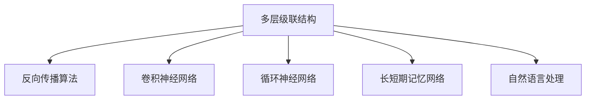
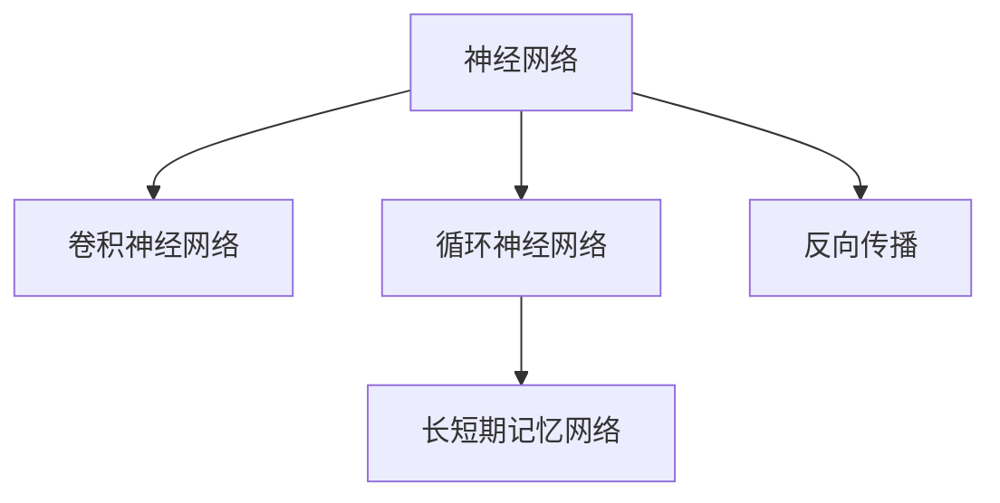

                 

# Neural Network

> 关键词：神经网络,深度学习,反向传播,卷积神经网络(CNN),循环神经网络(RNN),自然语言处理(NLP),计算机视觉(CV)

## 1. 背景介绍

### 1.1 问题由来

神经网络作为人工智能领域的核心技术之一，自1950年代被提出以来，历经半个多世纪的发展，已经从早期的浅层感知器(PERCEPTRON)演进为如今的深度学习模型。这些模型不仅在图像识别、语音识别、自然语言处理等诸多领域取得了惊人的成果，也为计算机视觉(CV)、自然语言处理(NLP)等学科提供了全新的研究工具和方法。

近年来，深度学习模型的发展更是日新月异，其中尤以卷积神经网络(CNN)、循环神经网络(RNN)、长短期记忆网络(LSTM)等架构最具代表性。深度学习模型的显著特点是通过多层非线性变换，从原始输入数据中学习出高级抽象特征，具备强大的模式识别和泛化能力。

神经网络之所以能够取得如此成就，得益于其独特的体系结构和高效的反向传播算法。本文将系统介绍神经网络的基本原理，并探讨其在实际应用中的多种架构和技术。

### 1.2 问题核心关键点

神经网络的核心在于其能够模拟人脑的神经元工作机制，通过多层级联的非线性变换，自动学习数据的特征表示。神经网络的核心思想包括：

- 多层级联结构：通过多层非线性变换，逐步提取出数据的高级特征。
- 反向传播算法：基于链式法则，高效地反向传播误差，更新网络参数。
- 卷积神经网络(CNN)：利用卷积操作提取图像特征，适用于图像识别任务。
- 循环神经网络(RNN)：通过循环连接，能够处理序列数据，适用于自然语言处理等时序任务。
- 长短期记忆网络(LSTM)：一种特殊的RNN结构，能够有效处理长序列和梯度消失问题，广泛应用于语言模型和机器翻译。
- 自然语言处理(NLP)：结合自然语言处理技术，如词向量、语言模型等，使神经网络在语言理解、生成等方面发挥更大作用。

这些核心概念之间的关系可以通过以下Mermaid流程图来展示：



这个流程图展示了几大核心概念之间的关系：

- 多层级联结构是神经网络的基础。
- 反向传播算法用于高效计算损失函数对模型参数的梯度。
- CNN、RNN、LSTM等架构分别适用于不同的任务类型。
- NLP技术可以与神经网络结合，提升其在语言处理中的能力。

## 2. 核心概念与联系

### 2.1 核心概念概述

为了更好地理解神经网络的工作原理，本节将介绍几个关键概念：

- 神经网络(Neural Network, NN)：由大量的人工神经元构成，通过学习调整权重，完成复杂模式识别任务。
- 卷积神经网络(CNN)：一种特殊结构的神经网络，适合处理具有局部平移不变性的数据，如图像和音频。
- 循环神经网络(RNN)：通过循环连接，适合处理时间序列数据，如自然语言、语音信号等。
- 长短期记忆网络(LSTM)：一种特殊的RNN结构，通过门控机制解决长序列数据中的梯度消失问题。
- 反向传播(Backpropagation)：一种高效的优化算法，用于计算模型参数的梯度，更新模型权重。

这些概念之间的关系可以通过以下Mermaid流程图来展示：



这个流程图展示了神经网络与各种架构之间的联系：

- 神经网络是各种架构的基底，通过反向传播算法更新权重。
- CNN利用卷积操作提取图像特征。
- RNN通过循环连接处理序列数据。
- LSTM是RNN的一种特殊形式，通过门控机制处理长序列数据。

## 3. 核心算法原理 & 具体操作步骤
### 3.1 算法原理概述

神经网络的根本目标是通过多层的非线性变换，学习数据的特征表示，从而完成复杂的模式识别任务。核心思想是通过训练集上的梯度下降优化，不断调整模型参数，最小化损失函数，使模型输出逼近真实标签。

具体而言，假设神经网络模型的输入为 $x$，参数为 $\theta$，输出为 $y$，损失函数为 $\mathcal{L}$，训练集为 $D=\{(x_i,y_i)\}_{i=1}^N$。训练过程的目标是求解最优参数 $\theta^*$，使得：

$$
\theta^* = \mathop{\arg\min}_{\theta} \mathcal{L}(M_{\theta},D)
$$

其中 $M_{\theta}$ 表示基于参数 $\theta$ 的神经网络模型。通过梯度下降等优化算法，神经网络不断更新模型参数 $\theta$，最小化损失函数 $\mathcal{L}$。

### 3.2 算法步骤详解

神经网络的训练通常包含以下几个关键步骤：

**Step 1: 准备数据集**
- 收集训练集 $D=\{(x_i,y_i)\}_{i=1}^N$，其中 $x_i$ 为输入，$y_i$ 为标签。
- 使用数据增强技术，扩充数据集样本，增强模型的泛化能力。

**Step 2: 定义模型**
- 根据任务类型，选择合适的神经网络架构，如CNN、RNN、LSTM等。
- 定义模型的输入层、隐藏层和输出层，并设置层之间的连接权重。

**Step 3: 设置优化器**
- 选择合适的优化算法，如SGD、Adam等，并设置学习率 $\eta$。
- 定义损失函数，如交叉熵损失、均方误差等。

**Step 4: 执行训练**
- 将训练集数据分批次输入模型，前向传播计算模型输出和损失函数。
- 反向传播计算参数梯度，根据优化算法更新模型参数。
- 周期性在验证集上评估模型性能，根据性能指标决定是否触发 Early Stopping。
- 重复上述步骤直至满足预设的迭代轮数或 Early Stopping 条件。

**Step 5: 测试和部署**
- 在测试集上评估训练后模型 $M_{\hat{\theta}}$ 的性能，对比训练前后的精度提升。
- 使用训练后的模型对新样本进行推理预测，集成到实际的应用系统中。

以上就是神经网络训练的一般流程。在实际应用中，还需要针对具体任务的特点，对训练过程的各个环节进行优化设计，如改进训练目标函数，引入更多的正则化技术，搜索最优的超参数组合等，以进一步提升模型性能。

### 3.3 算法优缺点

神经网络相对于传统机器学习方法，具有以下优点：

- 自动特征提取：神经网络通过多层非线性变换，自动学习数据的特征表示，避免了人工设计特征的复杂性和高成本。
- 高泛化能力：神经网络具备强大的泛化能力，能够在未见过的数据上取得良好效果。
- 并行计算：神经网络结构适合并行计算，可以高效利用现代计算机的硬件资源。

同时，神经网络也存在一些局限性：

- 数据依赖性：神经网络需要大量标注数据进行训练，数据量不足或数据质量差时，难以取得理想效果。
- 可解释性不足：神经网络通常是"黑盒"系统，难以解释其内部工作机制和决策逻辑。
- 资源消耗大：神经网络参数量巨大，训练和推理需要大量计算资源和时间。
- 梯度消失/爆炸：在深层网络中，梯度可能会消失或爆炸，导致模型训练困难。

尽管存在这些局限性，但神经网络在处理复杂非线性任务上表现出色，成为了当前深度学习领域的主流范式。未来相关研究的重点在于如何进一步降低对标注数据的依赖，提高模型的可解释性和资源利用效率，同时兼顾训练稳定性等。

### 3.4 算法应用领域

神经网络的应用领域非常广泛，涵盖了计算机视觉、自然语言处理、语音识别、推荐系统、游戏AI等多个方面：

- 计算机视觉：卷积神经网络(CNN)在图像识别、目标检测、图像生成等方面取得了卓越的成绩。
- 自然语言处理：循环神经网络(RNN)和长短期记忆网络(LSTM)在语言模型、机器翻译、文本生成等方面表现优异。
- 语音识别：使用深度神经网络，结合声学模型和语言模型，可以高效识别和理解语音信号。
- 推荐系统：通过神经网络模型，结合用户历史行为和物品特征，能够实现精准推荐。
- 游戏AI：使用神经网络训练的策略模型，能够在复杂游戏环境中自主决策，取得优异成绩。

除了这些经典应用外，神经网络还被创新性地应用到更多领域中，如音乐生成、药物设计、金融预测、自动驾驶等，为各行业带来了新的变革和机遇。

## 4. 数学模型和公式 & 详细讲解  
### 4.1 数学模型构建

神经网络模型的核心思想是通过多层非线性变换，学习数据的特征表示。假设神经网络包含 $L$ 层，每层 $n$ 个神经元，输入为 $x \in \mathbb{R}^d$，输出为 $y \in \mathbb{R}^m$。神经网络的数学模型可以表示为：

$$
y = f_L(W_Lh_{L-1} + b_L)
$$

其中 $f_L$ 为第 $L$ 层激活函数，$W_L$ 和 $b_L$ 为第 $L$ 层的权重和偏置项。隐藏层 $h_{L-1}$ 的计算公式为：

$$
h_{l-1} = f_{l-1}(W_{l-1}h_{l-2} + b_{l-1})
$$

其中 $l$ 为隐藏层的层号，$f_{l-1}$ 为隐藏层的激活函数。激活函数通常使用 Sigmoid、ReLU 或 Tanh 等非线性函数，以引入非线性变换。

### 4.2 公式推导过程

以单层神经网络为例，推导其前向传播和反向传播的公式。假设输入为 $x$，参数为 $\theta$，输出为 $y$，损失函数为 $\mathcal{L}$。

前向传播过程如下：

$$
y = f(Wx + b)
$$

其中 $W$ 为权重矩阵，$b$ 为偏置项，$x$ 为输入向量，$f$ 为激活函数。

反向传播过程如下：

1. 计算损失函数对输出 $y$ 的梯度 $\frac{\partial \mathcal{L}}{\partial y}$。
2. 根据链式法则，计算损失函数对隐藏层 $h$ 的梯度 $\frac{\partial \mathcal{L}}{\partial h}$。
3. 根据链式法则，计算损失函数对权重 $W$ 和偏置 $b$ 的梯度：

$$
\frac{\partial \mathcal{L}}{\partial W} = \frac{\partial \mathcal{L}}{\partial y} \frac{\partial y}{\partial W} = \frac{\partial \mathcal{L}}{\partial y} \frac{\partial f}{\partial z} \frac{\partial z}{\partial W}
$$

$$
\frac{\partial \mathcal{L}}{\partial b} = \frac{\partial \mathcal{L}}{\partial y} \frac{\partial y}{\partial b} = \frac{\partial \mathcal{L}}{\partial y}
$$

其中 $z$ 为激活函数的输入，$\frac{\partial y}{\partial W}$ 和 $\frac{\partial y}{\partial b}$ 分别为权重和偏置项对输出 $y$ 的导数，通常可以通过反向传播计算得到。

### 4.3 案例分析与讲解

考虑一个简单的二分类问题，使用 sigmoid 激活函数。假设训练集为 $(x_i,y_i)$，其中 $x_i \in \mathbb{R}^d$，$y_i \in \{0,1\}$。

定义模型的参数为 $\theta = (W,b)$，其中 $W \in \mathbb{R}^{d \times 1}$，$b \in \mathbb{R}^1$。模型的前向传播过程如下：

$$
y = \sigma(Wx + b)
$$

其中 $\sigma$ 为 sigmoid 激活函数。

假设模型输出的损失函数为二元交叉熵：

$$
\mathcal{L} = -\frac{1}{N}\sum_{i=1}^N [y_i\log \sigma(Wx_i + b) + (1-y_i)\log(1-\sigma(Wx_i + b))]
$$

对模型参数 $\theta$ 的梯度计算如下：

$$
\frac{\partial \mathcal{L}}{\partial \theta} = -\frac{1}{N}\sum_{i=1}^N (\frac{y_i}{\sigma(Wx_i + b)} - \frac{1-y_i}{1-\sigma(Wx_i + b)}) \frac{\partial \sigma(Wx_i + b)}{\partial \theta}
$$

其中 $\frac{\partial \sigma(Wx_i + b)}{\partial \theta} = W^T$。通过反向传播，可以计算出参数 $W$ 和 $b$ 的梯度，从而更新模型权重。

## 5. 项目实践：代码实例和详细解释说明
### 5.1 开发环境搭建

在进行神经网络开发前，我们需要准备好开发环境。以下是使用Python进行TensorFlow开发的环境配置流程：

1. 安装Anaconda：从官网下载并安装Anaconda，用于创建独立的Python环境。

2. 创建并激活虚拟环境：
```bash
conda create -n tensorflow-env python=3.8 
conda activate tensorflow-env
```

3. 安装TensorFlow：根据CUDA版本，从官网获取对应的安装命令。例如：
```bash
conda install tensorflow -c tensorflow -c conda-forge
```

4. 安装各类工具包：
```bash
pip install numpy pandas scikit-learn matplotlib tqdm jupyter notebook ipython
```

完成上述步骤后，即可在`tensorflow-env`环境中开始神经网络实践。

### 5.2 源代码详细实现

下面我们以手写数字识别(MNIST)为例，给出使用TensorFlow进行卷积神经网络(CNN)训练的代码实现。

首先，定义神经网络的架构：

```python
import tensorflow as tf
from tensorflow.keras import layers

model = tf.keras.Sequential([
    layers.Conv2D(32, (3, 3), activation='relu', input_shape=(28, 28, 1)),
    layers.MaxPooling2D((2, 2)),
    layers.Flatten(),
    layers.Dense(10, activation='softmax')
])
```

然后，加载MNIST数据集并预处理：

```python
mnist = tf.keras.datasets.mnist
(x_train, y_train), (x_test, y_test) = mnist.load_data()

x_train = x_train.reshape(-1, 28, 28, 1) / 255.0
x_test = x_test.reshape(-1, 28, 28, 1) / 255.0
```

接着，定义损失函数和优化器：

```python
loss_fn = tf.keras.losses.SparseCategoricalCrossentropy(from_logits=True)
optimizer = tf.keras.optimizers.Adam(learning_rate=0.001)
```

最后，训练和评估模型：

```python
@tf.function
def train_step(images, labels):
    with tf.GradientTape() as tape:
        logits = model(images, training=True)
        loss_value = loss_fn(labels, logits)
    grads = tape.gradient(loss_value, model.trainable_variables)
    optimizer.apply_gradients(zip(grads, model.trainable_variables))

@tf.function
def evaluate_step(images, labels):
    logits = model(images, training=False)
    predictions = tf.argmax(logits, axis=1)
    accuracy = tf.reduce_mean(tf.cast(tf.equal(predictions, labels), dtype=tf.float32))

EPOCHS = 5

for epoch in range(EPOCHS):
    train_loss, train_accuracy = 0, 0
    for images, labels in train_dataset:
        train_step(images, labels)
        train_loss += loss_fn(labels, model(images)).numpy()
        train_accuracy += evaluate_step(images, labels).numpy()

    test_loss, test_accuracy = evaluate_step(x_test, y_test)
    print(f"Epoch {epoch+1}, loss: {train_loss/EPOCHS:.3f}, accuracy: {train_accuracy/EPOCHS:.3f}, test accuracy: {test_accuracy:.3f}")
```

以上就是使用TensorFlow进行CNN训练的完整代码实现。可以看到，TensorFlow提供了丰富的高层API，使得模型构建和训练变得简单高效。

### 5.3 代码解读与分析

让我们再详细解读一下关键代码的实现细节：

**Sequential模型**：
- 使用Sequential模型，按照顺序搭建神经网络模型。
- 定义了输入层、卷积层、池化层和全连接层等基本组件。

**数据预处理**：
- 使用Matplotlib库展示手写数字的原始图片。
- 将图像数据归一化到[0,1]范围内，并将标签转换为one-hot编码。

**损失函数和优化器**：
- 定义了交叉熵损失函数，使用Adam优化器进行训练。

**训练和评估函数**：
- 定义了训练和评估函数，分别用于前向传播、反向传播和计算损失值。
- 使用tf.function装饰器，将训练和评估过程编译为可调度的TensorFlow函数，提高计算效率。
- 在每个epoch内，先进行训练，再计算测试集上的准确率。

**训练流程**：
- 定义总的epoch数和batch size，开始循环迭代
- 每个epoch内，先在训练集上训练，输出平均loss和准确率
- 在测试集上评估，输出测试集上的准确率
- 所有epoch结束后，显示训练和测试的结果

可以看到，TensorFlow提供了方便易用的API，使得神经网络模型的开发变得相对简单。开发者可以更多地专注于模型设计，而不必过多关注底层计算细节。

当然，工业级的系统实现还需考虑更多因素，如模型的保存和部署、超参数的自动搜索、更灵活的任务适配层等。但核心的训练过程基本与此类似。

## 6. 实际应用场景
### 6.1 智能客服系统

神经网络在智能客服系统中的应用非常广泛，通过训练神经网络，可以实现自动响应用户查询、推荐相关产品等功能，大幅提升客户服务效率和满意度。

在技术实现上，可以收集企业内部的历史客服对话记录，将问题和最佳答复构建成监督数据，在此基础上对预训练神经网络进行训练。训练后的神经网络能够自动理解用户意图，匹配最合适的答案模板进行回复。对于客户提出的新问题，还可以接入检索系统实时搜索相关内容，动态组织生成回答。如此构建的智能客服系统，能大幅提升客户咨询体验和问题解决效率。

### 6.2 金融舆情监测

金融机构需要实时监测市场舆论动向，以便及时应对负面信息传播，规避金融风险。神经网络在金融舆情监测中的应用，可以通过训练情感分析模型，自动识别新闻、评论中的情感倾向，实时监控舆情变化，及时发出预警。

在实现上，可以收集金融领域相关的新闻、报道、评论等文本数据，并对其进行情感标注。在此基础上对预训练神经网络进行训练，使其能够自动判断文本属于何种情感倾向。将训练后的模型应用到实时抓取的网络文本数据，就能够自动监测不同情感倾向的变化趋势，一旦发现负面情绪激增等异常情况，系统便会自动预警，帮助金融机构快速应对潜在风险。

### 6.3 个性化推荐系统

神经网络在个性化推荐系统中的应用，主要体现在推荐模型上。通过训练神经网络，可以结合用户历史行为和物品特征，实现精准推荐。

在实现上，可以收集用户浏览、点击、评论、分享等行为数据，提取和用户交互的物品标题、描述、标签等文本内容。将文本内容作为模型输入，用户的后续行为（如是否点击、购买等）作为监督信号，在此基础上训练神经网络。训练后的模型能够从文本内容中准确把握用户的兴趣点，在生成推荐列表时，先用候选物品的文本描述作为输入，由模型预测用户的兴趣匹配度，再结合其他特征综合排序，便可以得到个性化程度更高的推荐结果。

### 6.4 未来应用展望

随着神经网络的发展，其在更多领域的应用前景将更加广阔。以下是几个可能的方向：

- 智慧医疗：使用神经网络进行疾病诊断、医学图像分析等，提升医疗服务效率和质量。
- 智能教育：结合自然语言处理技术，训练神经网络进行作业批改、学情分析、知识推荐等，因材施教，促进教育公平。
- 智慧城市：通过神经网络进行交通流量预测、环境监测等，提升城市管理水平。
- 工业生产：使用神经网络进行质量检测、设备故障预测等，提高生产效率和安全性。
- 社会治理：结合图像处理、语音识别等技术，构建智能监控系统，提升公共安全和社会治理水平。

## 7. 工具和资源推荐
### 7.1 学习资源推荐

为了帮助开发者系统掌握神经网络的基本原理和实践技巧，这里推荐一些优质的学习资源：

1. 《深度学习》课程：斯坦福大学开设的深度学习课程，涵盖深度学习的基本概念、神经网络、优化算法等内容。

2. 《Neural Networks and Deep Learning》书籍：由Michael Nielsen撰写，全面介绍了神经网络的工作原理、优化算法、深度学习等内容。

3. TensorFlow官方文档：TensorFlow的官方文档，提供了丰富的API和示例代码，适合初学者和高级开发者。

4. PyTorch官方文档：PyTorch的官方文档，提供了详细的使用指南和代码示例，方便快速上手。

5. Fast.ai深度学习课程：Fast.ai提供的一系列深度学习课程，包括计算机视觉、自然语言处理、推荐系统等内容，适合实战学习。

6. Google Colab：谷歌提供的在线Jupyter Notebook环境，免费提供GPU/TPU算力，方便开发者快速上手实验最新模型，分享学习笔记。

通过对这些资源的学习实践，相信你一定能够系统掌握神经网络的基本原理和应用技巧，并用于解决实际的NLP问题。

### 7.2 开发工具推荐

高效的开发离不开优秀的工具支持。以下是几款用于神经网络开发的常用工具：

1. TensorFlow：由Google主导开发的开源深度学习框架，支持分布式计算和GPU加速，适合大规模工程应用。

2. PyTorch：Facebook开发的开源深度学习框架，支持动态计算图，适合快速迭代研究。

3. Keras：谷歌开发的高级API，提供简单易用的接口，方便快速搭建神经网络模型。

4. MXNet：亚马逊开发的深度学习框架，支持多种硬件平台和编程语言，适合大规模生产部署。

5. Caffe：由Berkeley Vision and Learning Center开发的深度学习框架，以速度和简洁著称，适合图像识别等任务。

6. Theano：由蒙特利尔大学开发的深度学习框架，支持CPU和GPU计算，适合快速原型开发。

合理利用这些工具，可以显著提升神经网络的开发效率，加快创新迭代的步伐。

### 7.3 相关论文推荐

神经网络的研究涉及多个学科，涵盖了机器学习、计算机视觉、自然语言处理等领域。以下是几篇奠基性的相关论文，推荐阅读：

1. A Neural Network for Machine Translation (NMT)：提出基于神经网络的机器翻译模型，开创了神经网络在自然语言处理领域的应用。

2. ImageNet Classification with Deep Convolutional Neural Networks：提出卷积神经网络在图像分类任务上的显著效果，奠定了其在计算机视觉领域的基础。

3. Long Short-Term Memory（LSTM）：提出长短期记忆网络，解决了RNN在长序列上的梯度消失问题，适用于语音识别、机器翻译等任务。

4. Generative Adversarial Networks (GANs)：提出生成对抗网络，能够生成高质量的图像、音频、视频等数据，广泛应用于图像生成、游戏AI等领域。

5. Attention is All You Need (Transformer)：提出Transformer模型，通过自注意力机制，大幅提升了序列建模和语言理解能力，成为当前的NLP主流模型。

这些论文代表了大神经网络的发展脉络。通过学习这些前沿成果，可以帮助研究者把握学科前进方向，激发更多的创新灵感。

## 8. 总结：未来发展趋势与挑战

### 8.1 研究成果总结

神经网络技术经过多年的发展，已经从早期的浅层模型演进为如今的深度学习范式。通过多层级联的复杂非线性变换，神经网络能够在各种任务中取得卓越的表现。从图像识别到自然语言处理，从机器翻译到语音识别，神经网络已经成为了许多领域的核心技术。

### 8.2 未来发展趋势

展望未来，神经网络技术将继续深入发展，主要趋势包括：

1. 模型规模继续增大：随着算力资源的丰富，神经网络的参数量将进一步增加，具备更加强大的特征提取能力。
2. 新架构不断涌现：如注意力机制、残差网络、自适应网络等新架构将进一步提升神经网络的性能和泛化能力。
3. 跨领域融合：神经网络将与其他人工智能技术如知识表示、因果推理、强化学习等进行更深入的融合，拓展应用边界。
4. 迁移学习推广：神经网络将更多应用于迁移学习任务，通过预训练和微调，提升模型在特定任务上的性能。
5. 强化学习结合：神经网络与强化学习的结合将使得智能系统具备自主学习和适应能力，进一步推动AI技术的进步。
6. 多模态融合：神经网络将更多应用于多模态数据融合，提升跨模态数据理解和生成能力。

### 8.3 面临的挑战

尽管神经网络技术取得了显著进展，但仍面临一些挑战：

1. 数据依赖性：神经网络需要大量标注数据进行训练，数据量不足或数据质量差时，难以取得理想效果。
2. 可解释性不足：神经网络通常是"黑盒"系统，难以解释其内部工作机制和决策逻辑。
3. 资源消耗大：神经网络参数量巨大，训练和推理需要大量计算资源和时间。
4. 梯度消失/爆炸：在深层网络中，梯度可能会消失或爆炸，导致模型训练困难。
5. 对抗样本攻击：神经网络模型容易受到对抗样本的攻击，导致输出偏差。

### 8.4 研究展望

面对神经网络所面临的挑战，未来的研究需要在以下几个方面寻求新的突破：

1. 降低对标注数据的依赖：探索无监督和半监督学习范式，最大限度利用非结构化数据，减少对标注样本的依赖。
2. 提升模型的可解释性：引入因果分析、符号推理等方法，提升神经网络的透明性和可解释性。
3. 优化资源利用效率：开发更加参数高效和计算高效的神经网络模型，如深度卷积神经网络、残差网络等。
4. 提高模型的训练稳定性：引入自适应学习率、正则化等方法，增强神经网络的鲁棒性和训练稳定性。
5. 防范对抗样本攻击：引入对抗训练、鲁棒优化等技术，增强神经网络的抗干扰能力。
6. 探索新型的神经网络架构：如GAN、Transformer等，结合新兴技术如知识表示、因果推理等，推动神经网络技术的发展。

## 9. 附录：常见问题与解答

**Q1：神经网络与传统机器学习模型有何区别？**

A: 神经网络与传统机器学习模型的主要区别在于其训练方式和模型结构。传统机器学习模型通常通过手工设计的特征表示，直接计算模型输出，而神经网络通过多层非线性变换，自动学习数据的特征表示。

**Q2：如何选择合适的神经网络架构？**

A: 神经网络架构的选择需要考虑任务的复杂度、数据的特点以及计算资源等因素。常用的神经网络架构包括卷积神经网络(CNN)、循环神经网络(RNN)、长短期记忆网络(LSTM)等。对于图像识别任务，CNN通常表现更好；对于自然语言处理任务，RNN和LSTM更为合适。

**Q3：神经网络在训练过程中需要注意哪些问题？**

A: 神经网络在训练过程中需要注意以下几点：
1. 数据预处理：将原始数据归一化、标准化，以提高模型的训练效果。
2. 超参数调优：设置合适的学习率、批大小、迭代轮数等，避免过拟合和欠拟合。
3. 正则化技术：使用L2正则、Dropout、Early Stopping等，防止模型过拟合。
4. 模型保存与部署：及时保存训练好的模型，并方便地部署到实际应用系统中。
5. 模型调优：根据测试集上的性能，调整模型参数和训练策略，进一步提升模型效果。

**Q4：神经网络在推理过程中需要注意哪些问题？**

A: 神经网络在推理过程中需要注意以下几点：
1. 推理引擎的选择：选择合适的推理引擎，如TensorFlow、PyTorch等，以提高推理速度和效率。
2. 推理优化：对推理过程进行优化，如使用量化加速、剪枝等技术，减小计算资源消耗。
3. 推理输入数据的处理：确保输入数据格式正确，并进行必要的预处理和校验，避免推理过程中的异常。
4. 推理结果的解释：对于重要任务，需要对推理结果进行解释和验证，确保输出的可靠性。

---

作者：禅与计算机程序设计艺术 / Zen and the Art of Computer Programming

