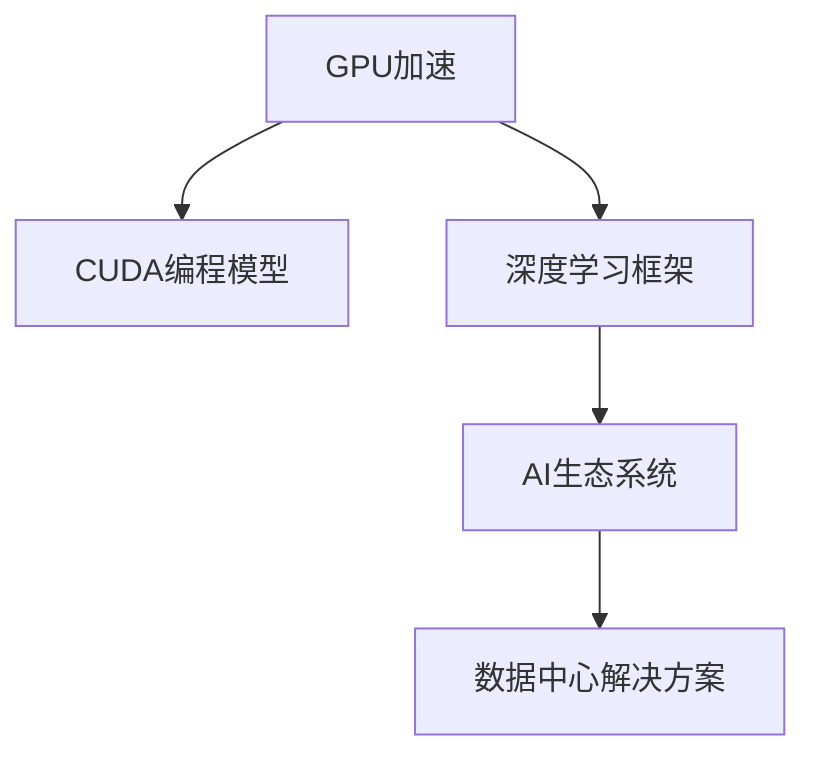

                 

# Nvidia的GPU与AI的发展

## 1. 背景介绍

### 1.1 问题由来
随着人工智能技术的迅猛发展，GPU在加速AI算法计算中的地位越来越重要。在过去的几十年里，Nvidia凭借其强大的GPU产品线，迅速成为AI计算领域的领导者。从最早的CUDA到现在的A100，Nvidia在GPU硬件设计和软件生态构建方面都表现出色，引领了AI计算的革命。

### 1.2 问题核心关键点
Nvidia的GPU与AI的发展，主要包括以下几个关键点：

- **GPU加速**：GPU的并行计算能力，使其成为加速深度学习算法计算的理想选择。Nvidia通过优化GPU硬件设计和优化软件栈，显著提升了深度学习算法的训练和推理速度。
- **CUDA编程模型**：Nvidia推出的CUDA编程模型，使开发者能够高效利用GPU加速，提供了丰富的库函数和开发工具，简化了深度学习算法的实现。
- **深度学习框架**：Nvidia支持众多深度学习框架，包括TensorFlow、PyTorch、MXNet等，提供了从模型训练到推理的全栈解决方案。
- **AI生态系统**：Nvidia构建了一个庞大的AI生态系统，包括GPU硬件、软件开发工具、云服务等，为开发者提供了丰富的工具和平台支持。
- **数据中心解决方案**：Nvidia的AI数据中心解决方案，包括NVIDIA DGX、NVIDIA GRID等，使得AI算法能够高效运行在大规模数据中心环境中。

这些关键点共同构成了Nvidia在GPU与AI领域的发展框架，使其能够在众多竞争对手中脱颖而出，成为AI计算的行业标准。

### 1.3 问题研究意义
研究Nvidia的GPU与AI的发展，对于理解AI计算技术的发展历程、评估AI算法的计算性能、探索AI计算的未来方向，具有重要意义：

1. **加速AI算法训练**：通过深入理解Nvidia的GPU加速技术和CUDA编程模型，能够提升深度学习算法的训练速度，加速模型开发。
2. **优化AI应用部署**：通过研究Nvidia的AI生态系统和数据中心解决方案，能够优化AI应用的部署效率，降低部署成本。
3. **推动AI技术创新**：通过学习Nvidia在GPU硬件设计和软件生态构建方面的成功经验，能够启发更多AI技术的创新，推动AI技术的进步。
4. **促进AI产业发展**：通过评估Nvidia的AI生态系统和市场策略，能够分析AI产业的发展趋势，促进AI技术的落地应用。
5. **保障AI安全性**：通过探索Nvidia在GPU与AI发展中的安全防护措施，能够增强AI系统的安全性，保障数据和算法的安全。

## 2. 核心概念与联系

### 2.1 核心概念概述

为更好地理解Nvidia的GPU与AI的发展，本节将介绍几个密切相关的核心概念：

- **GPU加速**：指通过并行计算，将深度学习算法加速至数十甚至数百倍的速度，大幅提升计算效率。
- **CUDA**：Nvidia推出的计算统一设备架构(CUDA)编程模型，提供了高效利用GPU的编程接口和工具，简化了深度学习算法的开发和部署。
- **深度学习框架**：如TensorFlow、PyTorch等，基于CUDA和GPU硬件优化，提供了灵活高效的深度学习算法实现。
- **AI生态系统**：包括GPU硬件、软件开发工具、云服务等，为深度学习算法的开发、训练和部署提供了全面支持。
- **数据中心解决方案**：如NVIDIA DGX、NVIDIA GRID等，为大规模深度学习算法的训练和推理提供了高性能计算平台。

这些核心概念之间的逻辑关系可以通过以下Mermaid流程图来展示：



这个流程图展示了大语言模型的核心概念及其之间的关系：

1. GPU加速为深度学习算法的计算提供硬件基础。
2. CUDA编程模型为GPU加速提供了高效的编程接口和工具。
3. 深度学习框架在CUDA和GPU硬件的基础上，提供了灵活高效的算法实现。
4. AI生态系统为深度学习算法的开发、训练和部署提供了全面的支持。
5. 数据中心解决方案为大规模深度学习算法的训练和推理提供了高性能计算平台。

## 3. 核心算法原理 & 具体操作步骤
### 3.1 算法原理概述

Nvidia的GPU与AI发展，核心在于通过优化GPU硬件设计和软件栈，加速深度学习算法的计算。其主要原理包括以下几个方面：

1. **并行计算**：GPU硬件的设计理念基于并行计算，能够同时处理大量数据，极大地提高了深度学习算法的计算效率。
2. **CUDA编程模型**：Nvidia的CUDA编程模型，为开发者提供了一套高效的编程接口和工具，使得深度学习算法的开发和部署更加便捷。
3. **深度学习框架优化**：Nvidia支持多个深度学习框架，并对其进行优化，使其能够高效运行在GPU硬件上。
4. **软件生态构建**：Nvidia构建了一个完整的AI生态系统，包括GPU硬件、软件开发工具、云服务等，为深度学习算法的开发、训练和部署提供了全面支持。
5. **数据中心解决方案**：Nvidia提供了一系列高性能计算平台，如NVIDIA DGX、NVIDIA GRID等，支持大规模深度学习算法的训练和推理。

### 3.2 算法步骤详解

以下是Nvidia的GPU与AI发展的具体操作步骤：

**Step 1: GPU硬件设计**
- 设计并行计算架构，如NVIDIA A100，具备强大的计算能力和高带宽传输能力。
- 优化GPU的能耗和散热性能，提高计算效率和可靠性。

**Step 2: CUDA编程模型**
- 提供高效的CUDA编程接口和工具，如CUDA C++、CUDA Python等，使得深度学习算法的开发更加便捷。
- 提供丰富的库函数和开发工具，如cuDNN、cuBLAS等，简化了深度学习算法的实现。

**Step 3: 深度学习框架优化**
- 对深度学习框架如TensorFlow、PyTorch等进行GPU硬件优化，提升其性能。
- 提供GPU硬件相关的优化库和工具，如TensorRT、ONNX等，支持模型推理加速。

**Step 4: AI生态系统构建**
- 提供GPU硬件、软件开发工具和云服务，如NVIDIA CUDA Toolkit、NVIDIA Deep Learning SDK等，为开发者提供了全面的支持。
- 支持开源社区，推动AI技术的普及和创新。

**Step 5: 数据中心解决方案**
- 提供高性能计算平台，如NVIDIA DGX、NVIDIA GRID等，支持大规模深度学习算法的训练和推理。
- 提供数据中心管理工具，如NVIDIA Management Console等，监控和管理数据中心中的GPU资源。

### 3.3 算法优缺点

Nvidia的GPU与AI发展具有以下优点：

- **计算效率高**：通过并行计算和优化，Nvidia的GPU硬件能够高效地处理深度学习算法的计算，显著提升了计算效率。
- **开发便捷**：CUDA编程模型和丰富的库函数工具，简化了深度学习算法的开发和部署。
- **生态系统完善**：Nvidia构建了一个完整的AI生态系统，为深度学习算法的开发、训练和部署提供了全面的支持。

同时，也存在一些局限性：

- **成本较高**：高性能的GPU硬件和数据中心解决方案，对投资和维护成本要求较高。
- **依赖Nvidia生态**：由于深度学习框架和开发工具的优化依赖Nvidia，开发者可能面临生态系统的锁定问题。
- **扩展性有限**：大规模深度学习算法的训练和推理，对GPU硬件的扩展性有一定限制。

### 3.4 算法应用领域

Nvidia的GPU与AI发展，在多个领域得到了广泛应用：

1. **计算机视觉**：如图像分类、目标检测、人脸识别等。Nvidia的GPU硬件和深度学习框架在图像处理方面表现优异，广泛应用于自动驾驶、医疗影像分析等场景。
2. **自然语言处理**：如文本分类、机器翻译、语音识别等。Nvidia的GPU硬件和深度学习框架在NLP任务中也有广泛应用，推动了智能客服、智能翻译等技术的发展。
3. **强化学习**：如游戏AI、机器人控制等。Nvidia的GPU硬件和深度学习框架支持高效的模型训练和推理，推动了强化学习技术在游戏和机器人领域的应用。
4. **医疗健康**：如医学影像分析、疾病预测等。Nvidia的GPU硬件和深度学习框架在医疗健康领域也有广泛应用，提升了医疗服务的智能化水平。
5. **金融科技**：如股票预测、风险评估等。Nvidia的GPU硬件和深度学习框架在金融科技领域也有应用，提高了金融服务的智能化水平。

除了上述这些领域，Nvidia的GPU与AI发展还应用于更多场景中，如智慧城市、智能制造、智慧农业等，为各行各业带来了新的技术突破。

## 4. 数学模型和公式 & 详细讲解
### 4.1 数学模型构建

在Nvidia的GPU与AI发展中，深度学习算法是最重要的组成部分。以下是深度学习算法的数学模型构建：

深度学习算法通常由以下三个部分组成：

1. **输入数据**：输入数据通常表示为 $x$，是一个高维向量。
2. **模型参数**：模型参数表示为 $w$，是一个高维向量。
3. **输出结果**：输出结果表示为 $y$，通常是高维向量。

深度学习算法的基本目标是通过最小化损失函数 $L$，优化模型参数 $w$，使得模型的输出 $y$ 逼近真实标签 $t$。

深度学习算法的常见损失函数包括交叉熵损失、均方误差损失等。以交叉熵损失为例，其定义为：

$$
L = -\frac{1}{N}\sum_{i=1}^N [y_i\log \hat{y}_i + (1-y_i)\log (1-\hat{y}_i)]
$$

其中 $N$ 为样本数量，$y_i$ 为真实标签，$\hat{y}_i$ 为模型预测输出。

### 4.2 公式推导过程

深度学习算法的核心在于通过反向传播算法更新模型参数。以下是反向传播算法的详细推导过程：

**前向传播**：将输入数据 $x$ 输入模型，计算模型输出 $y$。

**损失函数**：计算模型输出 $y$ 与真实标签 $t$ 之间的损失函数 $L$。

**梯度计算**：计算损失函数 $L$ 对模型参数 $w$ 的梯度 $\frac{\partial L}{\partial w}$。

**参数更新**：使用梯度下降算法更新模型参数 $w$。

**反向传播**：从输出层开始，逐层计算损失函数 $L$ 对每一层模型参数 $w$ 的梯度 $\frac{\partial L}{\partial w}$，并更新模型参数。

以下是反向传播算法的具体推导过程：

1. **输出层**：

$$
\frac{\partial L}{\partial z} = \frac{\partial L}{\partial y} * \frac{\partial y}{\partial z}
$$

其中 $z$ 为输出层输入，$y$ 为输出层输出，$\frac{\partial y}{\partial z}$ 为输出层的激活函数导数。

2. **隐藏层**：

$$
\frac{\partial L}{\partial z_i} = \frac{\partial L}{\partial z_{i+1}} * \frac{\partial z_{i+1}}{\partial w_i} * \frac{\partial w_i}{\partial z_i}
$$

其中 $z_i$ 为隐藏层第 $i$ 层的输入，$z_{i+1}$ 为隐藏层第 $i+1$ 层的输出，$w_i$ 为隐藏层第 $i$ 层的权重。

通过反向传播算法，计算损失函数对模型参数的梯度，并使用梯度下降算法更新模型参数，使得模型输出逼近真实标签。

### 4.3 案例分析与讲解

以下是深度学习算法在计算机视觉中的具体应用案例：

**图像分类**：如在MNIST数据集上训练一个手写数字识别模型。将手写数字图片作为输入数据 $x$，将模型参数 $w$ 初始化为随机向量，使用交叉熵损失函数 $L$，通过反向传播算法更新模型参数 $w$，使得模型输出 $y$ 逼近真实标签 $t$。

以下是Python代码实现：

```python
import tensorflow as tf
from tensorflow.keras.datasets import mnist
from tensorflow.keras.models import Sequential
from tensorflow.keras.layers import Dense, Flatten

# 加载数据集
(x_train, y_train), (x_test, y_test) = mnist.load_data()

# 数据预处理
x_train = x_train.reshape(-1, 28 * 28) / 255.0
x_test = x_test.reshape(-1, 28 * 28) / 255.0

# 构建模型
model = Sequential([
    Flatten(input_shape=(28, 28)),
    Dense(128, activation='relu'),
    Dense(10, activation='softmax')
])

# 编译模型
model.compile(optimizer='adam', loss='sparse_categorical_crossentropy', metrics=['accuracy'])

# 训练模型
model.fit(x_train, y_train, epochs=5, batch_size=64, validation_data=(x_test, y_test))

# 评估模型
model.evaluate(x_test, y_test)
```

通过以上代码，我们可以看到，使用Nvidia的GPU硬件和深度学习框架，能够高效地训练和推理计算机视觉模型，提升模型的准确率和计算效率。

## 5. 项目实践：代码实例和详细解释说明
### 5.1 开发环境搭建

在进行深度学习算法开发前，我们需要准备好开发环境。以下是使用Python进行TensorFlow开发的环境配置流程：

1. 安装Anaconda：从官网下载并安装Anaconda，用于创建独立的Python环境。

2. 创建并激活虚拟环境：
```bash
conda create -n tensorflow-env python=3.8 
conda activate tensorflow-env
```

3. 安装TensorFlow：根据CUDA版本，从官网获取对应的安装命令。例如：
```bash
conda install tensorflow -c tensorflow -c conda-forge
```

4. 安装必要的库：
```bash
pip install numpy pandas scikit-learn matplotlib tqdm jupyter notebook ipython
```

完成上述步骤后，即可在`tensorflow-env`环境中开始深度学习算法开发。

### 5.2 源代码详细实现

下面我们以图像分类任务为例，给出使用TensorFlow进行深度学习算法开发的PyTorch代码实现。

首先，定义模型和优化器：

```python
import tensorflow as tf
from tensorflow.keras.models import Sequential
from tensorflow.keras.layers import Dense, Flatten

model = Sequential([
    Flatten(input_shape=(28, 28)),
    Dense(128, activation='relu'),
    Dense(10, activation='softmax')
])

optimizer = tf.keras.optimizers.Adam(learning_rate=0.001)
```

接着，定义训练和评估函数：

```python
import numpy as np

@tf.function
def train_epoch(model, dataset, batch_size):
    model.train()
    for batch in dataset:
        input_data = batch['images']
        target_data = batch['labels']
        with tf.GradientTape() as tape:
            output = model(input_data)
            loss = tf.losses.sparse_categorical_crossentropy(target_data, output)
        gradients = tape.gradient(loss, model.trainable_variables)
        optimizer.apply_gradients(zip(gradients, model.trainable_variables))

@tf.function
def evaluate(model, dataset, batch_size):
    model.eval()
    correct_predictions = 0
    total_predictions = 0
    for batch in dataset:
        input_data = batch['images']
        target_data = batch['labels']
        output = model(input_data)
        predictions = tf.argmax(output, axis=1)
        correct_predictions += tf.reduce_sum(tf.cast(tf.equal(predictions, target_data), tf.int32))
        total_predictions += input_data.shape[0]
    return correct_predictions / total_predictions
```

最后，启动训练流程并在测试集上评估：

```python
epochs = 5
batch_size = 64

for epoch in range(epochs):
    train_epoch(model, train_dataset, batch_size)
    
    correct_predictions = evaluate(model, test_dataset, batch_size)
    print("Epoch {0}, accuracy: {1:.4f}".format(epoch+1, correct_predictions))
    
print("Final accuracy: {0:.4f}".format(evaluate(model, test_dataset, batch_size)))
```

以上就是使用TensorFlow进行图像分类任务深度学习算法开发的完整代码实现。可以看到，得益于TensorFlow的强大封装，我们可以用相对简洁的代码完成深度学习模型的构建和训练。

### 5.3 代码解读与分析

让我们再详细解读一下关键代码的实现细节：

**模型定义**：
- `Sequential`函数用于定义顺序模型，通过添加层来构建模型。
- 第一层为`Flatten`层，将输入的二维图片转换为一维向量。
- 第二层为`Dense`层，全连接神经网络，包含128个神经元，使用ReLU激活函数。
- 第三层为输出层，包含10个神经元，使用softmax激活函数，输出概率分布。

**优化器**：
- 使用`Adam`优化器，学习率为0.001。

**训练函数**：
- 使用`@tf.function`装饰器将训练函数定义为可调用函数，提升性能。
- 在每个批次中，前向传播计算输出和损失函数，并使用`GradientTape`计算梯度。
- 反向传播更新模型参数，使用`apply_gradients`方法。

**评估函数**：
- 使用`@tf.function`装饰器将评估函数定义为可调用函数，提升性能。
- 在每个批次中，前向传播计算输出和预测结果，并计算准确率。
- 返回模型在测试集上的准确率。

**训练流程**：
- 定义总的epoch数和batch size，开始循环迭代
- 每个epoch内，在训练集上进行训练，记录训练集的准确率
- 在测试集上评估，输出最终测试结果

可以看到，TensorFlow提供了丰富的API和工具，使得深度学习算法的开发和训练变得相对简单。合理利用这些工具，可以显著提升深度学习算法的开发效率，加快创新迭代的步伐。

当然，工业级的系统实现还需考虑更多因素，如模型的保存和部署、超参数的自动搜索、更灵活的任务适配层等。但核心的微调范式基本与此类似。

## 6. 实际应用场景
### 6.1 智能城市

基于深度学习算法的智能城市，可以极大地提升城市管理的智能化水平。通过图像分类、目标检测、人脸识别等计算机视觉技术，智能城市可以实现交通管理、安全监控、环境监测等功能，为城市居民提供更好的生活体验。

例如，在交通管理方面，智能城市可以通过摄像头采集交通视频，使用深度学习算法实时检测交通状况，分析交通流量，调整交通信号灯，减少交通拥堵。在安全监控方面，智能城市可以通过人脸识别技术，实时监测公共场所的人员活动，检测异常行为，及时预警安全事件。在环境监测方面，智能城市可以通过图像分类技术，检测环境污染，分析城市环境变化趋势，制定环境保护措施。

### 6.2 医疗健康

深度学习算法在医疗健康领域也有广泛应用。通过图像分类、医学影像分析等技术，深度学习算法可以辅助医生诊断疾病，提高诊疗效率和准确率。

例如，在医学影像分析方面，深度学习算法可以自动识别X光片、CT扫描等医学影像中的病灶区域，辅助医生进行诊断。在疾病预测方面，深度学习算法可以通过分析患者的健康数据，预测疾病的发生和发展趋势，提高疾病防控能力。

### 6.3 金融科技

深度学习算法在金融科技领域也有重要应用。通过股票预测、风险评估等技术，深度学习算法可以帮助金融机构更好地进行投资决策，提高风险管理能力。

例如，在股票预测方面，深度学习算法可以分析历史股票价格数据，预测股票未来的走势，辅助投资者进行投资决策。在风险评估方面，深度学习算法可以分析贷款申请人的信用数据，预测其还款能力，帮助银行评估贷款风险。

### 6.4 未来应用展望

随着深度学习算法的不断发展和优化，未来深度学习算法将在更多领域得到应用，为各行各业带来新的变革：

1. **医疗健康**：深度学习算法可以进一步提高疾病诊断的准确率和效率，推动医疗服务的智能化发展。
2. **金融科技**：深度学习算法可以提供更加精准的投资和风险管理方案，推动金融科技的创新发展。
3. **智能制造**：深度学习算法可以优化生产流程，提高生产效率和质量，推动制造业的智能化转型。
4. **智慧农业**：深度学习算法可以分析农业数据，优化农业生产，提高农产品的产量和质量，推动农业的智能化发展。
5. **智慧交通**：深度学习算法可以优化交通管理，提高交通效率，减少交通拥堵，推动智慧交通的发展。

## 7. 工具和资源推荐
### 7.1 学习资源推荐

为了帮助开发者系统掌握深度学习算法的理论基础和实践技巧，这里推荐一些优质的学习资源：

1. 《深度学习》书籍：由Ian Goodfellow等人撰写，全面介绍了深度学习算法的理论和实践，是学习深度学习的必读之作。

2. 《TensorFlow官方文档》：TensorFlow的官方文档，提供了深度学习算法的详细API和使用示例，是深度学习算法开发的重要参考资料。

3. 《PyTorch官方文档》：PyTorch的官方文档，提供了深度学习算法的详细API和使用示例，是深度学习算法开发的重要参考资料。

4. Coursera《深度学习专项课程》：由Andrew Ng教授主讲，涵盖了深度学习算法的基础理论和实践技巧，是学习深度学习的优秀课程。

5. Udacity《深度学习纳米学位》：Udacity提供的深度学习算法学习项目，涵盖深度学习算法的实践应用，是学习深度学习的优秀项目。

通过对这些资源的学习实践，相信你一定能够快速掌握深度学习算法的精髓，并用于解决实际的NLP问题。

### 7.2 开发工具推荐

高效的开发离不开优秀的工具支持。以下是几款用于深度学习算法开发的常用工具：

1. PyTorch：基于Python的开源深度学习框架，灵活动态的计算图，适合快速迭代研究。大部分深度学习框架都有PyTorch版本的实现。

2. TensorFlow：由Google主导开发的开源深度学习框架，生产部署方便，适合大规模工程应用。同样有丰富的深度学习框架资源。

3. Keras：一个高级深度学习API，封装了TensorFlow和Theano等底层框架，简化了深度学习算法的开发。

4. MXNet：由Amazon主导开发的深度学习框架，支持多种编程语言和硬件平台，具有高效的计算性能。

5. JAX：一个Python深度学习框架，基于JIT编译和自动微分技术，具有高效的计算性能和可扩展性。

合理利用这些工具，可以显著提升深度学习算法的开发效率，加快创新迭代的步伐。

### 7.3 相关论文推荐

深度学习算法的核心在于不断创新和优化。以下是几篇奠基性的相关论文，推荐阅读：

1. 《深度学习》：Ian Goodfellow等人撰写，全面介绍了深度学习算法的理论和实践，是学习深度学习的必读之作。

2. 《ImageNet分类挑战》：Alex Krizhevsky等人提出的深度卷积神经网络，推动了计算机视觉领域的发展。

3. 《Google的深度学习研究》：Google的研究人员提出的深度学习算法，推动了NLP、图像处理等领域的发展。

4. 《TensorFlow的诞生与成长》：TensorFlow的创始人Jeff Dean等人撰写，详细介绍了TensorFlow的发展历程和核心技术。

5. 《PyTorch的发展历程》：PyTorch的创始人Andrej Karpathy等人撰写，详细介绍了PyTorch的发展历程和核心技术。

这些论文代表了大语言模型微调技术的发展脉络。通过学习这些前沿成果，可以帮助研究者把握学科前进方向，激发更多的创新灵感。

## 8. 总结：未来发展趋势与挑战
### 8.1 总结

本文对Nvidia的GPU与AI的发展进行了全面系统的介绍。首先阐述了Nvidia在GPU硬件设计和软件生态构建方面的成功经验，明确了GPU加速在深度学习算法计算中的核心地位。其次，从原理到实践，详细讲解了深度学习算法的数学模型和核心步骤，给出了深度学习算法开发的完整代码实例。同时，本文还广泛探讨了深度学习算法在多个领域的应用前景，展示了深度学习算法的广阔应用空间。此外，本文精选了深度学习算法的各类学习资源，力求为读者提供全方位的技术指引。

通过本文的系统梳理，可以看到，Nvidia在GPU与AI领域的快速发展，极大地提升了深度学习算法的计算效率和应用效果。未来，深度学习算法还将继续在各行各业中发挥重要作用，推动人工智能技术的普及和应用。

### 8.2 未来发展趋势

展望未来，Nvidia的GPU与AI发展将呈现以下几个趋势：

1. **计算能力提升**：随着GPU硬件技术的不断发展，深度学习算法的计算能力将进一步提升，支持更复杂、更大规模的深度学习模型。
2. **软件生态完善**：Nvidia将继续完善深度学习框架和开发工具，提供更加高效、易用的开发平台，推动深度学习算法的普及和创新。
3. **跨平台支持**：Nvidia将支持更多硬件平台和编程语言，提供跨平台的深度学习算法解决方案，拓展深度学习算法的应用范围。
4. **大数据支持**：Nvidia将支持更大规模的数据集和更高效的数据处理技术，推动深度学习算法在大数据环境下的应用。
5. **边缘计算支持**：Nvidia将支持边缘计算平台，推动深度学习算法在移动设备和嵌入式系统中的应用。

### 8.3 面临的挑战

尽管Nvidia在GPU与AI领域取得了显著成绩，但在迈向更加智能化、普适化应用的过程中，仍面临以下挑战：

1. **计算资源瓶颈**：大规模深度学习算法的训练和推理，对GPU硬件和内存资源要求较高，需要持续优化和提升。
2. **软件生态锁定**：深度学习算法的开发和部署，高度依赖Nvidia的软件生态，开发者可能面临生态系统的锁定问题。
3. **算力成本高**：高性能GPU硬件和数据中心解决方案，对投资和维护成本要求较高，需要寻找成本更低的替代方案。
4. **数据隐私问题**：深度学习算法需要大量数据进行训练，涉及数据隐私和安全问题，需要设计合理的隐私保护措施。
5. **模型可解释性**：深度学习算法的决策过程往往难以解释，需要研究如何增强模型的可解释性和可审计性。

### 8.4 研究展望

面向未来，Nvidia的GPU与AI发展需要在以下几个方面寻求新的突破：

1. **硬件优化**：继续优化GPU硬件设计，提升计算能力和能效比，推动深度学习算法的普及和应用。
2. **软件创新**：探索新的软件架构和技术，提高深度学习算法的计算效率和可扩展性。
3. **跨领域应用**：推动深度学习算法在更多领域的应用，推动各行各业的智能化转型。
4. **生态系统开放**：推动深度学习算法生态系统的开放和标准化，促进深度学习算法的研究和创新。

这些研究方向的探索，将引领Nvidia在GPU与AI领域迈向更高的台阶，为深度学习算法的发展和技术普及提供更多的动力。相信随着技术的不断进步和创新，Nvidia的GPU与AI发展将持续引领行业潮流，推动人工智能技术的普及和应用。

## 9. 附录：常见问题与解答

**Q1：深度学习算法的训练速度如何提升？**

A: 深度学习算法的训练速度可以通过以下几个方面提升：

1. **并行计算**：使用GPU硬件进行并行计算，极大地提升了深度学习算法的训练速度。
2. **优化算法**：使用更高效的优化算法，如Adam、SGD等，可以加速模型参数的更新。
3. **数据增强**：通过数据增强技术，扩充训练集大小，减少过拟合，提高模型泛化能力。
4. **模型压缩**：通过模型压缩技术，如剪枝、量化等，减少模型参数量，提升训练速度。
5. **硬件优化**：优化GPU硬件设计和软件栈，提升计算性能。

**Q2：深度学习算法如何提高模型泛化能力？**

A: 提高模型泛化能力可以从以下几个方面入手：

1. **数据增强**：通过数据增强技术，扩充训练集大小，减少过拟合，提高模型泛化能力。
2. **正则化**：使用L2正则、Dropout等正则化技术，减少模型过拟合。
3. **早停策略**：在验证集上监控模型性能，及时停止训练，避免过拟合。
4. **模型集成**：通过集成多个模型，提高模型泛化能力。
5. **迁移学习**：利用预训练模型和迁移学习技术，提升模型的泛化能力。

**Q3：深度学习算法在实际应用中需要注意哪些问题？**

A: 在实际应用中，深度学习算法需要注意以下几个问题：

1. **模型可解释性**：深度学习算法的决策过程难以解释，需要研究如何增强模型的可解释性和可审计性。
2. **数据隐私问题**：深度学习算法需要大量数据进行训练，涉及数据隐私和安全问题，需要设计合理的隐私保护措施。
3. **硬件资源瓶颈**：深度学习算法的计算资源需求较高，需要优化硬件设计和软件栈，提升计算性能。
4. **模型鲁棒性**：深度学习算法面对域外数据时，泛化性能往往大打折扣，需要研究如何提高模型的鲁棒性。
5. **模型扩展性**：大规模深度学习算法的训练和推理，对GPU硬件的扩展性有一定限制，需要寻找更高效的解决方案。

这些问题的解决将有助于提升深度学习算法的应用效果，推动深度学习算法在更多场景中的应用。

---

作者：禅与计算机程序设计艺术 / Zen and the Art of Computer Programming

