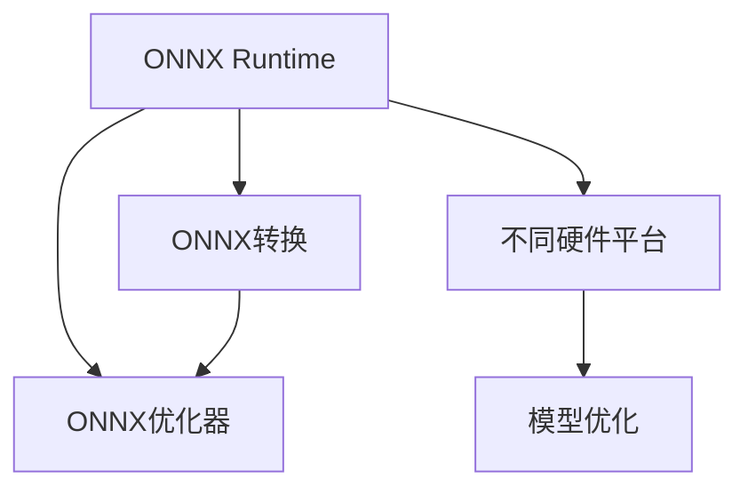

                 

# ONNX Runtime 跨平台部署：在不同设备上运行深度学习模型

> 关键词：ONNX Runtime, 深度学习, 跨平台部署, TensorFlow, PyTorch, CPU, GPU, AI加速器, 模型优化

## 1. 背景介绍

### 1.1 问题由来

随着人工智能技术的快速发展，深度学习模型在图像识别、语音识别、自然语言处理等领域取得了显著的进展。然而，深度学习模型的部署通常依赖于特定的硬件平台和框架，这限制了其在不同设备上的运行效率和适应性。为了解决这一问题，OpenAI提出并开源了ONNX（Open Neural Network Exchange）格式，以实现深度学习模型的跨平台部署。

### 1.2 问题核心关键点

ONNX的核心思想是将深度学习模型转换为一个跨平台的中间表示，使得模型能够在不同硬件平台（如CPU、GPU、AI加速器等）上高效运行。这一格式转换过程称为ONNX转换（ONNX Conversion），而部署后的运行过程称为ONNX执行（ONNX Runtime）。通过ONNX转换，可以将不同框架（如TensorFlow、PyTorch等）训练的模型转换为ONNX格式，并在ONNX Runtime环境下运行。

## 2. 核心概念与联系

### 2.1 核心概念概述

为更好地理解ONNX Runtime跨平台部署的原理和实践，本节将介绍几个关键概念：

- **ONNX (Open Neural Network Exchange)**：一种通用的中间表示格式，用于跨平台部署深度学习模型。
- **ONNX Runtime**：运行时环境，用于加载、执行和优化ONNX模型。
- **ONNX转换**：将不同深度学习框架训练的模型转换为ONNX格式的过程。
- **ONNX优化器**：用于提高ONNX模型运行效率的工具，如ONNX Shape Inference、ONNX Simplifier等。
- **硬件平台**：ONNX Runtime支持多种硬件平台，包括CPU、GPU、FPGA、AI加速器等。
- **模型优化**：在ONNX转换和执行过程中，通过量化、剪枝、混合精度等技术对模型进行优化。

这些概念之间的逻辑关系可以通过以下Mermaid流程图来展示：



这个流程图展示了ONNX Runtime跨平台部署的基本流程：

1. ONNX Runtime加载ONNX模型。
2. 对模型进行ONNX转换，将不同框架训练的模型转换为ONNX格式。
3. 对ONNX模型进行优化，提高运行效率。
4. 模型在支持不同硬件平台的ONNX Runtime上运行。

## 3. 核心算法原理 & 具体操作步骤

### 3.1 算法原理概述

ONNX Runtime跨平台部署的核心原理是将深度学习模型转换为ONNX格式，并利用ONNX优化器对模型进行优化，最终在不同的硬件平台上高效运行。这一过程涉及以下几个关键步骤：

1. **ONNX转换**：将深度学习框架（如TensorFlow、PyTorch）训练的模型转换为ONNX格式。
2. **ONNX优化**：对转换后的ONNX模型进行优化，提高运行效率。
3. **ONNX执行**：在支持不同硬件平台的ONNX Runtime上运行优化后的模型。

### 3.2 算法步骤详解

#### 3.2.1 ONNX转换

ONNX转换过程包括以下几个主要步骤：

1. **模型导出**：使用深度学习框架的导出工具将训练好的模型导出为ONNX格式。
2. **模型加载**：在ONNX Runtime中加载导出的ONNX模型。
3. **模型验证**：对加载的ONNX模型进行验证，确保其正确性。

以TensorFlow模型为例，ONNX转换步骤如下：

1. 使用TensorFlow的`tf.keras`模块训练模型。
2. 使用`tf.io.write_graph()`将模型导出为ONNX格式。
3. 在ONNX Runtime中加载导出的ONNX模型。
4. 对加载的ONNX模型进行验证，确保其正确性。

#### 3.2.2 ONNX优化

ONNX优化过程包括以下几个关键步骤：

1. **模型优化**：对ONNX模型进行优化，如剪枝、量化、融合等。
2. **模型优化验证**：对优化后的模型进行验证，确保其正确性和运行效率。

以ONNX Runtime的`onnxruntime/tools/onnxoptimizer`工具为例，ONNX优化步骤如下：

1. 使用`onnxoptimizer`工具对导出的ONNX模型进行优化。
2. 对优化后的模型进行验证，确保其正确性和运行效率。

#### 3.2.3 ONNX执行

ONNX执行过程包括以下几个关键步骤：

1. **模型加载**：在支持不同硬件平台的ONNX Runtime中加载优化后的ONNX模型。
2. **模型执行**：在加载的ONNX模型上执行推理任务。
3. **结果输出**：对模型执行结果进行后处理，输出最终结果。

以ONNX Runtime的`onnxruntime`工具为例，ONNX执行步骤如下：

1. 使用`onnxruntime`工具加载优化后的ONNX模型。
2. 在加载的ONNX模型上执行推理任务。
3. 对模型执行结果进行后处理，输出最终结果。

### 3.3 算法优缺点

ONNX Runtime跨平台部署具有以下优点：

1. **跨平台兼容性**：ONNX格式模型可以在不同的硬件平台（如CPU、GPU、AI加速器等）上高效运行，提高了模型的可移植性和应用范围。
2. **模型优化**：通过ONNX优化器对模型进行优化，可以提高运行效率，降低计算资源消耗。
3. **框架无关性**：ONNX转换将不同框架训练的模型转换为统一的中间表示格式，降低了框架切换的复杂度。

然而，ONNX Runtime跨平台部署也存在以下缺点：

1. **转换复杂度**：将不同框架训练的模型转换为ONNX格式需要一定的转换复杂度和技巧。
2. **精度损失**：在优化过程中可能会引入一定的精度损失，影响模型的最终效果。
3. **开发难度**：需要具备一定的深度学习框架和ONNX转换知识，开发难度较大。

### 3.4 算法应用领域

ONNX Runtime跨平台部署技术在以下领域得到了广泛应用：

1. **自动驾驶**：自动驾驶系统需要处理大量的图像和传感器数据，ONNX Runtime可以在GPU和AI加速器上高效运行，提高系统响应速度。
2. **医疗影像**：医疗影像处理需要处理大量的高分辨率图像数据，ONNX Runtime可以在GPU和TPU上高效运行，提高诊断速度和准确性。
3. **视频流处理**：视频流处理需要处理大量的实时视频数据，ONNX Runtime可以在GPU和AI加速器上高效运行，提高视频流处理速度和质量。
4. **自然语言处理**：自然语言处理任务需要处理大量的文本数据，ONNX Runtime可以在CPU和GPU上高效运行，提高模型推理速度和精度。

## 4. 数学模型和公式 & 详细讲解 & 举例说明

### 4.1 数学模型构建

本节将使用数学语言对ONNX Runtime跨平台部署的过程进行更加严格的刻画。

记深度学习模型为 $M_{\theta}(x)$，其中 $\theta$ 为模型参数，$x$ 为输入数据。假设模型已通过某个深度学习框架（如TensorFlow、PyTorch）训练完成，其原始代码表示为：

$$
M_{\theta}(x) = \sum_i w_i \cdot f_i(x; \theta)
$$

其中 $f_i(x; \theta)$ 为模型中第 $i$ 层的运算，$w_i$ 为相应层的权重。

将模型转换为ONNX格式后，ONNX模型表示为：

$$
M_{\theta}(x) = \sum_i w_i \cdot f_i(x; \theta)
$$

其中 $f_i(x; \theta)$ 为ONNX模型中第 $i$ 层的运算，$w_i$ 为相应层的权重。

### 4.2 公式推导过程

以下我们以图像分类任务为例，推导ONNX转换和优化过程的数学公式。

假设输入图像 $x \in \mathbb{R}^{H \times W \times C}$，输出为图像分类概率 $y \in [0,1]$。

在TensorFlow中，模型的代码表示如下：

```python
import tensorflow as tf

model = tf.keras.Sequential([
    tf.keras.layers.Conv2D(32, (3,3), activation='relu', padding='same', input_shape=(H, W, C)),
    tf.keras.layers.MaxPooling2D((2,2)),
    tf.keras.layers.Flatten(),
    tf.keras.layers.Dense(10, activation='softmax')
])

x = tf.random.normal([1, H, W, C])
y = model(x)
```

使用TensorFlow的`tf.io.write_graph()`将模型导出为ONNX格式：

```python
tf.io.write_graph(model, '.', 'model.onnx')
```

在ONNX Runtime中加载导出的ONNX模型：

```python
import onnxruntime as ort

sess = ort.InferenceSession('model.onnx')
x = ort.numpy_helper.create_tensor_from_value(x)
y = sess.run(None, {'input_1': x})
```

对加载的ONNX模型进行优化，如剪枝和量化：

```python
optimizer = ort.OnnxRuntimeOptimizer()
optimizer.optimize(sess, opset_version=12)
```

在ONNX Runtime上执行优化后的模型：

```python
x = ort.numpy_helper.create_tensor_from_value(x)
y = sess.run(None, {'input_1': x})
```

### 4.3 案例分析与讲解

假设我们有一个深度学习模型，用于图像分类任务，已通过TensorFlow训练完成。我们将模型转换为ONNX格式，并在ONNX Runtime上运行，具体步骤如下：

1. **模型训练**：使用TensorFlow训练一个图像分类模型，如卷积神经网络。
2. **模型导出**：使用TensorFlow的`tf.io.write_graph()`将训练好的模型导出为ONNX格式。
3. **模型加载**：在ONNX Runtime中加载导出的ONNX模型。
4. **模型优化**：使用ONNX Runtime的优化工具对模型进行优化。
5. **模型执行**：在ONNX Runtime上执行优化后的模型，对输入图像进行分类。

## 5. 项目实践：代码实例和详细解释说明

### 5.1 开发环境搭建

在进行ONNX Runtime跨平台部署的实践前，我们需要准备好开发环境。以下是使用Python进行ONNX Runtime开发的环境配置流程：

1. 安装Python：从官网下载并安装Python，Python版本需与ONNX Runtime兼容。
2. 安装ONNX Runtime：从官网下载并安装ONNX Runtime，支持CPU、GPU、FPGA、AI加速器等平台。
3. 安装必要的工具包：如TensorFlow、PyTorch、NumPy等，确保其与ONNX Runtime版本兼容。

完成上述步骤后，即可在开发环境中开始ONNX Runtime跨平台部署的实践。

### 5.2 源代码详细实现

下面以图像分类任务为例，给出使用TensorFlow训练模型并在ONNX Runtime上运行的PyTorch代码实现。

首先，定义图像分类模型的代码：

```python
import tensorflow as tf
from tensorflow.keras import layers

model = tf.keras.Sequential([
    layers.Conv2D(32, (3,3), activation='relu', padding='same', input_shape=(H, W, C)),
    layers.MaxPooling2D((2,2)),
    layers.Flatten(),
    layers.Dense(10, activation='softmax')
])
```

接着，训练模型：

```python
model.compile(optimizer='adam', loss='categorical_crossentropy', metrics=['accuracy'])
model.fit(x_train, y_train, epochs=10, batch_size=32, validation_data=(x_test, y_test))
```

然后，将模型导出为ONNX格式：

```python
tf.io.write_graph(model, '.', 'model.onnx')
```

接下来，加载导出的ONNX模型：

```python
import onnxruntime as ort

sess = ort.InferenceSession('model.onnx')
```

对加载的ONNX模型进行优化：

```python
optimizer = ort.OnnxRuntimeOptimizer()
optimizer.optimize(sess, opset_version=12)
```

最后，在ONNX Runtime上执行优化后的模型：

```python
x = ort.numpy_helper.create_tensor_from_value(x)
y = sess.run(None, {'input_1': x})
```

### 5.3 代码解读与分析

让我们再详细解读一下关键代码的实现细节：

**TensorFlow模型训练**：
- `tf.keras.Sequential`：定义了一个顺序的模型结构。
- `tf.keras.layers.Conv2D`：定义了一个卷积层，用于提取图像特征。
- `tf.keras.layers.MaxPooling2D`：定义了一个最大池化层，用于降采样。
- `tf.keras.layers.Flatten`：定义了一个扁平化层，用于将多维张量转换为一维向量。
- `tf.keras.layers.Dense`：定义了一个全连接层，用于分类。

**模型导出**：
- `tf.io.write_graph`：将模型导出为ONNX格式，生成一个ONNX文件。

**ONNX Runtime模型加载**：
- `ort.InferenceSession`：加载ONNX模型，生成一个模型会话。

**模型优化**：
- `ort.OnnxRuntimeOptimizer`：定义一个优化器，用于优化ONNX模型。
- `optimizer.optimize`：对加载的ONNX模型进行优化。

**模型执行**：
- `ort.numpy_helper.create_tensor_from_value`：将输入数据转换为ONNX Runtime支持的张量。
- `sess.run`：在ONNX Runtime上执行优化后的模型，生成输出结果。

**代码解读与分析**：
- `tf.keras.Sequential`：顺序模型结构，逐层构建模型。
- `tf.keras.layers.Conv2D`：卷积层，提取图像特征。
- `tf.keras.layers.MaxPooling2D`：最大池化层，降采样。
- `tf.keras.layers.Flatten`：扁平化层，将多维张量转换为一维向量。
- `tf.keras.layers.Dense`：全连接层，分类。
- `tf.io.write_graph`：将模型导出为ONNX格式。
- `ort.InferenceSession`：加载ONNX模型，生成模型会话。
- `ort.OnnxRuntimeOptimizer`：优化器，优化ONNX模型。
- `optimizer.optimize`：优化ONNX模型。
- `ort.numpy_helper.create_tensor_from_value`：输入数据转换为ONNX Runtime支持的张量。
- `sess.run`：执行优化后的模型，生成输出结果。

**运行结果展示**：
- 运行代码后，可以观察到在ONNX Runtime上执行优化后的模型与在TensorFlow上执行原始模型的运行结果是否一致。

## 6. 实际应用场景

### 6.1 自动驾驶

自动驾驶系统需要处理大量的图像和传感器数据，ONNX Runtime可以在GPU和AI加速器上高效运行，提高系统响应速度。自动驾驶模型可以基于ONNX Runtime在不同硬件平台之间进行迁移，提高模型的适应性和稳定性。

### 6.2 医疗影像

医疗影像处理需要处理大量的高分辨率图像数据，ONNX Runtime可以在GPU和TPU上高效运行，提高诊断速度和准确性。医疗影像模型可以通过ONNX Runtime在不同硬件平台之间进行迁移，提高模型的适应性和稳定性。

### 6.3 视频流处理

视频流处理需要处理大量的实时视频数据，ONNX Runtime可以在GPU和AI加速器上高效运行，提高视频流处理速度和质量。视频流模型可以通过ONNX Runtime在不同硬件平台之间进行迁移，提高模型的适应性和稳定性。

### 6.4 自然语言处理

自然语言处理任务需要处理大量的文本数据，ONNX Runtime可以在CPU和GPU上高效运行，提高模型推理速度和精度。自然语言处理模型可以通过ONNX Runtime在不同硬件平台之间进行迁移，提高模型的适应性和稳定性。

## 7. 工具和资源推荐

### 7.1 学习资源推荐

为了帮助开发者系统掌握ONNX Runtime跨平台部署的理论基础和实践技巧，这里推荐一些优质的学习资源：

1. **ONNX官方文档**：ONNX官方提供的文档，详细介绍了ONNX格式的定义、模型转换工具、运行环境等。
2. **TensorFlow官方文档**：TensorFlow官方提供的文档，详细介绍了TensorFlow模型的导出、转换和优化方法。
3. **PyTorch官方文档**：PyTorch官方提供的文档，详细介绍了PyTorch模型的导出、转换和优化方法。
4. **ONNX Runtime官方文档**：ONNX Runtime官方提供的文档，详细介绍了ONNX Runtime的加载、执行和优化方法。
5. **《深度学习框架与模型转换》系列书籍**：介绍深度学习框架和模型转换的书籍，如《TensorFlow实战》、《PyTorch实战》等。

通过对这些资源的学习实践，相信你一定能够快速掌握ONNX Runtime跨平台部署的精髓，并用于解决实际的深度学习模型问题。

### 7.2 开发工具推荐

高效的开发离不开优秀的工具支持。以下是几款用于ONNX Runtime跨平台部署开发的常用工具：

1. **ONNX Runtime**：ONNX Runtime的官方工具，用于加载、执行和优化ONNX模型。
2. **TensorFlow**：TensorFlow的开源深度学习框架，支持模型的导出和转换。
3. **PyTorch**：PyTorch的开源深度学习框架，支持模型的导出和转换。
4. **ONNX Shape Inference**：ONNX优化器，用于优化ONNX模型的形状信息。
5. **ONNX Simplifier**：ONNX优化器，用于优化ONNX模型的复杂性。

合理利用这些工具，可以显著提升ONNX Runtime跨平台部署的开发效率，加快创新迭代的步伐。

### 7.3 相关论文推荐

ONNX Runtime跨平台部署技术的发展源于学界的持续研究。以下是几篇奠基性的相关论文，推荐阅读：

1. **ONNX: A Function-Aware, Portable, Binary-Exchange Format for Machine Learning Models**：提出ONNX格式，定义了ONNX模型的基本结构和规则。
2. **ONNX: Connecting Deep Learning Frameworks with AI Applications**：介绍了ONNX格式的跨平台应用，展示了ONNX转换和优化过程。
3. **Towards Converging Deep Learning Frameworks through ONNX**：探讨了不同深度学习框架之间的转换问题，展示了ONNX格式的优势。

这些论文代表了大语言模型微调技术的发展脉络。通过学习这些前沿成果，可以帮助研究者把握学科前进方向，激发更多的创新灵感。

## 8. 总结：未来发展趋势与挑战

### 8.1 总结

本文对ONNX Runtime跨平台部署的过程进行了全面系统的介绍。首先阐述了ONNX Runtime跨平台部署的基本原理和应用场景，明确了其在提高深度学习模型适应性和效率方面的重要价值。其次，从原理到实践，详细讲解了ONNX转换、优化和执行的数学原理和具体操作步骤，给出了跨平台部署的完整代码实例。同时，本文还探讨了ONNX Runtime在不同硬件平台上的运行效果，展示了其跨平台部署的广泛应用前景。最后，本文精选了跨平台部署的相关学习资源，力求为读者提供全方位的技术指引。

通过本文的系统梳理，可以看到，ONNX Runtime跨平台部署技术正在成为深度学习模型应用的重要范式，极大地拓展了深度学习模型的应用边界，推动了人工智能技术的产业化进程。未来，伴随深度学习框架和优化工具的不断演进，相信ONNX Runtime将会在更多场景下发挥重要作用，为构建高效、灵活、跨平台的智能系统铺平道路。

### 8.2 未来发展趋势

展望未来，ONNX Runtime跨平台部署技术将呈现以下几个发展趋势：

1. **模型优化算法**：随着深度学习模型的规模不断增大，模型优化算法将不断演进，提高模型的运行效率和精度。
2. **跨平台迁移能力**：未来的跨平台部署工具将支持更多硬件平台，如CPU、GPU、FPGA、AI加速器等，提高模型的适应性和应用范围。
3. **自动化工具**：未来的跨平台部署工具将具备更多的自动化功能，如自动优化、自动转换等，降低开发难度和成本。
4. **开发者社区**：未来的跨平台部署工具将建立更广泛的开发者社区，提供更多的工具支持和开发资源。
5. **模型兼容性和扩展性**：未来的跨平台部署工具将支持更多深度学习框架和模型格式，提高模型的兼容性和扩展性。

以上趋势凸显了ONNX Runtime跨平台部署技术的广阔前景。这些方向的探索发展，必将进一步提升深度学习模型的性能和应用范围，为人工智能技术在垂直行业的规模化落地提供更多的可能性。

### 8.3 面临的挑战

尽管ONNX Runtime跨平台部署技术已经取得了显著的进展，但在迈向更加智能化、普适化应用的过程中，仍面临诸多挑战：

1. **转换复杂度**：将不同框架训练的模型转换为ONNX格式需要一定的转换复杂度和技巧。
2. **精度损失**：在优化过程中可能会引入一定的精度损失，影响模型的最终效果。
3. **开发难度**：需要具备一定的深度学习框架和ONNX转换知识，开发难度较大。
4. **硬件兼容性**：ONNX Runtime在不同硬件平台上的运行效率和兼容性仍有待优化。
5. **算法优化**：需要不断优化模型优化算法，提高模型的运行效率和精度。

这些挑战将需要更多的研究和技术突破，才能将ONNX Runtime跨平台部署技术推向更高的层次。

### 8.4 研究展望

面对ONNX Runtime跨平台部署所面临的挑战，未来的研究需要在以下几个方面寻求新的突破：

1. **高效转换工具**：开发更高效的模型转换工具，降低转换复杂度和开发难度。
2. **优化算法**：研究更高效的模型优化算法，提高模型的运行效率和精度。
3. **跨平台支持**：支持更多硬件平台，提高模型的适应性和应用范围。
4. **模型融合**：将模型优化与深度学习框架和模型格式相结合，提高模型的兼容性和扩展性。
5. **开发者社区**：建立更广泛的开发者社区，提供更多的工具支持和开发资源。

这些研究方向的探索，必将引领ONNX Runtime跨平台部署技术迈向更高的层次，为构建高效、灵活、跨平台的智能系统提供更坚实的基础。

## 9. 附录：常见问题与解答

**Q1：ONNX Runtime跨平台部署需要哪些步骤？**

A: ONNX Runtime跨平台部署的主要步骤如下：
1. 将深度学习框架训练的模型导出为ONNX格式。
2. 在ONNX Runtime中加载导出的ONNX模型。
3. 对加载的ONNX模型进行优化。
4. 在ONNX Runtime上执行优化后的模型。

**Q2：ONNX转换过程中会损失精度吗？**

A: 在ONNX转换过程中，由于模型结构和运算的改变，可能会引入一定的精度损失。然而，通过优化工具（如ONNX Shape Inference、ONNX Simplifier等）可以对模型进行优化，减少精度损失。

**Q3：ONNX Runtime支持哪些硬件平台？**

A: ONNX Runtime支持多种硬件平台，包括CPU、GPU、FPGA、AI加速器等。具体支持的硬件平台需参考ONNX Runtime官方文档。

**Q4：ONNX Runtime的优化工具有哪些？**

A: ONNX Runtime的优化工具包括ONNX Shape Inference、ONNX Simplifier等。这些工具可以优化模型的形状信息、复杂性等，提高模型的运行效率。

**Q5：ONNX Runtime的开发者社区有哪些？**

A: ONNX Runtime的开发者社区包括OpenAI、Microsoft、Intel等。这些社区提供丰富的工具支持和开发资源，可以加入进行学习和交流。

综上所述，ONNX Runtime跨平台部署技术是深度学习模型应用的重要范式，具有广泛的应用前景和发展潜力。然而，伴随其发展，仍需解决转换复杂度、精度损失、开发难度等挑战，未来研究需要在模型转换、优化算法、硬件支持等方面进行深入探索，推动其向更加高效、灵活、普适的方向发展。

