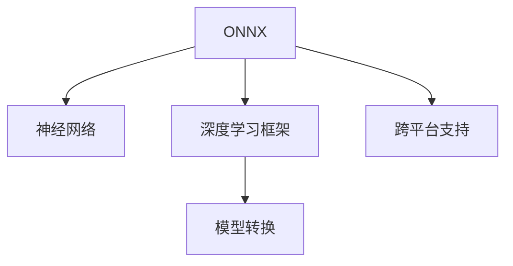

                 

# ONNX：开放式神经网络交换格式

> 关键词：ONNX, 神经网络, 模型交换, 深度学习, 高性能, 跨平台

## 1. 背景介绍

### 1.1 问题由来
在当今的深度学习领域，模型的可复现性和跨平台性是两个极其重要的考虑因素。由于各大深度学习框架之间的差异，使得同一个模型的训练和推理在不同的环境中可能会遇到障碍。这就迫切需要一种统一的模型交换格式，以便更好地共享和复用模型。在这样的背景下，ONNX（Open Neural Network Exchange）应运而生。

### 1.2 问题核心关键点
ONNX是一种用于表示和交换神经网络模型的开放标准格式。它不仅支持多种深度学习框架之间的模型转换，还支持模型的导出和导入，使得开发者可以在不同的深度学习框架间进行无缝切换。

通过使用ONNX，可以实现以下目标：
- 模型统一：将模型在不同深度学习框架之间进行转换，确保模型的一致性和可复现性。
- 高效性能：ONNX模型可以在不同的硬件上运行，如CPU、GPU、FPGA等，以获得更好的性能和效率。
- 跨平台支持：ONNX模型可以在不同的操作系统和设备上运行，支持移动设备、服务器和桌面计算机等多种平台。

## 2. 核心概念与联系

### 2.1 核心概念概述

为更好地理解ONNX，本节将介绍几个关键概念：

- **ONNX**：开放式神经网络交换格式，用于表示和交换神经网络模型的一种开放标准。
- **神经网络**：由多个神经元组成的计算图，用于处理和预测复杂数据。
- **深度学习框架**：如TensorFlow、PyTorch、Caffe等，用于构建和训练神经网络模型的工具。
- **模型转换**：将一个框架中的模型转换为另一个框架中的模型，以适应不同的应用场景。
- **跨平台支持**：ONNX模型可以在不同的硬件和软件平台上运行，确保模型的跨平台兼容性。

这些核心概念之间的逻辑关系可以通过以下Mermaid流程图来展示：



这个流程图展示了ONNX的各核心概念及其之间的关系：

1. ONNX作为一个开放的标准格式，用于表示神经网络模型。
2. 神经网络通过深度学习框架构建和训练。
3. 模型转换技术可以将不同框架的模型转换为ONNX格式。
4. 跨平台支持使得ONNX模型能够在不同的硬件和软件平台上运行。

## 3. 核心算法原理 & 具体操作步骤
### 3.1 算法原理概述

ONNX的核心原理在于提供了一种标准的模型表示方法，使得不同深度学习框架之间的模型转换成为可能。其算法原理主要包括以下几个方面：

- **统一表示**：ONNX提供了一套标准化的语法规则，用于描述神经网络模型的计算图。这些规则确保了模型的表示一致性。
- **格式兼容**：ONNX设计为可扩展的格式，支持不同深度学习框架生成的模型。这些框架可以通过ONNX的Python接口，将自身的模型转换为ONNX格式。
- **高性能优化**：ONNX模型可以在不同的硬件平台（如CPU、GPU、FPGA等）上运行，并支持多种优化技术，如量化、剪枝、融合等。

### 3.2 算法步骤详解

以下详细描述ONNX模型转换的各个步骤：

**Step 1: 准备模型和工具链**
- 选择待转换的深度学习框架，如TensorFlow、PyTorch、Caffe等。
- 安装对应的ONNX工具链，包括ONNX Runtime和ONNX Python API。

**Step 2: 定义转换接口**
- 编写将原模型转换为ONNX格式的接口函数，调用ONNX Python API中的相关函数。
- 定义模型的输入和输出张量，以及模型参数。
- 定义模型中的计算图结构，包括节点、边、张量等。

**Step 3: 执行模型转换**
- 使用转换接口函数，将原模型转换为ONNX格式。
- 对转换后的模型进行验证和优化，确保其在目标平台上的运行效率。

**Step 4: 部署模型**
- 将转换后的ONNX模型部署到目标平台上，进行推理或训练。
- 可以使用ONNX Runtime等工具，加载和运行转换后的模型。

### 3.3 算法优缺点

ONNX作为模型交换格式，具有以下优点：
1. **跨框架支持**：ONNX能够将不同深度学习框架的模型进行转换，确保模型的跨框架兼容性。
2. **跨平台支持**：ONNX模型可以在不同的硬件和软件平台上运行，支持移动设备、服务器和桌面计算机等多种平台。
3. **高效性能**：ONNX模型可以在不同的硬件上运行，获得更好的性能和效率。
4. **标准化**：ONNX提供了一套标准化的语法规则，确保模型的表示一致性。

同时，ONNX也存在一些局限性：
1. **转换复杂度**：模型转换的复杂度较高，需要编写专门的接口函数。
2. **不完整支持**：一些深度学习框架对ONNX的支持可能不完整，无法完全转换某些模型。
3. **扩展性**：由于ONNX是一个开放标准，扩展性和维护性需要进一步提升。

尽管存在这些局限性，但就目前而言，ONNX仍是深度学习领域中最重要的模型交换格式之一。未来相关研究的重点在于如何进一步提升转换工具的易用性、扩展性和兼容性，以及提高ONNX模型在特定硬件上的优化效果。

### 3.4 算法应用领域

ONNX已经在多个领域得到了广泛应用，例如：

- **深度学习研究**：用于学术界的研究和论文发表，便于在不同平台间进行模型比较和验证。
- **生产环境部署**：将训练好的模型部署到不同的硬件和软件平台，如GPU服务器、移动设备等。
- **跨框架合作**：多个深度学习框架合作，共同开发和维护支持ONNX的工具链和模型。
- **在线服务**：将ONNX模型部署到云端服务中，支持用户通过API接口进行推理或训练。

## 4. 数学模型和公式 & 详细讲解  
### 4.1 数学模型构建

ONNX模型的数学模型构建主要基于计算图。计算图由一系列节点和边组成，节点表示计算操作，边表示数据流。下面以一个简单的全连接神经网络为例，展示ONNX模型的数学模型构建过程。

**输入层**：
- 假设输入张量为 $X$，形状为 $(N, C)$。

**隐藏层**：
- 假设隐藏层有 $H$ 个神经元，每个神经元连接到输入层的 $C$ 个特征。
- 使用ReLU激活函数，计算隐藏层的输出 $H$。

**输出层**：
- 假设输出层有 $M$ 个神经元，每个神经元连接到隐藏层的 $H$ 个特征。
- 使用Softmax激活函数，计算输出层的输出 $Y$。

**损失函数**：
- 假设输出层的真实标签为 $T$，使用交叉熵损失函数计算损失 $L$。

### 4.2 公式推导过程

ONNX模型的数学模型构建过程主要涉及以下几个步骤：

**输入层**：
$$
X \in \mathbb{R}^{N \times C}
$$

**隐藏层**：
$$
H = \text{ReLU}(W_H \cdot X + b_H)
$$
其中 $W_H$ 和 $b_H$ 分别为权重和偏置，形状为 $(H, C)$。

**输出层**：
$$
Y = \text{Softmax}(W_O \cdot H + b_O)
$$
其中 $W_O$ 和 $b_O$ 分别为权重和偏置，形状为 $(M, H)$。

**损失函数**：
$$
L = -\frac{1}{N} \sum_{i=1}^N \sum_{j=1}^M T_{i,j} \log Y_{i,j}
$$
其中 $T$ 为真实标签，$Y$ 为模型输出。

**梯度计算**：
- 使用反向传播算法计算每个参数的梯度。

**更新参数**：
- 使用梯度下降等优化算法更新模型参数。

### 4.3 案例分析与讲解

以一个简单的全连接神经网络为例，展示ONNX模型的数学模型构建过程。

**输入层**：
- 假设输入张量为 $X$，形状为 $(N, C)$。

**隐藏层**：
- 假设隐藏层有 $H$ 个神经元，每个神经元连接到输入层的 $C$ 个特征。
- 使用ReLU激活函数，计算隐藏层的输出 $H$。

**输出层**：
- 假设输出层有 $M$ 个神经元，每个神经元连接到隐藏层的 $H$ 个特征。
- 使用Softmax激活函数，计算输出层的输出 $Y$。

**损失函数**：
- 假设输出层的真实标签为 $T$，使用交叉熵损失函数计算损失 $L$。

使用ONNX Python API将原模型转换为ONNX格式，并导出到ONNX模型文件。

## 5. 项目实践：代码实例和详细解释说明
### 5.1 开发环境搭建

在进行ONNX模型转换前，我们需要准备好开发环境。以下是使用Python进行ONNX开发的环境配置流程：

1. 安装Anaconda：从官网下载并安装Anaconda，用于创建独立的Python环境。

2. 创建并激活虚拟环境：
```bash
conda create -n onnx-env python=3.8 
conda activate onnx-env
```

3. 安装ONNX和相关工具：
```bash
pip install onnx onnxruntime torch
```

4. 安装必要的库：
```bash
pip install numpy scipy scikit-learn matplotlib
```

完成上述步骤后，即可在`onnx-env`环境中开始ONNX模型转换的实践。

### 5.2 源代码详细实现

下面以一个简单的全连接神经网络为例，展示使用ONNX Python API进行模型转换的代码实现。

```python
import onnx
import torch
from torch import nn

# 定义全连接神经网络
class MLP(nn.Module):
    def __init__(self, input_size, hidden_size, output_size):
        super(MLP, self).__init__()
        self.fc1 = nn.Linear(input_size, hidden_size)
        self.fc2 = nn.Linear(hidden_size, output_size)
        self.relu = nn.ReLU()

    def forward(self, x):
        x = self.fc1(x)
        x = self.relu(x)
        x = self.fc2(x)
        return x

# 实例化模型
model = MLP(input_size=4, hidden_size=8, output_size=2)
input_tensor = torch.randn(32, 4)
output = model(input_tensor)
loss = nn.CrossEntropyLoss()(output, input_tensor)

# 将模型转换为ONNX格式
onnx_model = onnx.export(model, input_tensor, "model.onnx", opset_version=9, export_params=True)
```

### 5.3 代码解读与分析

让我们再详细解读一下关键代码的实现细节：

**MLP类**：
- 定义了一个简单的全连接神经网络，包括两个全连接层和一个ReLU激活函数。
- 使用PyTorch的`nn.Linear`和`nn.ReLU`等模块构建神经网络。

**实例化模型**：
- 实例化MLP模型，并传入输入张量。
- 计算模型的输出，并使用交叉熵损失函数计算损失。

**转换为ONNX格式**：
- 使用ONNX的`onnx.export`函数将模型转换为ONNX格式，并保存到本地文件。
- 设置`opset_version`参数为9，指定使用的ONNX版本。
- 使用`export_params`参数指定是否导出模型的权重和偏置。

**运行结果展示**：
- 保存转换后的ONNX模型文件，并可以在其他深度学习框架或硬件平台上加载和运行。

## 6. 实际应用场景
### 6.1 生产环境部署

ONNX模型转换在生产环境部署中的应用非常广泛。传统上，深度学习模型的部署需要重新训练或微调，这不仅耗时，还会影响模型的性能和精度。通过使用ONNX模型，可以直接将训练好的模型导出为ONNX格式，然后在目标平台上加载和运行，无需重新训练或微调。

在实际部署中，可以将ONNX模型部署到GPU服务器、云平台、移动设备等不同的硬件和软件平台上，以适应不同的应用场景。

### 6.2 跨框架合作

多个深度学习框架可以合作开发和维护ONNX支持的工具链和模型。例如，TensorFlow和PyTorch都支持将自身的模型转换为ONNX格式，从而可以在不同的框架间进行模型交换和合作。

通过使用ONNX，可以降低不同框架间的模型转换复杂度，促进深度学习研究的共享和复用。

### 6.3 模型优化与调整

ONNX模型可以在不同的硬件平台（如CPU、GPU、FPGA等）上运行，并支持多种优化技术，如量化、剪枝、融合等。通过在目标平台上进行优化调整，可以显著提升模型的性能和效率。

例如，可以将ONNX模型在GPU上运行，利用硬件加速获得更高的推理速度。或者进行量化和剪枝，减小模型大小，降低内存和计算资源消耗。

## 7. 工具和资源推荐
### 7.1 学习资源推荐

为了帮助开发者系统掌握ONNX的理论基础和实践技巧，这里推荐一些优质的学习资源：

1. ONNX官网：提供详细的文档、示例和API接口，是学习ONNX的最佳起点。
2. ONNX-Zoo：包含多种深度学习框架和硬件平台的模型示例，适合快速上手。
3. ONNX-Tutorials：由微软官方提供的详细教程，涵盖ONNX的各个方面。
4. PyTorch官方文档：详细介绍了ONNX在PyTorch中的使用和优化方法。
5. TensorFlow官方文档：详细介绍了ONNX在TensorFlow中的使用和优化方法。

通过对这些资源的学习实践，相信你一定能够快速掌握ONNX模型的构建和优化技巧，并用于解决实际的深度学习问题。

### 7.2 开发工具推荐

高效的开发离不开优秀的工具支持。以下是几款用于ONNX开发和部署的工具：

1. ONNX Runtime：用于加载和运行ONNX模型的跨平台库，支持CPU、GPU、FPGA等多种硬件平台。
2. ONNX Node Editor：一个可视化工具，用于构建和调试ONNX模型。
3. Visual Studio Code：支持ONNX的开发和调试，提供丰富的插件和扩展。
4. PyTorch：支持将PyTorch模型转换为ONNX格式，提供方便的API接口。
5. TensorFlow：支持将TensorFlow模型转换为ONNX格式，提供丰富的优化工具。

合理利用这些工具，可以显著提升ONNX模型开发和部署的效率，加快创新迭代的步伐。

### 7.3 相关论文推荐

ONNX作为深度学习领域的重要标准，已经成为众多研究的热点。以下是几篇奠基性的相关论文，推荐阅读：

1. "ONNX: A Format for Exchanging Deep Learning Models"（2018）：ONNX的发布论文，详细介绍了ONNX的设计理念和实现方法。
2. "ONNX: A Functional Specification for Deep Learning Models"（2018）：ONNX的规范文档，提供了详细的格式说明和样例。
3. "High Performance Inference with ONNX Runtime on CPU and GPU"（2020）：介绍ONNX Runtime在高性能推理方面的优化和应用。
4. "ONNX: Building the Bridge for Transfer Learning Across Frameworks"（2018）：介绍ONNX在跨框架迁移学习中的应用和优势。
5. "Training an ONNX Model Using PyTorch"（2019）：介绍如何将PyTorch模型转换为ONNX格式，并进行优化调整。

这些论文代表了大规模语言模型微调技术的发展脉络。通过学习这些前沿成果，可以帮助研究者把握学科前进方向，激发更多的创新灵感。

## 8. 总结：未来发展趋势与挑战

### 8.1 总结

本文对ONNX模型交换格式进行了全面系统的介绍。首先阐述了ONNX的背景和意义，明确了ONNX在模型复现、跨平台支持等方面的重要价值。其次，从原理到实践，详细讲解了ONNX模型的构建和优化方法，给出了具体的代码实现和运行结果展示。同时，本文还广泛探讨了ONNX模型在生产环境部署、跨框架合作、模型优化与调整等方面的实际应用场景。最后，本文精选了ONNX的学习资源、开发工具和相关论文，力求为读者提供全方位的技术指引。

通过本文的系统梳理，可以看到，ONNX模型交换格式为深度学习模型在多平台、多框架间的复现和迁移提供了有力的工具。ONNX的应用大大降低了模型迁移的复杂度，提高了模型迁移的效率和可靠性。未来，ONNX将在深度学习模型的开发和部署中发挥越来越重要的作用。

### 8.2 未来发展趋势

展望未来，ONNX模型交换格式将呈现以下几个发展趋势：

1. **模型标准化**：更多的深度学习框架将支持ONNX，使得不同框架的模型更加标准化和可复现。
2. **硬件优化**：ONNX模型将在更多的硬件平台上运行，获得更好的性能和效率。
3. **模型优化**：ONNX模型将支持更多的优化技术，如量化、剪枝、融合等，进一步提升模型的性能和精度。
4. **跨平台支持**：ONNX模型将支持更多的操作系统和设备平台，支持更多的硬件加速技术。
5. **生态系统扩展**：更多的工具链和资源将围绕ONNX进行开发和维护，提升其易用性和可扩展性。

以上趋势凸显了ONNX模型交换格式的广阔前景。这些方向的探索发展，必将进一步提升ONNX模型的性能和应用范围，为深度学习技术的落地应用提供更好的支持。

### 8.3 面临的挑战

尽管ONNX模型交换格式已经取得了瞩目成就，但在迈向更加智能化、普适化应用的过程中，它仍面临诸多挑战：

1. **转换复杂度**：模型转换的复杂度较高，需要编写专门的接口函数。对于复杂的模型，转换过程可能会较为繁琐。
2. **不完整支持**：一些深度学习框架对ONNX的支持可能不完整，无法完全转换某些模型。
3. **扩展性**：由于ONNX是一个开放标准，扩展性和维护性需要进一步提升。
4. **跨平台兼容性**：ONNX模型在不同平台上的兼容性需要进一步优化，确保模型在不同硬件和软件平台上的表现一致。
5. **模型优化**：ONNX模型在特定硬件平台上的优化效果需要进一步提升，以获得更好的性能和效率。

尽管存在这些挑战，但随着学界和产业界的共同努力，这些挑战终将一一被克服，ONNX模型交换格式必将在深度学习技术中发挥更大的作用。未来，ONNX将在跨平台、跨框架、跨硬件方面提供更好的支持，成为深度学习模型交流和共享的重要桥梁。

### 8.4 研究展望

面对ONNX模型交换格式所面临的种种挑战，未来的研究需要在以下几个方面寻求新的突破：

1. **简化模型转换**：开发更易用的模型转换工具和库，降低模型转换的复杂度。
2. **优化工具链**：开发更多的优化工具和资源，提升ONNX模型的性能和效率。
3. **增强平台支持**：支持更多的操作系统和设备平台，提升模型的跨平台兼容性。
4. **模型优化技术**：引入更多优化技术，如量化、剪枝、融合等，提升模型的优化效果。
5. **扩展社区生态**：吸引更多开发者和企业参与ONNX的开发和维护，共同推动ONNX技术的发展。

这些研究方向的探索，必将引领ONNX模型交换格式迈向更高的台阶，为深度学习技术的落地应用提供更好的支持。只有勇于创新、敢于突破，才能不断拓展深度学习技术的应用边界，让智能技术更好地造福人类社会。

## 9. 附录：常见问题与解答

**Q1：什么是ONNX？**

A: ONNX（Open Neural Network Exchange）是一种用于表示和交换神经网络模型的开放标准格式。它支持多种深度学习框架之间的模型转换，使得不同框架的模型可以在不同平台上进行迁移和部署。

**Q2：ONNX模型的转换过程有哪些步骤？**

A: ONNX模型的转换过程主要包括以下几个步骤：
1. 准备模型和工具链。
2. 定义转换接口。
3. 执行模型转换。
4. 部署模型。

**Q3：ONNX模型的优势是什么？**

A: ONNX模型的优势主要包括：
1. 跨框架支持：可以将不同深度学习框架的模型进行转换，确保模型的跨框架兼容性。
2. 跨平台支持：可以在不同的硬件和软件平台上运行，支持移动设备、服务器和桌面计算机等多种平台。
3. 高效性能：可以在不同的硬件上运行，获得更好的性能和效率。
4. 标准化：提供了一套标准化的语法规则，确保模型的表示一致性。

**Q4：ONNX模型在实际应用中需要注意哪些问题？**

A: 在使用ONNX模型时，需要注意以下几个问题：
1. 模型转换的复杂度较高，需要编写专门的接口函数。
2. 一些深度学习框架对ONNX的支持可能不完整，无法完全转换某些模型。
3. 扩展性和维护性需要进一步提升。
4. 不同平台上的兼容性需要优化，确保模型在不同硬件和软件平台上的表现一致。
5. 模型在特定硬件平台上的优化效果需要进一步提升。

---

作者：禅与计算机程序设计艺术 / Zen and the Art of Computer Programming

