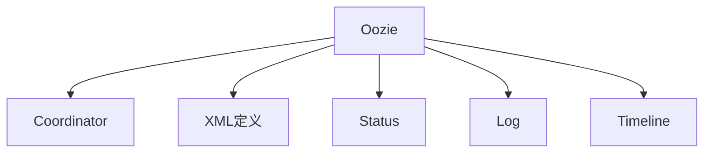

                 

# Oozie Coordinator原理与代码实例讲解

> 关键词：
- Oozie Coordinator
- 工作流管理
- 数据处理
- Apache Hadoop
- Java编程
- 实践案例

## 1. 背景介绍

### 1.1 问题由来

随着大数据技术的发展，企业对数据的处理和分析需求日益增长。为了提高数据处理的效率和自动化程度，企业开始寻求新的解决方案。传统的ETL（Extract, Transform, Load）方式逐渐显露出其局限性，难以满足复杂、高频的数据处理需求。此时，工作流管理系统应运而生，通过协调和管理多个数据处理任务，实现更高效、更可靠的数据处理流程。

### 1.2 问题核心关键点

Oozie作为Apache Hadoop生态系统中的工作流管理系统，能够自动化地调度、监控和管理Hadoop上的各种数据处理任务。其核心功能包括：

- 创建和管理工作流（Workflow）
- 定义和编排任务（Task）
- 监控和审计任务执行情况
- 支持多种任务类型（如MapReduce、Pig、Hive、Spark等）
- 提供可视化界面和命令行接口

Oozie的工作流管理能力，使得企业能够更加灵活地构建复杂的数据处理管道，满足各种数据处理需求。

### 1.3 问题研究意义

Oozie Coordinator作为Oozie的核心组件之一，负责协调和管理多个任务的执行顺序和时间点。理解Oozie Coordinator的原理和应用，对于构建高效、可靠的数据处理系统具有重要意义：

1. 提升数据处理效率：通过自动化地调度和管理任务，Oozie Coordinator能够减少人工干预，提高数据处理的效率。
2. 增强数据处理可靠性：通过监控和审计任务执行情况，Oozie Coordinator能够及时发现并解决任务执行中的问题，保障数据处理的稳定性。
3. 降低开发成本：通过提供可视化的界面和命令行接口，Oozie Coordinator简化了数据处理任务的部署和管理，降低了开发和运维成本。
4. 促进数据处理自动化：Oozie Coordinator支持多种任务类型，使得企业能够更灵活地构建复杂的数据处理管道，提高数据处理自动化水平。

## 2. 核心概念与联系

### 2.1 核心概念概述

为了更好地理解Oozie Coordinator的原理和应用，本节将介绍几个密切相关的核心概念：

- Oozie：Apache Hadoop生态系统中的工作流管理系统，负责协调和管理Hadoop上的各种数据处理任务。
- Coordinator：Oozie的核心组件，负责管理任务的执行顺序和时间点，确保任务按时、按序执行。
- XML定义：Oozie使用XML语言定义工作流和任务，使得任务编排和监控更加灵活、可扩展。
- Status和Log：Oozie提供任务状态和日志信息，帮助开发者监控任务执行情况，及时发现和解决问题。
- Timeline：Oozie提供任务执行的时间轴，帮助开发者了解任务执行过程和依赖关系。

这些核心概念之间的逻辑关系可以通过以下Mermaid流程图来展示：



这个流程图展示了大语言模型的核心概念及其之间的关系：

1. Oozie通过Coordinator组件协调和管理任务的执行，提供灵活、可扩展的任务编排能力。
2. XML定义用于描述任务和任务之间的依赖关系，是Oozie任务编排的基础。
3. Status和Log提供任务执行的状态和日志信息，帮助开发者监控任务执行情况。
4. Timeline展示任务执行的时间轴，帮助开发者了解任务执行过程和依赖关系。

## 3. 核心算法原理 & 具体操作步骤

### 3.1 算法原理概述

Oozie Coordinator的原理基于有向无环图（DAG）的概念，通过XML定义任务和任务之间的依赖关系，构建出一个有向无环图（DAG）。Coordinator按照DAG的顺序依次执行任务，确保每个任务按时、按序完成。

具体来说，Oozie Coordinator通过以下步骤完成任务调度和管理：

1. 解析XML定义，构建任务图（DAG）。
2. 根据任务图的顺序，依次调度任务执行。
3. 监控任务执行状态，及时发现和解决问题。
4. 记录任务执行日志，提供任务执行的审计信息。
5. 通过可视化界面或命令行接口，展示任务执行状态和时间轴。

### 3.2 算法步骤详解

Oozie Coordinator的实现步骤如下：

**Step 1: 创建XML定义文件**

XML定义文件是Oozie Coordinator任务编排的基础，用于描述任务和任务之间的依赖关系。一个典型的XML定义文件可能如下所示：

```xml
<flow>
  <start to="t1"/>
  <action name="t1">
    <hadoop jar="myjar.jar" xmlns:hadoop="http://www.apache.org/oozie" mainClass="com.example.MyMainClass"/>
  </action>
  <action name="t2">
    <hadoop jar="myjar.jar" xmlns:hadoop="http://www.apache.org/oozie" mainClass="com.example.MyMainClass"/>
  </action>
  <end from="t2"/>
</flow>
```

在这个例子中，Oozie Coordinator会依次执行任务t1和任务t2，t1和t2之间没有依赖关系。

**Step 2: 提交工作流**

通过Oozie的Web界面或命令行工具，提交XML定义文件，并启动工作流。例如，在Web界面中输入以下命令：

```bash
oozie flow-job.xml run
```

**Step 3: 监控任务执行**

Oozie Coordinator会根据XML定义的任务图，依次执行任务。可以通过Web界面或命令行工具监控任务的执行状态，例如：

```bash
oozie job -v myjobid
```

**Step 4: 获取执行日志**

通过Web界面或命令行工具获取任务的执行日志，例如：

```bash
oozie job -log myjobid
```

**Step 5: 获取执行时间轴**

通过Web界面或命令行工具获取任务的执行时间轴，例如：

```bash
oozie job -t myjobid
```

以上步骤展示了Oozie Coordinator的核心操作步骤，通过XML定义、任务调度、监控日志等环节，实现了任务的有序执行和管理。

### 3.3 算法优缺点

Oozie Coordinator具有以下优点：

1. 灵活性高：通过XML定义任务和任务之间的依赖关系，可以构建出灵活、可扩展的任务图。
2. 自动化程度高：自动调度和管理任务，减少了人工干预，提高了数据处理的效率。
3. 可扩展性强：支持多种任务类型，如MapReduce、Pig、Hive、Spark等，能够满足各种数据处理需求。
4. 可视化界面：提供可视化的Web界面，方便开发者监控和管理任务。

同时，Oozie Coordinator也存在一些缺点：

1. 学习成本高：Oozie Coordinator需要一定的学习成本，开发者需要理解XML定义和任务调度原理。
2. 配置复杂：任务图的配置较为复杂，需要仔细规划任务之间的依赖关系。
3. 扩展性问题：在大规模数据处理场景下，Oozie Coordinator的扩展性可能会受到限制。

### 3.4 算法应用领域

Oozie Coordinator广泛应用于各种数据处理场景，例如：

- 数据清洗：自动化地进行数据清洗和预处理，提高数据质量。
- 数据集成：自动化地将数据源集成到一个系统中，实现数据的统一管理。
- 数据挖掘：自动化地进行数据挖掘和分析，提取有价值的信息。
- 数据备份：自动化地进行数据备份和恢复，保障数据安全。
- 数据报表：自动化地生成数据报表和报告，支持业务决策。

Oozie Coordinator通过协调和管理多个任务的执行，简化了数据处理流程，提高了数据处理效率和自动化程度。

## 4. 数学模型和公式 & 详细讲解 & 举例说明

### 4.1 数学模型构建

Oozie Coordinator的数学模型基于有向无环图（DAG）的概念，通过XML定义任务和任务之间的依赖关系，构建出一个有向无环图（DAG）。

一个典型的DAG可以表示为：

```
G(V, E)
```

其中，V表示节点集，每个节点表示一个任务；E表示边集，表示任务之间的依赖关系。

### 4.2 公式推导过程

在Oozie Coordinator中，任务图（DAG）的执行顺序遵循拓扑排序的规则，即先执行所有没有前驱节点的节点，再递归地执行有前驱节点的节点。

设任务图（DAG）包含N个任务，按照拓扑排序规则，任务i的执行时间为ti，任务的依赖关系可以表示为一个邻接矩阵A，其中A[i][j]表示任务j是否依赖于任务i。

根据拓扑排序的规则，任务i的执行时间可以表示为：

$$
t_i = \max_{j \in \text{predecessors}(i)} t_j + \text{execution time of task } i
$$

其中，text{predecessors}(i)表示任务i的所有前驱节点。

### 4.3 案例分析与讲解

假设有一个包含三个任务的任务图，任务之间的依赖关系如下：

```
Task 1 -> Task 2 -> Task 3
```

任务1和任务2之间没有依赖关系，任务3依赖于任务2。

根据拓扑排序的规则，任务1的执行时间为t1，任务2的执行时间为t2，任务3的执行时间为t3。则：

$$
t_1 = 0, \quad t_2 = \text{execution time of task } 2, \quad t_3 = t_2 + \text{execution time of task } 3
$$

在任务执行过程中，Coordinator会根据任务图的顺序，依次执行任务。如果任务2执行失败，任务3就无法正常执行。因此，Coordinator会记录任务2的执行日志，及时发现和解决问题。

## 5. 项目实践：代码实例和详细解释说明

### 5.1 开发环境搭建

在进行Oozie Coordinator的实践前，我们需要准备好开发环境。以下是使用Linux搭建Oozie环境的步骤：

1. 安装Java：从Oracle官网下载并安装Java 8或以上版本。
2. 安装Oozie：从Apache Hadoop官网下载安装Oozie，解压后放置在Oozie的解压目录中。
3. 配置Hadoop环境：配置Hadoop的路径和依赖关系，确保Hadoop能够正常运行。
4. 启动Oozie：启动Oozie的Web界面和命令行工具，检查是否启动成功。

### 5.2 源代码详细实现

以下是一个典型的Oozie XML定义文件示例：

```xml
<flow>
  <start to="t1"/>
  <action name="t1">
    <hadoop jar="myjar.jar" xmlns:hadoop="http://www.apache.org/oozie" mainClass="com.example.MyMainClass"/>
  </action>
  <action name="t2">
    <hadoop jar="myjar.jar" xmlns:hadoop="http://www.apache.org/oozie" mainClass="com.example.MyMainClass"/>
  </action>
  <end from="t2"/>
</flow>
```

在这个例子中，Oozie Coordinator会依次执行任务t1和任务t2，t1和t2之间没有依赖关系。

### 5.3 代码解读与分析

**XML定义文件**：

- `<flow>`标签：定义一个工作流，表示整个任务图的执行流程。
- `<start>`标签：定义一个开始节点，表示任务图的起点。
- `<action>`标签：定义一个任务节点，表示一个具体的任务。
- `<end>`标签：定义一个结束节点，表示任务图的终点。

**任务执行过程**：

- 首先，Oozie Coordinator会解析XML定义文件，构建任务图（DAG）。
- 根据任务图的顺序，依次调度任务执行。例如，在上面的例子中，Oozie Coordinator会首先执行任务t1，然后执行任务t2。
- 在任务执行过程中，Coordinator会监控任务的执行状态，记录日志信息，展示任务执行时间轴。

### 5.4 运行结果展示

运行完成后，可以通过Web界面或命令行工具查看任务执行结果。例如，在Web界面中输入以下命令：

```bash
oozie job -v myjobid
```

可以查看任务执行的详细日志信息。

## 6. 实际应用场景

### 6.1 智能客服系统

Oozie Coordinator可以应用于智能客服系统的任务调度和管理。在智能客服系统中，需要处理大量的用户咨询请求，这些请求可以分解为多个子任务，如文本分析、知识库查询、自动回复等。通过Oozie Coordinator，可以将这些子任务自动化地调度和管理，提升客服系统的响应速度和准确性。

在实际应用中，可以将用户的咨询请求作为任务图的起点，将各个子任务作为任务图的节点，将任务之间的依赖关系作为任务图的边。Coordinator会根据任务的执行顺序，依次调度各个子任务的执行，确保用户咨询请求得到及时、准确的处理。

### 6.2 金融数据分析

Oozie Coordinator可以应用于金融数据分析的任务调度和管理。在金融数据分析中，需要处理大量的数据源，这些数据源可以分解为多个子任务，如数据清洗、特征提取、模型训练等。通过Oozie Coordinator，可以将这些子任务自动化地调度和管理，提升数据处理效率和质量。

在实际应用中，可以将金融数据作为任务图的起点，将各个子任务作为任务图的节点，将任务之间的依赖关系作为任务图的边。Coordinator会根据任务的执行顺序，依次调度各个子任务的执行，确保数据处理流程的顺畅和高效。

### 6.3 健康数据监控

Oozie Coordinator可以应用于健康数据监控的任务调度和管理。在健康数据监控中，需要处理大量的传感器数据，这些数据可以分解为多个子任务，如数据清洗、数据分析、结果生成等。通过Oozie Coordinator，可以将这些子任务自动化地调度和管理，提升健康数据监控的实时性和准确性。

在实际应用中，可以将传感器数据作为任务图的起点，将各个子任务作为任务图的节点，将任务之间的依赖关系作为任务图的边。Coordinator会根据任务的执行顺序，依次调度各个子任务的执行，确保健康数据监控的实时性和准确性。

### 6.4 未来应用展望

随着Oozie Coordinator技术的不断发展，未来将在更多领域得到应用，为传统行业带来变革性影响。

在智慧医疗领域，Oozie Coordinator可以应用于医疗数据的实时处理和分析，提升医疗诊断的效率和准确性。

在智能交通领域，Oozie Coordinator可以应用于交通数据的实时处理和分析，提升交通管理的智能化水平。

在智慧能源领域，Oozie Coordinator可以应用于能源数据的实时处理和分析，提升能源管理的智能化水平。

此外，在智慧农业、智慧制造、智慧环保等众多领域，Oozie Coordinator也将发挥重要作用，为传统行业数字化转型升级提供新的技术路径。

## 7. 工具和资源推荐

### 7.1 学习资源推荐

为了帮助开发者系统掌握Oozie Coordinator的理论基础和实践技巧，这里推荐一些优质的学习资源：

1. 《Hadoop权威指南》：介绍Apache Hadoop生态系统的经典著作，详细讲解了Hadoop的工作原理和实现方式。
2. 《Oozie官方文档》：Oozie官方文档，提供完整的Oozie学习资料和实践指南，是学习Oozie的最佳来源。
3. 《Hadoop实战》：介绍Hadoop开发和部署的实战指南，提供了丰富的Oozie应用案例。
4. 《Hadoop社区》：Hadoop官方社区，提供最新的Hadoop和Oozie技术动态和讨论，帮助开发者掌握最新的技术趋势。

通过对这些资源的学习实践，相信你一定能够快速掌握Oozie Coordinator的精髓，并用于解决实际的Oozie问题。

### 7.2 开发工具推荐

高效的开发离不开优秀的工具支持。以下是几款用于Oozie Coordinator开发的常用工具：

1. Eclipse：基于Java的IDE，提供了丰富的Oozie开发工具和插件，方便开发者编写和调试XML定义文件。
2. IntelliJ IDEA：基于Java的IDE，提供了更高级的Oozie开发工具和插件，支持Oozie任务的可视化调试。
3. Git：版本控制系统，方便开发者管理XML定义文件和Oozie任务的源代码。
4. Maven：项目管理工具，方便开发者构建和部署Oozie任务的依赖关系和依赖包。
5. Jenkins：自动化构建工具，方便开发者自动化构建和部署Oozie任务。

合理利用这些工具，可以显著提升Oozie Coordinator的开发效率，加快创新迭代的步伐。

### 7.3 相关论文推荐

Oozie Coordinator作为Apache Hadoop生态系统中的核心组件，其研究和应用受到了广泛关注。以下是几篇奠基性的相关论文，推荐阅读：

1. "Oozie: A Workflow Scheduler for Hadoop"（Hadoop EC-OSP 2008）：介绍Oozie的工作流调度和管理原理，展示了Oozie的基础功能。
2. "Implementing Oozie Coordinator with Apache Hadoop"（Big Data Journal 2013）：介绍Oozie Coordinator在Apache Hadoop中的应用，展示了Oozie任务的编排和调度方式。
3. "Oozie Coordinator: A Framework for Hadoop Workflows"（ACM ICAD 2013）：介绍Oozie Coordinator的工作流框架和管理原理，展示了Oozie任务的自动化和可视化管理方式。
4. "Monitoring Oozie Coordinator Jobs Using Hadoop Metrics"（Big Data Journal 2014）：介绍Oozie Coordinator任务的监控和管理方式，展示了Oozie任务的实时监控和日志分析。
5. "Efficient Job Scheduling and Optimization in Hadoop Using Oozie Coordinator"（IEEE Transactions on Big Data 2015）：介绍Oozie Coordinator的任务调度和优化方法，展示了Oozie任务的动态调度和资源优化。

这些论文代表了大语言模型微调技术的发展脉络。通过学习这些前沿成果，可以帮助研究者把握学科前进方向，激发更多的创新灵感。

## 8. 总结：未来发展趋势与挑战

### 8.1 总结

本文对Oozie Coordinator的原理和应用进行了全面系统的介绍。首先阐述了Oozie Coordinator的研究背景和意义，明确了其在协调和管理Hadoop数据处理任务方面的独特价值。其次，从原理到实践，详细讲解了Oozie Coordinator的数学模型和操作步骤，给出了Oozie任务编排的完整代码实例。同时，本文还广泛探讨了Oozie Coordinator在智能客服、金融数据分析、健康数据监控等多个行业领域的应用前景，展示了Oozie Coordinator的强大功能。

通过本文的系统梳理，可以看到，Oozie Coordinator作为Apache Hadoop生态系统中的核心组件，其工作流管理和任务调度能力，极大地提升了数据处理的自动化程度和效率。未来，伴随Hadoop和Oozie技术的持续演进，Oozie Coordinator必将在更多行业得到应用，为大数据技术的普及和应用提供新的解决方案。

### 8.2 未来发展趋势

展望未来，Oozie Coordinator将呈现以下几个发展趋势：

1. 与AI技术的结合：Oozie Coordinator可以结合AI技术，实现更加智能化的任务调度和管理。例如，结合机器学习算法，预测任务执行时间，优化任务调度顺序。
2. 云平台的支持：Oozie Coordinator可以集成到云平台，实现任务的弹性扩展和自动部署。例如，在AWS、Azure等云平台上，Oozie Coordinator可以自动调整资源配置，提高任务执行效率。
3. 与大数据分析的结合：Oozie Coordinator可以集成到大数据分析平台，实现任务的数据分析和可视化。例如，在Apache Zeppelin等数据分析平台中，Oozie Coordinator可以自动生成数据报表和可视化图表。
4. 多任务调度的支持：Oozie Coordinator可以支持多任务调度，实现任务之间的并行执行和资源共享。例如，在Spark等分布式计算框架中，Oozie Coordinator可以自动调度多个任务的执行，提高计算效率。
5. 与DevOps的结合：Oozie Coordinator可以集成到DevOps工具链，实现任务的自动化部署和管理。例如，在Jenkins、CircleCI等DevOps工具中，Oozie Coordinator可以自动构建、部署和监控任务。

以上趋势凸显了Oozie Coordinator技术的广阔前景。这些方向的探索发展，必将进一步提升Oozie Coordinator的灵活性、可靠性和自动化程度，满足更多企业的数据处理需求。

### 8.3 面临的挑战

尽管Oozie Coordinator已经取得了瞩目成就，但在迈向更加智能化、普适化应用的过程中，它仍面临着诸多挑战：

1. 学习成本高：Oozie Coordinator需要一定的学习成本，开发者需要理解XML定义和任务调度原理。
2. 配置复杂：任务图的配置较为复杂，需要仔细规划任务之间的依赖关系。
3. 扩展性问题：在大规模数据处理场景下，Oozie Coordinator的扩展性可能会受到限制。
4. 资源管理问题：在任务执行过程中，如何高效管理计算资源和存储资源，是Oozie Coordinator需要解决的重要问题。
5. 安全性和隐私问题：在数据处理过程中，如何保障数据的安全性和隐私性，是Oozie Coordinator需要解决的另一个重要问题。

### 8.4 研究展望

面对Oozie Coordinator面临的种种挑战，未来的研究需要在以下几个方面寻求新的突破：

1. 提升学习效率：开发更加易学易用的界面和工具，帮助开发者更快速地上手Oozie Coordinator。
2. 优化配置管理：引入自动化配置管理工具，帮助开发者更灵活地构建和配置任务图。
3. 增强扩展性：结合云平台和大数据分析工具，实现Oozie Coordinator的弹性扩展和自动化部署。
4. 优化资源管理：结合分布式计算框架和容器技术，实现Oozie Coordinator的高效资源管理。
5. 保障数据安全：引入数据加密和权限控制等技术，保障Oozie Coordinator的数据安全和隐私保护。

这些研究方向的探索，必将引领Oozie Coordinator技术迈向更高的台阶，为大数据技术的普及和应用提供新的解决方案。面向未来，Oozie Coordinator需要与其他大数据技术进行更深入的融合，共同推动大数据技术的普及和应用。总之，Oozie Coordinator的灵活性、可靠性和自动化程度，将在更多行业得到应用，为大数据技术的普及和应用提供新的解决方案。

## 9. 附录：常见问题与解答

**Q1: Oozie Coordinator的配置复杂吗？**

A: Oozie Coordinator的任务图配置较为复杂，需要仔细规划任务之间的依赖关系。但是，Oozie提供了可视化的Web界面和命令行工具，方便开发者进行任务图的构建和配置。

**Q2: Oozie Coordinator的学习成本高吗？**

A: 学习Oozie Coordinator需要一定的学习成本，需要理解XML定义和任务调度原理。但是，Oozie的Web界面和命令行工具提供了详细的帮助文档和示例，方便开发者进行学习和使用。

**Q3: Oozie Coordinator的扩展性如何？**

A: Oozie Coordinator在大规模数据处理场景下的扩展性可能会受到限制。但是，通过结合云平台和大数据分析工具，可以实现Oozie Coordinator的弹性扩展和自动化部署，提高任务执行效率。

**Q4: Oozie Coordinator如何保障数据安全？**

A: Oozie Coordinator通过数据加密和权限控制等技术，保障任务执行过程中的数据安全和隐私保护。例如，可以使用Hadoop自带的Kerberos认证和AES加密等技术，保障数据的安全性。

**Q5: Oozie Coordinator与AI技术的结合方式有哪些？**

A: Oozie Coordinator可以结合AI技术，实现更加智能化的任务调度和管理。例如，结合机器学习算法，预测任务执行时间，优化任务调度顺序。

---

作者：禅与计算机程序设计艺术 / Zen and the Art of Computer Programming

