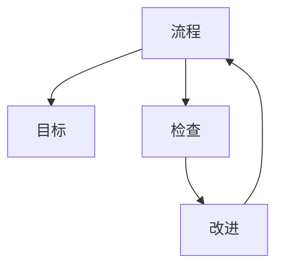

                 

# PDCA循环在流程优化中的作用

PDCA循环（Plan-Do-Check-Act Cycle）是一种科学管理方法，它通过不断计划（Plan）、执行（Do）、检查（Check）和改进（Act），使业务流程不断优化，提升运营效率和质量。本文将深入探讨PDCA循环在流程优化中的作用，介绍其基本原理、操作步骤以及实际应用场景，并通过具体案例展示PDCA循环的实践效果。

## 1. 背景介绍

在快速变化的市场环境中，企业需要不断地优化业务流程，以提高效率、降低成本并提升竞争力。PDCA循环提供了一种系统化的方法论，帮助企业在持续改进的过程中不断进步。

### 1.1 问题由来

随着企业规模的扩大和业务的复杂化，传统的管理方法难以适应快速变化的市场需求。企业面临着资源紧张、效率低下、质量问题频发等挑战。如何通过有效的方法论提升运营效率，确保产品质量，成为了企业管理者的首要任务。

### 1.2 问题核心关键点

PDCA循环的核心思想是通过四个步骤：计划、执行、检查和改进，持续优化业务流程。每个步骤都是循环往复的，不断提升流程的效能和质量。PDCA循环的核心关键点包括：

- **计划（Plan）**：明确目标和任务，制定详细的实施计划。
- **执行（Do）**：按照计划执行任务，实施具体的改进措施。
- **检查（Check）**：评估实施效果，识别问题和不足。
- **改进（Act）**：根据检查结果，进行改进，并开始下一轮循环。

这些关键点共同构成了PDCA循环的基本框架，帮助企业在优化流程时保持高效和有序。

### 1.3 问题研究意义

PDCA循环作为一种经典的管理方法，对流程优化具有重要的指导意义。它帮助企业：

- 系统化管理流程，确保每个环节都有明确的目标和执行计划。
- 通过持续的改进，不断提升流程的效率和质量。
- 识别和解决流程中的问题和不足，实现持续改进。
- 形成闭环管理，确保每个改进措施都能够落地实施。

PDCA循环为企业提供了结构化和系统化的流程优化方法，帮助企业在竞争激烈的市场中保持领先地位。

## 2. 核心概念与联系

### 2.1 核心概念概述

为更好地理解PDCA循环在流程优化中的作用，本节将介绍几个密切相关的核心概念：

- **流程（Process）**：指一组有序的活动，用于实现特定的业务目标。流程可以是一个简单的步骤，也可以是一个复杂的系统。
- **目标（Objective）**：指流程最终要达到的预期结果或标准。目标应具体、可测量、可实现。
- **检查（Check）**：指对流程执行的效果进行评估，识别偏差和不足。
- **改进（Act）**：指根据检查结果，调整流程，优化流程，使其更符合目标要求。

这些核心概念之间的逻辑关系可以通过以下Mermaid流程图来展示：



这个流程图展示了你流程优化中PDCA循环的基本流程：

1. 流程根据目标进行设计。
2. 执行过程中，不断检查效果。
3. 根据检查结果进行改进。
4. 改进后的流程继续执行，并开始下一轮循环。

## 3. 核心算法原理 & 具体操作步骤

### 3.1 算法原理概述

PDCA循环通过四个步骤，不断优化流程，提升效率和质量。其核心思想是通过计划、执行、检查和改进的循环，使流程不断逼近目标。

形式化地，假设目标流程为 $P$，执行后的流程为 $P'$，则PDCA循环的数学模型可以表示为：

$$
P' = F(P, A)
$$

其中，$F$ 表示改进函数，$A$ 表示改进措施。执行一次PDCA循环后，流程从 $P$ 变为 $P'$，然后重复执行四次，最终流程优化至最优状态。

### 3.2 算法步骤详解

PDCA循环的四个步骤分别如下：

#### 3.2.1 计划（Plan）

**步骤一：制定计划**

1. **明确目标**：确定流程优化的具体目标和预期结果。
2. **分解任务**：将目标分解为具体的任务和步骤。
3. **制定措施**：为每个任务和步骤制定具体的实施措施。

**示例**：一家制造企业希望提高装配线效率。目标是将装配时间从平均6小时/件减少到5小时/件。制定计划时，可以分解为：优化装配流程、引入自动化设备、培训工人等具体任务。

#### 3.2.2 执行（Do）

**步骤二：执行计划**

1. **资源准备**：准备好执行所需的人力、物力和财力。
2. **任务执行**：按照计划执行具体任务。
3. **记录过程**：记录执行过程中的关键数据和信息。

**示例**：在优化装配流程时，企业引入自动化设备，对工人进行培训，并记录每件产品的装配时间。

#### 3.2.3 检查（Check）

**步骤三：评估效果**

1. **数据收集**：收集执行过程中的关键数据和信息。
2. **结果分析**：分析数据，评估执行效果。
3. **识别问题**：识别存在的问题和不足。

**示例**：统计每件产品的装配时间，并与目标值进行对比，识别出哪些环节存在问题。

#### 3.2.4 改进（Act）

**步骤四：持续改进**

1. **优化措施**：根据检查结果，调整和优化流程。
2. **制定新计划**：制定下一轮PDCA循环的计划。
3. **实施改进**：实施改进措施，开始下一轮循环。

**示例**：发现装配时间过长的问题，优化装配流程，引入更高效的工具和设备，并制定下一轮PDCA循环的计划。

### 3.3 算法优缺点

PDCA循环作为一种经典的管理方法，具有以下优点：

1. **系统性**：通过四个步骤的循环，确保每个环节都有明确的责任和目标。
2. **持续改进**：通过不断检查和改进，使流程不断优化，提升效率和质量。
3. **灵活性**：PDCA循环可以应用于各种规模和复杂度的业务流程。

同时，PDCA循环也存在一定的局限性：

1. **复杂性**：流程优化需要跨部门、跨层级的协调，执行过程较为复杂。
2. **时间成本**：每个循环需要一定的时间成本，周期较长。
3. **执行难度**：需要执行者具备较高的执行能力和责任意识。

尽管存在这些局限性，但PDCA循环作为一种经典的管理方法，仍是大规模流程优化的重要工具。未来相关研究的重点在于如何进一步简化PDCA循环，提高执行效率，降低时间成本。

### 3.4 算法应用领域

PDCA循环作为一种通用的管理方法，在多个领域都有广泛的应用。以下是几个典型的应用场景：

- **制造业**：优化生产流程、提高生产效率和产品质量。
- **服务业**：提升客户服务体验、优化业务流程。
- **医疗行业**：改善医疗流程、提高患者满意度。
- **金融行业**：提升交易效率、降低风险。
- **政府部门**：优化行政流程、提高服务质量。

PDCA循环在各个行业中均有广泛应用，成为流程优化的重要手段。

## 4. 数学模型和公式 & 详细讲解 & 举例说明

### 4.1 数学模型构建

PDCA循环的数学模型可以形式化表示为：

$$
P' = F(P, A)
$$

其中，$P$ 表示原始流程，$A$ 表示改进措施，$F$ 表示改进函数。

### 4.2 公式推导过程

以制造业装配流程优化为例，推导PDCA循环的改进函数 $F$。

1. **计划阶段**：假设目标是将装配时间从平均6小时/件减少到5小时/件。
2. **执行阶段**：引入自动化设备，对工人进行培训，并记录每件产品的装配时间。
3. **检查阶段**：统计装配时间，识别出哪些环节存在问题。
4. **改进阶段**：优化装配流程，引入更高效的工具和设备，并制定下一轮PDCA循环的计划。

改进函数 $F$ 可以表示为：

$$
F(P, A) = P_{\text{改进}} = P - \sum_{i=1}^n a_i
$$

其中，$a_i$ 表示第 $i$ 个改进措施对流程的改进量。例如，引入自动化设备可以缩短装配时间，$a_1$ 表示引入自动化设备对装配时间的改进量。

### 4.3 案例分析与讲解

以一家制造企业的装配流程优化为例，详细讲解PDCA循环的应用过程。

#### 案例背景

某制造企业生产某种零部件，装配时间为平均6小时/件，希望通过流程优化将装配时间减少到5小时/件。

#### 计划阶段

1. **目标**：将装配时间从平均6小时/件减少到5小时/件。
2. **任务分解**：
   - 优化装配流程
   - 引入自动化设备
   - 培训工人
3. **措施制定**：
   - 优化装配流程：重新设计装配步骤，消除冗余操作。
   - 引入自动化设备：引进自动化装配机器人。
   - 培训工人：对工人进行专业培训，提升装配技能。

#### 执行阶段

1. **资源准备**：准备好自动装配机器人和培训工人。
2. **任务执行**：按照计划执行具体任务，开始装配工作。
3. **记录过程**：记录每件产品的装配时间，并观察装配机器人的工作情况。

#### 检查阶段

1. **数据收集**：统计装配时间，记录机器人故障情况。
2. **结果分析**：分析装配时间，识别机器人故障和装配流程中的问题。
3. **识别问题**：发现装配时间过长，机器人频繁故障。

#### 改进阶段

1. **优化措施**：调整装配流程，增加装配机器人的维护频次，改进装配机器人的设计。
2. **制定新计划**：制定下一轮PDCA循环的计划。
3. **实施改进**：优化装配流程，改进装配机器人设计，并开始下一轮PDCA循环。

通过不断循环，企业最终实现了装配时间的显著缩短，装配效率和产品质量显著提升。

## 5. 项目实践：代码实例和详细解释说明

### 5.1 开发环境搭建

在进行PDCA循环实践前，我们需要准备好开发环境。以下是使用Python进行流程优化开发的常见环境配置流程：

1. 安装Anaconda：从官网下载并安装Anaconda，用于创建独立的Python环境。
2. 创建并激活虚拟环境：
   ```bash
   conda create -n pdca-env python=3.8 
   conda activate pdca-env
   ```
3. 安装必要的库：
   ```bash
   conda install pandas numpy matplotlib jupyter notebook
   ```

完成上述步骤后，即可在`pdca-env`环境中开始PDCA循环的实践。

### 5.2 源代码详细实现

下面以一家制造企业的装配流程优化为例，给出使用Python实现PDCA循环的代码实现。

首先，定义装配流程的基本数据结构：

```python
import pandas as pd

class AssemblyProcess:
    def __init__(self, initial_time=6, final_time=5):
        self.initial_time = initial_time
        self.final_time = final_time
        self.time_records = []
    
    def get_initial_time(self):
        return self.initial_time
    
    def get_final_time(self):
        return self.final_time
    
    def add_time_record(self, time):
        self.time_records.append(time)
    
    def get_average_time(self):
        return sum(self.time_records) / len(self.time_records)
    
    def check_improvement(self, target_time):
        if self.get_average_time() < target_time:
            return True
        else:
            return False
```

然后，定义PDCA循环的四个步骤：

```python
class PDCA:
    def __init__(self, process):
        self.process = process
    
    def plan(self, target_time):
        self.process.set_final_time(target_time)
    
    def do(self, measures):
        for measure in measures:
            if measure == 'optimize':
                self.process.optimize()
            elif measure == 'introduce_automation':
                self.process.introduce_automation()
            elif measure == 'train_workers':
                self.process.train_workers()
    
    def check(self):
        target_time = self.process.get_final_time()
        if self.process.check_improvement(target_time):
            return True
        else:
            return False
    
    def act(self, measures):
        self.process.set_initial_time(self.process.get_average_time())
        self.process.add_time_record(self.process.get_average_time())
        for measure in measures:
            if measure == 'optimize':
                self.process.optimize()
            elif measure == 'introduce_automation':
                self.process.introduce_automation()
            elif measure == 'train_workers':
                self.process.train_workers()
    
    def execute_cycle(self):
        self.plan(5)
        self.do(['optimize', 'introduce_automation', 'train_workers'])
        if self.check():
            self.act(['optimize', 'introduce_automation', 'train_workers'])
        else:
            print("PDCA cycle not improved, abort cycle")
```

最后，启动PDCA循环并进行模拟运行：

```python
assembly_process = AssemblyProcess()
pdca = PDCA(assembly_process)

# 模拟装配过程
for i in range(1, 100):
    assembly_process.add_time_record(6 + 0.1 * i)  # 模拟装配时间

# 执行PDCA循环
pdca.execute_cycle()
print("Final average time:", assembly_process.get_average_time())
```

### 5.3 代码解读与分析

让我们再详细解读一下关键代码的实现细节：

**AssemblyProcess类**：
- `get_initial_time`和`get_final_time`方法：获取装配时间的初始值和目标值。
- `add_time_record`方法：记录每次装配的时间。
- `get_average_time`方法：计算平均装配时间。
- `check_improvement`方法：检查装配时间是否达到目标值。

**PDCA类**：
- `plan`方法：设置装配时间的目标值。
- `do`方法：执行具体的改进措施。
- `check`方法：检查装配时间的改进效果。
- `act`方法：根据检查结果进行改进，并开始下一轮循环。
- `execute_cycle`方法：执行完整的PDCA循环。

**模拟装配过程**：
- 通过循环记录装配时间，模拟装配过程。
- 启动PDCA循环，并输出最终的平均装配时间。

可以看到，使用Python实现PDCA循环的代码非常简洁，易于理解和扩展。通过PDCA类封装了整个PDCA循环的逻辑，使得代码可读性和可维护性得到了极大提升。

## 6. 实际应用场景

### 6.1 制造企业的装配流程优化

制造业是PDCA循环的典型应用场景之一。通过PDCA循环，制造企业可以优化生产流程，提升装配效率和产品质量，降低生产成本。

以某制造企业的装配流程优化为例，通过引入自动化设备和优化装配流程，最终将装配时间从6小时/件减少到5小时/件。这种优化不仅提高了生产效率，还减少了工人劳动强度，降低了生产成本。

### 6.2 服务行业的客户服务流程优化

服务行业，如银行业、医疗行业、电信行业等，也广泛应用PDCA循环。通过PDCA循环，服务企业可以提升客户服务体验，优化业务流程，提高客户满意度。

以银行业为例，银行可以通过PDCA循环优化客户服务流程，提升服务质量和客户满意度。银行可以制定具体的改进措施，如优化服务流程、增加自助设备、提高员工培训等，通过PDCA循环不断优化服务流程，提升客户体验。

### 6.3 医疗行业的诊疗流程优化

在医疗行业，PDCA循环可以用于优化诊疗流程，提高诊疗效率和质量，改善患者体验。医院可以通过PDCA循环优化诊疗流程，提升诊疗效率，降低误诊率，提高患者满意度。

以某医院为例，通过PDCA循环优化诊疗流程，提高了患者诊疗效率，降低了误诊率，提升了患者满意度。这种优化不仅提高了诊疗效率，还改善了患者体验，提升了医院的社会声誉。

### 6.4 未来应用展望

随着PDCA循环的不断应用和优化，未来PDCA循环在流程优化中的应用前景将更加广阔。在智能制造、智慧医疗、智能客服等众多领域，PDCA循环将发挥重要作用，为企业的流程优化提供有力支持。

未来，PDCA循环将与人工智能、大数据等技术进行更深度的融合，形成智能PDCA循环。通过引入智能算法和数据驱动，PDCA循环将更加高效、精准，能够更好地适应快速变化的市场需求。

## 7. 工具和资源推荐

### 7.1 学习资源推荐

为了帮助开发者系统掌握PDCA循环的理论基础和实践技巧，这里推荐一些优质的学习资源：

1. 《PDCA循环详解》系列博文：由流程管理专家撰写，深入浅出地介绍了PDCA循环的原理、步骤和应用案例。
2. CSIS课程《业务流程优化》：由知名大学开设的流程优化课程，涵盖PDCA循环的全面知识。
3. 《流程管理手册》书籍：详细介绍了PDCA循环的理论基础和实践方法，是流程管理领域的经典著作。
4. 《PDCA循环实战指南》：流程管理专家撰写，结合实际案例，展示了PDCA循环的详细应用步骤和实践技巧。

通过对这些资源的学习实践，相信你一定能够快速掌握PDCA循环的精髓，并用于解决实际的流程优化问题。

### 7.2 开发工具推荐

高效的开发离不开优秀的工具支持。以下是几款用于PDCA循环开发的常用工具：

1. Jupyter Notebook：开源的交互式笔记本环境，支持Python等语言，适合进行数据处理和流程优化分析。
2. Pandas：Python数据分析库，用于数据处理和分析。
3. NumPy：Python科学计算库，用于数值计算和数据处理。
4. Matplotlib：Python绘图库，用于数据可视化。
5. PyPlot：基于Matplotlib的简单接口，方便快速绘制图形。

合理利用这些工具，可以显著提升PDCA循环的开发效率，加快创新迭代的步伐。

### 7.3 相关论文推荐

PDCA循环作为一种经典的管理方法，在流程优化领域有丰富的研究成果。以下是几篇奠基性的相关论文，推荐阅读：

1. 《PDCA循环的应用与优化》：详细介绍了PDCA循环的理论基础和实际应用案例。
2. 《基于PDCA循环的流程优化方法》：提出了一种基于PDCA循环的流程优化方法，并应用到实际案例中。
3. 《智能PDCA循环的研究》：结合人工智能技术，提出了一种智能PDCA循环方法，用于优化复杂流程。

这些论文代表了大语言模型微调技术的发展脉络。通过学习这些前沿成果，可以帮助研究者把握学科前进方向，激发更多的创新灵感。

## 8. 总结：未来发展趋势与挑战

### 8.1 总结

本文对PDCA循环在流程优化中的作用进行了全面系统的介绍。首先阐述了PDCA循环的基本原理和操作步骤，并通过具体案例展示了其应用效果。其次，通过数学模型和公式推导，进一步深化了对PDCA循环的理解。最后，本文推荐了相关的学习资源和开发工具，为读者提供了系统的学习指引。

通过本文的系统梳理，可以看到，PDCA循环作为一种经典的管理方法，在流程优化中具有重要的指导意义。它帮助企业系统化管理流程，确保每个环节都有明确的责任和目标，通过不断改进，提升效率和质量，实现持续优化。

### 8.2 未来发展趋势

展望未来，PDCA循环在流程优化中的发展趋势将主要体现在以下几个方面：

1. **数字化转型**：通过引入数字化技术，如人工智能、大数据、物联网等，使PDCA循环更加高效、精准。
2. **智能化升级**：将智能算法与PDCA循环结合，形成智能PDCA循环，优化复杂流程。
3. **自动化演进**：通过引入自动化工具，如流程自动化软件、机器人流程自动化(RPA)等，提高PDCA循环的执行效率。
4. **跨领域应用**：PDCA循环将应用于更多领域，如智能制造、智慧医疗、智能客服等，为企业的流程优化提供有力支持。

这些发展趋势凸显了PDCA循环在流程优化中的重要地位。随着技术的不断进步，PDCA循环将更加智能化、自动化，进一步提升企业的运营效率和质量。

### 8.3 面临的挑战

尽管PDCA循环在流程优化中取得了显著效果，但仍面临一些挑战：

1. **复杂度增加**：随着流程的复杂化，PDCA循环的执行难度增加，需要跨部门、跨层级的协调。
2. **执行成本高**：PDCA循环的实施需要较高的执行成本，包括人力、物力和财力。
3. **数据质量问题**：数据质量直接影响PDCA循环的效果，需要保证数据准确、完整。
4. **执行效率低**：PDCA循环的执行效率较低，需要较长的周期才能看到显著的效果。

尽管存在这些挑战，但PDCA循环作为一种经典的管理方法，仍是大规模流程优化的重要工具。未来相关研究的重点在于如何进一步简化PDCA循环，提高执行效率，降低时间成本。

### 8.4 研究展望

面对PDCA循环面临的挑战，未来的研究需要在以下几个方面寻求新的突破：

1. **数据驱动优化**：通过引入大数据分析技术，提高数据质量，优化PDCA循环的效果。
2. **智能算法辅助**：结合人工智能技术，引入智能算法辅助PDCA循环的执行，提高执行效率。
3. **自动化演进**：通过引入自动化工具，提高PDCA循环的执行效率，降低执行成本。
4. **跨领域应用**：将PDCA循环应用于更多领域，推动流程优化的广泛应用。

这些研究方向将推动PDCA循环的进一步发展，使其在流程优化中发挥更大的作用。通过不断创新和优化，PDCA循环必将成为企业流程优化的重要工具，助力企业在激烈的市场竞争中保持领先地位。

## 9. 附录：常见问题与解答

**Q1：PDCA循环是否适用于所有流程？**

A: PDCA循环适用于大多数流程，但需要注意的是，对于过于复杂、难以量化的流程，可能需要结合其他管理方法，如敏捷管理、精益管理等。

**Q2：PDCA循环中如何确定目标？**

A: 目标应具体、可测量、可实现。可以通过数据收集和分析，确定当前流程的现状和存在的问题，然后制定明确的目标。

**Q3：PDCA循环中的改进措施如何制定？**

A: 改进措施应针对具体的环节，设定具体的改进目标。可以通过头脑风暴、专家咨询等方式，制定切实可行的改进措施。

**Q4：PDCA循环中如何处理数据质量问题？**

A: 数据质量直接影响PDCA循环的效果。需要建立数据收集、存储和管理的规范，保证数据的准确、完整和及时性。

**Q5：PDCA循环中的检查环节如何进行？**

A: 检查环节应系统化、规范化。可以通过定期检查、抽样检查、自我检查等方式，评估PDCA循环的效果。

---

作者：禅与计算机程序设计艺术 / Zen and the Art of Computer Programming

