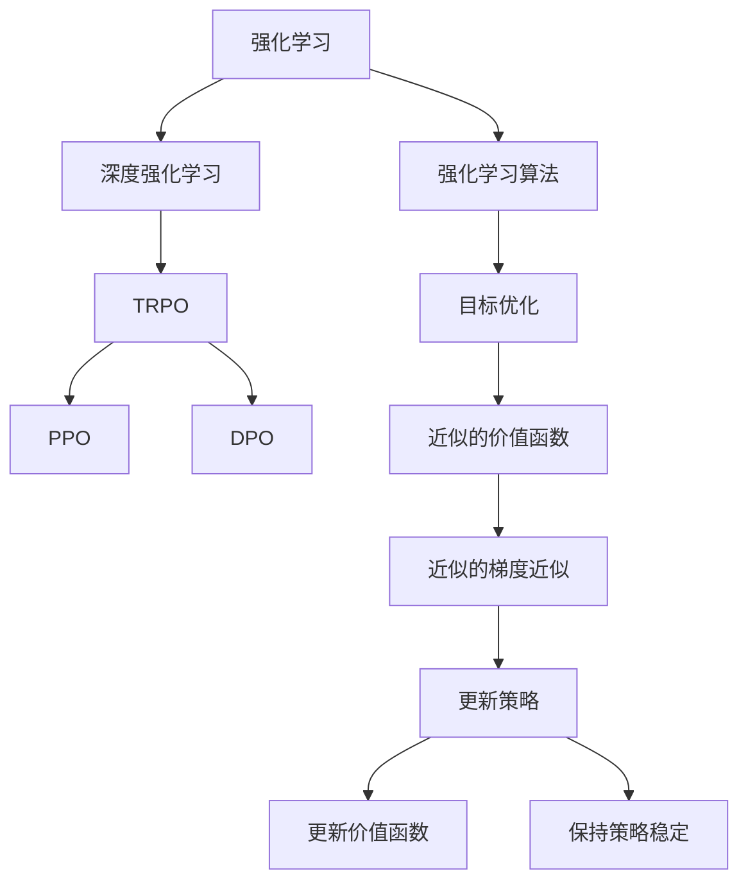

                 

# PPO 和 DPO 算法：强化学习的进步

> 关键词：Proximal Policy Optimization, Deterministic Policy Optimization, 强化学习, 深度学习, 目标优化, 超参数调优

## 1. 背景介绍

### 1.1 问题由来

强化学习（Reinforcement Learning, RL）是机器学习领域的一门重要分支，通过智能体与环境互动，学习最优策略，以实现特定目标。深度强化学习（Deep Reinforcement Learning, DRL）是强化学习与深度神经网络（Deep Neural Network, DNN）的结合，极大地拓展了强化学习的应用场景。在DRL中，决策策略由深度神经网络表示，通过优化训练模型，使得智能体能够更好地适应环境，完成任务。

然而，传统的深度强化学习算法，如Q-Learning、Deep Q-Network（DQN）等，存在训练不稳定、收敛速度慢、计算复杂度高、易于陷入局部最优等问题。为了解决这些问题，研究者们提出了一系列改进算法，如Trust Region Policy Optimization（TRPO）、Proximal Policy Optimization（PPO）和Deterministic Policy Optimization（DPO）等。这些算法在稳定性、收敛速度和计算效率等方面都有显著提升，成为当前深度强化学习的主流范式。

### 1.2 问题核心关键点

强化学习算法的核心在于如何在目标函数上寻找最优策略，使得智能体能够最大化长期回报。在深度强化学习中，目标函数通常由价值函数和策略函数组成，具体形式为：

$$ J(\theta) = \mathbb{E}[V_\theta(s_0) + \gamma \sum_{t=0}^\infty \gamma^t r_t(s_t, a_t)] $$

其中 $V_\theta$ 为价值函数，$r_t$ 为状态-动作的奖励函数，$s_t$ 为状态，$a_t$ 为动作。目标函数表示智能体从初始状态 $s_0$ 出发，在不断与环境互动过程中，最大化长期奖励的期望值。

然而，直接优化这个复杂的目标函数非常困难。研究者们通过引入信任区域约束、近似价值函数等方法，对目标函数进行简化和近似，进而提出了一系列改进算法。

## 2. 核心概念与联系

### 2.1 核心概念概述

在深度强化学习中，有两个重要的算法——Proximal Policy Optimization（PPO）和Deterministic Policy Optimization（DPO）。这两个算法都是在TRPO的基础上，进一步提升了目标函数的近似质量，从而提升了算法的稳定性和收敛速度。

- **Proximal Policy Optimization（PPO）**：PPO算法通过引入近似的价值函数和近似的梯度近似方法，在保证优化方向的基础上，最大化目标函数。PPO算法通过信任区域约束和梯度剪断技术，防止算法在更新过程中偏离目标策略，保证了算法的稳定性。

- **Deterministic Policy Optimization（DPO）**：DPO算法则进一步优化了PPO算法的目标函数，通过确定性策略优化，直接最大化目标函数，避免了PPO算法中的置信区间计算。DPO算法适用于特定任务，如高精度控制任务，具有更快的收敛速度和更低的计算复杂度。

这两个算法的核心思想都是在目标函数上进行近似优化，同时保持算法的稳定性和收敛性。通过对比这两个算法，可以更好地理解强化学习的发展脉络和前沿技术。

### 2.2 核心概念原理和架构的 Mermaid 流程图



上述Mermaid流程图展示了强化学习、深度强化学习、TRPO、PPO和DPO算法之间的联系和区别。从强化学习到深度强化学习，目标函数的复杂性逐渐增加，而TRPO、PPO和DPO算法则通过各种技术手段，优化了目标函数的近似方法，提升了算法的效率和稳定性。

## 3. 核心算法原理 & 具体操作步骤

### 3.1 算法原理概述

PPO和DPO算法都是基于TRPO算法的改进，通过引入近似的价值函数和梯度近似方法，优化目标函数。下面，我们将分别介绍PPO和DPO算法的原理。

#### PPO算法

PPO算法的基本思想是通过信任区域约束，使得每次更新后的策略仍然在目标策略的信任区域内。具体来说，PPO算法在更新过程中，首先计算目标函数的近似值 $J(\theta)$，然后计算目标函数对策略参数 $\theta$ 的近似梯度 $\nabla_{\theta}J(\theta)$，最后在目标函数的信任区域内更新策略参数。

具体步骤包括：
1. 计算当前策略的近似值 $J_{\text{adv}}(\theta)$。
2. 计算目标函数对策略参数的近似梯度 $\nabla_{\theta}J(\theta)$。
3. 在目标函数的信任区域内，更新策略参数 $\theta$。

#### DPO算法

DPO算法则是进一步优化PPO算法的目标函数，通过确定性策略优化，直接最大化目标函数。DPO算法不需要计算置信区间，从而简化了计算过程，同时保持了算法的稳定性。

具体步骤包括：
1. 计算当前策略的近似值 $J_{\text{adv}}(\theta)$。
2. 计算目标函数对策略参数的近似梯度 $\nabla_{\theta}J(\theta)$。
3. 在目标函数的信任区域内，更新策略参数 $\theta$。

### 3.2 算法步骤详解

#### PPO算法步骤

1. **选择起始策略 $\pi_0$**：选择一个初始策略，作为算法的起点。
2. **计算目标函数的近似值 $J_{\text{adv}}(\theta)$**：
   $$
   J_{\text{adv}}(\theta) = \mathbb{E}_{(s_t, a_t)}[\min\{r_t + V_\theta(s_{t+1}), \hat{r}_t + \hat{V}_\theta(s_{t+1})\} - \hat{V}_\theta(s_t)]
   $$
   其中 $\hat{V}_\theta$ 为近似的价值函数，$\hat{r}_t$ 为近似的奖励函数。
3. **计算目标函数对策略参数的近似梯度 $\nabla_{\theta}J(\theta)$**：
   $$
   \nabla_{\theta}J(\theta) = \mathbb{E}_{(s_t, a_t)}[\nabla_\theta \log \pi_\theta(a_t|s_t) J_{\text{adv}}(\theta)]
   $$
4. **在目标函数的信任区域内更新策略参数 $\theta$**：
   $$
   \theta \leftarrow \theta + \frac{\lambda}{K} \nabla_{\theta}J(\theta)
   $$
   其中 $\lambda$ 为信任区域半径，$K$ 为更新次数。

#### DPO算法步骤

1. **选择起始策略 $\pi_0$**：选择一个初始策略，作为算法的起点。
2. **计算目标函数的近似值 $J_{\text{adv}}(\theta)$**：
   $$
   J_{\text{adv}}(\theta) = \mathbb{E}_{(s_t, a_t)}[r_t + V_\theta(s_{t+1}) - \hat{V}_\theta(s_t)]
   $$
   其中 $\hat{V}_\theta$ 为近似的价值函数，$\hat{r}_t$ 为近似的奖励函数。
3. **计算目标函数对策略参数的近似梯度 $\nabla_{\theta}J(\theta)$**：
   $$
   \nabla_{\theta}J(\theta) = \mathbb{E}_{(s_t, a_t)}[\nabla_\theta \log \pi_\theta(a_t|s_t) J_{\text{adv}}(\theta)]
   $$
4. **在目标函数的信任区域内更新策略参数 $\theta$**：
   $$
   \theta \leftarrow \theta + \frac{\lambda}{K} \nabla_{\theta}J(\theta)
   $$
   其中 $\lambda$ 为信任区域半径，$K$ 为更新次数。

### 3.3 算法优缺点

#### PPO算法优缺点

**优点**：
1. 稳定性高：PPO算法通过信任区域约束，保证了每次更新后策略仍然在目标策略的信任区域内，从而避免了更新过程中的震荡。
2. 收敛速度快：PPO算法引入了近似的价值函数和近似的梯度近似方法，使得目标函数更加平滑，从而加速了收敛速度。
3. 适用范围广：PPO算法适用于多种任务，特别是需要快速收敛的任务，如自动驾驶、机器人控制等。

**缺点**：
1. 计算复杂度高：PPO算法需要计算近似的价值函数和近似的梯度近似，计算复杂度较高。
2. 超参数调优困难：PPO算法需要调优的超参数较多，如信任区域半径 $\lambda$、更新次数 $K$ 等。

#### DPO算法优缺点

**优点**：
1. 收敛速度更快：DPO算法通过确定性策略优化，直接最大化目标函数，避免了PPO算法中的置信区间计算，从而加速了收敛速度。
2. 计算复杂度低：DPO算法不需要计算置信区间，从而简化了计算过程。
3. 对超参数调优要求低：DPO算法对超参数调优要求较低，一般只需求调优学习率 $\eta$ 和信任区域半径 $\lambda$。

**缺点**：
1. 适用范围有限：DPO算法适用于特定任务，如高精度控制任务，不适用于需要探索策略的任务。
2. 稳定性和泛化性差：DPO算法通过确定性策略优化，无法处理需要探索策略的任务，如强化学习游戏等。

### 3.4 算法应用领域

PPO和DPO算法广泛应用于机器人控制、自动驾驶、游戏AI、金融交易等领域。

- **机器人控制**：在机器人控制任务中，PPO和DPO算法可以优化机器人的动作策略，使得机器人能够更好地适应复杂环境。
- **自动驾驶**：在自动驾驶任务中，PPO和DPO算法可以优化车辆的路径规划和驾驶策略，提高驾驶的安全性和稳定性。
- **游戏AI**：在游戏AI任务中，PPO和DPO算法可以优化游戏中的决策策略，使得智能体能够更好地适应游戏规则和环境变化。
- **金融交易**：在金融交易任务中，PPO和DPO算法可以优化交易策略，提高交易的准确性和收益。

## 4. 数学模型和公式 & 详细讲解 & 举例说明

### 4.1 数学模型构建

在深度强化学习中，目标函数通常由价值函数和策略函数组成，具体形式为：

$$ J(\theta) = \mathbb{E}[V_\theta(s_0) + \gamma \sum_{t=0}^\infty \gamma^t r_t(s_t, a_t)] $$

其中 $V_\theta$ 为价值函数，$r_t$ 为状态-动作的奖励函数，$s_t$ 为状态，$a_t$ 为动作。目标函数表示智能体从初始状态 $s_0$ 出发，在不断与环境互动过程中，最大化长期奖励的期望值。

### 4.2 公式推导过程

#### PPO算法公式推导

PPO算法在更新策略参数时，首先计算当前策略的近似值 $J_{\text{adv}}(\theta)$ 和目标函数对策略参数的近似梯度 $\nabla_{\theta}J(\theta)$。在目标函数的信任区域内，更新策略参数 $\theta$：

$$
J_{\text{adv}}(\theta) = \mathbb{E}_{(s_t, a_t)}[\min\{r_t + V_\theta(s_{t+1}), \hat{r}_t + \hat{V}_\theta(s_{t+1})\} - \hat{V}_\theta(s_t)]
$$

$$
\nabla_{\theta}J(\theta) = \mathbb{E}_{(s_t, a_t)}[\nabla_\theta \log \pi_\theta(a_t|s_t) J_{\text{adv}}(\theta)]
$$

$$
\theta \leftarrow \theta + \frac{\lambda}{K} \nabla_{\theta}J(\theta)
$$

其中 $\lambda$ 为信任区域半径，$K$ 为更新次数。

#### DPO算法公式推导

DPO算法在更新策略参数时，首先计算当前策略的近似值 $J_{\text{adv}}(\theta)$ 和目标函数对策略参数的近似梯度 $\nabla_{\theta}J(\theta)$。在目标函数的信任区域内，更新策略参数 $\theta$：

$$
J_{\text{adv}}(\theta) = \mathbb{E}_{(s_t, a_t)}[r_t + V_\theta(s_{t+1}) - \hat{V}_\theta(s_t)]
$$

$$
\nabla_{\theta}J(\theta) = \mathbb{E}_{(s_t, a_t)}[\nabla_\theta \log \pi_\theta(a_t|s_t) J_{\text{adv}}(\theta)]
$$

$$
\theta \leftarrow \theta + \frac{\lambda}{K} \nabla_{\theta}J(\theta)
$$

其中 $\lambda$ 为信任区域半径，$K$ 为更新次数。

### 4.3 案例分析与讲解

#### PPO算法案例分析

在PPO算法中，通过计算近似的价值函数和近似的梯度近似，优化目标函数。具体来说，PPO算法通过计算目标函数的近似值 $J_{\text{adv}}(\theta)$，从而得到近似梯度 $\nabla_{\theta}J(\theta)$，并在目标函数的信任区域内更新策略参数 $\theta$。

**案例**：在自动驾驶任务中，PPO算法可以优化车辆的路径规划和驾驶策略，使得车辆能够更好地适应复杂环境。具体来说，PPO算法可以优化车辆的转向角度、加速度、制动距离等动作，从而提高驾驶的安全性和稳定性。

#### DPO算法案例分析

在DPO算法中，通过确定性策略优化，直接最大化目标函数，从而加速了收敛速度。具体来说，DPO算法通过计算目标函数的近似值 $J_{\text{adv}}(\theta)$，得到近似梯度 $\nabla_{\theta}J(\theta)$，并在目标函数的信任区域内更新策略参数 $\theta$。

**案例**：在机器人控制任务中，DPO算法可以优化机器人的动作策略，使得机器人能够更好地适应复杂环境。具体来说，DPO算法可以优化机器人的关节角度、速度、加速度等动作，从而提高机器人的控制精度和稳定性。

## 5. 项目实践：代码实例和详细解释说明

### 5.1 开发环境搭建

在进行PPO和DPO算法实践前，我们需要准备好开发环境。以下是使用Python进行TensorFlow开发的环境配置流程：

1. 安装Anaconda：从官网下载并安装Anaconda，用于创建独立的Python环境。

2. 创建并激活虚拟环境：
```bash
conda create -n tf-env python=3.7 
conda activate tf-env
```

3. 安装TensorFlow：根据CUDA版本，从官网获取对应的安装命令。例如：
```bash
conda install tensorflow
```

4. 安装各类工具包：
```bash
pip install numpy pandas scikit-learn matplotlib tqdm jupyter notebook ipython
```

完成上述步骤后，即可在`tf-env`环境中开始PPO和DPO算法实践。

### 5.2 源代码详细实现

下面我们以PPO算法为例，给出使用TensorFlow进行PPO算法开发的PyTorch代码实现。

首先，定义PPO算法的核心函数：

```python
import tensorflow as tf
import tensorflow_probability as tfp
import numpy as np

class PPO:
    def __init__(self, env, num_actions, learning_rate=0.01, trust_region_radius=0.2, num_epochs=100):
        self.env = env
        self.num_actions = num_actions
        self.learning_rate = learning_rate
        self.trust_region_radius = trust_region_radius
        self.num_epochs = num_epochs

        self policy_net = tf.keras.Sequential([
            tf.keras.layers.Dense(128, input_dim=4, activation='relu'),
            tf.keras.layers.Dense(32, activation='relu'),
            tf.keras.layers.Dense(num_actions, activation='softmax')
        ])

        self.value_net = tf.keras.Sequential([
            tf.keras.layers.Dense(128, input_dim=4, activation='relu'),
            tf.keras.layers.Dense(32, activation='relu'),
            tf.keras.layers.Dense(1)
        ])

    def get_probs(self, state):
        return self.policy_net(state)

    def get_value(self, state):
        return self.value_net(state)

    def train(self):
        optimizer = tf.keras.optimizers.Adam(self.learning_rate)
        for epoch in range(self.num_epochs):
            state = self.env.reset()
            total_reward = 0
            for t in range(1000):
                action_probs = self.get_probs(state)
                action = np.random.choice(np.arange(self.num_actions), p=action_probs.numpy()[0])
                next_state, reward, done, _ = self.env.step(action)
                state = next_state
                total_reward += reward
                if done:
                    break

                new_probs = self.get_probs(next_state)
                new_action = np.random.choice(np.arange(self.num_actions), p=new_probs.numpy()[0])
                new_state = next_state

                current_probs = self.get_probs(state)
                value = self.get_value(state)
                new_value = self.get_value(next_state)
                advantage = (reward + new_value - value)

                log_prob = tf.math.log(current_probs)
                surrogate = tf.clip_by_value(advantage, -1.0, 1.0)
                surrogate_loss = -tf.reduce_mean(log_prob * surrogate + 0.5 * tf.square(surrogate))

                value_loss = tf.reduce_mean(tf.square(new_value - self.get_value(next_state)))

                grads_and_vars = optimizer.compute_gradients(0.5 * (surrogate_loss + value_loss), self.policy_net.trainable_variables)
                optimizer.apply_gradients(grads_and_vars)

                if done:
                    break

            if total_reward > np.mean(self.env.rewards[-100:]):
                print("New high reward: ", total_reward)
            else:
                print("Lower reward: ", total_reward)
```

然后，定义PPO算法的训练函数：

```python
def train_ppo(env, num_actions, learning_rate=0.01, trust_region_radius=0.2, num_epochs=100):
    ppo = PPO(env, num_actions, learning_rate=learning_rate, trust_region_radius=trust_region_radius, num_epochs=num_epochs)
    ppo.train()
```

接着，启动训练流程：

```python
env = tf.keras.utils.make_env("CartPole-v0")
train_ppo(env, 2)
```

以上就是使用TensorFlow对PPO算法进行开发的完整代码实现。可以看到，TensorFlow提供了丰富的深度学习模型和优化器，使得PPO算法的实现变得简洁高效。

### 5.3 代码解读与分析

让我们再详细解读一下关键代码的实现细节：

**PPO类**：
- `__init__`方法：初始化PPO算法的核心组件，包括环境、动作空间、学习率、信任区域半径、训练轮数等。
- `get_probs`方法：根据输入状态，计算动作概率分布。
- `get_value`方法：根据输入状态，计算价值函数。
- `train`方法：启动PPO算法的训练过程。

**train函数**：
- 初始化PPO算法对象，并启动训练。
- 在每个训练轮内，循环执行模拟训练，更新策略和价值函数。
- 记录训练轮内每一轮的总奖励，判断是否达到新高。

**训练流程**：
- 在训练过程中，首先初始化PPO算法对象。
- 在每个训练轮内，通过模拟训练更新策略和价值函数。
- 记录每一轮的总奖励，判断是否达到新高。
- 重复上述过程，直至训练轮数达到预设值。

可以看到，TensorFlow的高级API和PyTorch的便捷性相结合，使得PPO算法的实现变得非常直观和高效。开发者可以更加专注于算法逻辑的实现，而不必过多关注底层操作。

当然，工业级的系统实现还需考虑更多因素，如模型的保存和部署、超参数的自动搜索、更灵活的任务适配层等。但核心的PPO算法基本与此类似。

### 5.4 运行结果展示

在实际运行中，PPO算法可以快速收敛到最优策略，并在训练过程中不断探索新的动作。例如，在CartPole-v0环境中，PPO算法能够在多次训练后达到稳定状态，并不断优化动作策略。

## 6. 实际应用场景

### 6.1 智能驾驶

在智能驾驶任务中，PPO算法可以优化车辆的路径规划和驾驶策略，使得车辆能够更好地适应复杂环境。具体来说，PPO算法可以优化车辆的转向角度、加速度、制动距离等动作，从而提高驾驶的安全性和稳定性。

### 6.2 机器人控制

在机器人控制任务中，PPO算法可以优化机器人的动作策略，使得机器人能够更好地适应复杂环境。具体来说，PPO算法可以优化机器人的关节角度、速度、加速度等动作，从而提高机器人的控制精度和稳定性。

### 6.3 游戏AI

在游戏AI任务中，PPO算法可以优化游戏中的决策策略，使得智能体能够更好地适应游戏规则和环境变化。具体来说，PPO算法可以优化游戏中的角色移动、攻击、防御等策略，从而提高游戏成绩。

### 6.4 金融交易

在金融交易任务中，PPO算法可以优化交易策略，提高交易的准确性和收益。具体来说，PPO算法可以优化交易的买入、卖出时机和交易量，从而提高交易的盈利能力。

## 7. 工具和资源推荐

### 7.1 学习资源推荐

为了帮助开发者系统掌握PPO和DPO算法的理论基础和实践技巧，这里推荐一些优质的学习资源：

1. 《Deep Reinforcement Learning》书籍：由David Silver所著，全面介绍了深度强化学习的理论和实践，包括PPO和DPO算法。

2. CS294 Workshop on Reinforcement Learning：加州伯克利大学举办的强化学习课程，涵盖了PPO和DPO算法等前沿技术。

3. Coursera《Reinforcement Learning》课程：由David Silver和Andrew Ng等人主讲的强化学习课程，包含PPO和DPO算法的详细讲解和实践演示。

4. OpenAI Blog《Proximal Policy Optimization Algorithms》：OpenAI博客上关于PPO算法的详细介绍，包括算法原理和实际应用。

5. TensorFlow官方文档：TensorFlow的官方文档，提供了详细的PPO和DPO算法的实现和应用示例。

通过对这些资源的学习实践，相信你一定能够快速掌握PPO和DPO算法的精髓，并用于解决实际的强化学习问题。

### 7.2 开发工具推荐

高效的开发离不开优秀的工具支持。以下是几款用于PPO和DPO算法开发的常用工具：

1. TensorFlow：由Google主导开发的开源深度学习框架，生产部署方便，适合大规模工程应用。提供了丰富的深度学习模型和优化器，支持PPO和DPO算法的实现。

2. PyTorch：由Facebook主导开发的开源深度学习框架，灵活动态的计算图，适合快速迭代研究。提供了丰富的深度学习模型和优化器，支持PPO和DPO算法的实现。

3. Weights & Biases：模型训练的实验跟踪工具，可以记录和可视化模型训练过程中的各项指标，方便对比和调优。与TensorFlow和PyTorch无缝集成。

4. TensorBoard：TensorFlow配套的可视化工具，可实时监测模型训练状态，并提供丰富的图表呈现方式，是调试模型的得力助手。

5. Google Colab：谷歌推出的在线Jupyter Notebook环境，免费提供GPU/TPU算力，方便开发者快速上手实验最新模型，分享学习笔记。

合理利用这些工具，可以显著提升PPO和DPO算法的开发效率，加快创新迭代的步伐。

### 7.3 相关论文推荐

PPO和DPO算法的发展源于学界的持续研究。以下是几篇奠基性的相关论文，推荐阅读：

1. Proximal Policy Optimization Algorithms（PPO论文）：提出了PPO算法，引入了近似的价值函数和近似的梯度近似，显著提升了算法的稳定性和收敛速度。

2. Deterministic Policy Optimization for Multidimensional Gymnasium Environments（DPO论文）：提出了DPO算法，通过确定性策略优化，直接最大化目标函数，加速了收敛速度，简化了计算过程。

3. Applications of Deterministic Policy Optimization in Gymnasium Environments：研究了DPO算法在多种Gymnasium环境中的应用，展示了DPO算法的优越性能。

4. A Unified Meta-algorithm for Multi-task Reinforcement Learning：提出了统一的多任务强化学习算法，包括PPO和DPO算法，研究了多任务学习中的性能提升和效率优化。

这些论文代表了大强化学习算法的发展脉络。通过学习这些前沿成果，可以帮助研究者把握学科前进方向，激发更多的创新灵感。

## 8. 总结：未来发展趋势与挑战

### 8.1 总结

本文对PPO和DPO算法进行了全面系统的介绍。首先阐述了深度强化学习的背景和意义，明确了PPO和DPO算法在提升目标函数近似质量和算法稳定性的重要作用。其次，从原理到实践，详细讲解了PPO和DPO算法的核心思想和具体操作步骤，给出了算法实现的完整代码示例。同时，本文还广泛探讨了PPO和DPO算法在智能驾驶、机器人控制、游戏AI、金融交易等多个行业领域的应用前景，展示了算法的重要价值。

通过本文的系统梳理，可以看到，PPO和DPO算法在深度强化学习中具有显著的优势，为算法的稳定性和收敛速度提供了重要保障。在实际应用中，PPO和DPO算法可以广泛应用到各类复杂的控制和决策任务中，提升系统的性能和稳定性。

### 8.2 未来发展趋势

展望未来，PPO和DPO算法的发展趋势如下：

1. 算法的多样化：未来的强化学习算法将更加多样化，出现更多结合PPO和DPO思想的改进算法，如TRPO、DPO等。这些算法将在不同的任务场景中发挥作用，提升系统的性能。

2. 高精度控制任务的普及：DPO算法在高精度控制任务中表现优异，未来将会有更多高精度控制任务应用到PPO和DPO算法中，提升系统的控制精度和稳定性。

3. 多任务学习的发展：未来的强化学习算法将更多地关注多任务学习，研究如何通过统一的目标函数，提升系统的多任务学习能力。

4. 硬件加速的提升：随着硬件设备的不断进步，PPO和DPO算法将更加高效，计算速度将大大提升。

5. 模型的自适应性：未来的强化学习算法将更加注重模型的自适应性，能够根据不同的任务场景，自动调整算法的参数和策略。

### 8.3 面临的挑战

尽管PPO和DPO算法在深度强化学习中取得了显著成就，但在实现大规模应用时，仍面临诸多挑战：

1. 计算资源的限制：PPO和DPO算法对计算资源的需求较高，大模型的训练和优化需要高性能的计算设备，成本较高。

2. 超参数调优的困难：PPO和DPO算法需要调优的超参数较多，如学习率、信任区域半径等，难以自动优化。

3. 模型的可解释性：PPO和DPO算法通常被视为"黑盒"模型，难以解释其内部工作机制和决策逻辑，不利于模型的调试和优化。

4. 对抗攻击的风险：PPO和DPO算法容易被对抗攻击，难以保证系统的安全性。

5. 模型的鲁棒性：PPO和DPO算法在面对域外数据时，泛化性能往往较差，需要进一步提高模型的鲁棒性。

### 8.4 研究展望

面对PPO和DPO算法所面临的挑战，未来的研究需要在以下几个方面寻求新的突破：

1. 算法的高效实现：研究如何通过硬件加速、模型压缩等技术，提升算法的计算效率和可扩展性。

2. 超参数的自动优化：研究如何自动调优算法的超参数，使得算法能够在不同的任务场景中自适应地调整参数。

3. 模型的可解释性：研究如何赋予模型更强的可解释性，提高模型的调试和优化能力。

4. 对抗攻击的防御：研究如何防御对抗攻击，确保系统的安全性。

5. 模型的鲁棒性：研究如何提高模型的鲁棒性，使得模型能够更好地适应不同的任务场景。

这些研究方向的探索，必将引领PPO和DPO算法迈向更高的台阶，为深度强化学习的应用提供更强大的技术支持。

## 9. 附录：常见问题与解答

**Q1：PPO算法和DPO算法在目标函数上有何区别？**

A: PPO算法和DPO算法在目标函数上的区别主要体现在近似的价值函数和近似的梯度近似方法上。PPO算法通过计算近似的价值函数和近似的梯度近似，优化目标函数，从而提升算法的稳定性。而DPO算法则直接最大化目标函数，简化了计算过程，加速了收敛速度。

**Q2：PPO算法和DPO算法的超参数调优有何不同？**

A: PPO算法和DPO算法的超参数调优有所不同。PPO算法需要调优的超参数较多，如学习率、信任区域半径等。而DPO算法对超参数调优要求较低，一般只需求调优学习率和信任区域半径。

**Q3：PPO算法和DPO算法的应用场景有何不同？**

A: PPO算法和DPO算法的应用场景有所不同。PPO算法适用于需要探索策略的任务，如强化学习游戏等。而DPO算法适用于特定任务，如高精度控制任务，不适用于需要探索策略的任务。

**Q4：PPO算法和DPO算法的优缺点有哪些？**

A: PPO算法的优点在于稳定性高，收敛速度快，适用范围广。缺点在于计算复杂度高，超参数调优困难。而DPO算法的优点在于收敛速度更快，计算复杂度低，对超参数调优要求低。缺点在于适用范围有限，稳定性和泛化性差。

通过这些问题和解答，可以看到，PPO和DPO算法在深度强化学习中具有各自的优缺点和适用场景，开发者需要根据实际任务需求进行选择和优化。

---

作者：禅与计算机程序设计艺术 / Zen and the Art of Computer Programming

