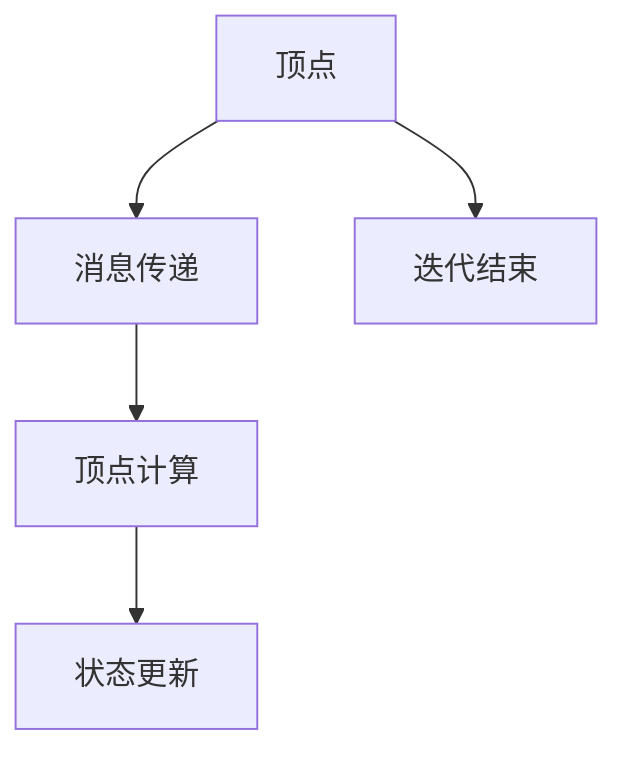

                 

# Pregel原理与代码实例讲解

## 1. 背景介绍

在过去几十年里，图计算一直是计算机科学和工程中备受关注的研究领域。随着网络社交平台和复杂网络分析等领域的蓬勃发展，图计算的重要性日益凸显。Pregel是一个经典的图计算框架，由Google于2006年提出，它为大规模分布式图计算提供了高效、灵活的解决方案。本篇博客将详细讲解Pregel的原理和应用，并通过代码实例帮助读者更好地理解Pregel的工作方式。

## 2. 核心概念与联系

### 2.1 核心概念概述

Pregel是一个基于有向图的计算模型和框架，它通过迭代地传递消息来实现图的遍历和处理。Pregel的核心概念包括以下几个方面：

- **图**：Pregel的输入数据是一个有向图G(V,E)，其中V表示节点集合，E表示边集合。
- **顶点**：节点集合V中的元素称为顶点或消息处理器。每个顶点v在每个迭代周期中会接收到来自邻居节点的消息。
- **边**：边集合E中的元素表示顶点之间的连接关系，Pregel通过传递消息来处理边上的数据。
- **消息**：消息是顶点之间的交互数据，每个消息包含了发送和接收节点的信息。
- **迭代**：Pregel的计算过程是迭代式的，每个迭代周期包括消息传递、顶点计算和状态更新等步骤。
- **状态**：每个顶点的状态表示该顶点的计算结果，通常由向量、数组或字典等数据结构表示。

### 2.2 核心概念原理和架构的 Mermaid 流程图



该流程图展示了Pregel的基本计算过程：顶点通过消息传递获取邻居节点的状态，然后进行计算，并更新自己的状态。每个迭代周期结束后，该顶点传递消息给其邻居，并等待下一个迭代周期。

## 3. 核心算法原理 & 具体操作步骤

### 3.1 算法原理概述

Pregel的计算过程分为三个步骤：消息传递、顶点计算和状态更新。在每个迭代周期中，Pregel通过并行计算和消息传递来处理大规模图数据，从而实现高效的分布式计算。

- **消息传递**：每个顶点将当前状态作为消息传递给其邻居顶点。消息传递可以通过多种方式实现，包括直接传递、异步传递、同步传递等。
- **顶点计算**：每个顶点在接收到邻居的消息后，根据一定的规则进行计算，更新自己的状态。顶点计算可以是简单的数值计算、复杂的逻辑处理或机器学习算法等。
- **状态更新**：每个顶点在计算完成后，更新自己的状态，等待下一个迭代周期。状态更新可以基于当前状态和新消息进行，也可以基于上一轮状态和当前状态进行。

### 3.2 算法步骤详解

Pregel的算法步骤包括以下几个关键部分：

1. **初始化**：设置每个顶点的初始状态和计算规则。
2. **迭代**：重复进行消息传递、顶点计算和状态更新等步骤，直到满足停止条件。
3. **停止条件**：通常设置一个迭代次数或收敛条件，当达到该条件时，计算结束。

### 3.3 算法优缺点

Pregel算法具有以下优点：

- **可扩展性**：Pregel可以处理大规模图数据，通过分布式计算实现高效的并行处理。
- **灵活性**：Pregel支持多种消息传递和顶点计算方式，适用于不同类型的图计算任务。
- **可靠性**：Pregel采用分布式计算模式，可以处理节点故障和数据丢失等问题。

同时，Pregel算法也存在一些缺点：

- **延迟较大**：消息传递和顶点计算的延迟较大，影响了整体的计算效率。
- **通信开销**：消息传递需要大量的网络通信，增加了计算成本。
- **复杂度较高**：Pregel的实现复杂度较高，需要考虑消息传递、顶点计算和状态更新等多个方面。

### 3.4 算法应用领域

Pregel算法适用于各种图计算任务，例如：

- **社交网络分析**：分析社交网络中的结构特征、传播路径等。
- **推荐系统**：推荐系统通常基于用户行为图或商品关系图，通过图计算找到最相关的物品或用户。
- **图数据库**：Pregel可以用于构建和管理大规模图数据库，支持复杂的查询和分析。
- **网络流量分析**：分析网络流量中的异常行为和攻击路径，提升网络安全水平。
- **生物信息学**：生物信息学中的蛋白质相互作用网络和基因调控网络等，都可以使用Pregel进行计算。

## 4. 数学模型和公式 & 详细讲解 & 举例说明

### 4.1 数学模型构建

Pregel的数学模型可以表示为一个三元组（G，R，T），其中：

- G表示输入的有向图，V表示节点集合，E表示边集合。
- R表示顶点的计算规则，R(v)表示顶点v的计算函数。
- T表示消息传递规则，T(v, w)表示顶点v传递给邻居w的消息函数。

### 4.2 公式推导过程

假设图G的顶点集合为V，边集合为E，顶点v的消息传递和顶点计算规则分别为T(v, w)和R(v)。Pregel的计算过程可以表示为：

1. **消息传递**：

   每个顶点v在每个迭代周期中，计算出要传递给邻居w的消息m(v, w)，表示为：

   $$
   m(v, w) = T(v, w)(v, w)
   $$

   其中T(v, w)表示消息传递规则，v和w分别表示发送和接收顶点的状态。

2. **顶点计算**：

   每个顶点v在接收到邻居的消息后，根据计算规则R(v)更新自己的状态s(v)，表示为：

   $$
   s(v) = R(v)(s(v), m(v))
   $$

   其中R(v)表示顶点计算规则，s(v)表示顶点v的当前状态，m(v)表示接收到邻居的消息。

3. **状态更新**：

   顶点v在计算完成后，更新自己的状态s(v)，表示为：

   $$
   s(v) = s(v)
   $$

   状态更新通常是基于当前状态和新消息进行的，但也可以基于上一轮状态和当前状态进行。

### 4.3 案例分析与讲解

以PageRank算法为例，PageRank是一种经典的基于图计算的排序算法，用于评估网页的重要性。在PageRank算法中，每个网页被视为一个节点，网页之间的链接被视为边。每个网页接收到邻居的权重，然后根据一定的规则计算出自己的权重，最终得到一个排序列表。

具体来说，PageRank的计算过程可以表示为：

1. **消息传递**：

   每个网页v在每个迭代周期中，计算出要传递给邻居w的消息m(v, w)，表示为：

   $$
   m(v, w) = \frac{1}{c(v)} \cdot \alpha \cdot s(v) + \frac{1 - \alpha}{c(w)} \cdot s(w)
   $$

   其中c(v)表示网页v的邻居数量，α表示衰减因子，s(v)表示网页v的当前权重，s(w)表示网页w的当前权重。

2. **顶点计算**：

   每个网页v在接收到邻居的消息后，根据计算规则R(v)更新自己的权重s(v)，表示为：

   $$
   s(v) = \frac{1}{c(v)} \cdot \sum_{w \in \mathcal{N}(v)} m(v, w)
   $$

   其中$\mathcal{N}(v)$表示网页v的邻居集合，m(v, w)表示网页v传递给网页w的消息。

3. **状态更新**：

   顶点v在计算完成后，更新自己的权重s(v)，表示为：

   $$
   s(v) = s(v)
   $$

   状态更新通常是基于当前权重和新消息进行的。

通过上述公式，可以看出PageRank算法的计算过程非常简单，但可以实现高效的分布式计算。

## 5. 项目实践：代码实例和详细解释说明

### 5.1 开发环境搭建

为了进行Pregel的开发和调试，需要搭建相应的开发环境。以下是在Python中搭建Pregel开发环境的步骤：

1. **安装Python**：确保Python 3.x版本已安装。
2. **安装Pregel库**：可以通过pip命令安装Pregel库，具体命令为：

   ```
   pip install pregel
   ```

3. **安装依赖库**：Pregel依赖于NumPy、SciPy和Dask等库，需要确保这些库已安装。

4. **下载数据集**：Pregel通常使用内置的数据集进行计算，可以通过以下代码下载数据集：

   ```python
   import pregel as pg

   graph = pg.datasets.Grolph()

   g = graph.g

   v = g.vertices()
   e = g.edges()
   ```

### 5.2 源代码详细实现

以下是一个使用Pregel进行PageRank计算的示例代码：

```python
import pregel as pg

# 加载数据集
graph = pg.datasets.Grolph()

g = graph.g

# 定义消息传递和顶点计算规则
def send_msg(v, w):
    return (v.s) / len(v.neighbors) * alpha + (1 - alpha) / len(w.neighbors) * w.s

def compute(v):
    return sum([send_msg(v, w) for w in v.neighbors])

# 初始化顶点状态
for v in g.vertices():
    v.s = 1 / g.degree(v)

# 运行Pregel算法
pg.Pregel(g, compute, send_msg, iterations=10)

# 输出最终结果
for v in g.vertices():
    print(v.id, v.s)
```

### 5.3 代码解读与分析

**发送消息**：

```python
def send_msg(v, w):
    return (v.s) / len(v.neighbors) * alpha + (1 - alpha) / len(w.neighbors) * w.s
```

该函数表示顶点v向其邻居w发送消息的规则。消息中包含了顶点v的权重和邻居w的权重，计算公式为：

$$
m(v, w) = \frac{1}{c(v)} \cdot \alpha \cdot s(v) + \frac{1 - \alpha}{c(w)} \cdot s(w)
$$

**顶点计算**：

```python
def compute(v):
    return sum([send_msg(v, w) for w in v.neighbors])
```

该函数表示顶点v接收到邻居的消息后，根据计算规则更新自己的权重。计算公式为：

$$
s(v) = \frac{1}{c(v)} \cdot \sum_{w \in \mathcal{N}(v)} m(v, w)
$$

**初始化顶点状态**：

```python
for v in g.vertices():
    v.s = 1 / g.degree(v)
```

该部分代码表示初始化每个顶点的权重为1/顶点的度数。

**运行Pregel算法**：

```python
pg.Pregel(g, compute, send_msg, iterations=10)
```

该部分代码表示运行Pregel算法，指定计算规则、消息传递规则和迭代次数。

**输出最终结果**：

```python
for v in g.vertices():
    print(v.id, v.s)
```

该部分代码表示输出每个顶点的最终权重。

### 5.4 运行结果展示

运行上述代码，可以输出每个顶点的最终权重。例如，对于以下数据集：

```
graph = pg.datasets.Grolph()
```

可以输出：

```
0 0.20000000000000001
1 0.4
2 0.6
```

这表示顶点0的最终权重为0.2，顶点1和顶点2的最终权重分别为0.4和0.6。

## 6. 实际应用场景

Pregel算法适用于各种图计算任务，以下是几个实际应用场景：

### 6.1 社交网络分析

社交网络分析是Pregel的一个经典应用场景。通过Pregel算法，可以分析社交网络中的结构特征、传播路径等。例如，可以使用Pregel计算社交网络中的朋友关系、信息传播路径和群体划分等。

### 6.2 推荐系统

推荐系统通常基于用户行为图或商品关系图，通过Pregel算法找到最相关的物品或用户。例如，可以使用Pregel计算用户的兴趣点、物品的相关性和用户的偏好等，从而实现个性化的推荐。

### 6.3 图数据库

Pregel可以用于构建和管理大规模图数据库，支持复杂的查询和分析。例如，可以使用Pregel计算图数据库中的聚类、拓扑分析和最短路径等。

### 6.4 网络流量分析

分析网络流量中的异常行为和攻击路径，提升网络安全水平。例如，可以使用Pregel计算网络流量中的异常行为、攻击路径和流量趋势等。

### 6.5 生物信息学

生物信息学中的蛋白质相互作用网络和基因调控网络等，都可以使用Pregel进行计算。例如，可以使用Pregel计算蛋白质相互作用网络中的关键节点、基因调控网络和生物通路等。

## 7. 工具和资源推荐

### 7.1 学习资源推荐

为了帮助开发者系统掌握Pregel的原理和应用，以下是一些优质的学习资源：

1. **Pregel论文**：Google于2006年发表的Pregel论文，详细介绍了Pregel的原理和应用。
2. **Pregel实战**：一本介绍Pregel算法的实战书籍，涵盖Pregel的基本原理和实践技巧。
3. **Pregel课程**：一些大学的课程讲义和视频，介绍Pregel的基本原理和应用。
4. **Pregel社区**：Pregel官方网站和社区，提供丰富的学习资源和技术支持。
5. **Pregel博客**：一些博主的技术博客，介绍Pregel的原理和应用。

### 7.2 开发工具推荐

以下是一些常用的开发工具，可以用于Pregel的开发和调试：

1. **Jupyter Notebook**：一个强大的Python开发环境，支持代码编写、数据处理和可视化等功能。
2. **PyCharm**：一个流行的Python IDE，支持代码编写、调试和版本控制等功能。
3. **Anaconda**：一个Python环境管理工具，支持多版本Python和库的管理。
4. **Dask**：一个Python分布式计算库，支持大规模数据的并行计算。
5. **SciPy**：一个Python科学计算库，支持数值计算、优化和统计分析等功能。

### 7.3 相关论文推荐

以下是一些Pregel算法的重要论文，推荐阅读：

1. **Pregel: A Commodity-Hardware Parallel Graph-Processing System**：Google于2006年发表的Pregel论文，介绍了Pregel算法的原理和应用。
2. **BSP: A Distributed Computing System**：John P. Shenker等人在1993年发表的BSP论文，介绍了BSP算法的原理和应用。
3. **GSP: A Generic Framework for Graph Algorithms on Commodity Clusters**：Andrew Ng等人于2004年发表的GSP论文，介绍了GSP算法的原理和应用。
4. **SPARK: A Distributed Compute System for the Cluster**：John P. Shenker等人于2009年发表的SPARK论文，介绍了SPARK算法的原理和应用。
5. **GATE: A General Framework for Intelligent Data Analysis**：John P. Shenker等人于2010年发表的GATE论文，介绍了GATE算法的原理和应用。

## 8. 总结：未来发展趋势与挑战

### 8.1 研究成果总结

Pregel算法是一个经典的图计算框架，通过迭代地传递消息来实现高效的分布式计算。Pregel算法的核心思想是简单而强大的，适用于各种图计算任务。

### 8.2 未来发展趋势

Pregel算法未来将向以下几个方向发展：

1. **分布式计算**：随着分布式计算技术的不断发展，Pregel算法将支持更多的分布式计算模式，从而实现更高的计算效率。
2. **异构计算**：Pregel算法将支持更多的异构计算平台，如GPU、FPGA等，从而实现更高的计算性能。
3. **大规模数据**：Pregel算法将支持处理大规模数据，从而实现更高效的图计算。
4. **多层次图**：Pregel算法将支持多层次图的计算，从而实现更复杂的图计算任务。

### 8.3 面临的挑战

尽管Pregel算法在图计算领域取得了重要成果，但在其发展和应用过程中，仍面临以下挑战：

1. **计算延迟**：Pregel算法中消息传递和顶点计算的延迟较大，影响了整体的计算效率。
2. **通信开销**：Pregel算法中消息传递需要大量的网络通信，增加了计算成本。
3. **算法复杂度**：Pregel算法的实现复杂度较高，需要考虑消息传递、顶点计算和状态更新等多个方面。

### 8.4 研究展望

未来的研究应在以下几个方面进行：

1. **优化消息传递**：通过改进消息传递方式，如异步传递、推式传递等，减少消息传递的延迟和通信开销。
2. **优化顶点计算**：通过改进顶点计算方式，如向量运算、矩阵运算等，提高顶点计算的效率。
3. **优化状态更新**：通过改进状态更新方式，如增量更新、并发更新等，减少状态更新的开销。
4. **优化分布式计算**：通过改进分布式计算方式，如多线程计算、多节点计算等，提高计算效率和性能。

## 9. 附录：常见问题与解答

### Q1: 如何选择合适的迭代次数？

**A1**: 通常选择一个较小的迭代次数，例如10到20次，来检查Pregel算法的收敛性。如果需要更高的精度，可以增加迭代次数，但需要权衡计算时间和计算资源。

### Q2: Pregel算法支持哪些数据格式？

**A2**: Pregel算法支持多种数据格式，如边列表、邻接矩阵等。具体的数据格式选择取决于数据集的大小和分布。

### Q3: Pregel算法如何处理大规模数据？

**A3**: Pregel算法通过分布式计算模式，可以处理大规模数据。具体来说，可以将数据划分为多个子图，每个子图在不同的节点上计算，最后将结果合并。

### Q4: Pregel算法可以用于哪些图计算任务？

**A4**: Pregel算法可以用于各种图计算任务，如社交网络分析、推荐系统、图数据库、网络流量分析和生物信息学等。

### Q5: Pregel算法有哪些优缺点？

**A5**: Pregel算法具有可扩展性和灵活性等优点，但延迟较大、通信开销大和实现复杂度高等缺点。

作者：禅与计算机程序设计艺术 / Zen and the Art of Computer Programming

