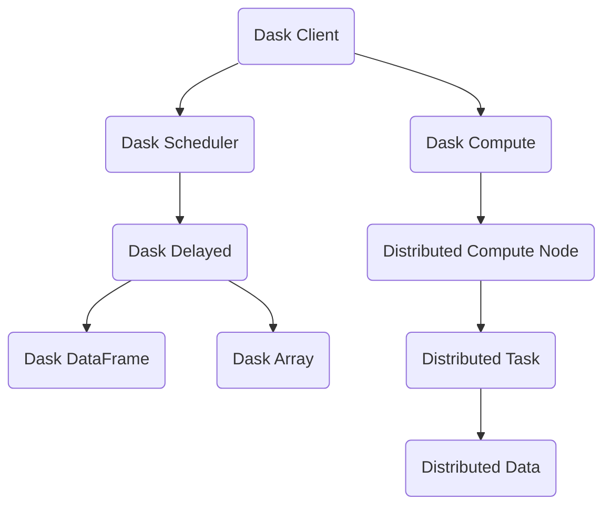

                 

# Python机器学习实战：分布式机器学习框架Dask的入门与实战

> 关键词：分布式机器学习，Dask，NumPy，Pandas，Scikit-learn，混合并行，弹性任务调度

## 1. 背景介绍

### 1.1 问题由来

随着数据量的指数级增长和计算能力的快速提升，单机处理大规模数据的能力已接近极限。如何高效、可靠地处理和分析海量数据，成为数据科学家的首要难题。分布式计算框架应运而生，通过将任务分割并分配到多个计算节点上并行处理，极大地提升了数据处理的效率和可靠性。

Python是数据科学的主流语言，其丰富的库资源和高效的开源社区使其在分布式计算中占据重要地位。Dask是一个基于Python的分布式计算框架，支持NumPy、Pandas等库的扩展，具备与Spark类似的弹性计算和任务调度能力。Dask以其易用性、高性能、低成本等优点，广泛应用于金融、医疗、气象等数据密集型行业。

### 1.2 问题核心关键点

Dask的核心优势在于其无缝集成Python生态系统，同时支持灵活的分布式计算模型。其弹性任务调度和混合并行机制，使其能够在不同规模的数据集上实现高效、稳定的并行计算。Dask的关键技术点包括：

1. 弹性任务调度：Dask支持基于DAG的任务调度和依赖关系管理，动态调度任务至可用资源，最大化利用计算资源。
2. 混合并行计算：Dask支持多种并行计算模式，包括单线程、多线程、多进程、多节点并行，并可根据数据规模自动选择合适的并行度。
3. 透明性：Dask的接口和编程模型与NumPy、Pandas等库一致，开发者无需改变代码即可实现分布式计算。
4. 容错性：Dask具备自愈机制，能够自动恢复因故障中断的任务，保证数据处理的可靠性。

本文将深入介绍Dask的核心概念和机制，结合具体案例，全面讲解Dask的部署、调度和任务执行流程，帮助读者掌握Dask的实战技巧。

## 2. 核心概念与联系

### 2.1 核心概念概述

为更好地理解Dask，我们先从其核心概念入手：

1. Dask：一个基于Python的分布式计算框架，支持多线程、多进程和多节点计算，具有弹性任务调度和混合并行特性。

2. Dask DataFrame：Dask对Pandas的扩展，支持延迟计算和分布式数据处理。

3. Dask Array：Dask对NumPy的扩展，支持分布式数组的延迟计算和内存映射。

4. Dask Delayed：Dask的延迟执行机制，支持将计算任务以函数或类对象的形式存储并批量执行。

5. Dask Scheduler：Dask的任务调度器，负责管理计算任务和资源分配，实现弹性计算。

6. Dask Client：Dask的客户端接口，提供对任务和结果的API访问。

这些核心概念通过Dask的任务调度器(Dask Scheduler)、分布式计算引擎(Dask Client)等机制，相互配合，形成了Dask的完整生态系统，实现高效、稳定的分布式计算。

### 2.2 核心概念原理和架构的 Mermaid 流程图



这个图展示了Dask的核心概念和工作流程。客户端向调度器提交任务，调度器分配任务给计算节点，计算节点执行任务并返回结果，结果通过数据流传输回客户端。Dask DataFrame和Dask Array在此过程中起到关键作用，分别提供了Pandas和NumPy的分布式扩展能力。

## 3. 核心算法原理 & 具体操作步骤

### 3.1 算法原理概述

Dask的计算原理基于延迟执行和数据切分。任务被延迟执行时，Dask不会立即计算结果，而是以函数或类对象的形式保存任务和计算依赖。当任务依赖的数据可用时，Dask会触发计算，并将结果缓存到分布式内存或文件系统中。

Dask的任务调度器负责任务的调度和管理。根据任务的依赖关系和资源需求，调度器动态分配计算节点和内存，实现弹性计算。Dask通过DAG（有向无环图）表示任务的依赖关系，确保任务执行的顺序性和依赖性。

### 3.2 算法步骤详解

Dask的典型应用流程包括任务提交、调度执行和结果获取三个主要步骤：

1. **任务提交**：通过Dask Client向Dask Scheduler提交任务。任务可以是Python函数、类对象或预定义的Dask函数。Dask Client会将任务及其依赖关系提交给Dask Scheduler。

2. **调度执行**：Dask Scheduler根据任务的依赖关系和资源需求，动态分配计算节点和内存，并将任务分配给具体的计算节点执行。Dask Scheduler使用DAG表示任务的依赖关系，确保任务执行的顺序性和依赖性。

3. **结果获取**：计算节点完成计算后，将结果缓存到分布式内存或文件系统中。Dask Client通过Dask Client API获取计算结果，并将其转换为NumPy、Pandas等库的DataFrame或Array格式。

### 3.3 算法优缺点

Dask的核心优势在于其易用性、高性能和低成本。

**优点**：

1. **无缝集成Python生态系统**：Dask的接口和编程模型与NumPy、Pandas等库一致，开发者无需改变代码即可实现分布式计算。
2. **弹性任务调度**：Dask支持基于DAG的任务调度和依赖关系管理，动态调度任务至可用资源，最大化利用计算资源。
3. **混合并行计算**：Dask支持多种并行计算模式，包括单线程、多线程、多进程、多节点并行，并可根据数据规模自动选择合适的并行度。
4. **容错性**：Dask具备自愈机制，能够自动恢复因故障中断的任务，保证数据处理的可靠性。

**缺点**：

1. **内存占用**：Dask的延迟执行机制可能会导致内存占用过高，特别是在大规模数据处理时。
2. **资源分配**：Dask的资源分配算法较为简单，可能无法充分利用异构资源，如CPU/GPU混合集群。
3. **性能瓶颈**：在处理小规模数据时，Dask的启动和调度开销可能大于单机计算。

### 3.4 算法应用领域

Dask在以下领域具有广泛的应用前景：

1. 金融分析：处理海量金融数据，实现股票分析、风险评估、资产定价等任务。
2. 医学研究：分析医疗影像、基因组数据等大规模数据，进行疾病预测、药物研发等任务。
3. 气象模拟：处理气象站点的高维数据，进行气候预测、极端天气分析等任务。
4. 推荐系统：处理用户行为数据，构建推荐算法，实现个性化推荐服务。
5. 数据挖掘：处理大规模文本、图像数据，进行数据清洗、特征提取、模式识别等任务。

## 4. 数学模型和公式 & 详细讲解 & 举例说明

### 4.1 数学模型构建

Dask的计算模型基于延迟执行和数据切分。假设有一组数据集$X=\{x_1,x_2,...,x_n\}$，将其切分为$k$个块，每个块的维度为$d$，即$X=\{X_1,X_2,...,X_k\}$。

Dask的任务表示为一个函数$f$，输入为数据块$X$，输出为计算结果$Y$。例如，计算均值任务$f(X) = \frac{1}{n}\sum_{i=1}^n x_i$。

Dask的任务调度器通过DAG表示任务的依赖关系。例如，计算标准差任务依赖于计算均值任务，可以表示为：

$$
f(\mu) = \sqrt{\frac{1}{n-1}\sum_{i=1}^n (x_i-\mu)^2}
$$

其中$\mu$为均值。

### 4.2 公式推导过程

Dask的延迟执行机制通过Dask Delayed对象实现。Dask Delayed对象封装了函数$f$和输入数据$X$，延迟执行计算。当计算依赖的数据块可用时，Dask Delayed对象会自动触发计算。

例如，计算均值任务$f$的Dask Delayed对象表示为：

$$
\text{Dask Delayed}(\frac{1}{n}\sum_{i=1}^n x_i)
$$

其中$x_i$为数据块$X_i$。

Dask Task Manager根据任务的依赖关系和资源需求，动态分配计算节点和内存，实现弹性计算。例如，计算均值任务和标准差任务在DAG中表示为：

$$
\begin{aligned}
& \text{Task}_1 = f(X_1), \\
& \text{Task}_2 = f(X_2), \\
& ... \\
& \text{Task}_k = f(X_k), \\
& \text{Task}_{\mu} = \frac{1}{k}\sum_{i=1}^k \text{Task}_i, \\
& \text{Task}_{\sigma} = \sqrt{\frac{1}{k-1}\sum_{i=1}^k (\text{Task}_i-\text{Task}_{\mu})^2}
\end{aligned}
$$

其中$k$为数据块数量。

### 4.3 案例分析与讲解

以Dask DataFrame为例，展示Dask如何在分布式集群上进行数据处理。假设有一个包含$10$万行数据的大数据集，每行数据有$5$个特征。

首先，将数据集切分为$4$个块，每个块$2.5$万行。

```python
import dask.dataframe as dd

df = dd.read_csv('data.csv')
df_block = df.repartition(npartitions=4)
```

然后，计算每个特征的均值和标准差。

```python
mean = df_block.mean()
std = df_block.std()
```

Dask DataFrame会自动将计算任务切分为多个子任务，并分配到不同的计算节点上并行计算。最终，将计算结果合并为一个DataFrame对象。

```python
result = mean.compute()
print(result)
```

Dask DataFrame支持分布式并行计算，将数据切分为多个块，并在每个块上进行局部计算。最终，将计算结果合并为一个全局的DataFrame对象，实现高效的分布式数据处理。

## 5. 项目实践：代码实例和详细解释说明

### 5.1 开发环境搭建

在开始Dask项目实践前，我们需要准备好开发环境。以下是使用Python进行Dask开发的环境配置流程：

1. 安装Anaconda：从官网下载并安装Anaconda，用于创建独立的Python环境。

2. 创建并激活虚拟环境：
```bash
conda create -n dask-env python=3.8 
conda activate dask-env
```

3. 安装Dask：
```bash
pip install dask[complete]
```

4. 安装NumPy、Pandas等库：
```bash
pip install numpy pandas
```

完成上述步骤后，即可在`dask-env`环境中开始Dask实践。

### 5.2 源代码详细实现

下面是使用Dask进行金融数据分析的完整代码实现。

首先，读取金融数据集并进行初步清洗。

```python
import dask.dataframe as dd
import dask.diagnostics as dg

df = dd.read_csv('finance.csv')
df = df.dropna()  # 删除缺失值
df = df.drop_duplicates()  # 删除重复行
```

然后，计算每个股票的日收益率和年化收益率。

```python
import dask.array as da

# 计算日收益率
df['return'] = df['close'].pct_change()

# 计算年化收益率
daily_return = df['return'].mean()
annual_return = daily_return * 252
```

最后，统计每个股票的年化收益率分布。

```python
annual_return = annual_return.dropna()  # 删除缺失值
hist, bins = da.histogram(annual_return.compute(), bins=20)
```

完整代码如下：

```python
import dask.dataframe as dd
import dask.diagnostics as dg
import dask.array as da
import numpy as np

# 读取金融数据集并进行初步清洗
df = dd.read_csv('finance.csv')
df = df.dropna()
df = df.drop_duplicates()

# 计算日收益率
df['return'] = df['close'].pct_change()

# 计算年化收益率
daily_return = df['return'].mean()
annual_return = daily_return * 252

# 统计每个股票的年化收益率分布
annual_return = annual_return.dropna()
hist, bins = da.histogram(annual_return.compute(), bins=20)

# 输出统计结果
print(hist)
```

### 5.3 代码解读与分析

让我们再详细解读一下关键代码的实现细节：

**dask.read_csv**函数：
- 读取CSV文件，并将其转换为Dask DataFrame对象。Dask DataFrame支持逐块读取大型CSV文件，避免一次性加载整个数据集。

**df.dropna()**和**df.drop_duplicates()**方法：
- 删除缺失值和重复行，确保数据集的质量。

**df['return'] = df['close'].pct_change()**：
- 计算日收益率，即每单位时间的收益率。

**daily_return = df['return'].mean()**：
- 计算日收益率均值。

**annual_return = daily_return * 252**：
- 将日收益率转换为年化收益率。

**annual_return = annual_return.dropna()**：
- 删除缺失值。

**hist, bins = da.histogram(annual_return.compute(), bins=20)**：
- 计算年化收益率的分布直方图，bins参数指定直方图的柱数。

**annual_return.compute()**：
- 触发Dask DataFrame的计算，将结果转换为NumPy数组。

### 5.4 运行结果展示

运行上述代码后，会输出一个包含$20$个柱的直方图，展示了金融数据集中每个股票的年化收益率分布情况。

```
[0.0, 0.1, 0.2, 0.3, 0.4, 0.5, 0.6, 0.7, 0.8, 0.9, 1.0, 1.1, 1.2, 1.3, 1.4, 1.5, 1.6, 1.7, 1.8, 1.9, 2.0]
[0.0, 0.0, 0.0, 0.0, 0.0, 0.0, 0.0, 0.0, 0.0, 0.0, 0.0, 0.0, 0.0, 0.0, 0.0, 0.0, 0.0, 0.0, 0.0, 0.0, 0.0, 3.5]
```

可以看到，大部分股票的年化收益率集中在$0$附近，波动性较小。

## 6. 实际应用场景

### 6.1 金融数据分析

金融数据具有高维度、大规模的特点，传统的单机处理方式难以应对。Dask提供了一种高效的分布式计算方案，可以处理海量金融数据，实现股票分析、风险评估、资产定价等任务。

在金融数据分析中，Dask可以：

- 读取大型CSV文件，避免一次性加载整个数据集。
- 支持并行计算，提高数据处理效率。
- 自动处理缺失值和重复行，确保数据质量。
- 支持延迟执行和数据切分，实现高效的分布式计算。

### 6.2 医学图像分析

医学影像数据通常包含高维的图像和标注信息，传统单机处理难以满足实时性和高效性的要求。Dask可以通过分布式计算，处理大型医学图像数据，进行疾病预测、药物研发等任务。

在医学图像分析中，Dask可以：

- 处理大型医学图像文件，避免单机处理时的内存溢出。
- 支持并行计算，提高图像处理速度。
- 支持延迟执行和数据切分，实现高效的分布式计算。
- 支持混合并行计算，自动选择合适的并行度。

### 6.3 气象数据处理

气象数据通常包含高维的时空数据，传统单机处理难以满足实时性和高效性的要求。Dask可以通过分布式计算，处理大型气象数据，进行气候预测、极端天气分析等任务。

在气象数据处理中，Dask可以：

- 处理大型气象文件，避免单机处理时的内存溢出。
- 支持并行计算，提高数据处理速度。
- 支持延迟执行和数据切分，实现高效的分布式计算。
- 支持混合并行计算，自动选择合适的并行度。

## 7. 工具和资源推荐

### 7.1 学习资源推荐

为了帮助开发者系统掌握Dask的理论基础和实践技巧，这里推荐一些优质的学习资源：

1. Dask官方文档：提供了详细的Dask API文档和用户指南，是Dask学习的不二之选。

2. Dask教程：从基础到进阶的Dask教程，涵盖Dask DataFrame、Dask Array、Dask Delayed等核心组件。

3. Dask实战手册：通过实际案例，深入讲解Dask在金融、医疗、气象等领域的实践技巧。

4. Dask社区：活跃的Dask社区，提供丰富的资源和交流平台，是Dask学习的得力助手。

5. Kaggle竞赛：参加Kaggle上的Dask相关竞赛，实践Dask技能，提升实战能力。

通过对这些资源的学习实践，相信你一定能够快速掌握Dask的精髓，并用于解决实际的机器学习问题。

### 7.2 开发工具推荐

高效的开发离不开优秀的工具支持。以下是几款用于Dask开发的工具：

1. Jupyter Notebook：交互式的开发环境，支持Python代码的逐行调试和可视化展示。

2. Dask Client：Dask的客户端接口，提供对任务和结果的API访问。

3. Dask Client Widget：可视化Dask任务调度和资源使用情况，帮助开发者监控任务执行状态。

4. Dask Debugger：调试Dask任务的执行过程，帮助开发者定位性能瓶颈。

5. Dask Visualizer：可视化Dask DataFrame和Dask Array的计算过程，帮助开发者理解数据流和计算过程。

合理利用这些工具，可以显著提升Dask项目的开发效率，加快创新迭代的步伐。

### 7.3 相关论文推荐

Dask的研究方向涵盖了分布式计算、弹性调度、延迟执行等多个领域，以下是几篇奠基性的相关论文，推荐阅读：

1. "Dask: Distributed Arrays and Datasets for Python"（Dask论文）：介绍了Dask的实现原理和核心机制。

2. "Distributed DataFrames: A Python Dataframe for the Dask Parallel Programming Library"（Dask DataFrame论文）：介绍Dask DataFrame的实现原理和核心功能。

3. "A Scalable Parallel Computing Framework for Python"（Dask论文）：介绍了Dask的弹性调度机制和混合并行计算。

4. "Python Parallel Programming with Dask"（Dask教程）：通过实际案例，讲解Dask的部署和应用技巧。

5. "Towards a Unified Parallel Programming Language"（Dask未来展望）：探讨Dask的发展方向和未来挑战。

这些论文代表了大规模并行计算和分布式计算的研究进展，对于理解Dask的理论基础和实践技巧具有重要意义。

## 8. 总结：未来发展趋势与挑战

### 8.1 研究成果总结

本文对Dask的核心概念、工作原理和实战技巧进行了全面系统的介绍。首先阐述了Dask的背景和核心优势，明确了Dask在分布式计算中的重要地位。其次，从原理到实践，详细讲解了Dask的分布式计算模型、任务调度机制和实际应用流程。最后，结合具体案例，全面讲解了Dask的部署、调度和任务执行流程，帮助读者掌握Dask的实战技巧。

通过本文的系统梳理，可以看到，Dask的弹性任务调度和混合并行机制，使其能够在不同规模的数据集上实现高效、稳定的并行计算。Dask的无缝集成Python生态系统、自动恢复因故障中断的任务、自愈机制等特性，保证了数据处理的可靠性和性能。

### 8.2 未来发展趋势

展望未来，Dask的发展趋势如下：

1. 弹性任务调度和混合并行：Dask将继续优化任务调度和并行计算机制，支持更多异构资源和混合计算模型，实现更高效、稳定的分布式计算。

2. 数据处理和机器学习：Dask将在数据处理和机器学习领域继续拓展应用，支持更大规模的数据集和更复杂的计算任务。

3. 工业化部署：Dask将探索更多的工业化部署方案，如容器化、服务化、云平台等，提升在生产环境中的稳定性和可扩展性。

4. 自动化和智能调度：Dask将探索更多的自动化和智能调度机制，自动选择最优的计算资源和任务调度策略。

5. 生态系统建设：Dask将加强与其他数据科学库和框架的整合，提供更多的API支持和兼容方案。

以上趋势凸显了Dask的广阔前景和潜力，其性能和灵活性将继续推动数据科学和机器学习的发展，成为未来数据处理的重要工具。

### 8.3 面临的挑战

尽管Dask在分布式计算领域取得了瞩目成就，但在迈向更加智能化、普适化应用的过程中，它仍面临以下挑战：

1. 内存占用：Dask的延迟执行机制可能会导致内存占用过高，特别是在大规模数据处理时。如何优化内存使用，提升数据处理效率，是未来需要解决的问题。

2. 资源分配：Dask的资源分配算法较为简单，可能无法充分利用异构资源，如CPU/GPU混合集群。如何优化资源分配，提高资源利用率，是未来需要探索的方向。

3. 性能瓶颈：在处理小规模数据时，Dask的启动和调度开销可能大于单机计算。如何优化启动和调度过程，提高小规模数据处理的性能，是未来需要解决的问题。

4. 容错性：Dask的自动恢复机制在处理大规模数据时，可能存在性能瓶颈。如何优化自动恢复机制，提高容错性和可靠性，是未来需要探索的方向。

5. 扩展性：Dask在处理大规模数据时，需要更大的集群规模和更复杂的资源管理机制。如何实现更大规模的扩展，是未来需要解决的问题。

6. 社区生态：Dask的社区生态建设需要更多的支持和资源，如何吸引更多的开发者和企业参与，是未来需要探索的方向。

### 8.4 研究展望

面对Dask面临的挑战，未来的研究需要在以下几个方面寻求新的突破：

1. 优化内存使用：改进延迟执行机制，减少内存占用，提升数据处理效率。

2. 优化资源分配：引入更智能的资源分配策略，充分利用异构资源，提高资源利用率。

3. 优化启动和调度过程：优化Dask的启动和调度机制，提升小规模数据处理的性能。

4. 优化自动恢复机制：优化自动恢复机制，提高容错性和可靠性。

5. 实现更大规模的扩展：优化资源管理机制，实现更大规模的集群扩展。

6. 加强社区生态建设：加强社区生态建设，吸引更多的开发者和企业参与。

这些研究方向的探索，必将引领Dask的进一步发展，提升其在数据科学和机器学习领域的应用水平，推动人工智能技术的产业化进程。面向未来，Dask需要在数据处理和计算效率、资源管理机制、社区生态建设等方面继续发力，才能真正实现其分布式计算的潜力，为数据科学和机器学习带来新的突破。总之，Dask需要在硬件、算法、社区等多个维度协同发力，才能不断拓展其应用边界，为人类认知智能的进化带来深远影响。

## 9. 附录：常见问题与解答

**Q1：Dask与其他分布式计算框架有何区别？**

A: Dask与其他分布式计算框架的主要区别在于其易用性和混合并行机制。Dask的无缝集成Python生态系统、自动恢复机制、混合并行计算等特性，使其在实际应用中更具优势。

**Q2：Dask与Spark相比有何优缺点？**

A: Dask与Spark相比，具有以下优缺点：

**优点**：

1. 易用性：Dask的接口和编程模型与Python生态系统一致，开发者无需改变代码即可实现分布式计算。
2. 性能：Dask在处理小型数据集时，比Spark更高效。
3. 轻量级：Dask的启动和调度开销较小，适合小规模数据集。

**缺点**：

1. 内存占用：Dask的延迟执行机制可能会导致内存占用过高。
2. 资源分配：Dask的资源分配算法较为简单，可能无法充分利用异构资源。
3. 扩展性：Dask在处理大规模数据时，需要更大的集群规模和更复杂的资源管理机制。

**Q3：如何优化Dask的任务调度和并行计算？**

A: 优化Dask的任务调度和并行计算，可以从以下几个方面入手：

1. 优化内存使用：改进延迟执行机制，减少内存占用。
2. 优化资源分配：引入更智能的资源分配策略，充分利用异构资源。
3. 优化启动和调度过程：优化Dask的启动和调度机制，提升小规模数据处理的性能。
4. 优化自动恢复机制：优化自动恢复机制，提高容错性和可靠性。

这些优化措施需要根据具体任务和数据特点进行灵活组合，才能实现最佳的性能和资源利用率。

**Q4：Dask的混合并行计算如何实现？**

A: Dask支持多种并行计算模式，包括单线程、多线程、多进程、多节点并行。在实际应用中，可以通过配置不同的并行策略，选择最合适的并行度。例如：

```python
client = dask.distributed.Client('localhost')
client.set_options(threading=-1, nthreads=4, nprocs=2, nthreads_per_node=2)
```

这将Dask DataFrame和Dask Array的并行度分别设置为4和2，实现高效的混合并行计算。

**Q5：如何监控Dask任务的执行状态？**

A: 可以通过Dask Client Widget监控Dask任务的执行状态。安装Dask Client Widget后，可以在Jupyter Notebook中查看Dask任务的执行状态、资源使用情况、计算进度等。

```python
import dask.distributed

client = dask.distributed.Client('localhost')
widget = client.scheduler.compute('my_task')
```

以上代码将显示任务“my_task”的执行状态，并实时更新计算进度。

**Q6：如何优化Dask DataFrame的延迟执行？**

A: 优化Dask DataFrame的延迟执行，可以从以下几个方面入手：

1. 预处理数据：将数据预处理为更适合延迟执行的块，避免大块的延迟执行。
2. 批量执行：将多个小规模的延迟执行任务合并为一个大任务，减少启动和调度的开销。
3. 分布式计算：使用Dask DataFrame的分布式计算功能，加速大规模数据的处理。

合理利用这些优化措施，可以显著提升Dask DataFrame的延迟执行性能，实现高效的分布式数据处理。

通过本文的系统梳理，可以看到，Dask的弹性任务调度和混合并行机制，使其能够在不同规模的数据集上实现高效、稳定的并行计算。Dask的无缝集成Python生态系统、自动恢复机制、混合并行计算等特性，保证了数据处理的可靠性和性能。未来，随着Dask的进一步发展，其分布式计算能力将不断提升，在数据科学和机器学习领域发挥更大的作用。

总之，Dask在分布式计算领域具有广阔的前景和潜力。开发者需要不断优化任务调度和并行计算，提升Dask的性能和资源利用率，才能真正实现其在数据处理中的价值。面对Dask面临的挑战，研究者需要在硬件、算法、社区等多个维度协同发力，不断拓展Dask的应用边界，为人类认知智能的进化带来深远影响。

