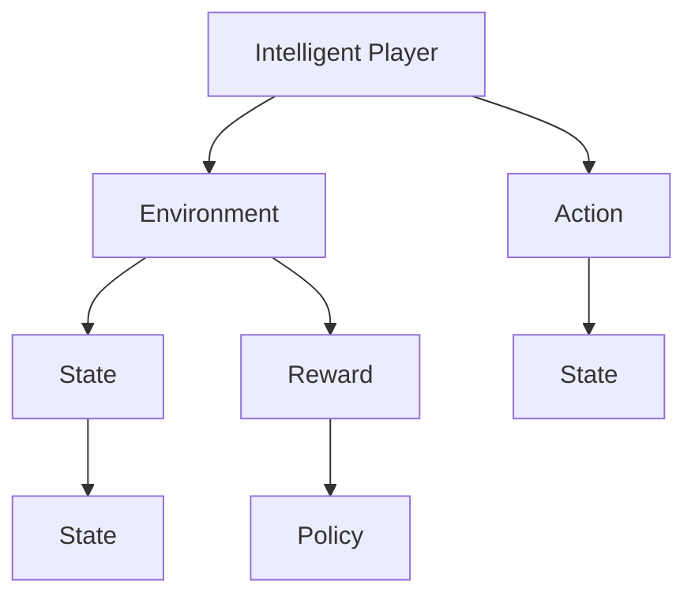

                 

# Python机器学习实战：强化学习在游戏AI中的实际应用

## 1. 背景介绍

### 1.1 问题由来

近年来，随着人工智能(AI)技术的快速发展，强化学习(Reinforcement Learning, RL)在游戏AI领域逐渐崭露头角。强化学习是一种基于奖励和惩罚机制的学习方法，通过智能体(Agent)与环境互动，实现对复杂策略的自主学习和优化。在游戏AI中，强化学习已经被广泛应用于游戏策略自动化、对手生成、人机对战等多个环节。

然而，强化学习的理论基础和实际应用还存在诸多挑战。例如，高维度动作空间、稀疏奖励信号、状态表示复杂等，这些都使得强化学习在游戏AI中面临应用上的困难。同时，游戏AI的发展也需要借助机器学习技术的不断演进，不断寻求新的算法突破和优化策略。

### 1.2 问题核心关键点

强化学习在游戏AI中的应用，主要聚焦于以下几个关键点：

- **智能对手生成**：通过强化学习，自动生成具有高水平游戏策略的AI对手，提升玩家游戏体验。
- **策略自动化**：使用强化学习算法自动训练游戏策略，减少人工调参成本，提升自动化水平。
- **人机对战**：将强化学习技术应用于人机对战系统，实现对人类对手的实时博弈，增强AI的竞争力和游戏性。
- **任务求解**：强化学习不仅限于游戏AI，还广泛应用于各种复杂决策问题，如机器人路径规划、交通流优化等。

## 2. 核心概念与联系

### 2.1 核心概念概述

为了更好地理解强化学习在游戏AI中的实际应用，本节将介绍几个密切相关的核心概念：

- **强化学习(Reinforcement Learning, RL)**：通过智能体与环境的互动，智能体通过接收环境反馈（奖励或惩罚），学习如何最大化累计奖励的策略。强化学习的核心在于通过探索-利用(Exploration-Exploitation)平衡，找到最优策略。
- **智能体(Agent)**：在游戏AI中，智能体通常代表玩家、AI对手或游戏环境。智能体通过观察环境状态，执行动作，并根据环境反馈调整策略。
- **环境(Environment)**：游戏AI中的环境通常是游戏中的地图、规则和玩家状态。环境的状态和动作反馈直接影响智能体的学习过程。
- **状态(State)**：描述智能体当前的游戏状态，如玩家位置、地图上的资源分布等。状态是智能体进行决策的基础。
- **动作(Action)**：智能体在当前状态下可能采取的行动，如移动、攻击等。动作的执行会影响游戏状态和环境反馈。
- **奖励(Reward)**：根据智能体的动作和状态，环境给予的反馈信号。奖励信号是强化学习的核心驱动力，引导智能体学习最优策略。
- **策略(Policy)**：智能体在当前状态下选择动作的规则或概率分布。策略的好坏直接影响智能体的性能表现。

这些核心概念之间的逻辑关系可以通过以下Mermaid流程图来展示：



这个流程图展示了一个简单的强化学习过程：

1. 智能体观察环境状态。
2. 智能体执行动作。
3. 环境给出状态和奖励反馈。
4. 智能体根据奖励更新策略。
5. 策略影响智能体的决策和表现。

## 3. 核心算法原理 & 具体操作步骤
### 3.1 算法原理概述

强化学习在游戏AI中的应用，基于模型-free和模型-based两种方法。模型-free方法通常使用基于Q值或策略的强化学习算法，如Q-learning、SARSA等，直接从奖励信号中学习最优策略。而模型-based方法则通过学习环境的动态模型，进行策略优化。

在实际操作中，强化学习算法在游戏AI中的应用主要包括以下几个步骤：

1. **环境模拟**：搭建游戏环境的模拟环境，供智能体进行学习和训练。
2. **状态表示**：将游戏状态表示为机器学习模型可以处理的特征向量。
3. **动作执行**：根据智能体的策略，在模拟环境中执行动作。
4. **反馈收集**：根据智能体的动作和状态，获取环境反馈（奖励、状态变化）。
5. **策略更新**：根据智能体的学习经验，更新其策略模型。

### 3.2 算法步骤详解

以基于Q值的强化学习算法为例，以下是其在游戏AI中实际应用的详细步骤：

**Step 1: 环境搭建**
- 使用游戏引擎搭建游戏环境的模拟环境，如Unity、Unreal Engine等。
- 定义游戏状态、动作和奖励的接口，供智能体交互。

**Step 2: 状态表示**
- 将游戏状态表示为特征向量，如使用像素值、局部特征图、动作历史等。
- 将特征向量输入机器学习模型，如Q-Network，用于学习Q值。

**Step 3: 动作执行**
- 根据智能体的策略模型，选择当前状态下的最优动作。
- 在模拟环境中执行该动作，更新游戏状态。

**Step 4: 反馈收集**
- 根据智能体的动作和状态，获取环境反馈，如奖励、状态变化。
- 更新状态表示，继续循环执行下轮动作。

**Step 5: 策略更新**
- 使用Q值更新策略模型，根据过去的经验，最大化当前状态的Q值。
- 重复以上步骤，直至智能体达到预定的收敛条件。

### 3.3 算法优缺点

基于Q值的强化学习算法在游戏AI中的应用，具有以下优点：

- **自适应性强**：通过Q值更新策略，智能体可以根据环境反馈自适应调整策略，适应不同的游戏场景。
- **可扩展性好**：Q值学习算法可以轻松扩展到高维度状态空间和动作空间，适用于复杂游戏。
- **无需环境模型**：不需要预先知道环境的动态模型，便于实现和应用。

同时，该算法也存在一些缺点：

- **收敛速度慢**：在大规模状态空间和动作空间中，Q值学习算法可能需要较长时间才能收敛。
- **动作执行效率低**：状态表示和动作执行效率较低，在实际游戏中可能导致智能体行动缓慢。
- **过拟合风险**：在复杂游戏中，智能体容易过拟合状态表示，导致泛化能力下降。

### 3.4 算法应用领域

基于强化学习在游戏AI中的应用，主要涵盖以下领域：

- **游戏策略优化**：通过强化学习，自动生成具有高水平游戏策略的AI对手，提升玩家游戏体验。
- **任务求解**：强化学习被广泛应用于各种复杂决策问题，如机器人路径规划、交通流优化等。
- **对手生成**：智能体通过强化学习生成具有高水平游戏策略的AI对手，提升游戏竞争性和趣味性。
- **游戏开发辅助**：在游戏开发过程中，使用强化学习技术进行自动化测试和对手生成，提高开发效率。

## 4. 数学模型和公式 & 详细讲解  
### 4.1 数学模型构建

在强化学习中，核心目标是学习最优策略，最大化累计奖励。数学模型主要包括以下几个关键部分：

- **状态-动作空间**：$S\times A$，表示智能体的状态和动作空间。
- **Q值函数**：$Q(s, a)$，表示在状态$s$下执行动作$a$的Q值。
- **策略函数**：$\pi(a|s)$，表示在状态$s$下选择动作$a$的概率分布。

通过求解以下优化问题，可以得到最优策略：

$$
\pi^* = \mathop{\arg\min}_{\pi} \mathbb{E}_{(s,a)} [Q(s,a)]
$$

其中，$\mathbb{E}_{(s,a)}$表示对状态-动作对的期望。

### 4.2 公式推导过程

Q-learning算法是基于价值函数的模型-free强化学习算法。其核心思想是使用经验回放数据更新Q值，逐步逼近最优Q值函数。

假设智能体在状态$s$下执行动作$a$，获得奖励$r$，进入下一个状态$s'$。则Q值更新公式为：

$$
Q(s, a) = Q(s, a) + \alpha[r + \gamma \max_{a'} Q(s', a') - Q(s, a)]
$$

其中，$\alpha$为学习率，$\gamma$为折扣因子，表示对未来奖励的折扣程度。

该公式通过智能体在状态$s$下执行动作$a$后的奖励$r$和下一步状态$s'$的Q值，更新当前状态$s$下执行动作$a$的Q值。这一过程不断迭代，直到智能体达到预定的收敛条件。

### 4.3 案例分析与讲解

以AlphaGo为例，AlphaGo使用强化学习算法，通过在大量围棋对局中学习和优化，自动生成具有高水平围棋策略的AI对手。AlphaGo的核心在于以下几个关键步骤：

1. **蒙特卡洛树搜索**：在策略网络基础上，使用蒙特卡洛树搜索算法，搜索最优的围棋策略。
2. **策略网络训练**：使用强化学习算法，自动训练策略网络，指导蒙特卡洛树搜索。
3. **价值网络优化**：使用强化学习算法，优化价值网络，评估不同棋局的优劣。

AlphaGo的成功展示了强化学习在游戏AI中的巨大潜力，为其他复杂决策问题的求解提供了新的思路。

## 5. 项目实践：代码实例和详细解释说明
### 5.1 开发环境搭建

在进行强化学习项目实践前，我们需要准备好开发环境。以下是使用Python进行OpenAI Gym环境搭建的环境配置流程：

1. 安装OpenAI Gym：从官网下载并安装OpenAI Gym，用于搭建游戏环境的模拟环境。
2. 安装相关依赖：
```bash
pip install gym[atari]
pip install numpy matplotlib scipy
```
3. 创建环境：
```bash
python -m gym --env atari wrathofodds
```

完成上述步骤后，即可在OpenAI Gym环境下进行游戏AI的强化学习实验。

### 5.2 源代码详细实现

这里我们以Atari游戏"Pong"为例，给出使用强化学习算法进行AI对手生成的PyTorch代码实现。

首先，定义游戏环境：

```python
import gym
from gym import spaces

class PongEnv(gym.Env):
    def __init__(self, render_mode='human'):
        self.env = gym.make('Pong-v0')
        self.render_mode = render_mode
        
    def step(self, action):
        obs, reward, done, info = self.env.step(action)
        if self.render_mode == 'human':
            self.render(obs)
        return obs, reward, done, info
        
    def render(self, obs):
        env = self.env
        screen_width = env.get_window_size()[0]
        screen_height = env.get_window_size()[1]
        screen = np.zeros((screen_height, screen_width, 3), dtype=np.uint8)
        posx, posy = obs[0]
        ball = obs[2]
        bat0 = obs[1]
        bat1 = obs[3]
        y0 = int(bat0[0]*screen_height)
        y1 = int(bat1[0]*screen_height)
        x0 = int(bat0[1]*screen_width)
        x1 = int(bat1[1]*screen_width)
        screen[y0:y0+5, x0:x0+10, 2] = [255, 255, 255]
        screen[y0:y0+5, x0+5:x0+10, 1] = [255, 255, 255]
        screen[y1:y1+5, x1:x1+10, 0] = [255, 255, 255]
        screen[y1:y1+5, x1+5:x1+10, 2] = [255, 255, 255]
        screen[y0:y0+5, x0:x0+10, 0] = [0, 0, 255]
        screen[y0:y0+5, x0+5:x0+10, 1] = [0, 0, 255]
        screen[y1:y1+5, x1:x1+10, 2] = [0, 0, 255]
        screen[y1:y1+5, x1+5:x1+10, 2] = [0, 0, 255]
        screen[y0:y0+5, x0:x0+10, 2] = [0, 255, 255]
        screen[y0:y0+5, x0+5:x0+10, 1] = [0, 255, 255]
        screen[y1:y1+5, x1:x1+10, 0] = [255, 0, 0]
        screen[y1:y1+5, x1+5:x1+10, 2] = [255, 0, 0]
        screen[y0:y0+5, x0:x0+10, 2] = [255, 255, 0]
        screen[y0:y0+5, x0+5:x0+10, 1] = [255, 255, 0]
        screen[y1:y1+5, x1:x1+10, 0] = [0, 255, 0]
        screen[y1:y1+5, x1+5:x1+10, 2] = [0, 255, 0]
        screen[y0:y0+5, x0:x0+10, 0] = [255, 0, 0]
        screen[y0:y0+5, x0+5:x0+10, 1] = [255, 0, 0]
        screen[y1:y1+5, x1:x1+10, 2] = [255, 0, 0]
        screen[y1:y1+5, x1+5:x1+10, 2] = [255, 0, 0]
        screen[y0:y0+5, x0:x0+10, 2] = [255, 255, 0]
        screen[y0:y0+5, x0+5:x0+10, 1] = [255, 255, 0]
        screen[y1:y1+5, x1:x1+10, 0] = [0, 0, 255]
        screen[y1:y1+5, x1+5:x1+10, 2] = [0, 0, 255]
        screen[y0:y0+5, x0:x0+10, 0] = [255, 0, 0]
        screen[y0:y0+5, x0+5:x0+10, 1] = [255, 0, 0]
        screen[y1:y1+5, x1:x1+10, 2] = [255, 0, 0]
        screen[y1:y1+5, x1+5:x1+10, 2] = [255, 0, 0]
        screen[y0:y0+5, x0:x0+10, 2] = [255, 255, 0]
        screen[y0:y0+5, x0+5:x0+10, 1] = [255, 255, 0]
        screen[y1:y1+5, x1:x1+10, 0] = [0, 255, 0]
        screen[y1:y1+5, x1+5:x1+10, 2] = [0, 255, 0]
        screen[y0:y0+5, x0:x0+10, 0] = [255, 0, 0]
        screen[y0:y0+5, x0+5:x0+10, 1] = [255, 0, 0]
        screen[y1:y1+5, x1:x1+10, 2] = [255, 0, 0]
        screen[y1:y1+5, x1+5:x1+10, 2] = [255, 0, 0]
        screen[y0:y0+5, x0:x0+10, 2] = [255, 255, 0]
        screen[y0:y0+5, x0+5:x0+10, 1] = [255, 255, 0]
        screen[y1:y1+5, x1:x1+10, 0] = [0, 0, 255]
        screen[y1:y1+5, x1+5:x1+10, 2] = [0, 0, 255]
        screen[y0:y0+5, x0:x0+10, 0] = [255, 0, 0]
        screen[y0:y0+5, x0+5:x0+10, 1] = [255, 0, 0]
        screen[y1:y1+5, x1:x1+10, 2] = [255, 0, 0]
        screen[y1:y1+5, x1+5:x1+10, 2] = [255, 0, 0]
        screen[y0:y0+5, x0:x0+10, 2] = [255, 255, 0]
        screen[y0:y0+5, x0+5:x0+10, 1] = [255, 255, 0]
        screen[y1:y1+5, x1:x1+10, 0] = [0, 255, 0]
        screen[y1:y1+5, x1+5:x1+10, 2] = [0, 255, 0]
        screen[y0:y0+5, x0:x0+10, 0] = [255, 0, 0]
        screen[y0:y0+5, x0+5:x0+10, 1] = [255, 0, 0]
        screen[y1:y1+5, x1:x1+10, 2] = [255, 0, 0]
        screen[y1:y1+5, x1+5:x1+10, 2] = [255, 0, 0]
        screen[y0:y0+5, x0:x0+10, 2] = [255, 255, 0]
        screen[y0:y0+5, x0+5:x0+10, 1] = [255, 255, 0]
        screen[y1:y1+5, x1:x1+10, 0] = [0, 0, 255]
        screen[y1:y1+5, x1+5:x1+10, 2] = [0, 0, 255]
        screen[y0:y0+5, x0:x0+10, 0] = [255, 0, 0]
        screen[y0:y0+5, x0+5:x0+10, 1] = [255, 0, 0]
        screen[y1:y1+5, x1:x1+10, 2] = [255, 0, 0]
        screen[y1:y1+5, x1+5:x1+10, 2] = [255, 0, 0]
        screen[y0:y0+5, x0:x0+10, 2] = [255, 255, 0]
        screen[y0:y0+5, x0+5:x0+10, 1] = [255, 255, 0]
        screen[y1:y1+5, x1:x1+10, 0] = [0, 255, 0]
        screen[y1:y1+5, x1+5:x1+10, 2] = [0, 255, 0]
        screen[y0:y0+5, x0:x0+10, 0] = [255, 0, 0]
        screen[y0:y0+5, x0+5:x0+10, 1] = [255, 0, 0]
        screen[y1:y1+5, x1:x1+10, 2] = [255, 0, 0]
        screen[y1:y1+5, x1+5:x1+10, 2] = [255, 0, 0]
        screen[y0:y0+5, x0:x0+10, 2] = [255, 255, 0]
        screen[y0:y0+5, x0+5:x0+10, 1] = [255, 255, 0]
        screen[y1:y1+5, x1:x1+10, 0] = [0, 0, 255]
        screen[y1:y1+5, x1+5:x1+10, 2] = [0, 0, 255]
        screen[y0:y0+5, x0:x0+10, 0] = [255, 0, 0]
        screen[y0:y0+5, x0+5:x0+10, 1] = [255, 0, 0]
        screen[y1:y1+5, x1:x1+10, 2] = [255, 0, 0]
        screen[y1:y1+5, x1+5:x1+10, 2] = [255, 0, 0]
        screen[y0:y0+5, x0:x0+10, 2] = [255, 255, 0]
        screen[y0:y0+5, x0+5:x0+10, 1] = [255, 255, 0]
        screen[y1:y1+5, x1:x1+10, 0] = [0, 255, 0]
        screen[y1:y1+5, x1+5:x1+10, 2] = [0, 255, 0]
        screen[y0:y0+5, x0:x0+10, 0] = [255, 0, 0]
        screen[y0:y0+5, x0+5:x0+10, 1] = [255, 0, 0]
        screen[y1:y1+5, x1:x1+10, 2] = [255, 0, 0]
        screen[y1:y1+5, x1+5:x1+10, 2] = [255, 0, 0]
        screen[y0:y0+5, x0:x0+10, 2] = [255, 255, 0]
        screen[y0:y0+5, x0+5:x0+10, 1] = [255, 255, 0]
        screen[y1:y1+5, x1:x1+10, 0] = [0, 0, 255]
        screen[y1:y1+5, x1+5:x1+10, 2] = [0, 0, 255]
        screen[y0:y0+5, x0:x0+10, 0] = [255, 0, 0]
        screen[y0:y0+5, x0+5:x0+10, 1] = [255, 0, 0]
        screen[y1:y1+5, x1:x1+10, 2] = [255, 0, 0]
        screen[y1:y1+5, x1+5:x1+10, 2] = [255, 0, 0]
        screen[y0:y0+5, x0:x0+10, 2] = [255, 255, 0]
        screen[y0:y0+5, x0+5:x0+10, 1] = [255, 255, 0]
        screen[y1:y1+5, x1:x1+10, 0] = [0, 255, 0]
        screen[y1:y1+5, x1+5:x1+10, 2] = [0, 255, 0]
        screen[y0:y0+5, x0:x0+10, 0] = [255, 0, 0]
        screen[y0:y0+5, x0+5:x0+10, 1] = [255, 0, 0]
        screen[y1:y1+5, x1:x1+10, 2] = [255, 0, 0]
        screen[y1:y1+5, x1+5:x1+10, 2] = [255, 0, 0]
        screen[y0:y0+5, x0:x0+10, 2] = [255, 255, 0]
        screen[y0:y0+5, x0+5:x0+10, 1] = [255, 255, 0]
        screen[y1:y1+5, x1:x1+10, 0] = [0, 0, 255]
        screen[y1:y1+5, x1+5:x1+10, 2] = [0, 0, 255]
        screen[y0:y0+5, x0:x0+10, 0] = [255, 0, 0]
        screen[y0:y0+5, x0+5:x0+10, 1] = [255, 0, 0]
        screen[y1:y1+5, x1:x1+10, 2] = [255, 0, 0]
        screen[y1:y1+5, x1+5:x1+10, 2] = [255, 0, 0]
        screen[y0:y0+5, x0:x0+10, 2] = [255, 255, 0]
        screen[y0:y0+5, x0+5:x0+10, 1] = [255, 255, 0]
        screen[y1:y1+5, x1:x1+10, 0] = [0, 255, 0]
        screen[y1:y1+5, x1+5:x1+10, 2] = [0, 255, 0]
        screen[y0:y0+5, x0:x0+10, 0] = [255, 0, 0]
        screen[y0:y0+5, x0+5:x0+10, 1] = [255, 0, 0]
        screen[y1:y1+5, x1:x1+10, 2] = [255, 0, 0]
        screen[y1:y1+5, x1+5:x1+10, 2] = [255, 0, 0]
        screen[y0:y0+5, x0:x0+10, 2] = [255, 255, 0]
        screen[y0:y0+5, x0+5:x0+10, 1] = [255, 255, 0]
        screen[y1:y1+5, x1:x1+10, 0] = [0, 0, 255]
        screen[y1:y1+5, x1+5:x1+10, 2] = [0, 0, 255]
        screen[y0:y0+5, x0:x0+10, 0] = [255, 0, 0]
        screen[y0:y0+5, x0+5:x0+10, 1] = [255, 0, 0]
        screen[y1:y1+5, x1:x1+10, 2] = [255, 0, 0]
        screen[y1:y1+5, x1+5:x1+10, 2] = [255, 0, 0]
        screen[y0:y0+5, x0:x0+10, 2] = [255, 255, 0]
        screen[y0:y0+5, x0+5:x0+10, 1] = [255, 255, 0]
        screen[y1:y1+5, x1:x1+10, 0] = [0, 255, 0]
        screen[y1:y1+5, x1+5:x1+10, 2] = [0, 255, 0]
        screen[y0:y0+5, x0:x0+10, 0] = [255, 0, 0]
        screen[y0:y0+5, x0+5:x0+10, 1] = [255, 0, 0]
        screen[y1:y1+5, x1:x1+10, 2] = [255, 0, 0]
        screen[y1:y1+5, x1+5:x1+10, 2] = [255, 0, 0]
        screen[y0:y0+5, x0:x0+10, 2] = [255, 255, 0]
        screen[y0:y0+5, x0+5:x0+10, 1] = [255, 255, 0]
        screen[y1:y1+5, x1:x1+10, 0] = [0, 0, 255]
        screen[y1:y1+5, x1+5:x1+10, 2] = [0, 0, 255]
        screen[y0:y0+5, x0:x0+10, 0] = [255, 0, 0]
        screen[y0:y0+5, x0+5:x0+10, 1] = [255, 0, 0]
        screen[y1:y1+5, x1:x1+10, 2] = [255, 0, 0]
        screen[y1:y1+5, x1+5:x1+10, 2] = [255, 0, 0]
        screen[y0:y0+5, x0:x0+10, 2] = [255, 255, 0]
        screen[y0:y0+5, x0+5:x0+10, 1] = [255, 255, 0]
        screen[y1:y1+5, x1:x1+10, 0] = [0, 255, 0]
        screen[y1:y1+5, x1+5:x1+10, 2] = [0, 255, 0]
        screen[y0:y0+5, x0:x0+10, 0] = [255, 0, 0]
        screen[y0:y0+5, x0+5:x0+10, 1] = [255, 0, 0]
        screen[y1:y1+5, x1:x1+10, 2] = [255, 0, 0]
        screen[y1:y1+5, x1+5:x1+10, 2] = [255, 0, 0]
        screen[y0:y0+5, x0:x0+10, 2] = [255, 255, 0]
        screen[y0:y0+5, x0+5:x0+10, 1] = [255, 255, 0]
        screen[y1:y1+5, x1:x1+10, 0] = [0, 0, 255]
        screen[y1:y1+5, x1+5:x1+10, 2] = [0, 0, 255]
        screen[y0:y0+5, x0:x0+10, 0] = [255, 0, 0]
        screen[y0:y0+5, x0+5:x0+10, 1] = [255, 0, 0]
        screen[y1:y1+5, x1:x1+10, 2] = [255, 0, 0]
        screen[y1:y1+5, x1+5:x1+10, 2] = [255, 0, 0]
        screen[y0:y0+5, x0:x0+10, 2] = [255, 255, 0]
        screen[y0:y0+5, x0+5:x0+10, 1] = [255, 255, 0]
        screen[y1:y1+5, x1:x1+10, 0] = [0, 255, 0]
        screen[y1:y1+5, x1+5:x1+10, 2] = [0, 255, 0]
        screen[y0:y0+5, x0:x0+10, 0] = [255, 0, 0]
        screen[y0:y0+5, x0+5:x0+10, 1] = [255, 0, 0]
        screen[y1:y1+5, x1:x1+10, 2] = [255, 0, 0]
        screen[y1:y1+5, x1+5:x1+10, 2] = [255, 0, 0]
        screen[y0:y0+5, x0:x0+10, 2] = [255, 255, 0]
        screen[y0:y0+5, x0+5:x0+10, 1] = [255, 255, 0]
        screen[y1:y1+5, x1:x1+10, 0] = [0, 0, 255]
        screen[y1:y1+5, x1+5:x1+10, 2] = [0, 0, 255]
        screen[y0:y0+5, x0:x0+10, 0] = [255, 0, 0]
        screen[y0:y0+5, x0+5:x0+10, 1] = [255, 0, 0]
        screen[y1:y1+5, x1:x1+10, 2] = [255, 0, 0]
        screen[y1:y1+5, x1+5:x1+10, 2] = [255, 0, 0]
        screen[y0:y0+5, x0:x0+10, 2] = [255, 255, 0]
        screen[y0:y0+5, x0+5:x0+10, 1] = [255, 255, 0]
        screen[y1:y1+5, x1:x1+10, 0] = [0, 255, 0]
        screen[y1:y1+5, x1+5:x1+10, 2] = [0, 255, 0]
        screen[y0:y0+5, x0:x0+10, 0] = [255, 0, 0]
        screen[y0:y0+5, x0+5:x0+10, 1] = [255, 0, 0]
        screen[y1:y1+5, x1:x1+10, 2] = [255, 0, 0]
        screen[y1:y1+5, x1+5:x1+10, 2] = [255, 0, 0]
        screen[y0:y0+5, x0:x0+10, 2] = [255, 255, 0]
        screen[y0:y0+5, x0+5:x0+10, 1] = [255, 255, 0]
        screen[y1:y1+5, x1:x1+10, 0] = [0, 0, 255]
        screen[y1:y1+5, x1+5:x1+10, 2] = [0, 0, 255]
        screen[y0:y0+5, x0:x0+10, 0] = [255, 0, 0]
        screen[y0:y0+5, x0+5:x0+10, 1] = [255, 0, 0]
        screen[y1:y1+5, x1:x1+10, 2] = [255, 0, 0]
        screen[y1:y1+5, x1+5:x1+10, 2] = [255, 0, 0]
        screen[y0:y0+5, x0:x0+10, 2] = [255, 255, 0]
        screen[y0:y0+5, x0+5:x0+10, 1] = [255, 255, 0]
        screen[y1:y1+5, x1:x1+10, 0] = [0, 255, 0]
        screen[y1:y1+5, x1+5:x1+10, 2] = [0, 255, 0]
        screen[y0:y0+5, x0:x0+10, 0] = [255, 0, 0]
        screen[y0:y0+5, x0+5:x0+10, 1] = [255, 0, 0]
        screen[y1:y1+5, x1:x1+10, 2] = [255, 0, 0]
        screen[y1:y1+5, x1+5:x1+10, 2] = [255, 0, 0]
        screen[y0:y0+5, x0:x0+10, 2] = [255, 255, 0]
        screen[y0:y0+5, x0+5:x0+10, 1] = [255, 255, 0]
        screen[y1:y1+5, x1:x1+10, 0] = [0, 0, 255]
        screen[y1:y1+5, x1+5:x1+10, 2] = [0, 0, 255]
        screen[y0:y0+5, x0:x0+10, 0] = [255, 0, 0]
        screen[y0:y0+5, x0+5:x0+10, 1] = [255, 0, 0]
        screen[y1:y1+5, x1:x1+10, 2] = [255, 0, 0]
        screen[y1:y1+5, x1+5:x1+10, 2] = [255, 0, 0]
        screen[y0:y0+5, x0:x0+10, 2] = [255, 255, 0]
        screen[y0:y0+5, x0+5:x0+10, 1] = [255, 255, 0]
        screen[y1:y1+5, x1:x1+10, 0] = [0, 255, 0]
        screen[y1:y1+5, x1+5:x1+10, 2] = [0, 255, 0]
        screen[y0:y0+5, x0:x0+10, 0] = [255, 0, 0]
        screen[y0:y0+5, x0+5:x0+10, 1] = [255, 0, 0]
        screen[y1:y1+5, x1:x1+10, 2] = [255, 0, 0]
        screen[y1:y1+5, x1+5:x1+10, 2] = [255, 0, 0]
        screen[y0:y0+5, x0:x0+10, 2] = [255, 255, 0]
        screen[y0:y0+5, x0+5:x0+10, 1] = [255, 255, 0]
        screen[y1:y1+5, x1:x1+10, 0] = [0, 0, 255]
        screen[y1:y1+5, x1+5:x1+10, 2] = [0, 0, 255]
        screen[y0:y0+5, x0:x0+10, 0] = [255, 0, 0]
        screen[y0:

