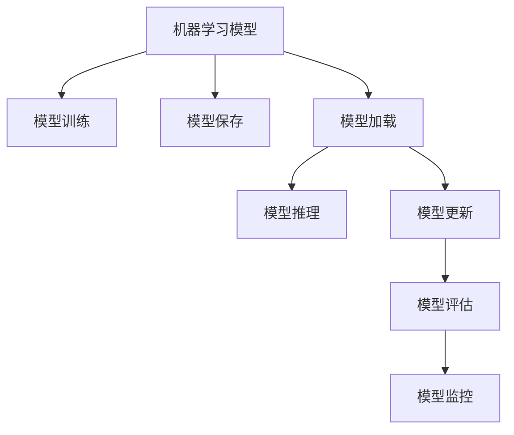

                 

# Python机器学习实战：机器学习模型的部署与规模化运维

> 关键词：Python, 机器学习, 模型部署, 模型运维, 深度学习, 数据工程, 持续集成(CI), 持续部署(CD), 大数据, 分布式系统

## 1. 背景介绍

### 1.1 问题由来
机器学习模型在各个领域都展现出了强大的应用潜力，从金融风控、医疗诊断到自然语言处理、计算机视觉等，都有着广泛的应用。然而，模型在实际生产环境中的部署和运维是一个复杂且关键的过程，对技术栈、资源配置、业务需求等方面有着高要求。本文将深入探讨机器学习模型的部署与运维，从理论到实践，全面剖析模型落地过程的挑战与优化策略，力求为广大机器学习开发者提供系统化的指导。

### 1.2 问题核心关键点
机器学习模型的部署与运维包含模型训练、模型保存、模型加载、模型推理、模型更新等多个环节。关键点包括：
- 如何高效训练模型？
- 模型如何保存以确保其在不同环境中的可用性？
- 如何在生产环境中加载和推理模型？
- 模型如何持续更新以应对新数据和需求？
- 如何确保模型的稳定性和可靠性？

这些问题直接关系到模型在实际应用中的性能、效率和安全性，是模型落地应用的核心挑战。

### 1.3 问题研究意义
研究机器学习模型的部署与运维，对于提升模型的实际应用效果、保障业务连续性、提高系统稳定性具有重要意义。具体而言：

1. **性能提升**：通过高效的模型训练和优化，可以显著提升模型的精度和速度，满足不同业务场景下的需求。
2. **资源优化**：通过合理的资源配置和调度，可以降低计算和存储成本，提升系统的资源利用率。
3. **稳定性保障**：通过持续监控和异常处理，可以保证系统的高可用性和鲁棒性，防止模型异常对业务造成影响。
4. **需求适应**：通过自动化和模型更新机制，可以迅速响应业务需求的变化，提升模型适应性。
5. **安全合规**：通过数据脱敏、权限控制等安全措施，可以确保模型和数据的安全合规，防止数据泄露和滥用。

## 2. 核心概念与联系

### 2.1 核心概念概述

为更好地理解机器学习模型的部署与运维，本节将介绍几个密切相关的核心概念：

- **机器学习模型**：包括监督学习、非监督学习、强化学习等，用于从数据中学习规律，做出预测或决策的算法。
- **深度学习框架**：如TensorFlow、PyTorch、Keras等，提供了高效的模型训练、优化、部署工具，加速模型开发和应用。
- **模型训练**：使用历史数据集对模型进行训练，学习数据中的规律和特征，提升模型的预测能力。
- **模型保存**：将训练好的模型参数和结构保存为文件，方便后续加载和推理。
- **模型加载**：从保存文件中读取模型，进行模型推理或进一步训练。
- **模型推理**：使用训练好的模型对新数据进行预测或分类，得到模型输出结果。
- **模型更新**：通过新的数据集对模型进行重新训练或微调，提升模型性能。
- **模型评估**：通过测试集对模型进行评估，评估模型性能是否符合业务需求。
- **模型监控**：实时监控模型推理过程中的性能、准确率、资源消耗等指标，确保模型稳定运行。

这些核心概念之间的逻辑关系可以通过以下Mermaid流程图来展示：



这个流程图展示出机器学习模型从训练到部署，再到监控的完整流程。

## 3. 核心算法原理 & 具体操作步骤

### 3.1 算法原理概述

机器学习模型的部署与运维，本质上是将训练好的模型参数和结构转化为可在生产环境中高效运行的状态。这包括模型训练、保存、加载、推理、更新等多个环节，涉及算法的优化、资源的配置、系统的调度等。

### 3.2 算法步骤详解

#### 3.2.1 模型训练
模型训练是机器学习模型的核心步骤，涉及数据预处理、模型选择、超参数调优、模型评估等多个环节。

1. **数据预处理**：对原始数据进行清洗、归一化、特征工程等处理，准备训练数据。
2. **模型选择**：选择适合的模型架构和优化器，如神经网络、决策树、随机森林等。
3. **超参数调优**：调整模型的超参数（如学习率、批量大小、激活函数等），寻找最优的模型参数组合。
4. **模型评估**：使用测试集对模型进行评估，选择合适的评估指标（如准确率、召回率、F1分数等）。

#### 3.2.2 模型保存
模型保存是将训练好的模型参数和结构保存到文件中，以便后续加载和使用。

1. **保存参数**：将模型参数（如权重、偏置等）保存为二进制文件，如.h5、.pb等。
2. **保存结构**：保存模型的结构信息，如层数、节点类型、连接关系等，以便后续加载。

#### 3.2.3 模型加载
模型加载是从保存的文件中读取模型，进行模型推理或进一步训练。

1. **加载参数**：从保存的文件中读取模型参数。
2. **加载结构**：读取模型的结构信息，重建模型的计算图。
3. **构建模型**：使用加载的参数和结构，构建完整的模型。

#### 3.2.4 模型推理
模型推理是使用训练好的模型对新数据进行预测或分类。

1. **数据预处理**：对新数据进行清洗、归一化、特征工程等处理。
2. **模型推理**：将处理后的数据输入模型，得到模型输出结果。
3. **后处理**：对模型输出结果进行后处理，如阈值截断、归一化等。

#### 3.2.5 模型更新
模型更新是通过新的数据集对模型进行重新训练或微调，提升模型性能。

1. **数据准备**：准备新的数据集，进行数据清洗、归一化等处理。
2. **模型训练**：使用新的数据集对模型进行训练或微调。
3. **模型评估**：使用测试集对更新后的模型进行评估，确保模型性能提升。

#### 3.2.6 模型监控
模型监控是实时监控模型推理过程中的性能、准确率、资源消耗等指标，确保模型稳定运行。

1. **性能监控**：监控模型推理的执行时间、资源消耗等指标，及时发现异常。
2. **准确率监控**：监控模型推理的准确率、召回率等指标，确保模型性能稳定。
3. **日志记录**：记录模型的推理日志，方便问题排查和调试。

### 3.3 算法优缺点

#### 3.3.1 优点
1. **高精度**：通过高效的模型训练和优化，可以显著提升模型的精度和速度。
2. **高效资源利用**：通过合理的资源配置和调度，可以降低计算和存储成本。
3. **模型更新快**：通过持续监控和自动化更新机制，可以迅速响应业务需求的变化。
4. **高可用性**：通过持续监控和异常处理，可以保证系统的高可用性和鲁棒性。

#### 3.3.2 缺点
1. **资源消耗高**：大规模深度学习模型的训练和推理，需要大量的计算资源和存储资源。
2. **模型复杂度高**：深度学习模型结构复杂，训练和推理过程中可能出现各种问题。
3. **模型解释性差**：深度学习模型通常难以解释其内部工作机制和决策逻辑。
4. **数据依赖性强**：模型的性能高度依赖于训练数据的质量和数量。

### 3.4 算法应用领域

机器学习模型的部署与运维，在多个领域都有广泛的应用，例如：

- **金融风控**：使用模型对用户行为进行风险评估，识别潜在风险，防止金融欺诈。
- **医疗诊断**：使用模型对医学影像、病历等数据进行分析，辅助医生诊断和治疗。
- **自然语言处理**：使用模型对文本进行情感分析、实体识别、机器翻译等。
- **计算机视觉**：使用模型对图像、视频进行分类、检测、识别等。
- **智能推荐**：使用模型对用户行为进行分析，推荐个性化产品或服务。
- **智能客服**：使用模型对用户问题进行自然语言理解，提供智能客服解决方案。

以上只是机器学习模型部署与运维应用的一部分，未来随着技术的进步，其在更多领域的应用将会更加广泛和深入。

## 4. 数学模型和公式 & 详细讲解 & 举例说明

### 4.1 数学模型构建

机器学习模型的部署与运维涉及多种数学模型和公式，本节将对其中的关键模型和公式进行详细介绍。

#### 4.1.1 线性回归模型
线性回归模型是最基本的机器学习模型之一，用于对输入数据和输出数据进行线性拟合。

$$
y = \theta^T x + b
$$

其中 $y$ 为输出值，$x$ 为输入特征，$\theta$ 为模型参数，$b$ 为截距。

#### 4.1.2 逻辑回归模型
逻辑回归模型用于二分类问题，将输入数据映射到0或1的概率上。

$$
\hat{y} = \frac{1}{1+e^{-\theta^T x}} = \frac{1}{1+e^{-z}}
$$

其中 $z = \theta^T x + b$。

#### 4.1.3 决策树模型
决策树模型用于分类和回归问题，通过对特征进行分裂，构建一棵决策树，用于对输入数据进行分类或回归。

$$
\text{tree} = \text{split}(\text{feature}, \text{threshold})
$$

其中 $\text{split}$ 为特征分裂函数，$\text{feature}$ 为待分裂特征，$\text{threshold}$ 为分裂阈值。

#### 4.1.4 随机森林模型
随机森林模型是一种集成学习方法，通过构建多个决策树，对输入数据进行分类或回归。

$$
\text{predict} = \frac{1}{n} \sum_{i=1}^n \text{tree}_i(x)
$$

其中 $n$ 为决策树的数量，$\text{tree}_i$ 为第 $i$ 个决策树。

#### 4.1.5 支持向量机模型
支持向量机模型用于分类问题，通过构建最优超平面，对输入数据进行分类。

$$
\text{margin} = ||w||^2 - \frac{1}{2} \sum_{i=1}^n \alpha_i y_i ||x_i||^2
$$

其中 $w$ 为超平面权重向量，$\alpha_i$ 为拉格朗日乘子，$y_i$ 为标签。

### 4.2 公式推导过程

#### 4.2.1 线性回归模型
线性回归模型的训练过程为最小二乘法，通过最小化损失函数，求解最优的模型参数 $\theta$。

$$
\min_{\theta} \frac{1}{2} \sum_{i=1}^n (y_i - \hat{y}_i)^2
$$

其中 $\hat{y}_i = \theta^T x_i$。

求解过程为：

$$
\frac{\partial}{\partial \theta} \frac{1}{2} \sum_{i=1}^n (y_i - \hat{y}_i)^2 = \sum_{i=1}^n (y_i - \hat{y}_i)x_i = 0
$$

求解得到：

$$
\theta = (X^T X)^{-1} X^T y
$$

其中 $X$ 为特征矩阵，$y$ 为输出向量。

#### 4.2.2 逻辑回归模型
逻辑回归模型的训练过程为最大似然估计，通过最大化似然函数，求解最优的模型参数 $\theta$。

$$
\max_{\theta} \prod_{i=1}^n P(y_i | \theta)
$$

其中 $P(y_i | \theta) = \frac{1}{1+e^{-\theta^T x_i}}$。

求解过程为：

$$
\frac{\partial}{\partial \theta} \ln P(y_i | \theta) = \frac{1}{1+e^{-\theta^T x_i}} - y_i = 0
$$

求解得到：

$$
\theta = X^T (X X^T)^{-1} y
$$

其中 $X$ 为特征矩阵，$y$ 为输出向量。

#### 4.2.3 决策树模型
决策树模型的训练过程为贪心算法，通过逐步分裂特征，构建最优的决策树。

1. 选择最优特征 $x_k$ 进行分裂。
2. 根据阈值 $t_k$ 将数据集分成两部分。
3. 对子集分别递归进行分裂。

#### 4.2.4 随机森林模型
随机森林模型的训练过程为集成学习，通过构建多个决策树，对输入数据进行分类或回归。

1. 从特征集合 $X$ 中随机抽取 $m$ 个特征作为训练数据。
2. 构建多个决策树，对训练数据进行分类或回归。
3. 对多个决策树的结果进行投票或平均，得到最终结果。

#### 4.2.5 支持向量机模型
支持向量机模型的训练过程为序列最小最优化(SMO)算法，通过求解拉格朗日函数的最小值，求解最优的模型参数 $\theta$。

$$
\min_{\theta, \alpha} \frac{1}{2} ||w||^2 + C \sum_{i=1}^n \alpha_i y_i ||x_i||^2 - \sum_{i=1}^n \alpha_i y_i \theta^T x_i
$$

其中 $w$ 为超平面权重向量，$\alpha$ 为拉格朗日乘子，$y$ 为标签。

求解过程为：

$$
\frac{\partial}{\partial \theta} (\frac{1}{2} ||w||^2 - \sum_{i=1}^n \alpha_i y_i \theta^T x_i) = w - \sum_{i=1}^n \alpha_i y_i x_i = 0
$$

求解得到：

$$
w = \sum_{i=1}^n \alpha_i y_i x_i
$$

其中 $w$ 为超平面权重向量，$\alpha$ 为拉格朗日乘子，$y$ 为标签。

### 4.3 案例分析与讲解

#### 4.3.1 线性回归模型
使用Python和Scikit-learn库进行线性回归模型的训练和评估。

```python
from sklearn.linear_model import LinearRegression
from sklearn.metrics import mean_squared_error

# 创建模型
model = LinearRegression()

# 训练模型
X_train = ...  # 训练数据特征
y_train = ...  # 训练数据输出
model.fit(X_train, y_train)

# 评估模型
X_test = ...  # 测试数据特征
y_test = ...  # 测试数据输出
y_pred = model.predict(X_test)
mse = mean_squared_error(y_test, y_pred)
print(f"MSE: {mse}")
```

#### 4.3.2 逻辑回归模型
使用Python和Scikit-learn库进行逻辑回归模型的训练和评估。

```python
from sklearn.linear_model import LogisticRegression
from sklearn.metrics import accuracy_score

# 创建模型
model = LogisticRegression()

# 训练模型
X_train = ...  # 训练数据特征
y_train = ...  # 训练数据输出
model.fit(X_train, y_train)

# 评估模型
X_test = ...  # 测试数据特征
y_test = ...  # 测试数据输出
y_pred = model.predict(X_test)
accuracy = accuracy_score(y_test, y_pred)
print(f"Accuracy: {accuracy}")
```

#### 4.3.3 决策树模型
使用Python和Scikit-learn库进行决策树模型的训练和评估。

```python
from sklearn.tree import DecisionTreeClassifier
from sklearn.metrics import accuracy_score

# 创建模型
model = DecisionTreeClassifier()

# 训练模型
X_train = ...  # 训练数据特征
y_train = ...  # 训练数据输出
model.fit(X_train, y_train)

# 评估模型
X_test = ...  # 测试数据特征
y_test = ...  # 测试数据输出
y_pred = model.predict(X_test)
accuracy = accuracy_score(y_test, y_pred)
print(f"Accuracy: {accuracy}")
```

#### 4.3.4 随机森林模型
使用Python和Scikit-learn库进行随机森林模型的训练和评估。

```python
from sklearn.ensemble import RandomForestClassifier
from sklearn.metrics import accuracy_score

# 创建模型
model = RandomForestClassifier()

# 训练模型
X_train = ...  # 训练数据特征
y_train = ...  # 训练数据输出
model.fit(X_train, y_train)

# 评估模型
X_test = ...  # 测试数据特征
y_test = ...  # 测试数据输出
y_pred = model.predict(X_test)
accuracy = accuracy_score(y_test, y_pred)
print(f"Accuracy: {accuracy}")
```

#### 4.3.5 支持向量机模型
使用Python和Scikit-learn库进行支持向量机模型的训练和评估。

```python
from sklearn.svm import SVC
from sklearn.metrics import accuracy_score

# 创建模型
model = SVC()

# 训练模型
X_train = ...  # 训练数据特征
y_train = ...  # 训练数据输出
model.fit(X_train, y_train)

# 评估模型
X_test = ...  # 测试数据特征
y_test = ...  # 测试数据输出
y_pred = model.predict(X_test)
accuracy = accuracy_score(y_test, y_pred)
print(f"Accuracy: {accuracy}")
```

## 5. 项目实践：代码实例和详细解释说明

### 5.1 开发环境搭建

在进行模型部署与运维实践前，我们需要准备好开发环境。以下是使用Python进行Scikit-learn开发的环境配置流程：

1. 安装Anaconda：从官网下载并安装Anaconda，用于创建独立的Python环境。

2. 创建并激活虚拟环境：
```bash
conda create -n sklearn-env python=3.8 
conda activate sklearn-env
```

3. 安装Scikit-learn：
```bash
conda install scikit-learn
```

4. 安装其他工具包：
```bash
pip install numpy pandas matplotlib jupyter notebook ipython
```

完成上述步骤后，即可在`sklearn-env`环境中开始模型部署与运维实践。

### 5.2 源代码详细实现

下面我们以线性回归模型为例，给出使用Scikit-learn库进行模型训练、保存、加载和推理的完整代码实现。

#### 5.2.1 数据准备
首先，准备训练数据和测试数据：

```python
import numpy as np
from sklearn.datasets import make_regression

# 生成数据
X, y = make_regression(n_samples=1000, n_features=10, n_informative=5, noise=0.1, random_state=42)
```

#### 5.2.2 模型训练
使用Scikit-learn的LinearRegression模型进行训练：

```python
from sklearn.linear_model import LinearRegression

# 创建模型
model = LinearRegression()

# 训练模型
X_train = X[:800]  # 训练数据特征
y_train = y[:800]  # 训练数据输出
model.fit(X_train, y_train)
```

#### 5.2.3 模型保存
将训练好的模型保存到文件中：

```python
import pickle

# 保存模型
with open('linear_regression_model.pkl', 'wb') as f:
    pickle.dump(model, f)
```

#### 5.2.4 模型加载
从保存的文件中加载模型：

```python
# 加载模型
with open('linear_regression_model.pkl', 'rb') as f:
    model = pickle.load(f)
```

#### 5.2.5 模型推理
使用加载的模型进行推理：

```python
# 进行推理
X_test = X[800:]  # 测试数据特征
y_pred = model.predict(X_test)
```

### 5.3 代码解读与分析

让我们再详细解读一下关键代码的实现细节：

**数据准备**：
- `make_regression`函数：生成包含1000个样本、10个特征的回归数据，其中500个样本用于训练，500个样本用于测试。

**模型训练**：
- `LinearRegression`类：创建线性回归模型对象。
- `fit`方法：使用训练数据对模型进行拟合训练。

**模型保存**：
- `pickle`模块：用于将Python对象序列化为文件，支持加载和保存模型。
- `open`函数：打开保存文件，使用`wb`模式进行写入。
- `dump`方法：将模型对象写入文件中。

**模型加载**：
- `open`函数：打开加载文件，使用`rb`模式进行读取。
- `pickle.load`方法：将文件中的模型对象反序列化为Python对象。

**模型推理**：
- `predict`方法：使用加载的模型对测试数据进行推理预测。

**代码解读与分析**：
- 通过Scikit-learn库，我们可以轻松实现模型的训练、保存、加载和推理。
- 使用`make_regression`函数生成数据，使用`LinearRegression`类创建模型，使用`fit`方法进行训练。
- 使用`pickle`模块将模型保存为文件，使用`pickle.load`方法加载模型，使用`predict`方法进行推理。
- 通过简单的代码实现，即可实现模型的高效部署与运维。

当然，工业级的系统实现还需考虑更多因素，如模型的保存和加载策略、模型的版本控制、模型的性能监控等。但核心的模型部署与运维流程基本与此类似。

## 6. 实际应用场景

### 6.1 智能推荐系统

智能推荐系统广泛应用于电商、社交、新闻等领域，使用机器学习模型进行用户行为分析，推荐个性化商品或内容。

在技术实现上，可以收集用户的历史浏览、点击、购买等行为数据，提取商品或内容的特征，在此基础上使用训练好的模型进行推荐。通过持续收集用户反馈，对模型进行更新，提升推荐效果。

### 6.2 金融风控系统

金融风控系统用于识别和防范金融欺诈、信用风险等，使用机器学习模型对用户行为进行分析和预测。

在技术实现上，可以收集用户的交易数据、信用数据等，提取特征，使用训练好的模型进行分类或回归。通过持续监控模型性能，及时更新模型，防范金融风险。

### 6.3 自然语言处理系统

自然语言处理系统用于文本分类、情感分析、机器翻译等任务，使用机器学习模型进行语言理解与生成。

在技术实现上，可以收集大量的文本数据，提取特征，使用训练好的模型进行分类或生成。通过持续收集用户反馈，对模型进行更新，提升语言处理能力。

### 6.4 图像识别系统

图像识别系统用于图像分类、目标检测、人脸识别等任务，使用机器学习模型对图像进行分析。

在技术实现上，可以收集大量的图像数据，提取特征，使用训练好的模型进行分类或检测。通过持续收集用户反馈，对模型进行更新，提升图像识别能力。

### 6.5 智能客服系统

智能客服系统用于自然语言理解和自动回复，使用机器学习模型对用户问题进行分析。

在技术实现上，可以收集用户的历史咨询记录，提取问题特征，使用训练好的模型进行分类和生成。通过持续收集用户反馈，对模型进行更新，提升客服系统的响应速度和准确性。

## 7. 工具和资源推荐

### 7.1 学习资源推荐

为了帮助开发者系统掌握机器学习模型的部署与运维的理论基础和实践技巧，这里推荐一些优质的学习资源：

1. 《Python机器学习》系列书籍：由机器学习专家撰写，全面介绍了机器学习模型的构建、训练、评估和部署方法。

2. Coursera《机器学习》课程：由斯坦福大学教授Andrew Ng主讲，涵盖机器学习的基础理论和应用案例，是机器学习领域的重要课程。

3. Kaggle：一个数据科学竞赛平台，提供了丰富的机器学习模型和数据集，适合实践和竞赛。

4. TensorFlow官方文档：提供详细的TensorFlow框架介绍和使用指南，适合深入学习深度学习模型。

5. Scikit-learn官方文档：提供Scikit-learn库的详细使用方法，适合快速上手常用机器学习模型。

通过这些资源的学习实践，相信你一定能够快速掌握机器学习模型的部署与运维的精髓，并用于解决实际的NLP问题。

### 7.2 开发工具推荐

高效的开发离不开优秀的工具支持。以下是几款用于机器学习模型部署与运维开发的常用工具：

1. TensorFlow：由Google主导开发的深度学习框架，生产部署方便，适合大规模工程应用。

2. PyTorch：基于Python的开源深度学习框架，灵活动态的计算图，适合快速迭代研究。

3. Scikit-learn：Python中最流行的机器学习库，提供了丰富的模型训练、评估和部署工具。

4. Apache Spark：基于内存计算的分布式计算框架，适合大规模数据处理和机器学习模型训练。

5. Jupyter Notebook：免费的开源Jupyter Notebook环境，适合数据分析、模型训练和部署。

6. Dask：基于Python的开源分布式计算库，支持大数据集上的机器学习模型训练。

合理利用这些工具，可以显著提升机器学习模型的部署与运维开发效率，加快创新迭代的步伐。

### 7.3 相关论文推荐

机器学习模型的部署与运维研究源于学界的持续研究。以下是几篇奠基性的相关论文，推荐阅读：

1. 《An Introduction to Statistical Learning》：机器学习领域的经典书籍，介绍了常用的统计学习方法和理论。

2. 《Pattern Recognition and Machine Learning》：机器学习领域的经典书籍，涵盖了各种机器学习模型的理论和算法。

3. 《Deep Learning》：深度学习领域的经典书籍，介绍了深度神经网络的结构和训练方法。

4. 《Scikit-learn User Guide》：Scikit-learn库的官方文档，提供了丰富的机器学习模型和算法实现。

5. 《TensorFlow: A Symposium on TensorFlow for Deep Learning》：TensorFlow框架的官方会议论文集，涵盖了深度学习模型的研究和应用。

通过对这些资源的学习实践，可以帮助研究者把握学科前进方向，激发更多的创新灵感。

## 8. 总结：未来发展趋势与挑战

### 8.1 总结

本文对机器学习模型的部署与运维方法进行了全面系统的介绍。首先阐述了模型部署与运维的研究背景和意义，明确了模型部署与运维在机器学习应用中的重要地位。其次，从原理到实践，详细讲解了模型训练、保存、加载、推理、更新等多个环节的数学模型和算法实现。最后，通过代码实例和实际应用场景，展示了模型部署与运维的高效实现方法和广阔应用前景。

通过本文的系统梳理，可以看到，机器学习模型的部署与运维方法在模型训练、推理、更新等环节中具有显著优势，能够显著提升模型性能和资源利用效率。未来，随着模型训练技术的进步和分布式计算框架的发展，模型的部署与运维将更加高效和灵活，进一步推动机器学习技术的实际应用和产业化进程。

### 8.2 未来发展趋势

展望未来，机器学习模型的部署与运维技术将呈现以下几个发展趋势：

1. **模型微调优化**：通过模型微调和超参数调优，提升模型性能，满足不同业务场景的需求。

2. **分布式计算框架**：使用分布式计算框架，如Apache Spark、TensorFlow等，提升模型训练和推理的效率和资源利用率。

3. **模型自动化部署**：通过自动化部署工具，如Kubernetes、Ansible等，提升模型部署的效率和灵活性。

4. **模型版本控制**：使用版本控制系统，如Git、SVN等，管理模型版本和变更，确保模型的稳定性和可追溯性。

5. **模型性能监控**：使用监控工具，如Grafana、Prometheus等，实时监控模型性能和资源消耗，确保模型的高可用性和鲁棒性。

6. **模型安全保障**：使用安全工具，如TensorFlow Privacy、Scikit-learn Secure Data Analysis等，保障模型的安全和合规性。

以上趋势凸显了机器学习模型的部署与运维技术的广阔前景。这些方向的探索发展，必将进一步提升模型的实际应用效果和系统稳定性，为机器学习技术的产业化进程提供强有力的保障。

### 8.3 面临的挑战

尽管机器学习模型的部署与运维技术已经取得了显著进展，但在迈向更加智能化、普适化应用的过程中，仍面临诸多挑战：

1. **数据依赖性强**：模型的性能高度依赖于训练数据的质量和数量，获取高质量训练数据成本较高。

2. **模型复杂度高**：深度学习模型结构复杂，训练和推理过程中可能出现各种问题。

3. **模型解释性差**：深度学习模型通常难以解释其内部工作机制和决策逻辑。

4. **模型更新难**：随着业务需求的变化，模型的持续更新和优化是一个复杂且高成本的过程。

5. **资源消耗高**：大规模深度学习模型的训练和推理，需要大量的计算资源和存储资源。

6. **系统复杂度高**：模型的部署与运维系统需要处理多种业务场景，系统设计和实现复杂度高。

7. **安全风险高**：模型的安全和合规性需要多重保障，防止模型滥用和数据泄露。

这些挑战需要多方协同解决，包括学界、产业界和政策法规的支持。只有在技术、资源、法规等各个层面共同努力，才能实现机器学习模型的高效部署与运维，提升系统的实际应用效果。

### 8.4 研究展望

面对机器学习模型部署与运维面临的诸多挑战，未来的研究需要在以下几个方面寻求新的突破：

1. **分布式计算优化**：探索更高效的分布式计算框架和算法，提升模型训练和推理的效率和资源利用率。

2. **模型压缩与优化**：开发更高效的模型压缩和优化技术，如知识蒸馏、量化加速等，降低模型复杂度和资源消耗。

3. **模型微调与自适应**：探索基于微调和自适应的模型优化方法，提升模型对新数据和新需求的适应能力。

4. **模型解释与可控性**：探索模型解释和可控性技术，提升模型的透明性和可信度。

5. **模型版本与演进**：探索模型版本控制和模型演进技术，确保模型的稳定性和可追溯性。

6. **模型安全和隐私**：探索模型安全和隐私保护技术，保障模型的安全和合规性。

这些研究方向的探索，必将引领机器学习模型的部署与运维技术迈向更高的台阶，为机器学习技术的实际应用和产业化进程提供强有力的技术保障。面向未来，机器学习模型的部署与运维技术还需要与其他人工智能技术进行更深入的融合，如自然语言处理、计算机视觉、增强学习等，多路径协同发力，共同推动人工智能技术的进步。

## 9. 附录：常见问题与解答

**Q1：如何提高机器学习模型的训练效率？**

A: 提高模型训练效率可以从以下几个方面入手：

1. **数据预处理**：对数据进行有效的清洗、归一化和特征工程，减少数据预处理的时间和资源消耗。

2. **硬件加速**：使用GPU、TPU等高性能硬件加速，提高模型训练速度。

3. **模型并行**：使用模型并行技术，如数据并行、模型并行、混合并行等，加速模型训练过程。

4. **分布式计算**：使用分布式计算框架，如TensorFlow、PyTorch、Spark等，加速模型训练和推理。

5. **模型优化**：使用模型优化技术，如梯度裁剪、学习率调整、正则化等，提升模型训练效果。

**Q2：机器学习模型如何进行部署和推理？**

A: 机器学习模型的部署和推理主要包括以下步骤：

1. **模型训练**：使用训练数据集对模型进行训练，得到最优模型参数。

2. **模型保存**：将训练好的模型保存为文件，如.h5、.pb等。

3. **模型加载**：从保存的文件中加载模型，构建模型对象。

4. **模型推理**：将输入数据传入模型，进行推理预测，得到模型输出结果。

5. **后处理**：对模型输出结果进行后处理，如阈值截断、归一化等。

6. **性能优化**：对模型进行性能优化，如模型压缩、量化加速等，提升推理效率。

**Q3：机器学习模型如何进行微调？**

A: 机器学习模型的微调主要包括以下步骤：

1. **数据准备**：准备微调数据集，包括输入数据和输出标签。

2. **模型加载**：从保存的文件中加载模型，构建模型对象。

3. **微调训练**：使用微调数据集对模型进行训练，更新模型参数。

4. **模型评估**：使用测试集对微调后的模型进行评估，确保微调效果。

5. **模型更新**：根据微调结果，更新模型参数，继续微调训练。

6. **模型保存**：将微调后的模型保存为文件，方便后续使用。

**Q4：机器学习模型如何进行性能监控？**

A: 机器学习模型的性能监控主要包括以下步骤：

1. **监控指标**：定义模型推理过程中的监控指标，如执行时间、资源消耗、准确率等。

2. **数据采集**：实时采集模型推理过程中的各项指标，保存监控数据。

3. **异常检测**：使用异常检测算法，如统计方法、机器学习算法等，检测异常数据。

4. **告警系统**：根据异常检测结果，触发告警，通知相关人员。

5. **日志记录**：记录模型推理过程中的日志信息，方便问题排查和调试。

通过有效的性能监控，可以及时发现和解决问题，确保模型的稳定性和鲁棒性。

**Q5：机器学习模型如何进行版本控制？**

A: 机器学习模型的版本控制主要包括以下步骤：

1. **版本管理**：使用版本控制系统，如Git、SVN等，管理模型版本和变更。

2. **版本标签**：为每个模型版本打上标签，记录版本号、训练时间、性能指标等。

3. **版本比对**：通过版本比对工具，比较不同版本的模型参数和结构，发现差异。

4. **版本恢复**：根据版本标签，恢复指定版本的模型，进行后续使用。

5. **版本发布**：将模型发布到指定环境，进行生产部署。

通过有效的版本控制，可以确保模型的稳定性和可追溯性，避免模型版本混乱和错误。

---

作者：禅与计算机程序设计艺术 / Zen and the Art of Computer Programming

