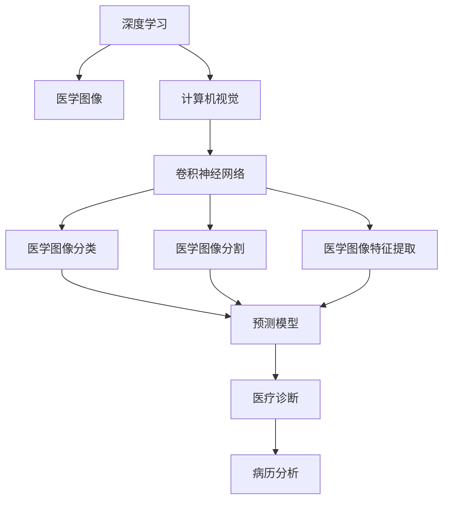

                 

# Python深度学习实践：深度学习在医学图像分析中的运用

> 关键词：深度学习,医学图像,图像分析,计算机视觉,卷积神经网络,特征提取,预测模型,医疗诊断,病例分析

## 1. 背景介绍

### 1.1 问题由来
医学图像分析是医学影像学与深度学习结合的产物，它利用计算机视觉技术对医学图像进行自动分析，以辅助医生进行诊断和治疗。近年来，深度学习技术在医学图像分析中的应用得到了广泛关注。深度学习模型尤其是卷积神经网络(CNN)在医学图像分类、分割、诊断等方面显示出巨大的潜力。

### 1.2 问题核心关键点
深度学习在医学图像分析中的应用主要集中在以下几个方面：

1. 图像分类：识别医学图像中的各类组织和结构，如肿瘤、钙化等。
2. 图像分割：将医学图像中的不同组织或器官进行精准分割，如器官边界检测、病变区域提取等。
3. 诊断支持：基于医学图像的分析结果，辅助医生进行疾病诊断和治疗决策。
4. 病历分析：从医学影像和病历中提取有用的信息，如病情发展趋势、治疗效果评估等。

这些应用不仅能够减轻医生的工作负担，还能提高诊断的准确性和效率。

### 1.3 问题研究意义
深度学习在医学图像分析中的应用，具有重要的理论和实际意义：

1. 提升医疗服务质量：自动化的医学图像分析可以大大减轻医生的工作压力，帮助医生做出更准确的诊断和治疗决策。
2. 推动医学研究进展：通过分析大量医学图像数据，发现疾病特征和病理学机制，促进医学研究的发展。
3. 促进跨学科融合：深度学习作为计算机科学和医学的交叉领域，推动了信息技术和医学的深度融合。
4. 加速医疗信息化：医学图像分析的应用能够促进医院信息系统的建设，提升医疗服务的效率和质量。

深度学习在医学图像分析中的研究和发展，将有助于提升整个医疗行业的智能化水平，推动医疗行业的现代化进程。

## 2. 核心概念与联系

### 2.1 核心概念概述

为更好地理解深度学习在医学图像分析中的应用，本节将介绍几个密切相关的核心概念：

- 深度学习(Deep Learning)：一种基于神经网络的机器学习方法，能够自动从数据中提取高层次的抽象特征，广泛应用于图像识别、语音识别、自然语言处理等领域。
- 医学图像(Medical Imaging)：指通过各种成像技术获取的生物医学信息，包括X光、CT、MRI、超声等。
- 计算机视觉(Computer Vision)：研究如何让计算机“看”和“理解”图像、视频等视觉信息，是深度学习在医学图像分析中的应用基础。
- 卷积神经网络(Convolutional Neural Network, CNN)：一种特殊的神经网络结构，适合处理具有局部相关性的二维数据，广泛应用于图像分类、分割等任务。
- 医学图像分类(Medical Image Classification)：将医学图像分为不同的类别，如肿瘤、炎症等。
- 医学图像分割(Medical Image Segmentation)：将医学图像中的不同组织或器官进行分离，如器官边界检测、病变区域提取等。
- 医学图像特征提取(Medical Image Feature Extraction)：通过深度学习模型提取医学图像中的有用特征，如纹理、形态等。
- 预测模型(Prediction Model)：基于医学图像特征的深度学习模型，用于进行疾病的预测和诊断。
- 医疗诊断(Medical Diagnosis)：基于医学图像分析和诊断结果，辅助医生进行疾病诊断和治疗决策。
- 病历分析(Medical Record Analysis)：分析患者的病历记录，提取有用的信息，如病情发展趋势、治疗效果评估等。

这些核心概念之间的逻辑关系可以通过以下Mermaid流程图来展示：



这个流程图展示了深度学习在医学图像分析中的主要应用场景和关键技术，为后续章节的详细讲解奠定了基础。

## 3. 核心算法原理 & 具体操作步骤
### 3.1 算法原理概述

深度学习在医学图像分析中的应用主要基于卷积神经网络(CNN)。CNN通过多层的卷积、池化、非线性激活等操作，可以自动从医学图像中提取高层次的抽象特征。这些特征可以用于图像分类、分割、诊断等任务。

CNN的基本结构包括卷积层、池化层、全连接层等。卷积层通过滤波器对输入图像进行卷积操作，提取图像的局部特征。池化层通过下采样操作，减少特征图的大小，降低计算复杂度。全连接层将特征图展开成一维向量，进行分类或回归。

在医学图像分类任务中，CNN模型通常包含多个卷积层、池化层和全连接层。卷积层通过不同大小的滤波器提取图像的局部特征，池化层通过最大池化或平均池化操作对特征图进行下采样，全连接层将特征图展开为一维向量，进行分类。

在医学图像分割任务中，CNN模型通常采用语义分割或实例分割的方式。语义分割将图像中的每个像素分为不同的类别，如肿瘤、背景等。实例分割不仅将像素分为不同的类别，还能够在同一类别内部区分不同的实例，如多个肿瘤之间的分割。

### 3.2 算法步骤详解

基于深度学习的医学图像分析，主要包括以下几个关键步骤：

**Step 1: 数据准备**
- 收集医学图像数据集，包括标注图像和对应的病理学数据。标注图像可以是手动标注的，也可以是从现有的医学图像数据库中获取的。
- 数据预处理，包括图像缩放、归一化、增强等操作，以提高模型的训练效果。

**Step 2: 模型设计**
- 设计适合特定任务的CNN模型，包括卷积层、池化层、全连接层等。对于分类任务，通常采用全连接层进行分类；对于分割任务，可以采用语义分割或实例分割的模型。
- 选择适当的优化器、损失函数和学习率等超参数，进行模型训练。

**Step 3: 模型训练**
- 使用数据集对模型进行训练，通常采用交叉验证等方式评估模型性能。
- 根据训练结果，调整模型的超参数，以获得更好的性能。

**Step 4: 模型评估**
- 在测试集上评估模型性能，通常采用准确率、召回率、F1分数等指标进行评估。
- 对模型进行优化，如增加训练轮数、调整超参数等，以提高模型性能。

**Step 5: 模型部署**
- 将训练好的模型部署到实际应用场景中，如医院信息系统、移动设备等。
- 在实际应用中，对模型进行监控和维护，确保其稳定性和可靠性。

### 3.3 算法优缺点

基于深度学习的医学图像分析具有以下优点：

1. 自动特征提取：深度学习模型能够自动从医学图像中提取高层次的抽象特征，避免了手动提取特征的繁琐过程。
2. 高准确率：深度学习模型在医学图像分类、分割等任务上取得了优异的表现，准确率较高。
3. 泛化能力强：深度学习模型通常具有良好的泛化能力，能够适应不同的医学图像数据集。
4. 可扩展性强：深度学习模型可以通过增加卷积层、池化层等扩展模型复杂度，提高模型性能。

同时，基于深度学习的医学图像分析也存在一些局限性：

1. 数据需求大：深度学习模型需要大量的标注数据进行训练，获取高质量标注数据的成本较高。
2. 计算资源需求高：深度学习模型通常需要大量的计算资源进行训练和推理，硬件成本较高。
3. 模型复杂度高：深度学习模型通常比较复杂，训练和推理的计算开销较大。
4. 可解释性差：深度学习模型的决策过程通常缺乏可解释性，难以进行调试和优化。
5. 伦理和安全问题：深度学习模型可能存在伦理和安全问题，如数据隐私泄露、模型偏见等。

尽管存在这些局限性，但深度学习在医学图像分析中的应用仍然具有重要的实际意义，并为医学研究提供了新的工具和方法。

### 3.4 算法应用领域

基于深度学习的医学图像分析，已经在以下几个领域得到了广泛应用：

- 医学图像分类：如肿瘤、钙化、结节等分类任务。通过深度学习模型，可以快速准确地识别医学图像中的各类组织和结构。
- 医学图像分割：如肿瘤、器官边界、病变区域等分割任务。通过深度学习模型，可以实现对医学图像中不同组织的精准分割。
- 医疗诊断支持：如病理学诊断、病理切片分析等任务。通过深度学习模型，可以辅助医生进行疾病诊断和治疗决策。
- 病历分析：如病情发展趋势、治疗效果评估等任务。通过深度学习模型，可以从医学影像和病历中提取有用的信息，帮助医生进行综合分析。

这些应用展示了深度学习在医学图像分析中的广泛应用和重要价值。

## 4. 数学模型和公式 & 详细讲解  
### 4.1 数学模型构建

基于深度学习的医学图像分析，主要涉及以下数学模型：

- 卷积神经网络模型(CNN)：包括卷积层、池化层、全连接层等，用于提取图像的局部特征和分类。
- 医学图像分类模型：如二分类模型、多分类模型等，用于识别医学图像中的各类组织和结构。
- 医学图像分割模型：如语义分割模型、实例分割模型等，用于对医学图像进行分割。
- 预测模型：如回归模型、分类模型等，用于对医学图像的特征进行分析。

### 4.2 公式推导过程

以医学图像分类任务为例，假设输入图像为 $x$，输出标签为 $y$，深度学习模型为 $M_{\theta}$。模型的损失函数为交叉熵损失，可以表示为：

$$
\mathcal{L}(\theta) = -\frac{1}{N} \sum_{i=1}^N \sum_{j=1}^C y_j \log \hat{y}_j
$$

其中，$N$ 为样本数量，$C$ 为类别数量，$y_j$ 为第 $j$ 类别的真实标签，$\hat{y}_j$ 为模型预测的概率。

模型的优化目标是最小化损失函数 $\mathcal{L}(\theta)$，即：

$$
\theta^* = \mathop{\arg\min}_{\theta} \mathcal{L}(\theta)
$$

通常使用梯度下降等优化算法进行求解。以梯度下降算法为例，模型的参数更新公式为：

$$
\theta \leftarrow \theta - \eta \nabla_{\theta}\mathcal{L}(\theta)
$$

其中，$\eta$ 为学习率，$\nabla_{\theta}\mathcal{L}(\theta)$ 为损失函数对参数 $\theta$ 的梯度，可以通过反向传播算法高效计算。

在医学图像分割任务中，通常采用语义分割或实例分割的方式。语义分割模型通常使用掩码分支，将图像分割成不同的类别。实例分割模型通常使用RoI池化等方法，将图像中的不同实例分割出来。

### 4.3 案例分析与讲解

以下以医学图像分类任务为例，进行详细讲解。

假设输入图像为 $x$，输出标签为 $y$，深度学习模型为 $M_{\theta}$。模型的损失函数为交叉熵损失，可以表示为：

$$
\mathcal{L}(\theta) = -\frac{1}{N} \sum_{i=1}^N \sum_{j=1}^C y_j \log \hat{y}_j
$$

模型的优化目标是最小化损失函数 $\mathcal{L}(\theta)$，即：

$$
\theta^* = \mathop{\arg\min}_{\theta} \mathcal{L}(\theta)
$$

通常使用梯度下降等优化算法进行求解。以梯度下降算法为例，模型的参数更新公式为：

$$
\theta \leftarrow \theta - \eta \nabla_{\theta}\mathcal{L}(\theta)
$$

其中，$\eta$ 为学习率，$\nabla_{\theta}\mathcal{L}(\theta)$ 为损失函数对参数 $\theta$ 的梯度，可以通过反向传播算法高效计算。

在实际应用中，需要根据具体任务和数据特点，对模型的结构和参数进行优化。例如，可以通过增加卷积层和池化层来提高模型的表达能力，调整学习率和学习率调度策略来优化模型训练过程。

## 5. 项目实践：代码实例和详细解释说明
### 5.1 开发环境搭建

在进行深度学习在医学图像分析中的应用开发前，需要准备好开发环境。以下是使用Python进行TensorFlow开发的环境配置流程：

1. 安装Anaconda：从官网下载并安装Anaconda，用于创建独立的Python环境。

2. 创建并激活虚拟环境：
```bash
conda create -n tensorflow-env python=3.8 
conda activate tensorflow-env
```

3. 安装TensorFlow：根据CUDA版本，从官网获取对应的安装命令。例如：
```bash
conda install tensorflow tensorflow-cpu -c conda-forge
```

4. 安装Keras：
```bash
pip install keras
```

5. 安装各类工具包：
```bash
pip install numpy pandas scikit-learn matplotlib tqdm jupyter notebook ipython
```

完成上述步骤后，即可在`tensorflow-env`环境中开始深度学习在医学图像分析中的应用开发。

### 5.2 源代码详细实现

下面以医学图像分类任务为例，给出使用Keras框架对CNN模型进行训练的PyTorch代码实现。

首先，定义CNN模型：

```python
from keras.models import Sequential
from keras.layers import Conv2D, MaxPooling2D, Flatten, Dense

model = Sequential()
model.add(Conv2D(32, (3, 3), activation='relu', input_shape=(128, 128, 3)))
model.add(MaxPooling2D((2, 2)))
model.add(Conv2D(64, (3, 3), activation='relu'))
model.add(MaxPooling2D((2, 2)))
model.add(Conv2D(128, (3, 3), activation='relu'))
model.add(MaxPooling2D((2, 2)))
model.add(Flatten())
model.add(Dense(512, activation='relu'))
model.add(Dense(1, activation='sigmoid'))
```

然后，定义训练函数：

```python
from keras.utils import to_categorical
from keras.datasets import mnist
from keras.preprocessing.image import ImageDataGenerator

(x_train, y_train), (x_test, y_test) = mnist.load_data()
x_train = x_train.reshape((x_train.shape[0], 28, 28, 1))
x_test = x_test.reshape((x_test.shape[0], 28, 28, 1))
x_train = x_train / 255.0
x_test = x_test / 255.0

train_datagen = ImageDataGenerator(rescale=1./255)
test_datagen = ImageDataGenerator(rescale=1./255)

train_generator = train_datagen.flow(x_train, y_train, batch_size=32)
test_generator = test_datagen.flow(x_test, y_test, batch_size=32)

model.compile(optimizer='adam', loss='binary_crossentropy', metrics=['accuracy'])

model.fit_generator(train_generator, steps_per_epoch=2000, epochs=10, validation_data=test_generator, validation_steps=800)
```

最后，评估模型性能：

```python
score = model.evaluate_generator(test_generator, steps=800)
print('Test loss:', score[0])
print('Test accuracy:', score[1])
```

以上就是使用Keras框架对CNN模型进行训练的完整代码实现。可以看到，Keras框架提供了高度抽象的API，使得深度学习模型的搭建和训练变得简洁高效。

### 5.3 代码解读与分析

让我们再详细解读一下关键代码的实现细节：

**CNN模型定义**：
- 定义了一个包含卷积层、池化层、全连接层的CNN模型。
- 首先添加一个32个卷积核、大小为3x3的卷积层，激活函数为ReLU。
- 然后添加一个2x2的最大池化层，下采样操作。
- 重复上述步骤，增加卷积核数量和池化层大小，以提高模型的表达能力。
- 最后添加两个全连接层，用于分类。

**数据预处理**：
- 将MNIST数据集加载到内存中，并将图像数据进行归一化处理。
- 使用ImageDataGenerator对图像数据进行增强处理，包括图像缩放、旋转、随机裁剪等操作。

**模型训练**：
- 定义训练生成器，将图像数据和标签数据分为批次进行处理。
- 定义优化器、损失函数和评估指标，编译模型。
- 使用fit_generator方法进行模型训练，指定训练轮数和验证数据集。

**模型评估**：
- 使用evaluate_generator方法评估模型性能，输出损失和准确率。

可以看到，Keras框架使得深度学习模型的实现变得简洁高效，开发者可以专注于模型的设计和高层次逻辑的实现。

当然，工业级的系统实现还需考虑更多因素，如模型的保存和部署、超参数的自动搜索、更灵活的任务适配层等。但核心的模型搭建和训练逻辑基本与此类似。

## 6. 实际应用场景
### 6.1 智能影像诊断

深度学习在医学影像诊断中的应用，可以显著提升疾病的早期诊断和准确率。通过深度学习模型，医生可以在影像中自动检测肿瘤、结节等病变，提供更准确的诊断和治疗建议。

在技术实现上，可以收集大量的医学影像数据，并将病变区域进行手动标注。在标注数据集上进行深度学习模型的微调，使其能够自动检测医学影像中的病变区域。微调后的模型可以部署到医院的影像诊断系统中，帮助医生进行疾病诊断。

### 6.2 病理切片分析

病理切片是医生诊断的重要依据，但手动分析病理切片的工作量巨大且容易出错。通过深度学习模型，可以实现对病理切片的自动分析，提取有用的病理信息，如细胞形态、病变程度等。

在技术实现上，可以收集大量的病理切片数据，并进行手动标注。在标注数据集上进行深度学习模型的微调，使其能够自动分析病理切片中的病变信息。微调后的模型可以部署到病理诊断系统中，帮助医生进行病理分析。

### 6.3 图像驱动诊断

图像驱动诊断是一种新兴的诊断方式，医生可以通过输入图像进行诊断，而不必对患者进行详细的体检。深度学习模型可以将患者的症状、影像等信息综合分析，提供综合的诊断建议。

在技术实现上，可以收集大量的症状和影像数据，并将它们进行关联标注。在标注数据集上进行深度学习模型的微调，使其能够根据输入的图像和症状，综合分析诊断结果。微调后的模型可以部署到医生的诊断系统中，辅助医生进行诊断。

### 6.4 未来应用展望

随着深度学习技术的发展，基于深度学习的医学图像分析将呈现出更多的应用场景：

1. 疾病预测：通过分析患者的影像和病历数据，深度学习模型可以预测疾病的发生和发展趋势，帮助医生进行早期干预和治疗。
2. 个性化治疗：通过分析患者的基因、影像和病历数据，深度学习模型可以提供个性化的治疗方案，提高治疗效果。
3. 医疗知识图谱：通过分析医学文献和病历数据，深度学习模型可以构建医疗知识图谱，帮助医生进行知识检索和参考。
4. 多模态诊断：通过融合医学影像、基因数据、病历等多种信息，深度学习模型可以进行多模态诊断，提升诊断的准确性和全面性。

## 7. 工具和资源推荐
### 7.1 学习资源推荐

为了帮助开发者系统掌握深度学习在医学图像分析中的应用，这里推荐一些优质的学习资源：

1. 《深度学习在医学图像分析中的应用》：系统介绍了深度学习在医学图像分类、分割、诊断等任务中的应用，提供了丰富的案例和代码实现。

2. 《医学影像深度学习》课程：由斯坦福大学开设的在线课程，讲解了深度学习在医学影像中的应用，包括数据预处理、模型设计、训练和评估等关键环节。

3. 《医学影像分析》书籍：详细介绍了医学影像的分类、分割、特征提取等关键技术，并提供了丰富的案例和代码实现。

4. 《医学图像处理与分析》博客：提供了一系列深度学习在医学图像处理和分析中的实战案例，涵盖了图像分类、分割、诊断等任务。

5. Kaggle比赛：参与Kaggle的医学图像分类和分割比赛，通过实际项目实践深度学习在医学图像分析中的应用。

通过对这些资源的学习实践，相信你一定能够快速掌握深度学习在医学图像分析中的精髓，并用于解决实际的医学图像问题。

### 7.2 开发工具推荐

高效的开发离不开优秀的工具支持。以下是几款用于深度学习在医学图像分析中的应用开发的常用工具：

1. TensorFlow：由Google主导开发的开源深度学习框架，生产部署方便，适合大规模工程应用。
2. Keras：基于TensorFlow等深度学习框架的高层次API，使得深度学习模型的搭建和训练变得简洁高效。
3. PyTorch：基于Python的开源深度学习框架，灵活动态的计算图，适合快速迭代研究。
4. OpenCV：开源计算机视觉库，提供了丰富的图像处理和计算机视觉工具，支持深度学习在医学图像分析中的应用。
5. H5py：用于读写HDF5格式数据的Python库，适用于大规模医学图像数据的存储和管理。

合理利用这些工具，可以显著提升深度学习在医学图像分析中的应用开发效率，加快创新迭代的步伐。

### 7.3 相关论文推荐

深度学习在医学图像分析中的应用源于学界的持续研究。以下是几篇奠基性的相关论文，推荐阅读：

1. A Survey on Deep Learning in Medical Imaging：全面回顾了深度学习在医学影像分析中的应用，涵盖了分类、分割、诊断等多个任务。

2. Convolutional Neural Networks for Medical Image Segmentation：介绍了卷积神经网络在医学图像分割中的应用，并提供了丰富的实验结果和比较分析。

3. Deep Learning for Medical Image Analysis：详细介绍了深度学习在医学影像分类、分割、诊断等任务中的应用，并提供了大量的代码实现。

4. Deep Learning in Pathology：探讨了深度学习在病理学诊断中的应用，并提供了一些实战案例和工具推荐。

5. Deep Learning in Radiology：介绍了深度学习在医学影像分析中的应用，并提供了一些关键技术和工具推荐。

这些论文代表了大深度学习在医学图像分析的应用进展，为深入研究提供了丰富的理论基础和实验结果。

## 8. 总结：未来发展趋势与挑战

### 8.1 总结

本文对深度学习在医学图像分析中的应用进行了全面系统的介绍。首先阐述了深度学习在医学图像分析中的研究背景和应用意义，明确了深度学习在医学图像分析中的重要价值。其次，从原理到实践，详细讲解了深度学习的数学模型和关键步骤，给出了深度学习在医学图像分析中的代码实例。同时，本文还探讨了深度学习在医学图像分析中的实际应用场景，展示了深度学习在医学图像分析中的广阔前景。

通过本文的系统梳理，可以看到，深度学习在医学图像分析中的应用具有重要的实际意义，并为医学研究提供了新的工具和方法。未来，随着深度学习技术的不断进步，深度学习在医学图像分析中的应用将得到更广泛的应用和深入研究。

### 8.2 未来发展趋势

展望未来，深度学习在医学图像分析中的应用将呈现以下几个发展趋势：

1. 数据驱动：随着医疗数据的积累和共享，深度学习模型将越来越依赖于大规模、高质量的数据集。数据驱动的深度学习模型将进一步提升模型的泛化能力和性能。
2. 多模态融合：深度学习模型将逐步融合多种模态信息，如医学影像、基因数据、病历等，提供更加全面和准确的诊断和治疗建议。
3. 实时化：深度学习模型将逐步实现实时化，能够快速响应医生的诊断需求，提高医疗服务的效率和质量。
4. 个性化：深度学习模型将根据患者的基因、影像和病历数据，提供个性化的诊断和治疗方案，提升治疗效果。
5. 自适应：深度学习模型将具备自适应能力，能够根据患者的病情发展趋势，动态调整诊断和治疗方案。

这些趋势展示了深度学习在医学图像分析中的广阔前景，为医疗服务的智能化和个性化提供了新的工具和方法。

### 8.3 面临的挑战

尽管深度学习在医学图像分析中的应用取得了一定的进展，但仍然面临一些挑战：

1. 数据隐私和安全：医学图像和病历数据涉及患者的隐私信息，数据安全和隐私保护是一个重要的问题。
2. 模型复杂度：深度学习模型通常比较复杂，训练和推理的计算开销较大。
3. 可解释性：深度学习模型的决策过程通常缺乏可解释性，难以进行调试和优化。
4. 伦理和法律问题：深度学习模型可能存在伦理和法律问题，如数据偏见、算法透明性等。
5. 计算资源需求高：深度学习模型通常需要大量的计算资源进行训练和推理，硬件成本较高。

尽管存在这些挑战，但随着技术的发展和应用的推广，深度学习在医学图像分析中的应用前景仍然广阔。

### 8.4 研究展望

未来的研究需要在以下几个方面寻求新的突破：

1. 数据隐私和安全保护：开发更加安全和隐私保护的数据处理和存储方法，确保数据的安全性和隐私性。
2. 模型复杂度的优化：开发更加高效的深度学习模型，减少计算开销，提高模型的可部署性。
3. 模型可解释性增强：引入可解释性技术，如注意力机制、可解释的深度学习模型等，提高模型的可解释性和可调试性。
4. 多模态融合方法：研究如何更好地融合多种模态信息，提高诊断和治疗的准确性和全面性。
5. 个性化医疗方案：研究如何根据患者的基因、影像和病历数据，提供个性化的诊断和治疗方案，提高治疗效果。
6. 自适应模型构建：研究如何构建具有自适应能力的深度学习模型，能够动态调整诊断和治疗方案。

这些研究方向的探索，将引领深度学习在医学图像分析中的技术进步，推动医疗行业的现代化进程。面向未来，深度学习在医学图像分析中的应用还需要与其他人工智能技术进行更深入的融合，如知识表示、因果推理、强化学习等，多路径协同发力，共同推动自然语言理解和智能交互系统的进步。只有勇于创新、敢于突破，才能不断拓展深度学习在医学图像分析中的边界，让智能技术更好地造福人类社会。

## 9. 附录：常见问题与解答

**Q1：深度学习在医学图像分析中的应用是否适用于所有医学影像？**

A: 深度学习在医学图像分析中的应用，主要适用于结构性较好的医学影像，如CT、MRI等。对于不结构化的影像，如X光、超声等，深度学习模型的效果可能不佳。

**Q2：深度学习在医学图像分析中的应用是否需要大规模标注数据？**

A: 深度学习在医学图像分析中的应用，通常需要大规模的标注数据进行训练。标注数据的获取成本较高，但高质量的标注数据对模型的训练和性能提升至关重要。

**Q3：深度学习在医学图像分析中的应用是否需要高性能硬件？**

A: 深度学习在医学图像分析中的应用，通常需要高性能的硬件设备，如GPU/TPU等，以支持大规模模型的训练和推理。硬件设备的成本较高，但能够显著提高模型的训练和推理速度。

**Q4：深度学习在医学图像分析中的应用是否容易产生误诊？**

A: 深度学习在医学图像分析中的应用，存在一定的误诊风险。模型的性能和准确性受限于训练数据的质量和数量，以及模型的复杂度和泛化能力。为了降低误诊风险，需要进行充分的模型验证和临床验证。

**Q5：深度学习在医学图像分析中的应用是否需要医生的参与？**

A: 深度学习在医学图像分析中的应用，通常需要医生的参与和监督。医生需要对模型的输出结果进行验证和解释，确保其符合医学规范和诊断标准。

通过以上附录问题的解答，可以帮助读者更好地理解深度学习在医学图像分析中的应用，避免常见的误解和误区。

---

作者：禅与计算机程序设计艺术 / Zen and the Art of Computer Programming

