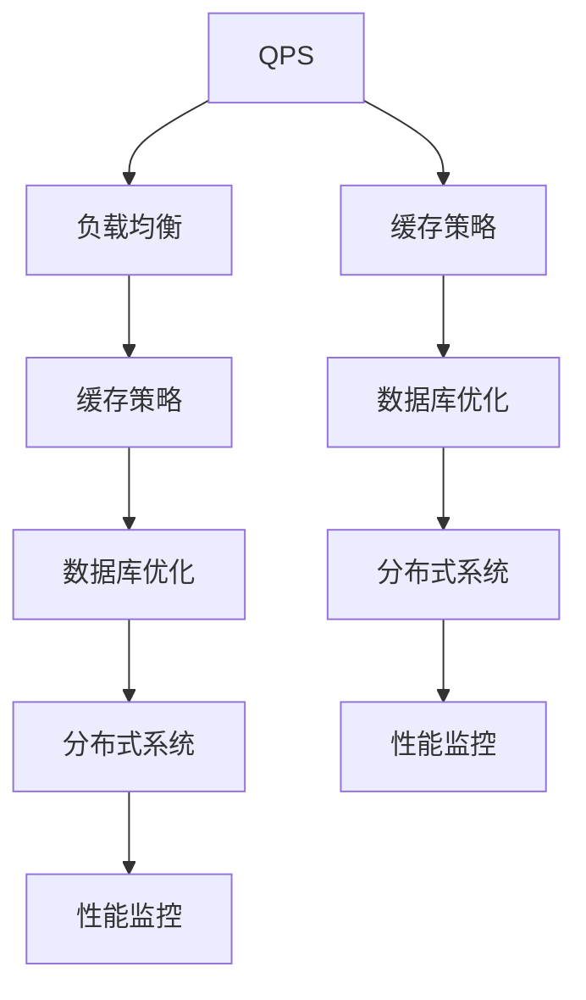

                 

# QPS与TPS的最佳实践

> 关键词：QPS, TPS, 负载均衡, 缓存策略, 数据库优化, 分布式系统, 性能监控

## 1. 背景介绍

在当今的互联网时代，企业越来越依赖在线业务，服务的性能和稳定性成为了衡量一个系统是否成功的重要指标。服务性能的指标通常包括QPS (每秒查询数) 和TPS (每秒事务数)。然而，随着业务量增长，如何有效管理和优化QPS与TPS，以确保系统的高效运行，成为了每个系统架构师和工程师必须面对的挑战。

### 1.1 问题由来

随着互联网业务的迅速增长，传统的单体应用架构难以应对高并发、大数据量的请求，导致性能瓶颈，影响用户体验。为了应对这一挑战，现代企业越来越多地采用分布式系统、微服务架构以及容器化技术。然而，即便在这些先进架构的支撑下，如何确保QPS与TPS的高效管理，仍然是一个复杂而关键的问题。

### 1.2 问题核心关键点

QPS与TPS管理的主要挑战包括：

1. **负载均衡**：如何合理分配请求到多个实例，避免单点故障和热点。
2. **缓存策略**：如何高效利用缓存，减少数据库压力，提升响应速度。
3. **数据库优化**：如何在高并发场景下保证数据库性能，避免锁竞争和资源争用。
4. **分布式系统**：如何构建高可扩展、高可靠的分布式系统，以支持更大规模的QPS与TPS。
5. **性能监控**：如何实时监控系统的QPS与TPS，及时发现和解决问题。

本文将从这些核心关键点出发，探讨QPS与TPS的最佳实践，帮助开发者构建高性能、高可靠的系统。

## 2. 核心概念与联系

### 2.1 核心概念概述

要有效管理QPS与TPS，首先需要理解几个关键概念：

- **QPS (每秒查询数)**：指每秒处理的请求数量，通常用于衡量系统的负载能力。
- **TPS (每秒事务数)**：指每秒处理的事务数量，通常用于衡量系统的业务处理能力。
- **负载均衡 (Load Balancing)**：通过分发请求到多个实例，均衡系统的负载，避免单点故障。
- **缓存策略 (Caching Strategy)**：利用缓存减少数据库压力，提升响应速度。
- **数据库优化 (Database Optimization)**：通过优化数据库结构和查询方式，提高并发处理能力。
- **分布式系统 (Distributed System)**：构建可扩展、高可靠的系统，以支持更大规模的QPS与TPS。
- **性能监控 (Performance Monitoring)**：实时监控系统性能，及时发现和解决问题。

这些概念之间存在紧密的联系，共同构成了高效管理QPS与TPS的基础。

### 2.2 核心概念原理和架构的 Mermaid 流程图



## 3. 核心算法原理 & 具体操作步骤

### 3.1 算法原理概述

QPS与TPS的最佳实践涉及多个层面的优化，包括负载均衡、缓存策略、数据库优化、分布式系统构建和性能监控。这些优化策略的共同目标是提升系统的处理能力和响应速度，同时确保系统的稳定性和可靠性。

### 3.2 算法步骤详解

#### 3.2.1 负载均衡

1. **选择负载均衡算法**：常用的负载均衡算法包括轮询、随机、最少连接、IP散列等。根据应用场景选择合适的算法。
2. **实现负载均衡**：使用Nginx、HAProxy等工具实现负载均衡。
3. **健康检查**：定期检查后端服务状态，自动剔除故障实例。

#### 3.2.2 缓存策略

1. **选择合适的缓存**：选择Redis、Memcached等缓存工具。
2. **设计缓存键**：设计合理的缓存键，避免冲突和失效。
3. **缓存一致性**：使用乐观锁或版本号等方式保证缓存一致性。
4. **缓存淘汰策略**：选择LRU、LFU等淘汰策略，优化缓存性能。

#### 3.2.3 数据库优化

1. **优化数据库结构**：合理设计表结构，使用合适的数据类型。
2. **优化查询语句**：减少查询复杂度，使用索引和分区技术。
3. **使用读写分离**：使用主从复制，提升读写分离能力。
4. **使用连接池**：使用数据库连接池技术，减少连接创建和销毁开销。

#### 3.2.4 分布式系统

1. **微服务架构**：采用微服务架构，提高系统的可扩展性。
2. **服务注册与发现**：使用Consul、Eureka等工具实现服务注册与发现。
3. **限流与降级**：设置限流与降级策略，避免系统过载。
4. **分布式事务**：使用TCC或SAGA模式处理分布式事务。

#### 3.2.5 性能监控

1. **监控指标**：监控QPS、TPS、响应时间、错误率等关键指标。
2. **报警机制**：设置报警阈值，自动报警。
3. **日志分析**：使用ELK Stack等工具分析日志，查找问题根源。

### 3.3 算法优缺点

#### 3.3.1 优点

- **提升系统处理能力**：通过合理的负载均衡和缓存策略，显著提升系统的处理能力，应对高并发请求。
- **优化数据库性能**：通过优化数据库结构和查询语句，减少锁竞争和资源争用，提升数据库的并发处理能力。
- **构建高可靠分布式系统**：通过微服务架构和分布式事务处理，构建高可扩展、高可靠的系统。
- **实时监控与问题预警**：通过性能监控和报警机制，实时发现和解决问题，保障系统稳定运行。

#### 3.3.2 缺点

- **实施复杂**：实施负载均衡、缓存策略、数据库优化、分布式系统构建和性能监控等优化策略，需要综合考虑多方面因素，实施复杂。
- **维护成本高**：优化后的系统需要持续维护和调整，维护成本较高。
- **资源消耗大**：实施这些优化策略需要额外的硬件资源，可能带来一定的成本压力。

### 3.4 算法应用领域

这些最佳实践广泛应用于金融、电商、游戏、社交媒体等高并发、高可靠的系统，如阿里巴巴、腾讯、亚马逊等公司的核心业务系统。

## 4. 数学模型和公式 & 详细讲解 & 举例说明

### 4.1 数学模型构建

为更好地理解QPS与TPS的管理，本节将介绍几个关键数学模型：

- **负载均衡模型**：
  $$
  W_i = \frac{1}{N}\sum_{j=1}^{N} \frac{R_j}{S_j}
  $$
  其中，$W_i$ 为第 $i$ 个实例的权重，$R_j$ 为第 $j$ 个请求的速率，$S_j$ 为第 $j$ 个实例的负载。

- **缓存一致性模型**：
  $$
  V_i = R_i \times C_i
  $$
  其中，$V_i$ 为第 $i$ 个请求的命中率，$R_i$ 为第 $i$ 个请求的速率，$C_i$ 为第 $i$ 个请求的缓存大小。

### 4.2 公式推导过程

以负载均衡模型为例，推导其核心公式。

假设系统中有 $N$ 个实例，每个实例的负载为 $S_j$，请求速率分别为 $R_j$，则系统总负载为：
$$
S = \sum_{j=1}^{N} S_j
$$

负载均衡的权重计算公式为：
$$
W_i = \frac{S_i}{S}
$$

但在实际应用中，我们无法实时计算每个实例的负载 $S_j$。因此，我们可以使用平均速率作为权重计算的依据，即：
$$
W_i = \frac{1}{N}\sum_{j=1}^{N} \frac{R_j}{S_j}
$$

### 4.3 案例分析与讲解

以阿里巴巴的“双11”大促活动为例，分析其在QPS与TPS管理中的最佳实践：

1. **负载均衡**：使用Nginx实现负载均衡，自动分配请求到多个实例，防止单点故障。
2. **缓存策略**：使用Redis缓存热点数据，减少数据库压力，提升响应速度。
3. **数据库优化**：使用读写分离、连接池等技术，优化数据库性能。
4. **分布式系统**：采用微服务架构，服务注册与发现，限流与降级策略，构建高可靠系统。
5. **性能监控**：使用APM工具监控系统性能，实时发现和解决问题。

## 5. 项目实践：代码实例和详细解释说明

### 5.1 开发环境搭建

在进行QPS与TPS管理实践前，我们需要准备好开发环境。以下是使用Python和Nginx搭建环境的步骤：

1. **安装Python**：从官网下载并安装Python，例如安装Python 3.7版本。
2. **安装Nginx**：从官网下载并安装Nginx，例如安装Nginx 1.17版本。
3. **安装虚拟主机环境**：使用Docker或Kubernetes等容器化技术搭建虚拟主机环境。

### 5.2 源代码详细实现

以下是一个使用Python Flask框架和Nginx负载均衡的简单代码示例：

**Nginx配置文件**：

```nginx
upstream backend {
    server app1:8000;
    server app2:8000;
}

server {
    listen 80;
    location / {
        proxy_pass http://backend;
        proxy_set_header Host $host;
        proxy_set_header X-Real-IP $remote_addr;
        proxy_set_header X-Forwarded-For $proxy_add_x_forwarded_for;
        proxy_set_header X-Forwarded-Proto $scheme;
    }
}
```

**Flask应用代码**：

```python
from flask import Flask, request
import time

app = Flask(__name__)

@app.route('/')
def index():
    name = request.args.get('name', '')
    time.sleep(1)
    return f'Hello, {name}!'

if __name__ == '__main__':
    app.run(host='0.0.0.0', port=8000)
```

### 5.3 代码解读与分析

**Nginx配置文件解释**：
- `upstream backend` 定义了后端服务集群，包含两个应用实例。
- `server` 定义了Nginx服务器的监听端口和请求转发规则。

**Flask应用代码解释**：
- `index()` 函数处理请求，返回一个简单的问候信息。
- `time.sleep(1)` 模拟处理请求的耗时，模拟真实的应用场景。

### 5.4 运行结果展示

通过上述配置和代码，Nginx负载均衡器可以高效地分发请求到两个Flask应用实例，保持系统的稳定运行。

## 6. 实际应用场景

### 6.1 电商平台的订单系统

电商平台的订单系统需要处理大量的订单请求和事务处理，要求系统具备高并发、高可靠性。通过实施负载均衡、缓存策略、数据库优化、分布式系统构建和性能监控，可以确保系统在高流量场景下稳定运行。

**负载均衡**：使用Nginx负载均衡器，分发订单请求到多个订单处理实例，避免单点故障。

**缓存策略**：使用Redis缓存订单信息，减少数据库查询压力，提升订单处理速度。

**数据库优化**：使用MySQL的读写分离、连接池等技术，优化数据库性能。

**分布式系统**：采用微服务架构，订单服务注册与发现，设置限流与降级策略，构建高可靠系统。

**性能监控**：使用APM工具监控订单系统性能，实时发现和解决问题。

### 6.2 金融交易系统的交易系统

金融交易系统需要处理大量的交易请求和事务处理，要求系统具备高并发、高可靠性。通过实施负载均衡、缓存策略、数据库优化、分布式系统构建和性能监控，可以确保系统在高流量场景下稳定运行。

**负载均衡**：使用HAProxy负载均衡器，分发交易请求到多个交易处理实例，避免单点故障。

**缓存策略**：使用Redis缓存交易信息，减少数据库查询压力，提升交易处理速度。

**数据库优化**：使用MySQL的读写分离、连接池等技术，优化数据库性能。

**分布式系统**：采用微服务架构，交易服务注册与发现，设置限流与降级策略，构建高可靠系统。

**性能监控**：使用APM工具监控交易系统性能，实时发现和解决问题。

### 6.3 社交媒体的即时通讯系统

社交媒体的即时通讯系统需要处理大量的即时消息请求，要求系统具备高并发、低延迟。通过实施负载均衡、缓存策略、数据库优化、分布式系统构建和性能监控，可以确保系统在实时通讯场景下稳定运行。

**负载均衡**：使用Nginx负载均衡器，分发即时消息请求到多个即时消息处理实例，避免单点故障。

**缓存策略**：使用Redis缓存即时消息，减少数据库查询压力，提升即时消息处理速度。

**数据库优化**：使用MySQL的读写分离、连接池等技术，优化数据库性能。

**分布式系统**：采用微服务架构，即时消息服务注册与发现，设置限流与降级策略，构建高可靠系统。

**性能监控**：使用APM工具监控即时通讯系统性能，实时发现和解决问题。

### 6.4 未来应用展望

随着技术的不断进步，未来的QPS与TPS管理将更加智能和自动化，主要趋势包括：

1. **智能负载均衡**：使用机器学习算法，实时动态调整负载均衡策略，优化资源利用率。
2. **自适应缓存策略**：根据请求的负载情况，动态调整缓存策略，提高缓存效率。
3. **智能数据库优化**：使用机器学习算法，实时优化数据库查询和索引策略，提升数据库性能。
4. **分布式智能系统**：使用自动化工具，实现微服务编排和部署，提升系统的可扩展性。
5. **实时性能监控**：使用机器学习算法，实时预测和优化系统性能，避免性能瓶颈。

## 7. 工具和资源推荐

### 7.1 学习资源推荐

为了帮助开发者系统掌握QPS与TPS的最佳实践，这里推荐一些优质的学习资源：

1. **《高性能系统设计》**：介绍系统设计的原则和实践，涵盖负载均衡、缓存策略、数据库优化等多个方面。
2. **《分布式系统原理与设计》**：介绍分布式系统的基础知识和设计原则，适合深入学习分布式系统。
3. **《阿里巴巴技术内参》**：收录阿里巴巴的技术实践和经验，涵盖负载均衡、缓存策略、数据库优化等多个方面。
4. **《高性能数据库》**：介绍数据库的高性能优化技术和实践，适合学习数据库优化。
5. **《Kubernetes：入门与实战》**：介绍Kubernetes的基础知识和实践，适合学习容器化和微服务架构。

通过学习这些资源，相信你一定能够快速掌握QPS与TPS管理的精髓，并用于解决实际的性能问题。

### 7.2 开发工具推荐

高效的开发离不开优秀的工具支持。以下是几款用于QPS与TPS管理开发的常用工具：

1. **Nginx**：高效的网络代理服务器，适合作为负载均衡器。
2. **Redis**：高性能的内存缓存系统，适合作为缓存工具。
3. **MySQL**：稳定的关系型数据库，适合处理高并发事务。
4. **Kubernetes**：容器编排系统，适合管理微服务架构。
5. **Prometheus**：开源的监控系统，适合实时监控系统性能。
6. **APM工具**：如New Relic、Datadog等，适合监控和分析应用性能。

合理利用这些工具，可以显著提升QPS与TPS管理的开发效率，加快创新迭代的步伐。

### 7.3 相关论文推荐

QPS与TPS管理的研究源于学界的持续研究。以下是几篇奠基性的相关论文，推荐阅读：

1. **《网络负载均衡》**：介绍网络负载均衡的基本原理和算法，适合了解负载均衡。
2. **《分布式缓存系统》**：介绍分布式缓存系统的设计和实现，适合了解缓存策略。
3. **《高并发数据库系统》**：介绍高并发数据库系统的设计和实现，适合了解数据库优化。
4. **《微服务架构》**：介绍微服务架构的设计原则和实践，适合了解分布式系统构建。
5. **《实时系统监控》**：介绍实时系统监控的基本原理和算法，适合了解性能监控。

这些论文代表了大语言模型微调技术的发展脉络。通过学习这些前沿成果，可以帮助研究者把握学科前进方向，激发更多的创新灵感。

## 8. 总结：未来发展趋势与挑战

### 8.1 总结

本文对QPS与TPS的最佳实践进行了全面系统的介绍。首先阐述了QPS与TPS管理的背景和重要性，明确了负载均衡、缓存策略、数据库优化、分布式系统构建和性能监控等核心关键点。其次，从原理到实践，详细讲解了QPS与TPS管理的数学模型和具体步骤，给出了代码实现示例。同时，本文还探讨了QPS与TPS管理在电商、金融、社交媒体等多个实际应用场景中的应用，展示了QPS与TPS管理的广泛适用性。最后，本文精选了相关学习资源和开发工具，力求为读者提供全方位的技术指引。

通过本文的系统梳理，可以看到，QPS与TPS管理是系统高性能、高可靠的关键所在，深刻影响着系统的稳定性和用户体验。QPS与TPS管理的核心在于综合考虑负载均衡、缓存策略、数据库优化、分布式系统构建和性能监控等多个方面，全面提升系统性能和可靠性。未来，随着技术的不断进步，QPS与TPS管理将更加智能和自动化，为构建高性能、高可靠的系统提供坚实的基础。

### 8.2 未来发展趋势

展望未来，QPS与TPS管理将呈现以下几个发展趋势：

1. **智能负载均衡**：使用机器学习算法，实时动态调整负载均衡策略，优化资源利用率。
2. **自适应缓存策略**：根据请求的负载情况，动态调整缓存策略，提高缓存效率。
3. **智能数据库优化**：使用机器学习算法，实时优化数据库查询和索引策略，提升数据库性能。
4. **分布式智能系统**：使用自动化工具，实现微服务编排和部署，提升系统的可扩展性。
5. **实时性能监控**：使用机器学习算法，实时预测和优化系统性能，避免性能瓶颈。

以上趋势凸显了QPS与TPS管理的广阔前景。这些方向的探索发展，必将进一步提升系统的性能和可靠性，为构建高性能、高可靠的系统铺平道路。

### 8.3 面临的挑战

尽管QPS与TPS管理技术已经取得了瞩目成就，但在迈向更加智能化、普适化应用的过程中，它仍面临着诸多挑战：

1. **实施复杂**：QPS与TPS管理涉及多个层面的优化，实施复杂。
2. **维护成本高**：优化后的系统需要持续维护和调整，维护成本较高。
3. **资源消耗大**：实施这些优化策略需要额外的硬件资源，可能带来一定的成本压力。
4. **监控难度大**：性能监控系统需要实时收集和分析海量数据，监控难度较大。
5. **安全问题**：优化后的系统需要考虑安全问题，防止系统被攻击。

### 8.4 研究展望

面对QPS与TPS管理所面临的挑战，未来的研究需要在以下几个方面寻求新的突破：

1. **自动化优化**：使用自动化工具，实现智能优化，降低实施复杂度和维护成本。
2. **低成本优化**：探索低成本的优化策略，如软件定义网络、云资源弹性扩展等。
3. **安全监控**：加强安全监控，防止系统被攻击，保障系统安全稳定。
4. **多维度监控**：引入更多维度的监控指标，全面评估系统性能和稳定性。

这些研究方向将推动QPS与TPS管理技术不断进步，为构建高性能、高可靠的系统提供坚实的基础。

## 9. 附录：常见问题与解答

**Q1: 如何选择合适的负载均衡算法？**

A: 选择负载均衡算法时需要考虑系统的特点和负载情况。常用的负载均衡算法包括轮询、随机、最少连接、IP散列等。轮询适用于简单的系统，随机适用于请求分布均匀的系统，最少连接适用于连接数较少的系统，IP散列适用于请求分布均匀的系统。

**Q2: 什么是缓存策略？**

A: 缓存策略是指通过缓存中间结果，减少数据库查询压力，提升系统响应速度。常见的缓存策略包括使用Redis、Memcached等工具，设计合理的缓存键，选择LRU、LFU等淘汰策略。

**Q3: 数据库优化的常见方法有哪些？**

A: 数据库优化的常见方法包括优化数据库结构、优化查询语句、使用读写分离、使用连接池等。优化数据库结构可以合理设计表结构，使用合适的数据类型；优化查询语句可以减少查询复杂度，使用索引和分区技术；使用读写分离可以提升读写分离能力；使用连接池可以减少连接创建和销毁开销。

**Q4: 什么是分布式系统？**

A: 分布式系统是指将一个应用拆分为多个微服务，通过网络通信实现协同工作的系统。分布式系统可以提升系统的可扩展性和高可靠性，通过微服务架构、服务注册与发现、限流与降级策略等技术实现。

**Q5: 如何实时监控系统性能？**

A: 实时监控系统性能需要使用APM工具，如New Relic、Datadog等，监控关键指标如QPS、TPS、响应时间、错误率等，设置报警阈值，自动报警。同时使用ELK Stack等工具分析日志，查找问题根源。

---

作者：禅与计算机程序设计艺术 / Zen and the Art of Computer Programming

