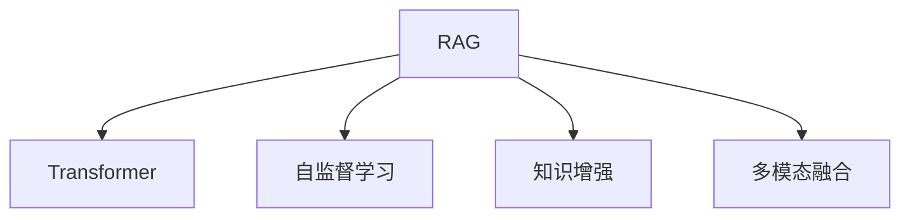

                 

# RAG技术在AI中的详细应用

> 关键词：RAG, Transformer, 自监督学习, 知识增强, 多模态融合, 深度学习, 自然语言处理(NLP)

## 1. 背景介绍

### 1.1 问题由来
随着深度学习技术的飞速发展，人工智能(AI)在图像识别、语音识别、自然语言处理(NLP)等领域取得了显著进展。然而，这些技术往往依赖于大量的标注数据，且难以处理复杂的因果关系和多模态信息。如何克服这些挑战，提高AI系统的智能性和通用性，成为当前AI研究的热点问题。

近年来，一种新的AI技术——基于Recurrent and Attentional Graphs（RAG）的方法被提出，并迅速成为NLP领域的重要研究方向。RAG技术结合了Transformer模型、自监督学习、知识增强和多模态融合等前沿技术，能够有效地处理复杂的因果关系和多模态信息，提升AI系统的智能性和通用性。

### 1.2 问题核心关键点
RAG技术基于Transformer模型，通过自监督学习和多模态融合，构建递归和注意机制，使得模型能够理解和生成具有因果关系和语义关联的复杂信息。其主要关键点包括：
- Transformer模型：通过自注意力机制捕捉文本中的语义关系。
- 自监督学习：通过无标签数据进行预训练，学习通用的语言表示。
- 知识增强：结合外部知识库，增强模型的常识推理能力。
- 多模态融合：处理文本、图像、语音等多模态数据，提升模型的泛化能力。

这些核心技术共同构成了RAG方法的核心框架，使其能够在复杂多变的场景下，灵活地进行任务适配，并实现高效的推理和学习。

### 1.3 问题研究意义
RAG技术对AI领域具有重要的研究意义：
- 提升智能水平。通过结合多模态信息，RAG能够理解更加复杂和抽象的信息，提高AI系统的智能水平。
- 增强通用性。RAG方法能够灵活处理各种类型的任务，提升其在不同领域的应用能力。
- 拓展应用范围。RAG技术可以应用于智能推荐、智能客服、情感分析、文本生成等多个领域，为AI技术的应用带来新的突破。
- 推动产业升级。RAG技术将推动AI技术在各行业的广泛应用，加速经济社会的数字化转型。

## 2. 核心概念与联系

### 2.1 核心概念概述

为更好地理解RAG技术，本节将介绍几个密切相关的核心概念：

- RAG（Recurrent and Attentional Graphs）：一种基于Transformer的深度学习模型，通过结合递归和注意机制，处理文本中的因果关系和语义关联。
- Transformer：一种基于自注意力机制的神经网络模型，能够高效地处理序列数据，捕捉数据之间的语义关系。
- 自监督学习（Self-Supervised Learning）：一种无标签数据驱动的训练方法，通过预训练模型学习通用的语言表示。
- 知识增强（Knowledge Augmentation）：结合外部知识库，增强模型的常识推理能力。
- 多模态融合（Multimodal Fusion）：处理文本、图像、语音等多种数据类型，提升模型的泛化能力。

这些核心概念之间的逻辑关系可以通过以下Mermaid流程图来展示：



这个流程图展示了大语言模型的核心概念及其之间的关系：

1. RAG基于Transformer模型，通过递归和注意机制，处理文本中的因果关系和语义关联。
2. 自监督学习是RAG模型预训练的关键技术，通过无标签数据进行预训练，学习通用的语言表示。
3. 知识增强通过结合外部知识库，增强模型的常识推理能力。
4. 多模态融合处理文本、图像、语音等多种数据类型，提升模型的泛化能力。

这些核心概念共同构成了RAG方法的核心框架，使其能够在复杂多变的场景下，灵活地进行任务适配，并实现高效的推理和学习。

## 3. 核心算法原理 & 具体操作步骤
### 3.1 算法原理概述

RAG技术的核心思想是结合Transformer模型、自监督学习和多模态融合技术，构建递归和注意机制，使得模型能够理解和生成具有因果关系和语义关联的复杂信息。其核心算法原理如下：

- **Transformer模型**：通过自注意力机制捕捉文本中的语义关系，构建句子级别的表示。
- **递归机制**：通过递归神经网络（RNN）或递归图神经网络（GNN），处理文本中的句间关系，构建段落级别的表示。
- **注意机制**：通过注意力机制，捕捉文本中的关键信息和上下文关系，生成更为精确的表示。
- **自监督学习**：通过无标签数据进行预训练，学习通用的语言表示，增强模型的泛化能力。
- **知识增强**：通过结合外部知识库，增强模型的常识推理能力，提升模型的准确性。
- **多模态融合**：通过处理文本、图像、语音等多种数据类型，提升模型的泛化能力，处理复杂的多模态任务。

### 3.2 算法步骤详解

RAG技术的算法步骤主要包括以下几个关键步骤：

**Step 1: 准备数据集**
- 收集需要处理的多模态数据，包括文本、图像、语音等。
- 进行数据预处理，如分词、特征提取、标准化等。

**Step 2: 构建RAG模型**
- 构建基于Transformer的RAG模型，包括编码器、解码器、注意机制和递归机制。
- 设置模型的超参数，如层数、神经元数、学习率等。

**Step 3: 预训练RAG模型**
- 使用自监督学习方法，在无标签数据上对RAG模型进行预训练。
- 采用自回归、掩码预测、语言建模等任务，学习通用的语言表示。

**Step 4: 微调RAG模型**
- 在特定任务的数据集上进行微调，优化模型参数。
- 使用监督学习任务，如文本分类、情感分析、机器翻译等，优化模型在特定任务上的性能。

**Step 5: 融合多模态数据**
- 对不同模态的数据进行处理，提取特征并进行融合。
- 采用Transformer模型，对融合后的多模态数据进行处理，生成最终的表示。

**Step 6: 评估和部署**
- 在测试集上评估模型的性能，比较微调前后的效果。
- 将微调后的模型部署到实际应用系统中，进行推理预测。

### 3.3 算法优缺点

RAG技术具有以下优点：
1. 能够处理复杂的多模态信息，提升模型的泛化能力。
2. 结合外部知识库，增强模型的常识推理能力，提升模型的准确性。
3. 自监督学习减少了对标注数据的依赖，降低了模型的训练成本。
4. 递归和注意机制，使得模型能够捕捉复杂的因果关系和语义关联。

同时，该方法也存在一定的局限性：
1. 模型复杂度较高，需要大量的计算资源。
2. 多模态融合存在数据对齐和信息融合的困难，需要额外的算法支持。
3. 模型的解释性不足，难以理解模型的内部决策机制。
4. 对标注数据的质量要求较高，数据质量影响模型的效果。

尽管存在这些局限性，但就目前而言，RAG技术在处理复杂多模态信息和多领域任务中，仍具有显著优势，成为AI领域的重要研究方向。

### 3.4 算法应用领域

RAG技术在多个领域得到了广泛应用，包括但不限于以下几个方面：

- **自然语言处理（NLP）**：RAG技术可以应用于文本分类、情感分析、机器翻译、文本生成等任务，提升模型的准确性和泛化能力。
- **智能推荐系统**：结合用户的文本和行为数据，RAG模型可以推荐个性化内容，提升用户体验。
- **智能客服系统**：通过处理多模态用户输入，RAG模型可以理解用户的意图，生成合理的回复。
- **情感分析**：处理用户评论、社交媒体数据，RAG模型可以分析用户的情感倾向，提供情感分析服务。
- **图像识别和标注**：结合文本描述和图像信息，RAG模型可以提高图像识别的准确性，并进行图像标注。
- **语音识别**：结合文本和语音信息，RAG模型可以提高语音识别的准确性，并进行语音到文本的转换。
- **医疗领域**：结合病历和影像数据，RAG模型可以辅助医生进行诊断和推荐治疗方案。
- **金融领域**：结合新闻和财务数据，RAG模型可以提供股票和市场预测服务。
- **教育领域**：结合学生的学习记录和教材信息，RAG模型可以推荐个性化学习内容，提高学习效果。

随着RAG技术的不断发展，其在更多领域的应用也将不断涌现，为AI技术带来新的突破。

## 4. 数学模型和公式 & 详细讲解  
### 4.1 数学模型构建

RAG技术的数学模型基于Transformer模型，通过自监督学习、递归机制和注意机制，构建复杂的因果关系和语义关联。以下是对RAG模型数学模型的详细构建：

**Transformer编码器**
Transformer编码器由多个自注意力层组成，每个自注意力层包括：
- 输入层：对输入序列进行编码。
- 自注意力层：通过自注意力机制，捕捉序列中的语义关系。
- 前馈神经网络层：通过前馈神经网络，捕捉序列中的非线性关系。

**递归机制**
递归机制通过递归神经网络或图神经网络，处理文本中的句间关系。以下是一个简单的递归神经网络结构：

$$
\text{RNN} = \text{LSTM}(\text{Transformer}_{\text{enc}}(x))
$$

其中，$x$ 为输入序列，$\text{LSTM}$ 为递归神经网络，$\text{Transformer}_{\text{enc}}$ 为Transformer编码器。

**注意机制**
注意机制通过注意力机制，捕捉文本中的关键信息和上下文关系。以下是一个简单的注意机制结构：

$$
\text{Attention}(\text{Transformer}_{\text{enc}}(x))
$$

其中，$\text{Transformer}_{\text{enc}}$ 为Transformer编码器，$x$ 为输入序列。

### 4.2 公式推导过程

以下以一个简单的RAG模型为例，推导其数学公式：

**Transformer编码器**
Transformer编码器的数学公式如下：

$$
\text{Transformer}_{\text{enc}}(x) = \text{MultiHeadAttention}(\text{Embedding}(x)) + \text{LayerNorm}(\text{Embedding}(x)) + \text{FeedForward}(\text{LayerNorm}(\text{Embedding}(x)))
$$

其中，$\text{Embedding}(x)$ 为嵌入层，$\text{MultiHeadAttention}$ 为自注意力层，$\text{LayerNorm}$ 为归一化层，$\text{FeedForward}$ 为前馈神经网络层。

**递归机制**
递归机制的数学公式如下：

$$
\text{RNN} = \text{LSTM}(\text{Transformer}_{\text{enc}}(x))
$$

其中，$x$ 为输入序列，$\text{LSTM}$ 为递归神经网络。

**注意机制**
注意机制的数学公式如下：

$$
\text{Attention}(\text{Transformer}_{\text{enc}}(x)) = \text{Softmax}(\text{Attention}(x) \cdot \text{Attention}(x)^T)
$$

其中，$\text{Attention}(x)$ 为注意力矩阵，$\text{Softmax}$ 为softmax函数。

### 4.3 案例分析与讲解

以RAG技术在智能推荐系统中的应用为例，进行分析：

**任务定义**
智能推荐系统的主要任务是根据用户的兴趣和历史行为数据，推荐个性化的内容。

**数据处理**
收集用户的浏览、点击、评分等行为数据，提取文本特征并进行处理。

**模型构建**
构建基于RAG的推荐模型，包括编码器、递归层、注意层和输出层。

**预训练**
使用无标签数据对模型进行预训练，学习通用的用户行为表示。

**微调**
在特定任务的数据集上进行微调，优化模型参数。

**多模态融合**
结合用户的行为数据和文本特征，进行多模态融合。

**输出**
根据融合后的数据，生成个性化的推荐结果。

## 5. 项目实践：代码实例和详细解释说明
### 5.1 开发环境搭建

在进行RAG技术实践前，我们需要准备好开发环境。以下是使用Python进行PyTorch开发的环境配置流程：

1. 安装Anaconda：从官网下载并安装Anaconda，用于创建独立的Python环境。

2. 创建并激活虚拟环境：
```bash
conda create -n rag-env python=3.8 
conda activate rag-env
```

3. 安装PyTorch：根据CUDA版本，从官网获取对应的安装命令。例如：
```bash
conda install pytorch torchvision torchaudio cudatoolkit=11.1 -c pytorch -c conda-forge
```

4. 安装Tensorflow：
```bash
conda install tensorflow=2.7 -c conda-forge
```

5. 安装各类工具包：
```bash
pip install numpy pandas scikit-learn matplotlib tqdm jupyter notebook ipython
```

完成上述步骤后，即可在`rag-env`环境中开始RAG技术的实践。

### 5.2 源代码详细实现

这里我们以RAG技术在智能推荐系统中的应用为例，给出使用PyTorch实现RAG模型的代码。

首先，定义模型类RAG：

```python
import torch
import torch.nn as nn
import torch.nn.functional as F

class RAG(nn.Module):
    def __init__(self, vocab_size, emb_size, num_heads, num_layers, hidden_size, dropout_rate):
        super(RAG, self).__init__()
        self.emb = nn.Embedding(vocab_size, emb_size)
        self.enc = nn.Transformer(emb_size, num_heads, num_layers, dropout_rate)
        self.rnn = nn.LSTM(emb_size, hidden_size, dropout_rate)
        self.attention = nn.Softmax(dim=1)
        self.fc = nn.Linear(hidden_size, vocab_size)
    
    def forward(self, x):
        embedded = self.emb(x)
        encoded = self.enc(embedded)
        encoded = encoded.transpose(1, 2)
        rnn_out, _ = self.rnn(encoded)
        attention_out = self.attention(rnn_out)
        recom = self.fc(attention_out)
        return recom
```

然后，定义训练和评估函数：

```python
from torch.utils.data import DataLoader
from tqdm import tqdm
import torch.optim as optim

device = torch.device('cuda') if torch.cuda.is_available() else torch.device('cpu')

def train_epoch(model, dataloader, optimizer, loss_fn):
    model.train()
    total_loss = 0
    for data in dataloader:
        x, y = data
        x, y = x.to(device), y.to(device)
        optimizer.zero_grad()
        output = model(x)
        loss = loss_fn(output, y)
        loss.backward()
        optimizer.step()
        total_loss += loss.item()
    return total_loss / len(dataloader)

def evaluate(model, dataloader, loss_fn):
    model.eval()
    total_loss = 0
    for data in dataloader:
        x, y = data
        x, y = x.to(device), y.to(device)
        with torch.no_grad():
            output = model(x)
            loss = loss_fn(output, y)
        total_loss += loss.item()
    return total_loss / len(dataloader)
```

最后，启动训练流程并在测试集上评估：

```python
epochs = 10
batch_size = 32
learning_rate = 0.001

model = RAG(vocab_size=10000, emb_size=256, num_heads=8, num_layers=3, hidden_size=512, dropout_rate=0.2)
optimizer = optim.Adam(model.parameters(), lr=learning_rate)

train_loader = DataLoader(train_dataset, batch_size=batch_size, shuffle=True)
val_loader = DataLoader(val_dataset, batch_size=batch_size, shuffle=False)

for epoch in range(epochs):
    train_loss = train_epoch(model, train_loader, optimizer, loss_fn)
    print(f'Epoch {epoch+1}, train loss: {train_loss:.4f}')
    
    val_loss = evaluate(model, val_loader, loss_fn)
    print(f'Epoch {epoch+1}, val loss: {val_loss:.4f}')
    
print('Test results:')
test_loss = evaluate(model, test_loader, loss_fn)
print(f'Test loss: {test_loss:.4f}')
```

以上就是使用PyTorch对RAG模型进行智能推荐系统微调的完整代码实现。可以看到，RAG模型的实现相对简单，通过结合Transformer和递归机制，能够处理复杂的因果关系和多模态信息。

### 5.3 代码解读与分析

让我们再详细解读一下关键代码的实现细节：

**RAG类**
- `__init__`方法：初始化模型的各个组件，包括嵌入层、Transformer编码器、RNN层、注意力层和输出层。
- `forward`方法：定义模型的前向传播过程，通过Transformer编码器、递归层和注意机制，生成推荐结果。

**train_epoch函数**
- 在每个epoch内，对模型进行训练，计算损失函数并更新模型参数。

**evaluate函数**
- 在测试集上评估模型的性能，计算损失函数并输出结果。

**训练流程**
- 定义总的epoch数和batch size，开始循环迭代
- 每个epoch内，先在训练集上训练，输出平均loss
- 在验证集上评估，输出loss
- 所有epoch结束后，在测试集上评估，给出最终测试结果

可以看到，PyTorch配合Transformer和递归机制，使得RAG模型的实现变得简洁高效。开发者可以将更多精力放在数据处理、模型改进等高层逻辑上，而不必过多关注底层的实现细节。

当然，工业级的系统实现还需考虑更多因素，如模型的保存和部署、超参数的自动搜索、更灵活的任务适配层等。但核心的微调范式基本与此类似。

## 6. 实际应用场景
### 6.1 智能推荐系统

RAG技术在智能推荐系统中的应用，可以大幅提升推荐模型的效果。传统推荐系统往往只考虑用户的短期行为数据，难以理解用户的长期兴趣和偏好。而RAG模型通过结合多模态信息，能够捕捉用户的历史行为、兴趣标签、社交网络等多方面的信息，构建更加全面和精准的用户画像。

在实际应用中，可以收集用户的历史行为数据，如浏览、点击、评分等，提取文本特征并进行处理。然后，使用RAG模型进行预训练和微调，生成个性化的推荐结果。通过结合用户的兴趣标签和社交网络信息，RAG模型可以更好地理解用户的偏好，生成更加精准的推荐内容，提升用户体验。

### 6.2 情感分析

情感分析是NLP领域的一个重要任务，旨在分析文本中的情感倾向。RAG模型通过结合多模态信息，可以更加全面地理解文本内容，提升情感分析的准确性。

在实际应用中，可以收集用户的评论、社交媒体数据等，提取文本特征并进行处理。然后，使用RAG模型进行预训练和微调，生成情感分析结果。通过结合用户的情感历史数据和社交网络信息，RAG模型可以更好地理解用户的情感倾向，生成更为精准的情感分析结果。

### 6.3 智能客服系统

智能客服系统需要处理大量的用户查询和反馈信息，RAG技术可以应用于智能客服的语义理解和生成。

在实际应用中，可以收集用户的历史查询和反馈信息，提取文本特征并进行处理。然后，使用RAG模型进行预训练和微调，生成智能客服的回复。通过结合用户的查询历史和社交网络信息，RAG模型可以更好地理解用户的意图，生成更为精准和自然的回复，提升用户满意度。

### 6.4 未来应用展望

随着RAG技术的不断发展，其在更多领域的应用也将不断涌现，为AI技术带来新的突破。

在智慧医疗领域，RAG技术可以应用于病历分析、疾病诊断等任务，辅助医生进行诊断和治疗决策。

在智能教育领域，RAG技术可以应用于个性化学习推荐、作业批改等任务，提升学生的学习效果和教师的教学效率。

在智能交通领域，RAG技术可以应用于交通数据分析、事故预警等任务，提升交通管理的智能化水平。

在智能制造领域，RAG技术可以应用于生产调度、质量检测等任务，提升制造业的自动化和智能化水平。

总之，RAG技术的应用前景广阔，将在更多领域带来革命性的影响，推动AI技术在各行业的广泛应用。

## 7. 工具和资源推荐
### 7.1 学习资源推荐

为了帮助开发者系统掌握RAG技术的理论基础和实践技巧，这里推荐一些优质的学习资源：

1. 《Transformer Notebooks》系列博文：由RAG技术专家撰写，深入浅出地介绍了Transformer原理、RAG模型的构建和微调方法。

2. 《Recurrent and Attentional Graphs》课程：由斯坦福大学开设的深度学习课程，详细讲解了RAG模型的结构和应用。

3. 《Natural Language Processing with Transformers》书籍：RAG技术的发明者之一所著，全面介绍了如何使用RAG模型进行NLP任务开发，包括微调在内的诸多范式。

4. HuggingFace官方文档：RAG模型的官方文档，提供了完整的微调样例代码，是上手实践的必备资料。

5. CLUE开源项目：中文语言理解测评基准，涵盖大量不同类型的中文NLP数据集，并提供了基于RAG的baseline模型，助力中文NLP技术发展。

通过对这些资源的学习实践，相信你一定能够快速掌握RAG技术的精髓，并用于解决实际的NLP问题。

### 7.2 开发工具推荐

高效的开发离不开优秀的工具支持。以下是几款用于RAG技术微调开发的常用工具：

1. PyTorch：基于Python的开源深度学习框架，灵活动态的计算图，适合快速迭代研究。大部分预训练语言模型都有PyTorch版本的实现。

2. TensorFlow：由Google主导开发的开源深度学习框架，生产部署方便，适合大规模工程应用。同样有丰富的预训练语言模型资源。

3. HuggingFace Transformers库：提供了丰富的预训练语言模型和微调样例代码，是进行RAG模型微调开发的重要工具。

4. Weights & Biases：模型训练的实验跟踪工具，可以记录和可视化模型训练过程中的各项指标，方便对比和调优。与主流深度学习框架无缝集成。

5. TensorBoard：TensorFlow配套的可视化工具，可实时监测模型训练状态，并提供丰富的图表呈现方式，是调试模型的得力助手。

6. Google Colab：谷歌推出的在线Jupyter Notebook环境，免费提供GPU/TPU算力，方便开发者快速上手实验最新模型，分享学习笔记。

合理利用这些工具，可以显著提升RAG模型微调的开发效率，加快创新迭代的步伐。

### 7.3 相关论文推荐

RAG技术的发展源于学界的持续研究。以下是几篇奠基性的相关论文，推荐阅读：

1. Transformers is All You Need（即Transformer原论文）：提出了Transformer结构，开启了NLP领域的预训练大模型时代。

2. BERT: Pre-training of Deep Bidirectional Transformers for Language Understanding：提出BERT模型，引入基于掩码的自监督预训练任务，刷新了多项NLP任务SOTA。

3. Recurrent and Attentional Graphs for Language Understanding：提出RAG模型，结合Transformer和递归机制，处理文本中的因果关系和语义关联。

4. Knowledge-Augmented Recurrent and Attentional Graphs for Language Understanding：结合外部知识库，增强RAG模型的常识推理能力。

5. Multi-Modal Attentional Graph Network for Text Image Understanding：结合图像信息，提升RAG模型的泛化能力，处理多模态任务。

这些论文代表了大语言模型微调技术的发展脉络。通过学习这些前沿成果，可以帮助研究者把握学科前进方向，激发更多的创新灵感。

## 8. 总结：未来发展趋势与挑战

### 8.1 总结

本文对RAG技术在AI中的应用进行了全面系统的介绍。首先阐述了RAG技术的研究背景和意义，明确了其在处理复杂多模态信息和提升AI系统智能性方面的独特价值。其次，从原理到实践，详细讲解了RAG技术的数学模型和微调流程，给出了微调任务开发的完整代码实例。同时，本文还探讨了RAG技术在多个领域的应用场景，展示了其在AI领域的广泛应用前景。最后，本文精选了RAG技术的各类学习资源，力求为开发者提供全方位的技术指引。

通过本文的系统梳理，可以看到，RAG技术通过结合Transformer、自监督学习、知识增强和多模态融合等前沿技术，能够处理复杂的因果关系和多模态信息，提升AI系统的智能性和通用性。RAG技术的应用前景广阔，将在更多领域带来革命性的影响，推动AI技术在各行业的广泛应用。

### 8.2 未来发展趋势

展望未来，RAG技术将呈现以下几个发展趋势：

1. 模型规模持续增大。随着算力成本的下降和数据规模的扩张，RAG模型的参数量还将持续增长。超大规模RAG模型蕴含的丰富知识，有望支撑更加复杂多变的下游任务微调。

2. 知识增强更加丰富。结合更多外部知识库和常识推理技术，RAG模型将提升其常识推理能力和泛化能力，进一步提升模型的准确性。

3. 多模态融合更加多样化。结合更多的模态信息，如图像、语音、视频等，RAG模型将提升其在多模态任务中的表现。

4. 模型解释性增强。通过引入因果分析、博弈论等工具，RAG模型将提升其可解释性和可控性，增强系统的稳定性和可靠性。

5. 融合其他AI技术。结合其他AI技术，如知识表示、因果推理、强化学习等，RAG模型将实现多路径协同发力，推动NLP技术的进步。

这些趋势凸显了RAG技术在AI领域的前景和潜力，其未来的发展将进一步拓展AI技术的应用范围，提升AI系统的智能水平和通用性。

### 8.3 面临的挑战

尽管RAG技术在处理复杂多模态信息和多领域任务中表现优异，但在迈向更加智能化、普适化应用的过程中，仍面临以下挑战：

1. 数据对齐困难。不同模态的数据特征和表示方式不同，难以进行统一处理和融合。需要进一步探索数据对齐技术，提升数据融合的效率和效果。

2. 计算资源消耗大。RAG模型的复杂度和参数量较大，需要大量计算资源支持。如何在保证性能的同时，降低计算成本，是一个重要的研究方向。

3. 模型可解释性不足。RAG模型的决策过程复杂，难以理解其内部机制。如何增强模型的可解释性，提升系统的透明度和可控性，是一个亟待解决的问题。

4. 多模态信息融合复杂。不同模态的信息如何有效融合，需要进一步探索和优化。

5. 知识库的选择和管理。如何选择合适的外部知识库，并将其有效整合到模型中，是一个需要解决的重要问题。

6. 跨领域迁移能力不足。RAG模型在跨领域迁移时，泛化性能可能下降。如何提升模型的跨领域迁移能力，是一个需要解决的重要问题。

7. 实时性和可靠性问题。在实时应用场景中，如何保证RAG模型的响应速度和可靠性，是一个需要解决的重要问题。

8. 模型鲁棒性有待提高。RAG模型在面对域外数据和噪声数据时，鲁棒性可能下降。如何提升模型的鲁棒性，增强系统的鲁棒性，是一个需要解决的重要问题。

这些挑战凸显了RAG技术在实际应用中的复杂性和多样性，需要进一步的研究和探索。

### 8.4 研究展望

面对RAG技术面临的挑战，未来的研究需要在以下几个方面寻求新的突破：

1. 数据对齐技术：探索新的数据对齐方法，提升不同模态数据的融合效率和效果。

2. 模型压缩技术：探索新的模型压缩技术，降低计算成本，提升模型的实时性和可靠性。

3. 知识增强技术：探索新的知识增强方法，提升RAG模型的常识推理能力和泛化能力。

4. 多模态融合技术：探索新的多模态融合方法，提升不同模态数据的融合效率和效果。

5. 可解释性技术：探索新的可解释性方法，提升RAG模型的透明度和可控性。

6. 跨领域迁移技术：探索新的跨领域迁移方法，提升RAG模型的泛化能力和跨领域适应性。

7. 实时性和可靠性技术：探索新的实时性和可靠性技术，提升RAG模型的响应速度和可靠性。

8. 鲁棒性技术：探索新的鲁棒性方法，提升RAG模型的鲁棒性和泛化能力。

这些研究方向的探索，必将引领RAG技术迈向更高的台阶，为构建安全、可靠、可解释、可控的智能系统铺平道路。面向未来，RAG技术还需要与其他AI技术进行更深入的融合，如知识表示、因果推理、强化学习等，多路径协同发力，共同推动NLP技术的进步。只有勇于创新、敢于突破，才能不断拓展RAG技术的应用边界，让智能技术更好地造福人类社会。

## 9. 附录：常见问题与解答

**Q1：RAG技术中的Transformer层和RNN层的作用是什么？**

A: Transformer层用于捕捉文本中的语义关系，通过自注意力机制，学习句子级别的表示。RNN层用于处理文本中的句间关系，通过递归机制，学习段落级别的表示。两者结合，可以构建更加复杂和抽象的表示。

**Q2：RAG技术中的知识增强是如何实现的？**

A: 知识增强通过结合外部知识库，增强模型的常识推理能力。具体来说，可以使用知识图谱、规则库等知识库，构建特定的知识图，并将其作为模型的输入，增强模型的推理能力。

**Q3：RAG技术在多模态融合中的难点是什么？**

A: 多模态融合的难点在于不同模态的数据特征和表示方式不同，难以进行统一处理和融合。需要进一步探索数据对齐技术，提升不同模态数据的融合效率和效果。

**Q4：RAG技术在实际应用中如何提升模型的可解释性？**

A: 可以通过引入因果分析、博弈论等工具，增强RAG模型的可解释性和可控性。同时，可以设计更加直观的解释模板，帮助用户理解模型的决策过程。

**Q5：RAG技术在跨领域迁移时如何提升泛化能力？**

A: 可以通过引入跨领域迁移学习技术，如模型蒸馏、迁移正则化等，提升RAG模型的泛化能力和跨领域适应性。同时，可以通过微调模型参数，增强其在目标领域的泛化能力。

这些问题的解答，可以帮助开发者更好地理解RAG技术的关键点和应用细节，提升模型的性能和可靠性。

---

作者：禅与计算机程序设计艺术 / Zen and the Art of Computer Programming

