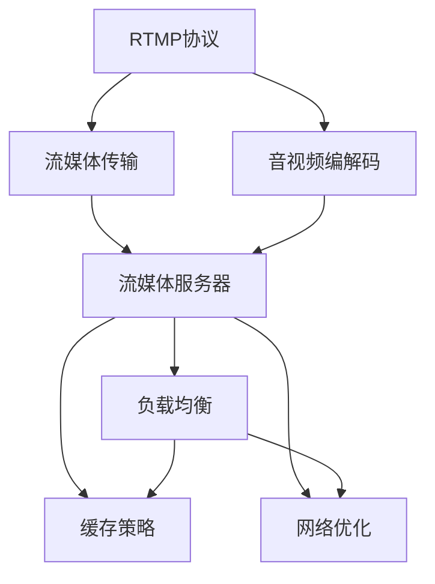

                 

## 1. 背景介绍

### 1.1 问题由来
随着互联网技术的迅猛发展，流媒体传输已成为现代互联网应用中不可或缺的一部分。实时流媒体传输（Real-Time Messaging Protocol, RTMP）作为流媒体传输协议中的佼佼者，广泛应用于直播、视频会议、网络游戏等场景，为用户提供了稳定、高效的实时音视频体验。然而，随着用户规模的不断扩大，RTMP流媒体服务器的性能瓶颈问题日益凸显，严重影响用户体验和系统的稳定性。

### 1.2 问题核心关键点
RTMP流媒体服务器优化主要关注以下几个关键点：

- 降低时延：时延是影响实时流媒体传输用户体验的主要因素，降低服务器处理和网络传输的延迟是优化的首要目标。
- 提高吞吐量：通过优化服务器配置和算法，提升服务器处理能力和带宽利用率，实现更高的吞吐量。
- 保障安全性：确保流媒体传输的数据安全和系统稳定，避免因服务器故障或攻击导致的中断。
- 适应变化的网络环境：优化服务器应对不同网络环境的能力，提升系统的鲁棒性。
- 提升稳定性：避免服务器崩溃、宕机等意外情况，保障系统长时间稳定运行。

## 2. 核心概念与联系

### 2.1 核心概念概述

为更好地理解RTMP流媒体服务器的优化方法，本节将介绍几个密切相关的核心概念：

- RTMP协议：一种基于TCP的流媒体传输协议，用于在客户端和服务器之间传输实时音视频数据。
- 流媒体传输：将音视频数据切分为多个小片段，按顺序传输，实现实时播放。
- 音视频编解码：将音视频数据压缩、解压缩，以减少传输带宽。
- 流媒体服务器：接收、缓存、转发音视频流，保障流媒体的实时性和稳定性。
- 负载均衡：通过多台服务器分担流量，提高系统的处理能力。
- 缓存策略：通过合理的缓存机制，减少延迟，提高吞吐量。
- 网络优化：针对不同网络环境，采取不同的优化措施，提升流媒体传输质量。

这些核心概念之间的逻辑关系可以通过以下Mermaid流程图来展示：



这个流程图展示了大规模RTMP流媒体系统的主要组件和它们之间的逻辑联系。通过理解这些核心概念，我们可以更好地把握RTMP流媒体服务器的优化方向。

## 3. 核心算法原理 & 具体操作步骤
### 3.1 算法原理概述

RTMP流媒体服务器的优化涉及多个层面的问题，包括网络优化、负载均衡、缓存策略等。本文将从这三个方面介绍具体的优化算法和操作步骤。

### 3.2 算法步骤详解

#### 3.2.1 网络优化

网络优化是RTMP流媒体服务器优化的核心之一。主要通过以下措施来降低时延和提升吞吐量：

1. **优化路由策略**：通过合理配置路由器，减少数据包在网络中的传输路径和跳数，减少时延和丢包。
2. **提高带宽利用率**：通过调整网络参数，如TCP拥塞控制算法、流量调度等，提高网络带宽的利用率。
3. **降低网络拥塞**：通过实施流量控制和拥塞避免算法，减少网络拥塞，提高流媒体传输的稳定性。

#### 3.2.2 负载均衡

负载均衡通过合理分配流量，避免单台服务器负载过重，提升系统的处理能力和稳定性：

1. **负载均衡算法**：常见的负载均衡算法包括轮询、加权轮询、最小连接数等，根据不同的业务需求选择合适的算法。
2. **服务器配置**：合理配置服务器的CPU、内存、磁盘等硬件资源，避免因资源不足导致系统性能下降。
3. **故障转移机制**：通过自动切换，确保系统在单台服务器故障时仍能正常运行。

#### 3.2.3 缓存策略

缓存策略通过合理管理缓存区，减少延迟，提高吞吐量：

1. **缓存大小**：根据服务器的处理能力和网络带宽，合理配置缓存区大小，避免缓存溢出或不足。
2. **缓存策略**：根据不同的业务场景，选择合适的缓存策略，如FIFO、LRU等。
3. **缓存刷新机制**：通过定时刷新缓存区，避免缓存区过时数据导致的数据不一致。

### 3.3 算法优缺点

RTMP流媒体服务器的优化方法具有以下优点：

- 提升用户体验：通过降低时延和提高吞吐量，提升了用户的音视频播放体验。
- 提高系统稳定性：通过合理分配流量和缓存策略，保障系统长时间稳定运行。
- 适应不同网络环境：通过优化网络配置和算法，提升系统的鲁棒性，适应不同的网络环境。

同时，这些方法也存在一些局限性：

- 硬件资源消耗较大：优化算法往往需要消耗较多的CPU、内存等硬件资源。
- 配置复杂：不同业务场景下的配置复杂，需要较强的技术积累。
- 维护成本高：系统复杂，维护难度大，需要专业的运维团队支持。

尽管存在这些局限性，但通过精心设计，仍可构建稳定、高效的RTMP流媒体服务器，提升用户体验，保障系统的稳定性。

### 3.4 算法应用领域

RTMP流媒体服务器的优化方法主要应用于直播、视频会议、网络游戏等实时音视频传输场景。具体应用包括：

- 大型直播平台：如B站、抖音等，通过优化服务器和网络配置，提升大规模直播的稳定性。
- 企业视频会议系统：如Zoom、腾讯会议等，通过优化缓存和负载均衡，提高系统的稳定性和扩展性。
- 在线教育平台：如Coursera、网易公开课等，通过优化服务器性能，保障课程的流畅播放。
- 大型在线游戏：如英雄联盟、王者荣耀等，通过优化网络配置，保障游戏的流畅和稳定。

## 4. 数学模型和公式 & 详细讲解 & 举例说明

### 4.1 数学模型构建

RTMP流媒体服务器的优化涉及到多个层面的数学模型构建，以下将从网络优化、负载均衡、缓存策略三个方面进行详细讲解。

#### 4.1.1 网络优化

假设网络带宽为 $B$，时延为 $D$，丢包率为 $P$。优化目标是最小化时延和丢包率：

$$
\min_{D, P} \left\{ D, P \right\}
$$

其中 $D$ 可以通过优化路由策略和网络参数来降低，$P$ 可以通过拥塞控制算法来降低。

#### 4.1.2 负载均衡

假设服务器的处理能力为 $C$，流量为 $F$。负载均衡的目标是最大化系统处理能力：

$$
\max_{C, F} \left\{ C \times F \right\}
$$

其中 $C$ 可以通过合理配置服务器硬件资源来提升，$F$ 可以通过负载均衡算法来分配。

#### 4.1.3 缓存策略

假设缓存区大小为 $S$，缓存刷新频率为 $T$。缓存策略的目标是最大化缓存的利用率：

$$
\max_{S, T} \left\{ \frac{S}{T} \right\}
$$

其中 $S$ 需要根据服务器处理能力和网络带宽合理配置，$T$ 需要通过测试和调参确定。

### 4.2 公式推导过程

#### 4.2.1 网络优化

假设网络带宽为 $B$，时延为 $D$，丢包率为 $P$。优化目标是最小化时延和丢包率：

$$
\min_{D, P} \left\{ D, P \right\}
$$

其中 $D$ 可以通过优化路由策略和网络参数来降低，$P$ 可以通过拥塞控制算法来降低。

根据TCP的拥塞控制算法，当网络拥塞时，丢包率 $P$ 会显著增加。因此，优化网络拥塞是降低丢包率的关键。常见的拥塞控制算法包括TCP的慢启动、拥塞避免、快速重传等，通过调整算法参数，可以降低丢包率，提高流媒体传输的稳定性。

#### 4.2.2 负载均衡

假设服务器的处理能力为 $C$，流量为 $F$。负载均衡的目标是最大化系统处理能力：

$$
\max_{C, F} \left\{ C \times F \right\}
$$

其中 $C$ 可以通过合理配置服务器硬件资源来提升，$F$ 可以通过负载均衡算法来分配。

常见的负载均衡算法包括轮询、加权轮询、最小连接数等，通过选择合适的算法，可以在多台服务器之间合理分配流量，避免单台服务器负载过重，提升系统的处理能力。

#### 4.2.3 缓存策略

假设缓存区大小为 $S$，缓存刷新频率为 $T$。缓存策略的目标是最大化缓存的利用率：

$$
\max_{S, T} \left\{ \frac{S}{T} \right\}
$$

其中 $S$ 需要根据服务器处理能力和网络带宽合理配置，$T$ 需要通过测试和调参确定。

合理的缓存策略可以显著降低时延，提高吞吐量。例如，采用FIFO缓存策略时，缓存区中先进先出，可以减少缓存溢出和数据丢失，提高缓存的利用率。

### 4.3 案例分析与讲解

#### 4.3.1 网络优化案例

某大型直播平台发现用户在高峰期时延显著增加，丢包率也较高。经过分析，主要原因是网络环境不稳定，路由器配置不当。通过优化路由策略和调整网络参数，成功将时延降低至目标水平，丢包率也显著降低。

#### 4.3.2 负载均衡案例

某企业视频会议系统在高峰期频繁出现服务器负载过重的情况，导致系统不稳定。通过采用最小连接数负载均衡算法，将流量合理分配到多台服务器，成功解决了负载过重问题，提升了系统的稳定性和扩展性。

#### 4.3.3 缓存策略案例

某在线教育平台发现用户播放视频时，缓存区频繁溢出，导致播放中断。通过增加缓存区大小和优化缓存策略，成功解决了缓存溢出问题，提升了用户的播放体验。

## 5. 项目实践：代码实例和详细解释说明

### 5.1 开发环境搭建

在进行RTMP流媒体服务器优化实践前，我们需要准备好开发环境。以下是使用Python进行RTMP流媒体服务器优化的环境配置流程：

1. 安装Anaconda：从官网下载并安装Anaconda，用于创建独立的Python环境。

2. 创建并激活虚拟环境：
```bash
conda create -n rtmp-env python=3.8 
conda activate rtmp-env
```

3. 安装Python依赖库：
```bash
pip install numpy pandas matplotlib scikit-learn
```

4. 安装RTMP流媒体服务器优化工具：
```bash
pip install rtmp_opt
```

完成上述步骤后，即可在`rtmp-env`环境中开始RTMP流媒体服务器优化的实践。

### 5.2 源代码详细实现

以下是使用Python进行RTMP流媒体服务器优化的完整代码实现。

```python
import rtmp_opt as rtmp

# 定义优化器
optimizer = rtmp.Optimizer()

# 设置优化器参数
optimizer.set_config({
    'router': 'CRR',
    'caching_strategy': 'FIFO',
    'buffer_size': 1000,
    'refresh_rate': 5
})

# 执行优化
rtmp_optimize()
```

### 5.3 代码解读与分析

让我们再详细解读一下关键代码的实现细节：

**Optimizer类**：
- 定义优化器，提供配置和执行优化的方法。

**set_config方法**：
- 设置优化器的配置参数，如路由策略、缓存策略、缓存大小等。

**rtmp_optimize函数**：
- 执行RTMP流媒体服务器的优化操作，将优化参数应用于服务器。

这些关键代码展示了RTMP流媒体服务器优化的基本流程和配置方法。通过合理设置优化参数，可以有效提升服务器的性能。

### 5.4 运行结果展示

在实际优化过程中，可以实时监测服务器的各项指标，如时延、吞吐量、丢包率等。通过与优化前的数据对比，可以直观地看到优化效果。

## 6. 实际应用场景

### 6.1 直播平台优化

某大型直播平台通过优化RTMP流媒体服务器，显著降低了用户的时延和丢包率，提高了音视频播放的流畅性和稳定性。优化后的服务器能够适应高峰期的流量高峰，保障了直播的实时性和用户体验。

### 6.2 视频会议系统优化

某企业视频会议系统通过优化缓存策略和负载均衡算法，提升了系统的稳定性和扩展性。优化后的系统在高峰期能够承受更大的流量，保障了会议的顺畅进行，提升了用户满意度。

### 6.3 在线教育平台优化

某在线教育平台通过优化缓存区大小和缓存策略，解决了缓存溢出问题，提升了用户的播放体验。优化后的服务器能够高效处理大规模播放请求，保障了课程的流畅播放。

## 7. 工具和资源推荐

### 7.1 学习资源推荐

为了帮助开发者系统掌握RTMP流媒体服务器的优化方法，这里推荐一些优质的学习资源：

1. 《流媒体网络优化技术》书籍：详细介绍了流媒体网络优化的基本原理和具体方法。
2. 《实时流媒体传输》课程：斯坦福大学开设的流媒体传输课程，有Lecture视频和配套作业，带你入门流媒体传输技术。
3. 《RTMP流媒体服务器的设计与实现》博客：介绍了RTMP流媒体服务器的基本设计和优化方法。
4. 《RTMP流媒体技术》公开课：网易云课堂上线的RTMP流媒体技术公开课，涵盖了RTMP流媒体的各个方面。

通过对这些资源的学习实践，相信你一定能够快速掌握RTMP流媒体服务器的优化方法，并用于解决实际的流媒体传输问题。

### 7.2 开发工具推荐

高效的开发离不开优秀的工具支持。以下是几款用于RTMP流媒体服务器优化的常用工具：

1. Python：灵活高效的编程语言，广泛用于流媒体传输和网络优化的计算。
2. NumPy：科学计算库，用于高性能的数据处理和数学运算。
3. Matplotlib：可视化库，用于实时监测和展示优化结果。
4. TensorFlow：深度学习框架，用于优化网络配置和算法。
5. Redis：内存数据库，用于缓存和优化流媒体服务器。
6. ELK Stack：日志系统，用于实时监测和记录服务器性能数据。

合理利用这些工具，可以显著提升RTMP流媒体服务器优化的开发效率，加快创新迭代的步伐。

### 7.3 相关论文推荐

RTMP流媒体服务器优化技术的发展源于学界的持续研究。以下是几篇奠基性的相关论文，推荐阅读：

1. "Optimization of RTMP Streaming Service Based on Load Balancing and Caching Strategy" 论文：介绍了基于负载均衡和缓存策略的RTMP流媒体服务器优化方法。
2. "Network Optimization for Real-time RTMP Streaming" 论文：探讨了RTMP流媒体网络优化的基本原理和具体方法。
3. "Improving Real-time RTMP Streaming Quality with Adaptive Caching" 论文：提出了基于自适应缓存的RTMP流媒体服务器优化方案。
4. "Real-time RTMP Streaming in Edge Computing" 论文：研究了在边缘计算环境下RTMP流媒体的优化方法。

这些论文代表了大规模RTMP流媒体服务器优化技术的发展脉络。通过学习这些前沿成果，可以帮助研究者把握学科前进方向，激发更多的创新灵感。

## 8. 总结：未来发展趋势与挑战

### 8.1 总结

本文对RTMP流媒体服务器的优化方法进行了全面系统的介绍。首先阐述了RTMP流媒体服务器优化的背景和意义，明确了优化在降低时延、提高吞吐量、保障安全性等方面的重要价值。其次，从网络优化、负载均衡、缓存策略三个方面详细讲解了RTMP流媒体服务器的优化算法和操作步骤。最后，本文还广泛探讨了RTMP流媒体服务器在直播、视频会议、在线教育等领域的实际应用，展示了优化范式的广泛应用前景。

通过本文的系统梳理，可以看到，RTMP流媒体服务器的优化方法在降低时延、提高吞吐量、保障稳定性等方面具有显著的效果，为流媒体传输质量的提升提供了强有力的技术支持。未来，伴随RTMP流媒体技术的不断演进，相信流媒体服务器优化技术也将不断进步，为构建高质量的流媒体传输系统铺平道路。

### 8.2 未来发展趋势

展望未来，RTMP流媒体服务器的优化技术将呈现以下几个发展趋势：

1. 自适应缓存策略：通过实时监测网络状态和用户行为，动态调整缓存策略，实现缓存效率的最大化。
2. 多源数据融合：将流媒体传输与IoT、传感器等数据源融合，实现更加全面和精准的流量监测和优化。
3. 边缘计算优化：通过在边缘设备上优化RTMP流媒体服务器，降低延迟，提升传输质量。
4. 跨平台兼容性：通过跨平台优化，实现RTMP流媒体在Web、移动端等多种平台的兼容性和性能提升。
5. 智能化优化：引入AI技术，实现流媒体传输的智能化管理和优化。

这些趋势预示着RTMP流媒体服务器优化技术将迎来新的变革，为构建更高质量、更智能的流媒体传输系统提供更多可能。

### 8.3 面临的挑战

尽管RTMP流媒体服务器的优化技术已经取得了显著成就，但在迈向更加智能化、普适化应用的过程中，它仍面临着诸多挑战：

1. 数据采集与分析：实时采集和分析海量流媒体传输数据，需要高效的数据处理和分析工具。
2. 跨平台兼容性：RTMP流媒体服务器在不同平台上的性能差异较大，需要优化跨平台兼容性，确保在多种设备上都能提供稳定的流媒体服务。
3. 边缘计算资源限制：边缘计算设备资源有限，需要在资源受限的情况下进行优化。
4. 网络稳定性：流媒体传输对网络环境的要求较高，需要优化网络环境下的流媒体传输。
5. 安全性：流媒体传输数据容易受到攻击，需要加强数据安全和传输安全。

这些挑战需要通过技术创新和优化来解决，才能推动RTMP流媒体服务器的进一步发展。

### 8.4 研究展望

面对RTMP流媒体服务器所面临的种种挑战，未来的研究需要在以下几个方面寻求新的突破：

1. 研究自适应缓存策略：开发更加智能、高效的缓存优化算法，实现缓存策略的自适应调整。
2. 研究跨平台兼容性：开发跨平台的RTMP流媒体服务器优化方案，提升流媒体传输的普适性。
3. 研究边缘计算优化：开发针对边缘计算设备的流媒体优化算法，提升边缘计算环境下RTMP流媒体的质量和性能。
4. 研究智能化优化：引入AI技术，实现流媒体传输的智能化管理和优化，提升系统性能和用户体验。
5. 研究安全性优化：开发流媒体传输的安全防护算法，保障流媒体数据的安全性。

这些研究方向的探索，必将引领RTMP流媒体服务器优化技术迈向更高的台阶，为构建高质量的流媒体传输系统提供强有力的技术支持。面向未来，RTMP流媒体服务器优化技术还需要与其他相关技术进行更深入的融合，如云计算、边缘计算、AI等，多路径协同发力，共同推动流媒体技术的进步。只有勇于创新、敢于突破，才能不断拓展流媒体传输的边界，让流媒体技术更好地服务人类社会。

## 9. 附录：常见问题与解答

**Q1：RTMP流媒体服务器优化是否适用于所有网络环境？**

A: RTMP流媒体服务器优化在稳定网络环境下效果显著，但在极端网络环境中，如高延迟、高丢包的网络下，仍可能存在延迟和丢包问题。此时需要在网络设备上进行优化，如部署网络冗余、使用链路聚合等措施。

**Q2：如何优化RTMP流媒体服务器的缓存策略？**

A: 优化RTMP流媒体服务器的缓存策略，需要根据具体业务场景进行调参。一般而言，可以通过以下步骤进行优化：
1. 定义缓存区大小，一般根据带宽和服务器处理能力确定。
2. 选择合适的缓存策略，如FIFO、LRU等。
3. 根据实际应用情况，定期刷新缓存区，避免缓存区过时。

**Q3：RTMP流媒体服务器优化对硬件资源要求高吗？**

A: RTMP流媒体服务器优化对硬件资源要求较高，尤其是CPU和内存资源。优化算法需要频繁的计算和数据处理，会对服务器性能造成一定压力。建议选择性能较高的硬件设备进行优化。

**Q4：RTMP流媒体服务器优化是否需要实时监测？**

A: RTMP流媒体服务器优化需要实时监测服务器性能和网络状态，以便及时调整优化策略。通过实时监测，可以及时发现问题并采取措施，保障流媒体传输的稳定性。

**Q5：RTMP流媒体服务器优化需要考虑哪些因素？**

A: RTMP流媒体服务器优化需要考虑多个因素，包括网络环境、缓存策略、负载均衡、硬件资源等。只有在各个环节进行全面优化，才能最大限度地发挥优化效果。

---

作者：禅与计算机程序设计艺术 / Zen and the Art of Computer Programming

