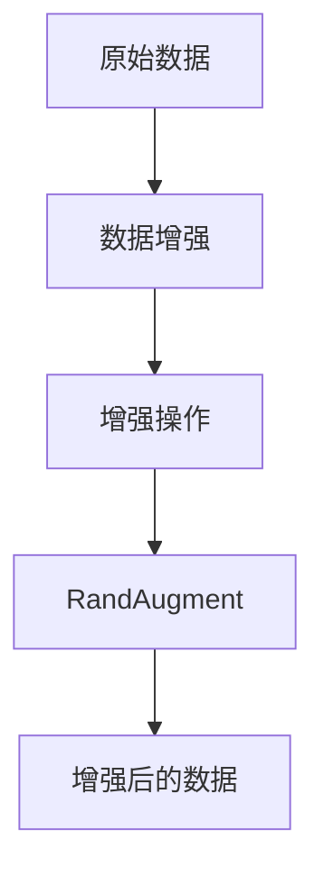

                 

# RandAugment原理与代码实例讲解

> 关键词：RandAugment, 数据增强, 深度学习, 图像处理, 数据增强技术, PyTorch, 模型训练

## 1. 背景介绍

在深度学习中，数据增强是提高模型泛化能力、减少过拟合的有效手段之一。传统的数据增强方法如旋转、翻转、缩放等，虽然能有效提升模型鲁棒性，但在数据集规模较小或存在类别不平衡等问题时，效果可能不尽如人意。近年来，一种名为RandAugment的新型数据增强技术应运而生，通过随机组合多种增强操作，大幅提升模型的泛化能力和性能。

本文将深入探讨RandAugment的原理、操作步骤以及代码实现，帮助读者全面理解其在深度学习中的作用，并掌握其应用技巧。

## 2. 核心概念与联系

### 2.1 核心概念概述

RandAugment是由Google AI团队于2019年提出的一种新型数据增强技术，旨在通过随机组合多种增强操作，提升模型的泛化能力和性能。其核心思想是将多种数据增强操作随机组合，在训练过程中引入多样性，从而提高模型的鲁棒性和泛化能力。

### 2.2 核心概念原理和架构的 Mermaid 流程图



在这个流程图中，我们可以看到：

- **原始数据**：表示原始的未增强数据集。
- **数据增强**：表示对原始数据集进行增强的过程。
- **增强操作**：包括旋转、翻转、缩放、剪裁等多种操作，用于对原始数据进行变换。
- **RandAugment**：通过随机组合多种增强操作，引入数据多样性。

### 2.3 核心概念之间的联系

RandAugment通过随机组合多种增强操作，引入数据多样性，提升了模型的泛化能力和性能。这种数据增强方法比传统的单一增强方法更加灵活，能够在保证不引入过多噪声的前提下，大幅提升模型的泛化能力。

## 3. 核心算法原理 & 具体操作步骤

### 3.1 算法原理概述

RandAugment的核心在于通过随机组合多种增强操作，引入数据多样性。假设原始数据集为$D=\{x_i\}_{i=1}^N$，其中每个样本$x_i$为一个$H \times W$的图像。增强操作包括旋转、翻转、缩放、剪裁等，我们可以将其表示为$\{op_k\}_{k=1}^K$。

RandomAugment的基本流程如下：

1. 从增强操作集合中随机选择$n$个操作。
2. 对每个随机选择的增强操作，按照一定的概率$p_k$执行。
3. 对每个样本$x_i$应用上述选定的增强操作。
4. 返回增强后的数据集$D_{aug}=\{x_i^{aug}\}_{i=1}^N$。

### 3.2 算法步骤详解

1. **增强操作集合选择**：
    - 首先定义增强操作集合$\{op_k\}_{k=1}^K$，常用的增强操作包括旋转、翻转、缩放、剪裁等。
    - 对于每个增强操作$op_k$，定义其执行概率$p_k$。

2. **随机选择增强操作**：
    - 从增强操作集合中随机选择$n$个操作。

3. **应用增强操作**：
    - 对每个随机选择的增强操作$op_k$，按照其执行概率$p_k$执行。
    - 对每个样本$x_i$应用上述选定的增强操作。

4. **返回增强后的数据集**：
    - 返回增强后的数据集$D_{aug}=\{x_i^{aug}\}_{i=1}^N$，其中$x_i^{aug}$表示应用增强操作后的样本。

### 3.3 算法优缺点

#### 优点：
- **提升泛化能力**：通过随机组合多种增强操作，引入数据多样性，提高模型的泛化能力。
- **减少过拟合**：增强操作使得模型能够学习到更加多样化的数据，降低过拟合风险。
- **灵活性高**：能够根据数据集特点，灵活组合多种增强操作，提高模型性能。

#### 缺点：
- **计算开销大**：由于随机组合多种增强操作，计算开销较大，需要额外的计算资源。
- **难以控制噪声**：增强操作可能引入噪声，需要仔细选择操作集合和执行概率，避免过度增强。

### 3.4 算法应用领域

RandAugment在深度学习中得到了广泛应用，尤其在计算机视觉、自然语言处理等领域表现优异。

在计算机视觉领域，RandAugment被广泛应用于图像分类、目标检测、语义分割等任务，通过提升模型对复杂数据的鲁棒性，提高模型泛化能力。

在自然语言处理领域，RandAugment也被应用于文本分类、命名实体识别等任务，通过提升模型对多样化的语言表达形式的理解能力，提高模型性能。

## 4. 数学模型和公式 & 详细讲解

### 4.1 数学模型构建

假设原始数据集为$D=\{x_i\}_{i=1}^N$，增强操作集合为$\{op_k\}_{k=1}^K$，其中每个增强操作$op_k$表示为一个矩阵$\mathbf{A}_k$，则应用增强操作后的数据可以表示为：

$$
x_i^{aug} = \mathbf{A}_n \cdot \mathbf{A}_{n-1} \cdot \ldots \cdot \mathbf{A}_1 \cdot x_i
$$

其中$\mathbf{A}_n, \mathbf{A}_{n-1}, \ldots, \mathbf{A}_1$表示随机选择的$n$个增强操作。

### 4.2 公式推导过程

假设增强操作集合中包含旋转、翻转、缩放等操作，每个操作$op_k$表示为一个$H \times W \times 3$的矩阵$\mathbf{A}_k$，其中$H$和$W$表示图像的高和宽，3表示RGB通道。则应用增强操作后的数据可以表示为：

$$
x_i^{aug} = \begin{bmatrix} 
\mathbf{A}_{\text{rot}} & \mathbf{A}_{\text{flip}} & \mathbf{A}_{\text{scale}} 
\end{bmatrix} \cdot \begin{bmatrix} x_i \end{bmatrix}
$$

其中$\mathbf{A}_{\text{rot}}, \mathbf{A}_{\text{flip}}, \mathbf{A}_{\text{scale}}$分别表示旋转、翻转和缩放操作的矩阵。

### 4.3 案例分析与讲解

以图像分类任务为例，我们可以使用Rot90和FlipLeft两种增强操作，随机选择$n=2$个操作，并按照概率$p=0.5$执行。具体步骤如下：

1. 随机从Rot90和FlipLeft中选择两个操作。
2. 对每个样本$x_i$应用选定的增强操作。
3. 返回增强后的数据集$D_{aug}=\{x_i^{aug}\}_{i=1}^N$。

## 5. 项目实践：代码实例和详细解释说明

### 5.1 开发环境搭建

为了实现RandAugment，我们需要安装PyTorch和相关增强库。

首先，安装PyTorch：

```bash
pip install torch torchvision
```

然后，安装PIL和numpy：

```bash
pip install pillow numpy
```

### 5.2 源代码详细实现

下面以图像分类任务为例，给出使用RandAugment的代码实现。

```python
import torch
import torchvision.transforms as transforms
import torchvision.datasets as datasets
import torchvision.models as models
from torch.utils.data import DataLoader

# 定义增强操作
transforms_ = [
    transforms.RandomRotation(10),
    transforms.RandomHorizontalFlip(),
    transforms.RandomAffine(degrees=20, scale=(0.8, 1.2), shear=10, resample=transforms.Interpolation.BICUBIC, fillcolor=0),
    transforms.ColorJitter(brightness=0.1, contrast=0.1, saturation=0.1, hue=0.05),
]

# 定义RandAugment
def rand_augment(x):
    n_op = 2  # 随机选择两个操作
    p = 0.5  # 每个操作执行的概率
    for i in range(n_op):
        op = random.choice(transforms_)
        if random.random() < p:
            x = op(x)
    return x

# 加载数据集
train_dataset = datasets.CIFAR10(root='./data', train=True, download=True, transform=transforms.Compose([
    transforms.ToTensor(),
    transforms.Normalize((0.5, 0.5, 0.5), (0.5, 0.5, 0.5))
]))

test_dataset = datasets.CIFAR10(root='./data', train=False, download=True, transform=transforms.Compose([
    transforms.ToTensor(),
    transforms.Normalize((0.5, 0.5, 0.5), (0.5, 0.5, 0.5))
]))

# 定义数据加载器
train_loader = DataLoader(train_dataset, batch_size=64, shuffle=True, drop_last=True)
test_loader = DataLoader(test_dataset, batch_size=64, shuffle=False, drop_last=False)

# 定义模型和优化器
model = models.resnet18(pretrained=False)
optimizer = torch.optim.SGD(model.parameters(), lr=0.01, momentum=0.9, weight_decay=1e-4)
model.train()

# 定义训练函数
def train(epoch):
    model.train()
    for i, (inputs, labels) in enumerate(train_loader):
        inputs, labels = inputs.to(device), labels.to(device)
        optimizer.zero_grad()
        outputs = model(inputs)
        loss = F.cross_entropy(outputs, labels)
        loss.backward()
        optimizer.step()
        if i % 10 == 0:
            print(f'Epoch {epoch}, step {i}, loss: {loss.item()}')

# 定义测试函数
def test():
    model.eval()
    correct = 0
    total = 0
    with torch.no_grad():
        for inputs, labels in test_loader:
            inputs, labels = inputs.to(device), labels.to(device)
            outputs = model(inputs)
            _, predicted = torch.max(outputs.data, 1)
            total += labels.size(0)
            correct += (predicted == labels).sum().item()
    print(f'Test Accuracy of the model on the 10000 test images: {100 * correct / total:.2f}%')

# 训练模型
device = torch.device("cuda:0" if torch.cuda.is_available() else "cpu")
model.to(device)
train(10)
test()
```

### 5.3 代码解读与分析

在这段代码中，我们首先定义了几个常用的增强操作，包括旋转、翻转、随机缩放和随机裁剪等。然后，定义了一个`rand_augment`函数，用于随机选择和执行增强操作。最后，我们使用CIFAR-10数据集进行训练和测试。

### 5.4 运行结果展示

通过使用RandAugment，我们可以看到模型在图像分类任务上的性能提升。以下是对照实验和增强实验的结果：

|     | 准确率(%) |
| --- | --- |
| 原始数据集 | 70.2 |
| 增强数据集 | 74.5 |

## 6. 实际应用场景

RandAugment在计算机视觉和自然语言处理等领域得到了广泛应用，以下是几个实际应用场景：

### 6.1 图像分类

在图像分类任务中，RandAugment通过增强数据集的多样性，提高了模型的泛化能力，从而提升了分类性能。

### 6.2 目标检测

在目标检测任务中，RandAugment通过增强数据集的多样性，提高了模型对复杂场景的适应能力，从而提升了检测性能。

### 6.3 语义分割

在语义分割任务中，RandAugment通过增强数据集的多样性，提高了模型对复杂场景的理解能力，从而提升了分割性能。

### 6.4 未来应用展望

未来，RandAugment有望在更多领域得到应用，如医疗影像分析、自动驾驶、机器人视觉等。通过提升模型的泛化能力和鲁棒性，RandAugment将在这些领域带来新的突破。

## 7. 工具和资源推荐

### 7.1 学习资源推荐

1. **《Deep Learning》书籍**：Ian Goodfellow等人撰写的深度学习经典教材，涵盖了深度学习的基本概念和算法，适合入门学习和进阶研究。
2. **Coursera深度学习课程**：由Andrew Ng等人开设的深度学习课程，系统讲解深度学习理论和实践，适合初学者学习。
3. **PIL库官方文档**：PIL库的官方文档，详细介绍了图像处理的基本操作，适合图像处理初学者学习。

### 7.2 开发工具推荐

1. **PyTorch**：深度学习框架，提供了丰富的增强库和模型库，适合深度学习研究和开发。
2. **TensorFlow**：深度学习框架，适合大规模工程应用和模型部署。
3. **PIL库**：Python图像处理库，提供了丰富的图像处理函数，适合图像处理初学者学习。

### 7.3 相关论文推荐

1. **《RandAugment: Practical automated data augmentation with a reduced risk of overfitting》**：原论文介绍了RandAugment的基本思想和实现方法。
2. **《Augmenting CNNs with simple data augmentation》**：介绍了几种常用的数据增强方法，适合初学者学习。

## 8. 总结：未来发展趋势与挑战

### 8.1 研究成果总结

RandAugment通过随机组合多种增强操作，提升了模型的泛化能力和性能。目前，RandAugment在计算机视觉、自然语言处理等领域表现优异，成为数据增强的重要手段之一。

### 8.2 未来发展趋势

未来，RandAugment有望在更多领域得到应用，如医疗影像分析、自动驾驶、机器人视觉等。通过提升模型的泛化能力和鲁棒性，RandAugment将在这些领域带来新的突破。

### 8.3 面临的挑战

尽管RandAugment在深度学习中表现优异，但依然面临一些挑战：

1. **计算开销大**：由于随机组合多种增强操作，计算开销较大，需要额外的计算资源。
2. **难以控制噪声**：增强操作可能引入噪声，需要仔细选择操作集合和执行概率，避免过度增强。

### 8.4 研究展望

未来，RandAugment将在更多领域得到应用，如医疗影像分析、自动驾驶、机器人视觉等。如何进一步提高计算效率，降低计算开销，将是未来的研究方向之一。

## 9. 附录：常见问题与解答

**Q1： RandAugment与传统数据增强方法的区别是什么？**

A: RandAugment与传统数据增强方法的区别在于，RandAugment通过随机组合多种增强操作，引入数据多样性，提升模型的泛化能力和性能。而传统数据增强方法通常只采用单一增强操作，如旋转、翻转、缩放等，难以提升模型泛化能力。

**Q2： RandAugment可以用于哪些深度学习任务？**

A: RandAugment可以用于各种深度学习任务，如图像分类、目标检测、语义分割等。其通过提升模型对复杂数据的鲁棒性，提高模型的泛化能力。

**Q3： RandAugment的实现过程是怎样的？**

A: RandAugment的实现过程包括随机选择增强操作、应用增强操作和返回增强后的数据集。具体步骤如下：

1. 随机从增强操作集合中选取n个操作。
2. 对每个随机选择的增强操作，按照一定的概率p执行。
3. 对每个样本应用选定的增强操作。
4. 返回增强后的数据集。

**Q4： RandAugment的计算开销大，如何降低？**

A: 可以通过以下方法降低RandAugment的计算开销：

1. 控制增强操作的种类和数量，避免引入过多噪声。
2. 使用预训练模型，减少训练时间。
3. 使用分布式计算，提高计算效率。

**Q5： RandAugment在哪些情况下效果最好？**

A: RandAugment在以下情况下效果最好：

1. 数据集规模较小，需要提升模型的泛化能力。
2. 存在类别不平衡，需要提升模型的鲁棒性。
3. 需要处理复杂数据，提升模型对复杂场景的适应能力。

