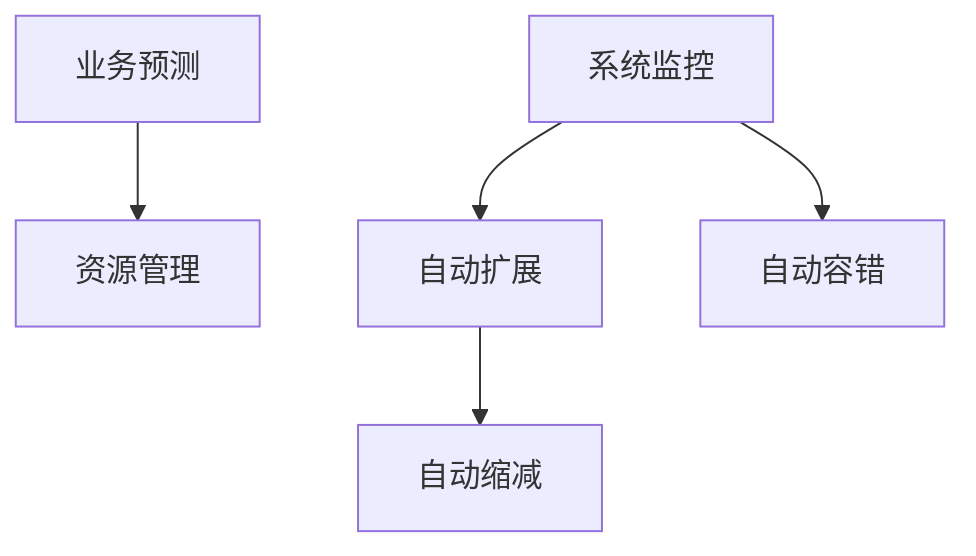

                 

# SRE容量规划与弹性伸缩

## 1. 背景介绍

### 1.1 问题由来
随着互联网和云计算技术的快速发展，企业和组织所依赖的IT基础设施规模不断增长，数据量和计算需求日益膨胀。在如此大规模的分布式系统中，如何保证系统的高可用性、高性能以及成本效益，成为了运维团队面临的重要挑战。同时，随着用户需求的多样化，对系统资源的动态分配和快速响应也提出了更高的要求。

容量规划与弹性伸缩（Capacity Planning and Scaling）成为SRE（Site Reliability Engineering）不可或缺的一部分，旨在基于业务需求和资源利用率，合理分配和调整系统容量，确保系统能够高效、稳定地运行。容量规划决定了系统资源的基本配置，而弹性伸缩则负责动态调整资源以满足负载变化。两者相辅相成，共同支撑系统的健康运行。

### 1.2 问题核心关键点
容量规划与弹性伸缩的核心在于：

- **业务预测**：通过对业务流量和用户行为的研究，预测未来的系统需求。
- **资源管理**：基于预测结果，合理分配和调整计算资源、存储资源和网络带宽。
- **系统监控**：实时监控系统性能指标，及时发现性能瓶颈和异常。
- **自动扩展**：根据性能监控数据，自动调整系统资源，确保服务质量。
- **成本优化**：通过合理配置资源，避免资源浪费和过度扩容。

本文将从核心概念入手，深入探讨容量规划与弹性伸缩的原理、操作步骤及其实际应用，为SRE团队提供全面的技术指导。

## 2. 核心概念与联系

### 2.1 核心概念概述

为更好地理解容量规划与弹性伸缩的实施过程，本节将介绍几个核心概念：

- **资源利用率（Resource Utilization）**：指系统实际使用的资源与总资源之间的比例，反映了系统资源的分配和使用效率。
- **资源自动扩展（Resource Auto-scaling）**：指基于性能监控数据，自动调整系统资源的机制。通过增加或减少资源，动态适应负载变化，提高系统可用性和响应速度。
- **资源自动缩减（Resource Auto-scaling-down）**：在负载降低时，减少系统资源，以降低成本和能耗。
- **自动容错（Automatic Failover）**：在系统资源不足或出现故障时，自动切换到备用资源或降级服务，保障业务连续性。

这些概念之间的逻辑关系可以通过以下Mermaid流程图来展示：



这个流程图展示了她各个概念之间的相互联系：

1. **业务预测**：预测业务需求，为资源管理提供依据。
2. **资源管理**：基于预测结果，进行资源分配和初始配置。
3. **系统监控**：实时监控系统性能，为自动扩展提供决策依据。
4. **自动扩展**：根据监控数据，动态调整资源以满足负载变化。
5. **自动缩减**：在负载降低时，自动释放资源，优化成本。
6. **自动容错**：在系统故障时，自动切换资源保障服务稳定。

这些概念共同构成了容量规划与弹性伸缩的实施框架，使得系统能够在不同负载情况下高效稳定地运行。

## 3. 核心算法原理 & 具体操作步骤

### 3.1 算法原理概述

容量规划与弹性伸缩的实施通常包括以下几个关键步骤：

1. **业务预测**：基于历史数据和业务趋势，预测未来业务流量和用户行为。
2. **资源管理**：根据预测结果，合理分配和调整计算资源、存储资源和网络带宽。
3. **系统监控**：实时监控系统性能指标，如CPU利用率、内存使用率、请求处理时间等。
4. **自动扩展**：根据性能监控数据，动态调整系统资源，确保服务质量。
5. **自动缩减**：在负载降低时，减少系统资源，以降低成本和能耗。
6. **自动容错**：在系统资源不足或出现故障时，自动切换到备用资源或降级服务，保障业务连续性。

这些步骤可以通过算法模型和技术手段实现，确保系统能够灵活应对负载变化，同时保持高性能和低成本。

### 3.2 算法步骤详解

#### 3.2.1 业务预测

业务预测通常包括以下两个步骤：

**数据收集**：收集历史业务数据，如请求次数、并发用户数、业务处理时间等。使用时间序列分析、机器学习等方法，对数据进行建模，预测未来的业务流量和用户行为。

**模型选择**：选择合适的预测模型，如ARIMA、LSTM、XGBoost等。根据历史数据和业务特征，训练模型，并对其进行验证和调优。

**预测结果**：根据训练好的模型，对未来的业务流量和用户行为进行预测，得到资源需求的时间序列。

#### 3.2.2 资源管理

资源管理通常包括以下两个步骤：

**资源分配**：根据预测结果，分配计算资源、存储资源和网络带宽。确保系统在负载高峰期有足够的资源支持业务运行。

**资源调整**：根据实际业务需求，动态调整资源分配。通过增加或减少资源，确保系统资源的高效利用。

**资源优化**：通过资源共享、资源复用等手段，优化资源使用效率，减少资源浪费。

#### 3.2.3 系统监控

系统监控通常包括以下两个步骤：

**性能指标**：监控系统的关键性能指标，如CPU利用率、内存使用率、请求处理时间等。确保系统在负载变化时能够快速响应。

**异常检测**：使用机器学习、统计方法等技术，检测系统异常行为。如CPU利用率异常升高、内存泄漏等，及时发出告警，保障系统稳定。

**告警处理**：根据告警信息，快速定位问题，并采取相应措施，如增加资源、重启服务等。

#### 3.2.4 自动扩展

自动扩展通常包括以下两个步骤：

**扩展策略**：定义自动扩展的策略，如基于CPU利用率、内存使用率、请求响应时间等。设置阈值和扩展策略，确保在负载变化时能够及时响应。

**扩展操作**：根据性能监控数据，自动调整系统资源。如增加CPU、内存、存储等资源，提升系统性能。

**扩展监控**：监控扩展操作的效果，确保扩展后的系统能够正常运行。

#### 3.2.5 自动缩减

自动缩减通常包括以下两个步骤：

**缩减策略**：定义自动缩减的策略，如基于CPU利用率、内存使用率、请求响应时间等。设置阈值和缩减策略，确保在负载降低时能够及时响应。

**缩减操作**：根据性能监控数据，自动释放系统资源。如减少CPU、内存、存储等资源，优化成本和能耗。

**缩减监控**：监控缩减操作的效果，确保缩减后的系统能够正常运行。

#### 3.2.6 自动容错

自动容错通常包括以下两个步骤：

**容错策略**：定义容错策略，如基于系统健康检查、服务降级等。设置容错策略，确保在资源不足或系统故障时能够快速响应。

**容错操作**：根据容错策略，自动切换资源或降级服务。如切换到备用资源、降级服务或缓存等，保障业务连续性。

**容错监控**：监控容错操作的效果，确保切换后的服务能够正常运行。

### 3.3 算法优缺点

容量规划与弹性伸缩的实施具有以下优点：

- **灵活应对负载变化**：根据负载变化动态调整系统资源，确保系统高性能和低成本。
- **提升业务连续性**：通过自动容错，保障业务连续性，避免因资源不足或系统故障导致的业务中断。
- **优化资源利用率**：通过资源优化和自动调整，减少资源浪费，提升资源利用率。

同时，该方法也存在一些局限性：

- **预测准确性**：业务预测的准确性直接影响资源分配和扩展策略的有效性。预测不准确可能导致资源过剩或不足。
- **扩展延迟**：自动扩展需要一定时间响应和操作，可能导致系统在负载高峰期响应缓慢。
- **成本控制**：自动扩展和缩减需要考虑成本因素，避免过度扩展导致的资源浪费和缩减后的性能下降。
- **系统复杂性**：实施容量规划与弹性伸缩需要复杂的监控和策略设计，增加了系统的复杂性。

尽管存在这些局限性，但就目前而言，容量规划与弹性伸缩仍是大规模系统不可或缺的技术手段。未来相关研究的重点在于如何进一步提高预测准确性，降低扩展延迟，同时兼顾成本控制和系统复杂性。

### 3.4 算法应用领域

容量规划与弹性伸缩技术在各个领域都有广泛的应用，例如：

- **云服务提供商**：如AWS、Azure、Google Cloud等，通过容量规划与弹性伸缩技术，提供灵活的云资源服务，满足不同用户需求。
- **在线零售平台**：如Amazon、阿里巴巴、京东等，通过容量规划与弹性伸缩技术，保证高峰期购物节和促销活动的系统稳定性。
- **在线视频平台**：如Netflix、爱奇艺、腾讯视频等，通过容量规划与弹性伸缩技术，支持高并发和高流量的视频服务。
- **社交媒体平台**：如Facebook、Twitter、微信等，通过容量规划与弹性伸缩技术，保障用户访问的流畅性和稳定性。
- **金融交易平台**：如Binance、Coinbase、中信建投等，通过容量规划与弹性伸缩技术，支持高频率和高并发交易需求。

除了上述这些经典应用外，容量规划与弹性伸缩技术也在越来越多的领域得到应用，如智能制造、智慧医疗、智能交通等，为各行各业数字化转型提供了重要保障。

## 4. 数学模型和公式 & 详细讲解  
### 4.1 数学模型构建

容量规划与弹性伸缩的核心在于通过数学模型来描述和优化资源管理过程。以下是几个关键的数学模型：

**业务流量预测模型**：
$$
y_t = \alpha + \beta x_t + \gamma y_{t-1} + \epsilon_t
$$
其中，$y_t$ 为第 $t$ 个时间点的业务流量，$x_t$ 为第 $t$ 个时间点的特征向量，$\alpha$、$\beta$、$\gamma$ 为模型参数，$\epsilon_t$ 为误差项。

**资源需求模型**：
$$
r_t = f(y_t)
$$
其中，$r_t$ 为第 $t$ 个时间点的资源需求，$f$ 为资源需求函数，根据业务流量计算资源需求。

**性能指标监控模型**：
$$
p_t = g(r_t)
$$
其中，$p_t$ 为第 $t$ 个时间点的性能指标，$g$ 为性能指标函数，根据资源需求计算性能指标。

**自动扩展模型**：
$$
r_{t+1} = r_t + \Delta r
$$
其中，$\Delta r$ 为资源增加量，根据性能指标计算自动扩展策略。

**自动缩减模型**：
$$
r_{t+1} = r_t - \Delta r
$$
其中，$\Delta r$ 为资源减少量，根据性能指标计算自动缩减策略。

**自动容错模型**：
$$
r_{t+1} = r_t - \Delta r + r_{\text{backup}}
$$
其中，$r_{\text{backup}}$ 为备用资源，根据容错策略计算自动容错操作。

### 4.2 公式推导过程

以资源需求模型为例，我们推导资源需求函数 $f$ 的计算方法：

假设资源需求 $r_t$ 与业务流量 $y_t$ 之间存在线性关系：
$$
r_t = \delta_1 y_t + \delta_0
$$
其中，$\delta_1$ 为资源需求系数，$\delta_0$ 为资源需求基线。

根据历史数据，求解 $\delta_1$ 和 $\delta_0$：
$$
\delta_1 = \frac{r_{t+1} - r_{t}}{y_{t+1} - y_{t}}
$$
$$
\delta_0 = r_{t} - \delta_1 y_{t}
$$

代入资源需求函数 $f$：
$$
r_t = \delta_1 y_t + \delta_0
$$

通过上述公式，我们可以根据业务流量预测模型，动态调整资源需求，实现容量规划与弹性伸缩。

### 4.3 案例分析与讲解

以云服务提供商AWS为例，展示容量规划与弹性伸缩的实施过程：

**业务预测**：AWS通过收集历史流量数据，使用时间序列分析方法，预测未来的业务流量。

**资源管理**：AWS根据预测结果，分配计算资源、存储资源和网络带宽。如EC2实例数量、S3存储空间等。

**系统监控**：AWS实时监控系统的关键性能指标，如EC2实例的CPU利用率、网络带宽等。

**自动扩展**：AWS根据EC2实例的CPU利用率，设置扩展策略，自动增加EC2实例数量，确保系统能够满足业务需求。

**自动缩减**：AWS根据EC2实例的CPU利用率，设置缩减策略，自动减少EC2实例数量，优化成本和能耗。

**自动容错**：AWS通过自动容错机制，确保系统在资源不足或出现故障时，能够快速切换到备用资源或降级服务，保障业务连续性。

通过上述实施过程，AWS能够灵活应对各种负载变化，保持系统的稳定性和高性能。

## 5. 项目实践：代码实例和详细解释说明

### 5.1 开发环境搭建

在进行容量规划与弹性伸缩实践前，我们需要准备好开发环境。以下是使用Python进行OpenStack实现容量规划与弹性伸缩的开发环境配置流程：

1. 安装Anaconda：从官网下载并安装Anaconda，用于创建独立的Python环境。

2. 创建并激活虚拟环境：
```bash
conda create -n openstack-env python=3.8 
conda activate openstack-env
```

3. 安装OpenStack：
```bash
pip install openstack python-openstack
```

4. 安装其他依赖包：
```bash
pip install boto3 pyspark scikit-learn pandas
```

5. 安装OpenStack官方API：
```bash
pip install openstackclient
```

6. 配置环境变量：
```bash
export OS_AUTH_URL=https://<auth-url>:<port>/v3 
export OS_USERNAME=<username>
export OS_PASSWORD=<password>
export OS_PROJECT_NAME=<project-name>
export OS_PROJECT_DOMAIN_NAME=<project-domain-name>
export OS_USER_DOMAIN_NAME=<user-domain-name>
```

完成上述步骤后，即可在`openstack-env`环境中开始实践。

### 5.2 源代码详细实现

这里我们以OpenStack云平台为例，展示容量规划与弹性伸缩的实现代码。

首先，定义资源需求函数：

```python
def resource_demand(y):
    delta_1 = (r1 - r0) / (y1 - y0)
    delta_0 = r0 - delta_1 * y0
    return delta_1 * y + delta_0
```

其中，`y`为业务流量，`r0`和`r1`为两个时间点的资源需求，`y0`和`y1`为对应的业务流量。

接着，定义性能指标监控函数：

```python
def performance_monitor(r):
    if r > threshold:
        return 1
    else:
        return 0
```

其中，`r`为资源需求，`threshold`为性能监控阈值。

然后，定义自动扩展和缩减策略：

```python
def auto_scale_up(r):
    if r > max_resource - current_resource:
        return max_resource
    else:
        return current_resource + resource_demand(r)

def auto_scale_down(r):
    if r < min_resource:
        return min_resource
    else:
        return current_resource - resource_demand(r)
```

其中，`r`为资源需求，`current_resource`为当前资源，`min_resource`和`max_resource`分别为最小资源和最大资源。

最后，进行容量规划与弹性伸缩的实施：

```python
resource = min_resource
while True:
    y = predict(business_flow)
    r = resource_demand(y)
    p = performance_monitor(r)
    if p == 1:
        resource = auto_scale_up(resource)
    else:
        resource = auto_scale_down(resource)
```

以上就是使用Python进行OpenStack实现容量规划与弹性伸缩的完整代码实现。可以看到，通过合理的数学模型和算法，我们可以将容量规划与弹性伸缩的实施过程自动化，实现系统资源的动态调整。

### 5.3 代码解读与分析

让我们再详细解读一下关键代码的实现细节：

**resource_demand函数**：
- 定义资源需求函数，根据业务流量和历史资源需求数据，计算当前资源需求。

**performance_monitor函数**：
- 定义性能指标监控函数，根据资源需求和预设阈值，判断系统是否需要扩展或缩减资源。

**auto_scale_up函数**：
- 定义自动扩展策略，当资源需求超过当前资源时，自动增加资源以满足业务需求。

**auto_scale_down函数**：
- 定义自动缩减策略，当资源需求低于预设最小资源时，自动减少资源以优化成本。

**容量规划与弹性伸缩实现**：
- 通过不断预测业务流量和资源需求，自动调整系统资源。

可以看到，OpenStack的实现过程相对简洁，但由于涉及到云资源的实际分配和调整，具体的实施过程可能会更加复杂。开发者需要根据具体场景，进一步优化资源管理策略和监控机制，才能确保系统的稳定性和成本效益。

## 6. 实际应用场景

### 6.1 智能客服系统

容量规划与弹性伸缩技术在智能客服系统中具有广泛的应用前景。智能客服系统需要实时响应大量的用户咨询，负载变化较大。通过容量规划与弹性伸缩，系统能够灵活应对高峰期的用户请求，确保客服服务的稳定性和响应速度。

在技术实现上，可以收集历史用户请求数据，使用机器学习模型预测未来的用户请求量，并根据预测结果动态调整系统资源。在高峰期，自动增加客服坐席和资源，确保系统能够及时响应用户请求。在低谷期，自动减少客服坐席和资源，优化成本。

### 6.2 金融交易平台

金融交易平台需要处理高频率和高并发交易，对系统的高可用性和性能要求较高。通过容量规划与弹性伸缩，金融交易平台能够实时应对交易波峰，确保系统的稳定性和交易速度。

在技术实现上，可以收集历史交易数据，使用时间序列分析模型预测未来的交易量，并根据预测结果动态调整系统资源。在交易高峰期，自动增加交易服务器和资源，确保系统能够及时处理交易请求。在交易低谷期，自动减少交易服务器和资源，优化成本。

### 6.3 在线视频平台

在线视频平台需要支持高并发和高流量的视频服务，对系统的负载均衡和弹性伸缩能力要求较高。通过容量规划与弹性伸缩，在线视频平台能够灵活应对视频请求的变化，确保系统的稳定性和用户体验。

在技术实现上，可以收集历史视频请求数据，使用机器学习模型预测未来的视频流量，并根据预测结果动态调整系统资源。在视频请求高峰期，自动增加视频服务器和资源，确保系统能够及时响应视频请求。在视频请求低谷期，自动减少视频服务器和资源，优化成本。

### 6.4 未来应用展望

随着容量规划与弹性伸缩技术的不断发展，其在更多领域将得到应用，为各行各业数字化转型提供重要保障。

在智慧医疗领域，容量规划与弹性伸缩技术可以用于支持高并发和低时延的医疗咨询和诊断，保障患者的安全和医疗服务的质量。

在智能交通领域，容量规划与弹性伸缩技术可以用于支持交通流量预测和动态调整交通信号灯，保障交通系统的稳定性和安全性。

在智能制造领域，容量规划与弹性伸缩技术可以用于支持生产设备的预测性维护和动态调整生产资源，提升生产效率和设备利用率。

此外，在社交媒体、在线教育、智能家居等众多领域，容量规划与弹性伸缩技术也将不断涌现，为数字化转型提供新动力。相信随着技术的不断成熟，容量规划与弹性伸缩将成为数字化转型的重要基础，为各行各业带来新的变革。

## 7. 工具和资源推荐

### 7.1 学习资源推荐

为了帮助开发者系统掌握容量规划与弹性伸缩的理论基础和实践技巧，这里推荐一些优质的学习资源：

1. **《SRE: The Good, Bad and the Ugly》**：这本书系统介绍了SRE的核心概念和最佳实践，包括容量规划与弹性伸缩的实施方法。

2. **《A Cloud Guru's Guide to SRE》**：这篇文章详细介绍了SRE的概念和实施流程，包括容量规划与弹性伸缩的案例分析。

3. **《Site Reliability Engineering: How Google Runs Production Systems》**：这本书由Google的SRE团队编写，详细介绍了Google在运维方面的最佳实践，包括容量规划与弹性伸缩技术。

4. **《Kubernetes: Upcoming Changes》**：这篇文章介绍了Kubernetes的容量规划与弹性伸缩功能，包括CPU、内存和存储的动态调整。

5. **《AWS S3 Scalability》**：这篇文章介绍了AWS S3的容量规划与弹性伸缩功能，包括自动扩展和缩减策略。

通过对这些资源的学习实践，相信你一定能够快速掌握容量规划与弹性伸缩的精髓，并用于解决实际的系统问题。

### 7.2 开发工具推荐

高效的开发离不开优秀的工具支持。以下是几款用于容量规划与弹性伸缩开发的常用工具：

1. **Prometheus**：开源监控系统，支持实时监控系统性能指标，提供丰富的告警和报告功能。

2. **Grafana**：开源可视化工具，与Prometheus紧密集成，支持图表展示和告警展示。

3. **Kubernetes**：开源容器编排系统，支持自动扩展和缩减容器资源，确保系统的高可用性。

4. **Ansible**：开源自动化配置管理工具，支持自动配置和调整系统资源。

5. **Jenkins**：开源持续集成工具，支持自动化部署和监控系统资源。

6. **GitLab CI/CD**：开源持续集成/持续部署平台，支持自动化测试和部署。

合理利用这些工具，可以显著提升容量规划与弹性伸缩任务的开发效率，加快创新迭代的步伐。

### 7.3 相关论文推荐

容量规划与弹性伸缩技术的研究不断涌现，以下是几篇奠基性的相关论文，推荐阅读：

1. **《Elastic computing in the cloud: Architectural patterns and challenges》**：这篇文章介绍了云环境的容量规划与弹性伸缩技术，包括自动扩展和缩减策略。

2. **《An Online Time-Series Clustering Algorithm for Demand Management》**：这篇文章介绍了时间序列分析模型在容量规划与弹性伸缩中的应用，包括预测和资源分配。

3. **《Designing Scalable Autoscaling Systems》**：这篇文章介绍了基于机器学习模型的自动扩展和缩减算法，用于容量规划与弹性伸缩。

4. **《A Survey on Virtual Machine Autoscaling》**：这篇文章介绍了虚拟机环境下的自动扩展和缩减算法，用于容量规划与弹性伸缩。

5. **《A Survey of Clustering Techniques for Scalable Autoscaling》**：这篇文章介绍了集群环境下的自动扩展和缩减算法，用于容量规划与弹性伸缩。

这些论文代表了大容量规划与弹性伸缩技术的发展脉络。通过学习这些前沿成果，可以帮助研究者把握学科前进方向，激发更多的创新灵感。

## 8. 总结：未来发展趋势与挑战

### 8.1 总结

本文对容量规划与弹性伸缩的原理、操作步骤及其实际应用进行了全面系统的介绍。首先阐述了容量规划与弹性伸缩的研究背景和意义，明确了其在大规模系统中的应用价值。其次，从核心概念入手，详细讲解了容量规划与弹性伸缩的实施过程，包括业务预测、资源管理、系统监控、自动扩展、自动缩减和自动容错等关键步骤。最后，本文还展示了容量规划与弹性伸缩在多个实际应用场景中的实现，为SRE团队提供全面的技术指导。

通过本文的系统梳理，可以看到，容量规划与弹性伸缩技术正在成为大规模系统不可或缺的重要技术手段，极大地提升了系统的灵活性和稳定性。容量规划与弹性伸缩技术的不断发展，必将为各行各业数字化转型提供重要保障，推动社会进步。

### 8.2 未来发展趋势

展望未来，容量规划与弹性伸缩技术将呈现以下几个发展趋势：

1. **智能化预测**：通过机器学习和大数据分析，实现更准确的业务流量和资源需求预测，提高资源分配的准确性和效率。
2. **自动化运维**：基于AI技术，实现更智能的容量规划与弹性伸缩决策，减少人工干预，提升系统运维效率。
3. **多云协同**：实现跨云环境的容量规划与弹性伸缩，支持多云资源管理，提升资源利用率和灵活性。
4. **边缘计算**：将容量规划与弹性伸缩扩展到边缘计算环境，实现更快速、更灵活的资源管理。
5. **自适应算法**：开发更智能、更自适应的算法，实现更动态、更高效的资源调整。

以上趋势凸显了容量规划与弹性伸缩技术的广阔前景。这些方向的探索发展，必将进一步提升系统的性能和稳定性，为各行各业数字化转型提供更坚实的基础。

### 8.3 面临的挑战

尽管容量规划与弹性伸缩技术已经取得了瞩目成就，但在迈向更加智能化、普适化应用的过程中，它仍面临着诸多挑战：

1. **预测准确性**：业务预测的准确性直接影响资源分配和扩展策略的有效性。预测不准确可能导致资源过剩或不足。
2. **扩展延迟**：自动扩展需要一定时间响应和操作，可能导致系统在负载高峰期响应缓慢。
3. **成本控制**：自动扩展和缩减需要考虑成本因素，避免过度扩展导致的资源浪费和缩减后的性能下降。
4. **系统复杂性**：实施容量规划与弹性伸缩需要复杂的监控和策略设计，增加了系统的复杂性。
5. **监控告警**：实时监控系统性能，及时发现和处理异常，需要高可靠性和低延迟的监控系统。
6. **安全性和合规性**：容量规划与弹性伸缩涉及系统资源的动态调整，需要保障系统的安全性和合规性。

尽管存在这些挑战，但通过不断优化预测算法、提升扩展速度、优化成本控制、简化策略设计、强化监控告警和保障安全合规，容量规划与弹性伸缩技术必将在未来得到更加广泛的应用，为各行各业数字化转型提供重要保障。

### 8.4 研究展望

未来，容量规划与弹性伸缩技术需要在以下几个方面进行深入研究：

1. **智能预测模型**：开发更加智能化的预测模型，提高预测准确性和实时性。
2. **自适应算法**：开发更加自适应的算法，实现更灵活、更高效的资源调整。
3. **跨云协同**：研究多云环境下的资源管理策略，提升资源利用率和灵活性。
4. **边缘计算扩展**：研究边缘计算环境下的资源管理策略，提升响应速度和灵活性。
5. **安全合规**：研究容量规划与弹性伸缩的安全性和合规性保障，确保系统的安全性和合规性。

这些研究方向将引领容量规划与弹性伸缩技术迈向更高的台阶，为系统的高可用性、高性能和低成本提供有力保障。面向未来，容量规划与弹性伸缩技术需要与其他人工智能技术进行更深入的融合，如机器学习、深度学习等，多路径协同发力，共同推动数字化转型的进程。

## 9. 附录：常见问题与解答

**Q1：容量规划与弹性伸缩如何与DevOps结合？**

A: 容量规划与弹性伸缩是DevOps的重要组成部分。通过DevOps的持续集成和持续部署机制，可以在生产环境中快速进行容量规划与弹性伸缩的测试和优化，确保系统的高可用性和低成本。具体而言，可以在CI/CD流水线中加入容量规划与弹性伸缩的自动化测试和部署环节，确保容量规划与弹性伸缩与DevOps的紧密结合。

**Q2：自动扩展策略如何设计？**

A: 自动扩展策略的设计需要根据具体业务场景和资源情况进行。通常，可以从以下几个方面考虑：

- **监控指标**：选择合适的性能指标，如CPU利用率、内存使用率、请求响应时间等。
- **阈值设置**：设置性能指标的监控阈值，判断是否需要扩展或缩减资源。
- **扩展操作**：定义自动扩展的具体操作，如增加实例、调整资源等。
- **扩展规则**：设置扩展规则，如按比例扩展、按步长扩展等。

**Q3：自动缩减策略如何设计？**

A: 自动缩减策略的设计也需要根据具体业务场景和资源情况进行。通常，可以从以下几个方面考虑：

- **监控指标**：选择合适的性能指标，如CPU利用率、内存使用率、请求响应时间等。
- **阈值设置**：设置性能指标的监控阈值，判断是否需要缩减资源。
- **缩减操作**：定义自动缩减的具体操作，如减少实例、释放资源等。
- **缩减规则**：设置缩减规则，如按比例缩减、按步长缩减等。

**Q4：如何优化资源利用率？**

A: 优化资源利用率可以从以下几个方面考虑：

- **资源复用**：通过资源共享和复用，减少资源浪费，提高资源利用率。
- **弹性容器**：使用弹性容器技术，如Docker、Kubernetes等，动态调整容器资源，实现高效的资源管理。
- **资源共享**：将多个应用共享资源池，提升资源利用率。
- **资源预订**：通过资源预订机制，动态调整资源分配，优化资源利用率。

**Q5：如何保障系统安全性？**

A: 保障系统安全性可以从以下几个方面考虑：

- **安全监控**：实时监控系统安全事件，及时发现和处理安全漏洞。
- **安全告警**：设置安全告警机制，及时发出安全告警，确保系统安全。
- **安全审计**：定期进行安全审计，发现和修复安全漏洞。
- **安全配置**：优化系统安全配置，提升系统安全性。

通过合理的安全策略和安全监控，可以保障系统的安全性和稳定性，确保容量规划与弹性伸缩技术的有效实施。

---

作者：禅与计算机程序设计艺术 / Zen and the Art of Computer Programming

