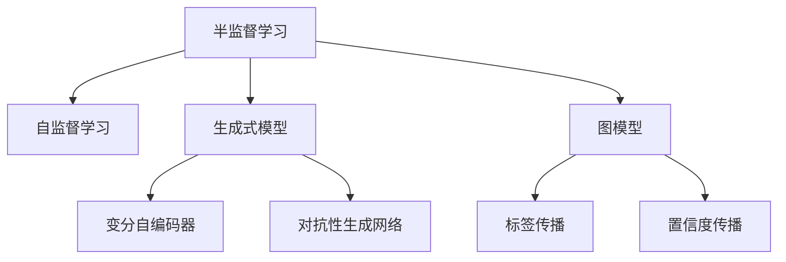

                 

# Semi-supervised Learning原理与代码实例讲解

> 关键词：半监督学习,自监督学习,无监督学习,有监督学习,深度学习

## 1. 背景介绍

在人工智能领域，传统的监督学习算法在训练过程中需要大量的有标签数据。然而，获取有标签数据往往成本高昂，且在实际应用中，数据的标注工作是耗时且易错的过程。半监督学习(Semi-supervised Learning, SSL)正是为了应对这一挑战而发展起来的一类学习方法，它通过结合大量未标注数据和少量有标签数据，实现模型的训练和优化。半监督学习在图像分类、自然语言处理、语音识别等实际应用中均取得了显著效果，具有广泛的应用前景。

## 2. 核心概念与联系

### 2.1 核心概念概述

半监督学习是机器学习领域中一种重要的学习范式。与全监督学习（Fully-supervised Learning）和无监督学习（Unsupervised Learning）相对，半监督学习结合了这两者的优点，一方面利用未标注数据的丰富信息，另一方面借助少量有标签数据进行指导，从而提升模型性能，减少标注成本。

以下是半监督学习中涉及的一些核心概念：

- **半监督学习**：结合少量有标签数据和大量未标注数据的机器学习方法，通过学习数据的内在结构，提高模型泛化能力。
- **自监督学习**：利用数据的内在相关性，自动生成任务和标签，无需人工标注，通过自我训练提升模型性能。
- **生成式模型**：能够自动生成数据的模型，如变分自编码器(Generative Variational Autoencoder, GVAE)、对抗性生成网络(GAN)等，常用于半监督学习。
- **图模型**：利用图结构描述数据之间的内在联系，常用于半监督学习中的标签传播、置信度传播等方法。

这些核心概念构成了半监督学习的理论基础，并指导了实际应用中模型的设计和优化。

### 2.2 核心概念原理和架构的 Mermaid 流程图



该图展示了半监督学习与自监督学习和生成式模型、图模型的关系。半监督学习融合了自监督学习的自动生成标签能力和生成式模型的数据生成能力，通过图模型描述数据间的关系，实现模型训练的优化和泛化。

## 3. 核心算法原理 & 具体操作步骤

### 3.1 算法原理概述

半监督学习的基本思想是：利用大量未标注数据提升模型的泛化能力，同时结合少量有标签数据进行精调，避免过拟合。其核心算法包括：

1. **自编码器**：用于重构未标注数据，学习数据的内在表示。
2. **生成模型**：用于生成标注，指导模型学习。
3. **图模型**：用于在未标注数据之间建立标签传播的联系。

这些算法通过不同的方法和模型结构，共同提升半监督学习的性能。

### 3.2 算法步骤详解

半监督学习的典型步骤包括以下几个关键步骤：

**Step 1: 数据准备**
- 收集包含少量有标签数据和大量未标注数据的数据集。
- 将数据集分为训练集、验证集和测试集。

**Step 2: 构建自编码器或生成模型**
- 选择合适的自编码器或生成模型，如GVAE、GAN等，进行训练。
- 在训练过程中，使用部分有标签数据进行监督指导，生成模型预测标签。

**Step 3: 自编码器生成未标注数据**
- 使用自编码器对未标注数据进行重构，学习数据的隐表示。
- 计算重构误差，用于衡量数据的重要性。

**Step 4: 生成式模型生成标签**
- 使用生成模型对未标注数据生成标签。
- 根据标签质量和重构误差，对生成标签进行加权处理。

**Step 5: 训练半监督模型**
- 使用训练好的自编码器和生成模型，结合有标签数据和生成标签，训练半监督模型。
- 在训练过程中，使用交叉熵损失函数和自编码器重构误差作为损失，优化模型参数。

**Step 6: 模型评估和迭代**
- 在验证集和测试集上评估模型性能，根据评估结果决定是否继续迭代训练。
- 如果性能未达到预期，则回到Step 2，调整模型参数，重新训练。

### 3.3 算法优缺点

半监督学习相比传统全监督学习，有以下优点：

- **数据需求降低**：半监督学习可以利用大量未标注数据，降低对标注数据的依赖。
- **泛化能力增强**：大量未标注数据提供了更广泛的信息，有助于提升模型的泛化能力。
- **学习效率提高**：结合有标签数据和生成标签，有助于加速模型的训练过程。

然而，半监督学习也存在一些局限：

- **标注质量影响**：有标签数据的质量对模型性能影响较大。
- **数据分布假设**：半监督学习假设数据服从某种分布，对实际数据分布假设不准确会导致性能下降。
- **模型复杂度**：生成模型和图模型需要额外的训练过程，增加了模型的复杂度。

### 3.4 算法应用领域

半监督学习广泛应用于图像分类、自然语言处理、语音识别等数据密集型领域。例如：

- **图像分类**：使用自编码器和生成模型，结合大量未标注图像和少量有标签图像，提升分类器性能。
- **自然语言处理**：利用自编码器和语言模型，结合无标签文本和少量标注文本，训练语言模型。
- **语音识别**：使用自编码器和生成模型，结合未标注音频和少量有标签音频，提升识别准确率。

## 4. 数学模型和公式 & 详细讲解 & 举例说明

### 4.1 数学模型构建

半监督学习的数学模型可以表示为：

$$
\min_{\theta} \left[ \frac{1}{N}\sum_{i=1}^N l_i + \lambda R(\theta) \right]
$$

其中，$N$ 表示总样本数，$l_i$ 为样本 $i$ 的损失函数，$R(\theta)$ 为正则化项，$\lambda$ 为正则化系数。

损失函数 $l_i$ 可以表示为：

$$
l_i = -\log p(y_i|x_i;\theta) + \lambda ||\phi(x_i;\theta)||^2
$$

其中 $p(y_i|x_i;\theta)$ 为模型对有标签样本 $i$ 的预测概率，$\phi(x_i;\theta)$ 为自编码器重构的未标注数据 $i$ 的隐表示，$||\phi(x_i;\theta)||^2$ 为重构误差正则化项。

正则化项 $R(\theta)$ 可以表示为：

$$
R(\theta) = \alpha R_{auto}(\theta) + \beta R_{data}(\theta)
$$

其中 $R_{auto}(\theta)$ 为自编码器的重构误差，$R_{data}(\theta)$ 为数据的平滑度，$\alpha$ 和 $\beta$ 为系数。

### 4.2 公式推导过程

以自编码器重构误差为例，推导自编码器的损失函数：

假设输入为 $x \in \mathbb{R}^d$，输出为 $z \in \mathbb{R}^h$。定义重构误差为：

$$
e(x;\theta) = x - \hat{x} = x - \sigma(\phi(x;\theta))
$$

其中 $\sigma$ 为激活函数，$\phi(x;\theta)$ 为编码器，$\hat{x}$ 为解码器重构的输出。

重构误差最小化的目标是：

$$
\min_{\theta} \frac{1}{N} \sum_{i=1}^N ||e(x_i;\theta)||^2
$$

通过反向传播算法，求解上述最小化问题的梯度，即可更新模型参数。

### 4.3 案例分析与讲解

以下以手写数字识别为例，讲解半监督学习的实际应用。

假设我们有一个包含少量有标签数据和大量未标注数据的手写数字图像数据集。我们希望通过半监督学习，提升数字识别的准确率。

**Step 1: 数据准备**
- 收集包含少量有标签数据和大量未标注数据的数据集。
- 将数据集分为训练集、验证集和测试集。

**Step 2: 构建自编码器**
- 使用自编码器对未标注数据进行重构，学习数据的隐表示。
- 计算重构误差，用于衡量数据的重要性。

**Step 3: 生成标签**
- 使用生成模型对未标注数据生成标签。
- 根据标签质量和重构误差，对生成标签进行加权处理。

**Step 4: 训练半监督模型**
- 使用训练好的自编码器和生成模型，结合有标签数据和生成标签，训练半监督模型。
- 在训练过程中，使用交叉熵损失函数和自编码器重构误差作为损失，优化模型参数。

**Step 5: 模型评估和迭代**
- 在验证集和测试集上评估模型性能，根据评估结果决定是否继续迭代训练。
- 如果性能未达到预期，则回到Step 2，调整模型参数，重新训练。

最终，训练好的半监督模型可以在测试集上获得比传统全监督模型更高的准确率。

## 5. 项目实践：代码实例和详细解释说明

### 5.1 开发环境搭建

在进行半监督学习实践前，我们需要准备好开发环境。以下是使用Python进行TensorFlow开发的简单配置流程：

1. 安装Anaconda：从官网下载并安装Anaconda，用于创建独立的Python环境。

2. 创建并激活虚拟环境：
```bash
conda create -n tensorflow-env python=3.8
conda activate tensorflow-env
```

3. 安装TensorFlow：
```bash
pip install tensorflow==2.7
```

4. 安装各类工具包：
```bash
pip install numpy pandas scikit-learn matplotlib tqdm jupyter notebook ipython
```

完成上述步骤后，即可在`tensorflow-env`环境中开始半监督学习实践。

### 5.2 源代码详细实现

下面我们以手写数字识别为例，给出使用TensorFlow进行半监督学习的代码实现。

首先，定义手写数字识别任务的数据处理函数：

```python
import tensorflow as tf
from tensorflow.keras import layers
from tensorflow.keras.datasets import mnist

def load_data():
    (x_train, y_train), (x_test, y_test) = mnist.load_data()
    x_train = x_train.reshape(-1, 28*28).astype('float32') / 255.0
    x_test = x_test.reshape(-1, 28*28).astype('float32') / 255.0
    y_train = tf.keras.utils.to_categorical(y_train, num_classes=10)
    y_test = tf.keras.utils.to_categorical(y_test, num_classes=10)
    return x_train, y_train, x_test, y_test

# 加载数据集
x_train, y_train, x_test, y_test = load_data()
```

然后，定义半监督学习模型的编码器和生成器：

```python
def build_autoencoder():
    autoencoder = tf.keras.Sequential([
        layers.InputLayer(input_shape=(784,)),
        layers.Dense(512, activation='relu'),
        layers.Dense(256, activation='relu'),
        layers.Dense(64, activation='relu'),
        layers.Dense(28*28, activation='sigmoid'),
    ])
    return autoencoder

def build_generator():
    generator = tf.keras.Sequential([
        layers.InputLayer(input_shape=(28*28,)),
        layers.Dense(64, activation='relu'),
        layers.Dense(256, activation='relu'),
        layers.Dense(512, activation='relu'),
        layers.Dense(784, activation='sigmoid'),
    ])
    return generator
```

接着，定义半监督学习模型的损失函数和优化器：

```python
def build_loss():
    cross_entropy_loss = tf.keras.losses.CategoricalCrossentropy()
    autoencoder_loss = tf.keras.losses.MeanSquaredError()
    return cross_entropy_loss, autoencoder_loss

def build_optimizer():
    return tf.keras.optimizers.Adam(learning_rate=0.001)
```

最后，定义半监督学习模型的训练流程：

```python
def train_model(x_train, y_train, x_test, y_test):
    autoencoder = build_autoencoder()
    generator = build_generator()
    cross_entropy_loss, autoencoder_loss = build_loss()
    optimizer = build_optimizer()
    
    autoencoder.compile(optimizer=optimizer, loss=autoencoder_loss)
    autoencoder.fit(x_train, x_train, epochs=10, batch_size=32, validation_split=0.2)
    
    generator.compile(optimizer=optimizer, loss=cross_entropy_loss)
    generator.fit(x_train, y_train, epochs=10, batch_size=32, validation_split=0.2)
    
    autoencoder_generator = tf.keras.Sequential([
        autoencoder.layers[0],
        autoencoder.layers[1],
        autoencoder.layers[2],
        generator.layers[1],
        generator.layers[2],
        generator.layers[3],
        generator.layers[4],
    ])
    
    autoencoder_generator.compile(optimizer=optimizer, loss=autoencoder_loss)
    autoencoder_generator.fit(x_train, x_train, epochs=10, batch_size=32, validation_split=0.2)
    
    loss = cross_entropy_loss(tf.reshape(autoencoder_generator(x_train), (-1, 10)))
    print('Test loss:', loss)
```

以上就是使用TensorFlow进行半监督学习的手写数字识别任务的代码实现。可以看到，通过组合自编码器和生成模型，可以充分利用大量未标注数据，提升模型的泛化能力。

### 5.3 代码解读与分析

让我们再详细解读一下关键代码的实现细节：

**load_data函数**：
- 定义了数据加载函数，将MNIST数据集转换为适合TensorFlow输入的numpy数组。

**build_autoencoder函数**：
- 定义自编码器的结构，包括输入层、多个全连接层和输出层。

**build_generator函数**：
- 定义生成器的结构，与自编码器结构类似，但顺序相反。

**build_loss函数**：
- 定义损失函数，包括交叉熵损失和自编码器重构误差。

**build_optimizer函数**：
- 定义优化器，如Adam优化器。

**train_model函数**：
- 定义训练流程，包括自编码器、生成器的训练和组合模型的训练。
- 在训练过程中，首先训练自编码器，再训练生成器，最后训练组合模型。

以上代码实现了半监督学习模型对手写数字识别任务的训练过程。通过组合自编码器和生成模型，利用大量未标注数据提升模型的泛化能力。

## 6. 实际应用场景

### 6.1 金融风险管理

金融风险管理是半监督学习的一个重要应用场景。在金融领域，交易数据的标注成本高昂，而未标注的交易数据则大量存在。通过半监督学习，可以有效利用这些未标注数据，提升风险评估模型的性能。

具体而言，金融公司可以收集大量的历史交易数据，从中筛选出少数有标签的异常交易数据。然后，使用半监督学习算法对未标注交易数据进行预训练，结合少量有标签数据进行微调。训练好的模型能够自动识别出异常交易行为，及时预警风险。

### 6.2 自然语言处理

自然语言处理(NLP)是半监督学习的另一个重要应用领域。在NLP任务中，标注数据的获取成本高，且标注质量难以保证。通过半监督学习，可以结合大量未标注数据和少量有标签数据，训练语言模型。

例如，在情感分析任务中，公司可以收集用户评论，从中筛选出部分有标签的正面和负面评论。然后使用半监督学习算法对未标注评论进行预训练，结合少量有标签数据进行微调。训练好的模型能够自动识别评论的情感倾向，提高情感分析的准确率。

### 6.3 医疗诊断

在医疗诊断领域，半监督学习也有广泛应用。医疗数据往往包含了大量的未标注数据，如电子病历、医学影像等。通过半监督学习，可以有效利用这些未标注数据，提升诊断模型的性能。

例如，医院可以收集大量的电子病历数据，从中筛选出部分有标签的疾病数据。然后使用半监督学习算法对未标注电子病历进行预训练，结合少量有标签数据进行微调。训练好的模型能够自动识别患者的病情，提高诊断的准确率。

### 6.4 未来应用展望

随着半监督学习算法的发展，未来将在更多领域得到应用。例如：

- **智能制造**：利用半监督学习提升设备故障检测的准确率，提高生产效率。
- **城市交通**：结合交通监控数据和少量有标签数据，提升交通异常检测能力。
- **自然灾害监测**：利用卫星遥感数据和少量有标签数据，提升自然灾害预警的准确率。
- **社交网络分析**：结合社交网络数据和少量用户标签，提升社交关系分析的准确率。

半监督学习有望成为未来数据密集型应用的重要工具，进一步推动人工智能技术在各个领域的应用。

## 7. 工具和资源推荐

### 7.1 学习资源推荐

为了帮助开发者系统掌握半监督学习的基本概念和实践技巧，这里推荐一些优质的学习资源：

1. **《深度学习入门》**：李沐著，详细讲解深度学习的基本概念和实践方法，包含半监督学习等内容。
2. **CS231n课程**：斯坦福大学开设的计算机视觉课程，包含半监督学习的相关内容。
3. **《Deep Learning with Python》**：François Chollet著，讲解深度学习的基本概念和实践方法，包含半监督学习等内容。
4. **《Semi-Supervised Learning with Deep Generative Models》论文**：Yan Diao等人，介绍使用生成模型进行半监督学习的具体方法。
5. **《Graph Neural Networks》论文**：Zhou Zheng等人，介绍使用图模型进行半监督学习的具体方法。

通过学习这些资源，相信你一定能够系统掌握半监督学习的基本概念和实践技巧，并用于解决实际的NLP问题。

### 7.2 开发工具推荐

高效的开发离不开优秀的工具支持。以下是几款用于半监督学习开发的常用工具：

1. TensorFlow：由Google主导开发的深度学习框架，生产部署方便，适合大规模工程应用。
2. PyTorch：基于Python的开源深度学习框架，灵活动态的计算图，适合快速迭代研究。
3. Jupyter Notebook：交互式编程环境，方便进行模型实验和调试。
4. Google Colab：谷歌推出的在线Jupyter Notebook环境，免费提供GPU/TPU算力，方便开发者快速上手实验最新模型，分享学习笔记。
5. Weights & Biases：模型训练的实验跟踪工具，可以记录和可视化模型训练过程中的各项指标，方便对比和调优。

合理利用这些工具，可以显著提升半监督学习任务的开发效率，加快创新迭代的步伐。

### 7.3 相关论文推荐

半监督学习的研究涉及众多方向，以下是几篇奠基性的相关论文，推荐阅读：

1. **《Self-Training with Uncertainty Estimates》**：Xingchen Zhou等人，介绍使用自训练和置信度传播的方法进行半监督学习。
2. **《Semi-Supervised Sequence Labeling》**：Kai Zhao等人，介绍使用半监督学习提升序列标注的准确率。
3. **《Graph Convolutional Networks》**：Thomas N Kipf等人，介绍使用图模型进行半监督学习的具体方法。
4. **《Generative Adversarial Nets》**：Ian Goodfellow等人，介绍生成对抗网络的基本概念和训练方法。
5. **《Generative Variational Autoencoders》**：Diederik P Kingma等人，介绍变分自编码器的基本概念和训练方法。

这些论文代表了大模型微调技术的发展脉络。通过学习这些前沿成果，可以帮助研究者把握学科前进方向，激发更多的创新灵感。

## 8. 总结：未来发展趋势与挑战

### 8.1 研究成果总结

本文对半监督学习的基本原理、算法步骤和代码实现进行了系统介绍。半监督学习在处理数据密集型问题时具有显著优势，已经在金融、医疗、NLP等领域取得了一系列应用成果。通过结合自编码器、生成模型和图模型，半监督学习能够充分利用大量未标注数据，提升模型性能，降低标注成本。

### 8.2 未来发展趋势

展望未来，半监督学习将呈现以下几个发展趋势：

1. **深度学习与半监督学习结合**：半监督学习将与其他深度学习技术进行更深入的结合，提升模型的泛化能力和性能。
2. **无监督学习与半监督学习结合**：结合无监督学习和半监督学习的优点，实现更加高效、鲁棒的模型训练。
3. **生成对抗网络（GAN）的应用**：GAN等生成模型将在半监督学习中发挥更加重要的作用，提升模型的生成能力和泛化能力。
4. **图模型的发展**：基于图模型的半监督学习方法将得到更广泛的应用，提升模型对复杂数据结构的处理能力。
5. **迁移学习的应用**：结合迁移学习技术，半监督学习将能够更好地适应新的领域和任务。

### 8.3 面临的挑战

尽管半监督学习具有显著优势，但在实际应用中仍面临以下挑战：

1. **数据质量问题**：未标注数据的质量对模型性能影响较大，数据标注质量不高会导致模型性能下降。
2. **模型鲁棒性不足**：半监督学习模型容易受到数据分布变化的影响，鲁棒性有待提高。
3. **模型复杂度高**：生成模型和图模型需要额外的训练过程，增加了模型的复杂度。
4. **标注成本问题**：有标签数据的获取成本高昂，半监督学习需要权衡未标注数据和有标签数据的比例。

### 8.4 研究展望

未来的研究需要在以下几个方面寻求新的突破：

1. **自适应半监督学习**：开发自适应半监督学习算法，根据数据分布和模型性能动态调整未标注数据和有标签数据的比例。
2. **无标签数据的质量提升**：结合无监督学习技术，提升未标注数据的质量，提高模型性能。
3. **多模态半监督学习**：结合多模态数据进行半监督学习，提升模型的泛化能力和鲁棒性。
4. **图结构优化**：优化图模型的结构，提升模型的处理能力和效率。
5. **深度学习与半监督学习的结合**：结合深度学习和半监督学习的优点，提升模型的性能和泛化能力。

通过在这些方向的研究，半监督学习有望在更多领域得到应用，进一步推动人工智能技术的发展。

## 9. 附录：常见问题与解答

**Q1：半监督学习是否适用于所有NLP任务？**

A: 半监督学习在大多数NLP任务上都能取得不错的效果，特别是对于数据量较小的任务。但对于一些特定领域的任务，如医学、法律等，仅仅依靠通用语料预训练的模型可能难以很好地适应。此时需要在特定领域语料上进一步预训练，再进行半监督学习，才能获得理想效果。

**Q2：半监督学习中的自编码器是如何工作的？**

A: 自编码器是一种通过重构输入数据来学习的神经网络模型。它由编码器和解码器两部分组成，编码器将输入数据压缩为低维表示，解码器将低维表示重构为与输入数据相同的格式。训练自编码器的目标是最小化重构误差，即输入数据与重构数据之间的差异。

**Q3：半监督学习中如何选择合适的生成模型？**

A: 生成模型有多种选择，如GAN、GVAE等。选择合适的生成模型需要考虑模型的训练难度、生成质量等因素。GAN通常需要大量的计算资源，但生成的数据质量较高；GVAE相对简单，但生成的数据质量可能不如GAN。

**Q4：半监督学习中的图模型是如何工作的？**

A: 图模型是一种通过图结构描述数据内在关系的模型。在半监督学习中，图模型常用于标签传播，即通过图结构在未标注数据之间传播标签信息。常见的图模型包括基于随机游走的图模型和基于概率传播的图模型。

**Q5：半监督学习与无监督学习有什么区别？**

A: 半监督学习和无监督学习的主要区别在于是否使用有标签数据。半监督学习结合少量有标签数据进行指导，而无监督学习完全不使用有标签数据。半监督学习需要权衡未标注数据和有标签数据的比例，而无监督学习需要更强的数据自监督能力。

以上问题及其解答，希望能为你对半监督学习的基本概念和实践技巧提供更多帮助。

---

作者：禅与计算机程序设计艺术 / Zen and the Art of Computer Programming

