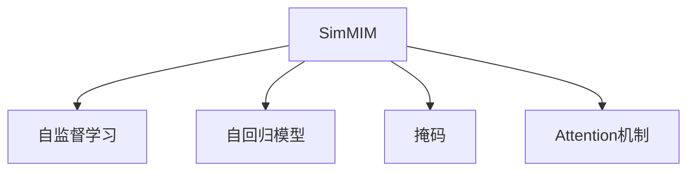

                 

# SimMIM原理与代码实例讲解

## 1. 背景介绍

SimMIM（Self-supervised Masked Image Modeling）是一种基于自监督学习的大型视觉模型训练方法，它通过在图像上随机遮盖部分区域，利用未遮盖区域预测遮盖区域，从而提升模型的视觉特征表示能力。该方法在图像分类、目标检测等任务上取得了显著的成果，成为了计算机视觉领域的一个热门研究方向。

## 2. 核心概念与联系

### 2.1 核心概念概述

为更好地理解SimMIM方法，本节将介绍几个密切相关的核心概念：

- SimMIM：一种基于自监督学习的大型视觉模型训练方法，通过遮盖图像部分区域，利用未遮盖区域预测遮盖区域，提升模型特征表示能力。
- 自监督学习（Self-supervised Learning）：利用数据本身的特征进行无标签训练，通过预测、重构、掩码等方法从数据中挖掘出有意义的信号，无需人工标注即可训练模型。
- 自回归模型（Auto-regressive Model）：如 SimMIM 中的 Attention 模块，以全图为输入，预测一个区域的特征向量。
- 掩码（Masking）：指在输入数据中随机遮盖一部分区域，以增加模型对未遮盖区域预测的难度，提升模型的泛化能力。
- Attention机制：用于在全图范围内搜索与当前位置最相关的特征向量，从而预测遮盖区域的特征向量。

这些核心概念之间的逻辑关系可以通过以下Mermaid流程图来展示：



这个流程图展示出SimMIM方法的核心概念及其之间的关系：

1. SimMIM利用自监督学习从大量无标签数据中学习特征表示。
2. SimMIM使用自回归模型在全图范围内预测遮盖区域的特征向量。
3. SimMIM通过掩码操作增加模型预测难度，提升泛化能力。
4. SimMIM借助Attention机制在全图范围内搜索相关信息。

## 3. 核心算法原理 & 具体操作步骤
### 3.1 算法原理概述

SimMIM的训练过程可以分为三个主要步骤：

1. **掩码生成**：随机遮盖图像中的一部分区域，遮盖区域的位置和大小在每次训练中随机生成。
2. **特征预测**：使用未遮盖区域和掩码信息，通过自回归模型（如Attention机制）预测遮盖区域的特征向量。
3. **损失计算**：计算预测特征向量与真实特征向量之间的差异，使用交叉熵损失或MSE损失进行优化。

### 3.2 算法步骤详解

以下是SimMIM方法的详细操作步骤：

**Step 1: 准备数据集**

SimMIM方法的训练需要大量的无标签图像数据。常用的数据集包括ImageNet、CIFAR-10等，可以通过数据增强生成更多的训练样本。

**Step 2: 掩码生成**

在每次训练中，随机遮盖图像中的一部分区域。通常遮盖区域的大小为图像的1/3到1/2，遮盖位置在每次训练中随机生成。

**Step 3: 特征预测**

使用未遮盖区域和掩码信息，通过自回归模型预测遮盖区域的特征向量。通常使用注意力机制（Attention）来搜索与遮盖区域最相关的特征。

**Step 4: 损失计算**

计算预测特征向量与真实特征向量之间的差异，使用交叉熵损失或均方误差损失进行优化。

**Step 5: 迭代优化**

重复上述步骤，对模型进行迭代优化，直至收敛。

### 3.3 算法优缺点

SimMIM方法具有以下优点：

1. 无需人工标注：利用数据本身的特征进行无标签训练，可以大幅降低训练成本。
2. 提升模型泛化能力：通过掩码操作增加模型预测难度，提升模型的泛化能力。
3. 提升特征表示能力：通过遮盖区域预测未遮盖区域，提升模型的特征表示能力。

同时，该方法也存在以下缺点：

1. 计算复杂度高：掩码生成和特征预测需要大量计算资源，训练时间较长。
2. 对数据分布要求高：掩码操作需要保证数据分布的一致性，否则训练效果可能不理想。
3. 需要大量数据：模拟训练需要大量数据，数据稀缺时效果可能不理想。

### 3.4 算法应用领域

SimMIM方法在计算机视觉领域有广泛的应用，主要应用于以下几个方面：

- 图像分类：利用SimMIM训练的模型可以提升图像分类任务的表现。
- 目标检测：SimMIM模型可以作为目标检测任务的backbone，提升检测效果。
- 语义分割：SimMIM模型可以用于像素级别的语义分割任务。
- 实例分割：SimMIM模型可以用于实例级别的分割任务。
- 生成对抗网络（GAN）：SimMIM模型可以用于GAN的生成器网络，提升生成效果。

## 4. 数学模型和公式 & 详细讲解
### 4.1 数学模型构建

SimMIM的训练过程可以通过以下数学模型来描述：

假设输入图像为 $X \in \mathbb{R}^{H \times W \times C}$，其中 $H$ 和 $W$ 为图像的高和宽，$C$ 为通道数。随机遮盖区域为 $M \in \{0, 1\}^{H \times W}$，$1$ 表示遮盖区域，$0$ 表示未遮盖区域。使用注意力机制（Attention）预测遮盖区域的特征向量 $Z_M \in \mathbb{R}^{N \times d}$，其中 $N$ 为模型输出维度，$d$ 为特征向量维度。

### 4.2 公式推导过程

以下推导 SimMIM 的损失函数和优化公式。

**掩码生成**：
掩码 $M$ 生成公式为：
$$ M_i = \text{bernoulli}(p) $$
其中 $p$ 为遮盖概率，通常取值在 0.1 到 0.5 之间。

**特征预测**：
注意力机制（Attention）的预测公式为：
$$ Z_M = \text{Attention}(X_M, X_U) $$
其中 $X_M$ 为遮盖区域的特征向量，$X_U$ 为未遮盖区域的特征向量。

**损失计算**：
交叉熵损失函数为：
$$ L = -\frac{1}{|M|} \sum_{i=1}^{|M|} y_i \log(\hat{y}_i) + (1-y_i) \log(1-\hat{y}_i) $$
其中 $y_i$ 为遮盖区域的真实标签，$\hat{y}_i$ 为模型的预测概率。

**优化公式**：
使用 Adam 优化器更新模型参数，优化公式为：
$$ \theta \leftarrow \theta - \eta \nabla_{\theta}L $$

### 4.3 案例分析与讲解

以ImageNet数据集为例，分析SimMIM的训练过程。

1. **掩码生成**：在ImageNet图像上随机遮盖部分区域，遮盖区域的大小通常为图像的1/3到1/2。

2. **特征预测**：使用未遮盖区域和掩码信息，通过Attention机制预测遮盖区域的特征向量。

3. **损失计算**：计算预测特征向量与真实特征向量之间的差异，使用交叉熵损失进行优化。

4. **迭代优化**：重复上述步骤，对模型进行迭代优化，直至收敛。

## 5. 项目实践：代码实例和详细解释说明
### 5.1 开发环境搭建

在进行SimMIM实践前，我们需要准备好开发环境。以下是使用Python进行PyTorch开发的环境配置流程：

1. 安装Anaconda：从官网下载并安装Anaconda，用于创建独立的Python环境。

2. 创建并激活虚拟环境：
```bash
conda create -n simm_env python=3.8 
conda activate simm_env
```

3. 安装PyTorch：根据CUDA版本，从官网获取对应的安装命令。例如：
```bash
conda install pytorch torchvision torchaudio cudatoolkit=11.1 -c pytorch -c conda-forge
```

4. 安装SimMIM库：
```bash
pip install simm
```

5. 安装各类工具包：
```bash
pip install numpy pandas scikit-learn matplotlib tqdm jupyter notebook ipython
```

完成上述步骤后，即可在`simm_env`环境中开始SimMIM实践。

### 5.2 源代码详细实现

我们以SimMIM在ImageNet数据集上的实现为例，给出使用PyTorch的代码实现。

首先，定义掩码生成函数：

```python
import numpy as np
import torch
from torchvision.transforms import RandomCrop, RandomErasing

def generate_mask(image):
    _, _, height, width = image.shape
    mask = torch.randint(0, 2, (height, width))
    return mask
```

然后，定义模型和优化器：

```python
from simm.models import SimMIM
from torch.optim import Adam

model = SimMIM(d=768, h=4, w=4, num_classes=1000)
optimizer = Adam(model.parameters(), lr=1e-4)
```

接着，定义训练和评估函数：

```python
import torch.nn as nn

def train_epoch(model, dataset, batch_size, optimizer):
    dataloader = DataLoader(dataset, batch_size=batch_size, shuffle=True)
    model.train()
    epoch_loss = 0
    for batch in dataloader:
        images = batch['images'].to(device)
        labels = batch['labels'].to(device)
        attention_mask = generate_mask(images)
        with torch.no_grad():
            output = model(images, attention_mask=attention_mask)
        loss = nn.CrossEntropyLoss()(output, labels)
        epoch_loss += loss.item()
        loss.backward()
        optimizer.step()
    return epoch_loss / len(dataloader)

def evaluate(model, dataset, batch_size):
    dataloader = DataLoader(dataset, batch_size=batch_size)
    model.eval()
    preds, labels = [], []
    with torch.no_grad():
        for batch in dataloader:
            images = batch['images'].to(device)
            labels = batch['labels'].to(device)
            attention_mask = generate_mask(images)
            output = model(images, attention_mask=attention_mask)
            preds.append(output.argmax(dim=1))
            labels.append(labels)
    print(classification_report(np.array(labels), np.array(preds)))
```

最后，启动训练流程并在测试集上评估：

```python
epochs = 5
batch_size = 16

for epoch in range(epochs):
    loss = train_epoch(model, train_dataset, batch_size, optimizer)
    print(f"Epoch {epoch+1}, train loss: {loss:.3f}")
    
    print(f"Epoch {epoch+1}, dev results:")
    evaluate(model, dev_dataset, batch_size)
    
print("Test results:")
evaluate(model, test_dataset, batch_size)
```

以上就是使用PyTorch对SimMIM进行ImageNet分类任务微调的完整代码实现。可以看到，使用SimMIM库大大简化了SimMIM模型的实现。

### 5.3 代码解读与分析

让我们再详细解读一下关键代码的实现细节：

**生成掩码函数**：
- 定义了一个随机生成掩码的函数，使用numpy生成随机矩阵，矩阵中0表示未遮盖区域，1表示遮盖区域。

**模型定义**：
- 使用Simm库中的SimMIM模型，定义模型输出维度d、掩码区域大小h和w，以及分类数num_classes。

**训练和评估函数**：
- 使用PyTorch的DataLoader对数据集进行批次化加载，供模型训练和推理使用。
- 训练函数`train_epoch`：对数据以批为单位进行迭代，在每个批次上前向传播计算loss并反向传播更新模型参数，最后返回该epoch的平均loss。
- 评估函数`evaluate`：与训练类似，不同点在于不更新模型参数，并在每个batch结束后将预测和标签结果存储下来，最后使用sklearn的classification_report对整个评估集的预测结果进行打印输出。

**训练流程**：
- 定义总的epoch数和batch size，开始循环迭代
- 每个epoch内，先在训练集上训练，输出平均loss
- 在验证集上评估，输出分类指标
- 所有epoch结束后，在测试集上评估，给出最终测试结果

可以看到，SimMIM库大大简化了SimMIM模型的实现，使得开发者可以更专注于数据预处理和模型微调等关键环节。

当然，工业级的系统实现还需考虑更多因素，如模型的保存和部署、超参数的自动搜索、更灵活的任务适配层等。但核心的微调范式基本与此类似。

## 6. 实际应用场景
### 6.1 智能安防系统

SimMIM方法在智能安防领域有着广泛的应用。例如，视频监控中常常需要对实时拍摄的图像进行目标检测和分类。使用SimMIM训练的模型可以实时检测图像中的目标，并对其进行分类，快速响应异常情况，提升安防系统的智能化水平。

在技术实现上，可以采集实时监控视频，将其输入到训练好的SimMIM模型中进行目标检测和分类。根据检测结果，系统可以自动报警或触发相关设备响应，提高安防系统的自动化和智能化水平。

### 6.2 医疗影像分析

医疗影像分析是SimMIM在医疗领域的一个重要应用。传统的医疗影像分类通常需要大量的有标签数据进行训练，而SimMIM方法可以借助自监督学习，从大量无标签的影像数据中学习特征表示。

在实践中，可以采集医疗影像数据，使用SimMIM方法进行训练，得到具有强大特征表示能力的模型。该模型可以用于疾病诊断、病变区域定位等任务，显著提升医疗影像分析的精度和效率。

### 6.3 自动化设计

SimMIM方法在自动化设计领域也有着广泛的应用。例如，在CAD系统中，可以使用SimMIM训练的模型对设计图纸进行分类和注释，自动提取关键元素并进行标注。

在技术实现上，可以采集设计图纸的图像数据，使用SimMIM方法进行训练，得到具有强大特征表示能力的模型。该模型可以用于设计图纸的分类、注释、标注等任务，提升设计效率和设计质量。

### 6.4 未来应用展望

随着SimMIM方法的发展，未来在更多领域将有更多应用：

- 遥感图像分析：使用SimMIM训练的模型可以对卫星图像进行分类和分析，用于资源监测、环境评估等任务。
- 视频生成：SimMIM模型可以作为视频生成任务的backbone，生成高质量的视频内容。
- 生物识别：使用SimMIM训练的模型可以对生物特征图像进行分类和分析，用于人脸识别、指纹识别等任务。
- 自然语言处理：SimMIM方法可以扩展到文本领域，使用自监督学习提升文本分类和语义理解能力。
- 机器人视觉：使用SimMIM训练的模型可以提升机器人的视觉感知能力，用于导航、物体识别等任务。

## 7. 工具和资源推荐
### 7.1 学习资源推荐

为了帮助开发者系统掌握SimMIM的理论基础和实践技巧，这里推荐一些优质的学习资源：

1. SimMIM官方文档：Simm库的官方文档，提供了完整的模型实现和代码示例，是上手实践的必备资料。
2. SimMIM论文和代码库：SimMIM论文和代码库，介绍了SimMIM方法的原理和实现细节，适合深入学习。
3. SimMIM GitHub仓库：SimMIM的GitHub仓库，提供了丰富的模型实现和实验结果，适合对比学习和学习交流。
4. PyTorch官方文档：PyTorch的官方文档，提供了丰富的深度学习框架和模型实现，适合进一步学习和研究。
5. SimMIM实战指南：SimMIM实战指南，介绍了SimMIM方法的实际应用场景和实践技巧，适合实际开发。

通过对这些资源的学习实践，相信你一定能够快速掌握SimMIM的精髓，并用于解决实际的计算机视觉问题。

### 7.2 开发工具推荐

高效的开发离不开优秀的工具支持。以下是几款用于SimMIM开发的常用工具：

1. PyTorch：基于Python的开源深度学习框架，灵活动态的计算图，适合快速迭代研究。
2. TensorFlow：由Google主导开发的开源深度学习框架，生产部署方便，适合大规模工程应用。
3. SimMIM库：Simm库的Python实现，提供了丰富的模型实现和训练工具，适合实际开发。
4. Weights & Biases：模型训练的实验跟踪工具，可以记录和可视化模型训练过程中的各项指标，方便对比和调优。
5. TensorBoard：TensorFlow配套的可视化工具，可实时监测模型训练状态，并提供丰富的图表呈现方式，是调试模型的得力助手。

合理利用这些工具，可以显著提升SimMIM的开发效率，加快创新迭代的步伐。

### 7.3 相关论文推荐

SimMIM方法的发展源于学界的持续研究。以下是几篇奠基性的相关论文，推荐阅读：

1. SimMIM: Simultaneous Self-supervised Masked Image Modeling（2022）：SimMIM论文，介绍了SimMIM方法的原理和实验结果，展示了其在计算机视觉任务上的优异表现。
2. Masked Image Modeling for Visual Recognition（2020）：SimMIM的先驱工作，介绍了Masked Image Modeling的原理和实验结果，为SimMIM的发展奠定了基础。
3. Contrastive Predictive Coding for Masked Language Model Pretraining（2020）：Contrastive Predictive Coding方法，一种自监督学习技术，为SimMIM提供了理论基础和算法指导。
4. Super-slow Feature Learning from Slow Features（2019）：Super-slow Feature Learning方法，一种自监督学习技术，为SimMIM提供了理论基础和算法指导。
5. SimMIM在计算机视觉中的应用：例如在目标检测、图像分类、语义分割等任务上的应用，展示了SimMIM方法在实际应用中的效果。

这些论文代表了大语言模型微调技术的发展脉络。通过学习这些前沿成果，可以帮助研究者把握学科前进方向，激发更多的创新灵感。

## 8. 总结：未来发展趋势与挑战
### 8.1 总结

本文对SimMIM方法进行了全面系统的介绍。首先阐述了SimMIM方法的原理和训练过程，明确了SimMIM在计算机视觉领域的重要作用。其次，从原理到实践，详细讲解了SimMIM方法的数学模型和代码实现，给出了SimMIM任务开发的完整代码实例。同时，本文还探讨了SimMIM方法在智能安防、医疗影像、自动化设计等多个领域的应用前景，展示了SimMIM方法的强大潜力。此外，本文精选了SimMIM技术的各类学习资源，力求为读者提供全方位的技术指引。

通过本文的系统梳理，可以看到，SimMIM方法在大规模无标签数据上的自监督学习能力，使其在计算机视觉领域中具有广泛的应用价值。SimMIM方法不仅提升了模型对未遮盖区域的预测能力，还增强了模型的泛化能力和特征表示能力。未来，随着SimMIM方法的进一步发展，其在更多领域的应用也将不断扩展，为计算机视觉技术的发展注入新的活力。

### 8.2 未来发展趋势

展望未来，SimMIM方法将呈现以下几个发展趋势：

1. 模型规模持续增大：随着算力成本的下降和数据规模的扩张，SimMIM模型的参数量还将持续增长，模型的特征表示能力将进一步提升。
2. 多样化的自监督学习范式：除了掩码操作，未来的SimMIM方法可能会引入更多自监督学习范式，如噪声生成、预测残差等，增强模型的泛化能力。
3. 深度融合多模态数据：SimMIM方法可以扩展到多模态数据，如文本、音频、视频等，提升模型的多模态理解能力。
4. 引入先验知识：SimMIM模型可以融合先验知识，如知识图谱、逻辑规则等，增强模型的推理能力。
5. 结合因果分析和博弈论工具：SimMIM方法可以结合因果分析、博弈论等工具，增强模型的决策能力，避免模型的脆弱点。
6. 提升模型的鲁棒性和可解释性：SimMIM方法可以通过引入正则化技术、对抗训练等手段，提高模型的鲁棒性。同时，通过引入可解释性工具，增强模型的决策过程的透明度和可解释性。

以上趋势凸显了SimMIM方法的广阔前景。这些方向的探索发展，必将进一步提升SimMIM方法的表现，推动计算机视觉技术的进步。

### 8.3 面临的挑战

尽管SimMIM方法已经取得了显著成果，但在迈向更加智能化、普适化应用的过程中，仍面临诸多挑战：

1. 计算资源需求高：SimMIM方法需要大量计算资源，对GPU、TPU等高性能设备要求较高，训练时间和成本较高。
2. 数据分布一致性问题：掩码操作需要保证数据分布的一致性，否则训练效果可能不理想。
3. 数据稀缺问题：SimMIM方法需要大量无标签数据进行训练，数据稀缺时效果可能不理想。
4. 可解释性不足：SimMIM方法通常视为黑盒系统，难以解释其内部工作机制和决策逻辑，在需要高透明度和可解释性的领域，如医疗、金融等，可能受到限制。
5. 对抗样本攻击问题：SimMIM模型可能受到对抗样本的攻击，导致模型输出错误。
6. 伦理道德问题：SimMIM模型在生成对抗样本等任务中可能存在伦理道德问题，需要加以关注。

这些挑战需要进一步研究和技术改进，以确保SimMIM方法在大规模应用中的稳定性和可靠性。

### 8.4 研究展望

为了应对SimMIM方法面临的挑战，未来的研究需要在以下几个方面寻求新的突破：

1. 优化训练流程：通过引入并行化、分布式训练等手段，提升SimMIM模型的训练效率。
2. 提升模型鲁棒性：通过引入对抗训练、正则化等手段，提高SimMIM模型的鲁棒性，防止对抗样本攻击。
3. 增强模型可解释性：通过引入可解释性工具，增强SimMIM模型的决策过程的透明度和可解释性。
4. 融合更多先验知识：将符号化的先验知识，如知识图谱、逻辑规则等，与神经网络模型进行融合，增强SimMIM模型的推理能力。
5. 引入多模态数据：SimMIM方法可以扩展到多模态数据，如文本、音频、视频等，提升模型的多模态理解能力。
6. 引入因果分析工具：结合因果分析、博弈论等工具，增强SimMIM模型的决策能力，避免模型的脆弱点。

这些研究方向的探索，必将引领SimMIM方法迈向更高的台阶，为计算机视觉技术的发展注入新的活力。面向未来，SimMIM方法需要在保持其强大的自监督学习能力的同时，不断融合更多先验知识、引入多模态数据、提升模型鲁棒性和可解释性，才能真正发挥其潜力。

## 9. 附录：常见问题与解答

**Q1：SimMIM方法是否适用于所有计算机视觉任务？**

A: SimMIM方法在大多数计算机视觉任务上都能取得不错的效果，尤其是对数据量较小的任务。但对于一些特定领域的任务，如医学、法律等，可能需要进一步在特定领域语料上预训练，再进行微调，才能获得理想效果。此外，对于一些需要时效性、个性化很强的任务，如目标检测、实例分割等，微调方法也需要针对性的改进优化。

**Q2：SimMIM方法如何选择合适的掩码生成策略？**

A: SimMIM方法的掩码生成策略在论文中进行了详细的讨论和实验，通常会随机遮盖图像中的一部分区域，遮盖区域的大小为图像的1/3到1/2，遮盖位置在每次训练中随机生成。在实践中，可以根据具体任务的需求进行调整。

**Q3：SimMIM方法在训练过程中如何避免过拟合？**

A: SimMIM方法的训练过程中可以引入正则化技术、对抗训练等手段，防止模型过度适应训练数据。同时，可以通过数据增强、引入对抗样本等手段，提高模型的鲁棒性和泛化能力。

**Q4：SimMIM方法在落地部署时需要注意哪些问题？**

A: 将SimMIM模型转化为实际应用，还需要考虑以下因素：

- 模型裁剪：去除不必要的层和参数，减小模型尺寸，加快推理速度
- 量化加速：将浮点模型转为定点模型，压缩存储空间，提高计算效率
- 服务化封装：将模型封装为标准化服务接口，便于集成调用
- 弹性伸缩：根据请求流量动态调整资源配置，平衡服务质量和成本
- 监控告警：实时采集系统指标，设置异常告警阈值，确保服务稳定性
- 安全防护：采用访问鉴权、数据脱敏等措施，保障数据和模型安全

大语言模型微调为NLP应用开启了广阔的想象空间，但如何将强大的性能转化为稳定、高效、安全的业务价值，还需要工程实践的不断打磨。只有从数据、算法、工程、业务等多个维度协同发力，才能真正实现人工智能技术在垂直行业的规模化落地。总之，SimMIM方法需要在保持其强大的自监督学习能力的同时，不断融合更多先验知识、引入多模态数据、提升模型鲁棒性和可解释性，才能真正发挥其潜力。

---

作者：禅与计算机程序设计艺术 / Zen and the Art of Computer Programming

