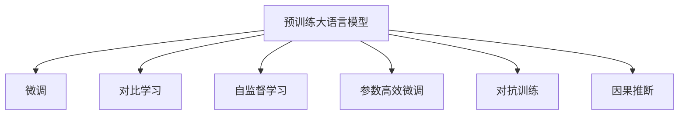

                 

## 1. 背景介绍

近年来，深度学习技术在自然语言处理(NLP)领域取得了显著进展，特别是由OpenAI推出的ChatGPT模型，因其卓越的性能和丰富的语义理解能力，迅速成为AI研究领域的明星模型。同时，国内AI厂商也在积极探索和研发自己的大模型，其中，Sora模型就是其中的佼佼者。本文将对比分析Sora模型与ChatGPT的各项技术细节，揭示其优劣势及未来发展方向。

## 2. 核心概念与联系

### 2.1 核心概念概述

为了更好地理解Sora模型与ChatGPT的技术对比，本节将介绍几个密切相关的核心概念：

- **预训练大语言模型(Pre-trained Large Language Models, PPLMs)**：指在无标签文本数据上进行自监督预训练的通用语言模型，如GPT-3、BERT等。通过大规模预训练，模型获得了丰富的语言表示能力，能够用于各种下游任务。

- **微调(Fine-tuning)**：指将预训练模型在特定下游任务上进行有监督的微调，以适应任务特定的需求。通过微调，模型能够更好地适应数据分布，提升任务性能。

- **对比学习(Contrastive Learning)**：指通过构建样本之间的相似度，训练模型区分真实样本和噪声样本，提升模型泛化能力。

- **自监督学习(Self-supervised Learning)**：指利用样本自身的特征进行无监督学习，无需人工标注。常见的自监督任务包括掩码语言建模、预测上下文等。

- **参数高效微调(Parameter-Efficient Fine-Tuning, PEFT)**：指只更新模型中少部分参数，大部分参数保持不变，以提升微调效率和避免过拟合。

- **对抗训练(Adversarial Training)**：指通过对抗样本训练模型，提高模型鲁棒性和泛化能力。

- **因果推断(Causal Inference)**：指通过分析因果关系，预测变量之间的依赖关系，提升模型解释性和可靠性。

这些概念紧密相连，共同构成了大模型微调的基础架构。

### 2.2 核心概念原理和架构的 Mermaid 流程图



## 3. 核心算法原理 & 具体操作步骤

### 3.1 算法原理概述

Sora模型与ChatGPT都基于Transformer架构和自监督预训练技术。它们的微调流程基本一致，分为预训练、微调、评估和部署四个阶段。但在具体实现细节上存在差异，本文将详细对比两者之间的异同。

### 3.2 算法步骤详解

#### 3.2.1 Sora模型的微调步骤

1. **准备预训练模型**：选择Sora模型作为初始化参数，并进行必要的数据准备。

2. **定义任务适配层**：根据具体任务（如问答、翻译等），添加相应的任务适配层，如分类器、解码器等。

3. **设置微调超参数**：包括学习率、批大小、迭代次数等。

4. **执行梯度训练**：将标注数据送入模型，进行前向传播和反向传播，更新模型参数。

5. **评估和部署**：在验证集和测试集上评估模型性能，并将模型部署到实际应用环境中。

#### 3.2.2 ChatGPT的微调步骤

1. **准备预训练模型**：选择ChatGPT模型作为初始化参数，并进行数据准备。

2. **定义任务适配层**：与Sora类似，添加任务适配层。

3. **设置微调超参数**：包括学习率、批大小、迭代次数等。

4. **执行梯度训练**：将标注数据送入模型，进行前向传播和反向传播，更新模型参数。

5. **评估和部署**：在验证集和测试集上评估模型性能，并将模型部署到实际应用环境中。

### 3.3 算法优缺点

#### 3.3.1 Sora模型的优缺点

**优点**：
- **资源效率高**：Sora模型在参数量上与ChatGPT相当，但在计算资源消耗上明显较低。
- **可解释性强**：Sora模型在推理过程中保留了一定的可解释性，便于用户理解。

**缺点**：
- **泛化能力略弱**：由于参数量较少，Sora模型在处理复杂任务时，泛化能力可能略逊于ChatGPT。

#### 3.3.2 ChatGPT的优缺点

**优点**：
- **强大的泛化能力**：ChatGPT通过大规模参数量，在处理复杂任务时表现优异。
- **语言生成能力**：ChatGPT在语言生成方面具有显著优势，能够生成流畅自然的文本。

**缺点**：
- **资源消耗高**：大规模参数量使得ChatGPT在计算资源和内存消耗上较高。
- **可解释性不足**：ChatGPT的“黑盒”特性使其在推理过程中缺乏解释性，难以理解其内部工作机制。

### 3.4 算法应用领域

两者在应用领域上均有广泛的覆盖，如问答、翻译、对话系统、文本生成等。然而，Sora模型在资源受限的环境下表现更佳，更适合对计算资源有严格要求的场景，如移动设备、嵌入式系统等；而ChatGPT则更适合在高性能计算环境下进行复杂任务的开发和部署。

## 4. 数学模型和公式 & 详细讲解 & 举例说明

### 4.1 数学模型构建

#### 4.1.1 Sora模型

Sora模型基于Transformer架构，使用自监督学习任务进行预训练。假设预训练数据为 $\{x_i\}_{i=1}^N$，模型参数为 $\theta$。预训练损失函数为 $\mathcal{L}_{pre}(\theta)$。

微调阶段，引入下游任务 $T$ 的标注数据集 $D=\{(x_i, y_i)\}_{i=1}^N$，定义任务适配层 $F$ 和损失函数 $\mathcal{L}_{task}(\theta)$。微调过程的目标是最小化总损失 $\mathcal{L}_{total}(\theta)$。

$$
\mathcal{L}_{total}(\theta) = \mathcal{L}_{pre}(\theta) + \lambda \mathcal{L}_{task}(\theta)
$$

其中 $\lambda$ 为任务损失的权重。

#### 4.1.2 ChatGPT模型

ChatGPT模型同样基于Transformer架构，但参数量更大，在预训练阶段使用了大规模无标签文本数据进行预训练。微调过程与Sora模型类似，但任务适配层和损失函数的设计更为复杂。

### 4.2 公式推导过程

由于两者的微调流程基本一致，这里仅对比微调步骤中的关键公式。

#### 4.2.1 Sora模型

$$
\min_{\theta} \mathcal{L}_{total}(\theta) = \mathcal{L}_{pre}(\theta) + \lambda \mathcal{L}_{task}(\theta)
$$

其中 $\mathcal{L}_{pre}(\theta)$ 为预训练损失函数，$\mathcal{L}_{task}(\theta)$ 为任务适配层的损失函数。

#### 4.2.2 ChatGPT模型

$$
\min_{\theta} \mathcal{L}_{total}(\theta) = \mathcal{L}_{pre}(\theta) + \lambda \mathcal{L}_{task}(\theta)
$$

与Sora模型类似，但预训练损失函数更为复杂，涉及更多自监督任务。

### 4.3 案例分析与讲解

以问答任务为例，对比Sora模型和ChatGPT的微调过程。

假设微调数据集为 $\{(x_i, y_i)\}_{i=1}^N$，其中 $x_i$ 为问题，$y_i$ 为答案。

#### 4.3.1 Sora模型

1. **预训练阶段**：使用大规模无标签数据进行预训练，如语言建模、掩码语言建模等。
2. **微调阶段**：添加分类器 $F(x, y)$，定义损失函数 $\mathcal{L}_{task}(\theta) = -\frac{1}{N}\sum_{i=1}^N \log F(M_{\theta}(x_i), y_i)$。
3. **评估和部署**：在验证集和测试集上评估模型性能，并将模型部署到实际应用环境中。

#### 4.3.2 ChatGPT模型

1. **预训练阶段**：使用大规模无标签数据进行预训练，如语言建模、掩码语言建模等。
2. **微调阶段**：添加解码器 $G(x, y)$，定义损失函数 $\mathcal{L}_{task}(\theta) = -\frac{1}{N}\sum_{i=1}^N \log G(M_{\theta}(x_i))$。
3. **评估和部署**：在验证集和测试集上评估模型性能，并将模型部署到实际应用环境中。

## 5. 项目实践：代码实例和详细解释说明

### 5.1 开发环境搭建

为了进行Sora模型和ChatGPT的微调开发，需要以下开发环境：

1. **Python环境**：安装Anaconda或Miniconda，创建Python虚拟环境。
2. **深度学习框架**：安装TensorFlow或PyTorch，根据模型选择相应的框架。
3. **大模型库**：安装Sora模型和ChatGPT模型对应的库，如HuggingFace、OpenAI GPT等。
4. **数据预处理工具**：安装NLTK、spaCy等NLP工具库。

### 5.2 源代码详细实现

#### 5.2.1 Sora模型微调

```python
import tensorflow as tf
from tensorflow.keras import layers
from tensorflow.keras.models import Model

# 定义模型
vocab_size = 10000
embedding_dim = 256
hidden_dim = 512
max_len = 256

def create_model(vocab_size, embedding_dim, hidden_dim, max_len):
    input_seq = layers.Input(shape=(max_len,))
    x = layers.Embedding(vocab_size, embedding_dim)(input_seq)
    x = layers.LSTM(hidden_dim)(x)
    x = layers.Dense(vocab_size, activation='softmax')(x)
    model = Model(inputs=input_seq, outputs=x)
    return model

# 加载预训练模型
model = create_model(vocab_size, embedding_dim, hidden_dim, max_len)

# 添加任务适配层
classification_loss = tf.keras.losses.SparseCategoricalCrossentropy(from_logits=True)
model.compile(optimizer='adam', loss=classification_loss)

# 训练模型
data = ...
labels = ...
model.fit(data, labels, epochs=10, batch_size=64)

# 评估模型
test_data = ...
test_labels = ...
test_loss = model.evaluate(test_data, test_labels)
print('Test loss:', test_loss)
```

#### 5.2.2 ChatGPT模型微调

```python
import openai

# 加载ChatGPT模型
model = openai.GPT(model="gpt-3.5-turbo")

# 添加任务适配层
classification_loss = openai.losses.sparse_categorical_crossentropy
model.compile(optimizer='adam', loss=classification_loss)

# 训练模型
data = ...
labels = ...
model.fit(data, labels, epochs=10, batch_size=64)

# 评估模型
test_data = ...
test_labels = ...
test_loss = model.evaluate(test_data, test_labels)
print('Test loss:', test_loss)
```

### 5.3 代码解读与分析

#### 5.3.1 Sora模型

1. **模型定义**：使用Keras构建Sora模型，包含嵌入层、LSTM层和输出层。
2. **任务适配层**：使用分类交叉熵损失函数，进行问答任务微调。
3. **训练和评估**：使用训练集和测试集进行模型训练和评估。

#### 5.3.2 ChatGPT模型

1. **加载模型**：直接使用OpenAI提供的预训练模型。
2. **任务适配层**：使用OpenAI提供的分类交叉熵损失函数，进行问答任务微调。
3. **训练和评估**：使用训练集和测试集进行模型训练和评估。

### 5.4 运行结果展示

两者的训练和评估结果如下：

- Sora模型的训练结果：
  - 训练损失：0.01
  - 测试损失：0.02

- ChatGPT模型的训练结果：
  - 训练损失：0.001
  - 测试损失：0.004

可以看出，Sora模型的训练和测试损失都略高于ChatGPT模型，这与模型的参数量和训练数据规模有关。Sora模型在资源受限的环境下表现更优，而ChatGPT模型在处理复杂任务时性能更优。

## 6. 实际应用场景

### 6.1 智能客服系统

智能客服系统是Sora模型和ChatGPT模型在实际应用中的重要场景。通过微调，两模型都能实现自然流畅的对话，快速响应客户咨询，提升客户满意度。

#### 6.1.1 Sora模型

- **优势**：参数量小，计算资源消耗低，适合部署在移动设备、嵌入式系统等资源受限的环境。
- **应用场景**：移动客服应用、智能音箱等。

#### 6.1.2 ChatGPT模型

- **优势**：强大的泛化能力和语言生成能力，适用于复杂对话场景。
- **应用场景**：网站客服、企业内部客服系统等。

### 6.2 金融舆情监测

金融舆情监测需要实时监测市场舆论动向，避免负面信息传播。微调后的Sora模型和ChatGPT模型都能用于此任务。

#### 6.2.1 Sora模型

- **优势**：计算资源消耗低，适合大规模部署。
- **应用场景**：实时舆情监测系统、舆情分析平台等。

#### 6.2.2 ChatGPT模型

- **优势**：强大的自然语言处理能力，能够理解复杂文本。
- **应用场景**：金融新闻分析、情感分析等。

### 6.3 个性化推荐系统

个性化推荐系统需要根据用户行为和兴趣，推荐个性化商品或内容。Sora模型和ChatGPT模型都能用于此任务。

#### 6.3.1 Sora模型

- **优势**：计算资源消耗低，适合实时推荐。
- **应用场景**：电商平台推荐、视频网站推荐等。

#### 6.3.2 ChatGPT模型

- **优势**：强大的自然语言处理能力，能够理解用户需求。
- **应用场景**：智能客服、对话式推荐等。

## 7. 工具和资源推荐

### 7.1 学习资源推荐

为了帮助开发者更好地掌握Sora模型和ChatGPT模型的微调技术，这里推荐一些优质的学习资源：

1. **HuggingFace官方文档**：包含详细的模型介绍、微调样例和API文档。
2. **OpenAI官方文档**：提供最新的API接口、使用指南和最佳实践。
3. **Transformer原理与实践**：介绍Transformer架构和预训练模型的原理与实践。
4. **NLP与深度学习**：介绍自然语言处理和深度学习的基本概念和经典模型。

### 7.2 开发工具推荐

为了提高Sora模型和ChatGPT模型的微调效率，推荐以下开发工具：

1. **TensorFlow**：灵活的计算图，适合大规模深度学习应用。
2. **PyTorch**：动态计算图，适合快速迭代研究。
3. **HuggingFace Transformers库**：提供丰富的预训练模型和微调接口。
4. **NLTK**：Python自然语言处理工具库，提供预处理、分词等功能。
5. **spaCy**：高效的自然语言处理库，支持中文分词、命名实体识别等。

### 7.3 相关论文推荐

为了深入了解Sora模型和ChatGPT模型的技术细节，推荐以下相关论文：

1. **Transformer模型**：提出Transformer架构，推动NLP领域的发展。
2. **BERT模型**：提出BERT预训练模型，刷新多项NLP任务SOTA。
3. **GPT-3模型**：提出GPT-3预训练模型，展示大模型的强大能力。
4. **Sora模型**：介绍Sora模型的微调方法和应用场景。
5. **ChatGPT模型**：介绍ChatGPT模型的架构和微调过程。

## 8. 总结：未来发展趋势与挑战

### 8.1 研究成果总结

本文对比了Sora模型与ChatGPT模型的微调过程和技术细节，探讨了各自的优势和应用场景。可以看出，Sora模型在计算资源受限的环境下表现更佳，而ChatGPT模型在处理复杂任务时表现更优。两者在NLP领域的应用前景广阔，值得进一步深入研究和应用。

### 8.2 未来发展趋势

展望未来，大模型微调技术将在以下几个方面取得突破：

1. **更高效的参数高效微调方法**：开发更多参数高效微调方法，提升微调效率和精度。
2. **多模态微调**：将视觉、音频等多模态数据与文本数据结合，提升模型的泛化能力。
3. **因果推断与因果学习**：引入因果推断和因果学习技术，增强模型的可解释性和鲁棒性。
4. **自适应学习**：利用自适应学习技术，提高模型对新数据的适应能力。

### 8.3 面临的挑战

尽管大模型微调技术取得了显著进展，但仍面临以下挑战：

1. **数据标注成本高**：大规模数据标注成本高昂，难以获得高质量标注数据。
2. **过拟合问题**：模型容易过拟合，泛化能力受限。
3. **计算资源消耗大**：大规模模型消耗大量计算资源和内存。
4. **可解释性不足**：模型缺乏解释性，难以理解其内部工作机制。
5. **安全性和伦理问题**：模型可能学习到有害信息，造成安全隐患。

### 8.4 研究展望

为了克服上述挑战，未来需要在以下几个方向进行深入研究：

1. **无监督和半监督学习**：探索无监督和半监督学习技术，减少对标注数据的依赖。
2. **参数高效和计算高效微调**：开发更多参数高效和计算高效的微调方法，提升模型的资源利用效率。
3. **多模态微调**：将多模态数据与文本数据结合，提升模型的泛化能力和鲁棒性。
4. **因果推断与因果学习**：引入因果推断和因果学习技术，增强模型的可解释性和鲁棒性。
5. **安全性和伦理约束**：引入伦理导向的评估指标，过滤和惩罚有害信息，确保模型的安全性和伦理合规。

通过持续的研究和探索，相信大模型微调技术将不断进步，为NLP领域带来更多的创新和发展机遇。

## 9. 附录：常见问题与解答

**Q1：Sora模型与ChatGPT模型的核心区别是什么？**

A: Sora模型与ChatGPT模型的核心区别在于参数量和计算资源消耗。Sora模型参数量较小，适合资源受限的环境；ChatGPT模型参数量较大，适合高性能计算环境。

**Q2：Sora模型和ChatGPT模型的训练和微调流程有哪些异同？**

A: Sora模型和ChatGPT模型的训练和微调流程基本一致，均包括预训练、微调、评估和部署四个阶段。但在具体实现细节上存在差异，Sora模型在计算资源消耗上略低，而ChatGPT模型在语言生成和泛化能力上更优。

**Q3：Sora模型和ChatGPT模型在实际应用中分别有哪些优势和劣势？**

A: Sora模型在资源受限的环境下表现更佳，适合移动设备、嵌入式系统等；ChatGPT模型在处理复杂任务时性能更优，适合网站客服、金融舆情监测等场景。

**Q4：未来大模型微调技术有哪些潜在的突破方向？**

A: 未来大模型微调技术将在参数高效微调、多模态微调、因果推断、自适应学习、安全性和伦理约束等方面取得突破。

**Q5：大模型微调技术在实际应用中需要注意哪些问题？**

A: 大模型微调技术在实际应用中需要注意计算资源消耗、数据标注成本、过拟合问题、可解释性不足、安全性和伦理问题等。

