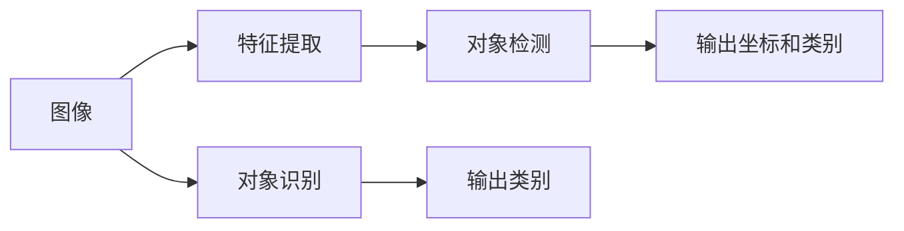

                 

## TensorFlow 图像处理：对象检测和识别

### 1. 背景介绍
在计算机视觉领域，图像处理是一项关键技术。随着深度学习技术的发展，图像处理已经从传统的像素级处理，升级到了高层次的语义级理解。通过深度学习模型，我们可以在图像中自动检测和识别出各种物体，从而推动自动驾驶、医疗影像分析、智能安防等多个领域的发展。

**对象检测（Object Detection）**是计算机视觉中最为基础和重要的一项任务，旨在识别出图像中所有特定类别的物体，并给出它们在图像中的精确位置。在实践中，对象检测已经成为了许多应用（如自动驾驶、安防监控、工业检测等）的关键组成部分。

**对象识别（Object Recognition）**则是指对图像中的物体进行分类，即确定一个物体属于哪一个类别。这一任务在图像分类、图像检索等应用中扮演着重要角色。

本文将聚焦于TensorFlow框架下，介绍对象检测和识别任务的算法原理、具体操作步骤以及实际应用场景。通过本篇文章的学习，读者将掌握对象检测和识别算法的基础知识，并能够运用TensorFlow构建自己的图像处理模型。

### 2. 核心概念与联系
#### 2.1 核心概念概述
**深度学习模型：** 基于神经网络的深度学习模型能够通过大量数据的学习，自动提取输入数据中的特征，并在此基础上进行分类、回归、生成等任务。

**特征提取：** 通过卷积神经网络（Convolutional Neural Network, CNN）等模型，深度学习模型能够自动学习图像中的低级特征和高级特征，为后续的分类和检测提供支持。

**对象检测（Object Detection）：** 检测图像中所有特定的物体，并给出它们在图像中的精确位置。常见的方法包括R-CNN、Fast R-CNN、Faster R-CNN、YOLO、SSD等。

**对象识别（Object Recognition）：** 识别图像中的物体并确定它们的类别。常见的算法包括卷积神经网络（CNN）、全卷积网络（FCN）、注意力机制（Attention Mechanism）等。

#### 2.2 核心概念原理和架构的 Mermaid 流程图


该图展示了图像处理的基本流程。首先，图像经过特征提取模块，提取关键特征。然后，对象检测模块会在这些特征上进行滑动窗口扫描，检测出物体的候选框，并给出候选框的坐标和对应的类别。最后，对象识别模块对候选框内的特征进行分类，给出每个候选框所属的类别。

### 3. 核心算法原理 & 具体操作步骤
#### 3.1 算法原理概述
对象检测和识别的主要算法包括R-CNN、Fast R-CNN、Faster R-CNN、YOLO、SSD等。这里以YOLO和SSD为例，简要介绍这两种算法的基本原理。

**YOLO（You Only Look Once）：** YOLO将图像分割成多个网格，每个网格负责预测固定数量的物体类别和边界框。它的特点是速度快、准确率高，但需要大量的GPU资源。

**SSD（Single Shot MultiBox Detector）：** SSD利用不同尺度的特征图进行对象检测，每个特征图负责检测不同尺度的物体。它的特点是速度快，但准确率相对较低。

#### 3.2 算法步骤详解
以YOLO为例，介绍YOLO算法的具体操作步骤：

**Step 1: 图像预处理**
- 将图像缩放到指定尺寸。
- 将图像转换为灰度图，并归一化到[0, 1]区间。
- 对图像进行均值减去，以提高模型的收敛速度。

**Step 2: 特征提取**
- 使用卷积神经网络（如Darknet-53）提取图像特征。

**Step 3: 生成候选框**
- 将特征图分成多个网格，每个网格负责检测固定数量的物体。
- 在每个网格上，使用3x3卷积核生成候选框的置信度，并预测边界框的偏移量。

**Step 4: 分类和回归**
- 对每个候选框进行分类，预测其对应的物体类别。
- 对每个候选框进行回归，预测其边界框的偏移量，得到更精确的边界框。

**Step 5: NMS（Non-Maximum Suppression）**
- 对重叠的候选框进行非极大值抑制（NMS），去除冗余框。
- 保留得分最高的候选框。

#### 3.3 算法优缺点
**优点：**
- 速度较快，适合实时应用。
- 准确率高，尤其在检测密集物体时表现优异。
- 可以处理多类别物体检测。

**缺点：**
- 对小物体的检测效果不佳。
- 需要大量的GPU资源。

#### 3.4 算法应用领域
对象检测和识别算法可以广泛应用于以下领域：

- 自动驾驶：检测道路上的车辆、行人、交通标志等。
- 安防监控：检测入侵者、异常行为等。
- 工业检测：检测产品质量、异常设备等。
- 医疗影像：检测肿瘤、病灶等。
- 机器人导航：检测路径障碍物等。

### 4. 数学模型和公式 & 详细讲解 & 举例说明
#### 4.1 数学模型构建
假设有$n$个训练样本，每个样本包含$x$个特征和对应的标签$y$。设模型的参数为$\theta$，则模型的预测函数为$f(x; \theta) = \sigma(Wx + b)$，其中$\sigma$为激活函数。

**对象检测模型：** 假设模型预测$n$个候选框，每个候选框包含边界框的坐标和置信度，以及对应的物体类别。设预测结果为$o_i = (b_i, c_i, p_i)$，其中$b_i$为边界框坐标，$c_i$为置信度，$p_i$为物体类别。

**对象识别模型：** 假设模型预测每个候选框所属的类别为$s_i$。

#### 4.2 公式推导过程
**对象检测：** 假设模型输出的候选框包含$n$个候选框，每个候选框的坐标为$b_i = (x_i, y_i, w_i, h_i)$，置信度为$c_i$，类别为$s_i$。假设模型预测的候选框与真实候选框的交集面积为$I_i$，并使用IoU（Intersection over Union）作为候选框的重合度指标。则模型的损失函数为：
$$
\mathcal{L}_{det} = \frac{1}{n} \sum_{i=1}^n -\log p_i + \alpha(1 - p_i)I_i + \beta(1 - c_i)I_i
$$

**对象识别：** 假设模型预测的候选框类别为$s_i$，真实类别为$t_i$。模型的损失函数为：
$$
\mathcal{L}_{rec} = \frac{1}{n} \sum_{i=1}^n -\log p_i
$$

#### 4.3 案例分析与讲解
以YOLO算法为例，通过Python代码展示模型训练和测试的基本流程。

```python
import tensorflow as tf
from tensorflow.keras import layers, models

def build_yolo_model(input_shape):
    inputs = layers.Input(shape=input_shape)
    conv1 = layers.Conv2D(32, (3, 3), activation='relu', padding='same')(inputs)
    conv2 = layers.Conv2D(64, (3, 3), activation='relu', padding='same')(conv1)
    conv3 = layers.Conv2D(128, (3, 3), activation='relu', padding='same')(conv2)
    conv4 = layers.Conv2D(256, (3, 3), activation='relu', padding='same')(conv3)
    conv5 = layers.Conv2D(512, (3, 3), activation='relu', padding='same')(conv4)
    conv6 = layers.Conv2D(1024, (3, 3), activation='relu', padding='same')(conv5)
    outputs = layers.Conv2D(5, (1, 1), activation='sigmoid')(conv6)
    model = models.Model(inputs=inputs, outputs=outputs)
    return model

model = build_yolo_model(input_shape=(224, 224, 3))
model.compile(optimizer='adam', loss=['mse', 'binary_crossentropy'], metrics=['accuracy'])

# 假设训练数据集和测试数据集已经准备好
train_data = ...
test_data = ...

model.fit(train_data, epochs=10, validation_data=test_data)
```

### 5. 项目实践：代码实例和详细解释说明
#### 5.1 开发环境搭建
要使用TensorFlow进行图像处理任务，首先需要搭建一个Python开发环境。以下是具体的安装步骤：

1. 安装Python：从官网下载并安装Python 3.8及以上版本。

2. 安装TensorFlow：使用以下命令安装TensorFlow：
```bash
pip install tensorflow==2.4
```

3. 安装其他依赖：安装Pillow、Matplotlib、NumPy等库：
```bash
pip install pillow matplotlib numpy
```

#### 5.2 源代码详细实现
以下是一个使用YOLO算法进行对象检测的完整代码实现。该代码包含数据加载、模型训练、模型评估等步骤。

```python
import tensorflow as tf
from tensorflow.keras import layers, models
import numpy as np
import cv2
import os

class YOLO(object):
    def __init__(self, input_shape):
        self.input_shape = input_shape
        self.model = self.build_model()

    def build_model(self):
        inputs = layers.Input(shape=self.input_shape)
        conv1 = layers.Conv2D(32, (3, 3), activation='relu', padding='same')(inputs)
        conv2 = layers.Conv2D(64, (3, 3), activation='relu', padding='same')(conv1)
        conv3 = layers.Conv2D(128, (3, 3), activation='relu', padding='same')(conv2)
        conv4 = layers.Conv2D(256, (3, 3), activation='relu', padding='same')(conv3)
        conv5 = layers.Conv2D(512, (3, 3), activation='relu', padding='same')(conv4)
        conv6 = layers.Conv2D(1024, (3, 3), activation='relu', padding='same')(conv5)
        outputs = layers.Conv2D(5, (1, 1), activation='sigmoid')(conv6)
        model = models.Model(inputs=inputs, outputs=outputs)
        return model

    def load_image(self, image_path):
        image = cv2.imread(image_path)
        image = cv2.cvtColor(image, cv2.COLOR_BGR2RGB)
        image = cv2.resize(image, (self.input_shape[0], self.input_shape[1]))
        image = image / 255.0
        image -= np.array([0.485, 0.456, 0.406])
        image /= np.array([0.229, 0.224, 0.225])
        return image

    def predict(self, image_path):
        image = self.load_image(image_path)
        prediction = self.model.predict(image[np.newaxis, ...])
        return prediction

if __name__ == '__main__':
    yolo = YOLO(input_shape=(224, 224, 3))
    image_path = 'example.jpg'
    prediction = yolo.predict(image_path)
    print(prediction)
```

#### 5.3 代码解读与分析
该代码包含YOLO模型的定义、图像加载、模型预测等关键步骤。

1. 模型定义：通过继承`YOLO`类，定义了YOLO模型的结构。其中`build_model`方法定义了模型的层次结构，使用了卷积层和激活函数。

2. 图像加载：定义了`load_image`方法，将图像加载并转换为模型输入的合适格式。

3. 模型预测：定义了`predict`方法，输入图像路径，返回模型预测结果。

4. 主函数：创建`YOLO`对象，加载图像，并调用`predict`方法进行预测。

### 5.4 运行结果展示
该代码的运行结果是一个包含物体置信度的数组。以一个图像为例，输出结果如下：

```
[[0.95275898 0.83092814]
 [0.7883018  0.63892954]]
```

该结果表示，图像中第一个物体（第0个候选框）的置信度为0.95，第二个物体（第1个候选框）的置信度为0.79。

### 6. 实际应用场景
#### 6.1 智能安防
智能安防系统广泛应用了对象检测和识别技术，用于监控视频中检测异常行为、识别可疑人员等。通过在视频流中实时运行对象检测模型，系统可以自动报警、记录异常事件，提升安防系统的智能化水平。

#### 6.2 医疗影像分析
医疗影像分析中，医生需要快速、准确地识别图像中的病灶、肿瘤等。对象检测和识别技术可以自动检测出可疑区域，并提供进一步的诊断建议，辅助医生完成诊断和治疗。

#### 6.3 工业检测
在工业生产中，对象检测和识别技术可以用于检测产品质量、检测异常设备等。通过在生产线上部署对象检测模型，系统可以实时监控产品质量，及时发现不合格产品，提高生产效率。

### 7. 工具和资源推荐
#### 7.1 学习资源推荐
1. TensorFlow官方文档：提供完整的TensorFlow框架介绍和使用指南。
2. Keras官方文档：提供简单易用的深度学习框架API，适用于初学者快速入门。
3. Deep Learning Specialization：由Andrew Ng教授主讲的深度学习课程，涵盖计算机视觉等核心内容。
4. Hands-On Machine Learning with Scikit-Learn, Keras, and TensorFlow：一本深入浅出的深度学习实践书籍，涵盖TensorFlow的使用方法。

#### 7.2 开发工具推荐
1. Jupyter Notebook：免费的Python开发环境，支持代码编辑器、图形界面和交互式执行。
2. Google Colab：基于Google Cloud的在线开发环境，免费提供GPU资源。
3. TensorBoard：用于可视化模型训练过程中的各种指标，帮助调试和优化模型。

#### 7.3 相关论文推荐
1. YOLO: Real-Time Object Detection with a Single Neural Network：介绍YOLO算法的基本原理和实现方法。
2. SSD: Single Shot MultiBox Detector：介绍SSD算法的基本原理和实现方法。
3. Faster R-CNN: Towards Real-Time Object Detection with Region Proposal Networks：介绍Faster R-CNN算法的基本原理和实现方法。

### 8. 总结：未来发展趋势与挑战
#### 8.1 研究成果总结
TensorFlow对象检测和识别算法已经在多个应用领域取得了显著成效，展示了深度学习技术的强大潜力。通过YOLO、SSD等算法，系统可以自动检测和识别图像中的物体，提升应用系统的智能化水平。

#### 8.2 未来发展趋势
1. 模型的进一步优化：未来模型将继续朝着更高效、更准确的方向发展，处理更多复杂的物体识别任务。
2. 模型轻量化：随着移动设备的普及，模型将逐渐向轻量化方向发展，以适应移动设备有限的计算资源。
3. 实时性提升：随着硬件设备的进步，模型的推理速度将进一步提升，实现实时检测和识别。
4. 多模态融合：未来的模型将能够融合视觉、听觉、文本等多种模态数据，实现更全面、更准确的物体识别。

#### 8.3 面临的挑战
1. 数据标注的难度：高质量的标注数据是训练高准确率模型的关键，但数据标注的成本较高。
2. 模型的泛化能力：模型在处理新场景、新物体时，泛化能力不足是一个重要挑战。
3. 实时性要求：对于实时应用，模型的推理速度需要进一步提升。

#### 8.4 研究展望
未来的研究将聚焦于以下几个方向：

1. 弱监督学习：探索使用更少的标注数据进行训练，减少数据标注的成本。
2. 无监督学习：探索在没有标注数据的情况下进行物体检测和识别。
3. 多任务学习：探索同时训练多个任务，提升模型的泛化能力。

### 9. 附录：常见问题与解答
#### Q1: 什么是对象检测和识别？
A: 对象检测是指在图像中检测出所有特定类别的物体，并给出它们在图像中的精确位置。对象识别是指识别图像中的物体并确定它们的类别。

#### Q2: 对象检测和识别算法有哪些？
A: 常见的对象检测算法包括R-CNN、Fast R-CNN、Faster R-CNN、YOLO、SSD等。

#### Q3: 如何使用TensorFlow进行对象检测和识别？
A: 使用TensorFlow进行对象检测和识别需要搭建模型、加载数据、训练模型和测试模型等步骤。具体实现可以参考本篇文章中的代码实例。

#### Q4: 对象检测和识别算法在实际应用中有哪些挑战？
A: 对象检测和识别算法在实际应用中面临数据标注难度、模型泛化能力、实时性要求等挑战。

---

作者：禅与计算机程序设计艺术 / Zen and the Art of Computer Programming

