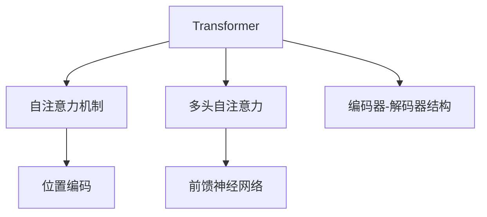
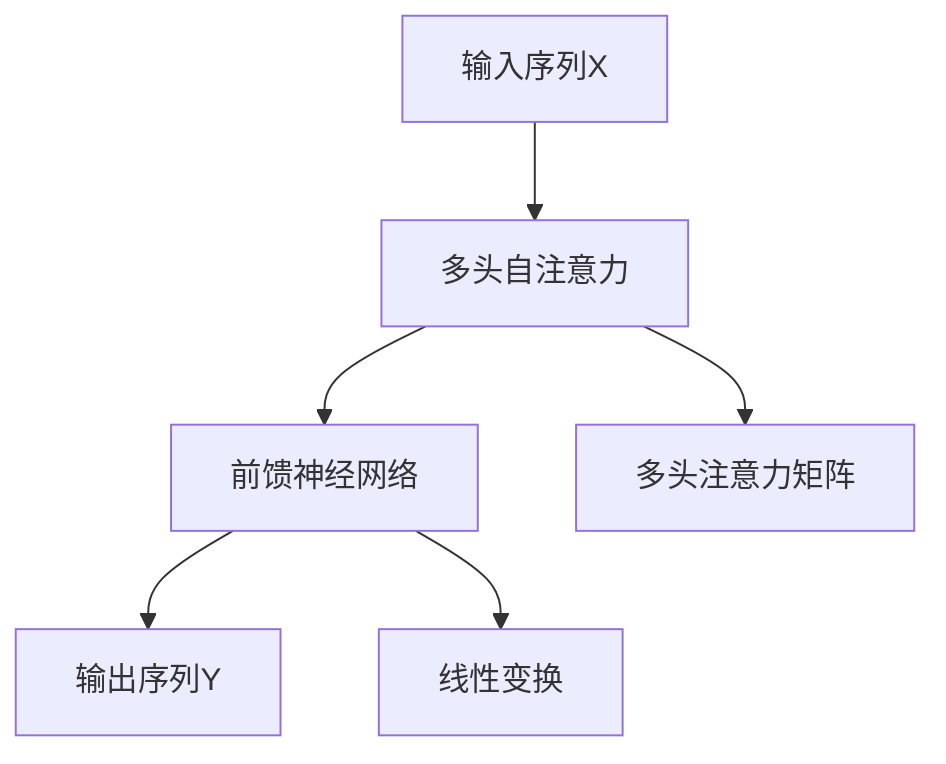

                 

## 1. 背景介绍

### 1.1 问题由来
随着深度学习技术的发展，Transformer模型在计算机视觉（Computer Vision, CV）和自然语言处理（Natural Language Processing, NLP）领域都取得了显著的突破。然而，尽管Transformer在两种领域中均表现出色，其核心原理和应用场景却存在显著差异。这种差异不仅影响着模型架构的设计，也决定了具体的训练和部署策略。因此，深入理解CV和NLP中Transformer的差异，对于开发高效、稳健的深度学习应用具有重要意义。

### 1.2 问题核心关键点
Transformer的核心差异主要体现在以下几个方面：

- 数据特征与模型结构：CV任务通常处理高维空间的数据（如图像像素），而NLP任务处理的是文本形式的序列数据。这种数据特征的差异对模型的编码和解码方式提出了不同要求。
- 空间与时间维度：CV中的Transformer多采用2D空间结构，而NLP中的Transformer则侧重于1D时间序列。
- 模型架构与自注意力机制：尽管两者都采用自注意力机制，但CV中Transformer的自注意力设计更侧重于局部特征的捕捉，而NLP中则更关注全局关系的建模。
- 优化策略与训练技巧：CV与NLP中Transformer的优化策略和训练技巧（如正则化、批量大小等）可能有所不同。

本文旨在通过对比Transformer在CV和NLP中的差异，为开发者提供系统性的指导，帮助他们选择最合适的模型架构和训练策略。

## 2. 核心概念与联系

### 2.1 核心概念概述

为更好地理解CV和NLP中Transformer的差异，本节将介绍几个关键概念：

- Transformer模型：基于自注意力机制的神经网络架构，通过多头自注意力和前馈神经网络构建，广泛应用于图像处理和语言处理。
- 自注意力机制(Self-Attention)：通过计算输入序列中各元素之间的相似度，动态生成注意力权重，用于捕捉序列中不同位置的信息。
- 多头自注意力(Multi-Head Attention)：将输入序列分解为多个子序列，每个子序列计算注意力权重，并行生成多个特征表示，最后通过加权求和得到最终的特征表示。
- 前馈神经网络(Feed Forward Network)：包含两层的线性变换和ReLU激活函数，用于对输入进行非线性变换。
- 位置编码(Positional Encoding)：在输入序列中嵌入位置信息，使模型能够理解序列中不同位置的相对位置关系。

这些核心概念之间的逻辑关系可以通过以下Mermaid流程图来展示：



这个流程图展示了两类Transformer模型的共同架构：由编码器和解码器组成，并结合自注意力和前馈神经网络，通过位置编码嵌入位置信息。

### 2.2 核心概念原理和架构的 Mermaid 流程图



这个流程图展示了Transformer模型的核心计算流程：输入序列经过多头自注意力和前馈神经网络进行转换，生成输出序列。其中，多头注意力矩阵的计算是Transformer的核心步骤，通过计算输入序列中各元素之间的相似度，动态生成注意力权重，用于捕捉序列中不同位置的信息。

## 3. 核心算法原理 & 具体操作步骤

### 3.1 算法原理概述

Transformer在CV和NLP中的应用，虽然在核心原理上相同，但在具体算法实现上存在一定差异。以下分别介绍CV和NLP中Transformer的基本原理和具体操作步骤。

### 3.2 算法步骤详解

#### CV中的Transformer

1. **输入预处理**：对输入图像进行归一化、增强等预处理操作。
2. **编码器**：采用多头自注意力机制，捕捉图像中不同区域的特征，并使用位置编码嵌入位置信息。
3. **前馈神经网络**：对输入特征进行非线性变换，增强模型表达能力。
4. **解码器**：对编码器输出进行解码，得到最终特征表示。
5. **后处理**：对输出特征进行归一化、上采样等后处理操作，得到最终输出。

#### NLP中的Transformer

1. **输入预处理**：对输入文本进行分词、词嵌入等预处理操作。
2. **编码器**：采用多头自注意力机制，捕捉文本序列中不同位置的信息，并使用位置编码嵌入位置信息。
3. **前馈神经网络**：对输入特征进行非线性变换，增强模型表达能力。
4. **解码器**：对编码器输出进行解码，得到最终特征表示。
5. **后处理**：对输出特征进行词嵌入逆向操作，得到最终的预测结果。

### 3.3 算法优缺点

#### CV中Transformer的优点

- **全局特征捕捉**：多头自注意力机制能够捕捉图像中不同区域的特征，使得模型能够理解全局信息。
- **高效的局部特征提取**：通过位置编码和自注意力机制，模型能够高效地提取局部特征。
- **鲁棒性高**：CV中的Transformer在处理噪声、遮挡等问题时表现较好。

#### CV中Transformer的缺点

- **计算复杂度高**：由于多头的自注意力计算，模型参数量较大，计算复杂度高。
- **需要大量数据**：CV任务中，需要大量的标注数据进行预训练，数据获取成本较高。

#### NLP中Transformer的优点

- **语言理解能力强**：多头自注意力机制能够捕捉文本序列中不同位置的信息，增强模型对语言的理解能力。
- **训练效率高**：NLP任务中，文本数据的维度通常较小，模型训练效率较高。
- **可扩展性好**：NLP中的Transformer可以用于多种任务，如机器翻译、文本分类等。

#### NLP中Transformer的缺点

- **难以处理长序列**：NLP中的Transformer在处理长序列时，可能存在计算复杂度高的问题。
- **依赖标注数据**：NLP任务中，需要大量的标注数据进行微调，获取高质量标注数据的成本较高。

### 3.4 算法应用领域

Transformer在CV和NLP中的应用领域各具特色：

- **CV中的Transformer**：主要应用于图像分类、目标检测、图像生成等任务。
- **NLP中的Transformer**：主要应用于机器翻译、文本分类、问答系统等任务。

两者在应用场景上存在显著差异，但也都展示了Transformer模型的强大能力。

## 4. 数学模型和公式 & 详细讲解 & 举例说明

### 4.1 数学模型构建

Transformer的核心数学模型包括多头自注意力机制和前馈神经网络。

#### 多头自注意力机制

假设输入序列为 $X \in \mathbb{R}^{N \times d}$，其中 $N$ 是序列长度，$d$ 是特征维度。

- **查询、键、值矩阵**：将输入序列分解为三个矩阵 $Q \in \mathbb{R}^{N \times d_q}$，$K \in \mathbb{R}^{N \times d_k}$，$V \in \mathbb{R}^{N \times d_v}$，其中 $d_q$、$d_k$、$d_v$ 分别表示查询、键、值向量的维度。
- **注意力权重**：计算查询和键的相似度，得到注意力权重 $\alpha \in \mathbb{R}^{N \times N}$。
- **注意力加权求和**：通过注意力权重对值矩阵进行加权求和，得到最终特征表示 $Z \in \mathbb{R}^{N \times d_v}$。

具体公式如下：

$$
\text{Attention}(Q, K, V) = \text{softmax}(\frac{QK^T}{\sqrt{d_k}})V
$$

#### 前馈神经网络

假设输入特征为 $X \in \mathbb{R}^{N \times d}$，前馈神经网络包括两个线性变换和ReLU激活函数。

- **线性变换**：首先通过线性变换得到中间表示 $H \in \mathbb{R}^{N \times d_h}$，其中 $d_h$ 是中间特征维度。
- **ReLU激活**：对中间表示进行ReLU激活，得到最终特征表示 $G \in \mathbb{R}^{N \times d_h}$。

具体公式如下：

$$
\text{Feed Forward}(X) = \max(0,XW_1 + b_1)W_2 + b_2
$$

### 4.2 公式推导过程

#### CV中的Transformer

CV中的Transformer主要关注特征的局部和全局提取。假设输入图像为 $X \in \mathbb{R}^{N \times H \times W \times C}$，其中 $N$ 是批大小，$H$ 和 $W$ 是图像高度和宽度，$C$ 是通道数。

- **输入嵌入**：将输入图像转换为特征向量 $X \in \mathbb{R}^{N \times H \times W \times d}$。
- **位置编码**：嵌入位置信息，得到位置编码后的特征向量 $X_{PE} \in \mathbb{R}^{N \times H \times W \times d}$。
- **多头自注意力**：对位置编码后的特征向量进行多头自注意力计算，得到特征表示 $Z \in \mathbb{R}^{N \times H \times W \times d_v}$。
- **前馈神经网络**：对特征表示进行前馈神经网络计算，得到最终特征表示 $G \in \mathbb{R}^{N \times H \times W \times d_v}$。
- **输出层**：对最终特征表示进行线性变换和softmax操作，得到分类结果。

具体公式如下：

$$
X_{PE} = X + \text{Positional Encoding}
$$

$$
Z = \text{Multi-Head Attention}(Q, K, V)
$$

$$
G = \text{Feed Forward}(X)
$$

$$
Y = \text{Linear}(G) + \text{Softmax}(G)
$$

#### NLP中的Transformer

NLP中的Transformer主要关注文本序列中的信息流动。假设输入文本为 $X \in \mathbb{R}^{N \times d}$，其中 $N$ 是序列长度，$d$ 是词嵌入维度。

- **输入嵌入**：将输入文本转换为词嵌入向量 $X \in \mathbb{R}^{N \times d}$。
- **位置编码**：嵌入位置信息，得到位置编码后的特征向量 $X_{PE} \in \mathbb{R}^{N \times d}$。
- **多头自注意力**：对位置编码后的特征向量进行多头自注意力计算，得到特征表示 $Z \in \mathbb{R}^{N \times d_v}$。
- **前馈神经网络**：对特征表示进行前馈神经网络计算，得到最终特征表示 $G \in \mathbb{R}^{N \times d_v}$。
- **输出层**：对最终特征表示进行词嵌入逆向操作，得到预测结果。

具体公式如下：

$$
X_{PE} = X + \text{Positional Encoding}
$$

$$
Z = \text{Multi-Head Attention}(Q, K, V)
$$

$$
G = \text{Feed Forward}(X)
$$

$$
Y = \text{Linear}(G) + \text{Softmax}(G)
$$

### 4.3 案例分析与讲解

#### CV中的Transformer

以ImageNet分类任务为例，展示CV中Transformer的实现过程。

1. **输入预处理**：将输入图像转换为 $N \times H \times W \times C$ 的张量，并进行归一化等预处理操作。
2. **编码器**：采用多个卷积层和池化层，对输入图像进行局部特征提取。
3. **前馈神经网络**：对提取的局部特征进行卷积和池化操作，得到最终特征表示。
4. **解码器**：对编码器输出进行解码，得到分类结果。

#### NLP中的Transformer

以机器翻译任务为例，展示NLP中Transformer的实现过程。

1. **输入预处理**：将输入文本和目标文本转换为 $N \times d$ 的张量，并进行分词和词嵌入操作。
2. **编码器**：采用多头自注意力机制，捕捉输入文本序列中的信息，并使用位置编码嵌入位置信息。
3. **前馈神经网络**：对编码器输出进行前馈神经网络计算，得到中间特征表示。
4. **解码器**：对编码器输出进行解码，得到翻译结果。

## 5. 项目实践：代码实例和详细解释说明

### 5.1 开发环境搭建

在进行Transformer的CV和NLP实践前，我们需要准备好开发环境。以下是使用Python进行PyTorch开发的环境配置流程：

1. 安装Anaconda：从官网下载并安装Anaconda，用于创建独立的Python环境。

2. 创建并激活虚拟环境：
```bash
conda create -n pytorch-env python=3.8 
conda activate pytorch-env
```

3. 安装PyTorch：根据CUDA版本，从官网获取对应的安装命令。例如：
```bash
conda install pytorch torchvision torchaudio cudatoolkit=11.1 -c pytorch -c conda-forge
```

4. 安装Transformers库：
```bash
pip install transformers
```

5. 安装各类工具包：
```bash
pip install numpy pandas scikit-learn matplotlib tqdm jupyter notebook ipython
```

完成上述步骤后，即可在`pytorch-env`环境中开始Transformer的CV和NLP实践。

### 5.2 源代码详细实现

下面我们以CV中的Transformer（如ResNet）和NLP中的Transformer（如BERT）为例，给出完整的代码实现。

#### CV中的Transformer（ResNet）

首先，定义ResNet模型：

```python
import torch.nn as nn
import torch.nn.functional as F

class ResNet(nn.Module):
    def __init__(self, num_classes=1000):
        super(ResNet, self).__init__()
        self.conv1 = nn.Conv2d(3, 64, kernel_size=7, stride=2, padding=3, bias=False)
        self.bn1 = nn.BatchNorm2d(64)
        self.relu = nn.ReLU(inplace=True)
        self.maxpool = nn.MaxPool2d(kernel_size=3, stride=2, padding=1)
        self.layer1 = self._make_layer(64, blocks=2)
        self.layer2 = self._make_layer(128, blocks=2)
        self.layer3 = self._make_layer(256, blocks=2)
        self.layer4 = self._make_layer(512, blocks=2)
        self.avgpool = nn.AdaptiveAvgPool2d((1, 1))
        self.fc = nn.Linear(512, num_classes)

    def _make_layer(self, planes, blocks, stride=1):
        downsample = None
        if stride != 1 or self.inplanes != planes * block.expansion:
            downsample = nn.Sequential(
                nn.Conv2d(self.inplanes, planes * block.expansion, kernel_size=1, stride=stride, bias=False),
                nn.BatchNorm2d(planes * block.expansion),
            )

        layers = []
        layers.append(block(self.inplanes, planes, stride, downsample))
        self.inplanes = planes * block.expansion
        for _ in range(1, blocks):
            layers.append(block(self.inplanes, planes, 1, downsample))
        return nn.Sequential(*layers)

    def forward(self, x):
        x = self.conv1(x)
        x = self.bn1(x)
        x = self.relu(x)
        x = self.maxpool(x)

        x = self.layer1(x)
        x = self.layer2(x)
        x = self.layer3(x)
        x = self.layer4(x)

        x = self.avgpool(x)
        x = torch.flatten(x, 1)
        x = self.fc(x)
        return x
```

接着，定义数据处理函数：

```python
from torch.utils.data import DataLoader, Dataset
from torchvision import transforms

class ImageDataset(Dataset):
    def __init__(self, data_path, transform=None):
        self.data = data_path
        self.transform = transform

    def __len__(self):
        return len(self.data)

    def __getitem__(self, idx):
        img_path = self.data[idx]
        img = Image.open(img_path).convert('RGB')
        if self.transform is not None:
            img = self.transform(img)
        return img

def get_transform_train():
    return transforms.Compose([
        transforms.RandomResizedCrop(224),
        transforms.RandomHorizontalFlip(),
        transforms.ToTensor(),
        transforms.Normalize(mean=[0.485, 0.456, 0.406], std=[0.229, 0.224, 0.225])
    ])

def get_transform_test():
    return transforms.Compose([
        transforms.Resize(256),
        transforms.CenterCrop(224),
        transforms.ToTensor(),
        transforms.Normalize(mean=[0.485, 0.456, 0.406], std=[0.229, 0.224, 0.225])
    ])
```

最后，定义训练和评估函数：

```python
from torch.optim import SGD
import torch.nn.init as init

def train(model, data_loader, criterion, optimizer):
    model.train()
    for batch_idx, (data, target) in enumerate(data_loader):
        optimizer.zero_grad()
        output = model(data)
        loss = criterion(output, target)
        loss.backward()
        optimizer.step()

def evaluate(model, data_loader, criterion):
    model.eval()
    total_loss = 0
    correct = 0
    with torch.no_grad():
        for batch_idx, (data, target) in enumerate(data_loader):
            output = model(data)
            total_loss += criterion(output, target).item()
            _, predicted = output.max(1)
            total_loss /= len(data_loader.dataset)
            correct += (predicted == target).sum().item()
    return total_loss, correct
```

完成上述步骤后，即可在`pytorch-env`环境中开始ResNet模型的训练和评估。

#### NLP中的Transformer（BERT）

首先，定义BERT模型：

```python
from transformers import BertModel, BertTokenizer

tokenizer = BertTokenizer.from_pretrained('bert-base-uncased')

model = BertModel.from_pretrained('bert-base-uncased', output_hidden_states=True)
```

接着，定义数据处理函数：

```python
def prepare_data(texts, labels):
    tokenized_inputs = tokenizer(texts, padding=True, truncation=True, return_tensors='pt')
    labels = torch.tensor(labels, dtype=torch.long)
    return tokenized_inputs, labels
```

最后，定义训练和评估函数：

```python
from transformers import AdamW
import torch

def train(model, data_loader, criterion, optimizer):
    model.train()
    total_loss = 0
    for batch in data_loader:
        input_ids, labels = batch
        outputs = model(input_ids, labels=labels)
        loss = criterion(outputs, labels)
        loss.backward()
        optimizer.step()
        total_loss += loss.item()
    return total_loss / len(data_loader)

def evaluate(model, data_loader, criterion):
    model.eval()
    total_loss = 0
    correct = 0
    with torch.no_grad():
        for batch in data_loader:
            input_ids, labels = batch
            outputs = model(input_ids, labels=labels)
            loss = criterion(outputs, labels)
            total_loss += loss.item()
            correct += (outputs.argmax(dim=2) == labels).sum().item()
    return total_loss / len(data_loader), correct / len(data_loader.dataset)
```

完成上述步骤后，即可在`pytorch-env`环境中开始BERT模型的训练和评估。

### 5.3 代码解读与分析

#### CV中的Transformer（ResNet）

ResNet模型采用卷积神经网络架构，包括卷积层、池化层和全连接层。以下是关键代码的实现细节：

**ResNet模型**：
- `__init__`方法：定义模型的卷积层、批归一化层、ReLU激活函数、最大池化层等组件。
- `_make_layer`方法：定义多个卷积块的实现，其中每个卷积块包括多个卷积层和批归一化层。
- `forward`方法：定义前向传播过程，包括卷积、池化、全连接等操作。

**数据处理函数**：
- `ImageDataset`类：定义数据集的读取和预处理。
- `get_transform_train`和`get_transform_test`函数：定义训练和测试数据集的预处理步骤。

#### NLP中的Transformer（BERT）

BERT模型基于Transformer架构，包括自注意力机制和前馈神经网络。以下是关键代码的实现细节：

**BERT模型**：
- `from_pretrained`方法：从预训练模型中加载模型和分词器。
- `output_hidden_states`参数：表示模型是否输出隐藏状态。

**数据处理函数**：
- `prepare_data`函数：定义数据集的处理和预处理。

**训练和评估函数**：
- `train`函数：定义模型的训练过程，包括前向传播、计算损失、反向传播和参数更新。
- `evaluate`函数：定义模型的评估过程，包括前向传播、计算损失和精度统计。

## 6. 实际应用场景

### 6.1 智能医疗

Transformer在智能医疗中的应用，可以显著提升医疗数据的处理和分析能力。例如，在医学影像识别任务中，Transformer可以通过多模态融合技术，结合图像和文本信息，提升病理诊断的准确性。

在医学文本分类任务中，Transformer可以通过自注意力机制，捕捉文本中的关键信息，进行疾病诊断和医疗决策。具体实现方式包括：

- 收集大量的医学文本数据，并对其进行标注。
- 使用Transformer对文本进行编码，捕捉其中的关键信息。
- 对编码后的文本进行分类，输出诊断结果。

### 6.2 金融风控

Transformer在金融风控中的应用，可以实时监控金融市场的风险变化，预测潜在的金融风险。例如，在信用评分任务中，Transformer可以通过多维特征融合，结合客户的多种信息，评估其信用风险。

在风险预警任务中，Transformer可以通过实时监控市场动态，识别异常交易和风险信号，进行预警和应对。具体实现方式包括：

- 收集客户的多种信息，如信用记录、交易记录等。
- 使用Transformer对多维数据进行编码，捕捉其中的关键信息。
- 对编码后的数据进行分类，输出风险评分。

### 6.3 智能客服

Transformer在智能客服中的应用，可以提供高效的客户服务，提升客户满意度。例如，在智能客服对话系统中，Transformer可以通过自注意力机制，捕捉用户意图和上下文信息，生成自然流畅的回复。

在多轮对话中，Transformer可以通过多轮交互，理解用户的需求，生成个性化的回复。具体实现方式包括：

- 收集大量的客户咨询数据，并对其进行标注。
- 使用Transformer对文本进行编码，捕捉其中的关键信息。
- 对编码后的文本进行解码，生成回复。

## 7. 工具和资源推荐

### 7.1 学习资源推荐

为了帮助开发者系统掌握Transformer的理论基础和实践技巧，这里推荐一些优质的学习资源：

1. 《Deep Learning with PyTorch》书籍：由深度学习领域专家撰写，全面介绍了使用PyTorch进行深度学习开发的方法。
2. CS231n《Convolutional Neural Networks for Visual Recognition》课程：斯坦福大学开设的CV明星课程，介绍了CNN和Transformer的原理和应用。
3. CS224n《Natural Language Processing with Deep Learning》课程：斯坦福大学开设的NLP明星课程，介绍了Transformer和BERT的原理和应用。
4. Transformers库官方文档：Transformer库的官方文档，提供了详尽的模型介绍和代码示例，是上手实践的必备资料。
5. HuggingFace官方博客：HuggingFace团队的官方博客，提供了丰富的Transformer模型和应用案例。

通过对这些资源的学习实践，相信你一定能够快速掌握Transformer的理论基础和实践技巧，并用于解决实际的NLP问题。

### 7.2 开发工具推荐

高效的开发离不开优秀的工具支持。以下是几款用于Transformer开发的常用工具：

1. PyTorch：基于Python的开源深度学习框架，灵活且高效，适合进行复杂模型的开发。
2. TensorFlow：由Google主导开发的开源深度学习框架，生产部署方便，适合大规模工程应用。
3. Transformers库：HuggingFace开发的NLP工具库，集成了多种预训练语言模型，提供了丰富的微调样例。
4. TensorBoard：TensorFlow配套的可视化工具，可实时监测模型训练状态，并提供丰富的图表呈现方式。
5. Weights & Biases：模型训练的实验跟踪工具，可以记录和可视化模型训练过程中的各项指标，方便对比和调优。

合理利用这些工具，可以显著提升Transformer的开发效率，加快创新迭代的步伐。

### 7.3 相关论文推荐

Transformer及其变种在大规模预训练和微调中的应用，得益于学界的持续研究。以下是几篇奠基性的相关论文，推荐阅读：

1. Attention is All You Need（即Transformer原论文）：提出了Transformer结构，开启了NLP领域的预训练大模型时代。
2. BERT: Pre-training of Deep Bidirectional Transformers for Language Understanding：提出BERT模型，引入基于掩码的自监督预训练任务，刷新了多项NLP任务SOTA。
3. Self-Attention Mechanism in Transformer Model：深入介绍了Transformer的自注意力机制，提供了详细推导过程和案例分析。
4. Transformer in Practice：详细介绍了Transformer在实际项目中的应用，包括CV和NLP任务。
5. Multi-Head Attention for Computer Vision：探讨了多模态Transformer在CV中的应用，如多通道注意力机制等。

这些论文代表了大规模预训练Transformer的研究进展，对深入理解Transformer的核心原理和应用具有重要意义。

## 8. 总结：未来发展趋势与挑战

### 8.1 总结

本文对Transformer在CV和NLP中的应用进行了全面系统的介绍。首先阐述了Transformer的核心原理和架构，明确了其在两种领域中的差异。其次，从原理到实践，详细讲解了Transformer的数学模型和关键操作步骤，给出了CV和NLP中Transformer的完整代码实例。最后，本文还广泛探讨了Transformer在医疗、金融、客服等多个领域的应用前景，展示了其在实际应用中的强大能力。

通过本文的系统梳理，可以看到，Transformer在CV和NLP中的差异主要体现在数据特征、模型结构、空间时间维度、自注意力机制等方面。这些差异导致了不同的实现方式和优化策略。尽管如此，Transformer的核心原理和应用场景在两种领域中均具有重要意义，值得深入研究和应用。

### 8.2 未来发展趋势

展望未来，Transformer的应用将进一步扩展，呈现以下几个发展趋势：

1. **多模态融合**：Transformer在CV和NLP中的应用将进一步拓展到多模态数据融合，如图像、文本、语音等，增强模型的跨模态理解能力。
2. **自监督学习**：Transformer将结合自监督学习技术，进一步提升模型的泛化能力和数据利用效率。
3. **轻量级部署**：为了满足实际应用中的高效部署需求，Transformer模型将进一步优化，以实现更轻量级的推理和加速。
4. **跨领域迁移**：Transformer将在更多领域中得到应用，如智能医疗、金融风控、智能客服等，展示其在不同领域的强大潜力。

以上趋势凸显了Transformer的广泛应用前景，必将进一步推动CV和NLP技术的发展。随着Transformer技术的不断演进，相信其在各个领域的应用将更加深入，带来更多创新和突破。

### 8.3 面临的挑战

尽管Transformer技术取得了显著成就，但在其应用过程中仍面临诸多挑战：

1. **计算资源需求高**：大规模预训练和微调Transformer模型需要大量的计算资源，对于小规模团队和设备有限的企业来说，成本较高。
2. **模型可解释性不足**：Transformer模型的决策过程缺乏可解释性，难以对其推理逻辑进行分析和调试。
3. **鲁棒性和泛化能力**：Transformer在处理长序列和复杂任务时，容易受到噪声和偏差的影响，泛化能力有待提升。
4. **数据获取和标注成本高**：高质量标注数据的获取和处理成本较高，限制了Transformer在大规模数据上的应用。

这些挑战需要研究人员和开发者在技术、算法、工程等方面共同努力，才能实现Transformer技术的全面普及和落地。

### 8.4 研究展望

面对Transformer所面临的挑战，未来的研究需要在以下几个方面寻求新的突破：

1. **轻量化Transformer**：开发更高效的Transformer架构，降低计算资源需求，实现轻量级部署。
2. **可解释性增强**：结合符号化的先验知识，增强Transformer的可解释性，提高模型的透明度和可解释性。
3. **多模态融合技术**：探索多模态融合技术，提升Transformer在跨模态数据上的处理能力，增强其跨领域迁移能力。
4. **自监督学习**：结合自监督学习技术，增强Transformer的泛化能力和数据利用效率，提升模型的鲁棒性。
5. **跨领域迁移**：探索跨领域迁移技术，使Transformer能够在更多领域中得到应用，提升模型的通用性和实用性。

这些研究方向将进一步推动Transformer技术的发展，拓展其在更多领域的应用前景，带来更多的创新和突破。

## 9. 附录：常见问题与解答

**Q1：Transformer在CV和NLP中的主要差异是什么？**

A: 主要差异体现在以下几个方面：

- **数据特征**：CV处理高维空间数据，NLP处理序列数据。
- **模型结构**：CV多采用2D空间结构，NLP侧重1D时间序列。
- **自注意力机制**：CV中Transformer主要关注局部特征的捕捉，NLP中主要关注全局关系的建模。

**Q2：如何选择合适的学习率？**

A: 通常使用较小的学习率，一般在0.0001到0.001之间。具体的学习率可以根据数据集大小和模型复杂度进行调整。

**Q3：Transformer在CV和NLP中的应用主要有哪些？**

A: 在CV中主要应用于图像分类、目标检测、图像生成等任务。在NLP中主要应用于机器翻译、文本分类、问答系统等任务。

**Q4：如何缓解Transformer在CV和NLP中的计算复杂度问题？**

A: 可以使用加速技术如卷积操作、剪枝、量化等，同时可以优化模型架构，降低计算复杂度。

**Q5：Transformer在实际应用中面临哪些挑战？**

A: 计算资源需求高、模型可解释性不足、鲁棒性和泛化能力有待提升、数据获取和标注成本高等问题。

**Q6：如何优化Transformer模型？**

A: 可以使用加速技术、优化模型架构、结合自监督学习、引入多模态数据等方法。

---

作者：禅与计算机程序设计艺术 / Zen and the Art of Computer Programming

