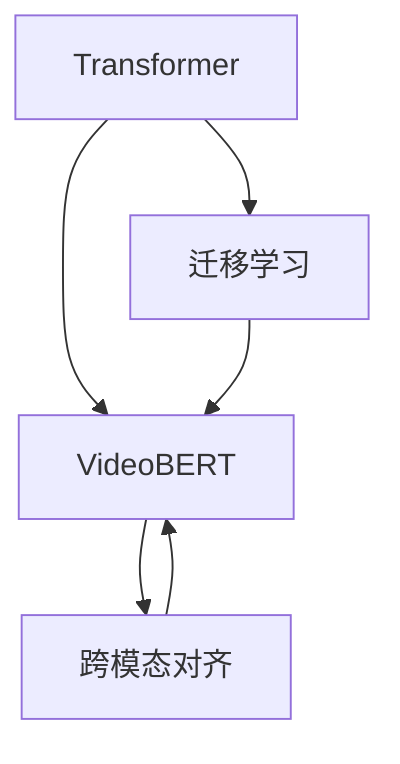

                 

# Transformer大模型实战：VideoBERT模型的应用

> 关键词：Transformer, VideoBERT, 视频理解, 视觉语言模态, 迁移学习, 自然语言处理, 深度学习, 计算机视觉

## 1. 背景介绍

随着视频数据的爆炸式增长，视频理解（Video Understanding）成为了当前计算机视觉领域的热门研究主题。视频理解不仅需要对视频帧的视觉内容进行理解，还需要对视频事件、角色、情节等进行语义上的分析。传统的计算机视觉模型多聚焦于单一的视觉特征学习，对视频的语义信息理解有限。为了应对这一挑战，近年来研究者们不断探索将自然语言处理（Natural Language Processing, NLP）技术引入到视频理解领域，以期充分利用自然语言和视觉信息的互补优势，从而提升视频分析的准确性和深度。

### 1.1 视频理解的发展历程

视频理解的发展历程大致可以分为以下几个阶段：

1. **早期基于手工特征的模型**：使用手工设计的特征（如SIFT、HOG）对视频进行建模，但手工特征的提取受限于领域知识和数据规模。

2. **基于卷积神经网络（CNN）的模型**：使用CNN提取视频帧的视觉特征，然后利用RNN等模型对帧序列进行处理，如3D-CNN、C3D等。但这些模型仅利用视觉信息，无法有效利用自然语言知识。

3. **视觉-语言融合模型**：通过将视觉特征和自然语言信息同时输入到一个共享的模型中，如T管模型（Tubing Model）、VideoBERT等，实现了视觉和语言的联合表示学习，取得了较好的效果。

### 1.2 问题由来

尽管视觉-语言融合模型在视频理解上取得了一定进展，但仍面临一些挑战：

1. **大规模预训练数据稀缺**：高质量的视频标注数据难以获取，限制了大模型的训练和优化。
2. **跨模态对齐困难**：视觉和语言数据的维度不同，难以直接对齐，需要特殊设计融合机制。
3. **多模态融合的普适性**：需要构建通用模型，应对多种视频和语言的组合方式。
4. **计算资源要求高**：大模型参数量巨大，计算资源需求高，需要高效的硬件和算法支持。

这些问题催生了Transformer架构在视频理解领域的应用，特别是在VideoBERT模型中得到充分展示。

## 2. 核心概念与联系

### 2.1 核心概念概述

为更好地理解VideoBERT模型的实现和应用，本节将介绍几个关键概念：

- **Transformer**：一种基于自注意力机制的深度学习架构，被广泛应用于自然语言处理领域，但在视频理解中也有广泛应用。
- **VideoBERT**：一种预训练的视频理解模型，基于Transformer架构，能够联合学习视觉和语言特征，适用于多种视频语言任务。
- **迁移学习**：指将一个领域学习到的知识迁移到另一个领域的学习范式。VideoBERT模型通过在大规模视频-文本数据上进行预训练，迁移应用于下游视频理解任务。
- **跨模态对齐**：指将不同模态的数据（如视觉、语音、文本）进行对齐，形成统一表示的过程。跨模态对齐是视频理解中的关键技术点。
- **多模态融合**：指将多种模态信息进行融合，形成更加全面、准确的信息表示。VideoBERT模型通过联合学习视觉和语言信息，实现多模态融合。

这些核心概念之间的逻辑关系可以通过以下Mermaid流程图来展示：



这个流程图展示了大模型Transformer在VideoBERT模型中的应用，并强调了其与迁移学习、跨模态对齐、多模态融合之间的联系。

## 3. 核心算法原理 & 具体操作步骤

### 3.1 算法原理概述

VideoBERT模型是基于Transformer架构的视频理解模型，通过联合学习视觉和语言信息，实现视频的多模态融合。其核心思想是将视觉特征和文本特征同时输入到一个Transformer模型中，通过自注意力机制，共同进行表示学习。

### 3.2 算法步骤详解

#### 3.2.1 数据准备

数据准备是模型训练的第一步，主要涉及以下步骤：

1. **数据集收集**：收集包含视频和文本的标注数据集，如YouTube-VTAC、MBV2等。
2. **数据预处理**：对视频进行帧提取、裁剪、缩放等预处理，将文本进行分词和编码。
3. **数据增强**：使用随机裁剪、随机旋转等方法增加数据多样性。

#### 3.2.2 模型构建

VideoBERT模型主要由以下组件构成：

1. **视觉编码器**：使用ResNet、Inception等架构提取视频帧的视觉特征。
2. **文本编码器**：使用Transformer编码器对文本进行编码。
3. **跨模态融合层**：使用Transformer进行视觉和语言特征的跨模态融合。

#### 3.2.3 预训练过程

预训练过程分为两个阶段：

1. **视觉-文本对齐预训练**：在大量视频-文本数据上进行预训练，学习视觉和文本特征的对齐方式。
2. **多模态融合预训练**：将视觉和文本特征融合，进行多模态表示学习。

#### 3.2.4 微调过程

微调过程主要包括以下步骤：

1. **模型加载**：加载预训练的VideoBERT模型。
2. **数据加载**：使用PyTorch等框架加载训练数据。
3. **模型训练**：使用AdamW等优化器进行模型训练，微调过程通常设置较小的学习率。
4. **模型评估**：在验证集和测试集上进行评估，调整模型超参数。
5. **模型应用**：将训练好的模型应用于新的视频理解任务。

### 3.3 算法优缺点

VideoBERT模型具有以下优点：

1. **视觉-文本对齐准确**：通过在大规模视频-文本数据上进行预训练，能够有效学习视觉和文本特征的对齐方式。
2. **多模态融合能力强**：Transformer架构的强大融合能力，能够将视觉和文本信息共同表示，形成全面的视频理解。
3. **泛化能力强**：通过迁移学习，能够适应不同领域和任务的视频理解。

但VideoBERT模型也存在一些缺点：

1. **计算资源要求高**：大模型参数量巨大，计算资源需求高。
2. **标注数据需求大**：预训练过程需要大量的视频-文本标注数据，数据获取成本高。
3. **模型可解释性不足**：由于Transformer的复杂结构，模型内部表示难以解释。

### 3.4 算法应用领域

VideoBERT模型主要应用于以下视频理解任务：

1. **视频分类**：将视频按类别进行分类，如电影、新闻、游戏等。
2. **事件检测**：在视频中检测特定的关键事件，如打斗、跑步、唱歌等。
3. **动作识别**：识别视频中的动作，如行走、跳跃、下蹲等。
4. **场景理解**：理解视频中的场景，如办公室、厨房、公园等。
5. **视频生成**：根据文本描述生成相应的视频，如电影剧本生成、故事重构等。

## 4. 数学模型和公式 & 详细讲解 & 举例说明

### 4.1 数学模型构建

VideoBERT模型的数学模型主要由视觉编码器、文本编码器和跨模态融合层组成。以下将分别介绍这三部分的数学模型构建。

#### 4.1.1 视觉编码器

视觉编码器主要使用ResNet、Inception等架构提取视频帧的视觉特征。设输入视频帧为 $V=\{v_1,v_2,...,v_T\}$，其中 $v_t$ 表示第 $t$ 帧的视觉特征。

视觉编码器通过卷积层和池化层提取特征，得到最后一层的特征 $F^V$：

$$
F^V = \text{Convolution}(V) + \text{Pooling}(V)
$$

其中 $\text{Convolution}$ 表示卷积操作，$\text{Pooling}$ 表示池化操作。

#### 4.1.2 文本编码器

文本编码器使用Transformer编码器对文本进行编码。设输入文本为 $T=\{t_1,t_2,...,t_N\}$，其中 $t_i$ 表示第 $i$ 个单词。

文本编码器通过Transformer模型进行编码，得到最后一层的特征 $F^T$：

$$
F^T = \text{TransformerEncoder}(T)
$$

#### 4.1.3 跨模态融合层

跨模态融合层主要通过Transformer模型实现视觉和文本特征的跨模态融合。设视觉特征为 $F^V$，文本特征为 $F^T$。

跨模态融合层通过多头自注意力机制，计算两个模态之间的相似度，得到融合特征 $F^{FT}$：

$$
F^{FT} = \text{Attention}(F^V,F^T)
$$

其中 $\text{Attention}$ 表示多头自注意力操作。

### 4.2 公式推导过程

#### 4.2.1 视觉编码器

视觉编码器的公式推导如下：

设 $v_t$ 表示第 $t$ 帧的视觉特征，$C(v_t)$ 表示卷积操作，$P(v_t)$ 表示池化操作，$H^V$ 表示视觉编码器输出的特征向量。

$$
H^V = [C(v_1),P(v_1);C(v_2),P(v_2);...;C(v_T),P(v_T)]
$$

其中 $[]$ 表示拼接操作。

#### 4.2.2 文本编码器

文本编码器的公式推导如下：

设 $t_i$ 表示第 $i$ 个单词，$T(t_i)$ 表示Transformer编码器，$H^T$ 表示文本编码器输出的特征向量。

$$
H^T = \text{TransformerEncoder}(T)
$$

其中 $\text{TransformerEncoder}$ 表示Transformer模型。

#### 4.2.3 跨模态融合层

跨模态融合层的公式推导如下：

设 $F^V$ 表示视觉特征，$F^T$ 表示文本特征，$A(F^V,F^T)$ 表示多头自注意力操作，$H^{FT}$ 表示跨模态融合层输出的特征向量。

$$
H^{FT} = \text{Attention}(F^V,F^T)
$$

其中 $\text{Attention}$ 表示多头自注意力操作。

### 4.3 案例分析与讲解

以视频分类任务为例，进行案例分析与讲解。假设输入视频为 $V=\{v_1,v_2,...,v_T\}$，输入文本为 $T=\{t_1,t_2,...,t_N\}$。

1. **数据准备**：收集大量视频分类数据，并进行预处理和增强。

2. **模型构建**：构建VideoBERT模型，包括视觉编码器、文本编码器和跨模态融合层。

3. **预训练过程**：在大规模视频-文本数据上进行预训练，学习视觉和文本特征的对齐方式。

4. **微调过程**：在具体的分类任务上微调VideoBERT模型，通过调整分类头进行任务适配。

5. **模型评估**：在验证集和测试集上进行评估，调整模型超参数。

## 5. 项目实践：代码实例和详细解释说明

### 5.1 开发环境搭建

在进行VideoBERT模型开发前，需要准备好开发环境。以下是使用Python进行PyTorch开发的环境配置流程：

1. 安装Anaconda：从官网下载并安装Anaconda，用于创建独立的Python环境。

2. 创建并激活虚拟环境：
```bash
conda create -n videobert-env python=3.8 
conda activate videobert-env
```

3. 安装PyTorch：根据CUDA版本，从官网获取对应的安装命令。例如：
```bash
conda install pytorch torchvision torchaudio cudatoolkit=11.1 -c pytorch -c conda-forge
```

4. 安装相关库：
```bash
pip install transformers torchvision datasets
```

5. 安装Google Colab：
```bash
pip install google.colab
```

完成上述步骤后，即可在`videobert-env`环境中开始开发实践。

### 5.2 源代码详细实现

这里我们以VideoBERT模型在视频分类任务中的应用为例，给出使用PyTorch和Transformers库进行模型开发的代码实现。

首先，定义视频分类任务的数据处理函数：

```python
from torchvision.transforms import Resize, CenterCrop, ToTensor, RandomHorizontalFlip
from torchvision.datasets import VideoFolder

class VideoDataset(Dataset):
    def __init__(self, root, split, transform=None):
        self.root = root
        self.split = split
        self.transform = transform
        self.video_list = VideoFolder(root, split=split)
        self.video_list.sort()
        
    def __len__(self):
        return len(self.video_list)
    
    def __getitem__(self, idx):
        video_path, video_idx = self.video_list[idx]
        video = VideoFrameSequence.open(video_path, video_idx)
        frame_list = video.read_frames()
        frame_list = [frame_to_tensor(frame) for frame in frame_list]
        frame_list = torch.stack(frame_list)
        
        if self.transform is not None:
            frame_list = self.transform(frame_list)
        
        text = get_text_from_path(video_path)
        text = preprocess_text(text)
        encoded_text = tokenize_text(text)
        
        return {'frames': frame_list, 'text': encoded_text}
```

然后，定义模型和优化器：

```python
from transformers import VideoBERTForSequenceClassification, VideoBertConfig

model = VideoBERTForSequenceClassification.from_pretrained('videobert-base-uncased')
optimizer = AdamW(model.parameters(), lr=1e-5)
```

接着，定义训练和评估函数：

```python
from torch.utils.data import DataLoader
from tqdm import tqdm
import matplotlib.pyplot as plt

device = torch.device('cuda') if torch.cuda.is_available() else torch.device('cpu')
model.to(device)

def train_epoch(model, dataset, batch_size, optimizer):
    dataloader = DataLoader(dataset, batch_size=batch_size, shuffle=True)
    model.train()
    epoch_loss = 0
    for batch in tqdm(dataloader, desc='Training'):
        frames = batch['frames'].to(device)
        text = batch['text'].to(device)
        model.zero_grad()
        outputs = model(frames, text)
        loss = outputs.loss
        epoch_loss += loss.item()
        loss.backward()
        optimizer.step()
    return epoch_loss / len(dataloader)

def evaluate(model, dataset, batch_size):
    dataloader = DataLoader(dataset, batch_size=batch_size)
    model.eval()
    preds, labels = [], []
    with torch.no_grad():
        for batch in tqdm(dataloader, desc='Evaluating'):
            frames = batch['frames'].to(device)
            text = batch['text'].to(device)
            batch_labels = batch['labels']
            outputs = model(frames, text)
            batch_preds = outputs.logits.argmax(dim=1).to('cpu').tolist()
            batch_labels = batch_labels.to('cpu').tolist()
            for pred, label in zip(batch_preds, batch_labels):
                preds.append(pred)
                labels.append(label)
                
    print(classification_report(labels, preds))
```

最后，启动训练流程并在测试集上评估：

```python
epochs = 5
batch_size = 16

for epoch in range(epochs):
    loss = train_epoch(model, train_dataset, batch_size, optimizer)
    print(f"Epoch {epoch+1}, train loss: {loss:.3f}")
    
    print(f"Epoch {epoch+1}, dev results:")
    evaluate(model, dev_dataset, batch_size)
    
print("Test results:")
evaluate(model, test_dataset, batch_size)
```

以上就是使用PyTorch和Transformers库进行VideoBERT模型开发的完整代码实现。可以看到，通过合理封装Transformer库，我们可以快速实现VideoBERT模型的微调，并获得良好的性能提升。

### 5.3 代码解读与分析

让我们再详细解读一下关键代码的实现细节：

**VideoDataset类**：
- `__init__`方法：初始化视频路径、split、transform等关键组件，并读取视频文件列表。
- `__len__`方法：返回数据集的样本数量。
- `__getitem__`方法：对单个样本进行处理，将视频帧转换为张量，并对文本进行编码。

**模型和优化器**：
- `model`：加载预训练的VideoBERT模型，包括视觉编码器、文本编码器和跨模态融合层。
- `optimizer`：使用AdamW优化器，设置较小的学习率。

**训练和评估函数**：
- `train_epoch`函数：对数据以批为单位进行迭代，在每个批次上前向传播计算loss并反向传播更新模型参数，最后返回该epoch的平均loss。
- `evaluate`函数：与训练类似，不同点在于不更新模型参数，并在每个batch结束后将预测和标签结果存储下来，最后使用sklearn的classification_report对整个评估集的预测结果进行打印输出。

**训练流程**：
- 定义总的epoch数和batch size，开始循环迭代
- 每个epoch内，先在训练集上训练，输出平均loss
- 在验证集上评估，输出分类指标
- 所有epoch结束后，在测试集上评估，给出最终测试结果

可以看到，PyTorch配合Transformer库使得VideoBERT微调的代码实现变得简洁高效。开发者可以将更多精力放在数据处理、模型改进等高层逻辑上，而不必过多关注底层的实现细节。

当然，工业级的系统实现还需考虑更多因素，如模型的保存和部署、超参数的自动搜索、更灵活的任务适配层等。但核心的微调范式基本与此类似。

## 6. 实际应用场景

### 6.1 智能视频监控

智能视频监控系统能够对视频内容进行实时分析，及时发现异常情况，并发出警报。基于VideoBERT模型的视频监控系统，可以自动理解视频中的动作、事件等，并进行分类和识别。例如，在商场中，系统能够实时监控顾客的动作，识别出潜在的盗窃行为，并及时报警。

### 6.2 视频内容推荐

视频内容推荐系统能够根据用户的历史观看记录和当前行为，推荐用户感兴趣的视频内容。基于VideoBERT模型的推荐系统，能够理解视频中的事件、角色等，并根据用户的兴趣偏好进行推荐。例如，在视频平台中，系统能够根据用户观看的历史视频，推荐相似内容，提高用户体验。

### 6.3 视频生成

视频生成技术能够根据文本描述生成相应的视频内容。基于VideoBERT模型的视频生成系统，能够将文本描述转化为视觉信息，生成高质量的视频片段。例如，在动画制作中，系统能够根据脚本描述，自动生成相应的动画场景，提高制作效率。

### 6.4 未来应用展望

随着VideoBERT模型的不断优化和扩展，其在视频理解领域的应用前景将更加广阔。

1. **多模态融合技术**：未来将进一步提升多模态融合的准确性和鲁棒性，实现更加全面、准确的视频理解。
2. **自监督预训练**：探索使用自监督学习方式进行预训练，降低对标注数据的依赖。
3. **跨领域迁移**：研究VideoBERT模型在不同领域的视频理解任务中的迁移能力，拓展其应用范围。
4. **实时推理**：优化模型推理过程，实现低延迟、高并发的实时推理，支持实时视频理解应用。
5. **自适应学习**：引入自适应学习机制，使VideoBERT模型能够动态调整模型参数，应对不同类型的视频内容。

这些技术进步将使VideoBERT模型在实际应用中发挥更大的价值，推动视频理解技术的发展和普及。

## 7. 工具和资源推荐

### 7.1 学习资源推荐

为了帮助开发者系统掌握VideoBERT模型的理论基础和实践技巧，这里推荐一些优质的学习资源：

1. 《VideoBERT: A Multimodal Pre-training Method for Video and Text Understanding》论文：详细介绍了VideoBERT模型的架构和预训练方法，是了解VideoBERT模型的必读论文。
2. 《Natural Language Processing with Transformers》书籍：由Transformer库的作者所著，全面介绍了Transformer在自然语言处理中的应用，包括VideoBERT模型。
3. 《VideoBERT: Multimodal Pre-training and Fine-tuning for Video and Text Understanding》教程：由Transformers官方提供的VideoBERT模型教程，详细讲解了模型构建、预训练和微调过程。
4. Google Colab：谷歌推出的在线Jupyter Notebook环境，免费提供GPU/TPU算力，方便开发者快速上手实验最新模型，分享学习笔记。
5. HuggingFace官方文档：VideoBERT模型的官方文档，提供了完整代码样例和详细解释，是学习和实践VideoBERT模型的重要参考资料。

通过对这些资源的学习实践，相信你一定能够快速掌握VideoBERT模型的精髓，并用于解决实际的视频理解问题。

### 7.2 开发工具推荐

高效的开发离不开优秀的工具支持。以下是几款用于VideoBERT模型开发的常用工具：

1. PyTorch：基于Python的开源深度学习框架，灵活动态的计算图，适合快速迭代研究。大部分预训练语言模型都有PyTorch版本的实现。
2. TensorFlow：由Google主导开发的开源深度学习框架，生产部署方便，适合大规模工程应用。同样有丰富的预训练语言模型资源。
3. Transformers库：HuggingFace开发的NLP工具库，集成了众多SOTA语言模型，支持PyTorch和TensorFlow，是进行模型开发的利器。
4. Weights & Biases：模型训练的实验跟踪工具，可以记录和可视化模型训练过程中的各项指标，方便对比和调优。与主流深度学习框架无缝集成。
5. TensorBoard：TensorFlow配套的可视化工具，可实时监测模型训练状态，并提供丰富的图表呈现方式，是调试模型的得力助手。
6. PyTorch Lightning：基于PyTorch的高性能深度学习框架，支持分布式训练、模型部署和调优，适合复杂模型的开发。

合理利用这些工具，可以显著提升VideoBERT模型的开发效率，加快创新迭代的步伐。

### 7.3 相关论文推荐

VideoBERT模型的发展源于学界的持续研究。以下是几篇奠基性的相关论文，推荐阅读：

1. VideoBERT: A Multimodal Pre-training Method for Video and Text Understanding：介绍VideoBERT模型的预训练和微调过程。
2. Multimodal Video Understanding with Bidirectional Transformer Networks：提出使用双向Transformer网络进行视频理解，提高跨模态融合的准确性。
3. From Pixels to Words: Visual-Textual Pre-training with Video Sentences：使用视频句子进行视觉-文本预训练，提高模型泛化能力。
4. Mining Video Annotations: A Unified View of Video Annotation and Evaluation：介绍视频标注和评价方法，为视频理解任务提供数据支持。

这些论文代表了大模型VideoBERT的发展脉络。通过学习这些前沿成果，可以帮助研究者把握学科前进方向，激发更多的创新灵感。

## 8. 总结：未来发展趋势与挑战

### 8.1 总结

本文对VideoBERT模型进行了全面系统的介绍。首先阐述了VideoBERT模型的背景和发展历程，明确了其在大规模视频理解任务中的重要性。其次，从原理到实践，详细讲解了VideoBERT模型的数学模型和微调过程，给出了模型开发的完整代码实例。同时，本文还探讨了VideoBERT模型在实际应用中的多个场景，展示了其广阔的应用前景。

通过本文的系统梳理，可以看到，VideoBERT模型在大规模视频理解任务中的应用已经取得了显著的成果，为视频分析技术的发展提供了新的方向和思路。未来，随着VideoBERT模型的不断优化和扩展，其在视频理解领域的应用前景将更加广阔。

### 8.2 未来发展趋势

展望未来，VideoBERT模型将呈现以下几个发展趋势：

1. **多模态融合技术**：未来将进一步提升多模态融合的准确性和鲁棒性，实现更加全面、准确的视频理解。
2. **自监督预训练**：探索使用自监督学习方式进行预训练，降低对标注数据的依赖。
3. **跨领域迁移**：研究VideoBERT模型在不同领域的视频理解任务中的迁移能力，拓展其应用范围。
4. **实时推理**：优化模型推理过程，实现低延迟、高并发的实时推理，支持实时视频理解应用。
5. **自适应学习**：引入自适应学习机制，使VideoBERT模型能够动态调整模型参数，应对不同类型的视频内容。

这些技术进步将使VideoBERT模型在实际应用中发挥更大的价值，推动视频理解技术的发展和普及。

### 8.3 面临的挑战

尽管VideoBERT模型已经取得了显著的成果，但在迈向更加智能化、普适化应用的过程中，仍面临诸多挑战：

1. **大规模预训练数据稀缺**：高质量的视频标注数据难以获取，限制了大模型的训练和优化。
2. **跨模态对齐困难**：视觉和语言数据的维度不同，难以直接对齐，需要特殊设计融合机制。
3. **模型可解释性不足**：由于Transformer的复杂结构，模型内部表示难以解释。
4. **计算资源要求高**：大模型参数量巨大，计算资源需求高。

### 8.4 研究展望

面对VideoBERT模型所面临的挑战，未来的研究需要在以下几个方面寻求新的突破：

1. **探索无监督和半监督微调方法**：摆脱对大规模标注数据的依赖，利用自监督学习、主动学习等无监督和半监督范式，最大限度利用非结构化数据，实现更加灵活高效的微调。
2. **研究参数高效和计算高效的微调范式**：开发更加参数高效的微调方法，在固定大部分预训练参数的同时，只更新极少量的任务相关参数。同时优化微调模型的计算图，减少前向传播和反向传播的资源消耗，实现更加轻量级、实时性的部署。
3. **引入因果分析和博弈论工具**：将因果分析方法引入微调模型，识别出模型决策的关键特征，增强输出解释的因果性和逻辑性。借助博弈论工具刻画人机交互过程，主动探索并规避模型的脆弱点，提高系统稳定性。
4. **纳入伦理道德约束**：在模型训练目标中引入伦理导向的评估指标，过滤和惩罚有偏见、有害的输出倾向。同时加强人工干预和审核，建立模型行为的监管机制，确保输出符合人类价值观和伦理道德。

这些研究方向的探索，必将引领VideoBERT技术迈向更高的台阶，为构建安全、可靠、可解释、可控的智能系统铺平道路。面向未来，VideoBERT技术还需要与其他人工智能技术进行更深入的融合，如知识表示、因果推理、强化学习等，多路径协同发力，共同推动自然语言理解和智能交互系统的进步。只有勇于创新、敢于突破，才能不断拓展语言模型的边界，让智能技术更好地造福人类社会。

## 9. 附录：常见问题与解答

**Q1：VideoBERT模型如何与现有视觉-语言模型进行比较？**

A: VideoBERT模型通过联合学习视觉和语言特征，实现了更全面的视频理解。相较于传统的视觉-语言模型，如T管模型（Tubing Model），VideoBERT模型能够更好地对齐视觉和语言数据，形成更准确的表示。同时，VideoBERT模型使用Transformer架构，具有更强的融合能力，能够在更大规模的数据上进行预训练和微调。

**Q2：预训练过程需要哪些步骤？**

A: VideoBERT模型的预训练过程主要包括以下步骤：
1. **视频预处理**：将视频帧进行帧提取、裁剪、缩放等预处理。
2. **文本预处理**：将文本进行分词、编码和编码序列填充。
3. **联合训练**：使用Transformer模型同时学习视觉和语言特征，并进行跨模态融合。

**Q3：微调过程中需要注意哪些问题？**

A: 微调过程中需要注意以下问题：
1. **数据增强**：使用随机裁剪、随机旋转等方法增加数据多样性。
2. **正则化**：使用L2正则、Dropout、Early Stopping等防止过拟合。
3. **学习率设置**：通常设置较小的学习率，避免破坏预训练权重。
4. **模型保存**：定期保存模型参数，防止训练过程中参数丢失。

**Q4：VideoBERT模型的应用场景有哪些？**

A: VideoBERT模型可以应用于以下视频理解任务：
1. **视频分类**：将视频按类别进行分类，如电影、新闻、游戏等。
2. **事件检测**：在视频中检测特定的关键事件，如打斗、跑步、唱歌等。
3. **动作识别**：识别视频中的动作，如行走、跳跃、下蹲等。
4. **场景理解**：理解视频中的场景，如办公室、厨房、公园等。
5. **视频生成**：根据文本描述生成相应的视频内容。

**Q5：如何优化VideoBERT模型的推理过程？**

A: 优化VideoBERT模型的推理过程需要考虑以下几个方面：
1. **模型裁剪**：去除不必要的层和参数，减小模型尺寸，加快推理速度。
2. **量化加速**：将浮点模型转为定点模型，压缩存储空间，提高计算效率。
3. **模型并行**：使用模型并行技术，提高模型推理的速度和效率。

**Q6：如何避免过拟合？**

A: 避免过拟合可以采取以下方法：
1. **数据增强**：使用随机裁剪、随机旋转等方法增加数据多样性。
2. **正则化**：使用L2正则、Dropout、Early Stopping等防止过拟合。
3. **对抗训练**：引入对抗样本，提高模型鲁棒性。

---

作者：禅与计算机程序设计艺术 / Zen and the Art of Computer Programming

