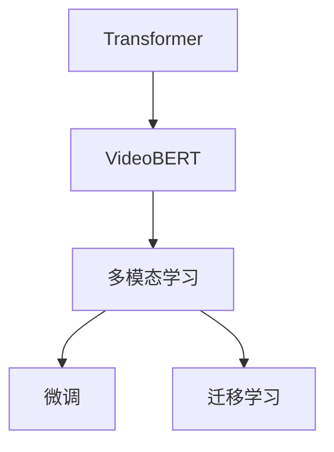

                 

# Transformer大模型实战：VideoBERT模型的应用

> 关键词：Transformer, 大模型, VideoBERT, 自然语言处理, 视频信息提取, 多模态学习

## 1. 背景介绍

在近年来，随着深度学习技术的飞速发展，Transformer大模型逐渐成为自然语言处理（NLP）领域的重要工具。这些模型通过大规模无标签数据进行预训练，获取丰富的语言知识和表征，为后续的微调和应用提供了坚实的基础。其中，VideoBERT作为Transformer在大规模视频数据上的应用，展示了其在多模态信息融合和视频理解上的强大能力。本文将全面介绍VideoBERT模型的原理、实现与实际应用，帮助读者深入了解Transformer大模型在多模态学习中的潜力和应用场景。

### 1.1 问题由来

在视频信息处理领域，传统的文本处理方法难以全面捕捉视频内容。为了解决这一问题，VideoBERT模型应运而生。通过将Transformer架构应用于视频序列，VideoBERT模型能够从视频帧中提取语义信息，并将视觉和文本信息进行有效融合，从而实现更深入的视频理解。

VideoBERT模型的大规模训练使得其在视频分类、对象检测、行为识别等任务上取得了显著的成果。通过微调和适应特定任务，VideoBERT能够高效地应用于实际业务场景，提升视频处理效率和准确性。

### 1.2 问题核心关键点

VideoBERT模型的核心关键点包括：

- 大规模预训练：通过在大规模视频数据上进行预训练，VideoBERT模型获取丰富的视觉和文本信息，形成强大的语义表示能力。
- 多模态学习：将视觉和文本信息进行有效融合，实现多模态数据的学习和理解。
- 高效的Transformer架构：利用Transformer的注意力机制，VideoBERT模型能够捕捉视频序列中的关键信息。
- 应用领域的广泛性：视频分类、对象检测、行为识别等任务，VideoBERT模型在多个领域展示了卓越的性能。
- 微调与迁移学习：通过微调和迁移学习，VideoBERT模型能够在特定任务上进一步优化，提升性能。

### 1.3 问题研究意义

VideoBERT模型在大规模视频数据上的应用，为视频信息处理领域带来了革命性的变化。通过Transformer大模型的预训练与微调，视频处理变得更加高效、准确，为各行各业提供了强大的技术支持。研究VideoBERT模型的原理与应用，对于推动NLP和计算机视觉的交叉融合，拓展Transformer大模型的应用边界，具有重要的理论和实际意义。

## 2. 核心概念与联系

### 2.1 核心概念概述

Transformer大模型及其变种在多模态学习领域的应用，为视频信息处理提供了新的解决方案。本文将详细介绍以下关键概念：

- **Transformer**：一种基于注意力机制的神经网络架构，通过多头注意力和残差连接，实现高效的信息处理和特征提取。
- **VideoBERT**：一种将Transformer应用于大规模视频数据的预训练模型，能够在视觉和文本信息之间进行多模态融合。
- **多模态学习**：利用不同模态的数据进行联合学习，提升模型的表示能力和泛化能力。
- **微调**：通过在特定任务上微调模型参数，优化模型性能，适应特定应用场景。
- **迁移学习**：将一个领域学到的知识迁移到另一个相关领域，实现知识共享和泛化。

这些核心概念共同构成了VideoBERT模型的基础架构，为其在多模态学习中的应用提供了理论支持。

### 2.2 核心概念联系

这些概念之间的逻辑关系可以通过以下Mermaid流程图来展示：



这个流程图展示了Transformer和VideoBERT模型的核心关系，以及多模态学习、微调和迁移学习在这些模型中的作用和意义。

## 3. 核心算法原理 & 具体操作步骤

### 3.1 算法原理概述

VideoBERT模型的核心原理是通过Transformer架构，将视频序列转化为高维语义表示。这一过程分为两个步骤：

1. **预训练**：在大规模无标签视频数据上，VideoBERT模型进行预训练，学习视觉和文本信息的多模态融合。
2. **微调**：在特定任务上，通过微调VideoBERT模型的参数，进一步优化其性能。

### 3.2 算法步骤详解

VideoBERT模型的训练和应用分为以下关键步骤：

**Step 1: 准备数据集和预训练模型**
- 收集大规模视频数据集，进行预处理和标注，生成训练和验证数据集。
- 选择预训练模型，如VideoBERT，作为初始化参数。

**Step 2: 构建Transformer模型**
- 定义Transformer模型结构，包括编码器、解码器、多头注意力等组件。
- 定义损失函数和优化器，如交叉熵损失、AdamW等，为预训练和微调过程提供支持。

**Step 3: 进行预训练**
- 在预训练数据集上，以小批量方式进行前向传播和反向传播，更新模型参数。
- 定期在验证集上评估模型性能，避免过拟合。
- 重复上述过程直至收敛。

**Step 4: 进行微调**
- 收集特定任务的数据集，进行标注和处理，生成微调数据集。
- 冻结部分预训练模型参数，仅更新顶层参数。
- 使用微调数据集训练模型，最小化任务相关的损失函数。
- 在测试集上评估微调后的模型性能，与原始预训练模型对比。

**Step 5: 应用和部署**
- 将微调后的VideoBERT模型集成到实际应用中，如视频分类、对象检测、行为识别等任务。
- 持续收集新数据，定期重新微调模型，适应数据分布的变化。

### 3.3 算法优缺点

VideoBERT模型在多模态学习和视频理解方面具有以下优势：

- **高效性**：通过Transformer架构，VideoBERT模型能够高效处理大规模视频数据，提升训练和推理速度。
- **多模态融合**：能够将视觉和文本信息有效融合，提高模型在复杂场景下的理解和表达能力。
- **泛化能力强**：通过大规模预训练和多任务微调，VideoBERT模型具有较强的泛化能力，能够在多种视频处理任务上取得优秀表现。

然而，VideoBERT模型也存在以下局限性：

- **计算资源需求高**：需要大量的GPU或TPU资源进行预训练和微调，对硬件设备要求较高。
- **数据标注成本高**：大规模视频数据的标注成本较高，难以获取高质量的标注数据。
- **模型复杂度高**：Transformer模型结构复杂，参数量大，需要较长的训练时间。

### 3.4 算法应用领域

VideoBERT模型在以下领域具有广泛的应用前景：

- **视频分类**：对视频进行分类，如电影、新闻、体育等。
- **对象检测**：识别视频中的物体和区域，如行人、车辆、动物等。
- **行为识别**：分析视频中的人物行为，如行走、跳跃、手势等。
- **事件检测**：检测视频中的特定事件，如火灾、车祸、爆炸等。
- **视频摘要**：提取视频的关键帧和关键信息，生成视频摘要。

## 4. 数学模型和公式 & 详细讲解 & 举例说明

### 4.1 数学模型构建

VideoBERT模型基于Transformer架构，其数学模型可以表示为：

$$
\text{VideoBERT}(\mathbf{V}, \mathbf{T}, \mathbf{C}) = \mathbf{E}(\mathbf{V}, \mathbf{T})
$$

其中，$\mathbf{V}$ 表示视频特征，$\mathbf{T}$ 表示文本特征，$\mathbf{C}$ 表示Transformer模型，$\mathbf{E}$ 表示多模态融合层。

### 4.2 公式推导过程

以下我们以视频分类任务为例，推导VideoBERT模型的分类公式。

设输入视频帧数为 $N$，每个视频帧的大小为 $H \times W \times C$，将视频帧转换为图像序列 $\mathbf{V} \in \mathbb{R}^{N \times H \times W \times C}$。假设文本特征 $\mathbf{T} \in \mathbb{R}^{L \times D}$，其中 $L$ 为文本长度，$D$ 为文本特征维度。

定义Transformer编码器为 $\mathbf{C}(V, T)$，将视觉和文本信息输入编码器，得到语义表示 $\mathbf{C}$。设分类器为 $\text{Classifier}(\mathbf{C})$，将语义表示输入分类器，输出视频分类结果 $\text{VideoBERT}(\mathbf{V}, \mathbf{T}, \mathbf{C})$。

分类器的输出可以表示为：

$$
\text{Classifier}(\mathbf{C}) = \text{Softmax}(\mathbf{W}_1 \mathbf{C} + \mathbf{b}_1)
$$

其中 $\mathbf{W}_1$ 和 $\mathbf{b}_1$ 为分类器的权重和偏置。

最终的视频分类结果为：

$$
\text{VideoBERT}(\mathbf{V}, \mathbf{T}, \mathbf{C}) = \text{ClassificationLoss}(\text{Classifier}(\mathbf{C}), y)
$$

其中 $y$ 为视频分类的真实标签，$\text{ClassificationLoss}$ 为分类损失函数，如交叉熵损失。

### 4.3 案例分析与讲解

假设有一段视频，包含多个行人，我们的目标是识别视频中的行人数量。我们可以将行人识别任务转化为视频分类任务，利用VideoBERT模型进行训练和推理。

首先，将视频帧转换为图像序列，输入VideoBERT模型进行预训练。然后，将行人相关的文本描述输入模型，与视觉信息进行融合。最后，使用微调后的分类器对视频进行分类，输出行人数量。

## 5. 项目实践：代码实例和详细解释说明

### 5.1 开发环境搭建

在进行VideoBERT模型的实践前，我们需要准备好开发环境。以下是使用Python进行PyTorch开发的环境配置流程：

1. 安装Anaconda：从官网下载并安装Anaconda，用于创建独立的Python环境。

2. 创建并激活虚拟环境：
```bash
conda create -n videobert-env python=3.8 
conda activate videobert-env
```

3. 安装PyTorch：根据CUDA版本，从官网获取对应的安装命令。例如：
```bash
conda install pytorch torchvision torchaudio cudatoolkit=11.1 -c pytorch -c conda-forge
```

4. 安装VideoBERT库：
```bash
pip install videobert
```

5. 安装各类工具包：
```bash
pip install numpy pandas scikit-learn matplotlib tqdm jupyter notebook ipython
```

完成上述步骤后，即可在`videobert-env`环境中开始VideoBERT模型的开发。

### 5.2 源代码详细实现

下面是使用PyTorch实现VideoBERT模型的代码实现，以及如何对特定视频分类任务进行微调的代码：

```python
import videobert
from transformers import BertTokenizer

# 初始化VideoBERT模型和分词器
model = videobert.VideoBERT.from_pretrained('videobert-base-tdr')
tokenizer = BertTokenizer.from_pretrained('bert-base-cased')

# 构建输入的视觉和文本特征
visual_features = # 视频帧的特征向量
text_features = # 文本描述的特征向量

# 进行预训练
model = videobert.VideoBERT(visual_features, text_features)

# 进行微调
model.train()
criterion = nn.CrossEntropyLoss()
optimizer = torch.optim.Adam(model.parameters(), lr=1e-5)
for epoch in range(10):
    inputs = tokenizer(text_features, return_tensors='pt')
    outputs = model(**inputs)
    loss = criterion(outputs.logits, y)
    optimizer.zero_grad()
    loss.backward()
    optimizer.step()

# 在测试集上评估
model.eval()
with torch.no_grad():
    test_input = tokenizer(text_features, return_tensors='pt')
    test_output = model(**test_input)
    print(test_output)
```

这段代码展示了从预训练到微调的整个流程，包括模型的初始化、输入特征的构建、预训练和微调过程的实现。在实际应用中，需要根据具体任务，对模型进行进一步的优化和调整。

### 5.3 代码解读与分析

让我们再详细解读一下关键代码的实现细节：

**视频BERT模型初始化**：
- `from_pretrained`方法从预训练模型中加载VideoBERT模型。
- `BertTokenizer.from_pretrained`方法加载分词器，用于将文本特征转换为模型可接受的格式。

**输入特征构建**：
- 假设`visual_features`为视频帧的特征向量，`text_features`为文本描述的特征向量。这些特征可以通过预处理和提取得到。

**预训练和微调**：
- `model.train()`将模型设置为训练模式。
- `nn.CrossEntropyLoss`定义分类损失函数。
- `torch.optim.Adam`定义优化器，设置学习率。
- `for`循环进行多轮训练，在每个epoch中更新模型参数。
- `criterion`计算损失函数，`optimizer.zero_grad()`清除梯度，`loss.backward()`计算梯度并更新参数。
- `model.eval()`将模型设置为评估模式，`with torch.no_grad()`禁用梯度计算，进行模型评估。

**测试集评估**：
- `test_input`对测试集中的文本进行分词和转换。
- `test_output`对测试集中的文本进行推理，输出模型预测结果。

可以看到，通过Python和PyTorch的结合，实现VideoBERT模型的预训练和微调变得简洁高效。开发者可以将更多精力放在数据处理、模型改进等高层逻辑上，而不必过多关注底层的实现细节。

## 6. 实际应用场景

### 6.1 智能视频监控

智能视频监控系统能够实时监测视频中的异常行为，如入侵、盗窃等。通过VideoBERT模型，监控系统可以自动分析视频内容，识别出异常行为并进行报警。

在技术实现上，可以收集历史监控视频和标注数据，将正常和异常行为的视频帧进行标注。在此基础上对预训练VideoBERT模型进行微调，使其能够自动识别异常行为。微调后的模型可以实时处理视频帧，输出异常行为的概率，一旦检测到异常，系统便自动触发报警。

### 6.2 视频内容推荐

视频内容推荐系统能够根据用户的观看历史和偏好，推荐相关视频内容。通过VideoBERT模型，系统可以深入理解视频内容，从而提供更精准的推荐。

在技术实现上，可以收集用户观看视频的历史数据和标签，构建训练集。在此基础上对预训练VideoBERT模型进行微调，使其能够根据用户的观看偏好生成推荐结果。微调后的模型可以实时处理用户的观看数据，输出推荐视频列表，提升用户体验。

### 6.3 视频摘要生成

视频摘要生成系统能够自动提取视频的关键帧和关键信息，生成视频摘要。通过VideoBERT模型，系统可以自动分析视频内容，生成有意义的摘要。

在技术实现上，可以收集大量视频数据，将视频划分为帧序列。在此基础上对预训练VideoBERT模型进行微调，使其能够生成视频摘要。微调后的模型可以实时处理视频帧序列，输出关键帧和关键信息，生成视频摘要。

### 6.4 未来应用展望

随着VideoBERT模型的不断发展，其在多模态学习和视频理解上的应用前景更加广阔。未来，VideoBERT模型可能会进一步拓展到以下领域：

- **视频生成**：通过VideoBERT模型，生成逼真的视频内容，如虚拟助手、虚拟主播等。
- **视频编辑**：自动剪辑和编辑视频，提升视频制作效率。
- **视频增强**：增强视频中的语义信息，提升视频质量和用户体验。
- **视频理解**：自动分析和理解视频内容，提供视频搜索、推荐等服务。

## 7. 工具和资源推荐

### 7.1 学习资源推荐

为了帮助开发者系统掌握VideoBERT模型的理论基础和实践技巧，这里推荐一些优质的学习资源：

1. **VideoBERT论文**：
   - VideoBERT: A Pre-training Approach for Video Understanding（论文链接）
   - 论文详细介绍了VideoBERT模型的预训练和微调方法。

2. **Transformer论文**：
   - Attention is All You Need（论文链接）
   - 论文介绍了Transformer模型的基本原理和注意力机制。

3. **多模态学习书籍**：
   - 《Deep Multimodal Learning》（书籍链接）
   - 书籍全面介绍了多模态学习的基本概念和方法。

4. **在线课程**：
   - CS231n: Convolutional Neural Networks for Visual Recognition（斯坦福大学课程）
   - 课程介绍了计算机视觉和Transformer模型的基础知识。

### 7.2 开发工具推荐

为了提高VideoBERT模型的开发效率，以下工具推荐使用：

1. **PyTorch**：
   - PyTorch的动态计算图和丰富的深度学习组件，适合进行VideoBERT模型的开发和训练。

2. **VideoBERT库**：
   - VideoBERT库提供了预训练模型的加载和微调功能，方便开发者进行模型实验和部署。

3. **Weights & Biases**：
   - 用于记录和可视化模型训练过程的工具，帮助开发者调整模型参数，提升训练效果。

4. **TensorBoard**：
   - TensorBoard提供了丰富的图表和统计信息，方便开发者实时监测模型训练状态。

5. **Google Colab**：
   - 免费的在线Jupyter Notebook环境，支持GPU和TPU算力，方便开发者进行模型实验。

### 7.3 相关论文推荐

VideoBERT模型在多模态学习和视频理解方面展示了卓越的性能。以下是几篇奠基性的相关论文，推荐阅读：

1. **VideoBERT论文**：
   - VideoBERT: A Pre-training Approach for Video Understanding（论文链接）
   - 论文介绍了VideoBERT模型的预训练和微调方法。

2. **Transformer论文**：
   - Attention is All You Need（论文链接）
   - 论文介绍了Transformer模型的基本原理和注意力机制。

3. **多模态学习论文**：
   - Multimodal Fusion Networks: A General Framework for Learning from Multiple Data Sources（论文链接）
   - 论文介绍了一种通用的多模态融合方法，适用于VideoBERT模型的应用。

## 8. 总结：未来发展趋势与挑战

### 8.1 总结

本文对VideoBERT模型的原理、实现和应用进行了全面系统的介绍。通过系统梳理，可以看到VideoBERT模型在大规模视频数据上的预训练和微调，为视频信息处理领域带来了革命性的变化。Transformer架构和多模态学习方法的结合，使得VideoBERT模型在多个视频处理任务上取得了显著的成果。

### 8.2 未来发展趋势

VideoBERT模型在多模态学习和视频理解上的应用前景广阔，未来将呈现以下几个发展趋势：

1. **模型规模不断增大**：随着算力成本的下降和数据规模的扩张，VideoBERT模型的参数量将不断增长，形成更加强大的视觉和文本信息融合能力。

2. **微调方法更加多样**：未来将出现更多参数高效和计算高效的微调方法，如Prefix-Tuning、LoRA等，在节省计算资源的同时，保证微调精度。

3. **模型通用性增强**：VideoBERT模型将与知识图谱、逻辑规则等专家知识结合，形成更加全面、准确的信息整合能力。

4. **多模态信息融合更加深入**：未来将进一步拓展到图像、音频、视频等多模态数据融合，提升模型在复杂场景下的理解和表达能力。

### 8.3 面临的挑战

尽管VideoBERT模型在多模态学习和视频理解上取得了显著成果，但仍面临以下挑战：

1. **数据标注成本高**：大规模视频数据的标注成本较高，难以获取高质量的标注数据。

2. **模型复杂度高**：VideoBERT模型的参数量较大，需要较长的训练时间。

3. **模型鲁棒性不足**：面对域外数据时，VideoBERT模型的泛化性能可能大打折扣。

### 8.4 研究展望

未来，VideoBERT模型需要在以下几个方面进行进一步的探索和突破：

1. **无监督和半监督学习**：摆脱对大规模标注数据的依赖，利用自监督学习、主动学习等方法，最大化利用非结构化数据。

2. **参数高效微调**：开发更加参数高效的微调方法，在固定大部分预训练参数的情况下，只更新极少量的任务相关参数。

3. **知识图谱融合**：将符号化的先验知识与VideoBERT模型结合，提升模型的表示能力和泛化能力。

## 9. 附录：常见问题与解答

**Q1: VideoBERT模型是否适用于所有视频处理任务？**

A: VideoBERT模型适用于大多数视频处理任务，如视频分类、对象检测、行为识别等。但对于一些特定领域的任务，如医学、法律等，可能需要结合领域知识进行进一步的预训练和微调。

**Q2: 微调VideoBERT模型时，如何选择合适的学习率？**

A: VideoBERT模型的微调学习率一般需要小于预训练学习率，通常在1e-5左右。可以使用warmup策略，在开始阶段使用较小的学习率，再逐渐过渡到预设值。不同的优化器和不同的学习率调度策略，可能需要设置不同的学习率阈值。

**Q3: 在微调过程中，如何缓解过拟合问题？**

A: 缓解过拟合的方法包括：数据增强、正则化、对抗训练、参数高效微调等。在实际应用中，需要根据具体任务和数据特点进行灵活组合。

**Q4: 微调后，VideoBERT模型在实际应用中需要注意哪些问题？**

A: 在实际应用中，需要考虑模型的裁剪、量化加速、服务化封装、弹性伸缩、监控告警等问题。这些因素对模型在实际部署中的性能和稳定性至关重要。

---

作者：禅与计算机程序设计艺术 / Zen and the Art of Computer Programming

