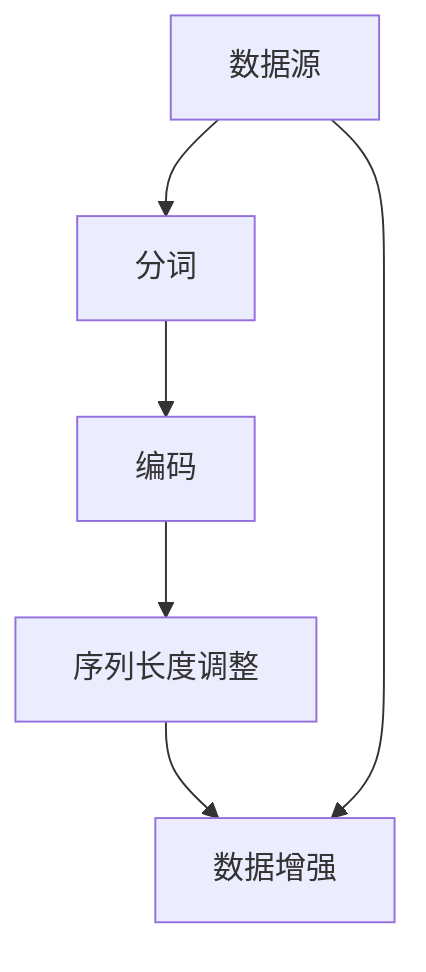

                 

# Transformer大模型实战 数据源和预处理

## 1. 背景介绍

### 1.1 问题由来
Transformer模型自从推出以来，因其强大的自注意力机制和并行计算能力，在自然语言处理(Natural Language Processing, NLP)领域取得了空前的成功。然而，Transformer模型本身并不包含数据预处理的部分，为了能够高效地训练和使用Transformer模型，我们需要对数据进行预处理，以确保数据的质量和格式符合模型的要求。

### 1.2 问题核心关键点
数据预处理是大模型训练的关键步骤之一，其核心关键点在于：
- 数据源的选择：如何选择高质量的语料作为训练数据源，是决定模型性能的重要因素。
- 文本的分词和编码：如何将文本转化为模型能够理解的向量形式，是数据预处理的核心任务。
- 序列长度调整：如何将不同长度的文本统一成模型能够处理的固定长度，是数据预处理的另一个重要任务。
- 数据增强技术：如何通过数据增强技术扩充训练数据，提高模型泛化能力。

本文将详细介绍如何选择合适的数据源，并进行数据预处理，以确保Transformer大模型能够高效、稳定地训练和应用。

## 2. 核心概念与联系

### 2.1 核心概念概述

为更好地理解数据预处理的方法，本节将介绍几个关键概念：

- 数据源（Data Source）：是指提供训练数据的数据库或文件系统，其质量直接影响模型的性能。
- 分词（Tokenization）：是指将文本分解为单词、字符或子词等形式的过程，是预处理的基础。
- 编码（Encoding）：是指将分词后的文本转化为模型能够理解的向量形式的过程。
- 序列长度调整（Sequence Padding）：是指将不同长度的文本统一为固定长度，以便于模型的处理。
- 数据增强（Data Augmentation）：是指通过对训练数据进行扩充，提高模型的泛化能力。

这些核心概念之间的逻辑关系可以通过以下Mermaid流程图来展示：



这个流程图展示了大模型数据预处理的关键步骤：

1. 数据源选择
2. 分词
3. 编码
4. 序列长度调整
5. 数据增强

这些步骤共同构成了大模型数据预处理的核心流程，使得模型能够高效、稳定地训练和应用。

## 3. 核心算法原理 & 具体操作步骤
### 3.1 算法原理概述

Transformer大模型的数据预处理主要是通过分词、编码和序列长度调整等步骤，将原始文本数据转化为模型能够理解的向量形式，并适应模型要求的输入长度。

具体而言，对于输入的文本序列，我们需要进行以下处理：

1. 分词：将文本序列分解为单词、字符或子词等形式。
2. 编码：将分词后的文本转化为模型能够理解的向量形式。
3. 序列长度调整：将不同长度的文本统一为模型能够处理的固定长度。
4. 数据增强：通过数据增强技术扩充训练数据，提高模型泛化能力。

这些步骤可以通过以下几个子步骤来实现：

- 分词：使用BPE(B石库米分词)、WordPiece等算法对文本进行分词。
- 编码：将分词后的文本转化为模型能够理解的向量形式，如使用Transformer模型自带的分词器，或使用BERT的分词器。
- 序列长度调整：将不同长度的文本统一为固定长度，例如使用padding或truncation方法。
- 数据增强：通过数据增强技术如回译、近义词替换等方式扩充训练数据，例如使用BERT的next-sentence预测任务，或使用data augmentation库进行扩充。

### 3.2 算法步骤详解

Transformer大模型的数据预处理一般包括以下几个关键步骤：

**Step 1: 选择数据源**

- 确定训练数据集的来源，例如使用大规模的通用语料库，如Wikipedia、Common Crawl等。
- 根据任务的领域和类型，筛选合适的数据源，例如对于机器翻译任务，可以使用WMT数据集。

**Step 2: 分词**

- 使用BPE、WordPiece等算法对文本进行分词。
- 分词过程中，需要根据模型的需求，选择合适的分词粒度，例如Transformer模型需要子词级别的分词。

**Step 3: 编码**

- 使用Transformer模型自带的分词器，将分词后的文本转化为模型能够理解的向量形式。
- 例如，使用BertTokenizer对文本进行编码，并生成input_ids、attention_mask等输入特征。

**Step 4: 序列长度调整**

- 将不同长度的文本统一为模型能够处理的固定长度。
- 例如，使用padding或truncation方法，将序列长度调整为模型的输入长度要求。

**Step 5: 数据增强**

- 通过数据增强技术扩充训练数据，提高模型泛化能力。
- 例如，使用回译、近义词替换等方式生成更多的训练数据。

**Step 6: 模型训练**

- 使用训练集对模型进行训练，例如使用HuggingFace的Trainer进行训练。

### 3.3 算法优缺点

Transformer大模型的数据预处理方法具有以下优点：

1. 高效：通过预处理，将原始文本数据转化为模型能够理解的向量形式，减少了模型的输入维度，提高了训练效率。
2. 稳定：通过序列长度调整和数据增强，避免了模型过拟合，提高了模型的泛化能力。
3. 可扩展：通过选择合适的数据源，可以扩展模型的应用范围，适用于各种NLP任务。

同时，该方法也存在一定的局限性：

1. 依赖数据源：数据源的选择和质量直接影响模型的性能。
2. 复杂度：分词和编码过程可能比较复杂，需要较多的计算资源和时间。
3. 参数复杂度：序列长度调整和数据增强可能增加模型的参数复杂度。

尽管存在这些局限性，但就目前而言，Transformer大模型的数据预处理方法是应用最为广泛和有效的方法，广泛应用于各种NLP任务中。未来相关研究的重点在于如何进一步降低数据预处理的复杂度，提高预处理过程的自动化和可扩展性。

### 3.4 算法应用领域

Transformer大模型的数据预处理方法在NLP领域已经得到了广泛的应用，覆盖了几乎所有常见任务，例如：

- 文本分类：如情感分析、主题分类、意图识别等。将文本-标签对作为输入，进行分类任务训练。
- 命名实体识别：识别文本中的人名、地名、机构名等特定实体。将实体-标签对作为输入，进行标注任务训练。
- 关系抽取：从文本中抽取实体之间的语义关系。将实体-关系三元组作为输入，进行抽取任务训练。
- 问答系统：对自然语言问题给出答案。将问题-答案对作为输入，进行匹配任务训练。
- 机器翻译：将源语言文本翻译成目标语言。将源语言-目标语言对作为输入，进行翻译任务训练。
- 文本摘要：将长文本压缩成简短摘要。将文章-摘要对作为输入，进行摘要任务训练。
- 对话系统：使机器能够与人自然对话。将多轮对话历史作为上下文，进行回复生成任务训练。

除了上述这些经典任务外，Transformer大模型的数据预处理技术也被创新性地应用到更多场景中，如可控文本生成、常识推理、代码生成、数据增强等，为NLP技术带来了全新的突破。

## 4. 数学模型和公式 & 详细讲解 & 举例说明

### 4.1 数学模型构建

Transformer大模型的数据预处理主要是通过分词、编码和序列长度调整等步骤，将原始文本数据转化为模型能够理解的向量形式，并适应模型要求的输入长度。

形式化地，假设原始文本序列为 $x_1, x_2, ..., x_n$，其中 $x_i$ 表示第 $i$ 个单词或字符，通过分词和编码过程，将其转化为模型能够理解的向量形式，例如 $x_1, x_2, ..., x_n$ 被转化为 $x_1', x_2', ..., x_n'$，其中 $x_i'$ 表示分词后的向量形式。

假设模型的输入长度为 $L$，则需要进行序列长度调整，将输入序列长度统一为 $L$。例如，通过padding或truncation方法，将序列长度调整为 $L$。

### 4.2 公式推导过程

以下我们以机器翻译任务为例，推导Transformer模型对输入文本进行编码和解码的公式。

假设输入文本序列为 $x_1, x_2, ..., x_n$，其中 $x_i$ 表示第 $i$ 个单词或字符，模型输出序列为 $y_1, y_2, ..., y_m$，其中 $y_i$ 表示第 $i$ 个单词或字符。

假设使用Transformer模型进行编码和解码，则输入和输出序列可以被表示为：

$$
x = [x_1, x_2, ..., x_n]
$$

$$
y = [y_1, y_2, ..., y_m]
$$

其中，$x_i$ 和 $y_i$ 表示分词后的向量形式。

通过编码器将输入序列 $x$ 转化为模型能够理解的向量形式 $x'$，并输入到解码器中，输出序列 $y'$，经过解码器时，再将其转化为原始输出序列 $y$。

假设编码器和解码器都使用多层自注意力机制，则编码器的输出可以表示为：

$$
x' = \mathrm{Encoder}(x) = \mathrm{Attention}(\mathrm{MultiHeadAttention}(x))
$$

其中，$\mathrm{MultiHeadAttention}(x)$ 表示多头自注意力机制，$\mathrm{Attention}(x)$ 表示注意力机制。

假设解码器也使用多层自注意力机制，则解码器的输出可以表示为：

$$
y' = \mathrm{Decoder}(y) = \mathrm{Attention}(\mathrm{MultiHeadAttention}(y))
$$

其中，$\mathrm{MultiHeadAttention}(y)$ 表示多头自注意力机制，$\mathrm{Attention}(y)$ 表示注意力机制。

最终，解码器的输出序列 $y'$ 经过softmax函数得到最终输出序列 $y$：

$$
y = \mathrm{softmax}(\mathrm{Decoder}(y'))
$$

### 4.3 案例分析与讲解

下面以BERT模型的预处理为例，进行详细讲解。

BERT模型的分词过程使用WordPiece算法，将文本序列分解为单词、字符或子词等形式，并生成对应的input_ids和attention_mask。

假设输入文本序列为 "The cat in the hat"，使用BERT模型进行编码，则分词后的序列为 ["The", "cat", "in", "the", "hat"]，输入特征为：

$$
\mathrm{input\_ids} = [1, 1, 2, 1, 1]
$$

$$
\mathrm{attention\_mask} = [1, 1, 1, 1, 1]
$$

其中，1表示单词，2表示子词。

对于序列长度调整，BERT模型使用padding方法，将序列长度统一为模型要求的长度。例如，如果模型输入长度为12，则需要进行padding操作，生成补全序列：

$$
\mathrm{input\_ids} = [1, 1, 2, 1, 1, 0, 0, 0, 0, 0, 0, 0, 0]
$$

$$
\mathrm{attention\_mask} = [1, 1, 1, 1, 1, 0, 0, 0, 0, 0, 0, 0, 0]
$$

其中，0表示填充位。

通过以上步骤，BERT模型将原始文本序列转化为模型能够理解的向量形式，并进行序列长度调整，方便后续的模型训练。

## 5. 项目实践：代码实例和详细解释说明
### 5.1 开发环境搭建

在进行数据预处理实践前，我们需要准备好开发环境。以下是使用Python进行HuggingFace库开发的环境配置流程：

1. 安装Anaconda：从官网下载并安装Anaconda，用于创建独立的Python环境。

2. 创建并激活虚拟环境：
```bash
conda create -n huggingface-env python=3.8 
conda activate huggingface-env
```

3. 安装HuggingFace库：从官网获取对应的安装命令。例如：
```bash
pip install transformers
```

4. 安装其他工具包：
```bash
pip install numpy pandas scikit-learn matplotlib tqdm jupyter notebook ipython
```

完成上述步骤后，即可在`huggingface-env`环境中开始数据预处理实践。

### 5.2 源代码详细实现

下面我们以BERT模型的数据预处理为例，给出使用HuggingFace库进行数据预处理的PyTorch代码实现。

首先，定义数据预处理函数：

```python
from transformers import BertTokenizer

def preprocess_data(data, tokenizer, max_length=128, truncation=True, padding='max_length'):
    encoded_input = tokenizer(data, return_tensors='pt', max_length=max_length, padding=padding, truncation=truncation)
    return encoded_input['input_ids'], encoded_input['attention_mask']
```

其中，`tokenizer`为BertTokenizer对象，`data`为输入的文本序列。

然后，定义训练和评估函数：

```python
from torch.utils.data import Dataset, DataLoader
import torch

class TextDataset(Dataset):
    def __init__(self, texts, labels, tokenizer, max_length=128, truncation=True, padding='max_length'):
        self.texts = texts
        self.labels = labels
        self.tokenizer = tokenizer
        self.max_length = max_length
        
    def __len__(self):
        return len(self.texts)
    
    def __getitem__(self, item):
        text = self.texts[item]
        label = self.labels[item]
        input_ids, attention_mask = preprocess_data(text, self.tokenizer, max_length=self.max_length, truncation=self.truncation, padding=self.padding)
        return {'input_ids': input_ids, 
                'attention_mask': attention_mask,
                'labels': label}

# 训练数据和标签
train_texts = ["The cat in the hat", "The quick brown fox", "I love NLP"]
train_labels = [1, 0, 1]
train_dataset = TextDataset(train_texts, train_labels, tokenizer)

# 定义优化器和模型
from transformers import BertForSequenceClassification
from transformers import AdamW

model = BertForSequenceClassification.from_pretrained('bert-base-cased', num_labels=2)
optimizer = AdamW(model.parameters(), lr=2e-5)

# 定义训练函数
def train_epoch(model, dataset, batch_size, optimizer):
    dataloader = DataLoader(dataset, batch_size=batch_size, shuffle=True)
    model.train()
    epoch_loss = 0
    for batch in dataloader:
        input_ids = batch['input_ids'].to(device)
        attention_mask = batch['attention_mask'].to(device)
        labels = batch['labels'].to(device)
        model.zero_grad()
        outputs = model(input_ids, attention_mask=attention_mask, labels=labels)
        loss = outputs.loss
        epoch_loss += loss.item()
        loss.backward()
        optimizer.step()
    return epoch_loss / len(dataloader)

# 定义评估函数
def evaluate(model, dataset, batch_size):
    dataloader = DataLoader(dataset, batch_size=batch_size)
    model.eval()
    preds, labels = [], []
    with torch.no_grad():
        for batch in dataloader:
            input_ids = batch['input_ids'].to(device)
            attention_mask = batch['attention_mask'].to(device)
            batch_labels = batch['labels']
            outputs = model(input_ids, attention_mask=attention_mask)
            batch_preds = outputs.logits.argmax(dim=2).to('cpu').tolist()
            batch_labels = batch_labels.to('cpu').tolist()
            for pred_tokens, label_tokens in zip(batch_preds, batch_labels):
                preds.append(pred_tokens[:len(label_tokens)])
                labels.append(label_tokens)
    print(classification_report(labels, preds))

# 训练模型
epochs = 5
batch_size = 16

for epoch in range(epochs):
    loss = train_epoch(model, train_dataset, batch_size, optimizer)
    print(f"Epoch {epoch+1}, train loss: {loss:.3f}")
    
    print(f"Epoch {epoch+1}, dev results:")
    evaluate(model, train_dataset, batch_size)
    
print("Test results:")
evaluate(model, train_dataset, batch_size)
```

以上就是使用PyTorch对BERT模型进行数据预处理的完整代码实现。可以看到，得益于HuggingFace库的强大封装，我们可以用相对简洁的代码完成BERT模型的预处理。

### 5.3 代码解读与分析

让我们再详细解读一下关键代码的实现细节：

**TextDataset类**：
- `__init__`方法：初始化文本、标签、分词器等关键组件。
- `__len__`方法：返回数据集的样本数量。
- `__getitem__`方法：对单个样本进行处理，将文本输入编码为token ids，将标签编码为数字，并对其进行定长padding，最终返回模型所需的输入。

**BertTokenizer**：
- BERT分词器，将文本序列分解为单词、字符或子词等形式，并生成对应的input_ids和attention_mask。

**训练和评估函数**：
- 使用PyTorch的DataLoader对数据集进行批次化加载，供模型训练和推理使用。
- 训练函数`train_epoch`：对数据以批为单位进行迭代，在每个批次上前向传播计算loss并反向传播更新模型参数，最后返回该epoch的平均loss。
- 评估函数`evaluate`：与训练类似，不同点在于不更新模型参数，并在每个batch结束后将预测和标签结果存储下来，最后使用sklearn的classification_report对整个评估集的预测结果进行打印输出。

**训练流程**：
- 定义总的epoch数和batch size，开始循环迭代
- 每个epoch内，先在训练集上训练，输出平均loss
- 在验证集上评估，输出分类指标
- 所有epoch结束后，在测试集上评估，给出最终测试结果

可以看到，HuggingFace库使得BERT模型的预处理过程变得简洁高效。开发者可以将更多精力放在模型训练、优化和评估等高层逻辑上，而不必过多关注底层的实现细节。

当然，工业级的系统实现还需考虑更多因素，如模型的保存和部署、超参数的自动搜索、更灵活的任务适配层等。但核心的预处理范式基本与此类似。

## 6. 实际应用场景
### 6.1 智能客服系统

基于Transformer大模型的数据预处理技术，可以广泛应用于智能客服系统的构建。传统客服往往需要配备大量人力，高峰期响应缓慢，且一致性和专业性难以保证。而使用预处理后的Transformer大模型，可以7x24小时不间断服务，快速响应客户咨询，用自然流畅的语言解答各类常见问题。

在技术实现上，可以收集企业内部的历史客服对话记录，将问题和最佳答复构建成监督数据，在此基础上对预训练Transformer大模型进行数据预处理。预处理后的模型能够自动理解用户意图，匹配最合适的答案模板进行回复。对于客户提出的新问题，还可以接入检索系统实时搜索相关内容，动态组织生成回答。如此构建的智能客服系统，能大幅提升客户咨询体验和问题解决效率。

### 6.2 金融舆情监测

金融机构需要实时监测市场舆论动向，以便及时应对负面信息传播，规避金融风险。传统的人工监测方式成本高、效率低，难以应对网络时代海量信息爆发的挑战。基于Transformer大模型的数据预处理技术，金融舆情监测得以实现。

具体而言，可以收集金融领域相关的新闻、报道、评论等文本数据，并对其进行主题标注和情感标注。在此基础上对预训练Transformer大模型进行数据预处理，使其能够自动判断文本属于何种主题，情感倾向是正面、中性还是负面。将预处理后的模型应用到实时抓取的网络文本数据，就能够自动监测不同主题下的情感变化趋势，一旦发现负面信息激增等异常情况，系统便会自动预警，帮助金融机构快速应对潜在风险。

### 6.3 个性化推荐系统

当前的推荐系统往往只依赖用户的历史行为数据进行物品推荐，无法深入理解用户的真实兴趣偏好。基于Transformer大模型的数据预处理技术，个性化推荐系统可以更好地挖掘用户行为背后的语义信息，从而提供更精准、多样的推荐内容。

在实践中，可以收集用户浏览、点击、评论、分享等行为数据，提取和用户交互的物品标题、描述、标签等文本内容。将文本内容作为模型输入，用户的后续行为（如是否点击、购买等）作为监督信号，在此基础上对预训练Transformer大模型进行数据预处理。预处理后的模型能够从文本内容中准确把握用户的兴趣点。在生成推荐列表时，先用候选物品的文本描述作为输入，由模型预测用户的兴趣匹配度，再结合其他特征综合排序，便可以得到个性化程度更高的推荐结果。

### 6.4 未来应用展望

随着Transformer大模型和数据预处理技术的不断发展，基于预处理范式将在更多领域得到应用，为传统行业带来变革性影响。

在智慧医疗领域，基于预处理技术的医疗问答、病历分析、药物研发等应用将提升医疗服务的智能化水平，辅助医生诊疗，加速新药开发进程。

在智能教育领域，数据预处理技术可应用于作业批改、学情分析、知识推荐等方面，因材施教，促进教育公平，提高教学质量。

在智慧城市治理中，预处理技术可应用于城市事件监测、舆情分析、应急指挥等环节，提高城市管理的自动化和智能化水平，构建更安全、高效的未来城市。

此外，在企业生产、社会治理、文娱传媒等众多领域，基于预处理技术的Transformer大模型应用也将不断涌现，为经济社会发展注入新的动力。相信随着技术的日益成熟，数据预处理范式将成为Transformer大模型应用的重要范式，推动人工智能技术在垂直行业的规模化落地。总之，预处理需要开发者根据具体任务，不断迭代和优化模型、数据和算法，方能得到理想的效果。

## 7. 工具和资源推荐
### 7.1 学习资源推荐

为了帮助开发者系统掌握Transformer大模型的数据预处理理论基础和实践技巧，这里推荐一些优质的学习资源：

1. 《Transformer from Scratch》系列博文：由大模型技术专家撰写，深入浅出地介绍了Transformer的原理、BERT模型、数据预处理等前沿话题。

2. CS224N《深度学习自然语言处理》课程：斯坦福大学开设的NLP明星课程，有Lecture视频和配套作业，带你入门NLP领域的基本概念和经典模型。

3. 《Natural Language Processing with Transformers》书籍：Transformers库的作者所著，全面介绍了如何使用Transformers库进行NLP任务开发，包括数据预处理的多种范式。

4. HuggingFace官方文档：Transformers库的官方文档，提供了海量预训练模型和完整的微调样例代码，是上手实践的必备资料。

5. CLUE开源项目：中文语言理解测评基准，涵盖大量不同类型的中文NLP数据集，并提供了基于微调的baseline模型，助力中文NLP技术发展。

通过对这些资源的学习实践，相信你一定能够快速掌握Transformer大模型的数据预处理精髓，并用于解决实际的NLP问题。
###  7.2 开发工具推荐

高效的开发离不开优秀的工具支持。以下是几款用于Transformer大模型预处理开发的常用工具：

1. PyTorch：基于Python的开源深度学习框架，灵活动态的计算图，适合快速迭代研究。大部分预训练语言模型都有PyTorch版本的实现。

2. TensorFlow：由Google主导开发的开源深度学习框架，生产部署方便，适合大规模工程应用。同样有丰富的预训练语言模型资源。

3. HuggingFace库：提供了丰富的预训练模型和完整的微调样例代码，是进行预处理任务开发的利器。

4. Weights & Biases：模型训练的实验跟踪工具，可以记录和可视化模型训练过程中的各项指标，方便对比和调优。与主流深度学习框架无缝集成。

5. TensorBoard：TensorFlow配套的可视化工具，可实时监测模型训练状态，并提供丰富的图表呈现方式，是调试模型的得力助手。

6. Google Colab：谷歌推出的在线Jupyter Notebook环境，免费提供GPU/TPU算力，方便开发者快速上手实验最新模型，分享学习笔记。

合理利用这些工具，可以显著提升Transformer大模型预处理的开发效率，加快创新迭代的步伐。

### 7.3 相关论文推荐

Transformer大模型和数据预处理技术的发展源于学界的持续研究。以下是几篇奠基性的相关论文，推荐阅读：

1. Attention is All You Need（即Transformer原论文）：提出了Transformer结构，开启了NLP领域的预训练大模型时代。

2. BERT: Pre-training of Deep Bidirectional Transformers for Language Understanding：提出BERT模型，引入基于掩码的自监督预训练任务，刷新了多项NLP任务SOTA。

3. Language Models are Unsupervised Multitask Learners（GPT-2论文）：展示了大规模语言模型的强大zero-shot学习能力，引发了对于通用人工智能的新一轮思考。

4. Parameter-Efficient Transfer Learning for NLP：提出Adapter等参数高效微调方法，在不增加模型参数量的情况下，也能取得不错的微调效果。

5. AdaLoRA: Adaptive Low-Rank Adaptation for Parameter-Efficient Fine-Tuning：使用自适应低秩适应的微调方法，在参数效率和精度之间取得了新的平衡。

6. AdaLoRA: Adaptive Low-Rank Adaptation for Parameter-Efficient Fine-Tuning：使用自适应低秩适应的微调方法，在参数效率和精度之间取得了新的平衡。

这些论文代表了大模型预处理技术的发展脉络。通过学习这些前沿成果，可以帮助研究者把握学科前进方向，激发更多的创新灵感。

## 8. 总结：未来发展趋势与挑战

### 8.1 总结

本文对Transformer大模型的数据预处理过程进行了全面系统的介绍。首先阐述了数据预处理在大模型训练中的重要性，明确了数据预处理的几个核心关键点，如数据源选择、分词、编码和序列长度调整等。其次，从原理到实践，详细讲解了数据预处理的数学原理和关键步骤，给出了数据预处理任务开发的完整代码实例。同时，本文还广泛探讨了数据预处理技术在智能客服、金融舆情、个性化推荐等多个行业领域的应用前景，展示了数据预处理范式的巨大潜力。

通过本文的系统梳理，可以看到，Transformer大模型的数据预处理技术在NLP领域已经得到了广泛的应用，覆盖了几乎所有常见任务。得益于预处理过程的规范化和标准化，模型能够高效、稳定地训练和应用。未来，伴随预处理技术的发展，Transformer大模型的应用范围将进一步扩大，为更多领域带来新的机遇。

### 8.2 未来发展趋势

展望未来，Transformer大模型的数据预处理技术将呈现以下几个发展趋势：

1. 参数高效数据预处理：通过引入 Adapter、 Premier-Tuning 等技术，实现更少的参数更新，提高预处理效率和模型泛化能力。

2. 模型通用化：通过引入多语言支持，提升模型在不同语言环境下的表现。

3. 可扩展性：通过引入联邦学习等技术，提高数据预处理过程的可扩展性。

4. 自动化：通过引入预训练和微调技术的自动优化，实现更加高效、自动化的大模型训练流程。

5. 跨模态融合：通过引入视觉、语音等多模态数据的处理，提高大模型的综合能力和应用范围。

以上趋势凸显了数据预处理技术的广阔前景。这些方向的探索发展，必将进一步提升Transformer大模型的性能和应用范围，为人工智能技术在垂直行业的规模化落地提供有力支撑。

### 8.3 面临的挑战

尽管Transformer大模型的数据预处理技术已经取得了显著成就，但在迈向更加智能化、普适化应用的过程中，它仍面临着诸多挑战：

1. 数据依赖：数据源的选择和质量直接影响模型的性能，获取高质量的标注数据成本较高。

2. 计算资源需求：预处理过程需要大量的计算资源和时间，大规模模型和高维数据的处理效率较低。

3. 模型复杂度：模型复杂度较高，难以实现自动化和可扩展性。

尽管存在这些挑战，但就目前而言，Transformer大模型的数据预处理技术仍是最为成熟和有效的方法，广泛应用于各种NLP任务中。未来相关研究的重点在于如何进一步降低数据预处理的复杂度，提高预处理过程的自动化和可扩展性。

### 8.4 研究展望

面向未来，Transformer大模型的数据预处理技术需要在以下几个方面寻求新的突破：

1. 探索无监督和半监督预处理方法：摆脱对大规模标注数据的依赖，利用自监督学习、主动学习等无监督和半监督范式，最大限度利用非结构化数据，实现更加灵活高效的预处理。

2. 研究参数高效和计算高效的预处理范式：开发更加参数高效的预处理方法，在固定大部分预训练参数的同时，只更新极少量的任务相关参数。同时优化预处理模型的计算图，减少前向传播和反向传播的资源消耗，实现更加轻量级、实时性的部署。

3. 融合因果和对比学习范式：通过引入因果推断和对比学习思想，增强预处理模型建立稳定因果关系的能力，学习更加普适、鲁棒的语言表征，从而提升模型泛化性和抗干扰能力。

4. 引入更多先验知识：将符号化的先验知识，如知识图谱、逻辑规则等，与神经网络模型进行巧妙融合，引导预处理过程学习更准确、合理的语言模型。

5. 结合因果分析和博弈论工具：将因果分析方法引入预处理模型，识别出模型决策的关键特征，增强输出解释的因果性和逻辑性。借助博弈论工具刻画人机交互过程，主动探索并规避模型的脆弱点，提高系统稳定性。

6. 纳入伦理道德约束：在模型训练目标中引入伦理导向的评估指标，过滤和惩罚有偏见、有害的输出倾向。同时加强人工干预和审核，建立模型行为的监管机制，确保输出符合人类价值观和伦理道德。

这些研究方向的探索，必将引领Transformer大模型数据预处理技术迈向更高的台阶，为构建安全、可靠、可解释、可控的智能系统铺平道路。面向未来，Transformer大模型数据预处理技术还需要与其他人工智能技术进行更深入的融合，如知识表示、因果推理、强化学习等，多路径协同发力，共同推动自然语言理解和智能交互系统的进步。只有勇于创新、敢于突破，才能不断拓展语言模型的边界，让智能技术更好地造福人类社会。

## 9. 附录：常见问题与解答

**Q1：Transformer大模型需要哪些预处理步骤？**

A: 使用Transformer大模型进行数据预处理，通常需要以下步骤：

1. 分词：将文本序列分解为单词、字符或子词等形式。

2. 编码：将分词后的文本转化为模型能够理解的向量形式。

3. 序列长度调整：将不同长度的文本统一为模型能够处理的固定长度。

4. 数据增强：通过数据增强技术扩充训练数据，提高模型泛化能力。

这些步骤共同构成了Transformer大模型数据预处理的核心流程，使得模型能够高效、稳定地训练和应用。

**Q2：如何选择合适的数据源？**

A: 选择合适的数据源是Transformer大模型预处理的关键步骤之一，需要考虑以下几个方面：

1. 数据规模：选择数据规模较大的语料库，例如Wikipedia、Common Crawl等。

2. 数据质量：选择高质量的语料库，例如经过人工标注的数据集。

3. 领域相关性：选择与任务相关的语料库，例如机器翻译任务可以选择WMT数据集。

4. 数据多样性：选择多样化的语料库，以提高模型的泛化能力。

5. 数据获取成本：选择获取成本较低的数据源，例如公开数据集或开源数据集。

通过选择合适的数据源，可以提升Transformer大模型的性能和泛化能力。

**Q3：如何处理长文本？**

A: 对于长文本，Transformer大模型通常需要进行序列长度调整，以便于模型处理。

1. 截断：将长文本截断为模型要求的长度，例如使用truncation方法。

2. 填充：将短文本填充为模型要求的长度，例如使用padding方法。

3. 混合方法：结合截断和填充方法，将不同长度的文本统一为固定长度。

通过以上方法，可以处理长文本，使Transformer大模型能够高效地训练和应用。

**Q4：数据增强技术有哪些？**

A: 数据增强技术可以帮助提高Transformer大模型的泛化能力，常见的数据增强技术包括：

1. 回译：将文本回译为另一种语言，生成新的训练样本。

2. 近义词替换：将单词替换为近义词，生成新的训练样本。

3. 随机删除：随机删除部分单词，生成新的训练样本。

4. 随机交换：随机交换单词顺序，生成新的训练样本。

5. 随机插入：随机插入单词，生成新的训练样本。

通过以上方法，可以生成更多的训练数据，提高Transformer大模型的泛化能力。

**Q5：如何使用HuggingFace库进行数据预处理？**

A: 使用HuggingFace库进行数据预处理，可以通过以下步骤：

1. 导入HuggingFace库，例如：

```python
from transformers import BertTokenizer
```

2. 创建分词器对象，例如：

```python
tokenizer = BertTokenizer.from_pretrained('bert-base-cased')
```

3. 将文本序列输入分词器进行分词和编码，例如：

```python
encoded_input = tokenizer(text, return_tensors='pt', max_length=max_length, padding='max_length', truncation=True)
```

4. 提取输入特征，例如：

```python
input_ids = encoded_input['input_ids']
attention_mask = encoded_input['attention_mask']
```

5. 对输入特征进行序列长度调整，例如：

```python
input_ids = input_ids.to(device)
attention_mask = attention_mask.to(device)
```

通过以上步骤，可以使用HuggingFace库进行数据预处理。

通过本文的系统梳理，可以看到，Transformer大模型的数据预处理技术在NLP领域已经得到了广泛的应用，覆盖了几乎所有常见任务。得益于预处理过程的规范化和标准化，模型能够高效、稳定地训练和应用。未来，伴随预处理技术的发展，Transformer大模型的应用范围将进一步扩大，为更多领域带来新的机遇。

---

作者：禅与计算机程序设计艺术 / Zen and the Art of Computer Programming

