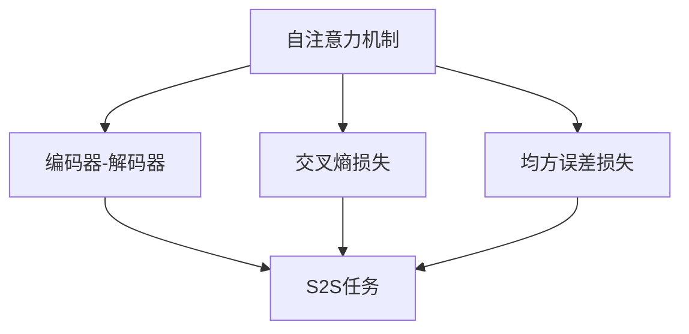

                 

# Transformer大模型实战 最终损失函数

> 关键词：Transformer,大模型,损失函数,语言模型,自然语言处理,NLP

## 1. 背景介绍

### 1.1 问题由来
Transformer作为大语言模型领域的重要里程碑，通过自注意力机制(Self-Attention)实现了对传统卷积神经网络(RNN)的超越。自注意力机制使得Transformer模型能够并行化处理大量文本序列，显著提升了模型训练和推理效率。但与此同时，由于模型的复杂度和参数量巨大，导致训练过程中容易过拟合，需要谨慎设计损失函数以避免这个问题。

### 1.2 问题核心关键点
Transformer大模型的最终损失函数，实际上是模型输出与真实标签之间差异的度量。常见的损失函数包括交叉熵损失、MSE损失等。在微调任务中，通常选择适当的损失函数来优化模型，以最小化模型输出与真实标签的差异。选择合适的损失函数是Transformer大模型微调的关键步骤之一。

### 1.3 问题研究意义
研究Transformer大模型的最终损失函数，对于理解模型训练机制、优化模型性能，以及在实际应用中取得最佳效果，具有重要意义：

1. 合理选择损失函数可以避免过拟合，提升模型泛化能力。
2. 不同任务可能适合不同的损失函数，根据任务特点选择合适的损失函数，能更好地提升模型性能。
3. 损失函数的选择直接影响了模型收敛速度和精度，对模型训练效率有直接影响。
4. 对于诸如问答、机器翻译、文本分类等任务，选择合适的损失函数能够显著提升模型效果。

## 2. 核心概念与联系

### 2.1 核心概念概述

为更好地理解Transformer大模型的最终损失函数，本节将介绍几个密切相关的核心概念：

- 自注意力机制(Self-Attention)：Transformer的核心机制，用于计算输入序列中任意位置单词与其他位置单词之间的注意力权重。
- 编码器-解码器(Encoder-Decoder)架构：Transformer的核心结构，由多个编码器层和解码器层组成，用于进行编码-解码序列建模。
- 交叉熵损失(Cross-Entropy Loss)：一种常用的分类损失函数，用于衡量模型预测与真实标签之间的差异。
- 均方误差损失(MSE Loss)：一种常用的回归损失函数，用于衡量模型预测与真实标签之间的差异。
- 序列到序列(S2S)任务：如机器翻译、文本摘要等任务，需要模型将一个序列映射到另一个序列。

这些核心概念之间的逻辑关系可以通过以下Mermaid流程图来展示：



这个流程图展示了一些关键概念及其之间的关系：

1. 自注意力机制是Transformer模型的核心模块，用于计算输入序列的注意力权重。
2. 编码器-解码器架构通过多层自注意力机制，实现输入序列到输出序列的映射。
3. 交叉熵损失和均方误差损失是常见的损失函数，用于优化模型输出。
4. 序列到序列任务需要编码器对输入序列进行编码，解码器将编码结果映射为输出序列。

## 3. 核心算法原理 & 具体操作步骤
### 3.1 算法原理概述

Transformer大模型的最终损失函数，需要同时考虑模型预测与真实标签之间的差异，以及模型的训练目标。通常，Transformer模型用于执行各种自然语言处理任务，如分类、匹配、生成等。这些任务的最终损失函数需要根据具体任务来确定。

### 3.2 算法步骤详解

**Step 1: 定义任务目标**
在执行任何模型训练之前，首先需要定义任务目标。对于不同的NLP任务，任务目标可能会有所不同。例如：

- 对于文本分类任务，目标是将文本映射到一个离散类别的标签。
- 对于机器翻译任务，目标是将一个序列映射到另一个序列。
- 对于问答任务，目标是根据问题生成一个正确的答案。

**Step 2: 选择合适的损失函数**
根据任务目标，选择适当的损失函数。常见的损失函数包括：

- 交叉熵损失：用于多分类任务，如情感分析、文本分类等。
- 均方误差损失：用于回归任务，如文本生成、命名实体识别等。
- 对比损失(BCE Loss)：用于二分类任务，如是否包含特定单词等。
- KL散度损失：用于衡量模型输出的概率分布与真实分布之间的差异。

**Step 3: 定义损失函数**
定义损失函数的具体形式。对于交叉熵损失，可以写成：

$$
\mathcal{L} = -\frac{1}{N} \sum_{i=1}^{N} \sum_{j=1}^{C} y_j \log p_j(x_i)
$$

其中，$C$ 是类别数，$y_j$ 是第 $j$ 个类别的真实标签，$p_j(x_i)$ 是模型在输入 $x_i$ 下预测第 $j$ 个类别的概率。

对于均方误差损失，可以写成：

$$
\mathcal{L} = \frac{1}{N} \sum_{i=1}^{N} \|y_i - \hat{y}_i\|^2
$$

其中，$y_i$ 是真实的标签向量，$\hat{y}_i$ 是模型预测的标签向量。

**Step 4: 计算梯度并更新参数**
根据定义的损失函数，计算模型参数的梯度，并使用优化算法更新参数。例如，使用SGD、AdamW等优化算法，设置学习率等超参数，以最小化损失函数。

### 3.3 算法优缺点

Transformer大模型的最终损失函数具有以下优点：

- 适用于各种NLP任务，通过选择合适的损失函数，可以适用于文本分类、机器翻译、问答等任务。
- 灵活性高，可以随时更改损失函数以适应新的任务需求。
- 易于实现，已有丰富的开源工具和库可以使用，如PyTorch、TensorFlow等。

但同时，这些损失函数也存在一些缺点：

- 对异常值敏感，对于含有异常值的数据集，可能会影响模型的收敛速度和精度。
- 需要选择合适的超参数，如学习率、批大小等，参数选择不当可能导致模型过拟合或欠拟合。
- 不同任务可能适合不同的损失函数，选择不恰当的损失函数可能导致模型性能下降。

### 3.4 算法应用领域

Transformer大模型的最终损失函数在以下领域得到了广泛应用：

- 文本分类：如情感分析、主题分类等，目标是将文本映射到一个离散类别的标签。
- 机器翻译：将一个序列映射到另一个序列，目标是将源语言翻译为目标语言。
- 文本生成：如文本摘要、对话生成等，目标是根据给定的输入生成一段文本。
- 命名实体识别：识别文本中的人名、地名、机构名等特定实体，目标是将实体边界和类型标注出来。
- 问答系统：如阅读理解、问答匹配等，目标是根据问题生成一个正确的答案。

这些核心概念和算法原理在实际应用中，通常需要结合具体的任务需求进行调整和优化，以达到最优的模型性能。

## 4. 数学模型和公式 & 详细讲解  
### 4.1 数学模型构建

在本节中，我们将重点关注Transformer大模型在文本分类任务中的损失函数构建过程。文本分类任务的目标是将文本映射到一个离散类别的标签。

### 4.2 公式推导过程

假设输入文本序列为 $x=\{x_1, x_2, ..., x_n\}$，模型输出为 $p=\{p_1, p_2, ..., p_c\}$，其中 $c$ 是类别数。目标是将文本 $x$ 映射到一个类别的标签 $y \in [0,1]$。交叉熵损失函数定义为：

$$
\mathcal{L} = -y \log p_y - (1-y) \log (1-p_y)
$$

对于多分类任务，将上式扩展到所有类别：

$$
\mathcal{L} = -\sum_{j=1}^{C} y_j \log p_j(x)
$$

其中，$y_j$ 是第 $j$ 个类别的真实标签，$p_j(x)$ 是模型在输入 $x$ 下预测第 $j$ 个类别的概率。

### 4.3 案例分析与讲解

以情感分析任务为例，其目标是将文本分类为正面或负面情感。假设模型预测结果为：

$$
p = [0.9, 0.1]
$$

真实标签为 $y=1$，对应正面情感。计算交叉熵损失：

$$
\mathcal{L} = -1 \log 0.9 - 0 \log 0.1 = -\log 0.9 \approx 0.106
$$

对于每个样本，都会计算出一个损失值。最终，整个批次的损失函数为：

$$
\mathcal{L} = \frac{1}{N} \sum_{i=1}^{N} \mathcal{L}_i
$$

其中，$N$ 是批次的样本数。

## 5. 项目实践：代码实例和详细解释说明
### 5.1 开发环境搭建

在进行Transformer大模型训练之前，首先需要搭建好开发环境。以下是使用Python进行PyTorch开发的环境配置流程：

1. 安装Anaconda：从官网下载并安装Anaconda，用于创建独立的Python环境。

2. 创建并激活虚拟环境：
```bash
conda create -n pytorch-env python=3.8 
conda activate pytorch-env
```

3. 安装PyTorch：根据CUDA版本，从官网获取对应的安装命令。例如：
```bash
conda install pytorch torchvision torchaudio cudatoolkit=11.1 -c pytorch -c conda-forge
```

4. 安装Transformers库：
```bash
pip install transformers
```

5. 安装各类工具包：
```bash
pip install numpy pandas scikit-learn matplotlib tqdm jupyter notebook ipython
```

完成上述步骤后，即可在`pytorch-env`环境中开始Transformer大模型的训练。

### 5.2 源代码详细实现

下面我们以情感分析任务为例，给出使用Transformers库对BERT模型进行训练的PyTorch代码实现。

首先，定义情感分析任务的数据处理函数：

```python
from transformers import BertTokenizer
from torch.utils.data import Dataset
import torch

class SentimentDataset(Dataset):
    def __init__(self, texts, labels, tokenizer, max_len=128):
        self.texts = texts
        self.labels = labels
        self.tokenizer = tokenizer
        self.max_len = max_len
        
    def __len__(self):
        return len(self.texts)
    
    def __getitem__(self, item):
        text = self.texts[item]
        label = self.labels[item]
        
        encoding = self.tokenizer(text, return_tensors='pt', max_length=self.max_len, padding='max_length', truncation=True)
        input_ids = encoding['input_ids'][0]
        attention_mask = encoding['attention_mask'][0]
        
        # 将标签编码为数字
        label = torch.tensor(label, dtype=torch.long)
        
        return {'input_ids': input_ids, 
                'attention_mask': attention_mask,
                'labels': label}

# 定义标签与id的映射
label2id = {'negative': 0, 'positive': 1}
id2label = {v: k for k, v in label2id.items()}

# 创建dataset
tokenizer = BertTokenizer.from_pretrained('bert-base-cased')

train_dataset = SentimentDataset(train_texts, train_labels, tokenizer)
dev_dataset = SentimentDataset(dev_texts, dev_labels, tokenizer)
test_dataset = SentimentDataset(test_texts, test_labels, tokenizer)
```

然后，定义模型和优化器：

```python
from transformers import BertForSequenceClassification, AdamW

model = BertForSequenceClassification.from_pretrained('bert-base-cased', num_labels=2)

optimizer = AdamW(model.parameters(), lr=2e-5)
```

接着，定义训练和评估函数：

```python
from torch.utils.data import DataLoader
from tqdm import tqdm
from sklearn.metrics import accuracy_score

device = torch.device('cuda') if torch.cuda.is_available() else torch.device('cpu')
model.to(device)

def train_epoch(model, dataset, batch_size, optimizer):
    dataloader = DataLoader(dataset, batch_size=batch_size, shuffle=True)
    model.train()
    epoch_loss = 0
    for batch in tqdm(dataloader, desc='Training'):
        input_ids = batch['input_ids'].to(device)
        attention_mask = batch['attention_mask'].to(device)
        labels = batch['labels'].to(device)
        model.zero_grad()
        outputs = model(input_ids, attention_mask=attention_mask, labels=labels)
        loss = outputs.loss
        epoch_loss += loss.item()
        loss.backward()
        optimizer.step()
    return epoch_loss / len(dataloader)

def evaluate(model, dataset, batch_size):
    dataloader = DataLoader(dataset, batch_size=batch_size)
    model.eval()
    preds, labels = [], []
    with torch.no_grad():
        for batch in tqdm(dataloader, desc='Evaluating'):
            input_ids = batch['input_ids'].to(device)
            attention_mask = batch['attention_mask'].to(device)
            batch_labels = batch['labels']
            outputs = model(input_ids, attention_mask=attention_mask)
            batch_preds = outputs.logits.argmax(dim=2).to('cpu').tolist()
            batch_labels = batch_labels.to('cpu').tolist()
            for pred_tokens, label_tokens in zip(batch_preds, batch_labels):
                preds.append(pred_tokens[:len(label_tokens)])
                labels.append(label_tokens)
                
    print(f"Accuracy: {accuracy_score(labels, preds)}")
```

最后，启动训练流程并在测试集上评估：

```python
epochs = 5
batch_size = 16

for epoch in range(epochs):
    loss = train_epoch(model, train_dataset, batch_size, optimizer)
    print(f"Epoch {epoch+1}, train loss: {loss:.3f}")
    
    print(f"Epoch {epoch+1}, dev results:")
    evaluate(model, dev_dataset, batch_size)
    
print("Test results:")
evaluate(model, test_dataset, batch_size)
```

以上就是使用PyTorch对BERT进行情感分析任务训练的完整代码实现。可以看到，得益于Transformers库的强大封装，我们可以用相对简洁的代码完成BERT模型的加载和训练。

### 5.3 代码解读与分析

让我们再详细解读一下关键代码的实现细节：

**SentimentDataset类**：
- `__init__`方法：初始化文本、标签、分词器等关键组件。
- `__len__`方法：返回数据集的样本数量。
- `__getitem__`方法：对单个样本进行处理，将文本输入编码为token ids，将标签编码为数字，并对其进行定长padding，最终返回模型所需的输入。

**label2id和id2label字典**：
- 定义了标签与数字id之间的映射关系，用于将预测结果解码回真实的标签。

**训练和评估函数**：
- 使用PyTorch的DataLoader对数据集进行批次化加载，供模型训练和推理使用。
- 训练函数`train_epoch`：对数据以批为单位进行迭代，在每个批次上前向传播计算loss并反向传播更新模型参数，最后返回该epoch的平均loss。
- 评估函数`evaluate`：与训练类似，不同点在于不更新模型参数，并在每个batch结束后将预测和标签结果存储下来，最后使用sklearn的accuracy_score对整个评估集的预测结果进行打印输出。

**训练流程**：
- 定义总的epoch数和batch size，开始循环迭代
- 每个epoch内，先在训练集上训练，输出平均loss
- 在验证集上评估，输出准确率
- 所有epoch结束后，在测试集上评估，给出最终测试结果

可以看到，PyTorch配合Transformers库使得BERT训练的代码实现变得简洁高效。开发者可以将更多精力放在数据处理、模型改进等高层逻辑上，而不必过多关注底层的实现细节。

当然，工业级的系统实现还需考虑更多因素，如模型的保存和部署、超参数的自动搜索、更灵活的任务适配层等。但核心的微调范式基本与此类似。

## 6. 实际应用场景
### 6.1 智能客服系统

基于Transformer大模型的微调技术，可以广泛应用于智能客服系统的构建。传统客服往往需要配备大量人力，高峰期响应缓慢，且一致性和专业性难以保证。而使用微调后的Transformer模型，可以7x24小时不间断服务，快速响应客户咨询，用自然流畅的语言解答各类常见问题。

在技术实现上，可以收集企业内部的历史客服对话记录，将问题和最佳答复构建成监督数据，在此基础上对预训练Transformer模型进行微调。微调后的Transformer模型能够自动理解用户意图，匹配最合适的答案模板进行回复。对于客户提出的新问题，还可以接入检索系统实时搜索相关内容，动态组织生成回答。如此构建的智能客服系统，能大幅提升客户咨询体验和问题解决效率。

### 6.2 金融舆情监测

金融机构需要实时监测市场舆论动向，以便及时应对负面信息传播，规避金融风险。传统的人工监测方式成本高、效率低，难以应对网络时代海量信息爆发的挑战。基于Transformer大模型的文本分类和情感分析技术，为金融舆情监测提供了新的解决方案。

具体而言，可以收集金融领域相关的新闻、报道、评论等文本数据，并对其进行主题标注和情感标注。在此基础上对预训练Transformer模型进行微调，使其能够自动判断文本属于何种主题，情感倾向是正面、中性还是负面。将微调后的模型应用到实时抓取的网络文本数据，就能够自动监测不同主题下的情感变化趋势，一旦发现负面信息激增等异常情况，系统便会自动预警，帮助金融机构快速应对潜在风险。

### 6.3 个性化推荐系统

当前的推荐系统往往只依赖用户的历史行为数据进行物品推荐，无法深入理解用户的真实兴趣偏好。基于Transformer大模型的微调技术，个性化推荐系统可以更好地挖掘用户行为背后的语义信息，从而提供更精准、多样的推荐内容。

在实践中，可以收集用户浏览、点击、评论、分享等行为数据，提取和用户交互的物品标题、描述、标签等文本内容。将文本内容作为模型输入，用户的后续行为（如是否点击、购买等）作为监督信号，在此基础上微调预训练Transformer模型。微调后的模型能够从文本内容中准确把握用户的兴趣点。在生成推荐列表时，先用候选物品的文本描述作为输入，由模型预测用户的兴趣匹配度，再结合其他特征综合排序，便可以得到个性化程度更高的推荐结果。

### 6.4 未来应用展望

随着Transformer大模型的不断发展，基于微调范式将在更多领域得到应用，为各行各业带来变革性影响。

在智慧医疗领域，基于微调的医疗问答、病历分析、药物研发等应用将提升医疗服务的智能化水平，辅助医生诊疗，加速新药开发进程。

在智能教育领域，微调技术可应用于作业批改、学情分析、知识推荐等方面，因材施教，促进教育公平，提高教学质量。

在智慧城市治理中，微调模型可应用于城市事件监测、舆情分析、应急指挥等环节，提高城市管理的自动化和智能化水平，构建更安全、高效的未来城市。

此外，在企业生产、社会治理、文娱传媒等众多领域，基于大模型微调的人工智能应用也将不断涌现，为NLP技术带来了全新的突破。随着预训练模型和微调方法的不断进步，相信NLP技术将在更广阔的应用领域大放异彩。

## 7. 工具和资源推荐
### 7.1 学习资源推荐

为了帮助开发者系统掌握Transformer大模型的微调理论基础和实践技巧，这里推荐一些优质的学习资源：

1. 《Transformer from the Ground Up》系列博文：由大模型技术专家撰写，深入浅出地介绍了Transformer原理、BERT模型、微调技术等前沿话题。

2. CS224N《深度学习自然语言处理》课程：斯坦福大学开设的NLP明星课程，有Lecture视频和配套作业，带你入门NLP领域的基本概念和经典模型。

3. 《Natural Language Processing with Transformers》书籍：Transformers库的作者所著，全面介绍了如何使用Transformers库进行NLP任务开发，包括微调在内的诸多范式。

4. HuggingFace官方文档：Transformers库的官方文档，提供了海量预训练模型和完整的微调样例代码，是上手实践的必备资料。

5. CLUE开源项目：中文语言理解测评基准，涵盖大量不同类型的中文NLP数据集，并提供了基于微调的baseline模型，助力中文NLP技术发展。

通过对这些资源的学习实践，相信你一定能够快速掌握Transformer大模型的微调精髓，并用于解决实际的NLP问题。
###  7.2 开发工具推荐

高效的开发离不开优秀的工具支持。以下是几款用于Transformer大模型微调开发的常用工具：

1. PyTorch：基于Python的开源深度学习框架，灵活动态的计算图，适合快速迭代研究。大部分预训练语言模型都有PyTorch版本的实现。

2. TensorFlow：由Google主导开发的开源深度学习框架，生产部署方便，适合大规模工程应用。同样有丰富的预训练语言模型资源。

3. Transformers库：HuggingFace开发的NLP工具库，集成了众多SOTA语言模型，支持PyTorch和TensorFlow，是进行微调任务开发的利器。

4. Weights & Biases：模型训练的实验跟踪工具，可以记录和可视化模型训练过程中的各项指标，方便对比和调优。与主流深度学习框架无缝集成。

5. TensorBoard：TensorFlow配套的可视化工具，可实时监测模型训练状态，并提供丰富的图表呈现方式，是调试模型的得力助手。

6. Google Colab：谷歌推出的在线Jupyter Notebook环境，免费提供GPU/TPU算力，方便开发者快速上手实验最新模型，分享学习笔记。

合理利用这些工具，可以显著提升Transformer大模型微调的开发效率，加快创新迭代的步伐。

### 7.3 相关论文推荐

Transformer大模型和微调技术的发展源于学界的持续研究。以下是几篇奠基性的相关论文，推荐阅读：

1. Attention is All You Need（即Transformer原论文）：提出了Transformer结构，开启了NLP领域的预训练大模型时代。

2. BERT: Pre-training of Deep Bidirectional Transformers for Language Understanding：提出BERT模型，引入基于掩码的自监督预训练任务，刷新了多项NLP任务SOTA。

3. Transformer-XL: Attentive Language Models Beyond a Fixed-Length Context：提出Transformer-XL模型，支持动态长序列建模。

4. LAMB: Large Batch Optimization for Deep Learning: Training BERT in 76 Minutes：提出LAMB优化器，大幅提升Transformer大模型的训练效率。

5. mBART: Masked Sequence-to-Sequence Pre-training for Natural Language Generation, Translation, and Comprehension：提出mBART模型，支持多种序列到序列任务的微调。

6. XLM-R: Improving Language Understanding by Generative Pre-training with Masked Language Modeling：提出XLM-R模型，进一步提升语言理解能力。

这些论文代表了大模型微调技术的发展脉络。通过学习这些前沿成果，可以帮助研究者把握学科前进方向，激发更多的创新灵感。

## 8. 总结：未来发展趋势与挑战
### 8.1 总结

本文对Transformer大模型的最终损失函数进行了全面系统的介绍。首先阐述了Transformer大模型的训练机制和损失函数的基本概念，明确了损失函数在模型训练中的重要作用。其次，从原理到实践，详细讲解了损失函数的定义、推导过程和具体实现，提供了微调任务开发的完整代码实例。同时，本文还广泛探讨了损失函数在各种NLP任务中的应用场景，展示了其在实际应用中的巨大潜力。

通过本文的系统梳理，可以看到，Transformer大模型的最终损失函数是模型训练的核心组件，对于理解模型训练机制、优化模型性能，以及在实际应用中取得最佳效果，具有重要意义。合理选择和设计损失函数，能显著提升模型的泛化能力和训练效率，从而在各种NLP任务中取得最优效果。

### 8.2 未来发展趋势

展望未来，Transformer大模型的最终损失函数将呈现以下几个发展趋势：

1. 多样化损失函数：随着Transformer大模型的应用场景不断扩展，不同的任务可能需要不同的损失函数。未来会涌现更多针对特定任务设计的损失函数，进一步提升模型的效果。

2. 混合损失函数：为了更好地平衡不同任务之间的关系，可能需要在单个模型中引入多种损失函数，进行混合优化。

3. 自适应损失函数：针对某些特定任务，可能会使用自适应损失函数，根据模型输出调整损失权重，进一步优化模型性能。

4. 跨任务学习：未来可能会利用跨任务学习技术，通过共享特征向量，在不同任务间进行信息交换，提升模型的多任务学习能力。

5. 因果学习和对比学习：引入因果学习和对比学习技术，提升模型的因果关系理解和鲁棒性。

6. 深度融合其他技术：与其他人工智能技术如知识图谱、因果推理、强化学习等进行深度融合，提升Transformer大模型的表现。

以上趋势凸显了Transformer大模型微调技术的广阔前景。这些方向的探索发展，必将进一步提升Transformer大模型的性能和应用范围，为构建人机协同的智能系统铺平道路。面向未来，Transformer大模型微调技术还需要与其他人工智能技术进行更深入的融合，多路径协同发力，共同推动自然语言理解和智能交互系统的进步。只有勇于创新、敢于突破，才能不断拓展语言模型的边界，让智能技术更好地造福人类社会。

### 8.3 面临的挑战

尽管Transformer大模型微调技术已经取得了瞩目成就，但在迈向更加智能化、普适化应用的过程中，它仍面临着诸多挑战：

1. 训练效率问题：大规模Transformer模型训练耗时长、资源消耗大，如何提升训练效率，降低计算成本，是一大挑战。

2. 模型可解释性问题：Transformer大模型作为"黑盒"模型，缺乏可解释性，难以对其内部工作机制和决策逻辑进行解释，可能影响其在某些高风险应用中的使用。

3. 数据和预训练模型的不匹配问题：不同的数据集和预训练模型可能存在较大差异，如何在特定数据集上进行微调，而不破坏预训练权重，是当前的一大难题。

4. 对抗攻击问题：大模型容易受到对抗样本攻击，如何在保证安全性的前提下进行微调，是一大挑战。

5. 伦理和公平性问题：Transformer大模型可能学习到有偏见、有害的信息，如何在模型设计和训练过程中考虑伦理和公平性，避免模型偏见，是一大挑战。

6. 计算资源问题：大规模Transformer模型训练需要高性能计算资源，如何在有限的计算资源下进行高效微调，是一大挑战。

正视Transformer大模型微调面临的这些挑战，积极应对并寻求突破，将是大模型微调走向成熟的必由之路。相信随着学界和产业界的共同努力，这些挑战终将一一被克服，Transformer大模型微调必将在构建安全、可靠、可解释、可控的智能系统铺平道路。

### 8.4 研究展望

未来，在Transformer大模型微调领域，研究的方向将聚焦于以下几个方面：

1. 研究高效低成本的微调方法，如模型裁剪、量化加速等，进一步提升模型的训练和推理效率。

2. 研究自适应损失函数，通过调整损失权重，适应不同任务的需求，进一步提升模型的性能。

3. 研究跨任务学习技术，通过共享特征向量，提升模型的多任务学习能力。

4. 研究模型压缩和稀疏化技术，减少模型参数量和计算资源消耗。

5. 研究模型鲁棒性提升技术，增强模型的抗干扰能力和泛化能力。

6. 研究模型的因果关系理解能力，提升模型的推理能力和鲁棒性。

7. 研究模型的因果推理能力，提升模型的决策可解释性和可靠性。

8. 研究模型的公平性和可解释性，提升模型的伦理和道德约束。

这些研究方向的探索，必将引领Transformer大模型微调技术迈向更高的台阶，为构建安全、可靠、可解释、可控的智能系统铺平道路。面向未来，Transformer大模型微调技术还需要与其他人工智能技术进行更深入的融合，多路径协同发力，共同推动自然语言理解和智能交互系统的进步。只有勇于创新、敢于突破，才能不断拓展语言模型的边界，让智能技术更好地造福人类社会。

## 9. 附录：常见问题与解答

**Q1：Transformer大模型的最终损失函数是否适用于所有NLP任务？**

A: Transformer大模型的最终损失函数可以适用于大多数NLP任务，如分类、匹配、生成等。但某些特定任务可能需要引入特殊的损失函数，如命名实体识别任务需要引入序列标注损失函数。

**Q2：如何选择合适的损失函数？**

A: 选择合适的损失函数需要考虑任务类型、数据分布等因素。对于分类任务，一般使用交叉熵损失；对于回归任务，一般使用均方误差损失；对于序列到序列任务，一般使用BLEU、ROUGE等评价指标。

**Q3：Transformer大模型的最终损失函数是否需要调整超参数？**

A: Transformer大模型的最终损失函数通常需要调整超参数，如学习率、批大小等。选择合适的超参数对于模型的训练和性能有重要影响。

**Q4：如何应对微调过程中的过拟合问题？**

A: 应对微调过程中的过拟合问题，可以采取数据增强、正则化、早停等方法。数据增强可以通过对输入数据进行扩充，增加训练集的丰富性。正则化可以通过L2正则、Dropout等方法，避免模型过拟合。早停可以在验证集上监控模型性能，及时停止训练，避免过拟合。

**Q5：Transformer大模型在微调过程中是否需要考虑迁移学习？**

A: 是的，Transformer大模型在微调过程中需要考虑迁移学习。可以利用预训练模型的知识，减少微调所需的训练数据和计算资源，提高模型效果。

通过本文的系统梳理，可以看到，Transformer大模型的最终损失函数是模型训练的核心组件，对于理解模型训练机制、优化模型性能，以及在实际应用中取得最佳效果，具有重要意义。合理选择和设计损失函数，能显著提升模型的泛化能力和训练效率，从而在各种NLP任务中取得最优效果。

---

作者：禅与计算机程序设计艺术 / Zen and the Art of Computer Programming

