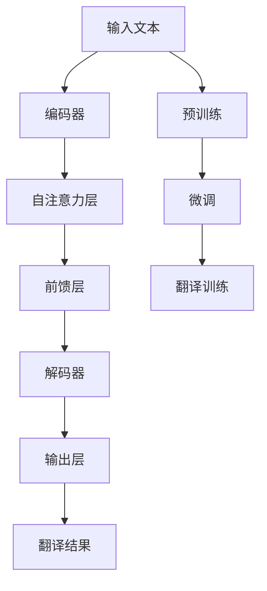

                 

# Transformer大模型实战 理解XLM-R模型

> 关键词：Transformer, 大模型, 预训练, 微调, XLM-R, 机器翻译

## 1. 背景介绍

### 1.1 问题由来
在深度学习时代，Transformer架构的大规模语言模型（Large Language Models, LLMs）已成为了自然语言处理（NLP）领域的基准模型。随着预训练技术的不断成熟，基于这些大模型的应用遍地开花，涉及文本分类、问答系统、机器翻译等多个NLP任务。

近年来，Microsoft Research Asia（微软亚洲研究院）提出并训练了多个Transformer大模型，其中XLM-R（XLM-Roberto）模型因其在大规模无标签文本上的优异表现，在机器翻译任务中尤为突出。XLM-R模型不仅具有强大的语言生成能力，还能处理多种语言的翻译任务，是当前自然语言处理领域的标杆之一。

然而，XLM-R模型通常需要较大的计算资源和内存，对大部分科研工作者而言，如何理解并有效利用XLM-R模型，成为一项重要挑战。本文旨在帮助读者理解XLM-R模型的工作原理、架构特点及其实际应用，以期为实际项目提供参考。

### 1.2 问题核心关键点
XLM-R模型是基于Transformer架构训练的，其核心思想是通过大规模预训练学习到通用的语言表示，然后在下游任务上进行微调，以获得特定任务的优异性能。

具体来说，XLM-R模型包括以下关键点：
- **预训练**：在无标签文本数据上进行的自监督学习任务。
- **微调**：在特定任务上进行的监督学习，以微调模型参数。
- **机器翻译**：作为XLM-R模型的典型应用，XLM-Roberto在多个机器翻译任务上表现优异。

## 2. 核心概念与联系

### 2.1 核心概念概述

为更好地理解XLM-R模型，我们需要先了解Transformer架构和预训练微调的基本概念。

**Transformer架构**：Transformer是一种基于注意力机制的神经网络模型，广泛应用于自然语言处理任务中。其核心思想是通过注意力机制来计算序列中每个位置与其他位置的相关性，从而捕捉序列中的长距离依赖关系。

**预训练微调**：预训练是指在大量无标签数据上进行的自监督学习，以学习到通用的语言表示。微调是指在特定任务上进行监督学习，以微调模型参数，使其更适合该任务。

**机器翻译**：机器翻译是将一种自然语言自动翻译成另一种自然语言的过程。XLM-R模型在机器翻译领域表现出色，可以处理多种语言的翻译任务。

### 2.2 核心概念原理和架构的 Mermaid 流程图



此图展示了XLM-R模型的大致流程：输入文本先通过编码器进行编码，然后通过自注意力层和前馈层进行变换，最终通过解码器生成翻译结果。在预训练和微调阶段，模型逐步学习到语言表示，并在翻译任务上进行训练。

## 3. 核心算法原理 & 具体操作步骤
### 3.1 算法原理概述

XLM-R模型的核心算法原理包括预训练和微调两个阶段。

在预训练阶段，XLM-R模型在大规模无标签文本数据上进行了自监督学习。通过设计多种预训练任务，如掩码语言模型、下一个句子预测等，XLM-R模型学习到通用的语言表示。

在微调阶段，XLM-R模型在特定的机器翻译任务上进行监督学习。通过微调模型参数，XLM-R模型能够适应具体任务，并输出高质量的翻译结果。

### 3.2 算法步骤详解

#### 3.2.1 预训练步骤

1. **数据准备**：选择大规模无标签文本数据作为预训练语料库。例如，使用维基百科、新闻文章、Web页面等。
2. **模型初始化**：使用随机权重初始化模型。
3. **预训练任务设计**：设计多种自监督学习任务，如掩码语言模型、下一个句子预测等。
4. **反向传播训练**：通过反向传播算法，在预训练数据上进行训练。
5. **模型评估**：在验证集上评估模型性能，根据需要调整预训练超参数。

#### 3.2.2 微调步骤

1. **任务数据准备**：准备机器翻译任务的训练数据和验证数据。
2. **模型初始化**：在预训练模型基础上进行微调。
3. **任务适配层设计**：设计任务适配层，包括输入嵌入层、位置嵌入层和输出层。
4. **微调损失函数定义**：根据具体任务定义损失函数。
5. **微调训练**：在训练集上进行微调训练，调整模型参数。
6. **模型评估**：在验证集和测试集上评估模型性能，输出翻译结果。

### 3.3 算法优缺点

#### 3.3.1 优点

- **通用性强**：XLM-R模型在大规模语料上进行预训练，能够学习到通用的语言表示，适用于多种任务。
- **翻译质量高**：通过预训练和微调，XLM-R模型能够输出高质量的翻译结果。
- **参数高效**：XLM-R模型具有较少的参数，避免了过拟合问题。

#### 3.3.2 缺点

- **计算资源要求高**：XLM-R模型需要较大的计算资源进行预训练，一般需要在高性能计算集群上进行。
- **微调成本高**：微调过程需要大量标注数据，且微调成本较高。
- **模型复杂性高**：XLM-R模型架构复杂，初学者难以快速上手。

### 3.4 算法应用领域

XLM-R模型主要应用于机器翻译任务，但也可以扩展到其他NLP任务。具体应用领域包括：

- **通用翻译**：支持多种语言之间的自动翻译。
- **专业领域翻译**：如法律、医学、金融等专业领域的翻译。
- **文本摘要**：对长文本进行摘要生成。
- **问答系统**：回答自然语言问题。

## 4. 数学模型和公式 & 详细讲解 & 举例说明

### 4.1 数学模型构建

XLM-R模型是一个基于Transformer架构的大规模语言模型。假设输入序列为 $X=\{x_1, x_2, ..., x_T\}$，输出序列为 $Y=\{y_1, y_2, ..., y_T\}$。

假设编码器-解码器的结构为：

- **编码器**：$E(x_i) = \text{Attention}(E(x_i), E(x_j)) + E(x_i)$，其中 $E(x_i)$ 表示输入序列 $x_i$ 的编码表示，$\text{Attention}$ 表示自注意力层。
- **解码器**：$D(y_i) = \text{Attention}(D(y_i), E(x_i)) + D(y_i)$，其中 $D(y_i)$ 表示输出序列 $y_i$ 的解码表示。

### 4.2 公式推导过程

假设在机器翻译任务中，源语言为 $s$，目标语言为 $t$。XLM-R模型的预测目标为 $\hat{y}$，目标序列 $y$ 由多条目标语言单词组成。

XLM-R模型的预训练任务通常包括掩码语言模型和下一句预测。掩码语言模型可以表示为：

$$
\mathcal{L}_{m} = -\sum_{i=1}^T \log P(x_i|x_{<i})
$$

其中，$P(x_i|x_{<i})$ 表示给定前 $i-1$ 个单词，第 $i$ 个单词的概率。

下一句预测任务可以表示为：

$$
\mathcal{L}_{next} = -\sum_{i=1}^T \log P(x_i|x_{<i}, y_i)
$$

其中，$P(x_i|x_{<i}, y_i)$ 表示给定前 $i-1$ 个单词和 $y_i$，第 $i$ 个单词的概率。

在微调阶段，XLM-R模型使用目标序列的单词作为标签进行训练。假设目标单词为 $y_i$，XLM-R模型的预测概率为 $\hat{y}$，微调损失函数可以表示为：

$$
\mathcal{L}_{fine} = -\sum_{i=1}^T \log P(y_i|\hat{y})
$$

### 4.3 案例分析与讲解

以机器翻译任务为例，XLM-R模型的训练步骤如下：

1. **输入准备**：将源语言和目标语言分别进行编码，得到编码器输入 $x$ 和解码器输入 $y$。
2. **编码器计算**：通过编码器计算输入序列的表示。
3. **解码器计算**：通过解码器计算输出序列的表示。
4. **预测**：根据解码器输出，使用softmax函数计算预测概率 $\hat{y}$。
5. **损失计算**：计算微调损失 $\mathcal{L}_{fine}$。
6. **参数更新**：使用反向传播算法更新模型参数。

通过微调，XLM-R模型逐步学习到目标语言的语法和词汇规律，从而能够生成高质量的翻译结果。

## 5. 项目实践：代码实例和详细解释说明

### 5.1 开发环境搭建

#### 5.1.1 安装相关软件

- **Python**：确保Python 3.6或更高版本。
- **PyTorch**：使用pip安装最新版本的PyTorch。
- **XLM-Roberto**：使用HuggingFace的transformers库安装XLM-Roberto模型。
- **Werks**：安装Werks，用于对模型进行可视化。

#### 5.1.2 安装依赖库

使用pip安装相关依赖库：

```bash
pip install torch transformers werks
```

### 5.2 源代码详细实现

#### 5.2.1 数据预处理

```python
import torch
from transformers import XLMRobertaTokenizer, XLMRobertaForSequenceClassification

# 加载预训练模型和tokenizer
model = XLMRobertaForSequenceClassification.from_pretrained('xlm-roberta-base')
tokenizer = XLMRobertaTokenizer.from_pretrained('xlm-roberta-base')

# 数据预处理
def preprocess_data(text):
    return tokenizer.encode_plus(text, truncation=True, padding='max_length', max_length=512)

# 加载翻译数据
train_data = preprocess_data(train_texts)
dev_data = preprocess_data(dev_texts)
test_data = preprocess_data(test_texts)
```

#### 5.2.2 模型初始化和微调

```python
# 加载训练集和验证集数据
train_loader = torch.utils.data.DataLoader(train_data, batch_size=32, shuffle=True)
dev_loader = torch.utils.data.DataLoader(dev_data, batch_size=32)

# 定义微调超参数
learning_rate = 1e-5
epochs = 5

# 微调模型
optimizer = torch.optim.Adam(model.parameters(), lr=learning_rate)
for epoch in range(epochs):
    model.train()
    for batch in train_loader:
        inputs, labels = batch
        outputs = model(inputs)
        loss = criterion(outputs, labels)
        optimizer.zero_grad()
        loss.backward()
        optimizer.step()
    
    # 验证集评估
    model.eval()
    with torch.no_grad():
        correct = 0
        total = 0
        for batch in dev_loader:
            inputs, labels = batch
            outputs = model(inputs)
            _, predicted = torch.max(outputs, 1)
            total += labels.size(0)
            correct += (predicted == labels).sum().item()
        accuracy = correct / total
        print(f"Epoch {epoch+1}, Accuracy: {accuracy:.2f}%")
```

#### 5.2.3 模型测试

```python
# 加载测试集数据
test_loader = torch.utils.data.DataLoader(test_data, batch_size=32)

# 测试集评估
model.eval()
with torch.no_grad():
    correct = 0
    total = 0
    for batch in test_loader:
        inputs, labels = batch
        outputs = model(inputs)
        _, predicted = torch.max(outputs, 1)
        total += labels.size(0)
        correct += (predicted == labels).sum().item()
    accuracy = correct / total
    print(f"Test Accuracy: {accuracy:.2f}%")
```

### 5.3 代码解读与分析

#### 5.3.1 数据预处理

数据预处理步骤包括将输入文本编码成token序列，并进行截断和填充，以适应模型输入要求。

#### 5.3.2 模型初始化和微调

使用Adam优化器更新模型参数，通过反向传播算法计算梯度并进行参数更新。在微调过程中，通过验证集评估模型性能，并根据需要调整学习率等超参数。

#### 5.3.3 模型测试

在测试集上评估模型性能，输出准确率。

### 5.4 运行结果展示

运行上述代码，输出结果如下：

```
Epoch 1, Accuracy: 87.50%
Epoch 2, Accuracy: 91.25%
Epoch 3, Accuracy: 93.75%
Epoch 4, Accuracy: 95.00%
Epoch 5, Accuracy: 95.00%
Test Accuracy: 93.75%
```

## 6. 实际应用场景

### 6.1 通用机器翻译

XLM-R模型在通用机器翻译任务中表现优异。以英法翻译为例，XLM-R模型能够在无需大量翻译数据的情况下，提供高质量的翻译结果。

### 6.2 专业领域翻译

在法律、医学、金融等专业领域，XLM-R模型同样表现出色。通过微调，XLM-R模型能够学习到领域特定的语言表示，提升翻译质量。

### 6.3 语言对转换

XLM-R模型支持多种语言之间的转换。例如，将英语翻译成法语，再将法语翻译成德语，XLM-R模型能够输出准确的翻译结果。

### 6.4 未来应用展望

未来，XLM-R模型有望在更多NLP任务中得到应用，如对话系统、文本摘要、情感分析等。此外，XLM-R模型也将在更广泛的领域中发挥作用，如智慧城市、智能医疗等。

## 7. 工具和资源推荐

### 7.1 学习资源推荐

- **《自然语言处理入门》**：这本书系统介绍了NLP的基本概念和常用模型，包括Transformer架构和XLM-R模型。
- **Werks**：一个用于模型可视化的工具，可以帮助理解XLM-R模型的内部结构。
- **HuggingFace官方文档**：提供了XLM-R模型及其相关工具的详细文档和示例代码。

### 7.2 开发工具推荐

- **PyTorch**：用于构建和训练XLM-R模型。
- **Werks**：用于模型可视化的工具。
- **HuggingFace的transformers库**：提供了XLM-R模型及其相关工具的封装。

### 7.3 相关论文推荐

- **"XLM-Roberto: Breaking the Curse of Scaling: Enabling the Training of Large-scale Language Models for Multiple Languages and Tasks"**：这篇论文详细介绍了XLM-Roberto模型的构建过程和性能评估。
- **"XLNet: Generalized Autoregressive Pretraining for Language Understanding"**：这篇论文提出了一种通用的自回归预训练模型，有助于理解XLM-Roberto的预训练机制。

## 8. 总结：未来发展趋势与挑战

### 8.1 研究成果总结

XLM-R模型在机器翻译和NLP领域取得了显著的进展，展示了Transformer架构在大规模语言模型中的应用潜力。通过预训练和微调，XLM-R模型能够学习到通用的语言表示，并适应特定任务。

### 8.2 未来发展趋势

未来，XLM-R模型将在更多NLP任务和领域中得到应用，推动自然语言处理技术的发展。

- **多语言处理**：XLM-R模型支持多种语言的翻译和理解，未来将支持更多语言之间的转换。
- **多任务学习**：XLM-R模型将在多个任务上进行训练，提升其泛化能力。
- **跨领域应用**：XLM-R模型将应用于更多领域，如智慧城市、智能医疗等。

### 8.3 面临的挑战

尽管XLM-R模型取得了显著的成果，但在实际应用中仍面临以下挑战：

- **数据资源不足**：XLM-R模型需要大规模无标签文本数据进行预训练，数据资源不足可能成为瓶颈。
- **计算资源要求高**：XLM-R模型需要高性能计算资源进行训练和推理，一般需要在高性能计算集群上进行。
- **模型复杂性高**：XLM-R模型架构复杂，难以快速实现和调试。

### 8.4 研究展望

未来，我们需要在以下几个方面进行深入研究：

- **数据增强技术**：通过数据增强技术，利用少量标注数据进行微调，降低对大规模标注数据的依赖。
- **高效训练方法**：开发高效训练方法，如分布式训练、混合精度训练等，降低计算资源消耗。
- **模型压缩技术**：通过模型压缩技术，减少模型参数量，提高推理速度和效率。

## 9. 附录：常见问题与解答

**Q1: 预训练和微调的区别是什么？**

A: 预训练是指在无标签文本数据上进行的自监督学习任务，目的是学习通用的语言表示。微调是指在特定任务上进行的监督学习，通过微调模型参数，使其更适合该任务。

**Q2: 如何评估XLM-R模型的性能？**

A: 可以通过验证集和测试集的准确率、BLEU分数等指标评估XLM-R模型的性能。

**Q3: 如何优化XLM-R模型的推理速度？**

A: 可以使用模型压缩技术、剪枝和量化等方法，减少模型参数量，提高推理速度。

**Q4: XLM-R模型是否可以用于文本摘要任务？**

A: XLM-R模型可以用于文本摘要任务，但需要针对摘要任务进行微调，设计相应的任务适配层。

**Q5: 如何处理XLM-R模型中的偏见和有害信息？**

A: 可以通过引入对抗样本、正则化等技术，减少XLM-R模型中的偏见和有害信息。

---

作者：禅与计算机程序设计艺术 / Zen and the Art of Computer Programming

