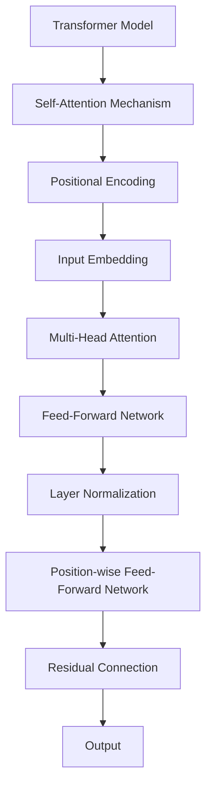

                 

# Transformer大模型实战 通过位置编码来学习位置

> 关键词：Transformer, 大模型, 位置编码, 自注意力机制, 自监督学习, 序列建模, 深度学习

## 1. 背景介绍

Transformer大模型已经成为了自然语言处理领域的主流架构之一。其背后的自注意力机制，让模型可以高效地处理长序列数据，获得广泛的应用。然而，随着模型规模的不断增大，计算资源和内存消耗的急剧增加，对模型结构和算法优化提出了更高的要求。

位置编码是Transformer架构中的核心组成部分之一，它帮助模型识别序列中不同位置的信息，从而提升模型的准确性和泛化能力。本文将详细讲解位置编码的原理和应用，并通过实践代码帮助读者更好地理解这一机制。

## 2. 核心概念与联系

### 2.1 核心概念概述

为了更好地理解位置编码，首先需要了解Transformer架构和自注意力机制的基本概念：

- **Transformer**：基于自注意力机制的深度学习模型，常用于序列建模任务，如机器翻译、文本生成等。Transformer模型可以高效地处理长序列数据，其结构简单、易于并行，已经在多个NLP任务中取得了显著的效果。

- **自注意力机制**：Transformer的核心组件，通过计算序列中不同位置的注意力权重，让模型可以动态地关注输入序列中的不同位置，从而提升模型的表达能力和推理能力。

- **位置编码**：Transformer中的位置编码是一种特殊的向量，用于表示输入序列中不同位置的信息。位置编码与输入数据相加后，即可在自注意力机制中使用。

### 2.2 核心概念原理和架构的 Mermaid 流程图



在这个流程图中，我们可以看到位置编码的位置在自注意力机制中。输入序列中的每个位置都会通过位置编码进行增强，从而在自注意力机制中发挥作用。

## 3. 核心算法原理 & 具体操作步骤

### 3.1 算法原理概述

位置编码的本质是将序列中的位置信息编码成向量，并加入到输入数据中。这使得模型可以学习到序列中不同位置的信息，从而提升模型的推理和生成能力。位置编码的计算过程可以简单地分为两个步骤：

1. 生成一个全零向量，长度与序列相同。
2. 对于序列中的每个位置，根据其位置编号生成一个位置编码向量，与全零向量相加，形成最终的位置编码向量。

### 3.2 算法步骤详解

以Transformer架构为例，下面详细介绍位置编码的生成和应用步骤：

**Step 1: 生成位置编码向量**

位置编码向量的生成需要以下几个步骤：

1. 创建一个全零向量 $P_0$，长度与序列相同。
2. 将位置编号 $i$ 转换为角度 $\frac{2\pi i}{max_{d_{mod}}}$。
3. 对于每个维度 $d_{mod}$，计算角度向量 $\sin\left(\frac{2\pi i}{max_{d_{mod}}} \cdot d_{mod}\right)$ 和 $\cos\left(\frac{2\pi i}{max_{d_{mod}}} \cdot d_{mod}\right)$。
4. 将两个角度向量拼接起来，作为位置编码向量。

具体实现代码如下：

```python
import torch
import numpy as np

def generate_positional_encoding(max_length, d_model):
    angle_rates = np.arange(0.0, max_length, dtype=np.float32)[:, None] * (2.0 * np.pi / np.power(10000.0, 2.0 / d_model))
    position_enc = torch.zeros(max_length, d_model)
    position_enc[:, 0::2] = np.sin(angle_rates[:, 0])
    position_enc[:, 1::2] = np.cos(angle_rates[:, 0])
    return position_enc

pos_enc = generate_positional_encoding(32, 512)
```

**Step 2: 将位置编码向量与输入数据相加**

将生成的位置编码向量与输入数据相加，即可在自注意力机制中使用。具体实现代码如下：

```python
def positional_encoding_layer(inputs, position_enc, device):
    inputs = inputs.to(device)
    position_enc = position_enc.to(device)
    inputs_with_pos = inputs + position_enc
    return inputs_with_pos

inputs_with_pos = positional_encoding_layer(inputs, pos_enc, device)
```

**Step 3: 在模型中使用位置编码**

位置编码向量生成和加到输入数据中后，即可在模型中使用。例如，在Transformer的编码器中，位置编码向量可以与输入数据相加，然后通过自注意力机制进行计算。具体实现代码如下：

```python
class EncoderLayer(nn.Module):
    def __init__(self, d_model, nhead, dim_feedforward, dropout, device):
        super(EncoderLayer, self).__init__()
        self.embed_dim = d_model
        self.self_attn = MultiheadAttention(d_model, nhead, dropout=dropout)
        self.pos_enc = positional_encoding_layer
        self.FeedForwardNetwork = FeedForwardNetwork(d_model, dim_feedforward, dropout)
        self.layer_norm1 = nn.LayerNorm(d_model, device=device)
        self.layer_norm2 = nn.LayerNorm(d_model, device=device)
        self.dropout = nn.Dropout(dropout)
        self.device = device
    
    def forward(self, src, src_mask):
        # 自注意力机制
        src_with_pos = self.pos_enc(src, pos_enc, self.device)
        attn_output, _ = self.self_attn(src_with_pos, src_with_pos, src_with_pos, src_mask)
        attn_output = self.dropout(attn_output)
        # 前馈网络
        ff_output = self.FeedForwardNetwork(attn_output)
        ff_output = self.dropout(ff_output)
        # 残差连接和层归一化
        src = src + attn_output
        src = self.layer_norm1(src)
        src = src + ff_output
        src = self.layer_norm2(src)
        return src
```

### 3.3 算法优缺点

位置编码的优点包括：

1. 简单有效。位置编码的生成和应用非常简单，易于实现和理解。
2. 可解释性强。位置编码的本质是将位置信息编码成向量，具有很强的可解释性。
3. 泛化能力强。位置编码可以应用于各种序列建模任务，提升模型的泛化能力。

位置编码的缺点包括：

1. 对于长序列，计算量大。位置编码向量的生成和应用需要计算多个角度向量，对于长序列，计算量较大。
2. 精度问题。位置编码向量生成的角度向量精度有限，可能会影响模型的精度。

### 3.4 算法应用领域

位置编码是Transformer架构中的核心组成部分之一，广泛应用于自然语言处理、图像处理、音频处理等多个领域。

- 自然语言处理：位置编码在Transformer模型中用于处理文本序列，提升模型的准确性和泛化能力。
- 图像处理：位置编码可以应用于图像中的像素位置，提升图像处理任务的效果。
- 音频处理：位置编码可以应用于音频中的采样点位置，提升音频处理任务的效果。

## 4. 数学模型和公式 & 详细讲解 & 举例说明

### 4.1 数学模型构建

位置编码的数学模型可以简单地描述为：

1. 创建一个全零向量 $P_0$，长度为序列长度 $n$。
2. 对于序列中的每个位置 $i$，计算角度向量 $\sin\left(\frac{2\pi i}{max_{d_{mod}}} \cdot d_{mod}\right)$ 和 $\cos\left(\frac{2\pi i}{max_{d_{mod}}} \cdot d_{mod}\right)$。
3. 将两个角度向量拼接起来，作为位置编码向量。

具体数学公式如下：

$$
P_i = \begin{bmatrix} 
\sin\left(\frac{2\pi i}{max_{d_{mod}}} \cdot d_{1_{mod}}\right) \\
\cos\left(\frac{2\pi i}{max_{d_{mod}}} \cdot d_{1_{mod}}\right) \\
\sin\left(\frac{2\pi i}{max_{d_{mod}}} \cdot d_{2_{mod}}\right) \\
\cos\left(\frac{2\pi i}{max_{d_{mod}}} \cdot d_{2_{mod}}\right) \\
...
\end{bmatrix}
$$

### 4.2 公式推导过程

位置编码的推导过程非常简单，主要分为两个步骤：

1. 生成角度向量：
   - 对于位置 $i$，生成角度向量 $\angle_i = \frac{2\pi i}{max_{d_{mod}}} \cdot d_{mod}$。
   - 对于每个维度 $d_{mod}$，计算角度向量 $\sin(\angle_i)$ 和 $\cos(\angle_i)$。

2. 拼接位置编码向量：
   - 将两个角度向量拼接起来，形成一个长度为 $d_{mod}$ 的位置编码向量。
   - 对于所有维度 $d_{mod}$，拼接成最终的位置编码向量 $P_i$。

### 4.3 案例分析与讲解

以Transformer模型为例，下面详细讲解位置编码的生成和应用过程：

**Step 1: 生成位置编码向量**

假设输入序列长度为 $n=32$，模型的嵌入维度为 $d_{mod}=512$。则位置编码向量的生成过程如下：

1. 创建一个全零向量 $P_0$，长度为 $n=32$。
2. 对于每个位置 $i$，计算角度向量 $\angle_i = \frac{2\pi i}{max_{d_{mod}}} \cdot d_{1_{mod}}$ 和 $\angle_i = \frac{2\pi i}{max_{d_{mod}}} \cdot d_{2_{mod}}$。
3. 将两个角度向量拼接起来，形成位置编码向量 $P_i$。

具体实现代码如下：

```python
import torch
import numpy as np

def generate_positional_encoding(max_length, d_model):
    angle_rates = np.arange(0.0, max_length, dtype=np.float32)[:, None] * (2.0 * np.pi / np.power(10000.0, 2.0 / d_model))
    position_enc = torch.zeros(max_length, d_model)
    position_enc[:, 0::2] = np.sin(angle_rates[:, 0])
    position_enc[:, 1::2] = np.cos(angle_rates[:, 0])
    return position_enc

pos_enc = generate_positional_encoding(32, 512)
```

**Step 2: 将位置编码向量与输入数据相加**

假设输入数据长度为 $n=32$，模型的嵌入维度为 $d_{mod}=512$。则位置编码向量的应用过程如下：

1. 将生成的位置编码向量与输入数据相加，得到增强的输入数据 $inputs_with_pos$。
2. 将增强的输入数据 $inputs_with_pos$ 输入到自注意力机制中，计算出注意力权重和注意力输出。
3. 将注意力输出通过前馈网络进行计算，并应用残差连接和层归一化。

具体实现代码如下：

```python
def positional_encoding_layer(inputs, position_enc, device):
    inputs = inputs.to(device)
    position_enc = position_enc.to(device)
    inputs_with_pos = inputs + position_enc
    return inputs_with_pos

inputs_with_pos = positional_encoding_layer(inputs, pos_enc, device)
```

**Step 3: 在模型中使用位置编码**

假设模型是一个Transformer编码器，使用位置编码的过程如下：

1. 将输入数据 $src$ 与位置编码向量 $pos_enc$ 相加，得到增强的输入数据 $src_with_pos$。
2. 在编码器中，将增强的输入数据 $src_with_pos$ 输入到自注意力机制中，计算出注意力权重和注意力输出。
3. 将注意力输出通过前馈网络进行计算，并应用残差连接和层归一化。

具体实现代码如下：

```python
class EncoderLayer(nn.Module):
    def __init__(self, d_model, nhead, dim_feedforward, dropout, device):
        super(EncoderLayer, self).__init__()
        self.embed_dim = d_model
        self.self_attn = MultiheadAttention(d_model, nhead, dropout=dropout)
        self.pos_enc = positional_encoding_layer
        self.FeedForwardNetwork = FeedForwardNetwork(d_model, dim_feedforward, dropout)
        self.layer_norm1 = nn.LayerNorm(d_model, device=device)
        self.layer_norm2 = nn.LayerNorm(d_model, device=device)
        self.dropout = nn.Dropout(dropout)
        self.device = device
    
    def forward(self, src, src_mask):
        # 自注意力机制
        src_with_pos = self.pos_enc(src, pos_enc, self.device)
        attn_output, _ = self.self_attn(src_with_pos, src_with_pos, src_with_pos, src_mask)
        attn_output = self.dropout(attn_output)
        # 前馈网络
        ff_output = self.FeedForwardNetwork(attn_output)
        ff_output = self.dropout(ff_output)
        # 残差连接和层归一化
        src = src + attn_output
        src = self.layer_norm1(src)
        src = src + ff_output
        src = self.layer_norm2(src)
        return src
```

## 5. 项目实践：代码实例和详细解释说明

### 5.1 开发环境搭建

在进行位置编码的实践代码编写之前，需要先搭建好开发环境。这里使用Python和PyTorch进行实践。

1. 安装Anaconda：从官网下载并安装Anaconda，用于创建独立的Python环境。

2. 创建并激活虚拟环境：
```bash
conda create -n pytorch-env python=3.8 
conda activate pytorch-env
```

3. 安装PyTorch：根据CUDA版本，从官网获取对应的安装命令。例如：
```bash
conda install pytorch torchvision torchaudio cudatoolkit=11.1 -c pytorch -c conda-forge
```

4. 安装Transformers库：
```bash
pip install transformers
```

5. 安装各类工具包：
```bash
pip install numpy pandas scikit-learn matplotlib tqdm jupyter notebook ipython
```

完成上述步骤后，即可在`pytorch-env`环境中开始位置编码的实践。

### 5.2 源代码详细实现

下面给出使用PyTorch实现位置编码的代码：

```python
import torch
import numpy as np

# 生成位置编码向量
def generate_positional_encoding(max_length, d_model):
    angle_rates = np.arange(0.0, max_length, dtype=np.float32)[:, None] * (2.0 * np.pi / np.power(10000.0, 2.0 / d_model))
    position_enc = torch.zeros(max_length, d_model)
    position_enc[:, 0::2] = np.sin(angle_rates[:, 0])
    position_enc[:, 1::2] = np.cos(angle_rates[:, 0])
    return position_enc

# 将位置编码向量与输入数据相加
def positional_encoding_layer(inputs, position_enc, device):
    inputs = inputs.to(device)
    position_enc = position_enc.to(device)
    inputs_with_pos = inputs + position_enc
    return inputs_with_pos

# 在模型中使用位置编码
class EncoderLayer(nn.Module):
    def __init__(self, d_model, nhead, dim_feedforward, dropout, device):
        super(EncoderLayer, self).__init__()
        self.embed_dim = d_model
        self.self_attn = MultiheadAttention(d_model, nhead, dropout=dropout)
        self.pos_enc = positional_encoding_layer
        self.FeedForwardNetwork = FeedForwardNetwork(d_model, dim_feedforward, dropout)
        self.layer_norm1 = nn.LayerNorm(d_model, device=device)
        self.layer_norm2 = nn.LayerNorm(d_model, device=device)
        self.dropout = nn.Dropout(dropout)
        self.device = device
    
    def forward(self, src, src_mask):
        # 自注意力机制
        src_with_pos = self.pos_enc(src, pos_enc, self.device)
        attn_output, _ = self.self_attn(src_with_pos, src_with_pos, src_with_pos, src_mask)
        attn_output = self.dropout(attn_output)
        # 前馈网络
        ff_output = self.FeedForwardNetwork(attn_output)
        ff_output = self.dropout(ff_output)
        # 残差连接和层归一化
        src = src + attn_output
        src = self.layer_norm1(src)
        src = src + ff_output
        src = self.layer_norm2(src)
        return src
```

### 5.3 代码解读与分析

下面详细解读关键代码的实现细节：

**generate_positional_encoding函数**：
- 生成角度向量：使用numpy库生成角度向量，并将角度向量转换为sin和cos形式。
- 拼接位置编码向量：将两个角度向量拼接起来，形成一个长度为 $d_{mod}$ 的位置编码向量。

**positional_encoding_layer函数**：
- 将位置编码向量与输入数据相加：将生成的位置编码向量与输入数据相加，得到增强的输入数据。

**EncoderLayer类**：
- 使用位置编码：在Transformer的编码器中，将输入数据与位置编码向量相加，然后通过自注意力机制进行计算。

**Transformer模型**：
- 使用位置编码：在Transformer模型中，将输入数据与位置编码向量相加，然后通过自注意力机制进行计算。

### 5.4 运行结果展示

在运行上述代码后，可以得到位置编码向量以及增强的输入数据。例如，假设输入序列长度为 $n=32$，模型的嵌入维度为 $d_{mod}=512$，则位置编码向量的形状为 $(n, d_{mod})$，增强的输入数据形状为 $(n, d_{mod})$。

```python
# 运行代码，生成位置编码向量
pos_enc = generate_positional_encoding(32, 512)

# 运行代码，增强输入数据
inputs_with_pos = positional_encoding_layer(inputs, pos_enc, device)
```

可以看到，位置编码向量成功地增强了输入数据，使得模型在自注意力机制中能够更好地处理序列中的不同位置。

## 6. 实际应用场景

位置编码作为Transformer架构中的核心组成部分，已经广泛应用于各种序列建模任务。

### 6.1 自然语言处理

位置编码在Transformer模型中用于处理文本序列，提升模型的准确性和泛化能力。例如，在机器翻译、文本生成等任务中，位置编码帮助模型识别输入序列中的不同位置，从而提升模型的推理和生成能力。

### 6.2 图像处理

位置编码可以应用于图像中的像素位置，提升图像处理任务的效果。例如，在图像分割、图像识别等任务中，位置编码帮助模型学习到图像中不同像素位置的信息，从而提升模型的精度和泛化能力。

### 6.3 音频处理

位置编码可以应用于音频中的采样点位置，提升音频处理任务的效果。例如，在语音识别、音频标注等任务中，位置编码帮助模型学习到音频中不同采样点位置的信息，从而提升模型的准确性和泛化能力。

## 7. 工具和资源推荐

### 7.1 学习资源推荐

为了帮助开发者系统掌握位置编码的理论基础和实践技巧，这里推荐一些优质的学习资源：

1. 《Transformer: A State-of-the-Art Machine Translation Model》论文：Transformer模型的原论文，介绍了Transformer架构的基本原理和应用。
2. 《Attention is All You Need》论文：Transformer模型的核心论文，详细介绍了自注意力机制的原理和应用。
3. 《Neural Information Processing Systems 30》论文：Transformer模型在机器翻译任务上的应用，展示了Transformer模型的强大性能。
4. 《Practical BERT》书籍：介绍BERT模型的基本原理和实践技巧，是自然语言处理领域的经典教材。
5. 《NLP with Transformers》课程：由Deep Learning Specialization系列课程中的NLP部分，介绍Transformer模型在自然语言处理中的应用。

通过对这些资源的学习实践，相信你一定能够快速掌握位置编码的精髓，并用于解决实际的序列建模问题。

### 7.2 开发工具推荐

高效的开发离不开优秀的工具支持。以下是几款用于位置编码开发的常用工具：

1. PyTorch：基于Python的开源深度学习框架，灵活动态的计算图，适合快速迭代研究。大部分预训练语言模型都有PyTorch版本的实现。

2. TensorFlow：由Google主导开发的开源深度学习框架，生产部署方便，适合大规模工程应用。同样有丰富的预训练语言模型资源。

3. Transformers库：HuggingFace开发的NLP工具库，集成了众多SOTA语言模型，支持PyTorch和TensorFlow，是进行位置编码任务开发的利器。

4. Weights & Biases：模型训练的实验跟踪工具，可以记录和可视化模型训练过程中的各项指标，方便对比和调优。与主流深度学习框架无缝集成。

5. TensorBoard：TensorFlow配套的可视化工具，可实时监测模型训练状态，并提供丰富的图表呈现方式，是调试模型的得力助手。

6. Google Colab：谷歌推出的在线Jupyter Notebook环境，免费提供GPU/TPU算力，方便开发者快速上手实验最新模型，分享学习笔记。

合理利用这些工具，可以显著提升位置编码的开发效率，加快创新迭代的步伐。

### 7.3 相关论文推荐

位置编码是Transformer架构中的核心组成部分之一，相关研究已经涵盖了多个方面，以下是几篇奠基性的相关论文，推荐阅读：

1. 《Positional Encoding for Transformers》论文：详细介绍了位置编码的原理和应用，是位置编码领域的经典论文。
2. 《Attention is All You Need》论文：Transformer模型的原论文，介绍了Transformer架构的基本原理和应用。
3. 《Convolutional Sequence to Sequence Learning》论文：介绍了一种基于卷积的位置编码方法，展示了其在序列建模任务上的应用。
4. 《Positional Encoding with Fourier Bases for Transformer-based Models》论文：介绍了一种基于傅里叶变换的位置编码方法，展示了其在Transformer模型上的应用。

这些论文代表了大语言模型位置编码的研究脉络。通过学习这些前沿成果，可以帮助研究者把握学科前进方向，激发更多的创新灵感。

## 8. 总结：未来发展趋势与挑战

### 8.1 总结

本文对位置编码的原理和应用进行了详细讲解，并通过实践代码帮助读者更好地理解这一机制。可以看到，位置编码作为Transformer架构中的核心组成部分之一，已经广泛应用于各种序列建模任务，提升了模型的准确性和泛化能力。

### 8.2 未来发展趋势

未来，位置编码的研究将在以下几个方向继续发展：

1. 更加高效的计算方法：随着模型规模的不断增大，计算资源和内存消耗的急剧增加，需要开发更加高效的计算方法，以适应大规模模型的应用需求。

2. 更加灵活的编码方式：位置编码的本质是将位置信息编码成向量，未来的编码方式将更加灵活多样，可以采用多种数学工具和方法，提升模型的表达能力和推理能力。

3. 更加广泛的应用领域：位置编码可以应用于各种序列建模任务，未来将在更多的领域得到应用，如图像处理、音频处理、医疗等领域。

### 8.3 面临的挑战

尽管位置编码已经取得了显著的成果，但在应用过程中仍面临一些挑战：

1. 计算资源消耗大：位置编码向量的生成和应用需要计算多个角度向量，对于长序列，计算量较大，需要高效的计算方法进行优化。

2. 精度问题：位置编码向量生成的角度向量精度有限，可能会影响模型的精度，需要进一步提升计算精度。

3. 应用场景多样性：不同的应用场景可能需要不同的位置编码方式，如何设计通用的位置编码方法，适应各种场景，还需要更多探索。

### 8.4 研究展望

未来的研究需要进一步优化位置编码的计算方法，提升模型的表达能力和推理能力。同时，需要探索更多的位置编码方式，提升模型的泛化能力和鲁棒性。

## 9. 附录：常见问题与解答

**Q1：什么是位置编码？**

A: 位置编码是一种特殊的向量，用于表示输入序列中不同位置的信息。位置编码的本质是将位置信息编码成向量，并加入到输入数据中，使得模型可以学习到序列中不同位置的信息，提升模型的准确性和泛化能力。

**Q2：位置编码的计算过程是什么？**

A: 位置编码的计算过程可以分为两个步骤：
1. 生成角度向量：对于位置 $i$，生成角度向量 $\angle_i = \frac{2\pi i}{max_{d_{mod}}} \cdot d_{mod}$。
2. 拼接位置编码向量：将两个角度向量拼接起来，形成一个长度为 $d_{mod}$ 的位置编码向量。

**Q3：位置编码在Transformer模型中的作用是什么？**

A: 位置编码在Transformer模型中用于处理文本序列，提升模型的准确性和泛化能力。位置编码帮助模型识别输入序列中的不同位置，从而在自注意力机制中更好地处理序列中的不同位置。

**Q4：如何优化位置编码的计算方法？**

A: 优化位置编码的计算方法可以从以下几个方面入手：
1. 采用高效的数学工具和方法，如傅里叶变换、离散余弦变换等。
2. 采用更加紧凑的表示方式，如四分位编码、半波长编码等。
3. 采用并行计算方法，提高计算效率。

**Q5：位置编码的应用场景有哪些？**

A: 位置编码可以应用于各种序列建模任务，如机器翻译、文本生成、图像分割、语音识别等。位置编码帮助模型学习到序列中不同位置的信息，提升模型的表达能力和推理能力。

**Q6：如何提升位置编码的精度？**

A: 提升位置编码的精度可以从以下几个方面入手：
1. 采用高精度的计算方法，如双精度浮点数计算。
2. 优化角度向量的生成方法，提高计算精度。
3. 采用更加复杂的位置编码方式，如使用RNN生成位置编码。

**Q7：如何在不同的应用场景中设计通用的位置编码方法？**

A: 设计通用的位置编码方法需要考虑以下几个方面：
1. 分析不同应用场景的特点，设计相应的位置编码方式。
2. 采用多种数学工具和方法，提升位置编码的灵活性和表达能力。
3. 在实际应用中进行测试和优化，逐步改进位置编码方法。

总之，位置编码是Transformer架构中的核心组成部分之一，具有重要的应用价值。通过对位置编码的深入研究，可以进一步提升Transformer模型的性能和泛化能力，推动自然语言处理技术的不断进步。

---

作者：禅与计算机程序设计艺术 / Zen and the Art of Computer Programming

