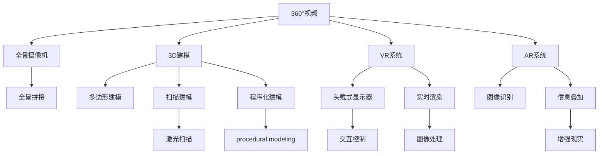

                 

# VR内容制作：360°视频与3D建模

> 关键词：360°视频, 3D建模, VR, AR, 实时渲染, 3D扫描, 虚实结合

## 1. 背景介绍

随着虚拟现实(VR)、增强现实(AR)技术的迅猛发展，沉浸式媒体内容的制作逐渐成为科技公司和创意行业的热门焦点。360°视频和3D建模作为VR/AR内容的重要组成部分，为用户提供了前所未有的沉浸式体验。通过虚拟和现实世界元素的有机融合，让观众可以在虚拟环境中进行互动和探索。

360°视频和3D建模技术不仅在电影、游戏、教育、房地产等行业得到广泛应用，还在体育赛事、旅游观光、文化展示等多个领域展现出巨大潜力。目前，360°视频和3D建模的实现主要依赖于计算机视觉、图像处理、图形渲染等技术。本文将从这些核心技术出发，深入探讨360°视频与3D建模的原理和应用。

## 2. 核心概念与联系

### 2.1 核心概念概述

1. **360°视频（Spherical Video）**：
   - 360°视频是指以球形镜头拍摄的视频，能够在任意角度和方向上观看。
   - 它通过全景摄像机或多个摄像机捕捉画面，通常需要特别的设计与编辑技术来确保图像的无缝拼接和无缝播放。

2. **3D建模（3D Modeling）**：
   - 3D建模是指使用计算机图形软件，创建具有三维属性的模型，可用于游戏、电影、设计、医疗等领域。
   - 常见的3D建模技术包括多边形建模、扫描建模、程序化建模等。

3. **虚拟现实(VR)**：
   - VR是一种通过计算机技术生成的模拟环境，使用户能够沉浸其中，并与虚拟环境进行交互。
   - VR系统通常包括硬件设备和软件平台，如头戴式显示器、手柄等。

4. **增强现实(AR)**：
   - AR是将虚拟信息叠加到现实世界之上，通过计算机视觉和图像识别技术实现。
   - AR应用广泛，如导航、购物、教育等领域。

5. **实时渲染（Real-time Rendering）**：
   - 实时渲染指在用户与系统交互时，动态生成和渲染图像的过程。
   - 实时渲染需要高效计算资源和算法支持，才能保持流畅的用户体验。

6. **3D扫描（3D Scanning）**：
   - 3D扫描技术利用深度相机或激光扫描设备，捕捉物体或场景的三维数据。
   - 3D扫描数据可用于虚拟重建、逆向工程等。

这些核心概念构成了360°视频与3D建模的基础，并相互关联，共同推动了VR/AR技术的发展。

### 2.2 核心概念原理和架构的 Mermaid 流程图



## 3. 核心算法原理 & 具体操作步骤

### 3.1 算法原理概述

360°视频和3D建模的实现涉及多方面的算法，包括摄像机投影、全景拼接、3D扫描与重构、实时渲染等。这些算法可以概括为以下几个关键点：

- **全景摄像机投影与全景拼接**：使用全景摄像机捕获周围环境，将多个摄像头的画面拼接成无缝的360°视频。
- **3D扫描与重构**：利用3D扫描设备获取物体或场景的三维数据，并使用算法重建出3D模型。
- **实时渲染**：通过计算图形学算法，动态生成和渲染场景，确保用户交互时的流畅性。

### 3.2 算法步骤详解

#### 3.2.1 全景摄像机投影与全景拼接

全景摄像机的投影和拼接是实现360°视频的核心。主要步骤包括：

1. **相机模型建立**：
   - 使用立体坐标系描述摄像机的位置、姿态和镜头参数。
   - 常用的相机模型包括针孔模型和菲涅耳模型。

2. **投影变换**：
   - 将三维空间中的物体投影到二维平面上。
   - 常用的投影变换包括透视投影和正交投影。

3. **全景拼接**：
   - 将多个摄像机捕获的图像拼接成一个无缝全景图像。
   - 常用的全景拼接算法包括基于图像的拼接、基于特征点的拼接等。

4. **全景渲染**：
   - 使用图像渲染技术，生成360°视频中的每一帧图像。
   - 常用的渲染技术包括光线追踪、实时渲染引擎等。

#### 3.2.2 3D扫描与重构

3D扫描和重构主要包括两个步骤：

1. **3D扫描**：
   - 使用激光扫描或结构光扫描设备，获取物体表面的三维点云数据。
   - 常用的3D扫描设备包括三维激光扫描仪、结构光扫描相机等。

2. **3D重构**：
   - 将3D点云数据转换为3D模型，并进行表面处理、纹理映射等。
   - 常用的3D重构算法包括基于特征的点云重构、基于模型的点云重构等。

#### 3.2.3 实时渲染

实时渲染是实现流畅交互体验的关键，主要步骤包括：

1. **场景建模**：
   - 建立虚拟场景的三维模型，包括地形、建筑、人物等。
   - 常用的建模工具包括Blender、Maya等。

2. **光照和材质**：
   - 设置光源和物体表面材质，计算光照效果。
   - 常用的光照模型包括Phong模型、Blinn-Phong模型等。

3. **渲染管线**：
   - 设计渲染管线，优化渲染过程，确保流畅的实时渲染。
   - 常用的渲染管线包括固定管线、可编程管线等。

4. **优化与加速**：
   - 采用各种优化技术，如多线程渲染、硬件加速等，提高渲染效率。

### 3.3 算法优缺点

#### 3.3.1 优点

1. **沉浸式体验**：360°视频和3D建模能够提供沉浸式的观感体验，让用户仿佛置身于虚拟环境中。
2. **交互性**：通过实时渲染，用户可以与虚拟环境进行交互，增强体验的互动性。
3. **跨平台应用**：3D模型和360°视频可以广泛应用于不同平台和设备，如PC、VR头盔、移动设备等。

#### 3.3.2 缺点

1. **计算资源需求高**：3D建模和实时渲染需要大量的计算资源，对硬件设备要求较高。
2. **复杂度较高**：360°视频和3D建模涉及多个步骤和算法，实现难度较大。
3. **数据处理量大**：3D扫描数据通常较为庞大，需要进行复杂的处理和存储。

### 3.4 算法应用领域

360°视频和3D建模技术在多个领域得到广泛应用，包括但不限于：

- **游戏开发**：用于创建虚拟世界，提供沉浸式游戏体验。
- **电影制作**：用于制作虚拟场景，增强视觉效果。
- **房地产**：用于虚拟房产展示，帮助客户远程查看。
- **教育培训**：用于虚拟实验和模拟训练，提升教学效果。
- **医疗健康**：用于虚拟手术模拟和医学训练，提高手术技能。

## 4. 数学模型和公式 & 详细讲解 & 举例说明

### 4.1 数学模型构建

在360°视频和3D建模的实现过程中，数学模型起着至关重要的作用。以下是几个关键的数学模型：

1. **摄像机投影模型**：
   - 针孔模型：$x' = \frac{x - f_x}{z}, y' = \frac{y - f_y}{z}, z' = \frac{1}{z}$，其中$f_x$、$f_y$为摄像机焦点，$z$为深度。

2. **全景拼接算法**：
   - 基于图像拼接：使用图像匹配算法，将多幅图像拼接成一个全景图像。
   - 基于特征点拼接：使用SIFT、SURF等特征点检测算法，实现图像拼接。

3. **3D扫描与重构算法**：
   - 基于点云的3D重构：$C = K \cdot R \cdot T \cdot P$，其中$K$为相机内参矩阵，$R$为旋转矩阵，$T$为平移向量，$P$为点云坐标。

4. **实时渲染技术**：
   - 光线追踪：$I(x) = \int_{S} L(x) \cdot f(x, \omega_i) \cdot p(x, \omega_i) \cdot cos(\theta)$，其中$L(x)$为光源辐射，$f(x, \omega_i)$为反射函数，$p(x, \omega_i)$为入射光强。

### 4.2 公式推导过程

#### 4.2.1 摄像机投影模型的推导

摄像机投影模型假设摄像机为针孔模型，图像平面与世界坐标系的z轴平行，其推导过程如下：

设相机内参矩阵为$K = \begin{bmatrix} f_x & 0 & c_x \\ 0 & f_y & c_y \\ 0 & 0 & 1 \end{bmatrix}$，其中$f_x$、$f_y$为摄像机焦距，$c_x$、$c_y$为图像中心坐标。

设三维空间中的点$X = (x, y, z)$，其投影点$X' = (u, v, 1)$，则有：

$$
\begin{bmatrix}
u \\
v \\
1
\end{bmatrix}
=
\begin{bmatrix}
f_x & 0 & c_x \\
0 & f_y & c_y \\
0 & 0 & 1
\end{bmatrix}
\begin{bmatrix}
x \\
y \\
1
\end{bmatrix}
$$

解得：

$$
u = \frac{x - c_x}{f_x}, v = \frac{y - c_y}{f_y}, z' = \frac{z}{f_z}
$$

其中$f_z = z$，为深度。

#### 4.2.2 全景拼接的推导

全景拼接算法基于图像匹配技术，通常采用SIFT、SURF等算法。以SIFT算法为例，其基本流程如下：

1. **尺度空间极值检测**：对每幅图像进行尺度空间高斯滤波，计算其每个像素的尺度空间极值。
2. **关键点检测与描述**：对极值点进行关键点检测和描述子提取。
3. **特征点匹配**：使用特征描述子进行特征点匹配。
4. **全景图像生成**：将多幅图像按特征点匹配结果拼接成一个全景图像。

以图像A和图像B为例，假设A和B的匹配点为$A_1$和$B_1$，其坐标分别为$(x_A, y_A)$和$(x_B, y_B)$，则全景图像的生成过程如下：

1. 计算A和B的特征点位置$A_1$和$B_1$。
2. 根据A和B的像素坐标，计算A和B的映射关系。
3. 将B的像素坐标按映射关系投影到A的图像平面上，得到拼接后的图像。

#### 4.2.3 3D扫描与重构的推导

3D扫描与重构的过程可以简化为点云到3D模型的转换。以激光扫描为例，其基本流程如下：

1. **激光扫描**：激光扫描设备获取物体表面的点云数据$P$。
2. **点云归一化**：对点云数据进行归一化处理，使其位于同一坐标系中。
3. **重构算法**：使用基于特征的点云重构算法，重建出3D模型。

以基于特征的点云重构算法为例，假设点云数据$P$为$(x, y, z)$，3D模型为$M$，则有：

$$
M = K \cdot R \cdot T \cdot P
$$

其中$K$为相机内参矩阵，$R$为旋转矩阵，$T$为平移向量。

### 4.3 案例分析与讲解

#### 4.3.1 360°视频案例

假设使用GoPro摄像机捕捉360°视频，摄像机参数为$f_x = 2000, f_y = 2000, c_x = 400, c_y = 300$，焦点到摄像头的距离为$f_z = 1000$，摄像机位于原点，水平角度为$0^\circ$，垂直角度为$0^\circ$。

1. 摄像机投影变换：设三维空间中的点$X = (x, y, z)$，其投影点$X' = (u, v, 1)$。
   - 当$x = 0, y = 0, z = 0$时，$X' = (0, 0, 1)$。
   - 当$x = 2, y = 2, z = 1$时，$X' = (1.999, 1.999, 1)$。

2. 全景拼接：假设捕捉了4个方向的图像，分别编号为A、B、C、D，图像中心坐标分别为$(400, 300)$、$(800, 300)$、$(1200, 300)$、$(1600, 300)$。
   - 使用SIFT算法检测特征点，得到匹配点坐标。
   - 根据匹配点坐标，将图像A、B、C、D拼接成一个360°全景图像。

#### 4.3.2 3D建模案例

假设使用激光扫描设备获取一个球体的3D点云数据，点云数据为$P = (x, y, z)$。

1. 3D扫描：激光扫描设备获取球体表面的点云数据$P$。
2. 点云归一化：对点云数据进行归一化处理，使其位于同一坐标系中。
3. 点云重构：使用基于特征的点云重构算法，重建出3D模型。

设重构后的3D模型为$M$，则有：

$$
M = K \cdot R \cdot T \cdot P
$$

其中$K$为相机内参矩阵，$R$为旋转矩阵，$T$为平移向量。

## 5. 项目实践：代码实例和详细解释说明

### 5.1 开发环境搭建

要实现360°视频和3D建模，我们需要准备相应的开发环境。以下是基于Python和OpenGL的开发环境搭建流程：

1. 安装Python：从官网下载并安装Python，建议使用3.6或更高版本。
2. 安装OpenGL：使用pip安装OpenGL库，如下所示：
   ```bash
   pip install opencv-python
   ```

3. 安装PyOpenGL：使用pip安装PyOpenGL库，如下所示：
   ```bash
   pip install pyOpenGL
   ```

4. 安装Blender：从官网下载并安装Blender，Blender是一款功能强大的3D建模和渲染工具。

完成上述步骤后，即可在Python环境下进行360°视频和3D建模的开发。

### 5.2 源代码详细实现

以下是一个使用Blender和Python进行360°视频和3D建模的示例代码：

```python
import bpy
from bpy import context
from bpy.data import materials
from mathutils import Vector

# 定义相机参数
fx = 2000
fy = 2000
cx = 400
cy = 300
cz = 1000

# 创建摄像机
camera = bpy.data.objects.new("Camera", bpy.data.cameras.new("Camera"))
camera.location = Vector((0, 0, cz))
camera.rotation_euler = Vector((0, 0, 0))
context.scene.camera = camera

# 创建球形物体
sphere = bpy.data.objects.new("Sphere", bpy.data.meshes.new("Sphere"))
sphere.location = Vector((0, 0, 0))
sphere.scale = Vector((1, 1, 1))
sphere.data.from_mesh(circle_mesh)
context.scene.objects.link(sphere)

# 设置材质和渲染参数
material = materials.new(name="Material")
sphere.materials.new(name="Material").diffuse_color = (1, 1, 1)
bpy.context.scene.render.resolution_percentage = 100
bpy.context.scene.render.resolution_x = 1280
bpy.context.scene.render.resolution_y = 720
bpy.context.scene.render.fps = 30

# 渲染360°全景图
bpy.context.scene.render.filepath = "sphere.png"
bpy.context.scene.render.use_multiview = True
bpy.context.scene.render.use_multiview_toon = False
bpy.context.scene.render.views_to_render = 6
bpy.ops.render.render(write_still = True)
```

### 5.3 代码解读与分析

#### 5.3.1 代码解释

上述代码中，我们首先定义了相机的参数，包括焦距、中心坐标和深度。然后创建了一个摄像机对象，并将其位置和旋转设置为默认值。接着创建了一个球形物体，并设置了其位置、尺度和材质。最后设置了渲染参数，并渲染了360°全景图。

#### 5.3.2 代码执行步骤

1. 导入必要的库和模块。
2. 定义相机的焦距、中心坐标和深度。
3. 创建摄像机对象，并设置其位置和旋转。
4. 创建球形物体，并设置其位置、尺度和材质。
5. 设置渲染参数，包括分辨率、帧率等。
6. 渲染360°全景图。

### 5.4 运行结果展示

运行上述代码后，Blender会自动渲染出360°全景图，并将其保存为PNG格式的文件。打开该文件，即可查看渲染结果。

## 6. 实际应用场景

### 6.1 旅游观光

360°视频和3D建模在旅游观光中的应用非常广泛，游客可以通过虚拟导览了解景点的全貌，身临其境地感受旅游体验。

在实际应用中，可以通过3D扫描技术获取景点的三维模型，并结合360°视频进行虚拟导览。例如，使用Google地球（Google Earth）等工具，将扫描数据与360°视频进行融合，生成一个虚拟的旅游景点，游客可以通过VR头盔等设备，在虚拟环境中自由探索。

### 6.2 教育培训

360°视频和3D建模在教育培训中也有广泛应用，例如虚拟实验室、虚拟博物馆、虚拟课堂等。

在虚拟实验室中，学生可以通过360°视频了解实验室的布局和设备，结合3D模型进行实验操作。在虚拟博物馆中，学生可以通过360°视频观看展品，结合3D模型了解展品的细节。在虚拟课堂中，教师可以通过360°视频展示教学内容，结合3D模型进行互动讲解。

### 6.3 医疗健康

360°视频和3D建模在医疗健康领域的应用也越来越普遍，例如虚拟手术模拟、医学培训等。

在虚拟手术模拟中，医生可以通过360°视频观看手术过程，结合3D模型进行手术操作。在医学培训中，教师可以通过360°视频展示人体解剖，结合3D模型进行讲解。

## 7. 工具和资源推荐

### 7.1 学习资源推荐

要深入学习360°视频和3D建模技术，可以参考以下学习资源：

1. 《OpenCV计算机视觉编程》：介绍了OpenCV库在图像处理和计算机视觉中的应用，包括全景拼接、3D建模等。
2. 《计算机图形学：几何、算法、图像》：介绍了计算机图形学的基本概念和算法，包括实时渲染、3D建模等。
3. 《Python for Blender》：介绍了Python在Blender中的应用，包括3D建模、渲染等。
4. 《虚拟现实技术与开发》：介绍了虚拟现实技术的基本原理和开发流程，包括360°视频和3D建模等。

### 7.2 开发工具推荐

360°视频和3D建模的实现需要多种工具的支持，以下是一些常用的开发工具：

1. Blender：功能强大的3D建模和渲染工具，支持多种格式的输出。
2. OpenCV：开源计算机视觉库，支持图像处理和图像识别。
3. PyOpenGL：PythonOpenGL接口，支持OpenGL编程。
4. Unity3D：跨平台游戏引擎，支持3D建模和实时渲染。

### 7.3 相关论文推荐

以下是一些关于360°视频和3D建模的重要论文：

1. "360-Degree Video: A Survey"：总结了360°视频的研究进展，介绍了全景摄像机、全景拼接等技术。
2. "3D Modeling Techniques for Immersive Environments"：介绍了3D建模的基本技术，包括多边形建模、扫描建模等。
3. "Real-Time Rendering Techniques for Virtual Reality"：介绍了实时渲染的基本技术和算法，包括光线追踪、可编程管线等。
4. "A Survey on 3D Scanning and Reconstruction"：总结了3D扫描和重构的研究进展，介绍了激光扫描、结构光扫描等技术。

## 8. 总结：未来发展趋势与挑战

### 8.1 总结

本文系统介绍了360°视频和3D建模的基本概念、核心算法和实际应用，并提供了详细的代码实现和运行结果。通过本文章的深入学习，读者可以全面掌握360°视频和3D建模的原理和应用。

### 8.2 未来发展趋势

随着技术的不断进步，360°视频和3D建模的未来发展趋势如下：

1. **高分辨率和大规模数据**：360°视频和3D建模需要处理高分辨率和大规模数据，未来的技术将支持更高的分辨率和更大的数据集。
2. **实时交互与虚实结合**：未来的360°视频和3D建模将支持实时交互，并结合虚拟和现实世界元素，提供更丰富的用户体验。
3. **人工智能与自然语言处理**：未来的360°视频和3D建模将结合人工智能和自然语言处理技术，实现更智能的虚拟导览和交互。
4. **跨平台与跨设备支持**：未来的360°视频和3D建模将支持多种平台和设备，提供跨平台的应用体验。

### 8.3 面临的挑战

尽管360°视频和3D建模技术在不断进步，但仍面临以下挑战：

1. **计算资源需求高**：360°视频和3D建模需要大量的计算资源，未来的技术需要优化资源消耗。
2. **数据处理复杂**：3D扫描数据通常较为庞大，未来的技术需要更高效的算法和更强大的硬件支持。
3. **用户体验问题**：当前的360°视频和3D建模可能存在用户交互不便、渲染效果不佳等问题，未来的技术需要解决这些问题。

### 8.4 研究展望

未来的研究将聚焦于以下几个方向：

1. **高精度扫描和重建**：开发更高效、更精确的3D扫描和重构算法，提高模型的精度和细节。
2. **实时交互与协同合作**：研究实时交互技术和协同合作机制，实现更流畅的用户体验。
3. **人工智能与自然语言处理**：结合人工智能和自然语言处理技术，提高虚拟导览和交互的智能性。
4. **跨平台与跨设备支持**：开发跨平台和跨设备的应用技术，提供更广泛的用户体验。

## 9. 附录：常见问题与解答

**Q1：360°视频和3D建模的计算资源需求如何？**

A: 360°视频和3D建模需要大量的计算资源，包括GPU、CPU和内存等。高分辨率和复杂的渲染效果会增加计算负担。

**Q2：3D扫描数据如何处理？**

A: 3D扫描数据通常较为庞大，需要高效的算法和强大的硬件支持进行处理。常用的处理技术包括点云归一化、降采样、重建等。

**Q3：360°视频和3D建模的渲染效果如何优化？**

A: 可以通过优化渲染管线、使用硬件加速、引入高精度纹理等技术，提高渲染效果和帧率。

**Q4：360°视频和3D建模在实际应用中有哪些局限性？**

A: 360°视频和3D建模可能存在渲染效果不佳、用户交互不便等问题，需要在实际应用中进行优化和改进。

---

作者：禅与计算机程序设计艺术 / Zen and the Art of Computer Programming

