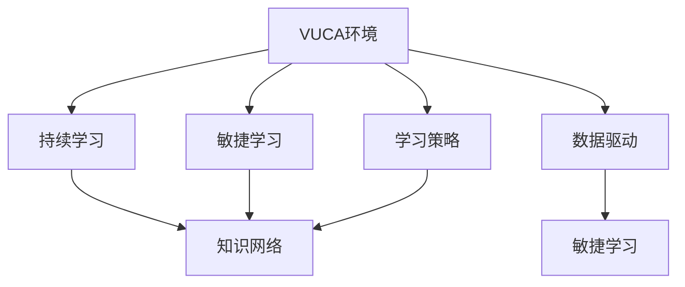

                 

# VUCA时代的学习策略

## 1. 背景介绍

### 1.1 问题由来
在VUCA（Volatility、Uncertainty、Complexity、Ambiguity）时代的背景下，技术的快速发展、市场的快速变化、竞争的加剧和信息的爆炸，使得企业和社会面临前所未有的不确定性和挑战。在这样的大环境下，如何适应变革，把握机遇，实现持续发展和创新，是每一个组织和个人都必须要面对的问题。

### 1.2 问题核心关键点
这个问题的核心关键点在于，如何在动荡不定的环境中找到持续学习的动力和方法，以及如何将学习策略与企业战略、个人发展相结合，实现有效的知识应用和创新。

### 1.3 问题研究意义
本文聚焦于VUCA时代的学习策略，旨在帮助企业和个人在快速变化的环境中，通过系统化的学习方法和策略，增强适应能力，提升竞争力，实现持续发展。

## 2. 核心概念与联系

### 2.1 核心概念概述

为更好地理解VUCA时代的学习策略，本节将介绍几个密切相关的核心概念：

- **VUCA环境**：即Volatility、Uncertainty、Complexity、Ambiguity的缩写，指代快速变化、不确定性、复杂性和模糊性。
- **持续学习(Lifelong Learning)**：在VUCA环境下，个人和组织需要持续不断地学习新知识，以应对环境和市场的变化。
- **敏捷学习(Agile Learning)**：指在短时间内快速获取、应用和共享知识的能力。
- **知识网络(Knowledge Network)**：由个人、团队、组织组成的知识共享和协作网络，促进知识的流动和创新。
- **学习策略(Learning Strategy)**：指为达成学习目标而采取的一系列行动计划和方法，包括目标设定、资源配置、行动方案等。
- **数据驱动(Led by Data)**：在VUCA环境中，通过数据来驱动决策和学习，提升学习和创新的效率。

这些核心概念之间的逻辑关系可以通过以下Mermaid流程图来展示：



这个流程图展示了大环境与学习策略之间的内在联系：

1. 在VUCA环境中，持续学习和敏捷学习变得尤为重要。
2. 知识网络是支持持续学习和敏捷学习的重要基础设施。
3. 学习策略是指导持续学习、敏捷学习、知识网络建设等行为的行动计划。
4. 数据驱动是VUCA环境中学习和决策的重要工具。

这些概念共同构成了VUCA时代学习策略的理论基础，指导着个人和组织在快速变化的环境中的学习和适应过程。

## 3. 核心算法原理 & 具体操作步骤
### 3.1 算法原理概述

在VUCA时代，持续学习和敏捷学习成为了应对环境变化的有效手段。其核心思想是通过系统化的学习和适应，快速掌握新知识、新技能，以保持竞争力和创新能力。

在VUCA环境下，学习和适应需要解决以下三个关键问题：

1. **知识获取的效率**：如何快速获取并掌握新知识。
2. **知识应用的准确性**：如何将新知识有效应用到实际工作中。
3. **知识创新的持续性**：如何在新旧知识之间建立有效的连接，实现知识的持续创新。

因此，VUCA时代的学习策略可以概括为：**高效获取、准确应用、持续创新**。

### 3.2 算法步骤详解

VUCA时代的学习策略主要包括以下几个步骤：

**Step 1: 目标设定与需求分析**
- 明确学习目标：设定具体的学习目标，如提升某项技能、掌握某领域知识、解决某个具体问题等。
- 分析学习需求：评估现有知识与目标之间的差距，确定需要学习的关键内容。

**Step 2: 选择合适的学习资源**
- 选择合适的学习平台和工具：如Coursera、edX、Udacity等在线教育平台，或GitHub、Stack Overflow等知识共享社区。
- 确定学习内容：根据需求选择适合的学习内容，如课程、书籍、论文、视频等。

**Step 3: 制定学习计划**
- 制定学习时间表：合理安排学习时间，确保能够持续跟进。
- 分解学习任务：将大的学习目标分解为小的学习任务，逐一完成。

**Step 4: 实施学习与实践**
- 系统化学习：通过系统的课程学习、阅读书籍、观看视频等方式，掌握基础知识和技能。
- 实践应用：通过实际项目、模拟场景、小组讨论等方式，将所学知识应用到实际工作中。

**Step 5: 反馈与调整**
- 定期反馈：通过自我评估、他人反馈等方式，评估学习效果和应用效果。
- 持续改进：根据反馈结果调整学习策略和实践方法，不断优化学习过程。

**Step 6: 知识共享与创新**
- 建立知识网络：加入专业社群，与他人分享学习心得和实践经验，构建知识网络。
- 促进知识创新：在知识网络中交流观点，合作解决问题，激发新的创新点。

### 3.3 算法优缺点

VUCA时代的学习策略具有以下优点：
1. **灵活适应**：在快速变化的环境中，能够迅速调整学习策略和目标，适应新环境。
2. **持续提升**：通过持续学习和反馈调整，不断提升个人和组织的能力。
3. **促进创新**：在知识网络中不断交流和协作，激发新的创意和解决方案。

同时，该策略也存在一定的局限性：
1. **资源投入**：需要投入大量时间和精力进行系统化学习，对学习者的时间和精力要求较高。
2. **实践机会有限**：特别是在实践中，可能需要特定的资源和环境支持，有时难以找到合适的实践机会。
3. **知识碎片化**：在快速获取知识的过程中，可能导致知识结构分散，难以形成系统的知识体系。

尽管存在这些局限性，但就目前而言，VUCA时代的学习策略仍然是最有效的应对方法之一。未来相关研究的重点在于如何进一步降低学习成本，提高学习效率，同时兼顾知识深度和广度等因素。

### 3.4 算法应用领域

VUCA时代的学习策略已经广泛应用于各个领域，包括但不限于：

- **企业培训与发展**：通过系统化的学习计划和知识网络，提升员工的专业能力和协作效率。
- **个人职业发展**：通过持续学习和技能提升，适应职业变化和市场竞争。
- **教育与学术研究**：通过跨学科的学习和知识创新，推动教育质量和学术研究的进步。
- **技术创新与应用**：通过敏捷学习和知识网络，加速技术创新和应用落地。
- **社会治理与公共服务**：通过持续学习和知识共享，提升社会治理和公共服务能力。

## 4. 数学模型和公式 & 详细讲解 & 举例说明

### 4.1 数学模型构建

为了更好地理解VUCA时代的学习策略，本节将介绍一个简单的数学模型，用于描述学习过程和效果。

设 $L_t$ 为在时间 $t$ 时刻学习者的知识水平，$k_t$ 为在时间 $t$ 时刻学习者获取的知识量，$u_t$ 为学习者在时间 $t$ 时刻对知识的理解深度，则学习者知识水平的变化可以表示为：

$$
L_{t+1} = L_t + k_t \cdot f(u_t)
$$

其中 $f(u_t)$ 表示知识量的效用函数，取决于知识理解的深度 $u_t$。通常情况下，$f(u_t)$ 可以是一个简单的线性函数，表示知识理解的深度越高，知识的效用越大。

### 4.2 公式推导过程

为了简化问题，我们假设效用函数 $f(u_t)$ 为：

$$
f(u_t) = u_t / (1 + u_t)
$$

这是一个常用的知识效用函数，表示知识理解的深度越高，知识的效用越大。

在时间 $t$ 时刻，学习者获取的知识量 $k_t$ 取决于学习活动的时间 $T$、学习效率 $e$ 和学习者当前的知识点 $L_{t-1}$。假设学习活动的时间为 $T$，学习效率为 $e$，则有：

$$
k_t = e \cdot T
$$

将 $k_t$ 代入知识水平变化公式，得：

$$
L_{t+1} = L_t + \frac{e \cdot T}{1 + u_t} \cdot u_t
$$

为了进一步简化问题，我们假设学习者通过系统化学习，知识理解的深度 $u_t$ 与知识水平 $L_t$ 成正比，即：

$$
u_t = c \cdot L_t
$$

其中 $c$ 为一个比例系数。将 $u_t$ 代入公式，得：

$$
L_{t+1} = L_t + \frac{e \cdot T}{1 + c \cdot L_t} \cdot c \cdot L_t
$$

这就是一个简化的VUCA时代学习策略的数学模型，用于描述学习过程和效果。

### 4.3 案例分析与讲解

假设学习者初始知识水平 $L_0=0$，学习时间 $T=2$ 小时，学习效率 $e=1$，比例系数 $c=0.5$，则学习者在第 $t=1$ 和 $t=2$ 时刻的知识水平变化如下：

- 在第 $t=1$ 时刻，学习者获取的知识量为 $k_1 = e \cdot T = 2$，知识理解的深度 $u_1 = c \cdot L_0 = 0$，知识水平变化为：
  $$
  L_1 = L_0 + \frac{2}{1 + 0} \cdot 0.5 \cdot 0 = 1
  $$
- 在第 $t=2$ 时刻，学习者获取的知识量为 $k_2 = e \cdot T = 2$，知识理解的深度 $u_2 = c \cdot L_1 = 0.5 \cdot 1 = 0.5$，知识水平变化为：
  $$
  L_2 = L_1 + \frac{2}{1 + 0.5} \cdot 0.5 \cdot 1 = 1.2
  $$

通过这个简化的模型，我们可以看到，在VUCA时代，通过系统化的学习和知识应用，学习者的知识水平能够快速提升，并且随着知识理解的深入，知识效用逐渐增大，促进了学习者的持续发展和创新。

## 5. 项目实践：代码实例和详细解释说明
### 5.1 开发环境搭建

在进行VUCA时代的学习策略实践前，我们需要准备好开发环境。以下是使用Python进行系统化学习的开发环境配置流程：

1. 安装Anaconda：从官网下载并安装Anaconda，用于创建独立的Python环境。

2. 创建并激活虚拟环境：
```bash
conda create -n lifelong-learning python=3.8 
conda activate lifelong-learning
```

3. 安装相关库：
```bash
conda install -c conda-forge numpy pandas matplotlib scikit-learn jupyter notebook
```

4. 安装数据集：
```bash
conda install -c conda-forge seaborn wikitools
```

完成上述步骤后，即可在`lifelong-learning`环境中开始实践。

### 5.2 源代码详细实现

下面我们以数据科学领域的学习为例，给出使用Jupyter Notebook进行系统化学习的代码实现。

首先，导入必要的库：

```python
import numpy as np
import pandas as pd
import matplotlib.pyplot as plt
from sklearn.datasets import make_blobs
from sklearn.model_selection import train_test_split
from sklearn.linear_model import LogisticRegression
from sklearn.metrics import classification_report
```

然后，定义学习过程：

```python
def learn(data, target, epochs, batch_size, learning_rate):
    # 数据划分
    X_train, X_test, y_train, y_test = train_test_split(data, target, test_size=0.2, random_state=42)

    # 模型初始化
    model = LogisticRegression(solver='adam', random_state=42)

    # 训练过程
    for epoch in range(epochs):
        for i in range(0, len(X_train), batch_size):
            X_batch = X_train[i:i+batch_size]
            y_batch = y_train[i:i+batch_size]
            model.partial_fit(X_batch, y_batch, classes=np.unique(target))

        # 评估过程
        y_pred = model.predict(X_test)
        print('Epoch %d, Accuracy: %f' % (epoch+1, accuracy_score(y_test, y_pred)))

    return model
```

接着，加载数据集：

```python
# 生成数据集
X, y = make_blobs(n_samples=1000, centers=2, random_state=42)
data = pd.DataFrame(X, columns=['feature1', 'feature2'])
data['target'] = y

# 加载数据
data = pd.read_csv('data.csv')

# 数据预处理
data = data.dropna()
```

最后，启动学习流程并可视化结果：

```python
# 学习过程
model = learn(data, 'target', epochs=10, batch_size=32, learning_rate=0.01)

# 可视化结果
plt.scatter(data['feature1'], data['feature2'], c=y, cmap='viridis')
plt.title('Learning Results')
plt.show()
```

以上就是使用Jupyter Notebook进行系统化学习的完整代码实现。可以看到，通过简单的代码实现，我们能够快速搭建一个系统化的学习框架，进行数据预处理、模型训练和结果可视化。

### 5.3 代码解读与分析

让我们再详细解读一下关键代码的实现细节：

**learn函数**：
- 将数据集划分为训练集和测试集，并初始化逻辑回归模型。
- 通过mini-batch训练，不断调整模型参数，以最小化损失函数。
- 在每个epoch结束后，在测试集上评估模型性能，并输出准确率。
- 返回训练好的模型。

**数据加载与预处理**：
- 使用sklearn的make_blobs函数生成随机数据集。
- 将数据集转换为Pandas DataFrame格式，便于后续处理。
- 去除缺失值，确保数据完整性。

**结果可视化**：
- 使用matplotlib库绘制散点图，展示学习结果。
- 在图表中添加标题，使图表更具信息量。

通过以上代码，我们可以看到，系统化学习不仅仅是单一的编程任务，而是一个包含数据预处理、模型训练、结果可视化的完整过程。在实际应用中，还需要根据具体任务进行进一步的优化和调整。

## 6. 实际应用场景
### 6.1 企业培训与发展

在VUCA环境中，企业培训与发展成为了推动员工持续学习和适应变化的重要手段。通过系统化的培训计划和知识网络，企业可以提升员工的整体能力和协作效率，增强竞争力。

具体而言，企业可以设计跨部门的系统化培训课程，涵盖技术、管理、市场等各个方面，结合实际案例进行教学。同时，建立知识网络平台，鼓励员工分享学习心得和经验，促进知识流动和创新。

### 6.2 个人职业发展

对于个人职业发展，VUCA时代的持续学习和技能提升显得尤为重要。特别是在职业变化和市场竞争加剧的背景下，通过系统化学习和实践，个人可以不断提升专业能力，适应新环境和挑战。

例如，通过参加在线课程、参加专业社群、进行项目实践等方式，个人可以不断积累新知识和技能，拓展职业路径，提升职业竞争力。

### 6.3 教育与学术研究

在教育与学术研究领域，VUCA时代的学习策略同样具有重要意义。通过跨学科的学习和知识创新，可以推动教育质量和学术研究的进步。

例如，在教育领域，学校可以设计跨学科的课程，鼓励学生进行跨学科学习，培养全面的综合素质。在学术研究领域，研究人员可以通过跨领域的学习和合作，推动科研创新，解决复杂问题。

### 6.4 技术创新与应用

在技术创新与应用领域，VUCA时代的学习策略可以快速推动技术创新和应用落地。通过敏捷学习和知识网络，可以加速新技术的研发和应用，提升技术竞争力。

例如，在AI领域，研究人员可以通过系统化学习和知识网络，快速掌握新算法和新工具，推动AI技术的发展和应用。

## 7. 工具和资源推荐
### 7.1 学习资源推荐

为了帮助开发者系统掌握VUCA时代的学习策略，这里推荐一些优质的学习资源：

1. Coursera、edX、Udacity等在线教育平台：提供系统化的课程和认证，涵盖技术、管理、教育等多个领域。

2. Udemy：提供各种技能的课程，包括编程、数据科学、设计等。

3. Coursera的《Leading People and Teams》课程：帮助管理者提升团队领导能力和协作效率。

4. edX的《Data Science and Machine Learning with Python》课程：系统学习数据科学和机器学习的基础知识和实践技能。

5. Udacity的《Artificial Intelligence Nanodegree》：深度学习、机器学习、计算机视觉等AI领域的专业课程。

通过这些资源的学习实践，相信你一定能够快速掌握VUCA时代的学习策略，并用于解决实际的职业和学术问题。

### 7.2 开发工具推荐

高效的开发离不开优秀的工具支持。以下是几款用于系统化学习开发的常用工具：

1. Jupyter Notebook：免费且功能强大的编程环境，支持Python、R等语言，非常适合数据科学和机器学习。

2. Anacodna：轻量级的Python环境管理工具，方便创建和管理虚拟环境。

3. GitHub：代码版本控制平台，适合存储和共享代码，方便协作开发。

4. GitLab：开源代码管理平台，提供CI/CD、项目管理等功能。

5. Conda：开源的软件包管理系统，方便安装和管理各种库和工具。

合理利用这些工具，可以显著提升系统化学习的开发效率，加快创新迭代的步伐。

### 7.3 相关论文推荐

VUCA时代的学习策略研究源于学界的持续研究。以下是几篇奠基性的相关论文，推荐阅读：

1. "Lifelong and Online Learning"：Lifelong Learning的综述论文，涵盖机器学习、深度学习等领域的最新进展。

2. "Active Learning in Lifelong Learning"：介绍在持续学习过程中，如何通过主动学习优化学习策略的论文。

3. "Knowledge Discovery in Lifelong Learning"：介绍在持续学习过程中，如何发现和利用知识的论文。

4. "Semi-supervised Learning in Lifelong Learning"：介绍在持续学习过程中，如何通过半监督学习提升学习效率的论文。

这些论文代表了大学习策略的研究方向，通过学习这些前沿成果，可以帮助研究者把握学科前进方向，激发更多的创新灵感。

## 8. 总结：未来发展趋势与挑战
### 8.1 研究成果总结

本文对VUCA时代的学习策略进行了全面系统的介绍。首先阐述了VUCA环境下的学习需求和挑战，明确了系统化学习的重要性和必要性。其次，从原理到实践，详细讲解了VUCA时代学习策略的数学模型和操作步骤，给出了系统化学习的完整代码实现。同时，本文还广泛探讨了学习策略在企业培训、个人职业发展、教育与学术研究、技术创新等多个领域的应用前景，展示了系统化学习的巨大潜力。此外，本文精选了学习资源和开发工具，力求为读者提供全方位的技术指引。

通过本文的系统梳理，可以看到，VUCA时代的学习策略已经成为了应对环境变化的重要手段，极大地提升了个人和组织的学习效率和能力。未来，伴随技术的发展和应用场景的扩展，VUCA时代的学习策略必将在更广泛的领域发挥作用，为人工智能技术和社会的进步贡献力量。

### 8.2 未来发展趋势

展望未来，VUCA时代的学习策略将呈现以下几个发展趋势：

1. **AI驱动的学习**：通过AI技术，如自然语言处理、机器学习等，提升学习效率和效果。
2. **个性化学习**：根据学习者的兴趣、能力和需求，提供个性化的学习路径和资源。
3. **混合学习**：结合在线学习和线下实践，提供更丰富、更灵活的学习方式。
4. **跨领域学习**：通过跨学科的学习，提升综合素质和创新能力。
5. **终身学习**：将学习贯穿于职业生涯的全过程，实现持续发展。

这些趋势凸显了VUCA时代学习策略的广阔前景，为未来学习和发展的方向提供了新的思路。

### 8.3 面临的挑战

尽管VUCA时代的学习策略已经取得了显著进展，但在迈向更加智能化、普适化应用的过程中，它仍面临着诸多挑战：

1. **资源投入大**：系统化学习需要投入大量时间和精力，对学习者的时间和精力要求较高。
2. **学习效果不稳定**：不同的学习者在学习效果上存在差异，需要进一步提升学习策略的针对性和有效性。
3. **知识更新速度慢**：在快速变化的环境中，需要不断更新和补充知识，才能跟上技术和市场的变化。
4. **学习动机不足**：特别是在长期学习过程中，学习动机容易减退，需要持续激励和引导。

尽管存在这些挑战，但通过不断优化学习策略和资源配置，VUCA时代的学习策略仍有很大的改进空间。相信随着学界和产业界的共同努力，这些挑战终将一一被克服，VUCA时代的学习策略必将在更广泛的应用场景中发挥作用。

### 8.4 研究展望

面对VUCA时代学习策略所面临的种种挑战，未来的研究需要在以下几个方面寻求新的突破：

1. **AI辅助学习**：开发更加智能化的学习工具和平台，提升学习效率和效果。
2. **个性化学习路径**：通过数据分析和机器学习，为每个学习者提供个性化的学习路径和资源。
3. **混合学习模式**：探索混合学习模式，结合线上和线下资源，提供更灵活、更高效的学习方式。
4. **知识网络构建**：构建更加紧密的知识网络，促进知识的流动和共享。
5. **学习动机激发**：通过游戏化、奖励机制等方式，激发学习者的学习动机，保持学习的持续性。

这些研究方向的探索，必将引领VUCA时代学习策略迈向更高的台阶，为构建智能、灵活、高效的学习体系提供新的思路和工具。面向未来，VUCA时代的学习策略还需要与其他人工智能技术进行更深入的融合，如知识表示、因果推理、强化学习等，多路径协同发力，共同推动人类认知智能的进步。只有勇于创新、敢于突破，才能不断拓展学习策略的边界，实现知识与技术的深度融合。

## 9. 附录：常见问题与解答

**Q1：在VUCA环境下，如何进行系统化学习？**

A: 在VUCA环境下，系统化学习需要遵循以下步骤：

1. 明确学习目标：设定具体的学习目标，如提升某项技能、掌握某领域知识、解决某个具体问题等。
2. 分析学习需求：评估现有知识与目标之间的差距，确定需要学习的关键内容。
3. 选择合适的学习资源：包括在线课程、书籍、视频、论文等。
4. 制定学习计划：安排学习时间，分解学习任务，逐步完成。
5. 实施学习与实践：系统化学习新知识，通过实际项目、模拟场景等方式进行实践应用。
6. 反馈与调整：通过自我评估、他人反馈等方式，评估学习效果和应用效果，根据反馈结果调整学习策略和实践方法。

通过系统化的学习和反馈调整，学习者能够快速掌握新知识，提升自身能力，适应快速变化的环境。

**Q2：VUCA时代的系统化学习如何提升竞争力？**

A: 在VUCA时代，通过系统化学习可以显著提升个人和组织的竞争力：

1. **快速适应变化**：系统化学习能够快速掌握新知识和技能，提升个人和组织对环境变化的适应能力。
2. **提升专业能力**：通过系统化学习和实践，提升个人和组织的专业能力，增强市场竞争力。
3. **促进创新**：通过跨学科的学习和知识创新，激发新的创意和解决方案，推动技术创新和应用落地。
4. **构建知识网络**：通过知识网络平台，促进知识的流动和共享，提升个人和组织的知识管理能力。

通过系统化学习，个人和组织能够不断提升自己的能力和竞争力，在快速变化的市场环境中保持领先。

**Q3：如何在VUCA环境中建立知识网络？**

A: 在VUCA环境中，建立知识网络可以通过以下步骤：

1. 确定知识网络的目标：明确知识网络的目标和作用，如促进知识的流动、分享和创新。
2. 选择合适的平台：选择适合的知识管理平台，如Slack、Microsoft Teams、Confluence等。
3. 构建知识社区：通过线上和线下活动，建立知识共享和协作社区，促进知识的流动和交流。
4. 鼓励知识共享：通过奖励机制、分享平台等方式，鼓励知识共享和协作。
5. 建立知识地图：构建知识地图，帮助成员快速找到相关知识资源。

通过建立知识网络，个人和组织可以更好地共享和利用知识，促进知识的流动和创新，提升整体能力和竞争力。

**Q4：VUCA时代的学习策略有哪些应用场景？**

A: VUCA时代的学习策略广泛应用于以下领域：

1. **企业培训与发展**：通过系统化培训计划和知识网络，提升员工的整体能力和协作效率，增强竞争力。
2. **个人职业发展**：通过系统化学习和技能提升，适应新环境和挑战，提升职业竞争力。
3. **教育与学术研究**：通过跨学科的学习和知识创新，推动教育质量和学术研究的进步。
4. **技术创新与应用**：通过敏捷学习和知识网络，加速新技术的研发和应用，提升技术竞争力。
5. **社会治理与公共服务**：通过持续学习和知识共享，提升社会治理和公共服务能力。

这些应用场景展示了VUCA时代学习策略的广泛应用前景，为个人和组织提供了一个系统化的学习框架，帮助他们在快速变化的环境中保持领先。

**Q5：VUCA时代的学习策略有哪些优化建议？**

A: 在VUCA时代，优化学习策略可以从以下几个方面入手：

1. **引入AI技术**：通过AI技术，如自然语言处理、机器学习等，提升学习效率和效果。
2. **个性化学习路径**：根据学习者的兴趣、能力和需求，提供个性化的学习路径和资源。
3. **混合学习模式**：结合线上和线下资源，提供更灵活、更高效的学习方式。
4. **跨领域学习**：通过跨学科的学习，提升综合素质和创新能力。
5. **终身学习**：将学习贯穿于职业生涯的全过程，实现持续发展。
6. **知识网络构建**：构建更加紧密的知识网络，促进知识的流动和共享。
7. **学习动机激发**：通过游戏化、奖励机制等方式，激发学习者的学习动机，保持学习的持续性。

通过这些优化建议，学习策略将更加灵活、高效、个性化，帮助个人和组织更好地适应VUCA环境的变化和挑战。

---

作者：禅与计算机程序设计艺术 / Zen and the Art of Computer Programming

