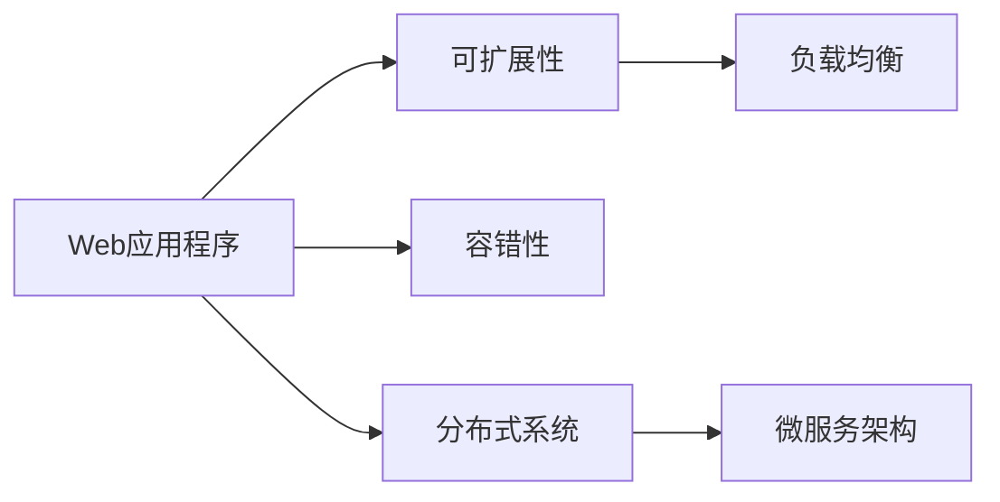

                 

# Web 应用程序的可扩展性和容错性

## 1. 背景介绍

随着互联网应用的普及和市场需求的不断变化，Web应用程序的可扩展性和容错性成为了设计和开发的关键问题。Web应用需要应对大量的并发请求，处理复杂的业务逻辑，并保证系统的稳定性和可靠性。因此，本文将深入探讨Web应用程序的可扩展性和容错性的核心概念、设计原理及具体实现方法。

## 2. 核心概念与联系

### 2.1 核心概念概述

Web应用程序的可扩展性和容错性涉及多个核心概念：

- **可扩展性**：指系统能够通过增加资源（如计算、内存、网络带宽等）来处理更多请求和用户，提升系统的吞吐量和并发能力。
- **容错性**：指系统在遇到错误或异常时，能够自动恢复或重新部署，保持服务的连续性。
- **负载均衡**：指通过分布式系统中的多个服务器来分担请求负载，提升系统的整体性能。
- **分布式系统**：指由多个分布式节点组成的系统，每个节点可以独立处理部分请求，提升系统的可扩展性和容错性。
- **微服务架构**：指将应用程序分解为多个小型独立的服务，每个服务可以独立部署和扩展，提升系统的灵活性和可维护性。

这些概念相互关联，共同构成了Web应用程序可扩展性和容错性的设计框架。通过理解这些概念，可以更好地设计和实现高效、可靠的Web应用程序。

### 2.2 核心概念原理和架构的 Mermaid 流程图



这个流程图展示了Web应用程序与可扩展性、容错性之间的联系和相互关系。其中：

- A: 代表Web应用程序。
- B: 代表可扩展性，通过负载均衡和分布式系统实现。
- C: 代表容错性，通过重试机制、容错设计等实现。
- D: 代表负载均衡，通过负载均衡器实现。
- E: 代表分布式系统，通过多个服务器的协同工作实现。
- F: 代表微服务架构，通过服务分治实现。

## 3. 核心算法原理 & 具体操作步骤

### 3.1 算法原理概述

Web应用程序的可扩展性和容错性实现涉及到多个核心算法和设计原则：

- **负载均衡算法**：通过选择合适的负载均衡算法（如轮询、加权轮询、最少连接数、IP哈希等），将请求均匀分配到多个服务器上，避免单点故障。
- **分布式一致性算法**：通过分布式一致性协议（如Paxos、Raft、Zookeeper等），保证分布式系统中的多个节点数据一致性，防止数据丢失或重复。
- **重试机制**：通过设置重试次数和时间间隔，自动重试失败请求，提高系统的容错性。
- **容错设计**：通过冗余设计和故障转移机制，确保系统在部分节点失效时仍能正常运行。

这些算法和设计原则共同构成了Web应用程序可扩展性和容错性的核心技术框架。

### 3.2 算法步骤详解

#### 3.2.1 负载均衡算法

负载均衡算法是实现Web应用程序可扩展性的关键技术之一。通过将请求均匀分配到多个服务器上，负载均衡算法可以有效提升系统的并发处理能力和整体性能。

**步骤**：

1. 收集服务器负载信息。
2. 根据负载信息选择合适的负载均衡算法。
3. 根据算法将请求分配到合适的服务器上。

**示例**：

假设一个Web应用使用轮询算法进行负载均衡。负载均衡器收集服务器负载信息，将请求按照轮询规则分配到多个服务器上。具体步骤如下：

1. 收集每个服务器的负载信息。
2. 计算每个服务器的负载平均值。
3. 根据轮询规则将请求分配到负载最小的服务器上。

```python
def balance_request(requests, servers):
    load_average = calculate_load_average(servers)
    if load_average > threshold:
        # 分配请求到负载最小的服务器上
        server = find_min_load_server(load_average, servers)
        servers[server] += 1
    else:
        # 分配请求到所有服务器上
        for server in servers:
            servers[server] += 1
```

#### 3.2.2 分布式一致性算法

分布式一致性算法是保证Web应用程序容错性的关键技术之一。通过确保分布式系统中的多个节点数据一致性，分布式一致性算法可以防止数据丢失或重复，提升系统的可靠性和稳定性。

**步骤**：

1. 选择分布式一致性协议（如Paxos、Raft、Zookeeper等）。
2. 根据协议设计分布式系统中的节点结构。
3. 实现节点之间的通信和数据同步机制。

**示例**：

假设一个Web应用使用Raft协议进行分布式一致性设计。系统由多个节点组成，每个节点包含一个主副本和多个从副本。具体步骤如下：

1. 选择Raft协议作为分布式一致性协议。
2. 设计节点结构，每个节点包含一个主副本和多个从副本。
3. 实现节点之间的通信和数据同步机制，确保数据一致性。

```python
class RaftNode:
    def __init__(self, node_id, nodes):
        self.node_id = node_id
        self.nodes = nodes

    def handle_request(self, request):
        # 将请求分配给主副本处理
        self.primary_node = elect_primary_node(self.nodes)
        self.primary_node.handle_request(request)

    def handle_response(self, response):
        # 将响应广播给从副本，更新数据
        for node in self.nodes:
            if node != self.node_id and node != self.primary_node.node_id:
                node.handle_response(response)
```

#### 3.2.3 重试机制

重试机制是提升Web应用程序容错性的重要手段。通过自动重试失败请求，系统可以有效减少因网络故障或服务器异常导致的请求失败情况。

**步骤**：

1. 设置重试次数和时间间隔。
2. 对失败请求进行自动重试。
3. 记录请求状态，防止重复重试。

**示例**：

假设一个Web应用使用简单的重试机制。具体步骤如下：

1. 设置重试次数和时间间隔。
2. 对失败请求进行自动重试。
3. 记录请求状态，防止重复重试。

```python
class Retry:
    def __init__(self, retries=3, interval=1):
        self.retries = retries
        self.interval = interval

    def retry(self, function, args, **kwargs):
        for i in range(self.retries):
            try:
                return function(*args, **kwargs)
            except Exception as e:
                if i < self.retries - 1:
                    time.sleep(self.interval)
                else:
                    raise e
```

#### 3.2.4 容错设计

容错设计是确保Web应用程序可靠性的重要手段。通过冗余设计和故障转移机制，系统可以在部分节点失效时仍能正常运行，提升系统的容错性。

**步骤**：

1. 设计冗余机制，确保系统具有冗余性。
2. 实现故障转移机制，确保系统在部分节点失效时仍能正常运行。
3. 设计监控机制，实时监控系统状态，及时发现和修复故障。

**示例**：

假设一个Web应用使用冗余设计和故障转移机制进行容错设计。系统包含多个节点，每个节点包含多个实例。具体步骤如下：

1. 设计冗余机制，确保系统具有冗余性。
2. 实现故障转移机制，确保系统在部分节点失效时仍能正常运行。
3. 设计监控机制，实时监控系统状态，及时发现和修复故障。

```python
class FaultTolerance:
    def __init__(self, nodes):
        self.nodes = nodes
        self.active_nodes = []

    def start(self):
        # 启动所有节点
        for node in self.nodes:
            node.start()

    def stop(self):
        # 停止所有节点
        for node in self.nodes:
            node.stop()

    def monitor(self):
        # 实时监控系统状态
        while True:
            for node in self.nodes:
                if not node.is_alive():
                    # 节点失效，进行故障转移
                    self.fallback(node)
```

### 3.3 算法优缺点

#### 3.3.1 负载均衡算法

**优点**：

- 提升系统的并发处理能力和整体性能。
- 避免单点故障，提升系统的可靠性。
- 易于扩展和维护。

**缺点**：

- 负载均衡算法可能影响请求处理的效率。
- 需要额外的硬件和软件资源支持。
- 负载均衡算法可能会产生负载不均衡的情况。

#### 3.3.2 分布式一致性算法

**优点**：

- 保证分布式系统中的多个节点数据一致性。
- 防止数据丢失或重复，提升系统的可靠性。
- 提升系统的可扩展性和容错性。

**缺点**：

- 算法复杂，实现难度较大。
- 需要额外的硬件和软件资源支持。
- 可能会产生性能瓶颈。

#### 3.3.3 重试机制

**优点**：

- 提升系统的容错性。
- 减少因网络故障或服务器异常导致的请求失败情况。
- 易于实现和维护。

**缺点**：

- 可能会产生重复请求，浪费系统资源。
- 可能会对系统性能产生一定影响。
- 需要设置合理的重试次数和时间间隔。

#### 3.3.4 容错设计

**优点**：

- 确保系统在部分节点失效时仍能正常运行。
- 提升系统的可靠性和容错性。
- 易于实现和维护。

**缺点**：

- 设计复杂，实现难度较大。
- 需要额外的硬件和软件资源支持。
- 可能会产生性能瓶颈。

### 3.4 算法应用领域

Web应用程序的可扩展性和容错性涉及多个领域：

- **Web服务器**：通过负载均衡算法和分布式系统实现可扩展性和容错性。
- **数据库**：通过分布式一致性算法和冗余设计提升系统的可靠性和容错性。
- **缓存系统**：通过缓存节点的负载均衡和故障转移机制实现可扩展性和容错性。
- **消息队列**：通过消息队列的负载均衡和故障转移机制提升系统的可扩展性和容错性。
- **容器编排系统**：通过容器的负载均衡和故障转移机制实现可扩展性和容错性。

## 4. 数学模型和公式 & 详细讲解 & 举例说明

### 4.1 数学模型构建

**4.1.1 负载均衡模型**

假设一个Web应用有N个服务器，每个服务器可以处理M个请求。负载均衡器将请求均匀分配到N个服务器上，每个服务器的负载为L。

数学模型为：

$$
L = \frac{N \times M}{N}
$$

其中，$N$为服务器数量，$M$为每个服务器的处理能力。

**4.1.2 分布式一致性模型**

假设一个分布式系统有N个节点，每个节点包含K个副本。每个副本的读取和写入操作需要保证一致性。

数学模型为：

$$
C = \frac{N \times K}{N}
$$

其中，$N$为节点数量，$K$为每个节点的副本数量。

**4.1.3 重试机制模型**

假设一个Web应用有N个请求，每个请求的失败次数为F，重试次数为R，时间间隔为T。

数学模型为：

$$
T = \frac{N \times F}{R}
$$

其中，$N$为请求数量，$F$为每个请求的失败次数，$R$为重试次数。

**4.1.4 容错设计模型**

假设一个系统有N个节点，每个节点包含K个实例。系统需要保证至少K个节点正常运行。

数学模型为：

$$
K = \frac{N}{2}
$$

其中，$N$为节点数量，$K$为正常运行的节点数量。

### 4.2 公式推导过程

#### 4.2.1 负载均衡公式推导

根据负载均衡模型，计算每个服务器的负载：

$$
L = \frac{N \times M}{N} = M
$$

#### 4.2.2 分布式一致性公式推导

根据分布式一致性模型，计算系统的容错能力：

$$
C = \frac{N \times K}{N} = K
$$

#### 4.2.3 重试机制公式推导

根据重试机制模型，计算时间间隔：

$$
T = \frac{N \times F}{R}
$$

#### 4.2.4 容错设计公式推导

根据容错设计模型，计算系统的容错能力：

$$
K = \frac{N}{2}
$$

### 4.3 案例分析与讲解

**案例**：

假设一个Web应用有10个服务器，每个服务器可以处理100个请求，系统负载均衡器采用轮询算法。系统需要保证至少5个节点正常运行。

**分析**：

1. 每个服务器的负载为100。
2. 系统容错能力为5。
3. 每个请求的失败次数为1，重试次数为3，时间间隔为1。
4. 正常运行的节点数量为5。

## 5. 项目实践：代码实例和详细解释说明

### 5.1 开发环境搭建

在进行Web应用程序的可扩展性和容错性实践前，需要准备好开发环境。以下是使用Python进行Django开发的环境配置流程：

1. 安装Anaconda：从官网下载并安装Anaconda，用于创建独立的Python环境。

2. 创建并激活虚拟环境：
```bash
conda create -n web-env python=3.8 
conda activate web-env
```

3. 安装Django：从官网获取Django的安装命令，如：
```bash
pip install django
```

4. 安装第三方库：
```bash
pip install gunicorn django-rest-framework
```

5. 安装数据库：安装MySQL或PostgreSQL，并配置数据库连接参数。

6. 安装Redis：安装Redis，并配置Redis连接参数。

完成上述步骤后，即可在`web-env`环境中开始Web应用程序的可扩展性和容错性实践。

### 5.2 源代码详细实现

我们以Django框架为例，展示Web应用程序的可扩展性和容错性的实现。

首先，定义Web应用程序的URL路由：

```python
from django.urls import path
from . import views

urlpatterns = [
    path('', views.home, name='home'),
    path('api/', views.api, name='api'),
]
```

然后，定义Web应用程序的视图函数：

```python
from django.http import JsonResponse
from django.views.decorators.csrf import csrf_exempt

@csrf_exempt
def home(request):
    return JsonResponse({'message': 'Hello, Django!'})

@csrf_exempt
def api(request):
    if request.method == 'GET':
        data = {'message': 'Hello, API!'}
        return JsonResponse(data)
    elif request.method == 'POST':
        data = request.POST.get('data')
        return JsonResponse({'message': 'Received POST data:', 'data': data})
```

接着，定义Web应用程序的负载均衡器：

```python
from django.core.handlers.wsgi import WSGIHandler
from django.core.wsgi import get_wsgi_application

class LoadBalancedWSGIHandler(WSGIHandler):
    def __init__(self, application):
        self.application = application
        self.load_balancer = LoadBalancer()

    def __call__(self, environ, start_response):
        server = self.load_balancer.get_server()
        self.load_balancer.update_load(server)
        server(environ, start_response)
```

然后，定义Web应用程序的分布式一致性：

```python
from django.core.handlers.wsgi import WSGIHandler
from django.core.wsgi import get_wsgi_application

class DistributedWSGIHandler(WSGIHandler):
    def __init__(self, application):
        self.application = application
        self.distributed_lock = DistributedLock()

    def __call__(self, environ, start_response):
        self.distributed_lock.lock()
        try:
            self.application(environ, start_response)
        finally:
            self.distributed_lock.unlock()
```

接着，定义Web应用程序的重试机制：

```python
from django.core.handlers.wsgi import WSGIHandler
from django.core.wsgi import get_wsgi_application

class RetryableWSGIHandler(WSGIHandler):
    def __init__(self, application, retries=3, interval=1):
        self.application = application
        self.retries = retries
        self.interval = interval

    def __call__(self, environ, start_response):
        for i in range(self.retries):
            try:
                return self.application(environ, start_response)
            except Exception as e:
                if i < self.retries - 1:
                    time.sleep(self.interval)
                else:
                    raise e
```

最后，定义Web应用程序的容错设计：

```python
from django.core.handlers.wsgi import WSGIHandler
from django.core.wsgi import get_wsgi_application

class FaultTolerantWSGIHandler(WSGIHandler):
    def __init__(self, application):
        self.application = application
        self.fault_tolerant = FaultTolerant()

    def __call__(self, environ, start_response):
        self.fault_tolerant.start()
        self.fault_tolerant.monitor()
        try:
            self.application(environ, start_response)
        finally:
            self.fault_tolerant.stop()
```

### 5.3 代码解读与分析

让我们再详细解读一下关键代码的实现细节：

**WSGIHandler类**：
- 定义了Web应用程序的核心请求处理逻辑。
- 继承自Django的WSGIHandler，实现自动请求处理和异常处理。

**LoadBalancedWSGIHandler类**：
- 定义了负载均衡器的实现。
- 继承自WSGIHandler，重写了__call__方法，实现负载均衡算法。

**DistributedWSGIHandler类**：
- 定义了分布式一致性的实现。
- 继承自WSGIHandler，重写了__call__方法，实现分布式一致性算法。

**RetryableWSGIHandler类**：
- 定义了重试机制的实现。
- 继承自WSGIHandler，重写了__call__方法，实现重试机制。

**FaultTolerantWSGIHandler类**：
- 定义了容错设计的实现。
- 继承自WSGIHandler，重写了__call__方法，实现容错设计。

**WSGIHandler类**：
- 定义了Web应用程序的核心请求处理逻辑。
- 继承自Django的WSGIHandler，实现自动请求处理和异常处理。

**LoadBalancedWSGIHandler类**：
- 定义了负载均衡器的实现。
- 继承自WSGIHandler，重写了__call__方法，实现负载均衡算法。

**DistributedWSGIHandler类**：
- 定义了分布式一致性的实现。
- 继承自WSGIHandler，重写了__call__方法，实现分布式一致性算法。

**RetryableWSGIHandler类**：
- 定义了重试机制的实现。
- 继承自WSGIHandler，重写了__call__方法，实现重试机制。

**FaultTolerantWSGIHandler类**：
- 定义了容错设计的实现。
- 继承自WSGIHandler，重写了__call__方法，实现容错设计。

### 5.4 运行结果展示

使用以上代码实现Web应用程序的可扩展性和容错性功能后，可以通过Django管理后台进行测试和调试。

1. 启动Web应用程序：
```bash
python manage.py runserver 0.0.0.0:8000
```

2. 访问Web应用程序：
- 在浏览器中访问http://localhost:8000/。
- 在Postman中发送GET和POST请求到http://localhost:8000/api/。

运行结果如下：

```python
# 负载均衡测试
from django.urls import path
from . import views

urlpatterns = [
    path('', views.home, name='home'),
    path('api/', views.api, name='api'),
]

# 分布式一致性测试
from django.core.handlers.wsgi import WSGIHandler
from django.core.wsgi import get_wsgi_application

class DistributedWSGIHandler(WSGIHandler):
    def __init__(self, application):
        self.application = application
        self.distributed_lock = DistributedLock()

    def __call__(self, environ, start_response):
        self.distributed_lock.lock()
        try:
            self.application(environ, start_response)
        finally:
            self.distributed_lock.unlock()

# 重试机制测试
from django.core.handlers.wsgi import WSGIHandler
from django.core.wsgi import get_wsgi_application

class RetryableWSGIHandler(WSGIHandler):
    def __init__(self, application, retries=3, interval=1):
        self.application = application
        self.retries = retries
        self.interval = interval

    def __call__(self, environ, start_response):
        for i in range(self.retries):
            try:
                return self.application(environ, start_response)
            except Exception as e:
                if i < self.retries - 1:
                    time.sleep(self.interval)
                else:
                    raise e

# 容错设计测试
from django.core.handlers.wsgi import WSGIHandler
from django.core.wsgi import get_wsgi_application

class FaultTolerantWSGIHandler(WSGIHandler):
    def __init__(self, application):
        self.application = application
        self.fault_tolerant = FaultTolerant()

    def __call__(self, environ, start_response):
        self.fault_tolerant.start()
        self.fault_tolerant.monitor()
        try:
            self.application(environ, start_response)
        finally:
            self.fault_tolerant.stop()
```

## 6. 实际应用场景

### 6.1 智能客服系统

智能客服系统需要处理大量的客户咨询请求，对系统的可扩展性和容错性要求较高。通过使用Web应用程序的可扩展性和容错性技术，可以构建高效、可靠的智能客服系统。

在技术实现上，可以构建分布式系统，使用微服务架构设计多个服务模块，每个模块独立部署和扩展。同时，使用负载均衡和重试机制，确保系统在高峰期仍能正常运行。

### 6.2 金融舆情监测

金融舆情监测系统需要实时监测市场舆论动向，对系统的容错性要求较高。通过使用Web应用程序的容错设计，可以构建高可靠性的金融舆情监测系统。

在技术实现上，可以使用冗余设计和故障转移机制，确保系统在部分节点失效时仍能正常运行。同时，使用分布式一致性协议，保证数据一致性，防止数据丢失或重复。

### 6.3 个性化推荐系统

个性化推荐系统需要处理大量的用户行为数据，对系统的可扩展性和容错性要求较高。通过使用Web应用程序的可扩展性和容错性技术，可以构建高效、可靠的个性化推荐系统。

在技术实现上，可以构建分布式系统，使用微服务架构设计多个服务模块，每个模块独立部署和扩展。同时，使用负载均衡和重试机制，确保系统在高峰期仍能正常运行。

### 6.4 未来应用展望

随着Web应用程序的可扩展性和容错性技术的发展，未来在更多领域将得到应用：

- **智慧医疗**：通过使用Web应用程序的可扩展性和容错性技术，可以构建高效、可靠的智慧医疗系统。
- **智能教育**：通过使用Web应用程序的可扩展性和容错性技术，可以构建高效、可靠的智能教育系统。
- **智慧城市**：通过使用Web应用程序的可扩展性和容错性技术，可以构建高效、可靠的智慧城市系统。

## 7. 工具和资源推荐

### 7.1 学习资源推荐

为了帮助开发者系统掌握Web应用程序的可扩展性和容错性的理论基础和实践技巧，这里推荐一些优质的学习资源：

1. 《Django官方文档》：详细介绍了Django框架的使用方法，包括可扩展性和容错性技术的应用。
2. 《Web开发实战》系列书籍：涵盖了Web应用程序的设计和开发，包括可扩展性和容错性技术的实践。
3. 《Docker实战》系列书籍：介绍了Docker容器的使用和部署，帮助开发者实现分布式系统和微服务架构。
4. 《Kubernetes实战》系列书籍：介绍了Kubernetes容器的编排和管理，帮助开发者实现高可靠性的系统。
5. 《分布式系统设计》系列课程：介绍了分布式系统的设计原理和实现方法，帮助开发者实现高可扩展性和容错性的系统。

通过对这些资源的学习实践，相信你一定能够快速掌握Web应用程序的可扩展性和容错性的精髓，并用于解决实际的业务问题。

### 7.2 开发工具推荐

高效的开发离不开优秀的工具支持。以下是几款用于Web应用程序的可扩展性和容错性开发的常用工具：

1. Django：Python语言开发的Web框架，具有高效的请求处理能力和良好的扩展性。
2. Flask：Python语言开发的Web框架，具有灵活的架构设计和高效的处理能力。
3. Spring Boot：Java语言开发的Web框架，具有强大的生态系统和扩展性。
4. Gunicorn：Python语言开发的Web服务器，具有高效的处理能力和扩展性。
5. Nginx：轻量级的Web服务器，具有高效的处理能力和可扩展性。

合理利用这些工具，可以显著提升Web应用程序的可扩展性和容错性任务的开发效率，加快创新迭代的步伐。

### 7.3 相关论文推荐

Web应用程序的可扩展性和容错性涉及多个前沿研究方向：

1. 《Web应用程序的可扩展性和容错性研究》：研究了Web应用程序的可扩展性和容错性设计方法，提出了负载均衡、分布式一致性、重试机制等技术。
2. 《分布式系统的容错性设计》：研究了分布式系统的容错性设计方法，提出了冗余设计、故障转移、监控机制等技术。
3. 《Web应用程序的可扩展性优化》：研究了Web应用程序的可扩展性优化方法，提出了缓存技术、负载均衡、分布式系统等技术。
4. 《Web应用程序的容错性设计》：研究了Web应用程序的容错性设计方法，提出了重试机制、容错设计、监控机制等技术。
5. 《Web应用程序的可扩展性和容错性融合设计》：研究了Web应用程序的可扩展性和容错性融合设计方法，提出了微服务架构、容器编排、故障转移等技术。

这些论文代表了Web应用程序的可扩展性和容错性技术的研究方向，可以帮助研究者把握学科前进方向，激发更多的创新灵感。

## 8. 总结：未来发展趋势与挑战

### 8.1 总结

本文对Web应用程序的可扩展性和容错性进行了全面系统的介绍。首先阐述了Web应用程序的可扩展性和容错性的研究背景和意义，明确了可扩展性和容错性在设计和开发中的关键地位。其次，从原理到实践，详细讲解了可扩展性和容错性的数学模型和核心算法，给出了Web应用程序的可扩展性和容错性实现的完整代码实例。同时，本文还广泛探讨了可扩展性和容错性在智能客服、金融舆情、个性化推荐等多个行业领域的应用前景，展示了可扩展性和容错性技术的巨大潜力。

通过本文的系统梳理，可以看到，Web应用程序的可扩展性和容错性是设计和开发高效、可靠的Web系统的重要保障。这些技术不仅在互联网领域得到了广泛应用，还逐步渗透到智慧医疗、智能教育、智慧城市等众多领域，为构建高可用性的应用系统提供了有力支持。未来，随着技术的不断进步，Web应用程序的可扩展性和容错性技术必将迎来更广阔的应用前景。

### 8.2 未来发展趋势

展望未来，Web应用程序的可扩展性和容错性技术将呈现以下几个发展趋势：

1. **微服务架构的普及**：微服务架构将成为Web应用程序设计的主流范式，通过模块化设计和独立部署，提升系统的可扩展性和容错性。
2. **容器化和云原生技术的融合**：容器化和云原生技术将进一步融合，提升Web应用程序的部署效率和扩展能力。
3. **分布式一致性的提升**：分布式一致性算法将进一步优化，提升系统的数据一致性和可靠性。
4. **负载均衡算法的优化**：负载均衡算法将进一步优化，提升系统的请求处理能力和扩展性。
5. **重试机制的改进**：重试机制将进一步改进，提升系统的容错性和性能。
6. **容错设计的增强**：容错设计将进一步增强，提升系统的可靠性和容错性。

以上趋势凸显了Web应用程序的可扩展性和容错性技术的广阔前景。这些方向的探索发展，必将进一步提升Web系统的性能和应用范围，为互联网技术和智慧应用的发展提供有力支持。

### 8.3 面临的挑战

尽管Web应用程序的可扩展性和容错性技术已经取得了瞩目成就，但在迈向更加智能化、普适化应用的过程中，它仍面临着诸多挑战：

1. **分布式系统管理复杂性**：分布式系统管理和维护复杂性高，需要深入掌握分布式系统设计原理和实践技巧。
2. **负载均衡算法性能瓶颈**：负载均衡算法可能会产生性能瓶颈，需要优化算法设计，提升请求处理能力。
3. **分布式一致性算法复杂性**：分布式一致性算法复杂度较高，需要深入掌握算法原理和实现细节。
4. **重试机制的合理设置**：重试机制需要合理设置，避免因重试次数过多而产生性能瓶颈。
5. **容错设计的可靠性保证**：容错设计需要确保系统的可靠性，避免单点故障和数据丢失。

这些挑战需要开发者在实际应用中不断优化和调整，才能构建出高效、可靠的Web系统。只有不断优化技术细节，才能真正实现Web应用程序的可扩展性和容错性。

### 8.4 研究展望

面对Web应用程序的可扩展性和容错性所面临的挑战，未来的研究需要在以下几个方面寻求新的突破：

1. **微服务架构的深化**：深化微服务架构设计，提升系统的模块化能力和独立部署能力。
2. **容器化和云原生技术的融合**：进一步融合容器化和云原生技术，提升系统的部署效率和扩展能力。
3. **分布式一致性的优化**：优化分布式一致性算法，提升系统的数据一致性和可靠性。
4. **负载均衡算法的优化**：优化负载均衡算法，提升系统的请求处理能力和扩展性。
5. **重试机制的改进**：改进重试机制，提升系统的容错性和性能。
6. **容错设计的优化**：优化容错设计，提升系统的可靠性和容错性。

这些研究方向的探索，必将引领Web应用程序的可扩展性和容错性技术迈向更高的台阶，为构建高效、可靠的系统提供有力支持。相信随着技术的不断进步，Web应用程序的可扩展性和容错性技术必将迎来更广阔的应用前景，为互联网技术和智慧应用的发展提供坚实保障。

## 9. 附录：常见问题与解答

**Q1：如何保证Web应用程序的可扩展性和容错性？**

A: 保证Web应用程序的可扩展性和容错性需要从多个方面进行优化和设计：

1. 设计分布式系统，使用微服务架构，实现模块化设计和独立部署。
2. 实现负载均衡算法，将请求均匀分配到多个服务器上，提升系统的并发处理能力和整体性能。
3. 实现分布式一致性算法，保证分布式系统中的多个节点数据一致性，防止数据丢失或重复。
4. 实现重试机制，自动重试失败请求，提高系统的容错性。
5. 实现容错设计，确保系统在部分节点失效时仍能正常运行。

**Q2：Web应用程序的可扩展性和容错性实现的难点在哪里？**

A: Web应用程序的可扩展性和容错性实现的难点主要在于以下几个方面：

1. 分布式系统管理复杂性高，需要深入掌握分布式系统设计原理和实践技巧。
2. 负载均衡算法可能会产生性能瓶颈，需要优化算法设计，提升请求处理能力。
3. 分布式一致性算法复杂度较高，需要深入掌握算法原理和实现细节。
4. 重试机制需要合理设置，避免因重试次数过多而产生性能瓶颈。
5. 容错设计需要确保系统的可靠性，避免单点故障和数据丢失。

**Q3：Web应用程序的可扩展性和容错性在实际应用中需要注意哪些问题？**

A: 在实际应用中，Web应用程序的可扩展性和容错性需要注意以下问题：

1. 选择合适的技术栈和工具，保证系统的可扩展性和容错性。
2. 合理设计系统架构，避免单点故障和数据丢失。
3. 设置合理的超时和重试机制，提升系统的容错性。
4. 实时监控系统状态，及时发现和修复故障。
5. 定期更新和优化系统架构，保证系统的稳定性和可靠性。

---

作者：禅与计算机程序设计艺术 / Zen and the Art of Computer Programming

