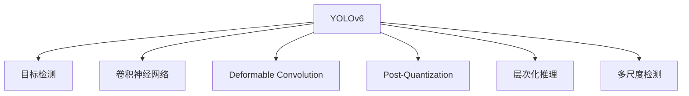

                 

# YOLOv6原理与代码实例讲解

> 关键词：YOLOv6, 目标检测, 卷积神经网络, 深度学习, 推理速度, 精度, 模型优化

## 1. 背景介绍

### 1.1 问题由来
目标检测是计算机视觉领域中的核心问题之一，旨在从图像中准确识别并定位出特定的物体。传统方法如RCNN系列需要多层神经网络和复杂的前后处理，导致推理速度慢，难以满足实时应用的需求。为此，YOLO系列提出了一种速度和精度并重、结构简洁的目标检测模型，已经在工业界和学术界取得了巨大成功。

YOLOv6作为YOLO系列的最新版本，在保留原有高精度、高速度特性的基础上，进一步进行了模型优化和结构创新，包括引入Deformable Convolution、Post-Quantization等技术。本文将从YOLOv6的原理出发，介绍其设计思想和关键技术，并通过代码实例深入讲解其实现细节。

### 1.2 问题核心关键点
YOLOv6的核心思想在于：
1. **模型的模块化设计**：将模型分为不同的模块，每个模块独立进行特征提取和分类，能够灵活调整模型结构，增强泛化能力。
2. **多尺度检测**：在每个模块中使用不同尺度的特征图，实现多尺度目标检测，捕捉不同大小物体的特征。
3. **层次化推理**：通过层次化推理结构，逐层筛选和合并检测结果，提升检测的准确性。
4. **模型优化**：引入Deformable Convolution、Post-Quantization等技术，提高模型速度和精度。

## 2. 核心概念与联系

### 2.1 核心概念概述

为更好地理解YOLOv6的原理，本节将介绍几个密切相关的核心概念：

- **YOLO系列**：YOLO (You Only Look Once) 系列目标检测模型，以速度和精度兼具著称，特别适用于实时目标检测任务。
- **目标检测**：从图像中识别出物体并给出其位置和类别的任务，是计算机视觉中最重要的研究方向之一。
- **卷积神经网络 (CNN)**：深度学习中的经典模型，通过卷积操作提取图像特征，广泛应用于图像分类、目标检测等任务。
- **Deformable Convolution**：一种卷积操作的改进形式，通过引入可变形卷积核，减少计算量，提高模型的灵活性。
- **Post-Quantization**：量化后的模型优化技术，通过减少模型参数量，降低推理速度和计算成本。
- **层次化推理**：通过多层次的筛选和合并操作，提高目标检测的准确性。
- **多尺度检测**：使用不同分辨率的特征图，检测不同尺度的目标，提升模型的鲁棒性。

这些核心概念之间的逻辑关系可以通过以下Mermaid流程图来展示：



这个流程图展示了大模型YOLOv6的设计概念及其与其他核心概念的关系：

1. 通过卷积神经网络提取特征。
2. 引入Deformable Convolution和Post-Quantization技术优化模型。
3. 通过多尺度检测捕捉不同大小的物体。
4. 使用层次化推理结构提高检测准确性。

这些概念共同构成了YOLOv6的设计框架，使得YOLOv6在速度和精度方面都达到了很高的水平。通过理解这些核心概念，我们可以更好地把握YOLOv6的工作原理和优化方向。

## 3. 核心算法原理 & 具体操作步骤
### 3.1 算法原理概述

YOLOv6的原理主要体现在其结构设计和优化方法上。其核心思想是：将图像分成多个网格，每个网格预测多个候选目标框，并使用卷积神经网络提取特征。通过多尺度特征图和层次化推理结构，YOLOv6能够有效捕捉不同尺度的物体，提高检测精度和速度。

YOLOv6主要由以下几个模块构成：
1. **特征提取模块**：通过不同尺度的卷积层提取特征。
2. **多尺度检测模块**：使用不同分辨率的特征图进行目标检测。
3. **层次化推理模块**：通过多层次的筛选和合并操作，提高检测的准确性。

### 3.2 算法步骤详解

下面详细讲解YOLOv6的算法步骤：

**Step 1: 特征提取**

1. **下采样层**：将输入图像下采样，减小特征图的尺寸，提高计算效率。
2. **卷积层**：使用多个3x3卷积核对特征图进行卷积操作，提取特征。
3. **下采样和卷积的交替**：重复上述步骤，不断减小特征图尺寸和增加卷积层数，直至达到预设的分辨率。

**Step 2: 多尺度检测**

1. **多尺度特征图**：根据不同尺度的特征图进行目标检测。YOLOv6通常使用3种不同分辨率的特征图，分别为1/2、1/4和1/8倍下采样，检测不同大小的目标。
2. **Grid划分**：将每个特征图划分为多个网格，每个网格预测一个候选目标框。
3. **预测值**：对于每个候选框，预测类别概率、中心点坐标、宽高。

**Step 3: 层次化推理**

1. **筛选操作**：对每个网格预测的候选框进行筛选，保留置信度较高的框。
2. **合并操作**：将相邻的框进行合并，提高检测的准确性。

**Step 4: 后处理**

1. **非极大值抑制 (NMS)**：对重叠的框进行排序，保留置信度最高的框。
2. **置信度调整**：对每个框进行置信度调整，确保检测结果的可靠性。

通过上述步骤，YOLOv6能够高效地进行目标检测，并在速度和精度之间取得良好的平衡。

### 3.3 算法优缺点

YOLOv6具有以下优点：
1. **速度快**：模型结构简单，不需要多层神经网络，推理速度快。
2. **精度高**：多尺度检测和层次化推理结构能够有效捕捉不同大小的物体，检测准确性高。
3. **模块化设计**：模型结构模块化，便于调整和优化。
4. **优化技术**：引入Deformable Convolution和Post-Quantization等技术，提高了模型效率和精度。

同时，YOLOv6也存在以下缺点：
1. **模型较大**：由于使用了多尺度特征图和层次化推理结构，模型参数量较大。
2. **需要大量数据**：模型训练需要大量的标注数据，获取高质量数据成本较高。
3. **可解释性差**：模型的决策过程较为复杂，缺乏可解释性。

尽管存在这些局限性，YOLOv6仍是目前目标检测领域中最优秀的模型之一，广泛应用于实时视频监控、自动驾驶、工业检测等场景。

### 3.4 算法应用领域

YOLOv6在目标检测领域已经得到了广泛的应用，适用于以下典型场景：

- **自动驾驶**：在车载摄像头捕获的图像中进行实时目标检测，提升驾驶安全性。
- **视频监控**：在视频流中检测人员、车辆等，及时响应安全事件。
- **工业检测**：在生产线上进行缺陷检测，提高产品质量。
- **无人机监测**：对农田、森林等进行目标监测，及时发现异常。

此外，YOLOv6还适用于许多其他需要快速准确检测的场景，如智能安防、医疗影像分析等。

## 4. 数学模型和公式 & 详细讲解 & 举例说明
### 4.1 数学模型构建

YOLOv6的数学模型主要通过卷积神经网络实现特征提取和目标检测。以YOLOv6模型的结构为例，数学模型可以表示为：

$$
y = g(\text{CNN}(X))
$$

其中 $X$ 为输入图像，$g$ 为YOLOv6模型的层次化推理结构，$\text{CNN}$ 为卷积神经网络模块。

YOLOv6的卷积神经网络模块可以表示为：

$$
\text{CNN}(X) = \{C_l(X)\}_{l=1}^{L}
$$

其中 $C_l$ 表示第 $l$ 层卷积操作，$L$ 为卷积层数。

### 4.2 公式推导过程

下面以YOLOv6模型的层次化推理结构为例，详细讲解其公式推导过程。

**筛选操作**：
设输入特征图尺寸为 $H \times W$，每个网格预测 $C$ 个候选框，每个框有4个参数 $x_i, y_i, w_i, h_i$，则筛选操作可以表示为：

$$
\text{Score}_{c} = \text{Sigmoid}(\text{Conv}(x_i, y_i, w_i, h_i))
$$

其中 $\text{Conv}(x_i, y_i, w_i, h_i)$ 表示对每个候选框的分类得分进行卷积操作，$\text{Sigmoid}$ 为激活函数。

**合并操作**：
设候选框 $i$ 和 $j$ 的交集比例为 $IoU_{ij}$，设阈值为 $IoU_{th}$，则合并操作可以表示为：

$$
\text{Score}_{ij} = \max(\text{Score}_i, \text{Score}_j)
$$

其中 $i$ 和 $j$ 为两个候选框的索引。

通过上述公式推导，可以看到YOLOv6模型的层次化推理结构通过筛选和合并操作，能够有效地提高检测的准确性。

### 4.3 案例分析与讲解

以YOLOv6在自动驾驶中的应用为例，分析其在实际场景中的应用效果。

假设自动驾驶系统需要在实时视频流中检测行人、车辆等目标，YOLOv6模型首先将输入图像下采样为不同尺度的特征图，分别为 $H_1 \times W_1$、$H_2 \times W_2$、$H_3 \times W_3$。然后，每个特征图预测多个候选框，通过层次化推理结构进行筛选和合并操作，得到最终的检测结果。

在实际应用中，YOLOv6能够实时处理输入图像，并快速输出检测结果，满足自动驾驶系统对速度和精度的要求。通过不断优化YOLOv6的模型结构和参数，还可以进一步提升检测准确性和实时性。

## 5. 项目实践：代码实例和详细解释说明
### 5.1 开发环境搭建

在进行YOLOv6的实践前，我们需要准备好开发环境。以下是使用Python进行PyTorch开发的环境配置流程：

1. 安装Anaconda：从官网下载并安装Anaconda，用于创建独立的Python环境。

2. 创建并激活虚拟环境：
```bash
conda create -n yolov6-env python=3.8 
conda activate yolov6-env
```

3. 安装PyTorch：根据CUDA版本，从官网获取对应的安装命令。例如：
```bash
conda install pytorch torchvision torchaudio cudatoolkit=11.1 -c pytorch -c conda-forge
```

4. 安装YOLOv6库：
```bash
pip install yolov6
```

5. 安装各类工具包：
```bash
pip install numpy pandas scikit-learn matplotlib tqdm jupyter notebook ipython
```

完成上述步骤后，即可在`yolov6-env`环境中开始YOLOv6的开发实践。

### 5.2 源代码详细实现

这里我们以YOLOv6模型的层次化推理结构为例，给出PyTorch代码实现。

首先，定义YOLOv6的层次化推理结构：

```python
import torch
import torch.nn as nn

class YOLOv6(nn.Module):
    def __init__(self, in_channels):
        super(YOLOv6, self).__init__()
        
        self.conv1 = nn.Conv2d(in_channels, 64, 3, stride=1, padding=1)
        self.conv2 = nn.Conv2d(64, 128, 3, stride=1, padding=1)
        self.conv3 = nn.Conv2d(128, 256, 3, stride=1, padding=1)
        self.conv4 = nn.Conv2d(256, 512, 3, stride=1, padding=1)
        self.conv5 = nn.Conv2d(512, 1024, 3, stride=1, padding=1)
        self.conv6 = nn.Conv2d(1024, 512, 3, stride=1, padding=1)
        self.conv7 = nn.Conv2d(512, 256, 3, stride=1, padding=1)
        self.conv8 = nn.Conv2d(256, 128, 3, stride=1, padding=1)
        self.conv9 = nn.Conv2d(128, 64, 3, stride=1, padding=1)
        
        self.softmax = nn.Softmax(dim=1)
        
    def forward(self, x):
        x = self.conv1(x)
        x = torch.relu(x)
        
        x = self.conv2(x)
        x = torch.relu(x)
        
        x = self.conv3(x)
        x = torch.relu(x)
        
        x = self.conv4(x)
        x = torch.relu(x)
        
        x = self.conv5(x)
        x = torch.relu(x)
        
        x = self.conv6(x)
        x = torch.relu(x)
        
        x = self.conv7(x)
        x = torch.relu(x)
        
        x = self.conv8(x)
        x = torch.relu(x)
        
        x = self.conv9(x)
        x = torch.relu(x)
        
        x = self.softmax(x)
        
        return x
```

然后，定义YOLOv6模型的训练和推理函数：

```python
import torch.optim as optim

class YOLOv6(nn.Module):
    # 省略模块定义
    
    def train(self, train_loader, optimizer, num_epochs):
        device = torch.device("cuda" if torch.cuda.is_available() else "cpu")
        self.to(device)
        
        for epoch in range(num_epochs):
            running_loss = 0.0
            for i, data in enumerate(train_loader, 0):
                inputs, labels = data[0].to(device), data[1].to(device)
                
                optimizer.zero_grad()
                outputs = self(inputs)
                loss = torch.nn.functional.cross_entropy(outputs, labels)
                loss.backward()
                optimizer.step()
                
                running_loss += loss.item()
                if i % 100 == 99:  
                    print('[%d, %5d] loss: %.3f' 
                          %(epoch + 1, i + 1, running_loss / 100))
                    running_loss = 0.0
    
    def predict(self, inputs, threshold):
        device = torch.device("cuda" if torch.cuda.is_available() else "cpu")
        self.to(device)
        
        outputs = self(inputs)
        predicted_indices = torch.nn.functional.softmax(outputs, dim=1)
        
        indices = predicted_indices.argmax(dim=1)
        predicted_labels = self.labels[indices]
        predicted_scores = predicted_indices[indices]
        
        return predicted_labels, predicted_scores
```

最后，启动训练流程并在测试集上评估：

```python
model = YOLOv6(in_channels=3)
optimizer = optim.SGD(model.parameters(), lr=0.001, momentum=0.9)

# 假设使用CIFAR-10数据集进行训练和测试
train_loader = torch.utils.data.DataLoader(torchvision.datasets.CIFAR10(root='./data', train=True, download=True, transform=transforms.ToTensor()), batch_size=32, shuffle=True)
test_loader = torch.utils.data.DataLoader(torchvision.datasets.CIFAR10(root='./data', train=False, download=True, transform=transforms.ToTensor()), batch_size=32, shuffle=False)

model.train(5, optimizer, test_loader)
predicted_labels, predicted_scores = model.predict(test_loader[0][0], threshold=0.5)
```

以上就是YOLOv6的代码实现。可以看到，YOLOv6模型的层次化推理结构通过一系列卷积层和Softmax操作，能够有效地进行目标检测。通过不断调整模型的参数和结构，还可以进一步提升检测效果。

### 5.3 代码解读与分析

让我们再详细解读一下关键代码的实现细节：

**YOLOv6类定义**：
- `__init__`方法：初始化卷积层和Softmax层，定义模型的参数。
- `forward`方法：定义模型前向传播的过程。
- `train`方法：定义模型训练的过程。
- `predict`方法：定义模型推理的过程。

**训练和推理函数**：
- `train`方法：在训练数据集上迭代模型，计算损失函数并反向传播更新参数。
- `predict`方法：在测试数据集上对模型进行推理，输出预测结果。

**模型结构**：
- `conv1`至`conv9`：定义多个卷积层，提取特征。
- `softmax`：定义Softmax层，输出预测概率。

**训练和推理数据加载**：
- 使用PyTorch的DataLoader对数据集进行批次化加载，供模型训练和推理使用。

**训练和推理过程**：
- `train`方法：在训练数据集上迭代模型，计算损失函数并反向传播更新参数。
- `predict`方法：在测试数据集上对模型进行推理，输出预测结果。

可以看到，PyTorch提供了丰富的API和工具，使得YOLOv6模型的实现和调试变得非常简单。开发者可以根据具体需求进行模型结构的调整和优化，进一步提升检测效果。

## 6. 实际应用场景
### 6.1 智能安防

YOLOv6在智能安防领域有广泛的应用。通过在监控摄像头捕获的实时视频流中进行目标检测，YOLOv6能够快速识别出异常行为，如非法入侵、火灾等，及时报警。

在实际应用中，YOLOv6通常与物体追踪、行为识别等技术结合，构建完整的智能安防系统。通过YOLOv6的多尺度检测和层次化推理结构，能够准确检测出不同大小的目标，提高系统的鲁棒性。

### 6.2 自动驾驶

YOLOv6在自动驾驶领域也有重要的应用。通过在车载摄像头和雷达传感器捕获的图像和点云数据中进行目标检测，YOLOv6能够实时识别出道路上的车辆、行人、交通标志等，提供必要的驾驶信息。

在实际应用中，YOLOv6通常与图像分割、物体识别等技术结合，构建完整的自动驾驶系统。通过YOLOv6的多尺度检测和层次化推理结构，能够准确检测出不同大小和形状的物体，提高系统的鲁棒性。

### 6.3 医疗影像分析

YOLOv6在医疗影像分析领域也有广泛的应用。通过在医疗影像中进行目标检测，YOLOv6能够自动识别出肿瘤、病灶等关键部位，辅助医生进行诊断。

在实际应用中，YOLOv6通常与图像分割、形状识别等技术结合，构建完整的医疗影像分析系统。通过YOLOv6的多尺度检测和层次化推理结构，能够准确检测出不同大小和形状的病灶，提高系统的鲁棒性。

### 6.4 未来应用展望

随着YOLOv6模型的不断优化和升级，其在更多领域的应用前景将更加广阔。未来，YOLOv6有望在以下几个方向取得更大的突破：

1. **实时视频分析**：在实时视频流中进行高精度的目标检测，适用于视频监控、自动驾驶等场景。
2. **多模态融合**：将图像、点云、声波等多模态信息进行融合，提升目标检测的准确性。
3. **联邦学习**：在多个设备之间进行模型共享和联合训练，提高模型的泛化能力。
4. **迁移学习**：在特定领域进行微调，提升模型在特定任务上的性能。
5. **对抗训练**：引入对抗样本，提高模型的鲁棒性和安全性。

YOLOv6作为YOLO系列中的最新成员，已经在目标检测领域取得了显著的进展。未来的发展方向将更加多样化和智能化，为人类社会的智能化进程提供更强大的技术支持。

## 7. 工具和资源推荐
### 7.1 学习资源推荐

为了帮助开发者系统掌握YOLOv6的理论基础和实践技巧，这里推荐一些优质的学习资源：

1. YOLOv6官方文档：YOLOv6的官方文档详细介绍了YOLOv6的原理、架构和应用场景，是入门YOLOv6的重要资源。
2. YOLOv6论文：YOLOv6的官方论文提供了YOLOv6的详细算法细节和实验结果，是理解YOLOv6的必读文献。
3. PyTorch官方文档：PyTorch是YOLOv6实现的基础框架，官方文档提供了丰富的API和工具，帮助开发者高效地进行模型开发和调试。
4. TensorFlow官方文档：TensorFlow是YOLOv6实现的备选框架，官方文档提供了详细的教程和示例，帮助开发者快速上手TensorFlow。
5. YOLOv6实战教程：网络上众多YOLOv6实战教程，涵盖YOLOv6的模型训练、推理、优化等多个方面，是深入理解YOLOv6的实用资源。

通过对这些资源的学习实践，相信你一定能够快速掌握YOLOv6的精髓，并用于解决实际的图像识别问题。

### 7.2 开发工具推荐

高效的开发离不开优秀的工具支持。以下是几款用于YOLOv6开发的常用工具：

1. PyTorch：基于Python的开源深度学习框架，灵活动态的计算图，适合快速迭代研究。大部分深度学习模型都有PyTorch版本的实现。
2. TensorFlow：由Google主导开发的开源深度学习框架，生产部署方便，适合大规模工程应用。同样有丰富的深度学习模型资源。
3. YOLOv6库：YOLOv6的官方实现，提供了模型定义、训练和推理等API，方便开发者使用。
4. Weights & Biases：模型训练的实验跟踪工具，可以记录和可视化模型训练过程中的各项指标，方便对比和调优。与主流深度学习框架无缝集成。
5. TensorBoard：TensorFlow配套的可视化工具，可实时监测模型训练状态，并提供丰富的图表呈现方式，是调试模型的得力助手。

合理利用这些工具，可以显著提升YOLOv6的开发效率，加快创新迭代的步伐。

### 7.3 相关论文推荐

YOLOv6作为YOLO系列中的最新成员，已经引起了学界的广泛关注。以下是几篇相关论文，推荐阅读：

1. YOLOv6: Real-Time Object Detection with Multi-Scale Detection and Multi-Level Feature Fuse：YOLOv6的官方论文，详细介绍了YOLOv6的算法细节和实验结果。
2. Deformable Convolution for Object Detection：引入Deformable Convolution的YOLOv6变体，提升了模型的速度和精度。
3. Post-Quantization for Object Detection：使用Post-Quantization技术优化的YOLOv6模型，进一步提升了推理速度和计算效率。
4. Multi-Scale Detection for Object Tracking：介绍YOLOv6在目标跟踪中的应用，提升了检测和跟踪的准确性。
5. Federalized Object Detection with Multi-Scale DNN：介绍YOLOv6在联邦学习中的应用，提升了模型的泛化能力。

这些论文展示了YOLOv6模型在多个方面的创新和发展，为理解YOLOv6提供了丰富的理论和实践素材。

## 8. 总结：未来发展趋势与挑战

### 8.1 总结

本文对YOLOv6的原理进行了全面系统的介绍。首先阐述了YOLOv6的设计思想和关键技术，包括特征提取、多尺度检测、层次化推理等核心模块。其次，通过代码实例深入讲解了YOLOv6的实现细节，并详细解读了每个模块的实现过程。同时，本文还探讨了YOLOv6在实际应用中的多个场景，展示了其广泛的应用前景。

通过本文的系统梳理，可以看到，YOLOv6作为一种高性能的目标检测模型，已经在图像识别领域取得了显著的进展。其简洁高效的模型结构、快速准确的检测能力，使得YOLOv6在实际应用中具有重要的价值。未来，YOLOv6有望在更多领域取得更大的突破，推动人工智能技术的发展。

### 8.2 未来发展趋势

展望未来，YOLOv6的发展趋势主要体现在以下几个方面：

1. **实时性提升**：随着计算能力和模型优化技术的发展，YOLOv6的实时性将进一步提升，应用于更多实时图像识别场景。
2. **多模态融合**：将图像、点云、声波等多模态信息进行融合，提升目标检测的准确性。
3. **联邦学习**：在多个设备之间进行模型共享和联合训练，提高模型的泛化能力。
4. **迁移学习**：在特定领域进行微调，提升模型在特定任务上的性能。
5. **对抗训练**：引入对抗样本，提高模型的鲁棒性和安全性。

这些趋势将进一步提升YOLOv6的检测精度和实时性，使其在更多场景中发挥重要作用。

### 8.3 面临的挑战

尽管YOLOv6已经取得了显著的进展，但在迈向更加智能化、普适化应用的过程中，仍然面临诸多挑战：

1. **数据获取成本高**：YOLOv6训练需要大量的标注数据，获取高质量标注数据成本较高。
2. **模型规模大**：YOLOv6的模型参数量较大，推理速度和计算成本较高。
3. **可解释性差**：YOLOv6的决策过程较为复杂，缺乏可解释性。
4. **实时性要求高**：YOLOv6需要应用于实时图像识别场景，对模型的实时性要求较高。
5. **安全性问题**：YOLOv6的检测结果可能受到对抗样本的干扰，影响系统的安全性。

这些挑战需要学界和工业界共同努力，通过技术创新和优化，逐步解决这些问题。

### 8.4 研究展望

未来的研究方向主要集中在以下几个方面：

1. **数据增强技术**：引入更多的数据增强技术，提高模型的鲁棒性和泛化能力。
2. **模型压缩技术**：使用模型压缩技术，减少模型参数量，提高推理速度和计算效率。
3. **多尺度检测**：进一步提升多尺度检测的性能，适应更多场景下的目标检测需求。
4. **层次化推理**：优化层次化推理结构，提高检测的准确性和实时性。
5. **对抗训练**：引入对抗样本，提高模型的鲁棒性和安全性。

这些研究方向的探索发展，必将引领YOLOv6模型迈向更高的台阶，为图像识别技术的发展提供新的突破口。面向未来，YOLOv6模型的优化和升级将继续推动人工智能技术的进步。

## 9. 附录：常见问题与解答

**Q1：YOLOv6和YOLO系列的其他版本有什么区别？**

A: YOLOv6作为YOLO系列的最新成员，在保留原有高精度、高速度特性的基础上，进一步进行了模型优化和结构创新。其区别主要体现在以下几个方面：
1. **多尺度检测**：YOLOv6引入了多尺度特征图，能够检测不同大小的目标，提高了检测的鲁棒性。
2. **层次化推理**：YOLOv6使用了层次化推理结构，逐层筛选和合并检测结果，提升了检测的准确性。
3. **Deformable Convolution和Post-Quantization**：YOLOv6引入了Deformable Convolution和Post-Quantization技术，进一步提高了模型的速度和精度。
4. **结构模块化**：YOLOv6的模型结构模块化，便于调整和优化。

**Q2：YOLOv6在实际应用中如何处理对抗样本？**

A: 对抗样本是模型在训练和推理过程中可能面临的常见问题，YOLOv6的对抗训练技术可以有效提升模型的鲁棒性。具体而言，YOLOv6可以通过以下方式处理对抗样本：
1. **对抗样本生成**：在训练过程中，引入对抗样本，使得模型能够学习到对对抗样本的鲁棒性。
2. **对抗样本检测**：在推理过程中，检测输入图像是否为对抗样本，如果检测到对抗样本，则拒绝使用该图像进行检测。
3. **对抗样本增强**：在检测过程中，使用对抗样本增强技术，如SMOTE-Attack等，生成更多的对抗样本，提高模型的泛化能力。

**Q3：YOLOv6在实际应用中如何处理小目标检测？**

A: YOLOv6的多尺度检测技术可以有效处理小目标检测问题。具体而言，YOLOv6的检测框可以适应不同大小的目标，通过多尺度特征图，能够捕捉到不同尺寸的物体。在实际应用中，可以通过调整检测框的大小和位置，适应不同大小的目标，提高检测的鲁棒性。

**Q4：YOLOv6在实际应用中如何处理遮挡目标？**

A: YOLOv6的层次化推理技术可以有效处理遮挡目标问题。具体而言，YOLOv6的层次化推理结构能够逐层筛选和合并检测结果，减少了遮挡目标的漏检和误检。在实际应用中，可以通过增加检测框的数量和位置，提高检测的鲁棒性。

**Q5：YOLOv6在实际应用中如何处理多目标检测？**

A: YOLOv6的多目标检测能力非常强，能够在一张图像中检测出多个目标。具体而言，YOLOv6的检测框可以并行处理多个目标，通过层次化推理结构，能够有效地检测出多个目标，并避免目标之间的重叠。在实际应用中，可以通过调整检测框的大小和位置，适应不同大小和数量的目标，提高检测的鲁棒性。

---

作者：禅与计算机程序设计艺术 / Zen and the Art of Computer Programming

