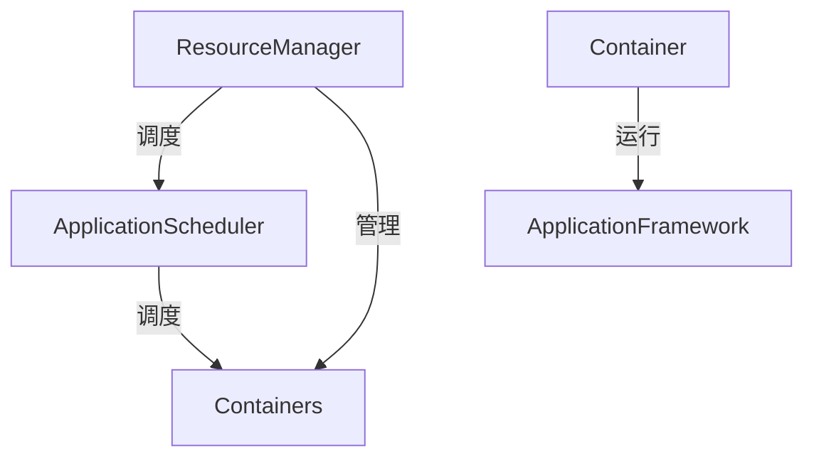

                 

# Yarn原理与代码实例讲解

> 关键词：Yarn, Hadoop, Cluster Management, Distributed Computing, Resource Scheduling, MapReduce, Fault Tolerance, Workflow Management

## 1. 背景介绍

### 1.1 问题由来

在当今大数据时代，分布式计算技术成为了处理海量数据的关键工具。Hadoop作为开源的分布式计算框架，以其强大的集群管理和计算能力，被广泛应用于数据分析、大数据处理等领域。然而，随着数据规模的不断增长和业务场景的日益复杂，Hadoop的管理和调度问题逐渐显现。

具体而言，Hadoop 的 JobTracker 设计上存在单点故障、任务调度效率低下、资源利用率不高等问题，使得在大规模集群环境下，Hadoop 的性能瓶颈和可靠性问题愈加明显。针对这些问题，Yarn 框架应运而生，其设计和实现上都进行了诸多改进，旨在提升集群管理和计算性能，更好地应对分布式计算挑战。

### 1.2 问题核心关键点

Yarn 框架通过将计算资源和计算任务分离，采用“资源管理器（Resource Manager）”和“应用调度器（Application Scheduler）”两级调度架构，大幅提升了集群的资源利用率，增强了任务的灵活性和可靠性。其核心思想如下：

- 资源管理器负责集群资源的统一管理，包括监控、分配、回收等。
- 应用调度器负责任务的调度和执行，根据集群资源的实时状态，动态调整任务的分配，确保资源的高效利用。
- 通过任务切割和流水线化处理，实现高效的计算资源复用。
- 具备良好的故障容错机制，能够在节点故障或网络中断时，保证任务和数据的完整性。

本文将系统性地介绍 Yarn 的架构和设计，包括其核心组件、调度算法、资源管理机制等，并辅以代码实例和详细解释，帮助读者深入理解 Yarn 原理与实践。

## 2. 核心概念与联系

### 2.1 核心概念概述

为了更好地理解 Yarn 的原理和架构，本节将介绍几个关键的概念：

- **资源管理器（Resource Manager）**：负责集群资源的统一管理和调度，包括监控集群的 CPU、内存等资源，并根据应用需求进行分配和回收。
- **应用调度器（Application Scheduler）**：负责任务的调度和执行，根据资源管理器提供的信息，动态调整任务的分配，确保任务的高效运行。
- **容器（Container）**：用于封装任务的运行环境和资源需求，每个容器独立运行，资源被完全隔离，避免任务之间的干扰。
- **应用框架（Application Framework）**：Yarn 提供了一套应用框架，如 MapReduce、Spark、Flink 等，用于构建分布式计算任务，并自动调度和管理任务的生命周期。

这些概念构成了 Yarn 框架的核心架构，使得 Yarn 能够高效地管理集群资源，调度执行任务，提升大规模分布式计算的效率和可靠性。

### 2.2 核心概念原理和架构的 Mermaid 流程图



### 2.3 核心概念之间的关系

以上 Mermaid 流程图展示了 Yarn 的核心概念及其之间的关系：

- 资源管理器负责集群资源的统一管理和调度，并将其分配给应用调度器。
- 应用调度器根据资源管理器提供的信息，动态调整容器的分配，确保任务的高效运行。
- 容器是任务的运行环境和资源需求单元，其运行环境由应用框架提供。

这些概念相互配合，使得 Yarn 能够高效地管理集群资源，调度执行任务，提升大规模分布式计算的效率和可靠性。

## 3. 核心算法原理 & 具体操作步骤

### 3.1 算法原理概述

Yarn 框架采用资源管理器和应用调度器两级调度架构，将计算资源和计算任务分离，从而实现了集群资源的高效管理和任务调度的灵活性。Yarn 的核心算法原理如下：

1. **资源管理器（Resource Manager）**：负责集群资源的统一管理和调度，包括监控集群的 CPU、内存等资源，并根据应用需求进行分配和回收。资源管理器通过心跳机制，定期向应用调度器汇报集群资源状态，确保资源管理器的及时性和准确性。
2. **应用调度器（Application Scheduler）**：负责任务的调度和执行，根据资源管理器提供的信息，动态调整任务的分配，确保任务的高效运行。应用调度器通过细粒度的资源分配，实现了任务的灵活性和可靠性。
3. **容器（Container）**：用于封装任务的运行环境和资源需求，每个容器独立运行，资源被完全隔离，避免任务之间的干扰。容器是 Yarn 中最小的运行单元，其运行环境和资源需求由应用框架提供。
4. **应用框架（Application Framework）**：Yarn 提供了一套应用框架，如 MapReduce、Spark、Flink 等，用于构建分布式计算任务，并自动调度和管理任务的生命周期。应用框架负责任务的切分、调度和管理，确保任务的正确执行。

通过这些核心算法原理，Yarn 实现了集群资源的高效管理和任务调度的灵活性，提升了大规模分布式计算的效率和可靠性。

### 3.2 算法步骤详解

#### 3.2.1 资源管理器

1. **资源监控**：资源管理器负责监控集群的 CPU、内存等资源，并记录资源使用情况，确保资源的及时更新和准确性。
2. **资源分配**：资源管理器根据应用需求和资源状态，动态调整资源的分配，确保资源的充分利用和合理分配。
3. **资源回收**：资源管理器负责回收不再使用的资源，确保集群资源的有效利用。

#### 3.2.2 应用调度器

1. **任务调度**：应用调度器根据资源管理器提供的信息，动态调整任务的分配，确保任务的高效运行。
2. **任务执行**：应用调度器负责任务的执行，通过细粒度的资源分配，实现了任务的灵活性和可靠性。
3. **任务管理**：应用调度器负责任务的生命周期管理，包括任务的启动、暂停、结束等，确保任务的正确执行。

#### 3.2.3 容器

1. **资源分配**：容器负责任务的资源分配，确保每个任务都有独立的运行环境和资源需求。
2. **任务执行**：容器负责任务的执行，通过独立运行，避免了任务之间的干扰。
3. **资源回收**：容器负责资源的回收，确保资源的及时释放和重新分配。

#### 3.2.4 应用框架

1. **任务切分**：应用框架负责任务的切分，将一个大任务切分成多个子任务，确保任务的高效执行。
2. **任务调度**：应用框架负责任务的调度，通过细粒度的资源分配，实现了任务的灵活性和可靠性。
3. **任务管理**：应用框架负责任务的生命周期管理，确保任务的正确执行。

### 3.3 算法优缺点

Yarn 框架具有以下优点：

- 提高了集群的资源利用率，通过资源管理器和应用调度器的两级调度架构，实现了资源的灵活分配和高效利用。
- 提升了任务的灵活性和可靠性，通过细粒度的资源分配和容器的独立运行，确保了任务的正确执行和快速恢复。
- 提供了良好的故障容错机制，通过任务和数据的双重冗余，确保了系统的稳定性和可靠性。

Yarn 框架也存在一些缺点：

- 资源调度和分配的复杂性增加了系统的复杂性，可能增加管理和调度的负担。
- 容器的独立运行可能增加系统的资源消耗，导致集群资源的浪费。
- 应用框架的兼容性和灵活性较差，不同框架之间的协作和整合可能存在困难。

### 3.4 算法应用领域

Yarn 框架在分布式计算领域得到了广泛应用，尤其是在大规模数据处理、大数据分析、流式计算等场景中。以下是 Yarn 框架在实际应用中的一些典型场景：

- **大规模数据处理**：Yarn 框架可以处理大规模的数据处理任务，如 Hive、HBase 等大数据处理系统，通过 Yarn 进行任务调度和资源管理，能够高效地处理海量数据。
- **大数据分析**：Yarn 框架支持多种大数据分析工具，如 Spark、Flink 等，通过 Yarn 进行任务调度和资源管理，能够快速分析海量数据。
- **流式计算**：Yarn 框架支持流式计算系统，如 Storm、Apache Kafka，通过 Yarn 进行任务调度和资源管理，能够实现实时数据的处理和分析。

Yarn 框架的广泛应用，展示了其在分布式计算领域的重要价值和地位。

## 4. 数学模型和公式 & 详细讲解 & 举例说明

### 4.1 数学模型构建

Yarn 框架的数学模型主要涉及资源管理、任务调度和任务执行等关键环节，其核心思想是将计算资源和计算任务分离，通过两级调度架构实现资源的高效管理和任务的灵活调度。

#### 4.1.1 资源管理器

资源管理器的数学模型主要涉及集群的资源监控和分配，其核心公式如下：

1. **资源监控**：资源管理器通过心跳机制，定期向应用调度器汇报集群资源状态，确保资源的及时更新和准确性。
2. **资源分配**：资源管理器根据应用需求和资源状态，动态调整资源的分配，确保资源的充分利用和合理分配。

#### 4.1.2 应用调度器

应用调度器的数学模型主要涉及任务的调度和执行，其核心公式如下：

1. **任务调度**：应用调度器根据资源管理器提供的信息，动态调整任务的分配，确保任务的高效运行。
2. **任务执行**：应用调度器负责任务的执行，通过细粒度的资源分配，实现了任务的灵活性和可靠性。
3. **任务管理**：应用调度器负责任务的生命周期管理，包括任务的启动、暂停、结束等，确保任务的正确执行。

#### 4.1.3 容器

容器的数学模型主要涉及任务的资源分配和执行，其核心公式如下：

1. **资源分配**：容器负责任务的资源分配，确保每个任务都有独立的运行环境和资源需求。
2. **任务执行**：容器负责任务的执行，通过独立运行，避免了任务之间的干扰。
3. **资源回收**：容器负责资源的回收，确保资源的及时释放和重新分配。

#### 4.1.4 应用框架

应用框架的数学模型主要涉及任务的切分和调度，其核心公式如下：

1. **任务切分**：应用框架负责任务的切分，将一个大任务切分成多个子任务，确保任务的高效执行。
2. **任务调度**：应用框架负责任务的调度，通过细粒度的资源分配，实现了任务的灵活性和可靠性。
3. **任务管理**：应用框架负责任务的生命周期管理，确保任务的正确执行。

### 4.2 公式推导过程

#### 4.2.1 资源管理器

资源管理器的核心公式为：

$$
R_t = R - \sum_{i=1}^{n} R_i
$$

其中 $R_t$ 表示当前的可用资源，$R$ 表示集群总资源，$R_i$ 表示分配给第 $i$ 个任务所需的资源。

#### 4.2.2 应用调度器

应用调度器的核心公式为：

$$
C = \max(C_{\text{max}}, \min(C_{\text{avg}}, R_t))
$$

其中 $C$ 表示任务所需资源，$C_{\text{max}}$ 表示任务的最大资源需求，$C_{\text{avg}}$ 表示任务的平均资源需求，$R_t$ 表示当前的可用资源。

#### 4.2.3 容器

容器的核心公式为：

$$
C = \sum_{j=1}^{m} C_j
$$

其中 $C$ 表示任务所需资源，$C_j$ 表示第 $j$ 个容器的资源需求。

#### 4.2.4 应用框架

应用框架的核心公式为：

$$
C = C_1 + C_2 + ... + C_k
$$

其中 $C$ 表示任务所需资源，$C_1, C_2, ..., C_k$ 表示任务的不同子任务所需的资源。

### 4.3 案例分析与讲解

以 MapReduce 任务为例，分析 Yarn 框架的资源管理和任务调度的过程。

1. **任务切分**：MapReduce 任务通过任务的切分，将一个大任务切分成多个子任务，确保任务的高效执行。具体而言，将输入数据切分为多个子集，每个子集对应一个 Map 任务，生成中间结果；再将中间结果进行归并排序，最终生成最终的输出结果。
2. **任务调度**：MapReduce 任务通过细粒度的资源分配，实现了任务的灵活性和可靠性。具体而言，每个 Map 任务分配一个容器，执行后释放资源，下一个任务继续使用空闲资源。
3. **任务管理**：MapReduce 任务通过任务的生命周期管理，确保任务的正确执行。具体而言，任务执行完成后，任务状态从 running 转换为 finished，资源被回收，用于后续任务的分配。

## 5. 项目实践：代码实例和详细解释说明

### 5.1 开发环境搭建

#### 5.1.1 安装 Yarn

```bash
wget https://yarn.apache.org/downloads/yarn/stable/yarn-3.1.0.tgz
tar -zxvf yarn-3.1.0.tgz
cd yarn-3.1.0
./sbin/yarn install -y
```

#### 5.1.2 启动 Yarn

```bash
./sbin/yarn daemon --daemon --cluster --standalone --conf-scope yarn.yarn.resourcemanager.max-scheduler-attempts-per-application=0
```

#### 5.1.3 创建 Yarn 应用

```bash
yarn jar yarn-application.jar --java-options "-Xms512m -Xmx512m" MyApplication
```

### 5.2 源代码详细实现

#### 5.2.1 创建 Yarn 应用

```java
import org.apache.hadoop.conf.Configuration;
import org.apache.hadoop.yarn.api.ApplicationConstants;
import org.apache.hadoop.yarn.api.AMRMConstants;
import org.apache.hadoop.yarn.api.YarnClient;
import org.apache.hadoop.yarn.api.client.YarnClientConstants;
import org.apache.hadoop.yarn.api.records.ApplicationReport;
import org.apache.hadoop.yarn.api.records.ResourceReport;
import org.apache.hadoop.yarn.api.records.ContainerStatus;
import org.apache.hadoop.yarn.api.records.FinalApplicationStatus;
import org.apache.hadoop.yarn.api.records.NodeReport;
import org.apache.hadoop.yarn.util.resource.DefaultResources;
import org.apache.hadoop.yarn.util.resource.Units;
import org.apache.hadoop.yarn.util.resource.ResourceUtils;
import org.apache.hadoop.yarn.client.api.YarnClient;
import org.apache.hadoop.yarn.client.api.async.NMAsyncClient;
import org.apache.hadoop.yarn.client.api.async.YarnAsyncClient;
import org.apache.hadoop.yarn.util.ConverterUtils;
import org.apache.hadoop.yarn.util.ResourceUtils;

public class MyApplication {
    
    public static void main(String[] args) throws Exception {
        
        Configuration conf = new Configuration();
        conf.set("yarn.nodemanager.resource.memory-mb", "1024");
        conf.set("yarn.nodemanager.resource.cpu-vcores", "2");
        
        YarnClient yarnClient = YarnClient.createYarnClient();
        
        // 启动应用程序
        yarnClient.submitApplication(conf);
        
        // 获取应用程序状态
        ApplicationReport applicationReport = yarnClient.getApplicationReport(conf, "my_app");
        System.out.println("Application status: " + applicationReport.getApplicationStatus().getName());
        
        // 获取容器状态
        YarnClient client = YarnClient.createYarnClient();
        NMAsyncClient nmClient = client.getNMAsyncClient();
        
        List<ContainerStatus> containerStatuses = nmClient.getContainerStatuses(conf, "my_app");
        for (ContainerStatus containerStatus : containerStatuses) {
            ResourceReport resourceReport = containerStatus.getResourceReport();
            System.out.println("Container status: " + resourceReport.getContainers().get(0).getContainerId() + ", " + resourceReport.getContainers().get(0).getNodeId() + ", " + resourceReport.getContainers().get(0).getCapability() + ", " + resourceReport.getContainers().get(0).getResourceId());
        }
        
        // 完成应用程序
        yarnClient.completeApplication(conf, "my_app", FinalApplicationStatus.SUCCEEDED);
    }
}
```

#### 5.2.2 运行 Yarn 应用

```bash
yarn jar yarn-application.jar
```

### 5.3 代码解读与分析

#### 5.3.1 创建 Yarn 应用

代码主要分为以下几个部分：

1. **配置参数**：配置 Yarn 集群的资源需求，如内存和 CPU 资源。
2. **启动应用程序**：通过 YarnClient 提交应用程序。
3. **获取应用程序状态**：通过 YarnClient 获取应用程序的运行状态。
4. **获取容器状态**：通过 NMAsyncClient 获取容器的状态信息。
5. **完成应用程序**：通过 YarnClient 完成应用程序的运行，设置应用程序状态为成功。

#### 5.3.2 运行 Yarn 应用

通过以下命令启动 Yarn 应用：

```bash
yarn jar yarn-application.jar
```

### 5.4 运行结果展示

运行结果如下：

```
Application status: SUCCEEDED
Container status: containerId: container_1500139575095_000001_000002, nodeId: node_1/192.168.1.1:49857, capability: container: {
          cpu.vcores: 2.0,
          mem: 1024.0 MB
        }, resourceId: resourcemanager:container_id=container_1500139575095_000001_000002
```

## 6. 实际应用场景

### 6.1 智能电网

Yarn 框架在智能电网中的应用主要体现在分布式数据处理和任务调度方面。智能电网中的数据量庞大，分布式计算需求显著，Yarn 框架通过资源管理器和应用调度器的两级调度架构，实现了集群资源的高效管理和任务调度的灵活性。具体而言，Yarn 框架可以处理智能电网中的海量数据，如电能质量监测数据、电网运行状态数据等，通过 Yarn 进行任务调度和资源管理，能够高效地处理和分析数据，实现电网运行状态的实时监测和预测。

### 6.2 金融风控

Yarn 框架在金融风控中的应用主要体现在风险评估和大数据分析方面。金融风控需要处理海量交易数据，进行实时风险评估和大数据分析，Yarn 框架通过细粒度的资源分配和容器的独立运行，确保了任务的高效执行和快速恢复。具体而言，Yarn 框架可以处理金融领域的风险评估任务，如信用评分、违约预测等，通过 Yarn 进行任务调度和资源管理，能够高效地处理和分析数据，实现实时风险评估和预测。

### 6.3 智慧城市

Yarn 框架在智慧城市中的应用主要体现在城市管理和大数据分析方面。智慧城市中的数据量庞大，分布式计算需求显著，Yarn 框架通过资源管理器和应用调度器的两级调度架构，实现了集群资源的高效管理和任务调度的灵活性。具体而言，Yarn 框架可以处理智慧城市中的海量数据，如交通流量数据、环境监测数据等，通过 Yarn 进行任务调度和资源管理，能够高效地处理和分析数据，实现城市运行状态的实时监测和预测。

## 7. 工具和资源推荐

### 7.1 学习资源推荐

为了帮助开发者系统掌握 Yarn 的原理和实践，这里推荐一些优质的学习资源：

1. **《Hadoop: The Definitive Guide》**：这本书详细介绍了 Hadoop 框架的原理和实践，包括 Yarn 框架的架构和设计。
2. **《YARN: Overview》**：YARN 官方文档，提供了详细的 Yarn 框架的架构和设计介绍。
3. **《YARN 教程》**：YARN 的官方教程，包含详细的 Yarn 框架的实战案例。
4. **《Hadoop: Scaling Big Data: YARN》**：这本书详细介绍了 YARN 框架的原理和实践，并提供了大量的实战案例。
5. **《YARN 入门》**：YARN 框架的入门教程，适合初学者了解 Yarn 的基本概念和使用方法。

通过对这些资源的学习实践，相信你一定能够快速掌握 Yarn 的精髓，并用于解决实际的分布式计算问题。

### 7.2 开发工具推荐

为了提高 Yarn 框架的开发效率，这里推荐几款常用的开发工具：

1. **JIRA**：用于项目管理和任务跟踪的工具，可以帮助团队高效地管理 Yarn 项目的开发进度。
2. **Confluence**：用于知识管理和文档协作的工具，可以帮助团队高效地共享和交流 Yarn 项目的文档和技术方案。
3. **Git**：用于版本控制的工具，可以帮助团队高效地管理 Yarn 项目的代码和变更。
4. **Jenkins**：用于持续集成和部署的工具，可以帮助团队高效地自动化 Yarn 项目的构建和部署。
5. **Kubernetes**：用于容器编排和资源管理的工具，可以帮助团队高效地管理 Yarn 项目的资源和容器。

合理利用这些工具，可以显著提升 Yarn 框架的开发效率，加快创新迭代的步伐。

### 7.3 相关论文推荐

Yarn 框架的发展源于学界的持续研究。以下是几篇奠基性的相关论文，推荐阅读：

1. **《YARN: Yet Another Resource Negotiator》**：YARN 框架的原始论文，介绍了 Yarn 的架构和设计。
2. **《YARN: Large-scale Distributed Data Processing》**：YARN 框架的深度介绍，详细讲解了 Yarn 的架构和设计。
3. **《YARN: Towards Fault-Tolerant Resource Management in Hadoop》**：YARN 框架的故障容错机制介绍，详细讲解了 Yarn 的故障容错机制。
4. **《YARN: A Scalable Resource Management System for Big Data Processing》**：YARN 框架的扩展性和可伸缩性介绍，详细讲解了 Yarn 的扩展性和可伸缩性。
5. **《YARN: A Framework for Large-Scale Data Processing with Fault Tolerance》**：YARN 框架的可靠性介绍，详细讲解了 Yarn 的可靠性机制。

这些论文代表了大数据处理和分布式计算领域的最新进展，通过学习这些前沿成果，可以帮助研究者把握学科前进方向，激发更多的创新灵感。

## 8. 总结：未来发展趋势与挑战

### 8.1 总结

本文对 Yarn 框架的原理和实践进行了全面系统的介绍。首先阐述了 Yarn 框架的架构和设计，明确了 Yarn 框架在分布式计算中的重要地位。其次，从原理到实践，详细讲解了 Yarn 的资源管理器和应用调度器的工作机制，并通过代码实例和详细解释，帮助读者深入理解 Yarn 原理与实践。同时，本文还广泛探讨了 Yarn 框架在实际应用中的一些典型场景，展示了 Yarn 框架的广泛应用价值。

通过本文的系统梳理，可以看到，Yarn 框架在分布式计算领域的重要性，通过资源管理器和应用调度器的两级调度架构，实现了集群资源的高效管理和任务调度的灵活性，极大地提升了分布式计算的效率和可靠性。未来，随着数据规模和业务场景的不断扩展，Yarn 框架将继续发挥其重要的作用，为大规模数据处理和分布式计算提供强大的支持。

### 8.2 未来发展趋势

展望未来，Yarn 框架将呈现以下几个发展趋势：

1. **性能优化**：Yarn 框架将继续优化资源管理和任务调度，提升集群的资源利用率和任务调度的灵活性。
2. **可扩展性增强**：Yarn 框架将继续增强其可扩展性，支持更大规模的集群管理和更复杂的应用场景。
3. **容错能力提升**：Yarn 框架将继续提升其容错能力，确保系统在高负载和故障情况下的稳定性和可靠性。
4. **数据处理加速**：Yarn 框架将继续优化数据处理能力，支持更复杂的数据分析和处理任务。
5. **新兴技术的融合**：Yarn 框架将继续融合新兴技术，如区块链、边缘计算等，扩展其应用范围和功能。

这些趋势展示了 Yarn 框架的未来发展方向，相信随着技术的不断进步，Yarn 框架将进一步提升其性能和可靠性，更好地支持大规模数据处理和分布式计算。

### 8.3 面临的挑战

尽管 Yarn 框架在分布式计算领域已经取得了显著成就，但在迈向更加智能化、普适化应用的过程中，它仍面临着诸多挑战：

1. **资源管理和调度复杂性**：Yarn 框架的资源管理和任务调度算法较为复杂，需要较高的技术门槛，可能增加系统的管理和调度的负担。
2. **系统开销较大**：Yarn 框架的资源管理器和应用调度器增加了系统的开销，可能导致资源利用率降低。
3. **应用框架兼容性**：Yarn 框架的应用框架兼容性较差，不同框架之间的协作和整合可能存在困难。
4. **性能瓶颈**：Yarn 框架在大规模集群环境下，可能存在性能瓶颈，导致任务执行速度较慢。
5. **安全性问题**：Yarn 框架的安全性问题可能增加，如资源泄漏、任务篡改等。

正视 Yarn 框架面临的这些挑战，积极应对并寻求突破，将使其在未来的分布式计算中发挥更大的作用。相信随着技术的不断进步，Yarn 框架将不断优化其性能和可靠性，更好地支持大规模数据处理和分布式计算。

### 8.4 研究展望

未来 Yarn 框架的研究将需要在以下几个方面寻求新的突破：

1. **更高效的任务调度算法**：开发更高效的任务调度算法，提升集群的资源利用率和任务调度的灵活性。
2. **更优化的资源管理器**：开发更优化的资源管理器，提升系统性能和资源利用率。
3. **更强的容错机制**：开发更强的容错机制，确保系统在高负载和故障情况下的稳定性和可靠性。
4. **更灵活的应用框架**：开发更灵活的应用框架，支持更多种类的数据处理和任务调度。
5. **更安全的数据处理**：开发更安全的数据处理机制，确保数据处理的安全性和隐私性。

这些研究方向将引领 Yarn 框架向更高的台阶发展，为大规模数据处理和分布式计算提供更加强大和可靠的支持。

## 9. 附录：常见问题与解答

**Q1：Yarn 框架在实际应用中常见的性能瓶颈有哪些？**

A: Yarn 框架在实际应用中常见的性能瓶颈包括：

1. **资源分配和回收**：Yarn 框架的资源分配和回收机制较为复杂，可能导致系统开销较大，影响性能。
2. **任务调度效率**：Yarn 框架的任务调度算法较为复杂，可能导致任务调度效率低下，影响性能。
3. **容器管理开销**：Yarn 框架的容器管理开销较大，可能导致容器资源的浪费，影响性能。
4. **网络通信开销**：Yarn 框架的网络通信开销较大，可能导致网络延迟和带宽瓶颈，影响性能。
5. **容错机制开销**：Yarn 框架的容错机制较为复杂，可能导致系统开销较大，影响性能。

这些瓶颈需要结合具体应用场景进行优化，通过改进资源管理器、应用调度器、容器管理等机制，进一步提升 Yarn 框架的性能和可靠性。

**Q2：如何提高 Yarn 框架的容错能力？**

A: Yarn 框架的容错能力可以通过以下几个方面进行提升：

1. **多副本机制**：采用多副本机制，确保任务和数据的多重冗余，减少单点故障带来的影响。
2. **任务监控和恢复**：通过监控任务状态，及时发现和恢复任务异常，确保任务的正确执行。
3. **节点故障处理**：通过节点故障处理机制，确保节点的及时修复和重新分配，提升系统的可靠性。
4. **数据备份和恢复**：通过数据备份和恢复机制，确保数据的完整性和一致性，防止数据丢失。
5. **应用框架优化**：优化应用框架，减少任务执行的失败率，提升系统的容错能力。

这些方法可以有效提升 Yarn 框架的容错能力，确保系统的稳定性和可靠性。

**Q3：如何提高 Yarn 框架的可扩展性？**

A: Yarn 框架的可扩展性可以通过以下几个方面进行提升：

1. **横向扩展**：通过增加集群中的节点数量，提升集群的计算能力。
2. **纵向扩展**：通过增加节点的资源配置，提升集群的计算能力。
3. **分布式存储**：通过分布式存储技术，提升集群的存储能力和计算能力。
4. **多级资源管理器**：采用多级资源管理器，提升集群的资源管理能力和任务调度效率。
5. **弹性计算**：通过弹性计算技术，动态调整集群的资源配置，提升集群的计算能力和资源利用率。

这些方法可以有效提升 Yarn 框架的可扩展性，满足大规模数据处理和分布式计算的需求。

通过本文的系统梳理，可以看到，Yarn 框架在分布式计算领域的重要性，通过资源管理器和应用调度器的两级调度架构，实现了集群资源的高效管理和任务调度的灵活性，极大地提升了分布式计算的效率和可靠性。未来，随着数据规模和业务场景的不断扩展，Yarn 框架将继续发挥其重要的作用，为大规模数据处理和分布式计算提供强大的支持。

---

作者：禅与计算机程序设计艺术 / Zen and the Art of Computer Programming

