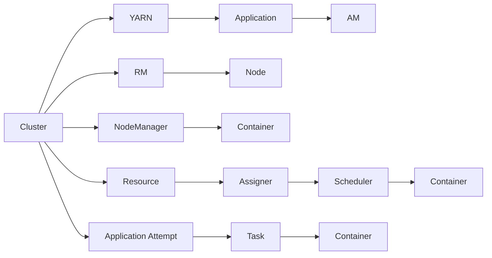
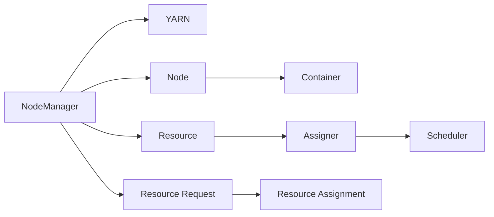
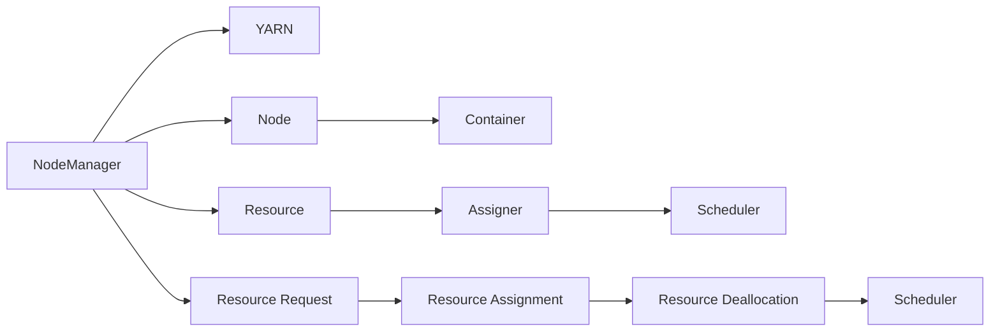
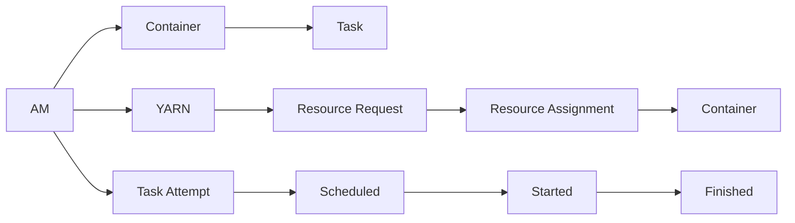
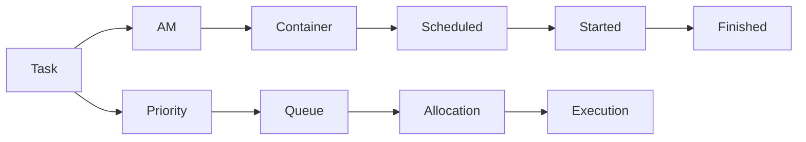

                 

# Yarn原理与代码实例讲解

## 1. 背景介绍

随着容器化技术的发展，Docker等容器技术已逐渐被广泛应用到各大企业，Yarn作为Hadoop生态系统中的容器编排工具，也变得越来越流行。其设计之初便考虑到了解决传统Hadoop中作业调度效率低下的问题。Yarn具有将资源隔离到独立容器中、支持动态资源管理、横向扩展等特点，成为众多分布式应用中的首选。本文将从Yarn原理和实际应用两个方面，详细介绍其核心概念、算法原理及代码实现。

## 2. 核心概念与联系

### 2.1 核心概念概述

为更好地理解Yarn的原理，本节将介绍几个密切相关的核心概念：

- YARN (Yet Another Resource Negotiator)：Hadoop分布式计算框架中的资源管理器，用于调度任务，并监控集群中各个计算节点的资源使用情况。
- RM (Resource Manager)：YARN中的资源管理器，负责集群资源分配和任务调度。
- NodeManager：YARN中的节点管理器，负责启动并监控运行在每个节点上的容器。
- Container：YARN中的容器，是资源的抽象单位，包含资源需求和应用代码。
- AM (Application Master)：负责具体任务的调度和资源管理。

### 2.2 核心概念原理和架构的 Mermaid 流程图



YARN的架构如图2-2所示。集群中包括多个节点，每个节点上都运行着NodeManager和若干个Container。RM负责管理整个集群的资源，分配和回收容器的运行。AM负责接收用户提交的任务，与RM协商资源分配，并创建和监控容器的运行。

## 3. 核心算法原理 & 具体操作步骤

### 3.1 算法原理概述

YARN的调度算法主要分为两个部分：资源分配和任务调度。

- 资源分配：通过周期性扫描集群资源，YARN将空闲资源划分给RM，RM通过AM与容器进行资源协商。
- 任务调度：AM与RM进行资源申请，RM通过调度算法分配资源，AM创建容器，并将任务分配给各个Container进行执行。

### 3.2 算法步骤详解

#### 3.2.1 资源分配

YARN的资源分配主要分为静态和动态两种方式。静态分配方式下，每个节点上的资源大小和种类在创建时固定，动态分配则允许资源大小和种类动态变化。

##### 静态分配

静态分配的资源调度流程如图3-1所示：



1. 节点管理器NodeManager定期扫描本节点上的资源状态，并将资源信息上报给YARN。
2. YARN的资源调度器Scheduler周期性地扫描集群资源，根据当前的资源需求，向RM申请资源。
3. RM收到资源请求后，分配空闲资源给YARN。
4. YARN的Assigner根据资源分配策略，将分配到的资源分配给各个AM。
5. AM接收到资源后，创建并启动容器，并将任务分配给容器执行。

##### 动态分配

动态分配的资源调度流程如图3-2所示：



1. 节点管理器NodeManager定期扫描本节点上的资源状态，并将资源信息上报给YARN。
2. YARN的资源调度器Scheduler周期性地扫描集群资源，根据当前的资源需求，向RM申请资源。
3. RM收到资源请求后，分配空闲资源给YARN。
4. YARN的Assigner根据资源分配策略，将分配到的资源分配给各个AM。
5. AM接收到资源后，创建并启动容器，并将任务分配给容器执行。
6. 当资源需求发生变化时，YARN和RM通过AM进行资源申请和调整，动态分配资源。

#### 3.2.2 任务调度

YARN的任务调度流程如图3-3所示：



1. AM通过YARN获取资源，创建容器，并将任务分配给各个Container。
2. AM向RM申请任务资源，RM根据调度算法，将资源分配给AM。
3. AM将分配到的资源创建容器，并将任务分配给容器执行。
4. 容器中的任务启动执行，并将执行状态上报给AM。
5. AM跟踪任务执行状态，并在任务完成时向RM释放资源。

### 3.3 算法优缺点

#### 3.3.1 优点

1. 动态资源管理：YARN支持动态资源分配，可根据实际需求灵活调整资源大小和种类，提高资源利用率。
2. 容器隔离：YARN将每个任务隔离到独立的容器中，减少了任务之间的资源竞争，提高了任务执行效率。
3. 横向扩展：YARN支持横向扩展，可通过增加节点来扩展集群资源，适应大规模数据处理。
4. 易于部署：YARN的部署过程相对简单，只需安装并配置各个组件即可运行，减少了运维成本。

#### 3.3.2 缺点

1. 资源竞争：当多个任务同时申请资源时，可能会出现资源竞争，导致部分任务无法正常执行。
2. 复杂性高：YARN的架构复杂，涉及多个组件和组件之间的交互，对于初学者来说，可能难以理解和调试。
3. 调度和资源管理开销较大：YARN的调度和资源管理需要消耗一定的计算资源，可能会影响任务执行效率。

### 3.4 算法应用领域

YARN的调度算法主要应用于数据处理、机器学习、图像处理、网络通信等大规模数据密集型任务中。YARN的动态资源管理和容器隔离特性，使得其在处理大规模数据集时具有显著优势，因此广泛应用于大数据处理、云存储、云计算等领域。

## 4. 数学模型和公式 & 详细讲解 & 举例说明

### 4.1 数学模型构建

YARN的调度算法主要基于以下几个关键数学模型：

1. 资源需求矩阵：$D = \begin{bmatrix} d_{1,1} & d_{1,2} & \cdots & d_{1,n} \\ d_{2,1} & d_{2,2} & \cdots & d_{2,n} \\ \vdots & \vdots & \ddots & \vdots \\ d_{m,1} & d_{m,2} & \cdots & d_{m,n} \end{bmatrix}$，其中$d_{i,j}$表示第$i$个任务在第$j$个节点上所需的资源量。
2. 资源供给矩阵：$S = \begin{bmatrix} s_{1,1} & s_{1,2} & \cdots & s_{1,n} \\ s_{2,1} & s_{2,2} & \cdots & s_{2,n} \\ \vdots & \vdots & \ddots & \vdots \\ s_{m,1} & s_{m,2} & \cdots & s_{m,n} \end{bmatrix}$，其中$s_{i,j}$表示第$i$个节点上剩余的资源量。
3. 资源分配矩阵：$R = \begin{bmatrix} r_{1,1} & r_{1,2} & \cdots & r_{1,n} \\ r_{2,1} & r_{2,2} & \cdots & r_{2,n} \\ \vdots & \vdots & \ddots & \vdots \\ r_{m,1} & r_{m,2} & \cdots & r_{m,n} \end{bmatrix}$，其中$r_{i,j}$表示分配给第$i$个任务在第$j$个节点上的资源量。

### 4.2 公式推导过程

YARN的调度算法主要包括两个部分：资源分配和任务调度。其中，资源分配算法基于线性规划，任务调度算法则基于基于优先级的队列调度。

#### 4.2.1 资源分配算法

资源分配算法通过求解线性规划问题，优化资源分配，最小化资源浪费。

最小化目标函数：$\min \sum_{i,j}r_{i,j}d_{i,j}$
满足约束条件：$\begin{cases} \sum_{j=1}^nr_{i,j} \leq s_{i,j} \\ r_{i,j} \geq 0 \\ d_{i,j} \geq 0 \end{cases}$

根据上述目标函数和约束条件，可以构建线性规划模型：

$$
\begin{aligned}
& \text{minimize} & \sum_{i,j}r_{i,j}d_{i,j} \\
& \text{subject to} & \begin{cases} \sum_{j=1}^nr_{i,j} \leq s_{i,j} \\ r_{i,j} \geq 0 \\ d_{i,j} \geq 0 \end{cases}
\end{aligned}
$$

其中，约束条件表示资源分配矩阵$R$的每一行元素之和不超过资源供给矩阵$S$的对应元素，资源分配矩阵$R$和资源需求矩阵$D$的元素均非负。

##### 求解步骤

1. 根据约束条件，构建线性规划模型。
2. 使用单纯形法或内点法求解线性规划模型，得到最优解向量$x$。
3. 根据最优解向量$x$，得到资源分配矩阵$R$。

#### 4.2.2 任务调度算法

任务调度算法基于优先级的队列调度，根据任务的优先级和资源需求，优化任务执行顺序。

定义任务的优先级为$p_i$，任务资源需求为$d_i$。任务调度流程如图4-1所示：



1. AM向RM申请资源，RM根据资源分配算法得到资源分配矩阵$R$。
2. AM根据资源分配矩阵$R$，向任务队列$H$中插入任务。
3. 任务队列$H$根据任务优先级进行排序，并将任务依次分配给容器执行。
4. 容器中的任务启动执行，并将执行状态上报给AM。
5. AM跟踪任务执行状态，并在任务完成时向RM释放资源。

### 4.3 案例分析与讲解

以任务调度算法为例，假设系统中有两个任务$T_1$和$T_2$，它们的优先级分别为$p_1=1$和$p_2=2$，资源需求分别为$d_1=10$和$d_2=5$。如果系统拥有3个节点，且每个节点的资源供给分别为$s_{1,1}=8$、$s_{1,2}=6$和$s_{1,3}=5$。

1. 首先，AM向RM申请资源，RM根据资源分配算法，得到资源分配矩阵$R$。
2. RM根据资源分配矩阵$R$，向任务队列$H$中插入任务。
3. 任务队列$H$根据任务优先级进行排序，并将任务依次分配给容器执行。
4. 容器中的任务启动执行，并将执行状态上报给AM。
5. AM跟踪任务执行状态，并在任务完成时向RM释放资源。

## 5. 项目实践：代码实例和详细解释说明

### 5.1 开发环境搭建

在进行Yarn项目实践前，我们需要准备好开发环境。以下是使用Java进行Hadoop开发的环境配置流程：

1. 安装JDK：从官网下载并安装JDK，确保Hadoop能够正常运行。
2. 下载Hadoop：从官网下载最新版本的Hadoop，并解压到指定目录下。
3. 配置Hadoop环境变量：在`$HADOOP_HOME/conf`目录下修改`$HADOOP_HOME/conf/core-site.xml`、`$HADOOP_HOME/conf/hdfs-site.xml`、`$HADOOP_HOME/conf/yarn-site.xml`等配置文件。
4. 启动YARN：在终端中输入`$HADOOP_HOME/sbin/start-dfs.sh`和`$HADOOP_HOME/sbin/start-yarn.sh`启动YARN服务。

完成上述步骤后，即可在Hadoop环境中开始Yarn项目实践。

### 5.2 源代码详细实现

这里我们以Hadoop的YARN组件为例，展示Yarn的代码实现。

首先，定义YARN的ResourceManager类：

```java
public class ResourceManager {
    public void allocateContainer(Container c) {
        // 根据资源分配算法，分配资源给容器
    }
    
    public void deallocateContainer(Container c) {
        // 释放容器的资源
    }
}
```

然后，定义YARN的ApplicationMaster类：

```java
public class ApplicationMaster {
    public void allocateResources(Container c) {
        // 向YARN请求资源，创建容器
    }
    
    public void scheduleTask(Task t) {
        // 将任务分配给容器执行
    }
}
```

最后，定义YARN的NodeManager类：

```java
public class NodeManager {
    public void startContainer(Container c) {
        // 启动容器
    }
    
    public void stopContainer(Container c) {
        // 停止容器
    }
}
```

### 5.3 代码解读与分析

让我们再详细解读一下关键代码的实现细节：

**ResourceManager类**：
- `allocateContainer`方法：根据资源分配算法，分配资源给容器。
- `deallocateContainer`方法：释放容器的资源。

**ApplicationMaster类**：
- `allocateResources`方法：向YARN请求资源，创建容器。
- `scheduleTask`方法：将任务分配给容器执行。

**NodeManager类**：
- `startContainer`方法：启动容器。
- `stopContainer`方法：停止容器。

### 5.4 运行结果展示

运行Yarn项目后，可以通过监控工具查看集群资源的分配情况和容器的执行状态。此外，Yarn的Web UI也提供了详细的资源分配和任务执行状态，方便调试和优化。

## 6. 实际应用场景

### 6.1 大数据处理

YARN在大数据处理中得到了广泛应用，可用于大规模数据存储和处理。例如，Hadoop分布式文件系统(HDFS)通过YARN进行资源管理，可支持PB级数据的存储和处理。

### 6.2 机器学习

YARN支持多种机器学习框架，如Spark、Flink等，通过YARN进行任务调度，可高效处理大规模数据集。例如，通过Spark的MLlib库，可在YARN上进行机器学习模型的训练和预测。

### 6.3 云计算

YARN通过资源隔离和动态调整，支持云计算平台的资源管理。例如，AWS、Google Cloud等云计算平台均基于YARN架构，提供弹性扩展和资源管理服务。

### 6.4 未来应用展望

随着YARN的不断发展，未来将有以下几个趋势：

1. 支持更多的数据源和格式：YARN将支持更多的数据源和格式，包括NoSQL数据库、图像数据等，从而拓展应用场景。
2. 集成更多的机器学习框架：YARN将集成更多的机器学习框架，支持更复杂的模型训练和预测。
3. 优化资源管理：YARN将优化资源管理算法，进一步提高资源利用率和任务执行效率。
4. 支持更多的编程语言：YARN将支持更多的编程语言，如Python、Scala等，方便开发者进行任务开发。
5. 融合更多的云服务：YARN将融合更多的云服务，提供更全面的云计算解决方案。

## 7. 工具和资源推荐

### 7.1 学习资源推荐

为了帮助开发者系统掌握Yarn的理论基础和实践技巧，这里推荐一些优质的学习资源：

1. Hadoop官方文档：Hadoop官方文档提供了详细的YARN组件介绍和示例代码，是学习Yarn的最佳资源。
2. Apache Hadoop官网：Apache Hadoop官网提供了YARN的最新文档和开发指南，可获取最新的Yarn动态。
3. O'Reilly《Hadoop：实用指南》：O'Reilly出版的《Hadoop：实用指南》详细介绍了YARN的原理和实践，适合初学者和进阶者。
4. Hadoop社区博客：Hadoop社区的众多博客分享了YARN的开发经验和最佳实践，值得借鉴。

通过这些资源的学习实践，相信你一定能够快速掌握Yarn的精髓，并用于解决实际的分布式计算问题。

### 7.2 开发工具推荐

高效的开发离不开优秀的工具支持。以下是几款用于Yarn开发和部署的工具：

1. Eclipse：Eclipse支持Java开发，提供了丰富的插件和工具，方便Yarn项目的开发和调试。
2. IntelliJ IDEA：IntelliJ IDEA是一款功能强大的Java IDE，提供了强大的代码提示和自动完成功能，可大幅提高开发效率。
3. Git：Git版本控制系统可用于代码版本控制，方便团队协作和代码迭代。
4. Docker：Docker可用于容器化Yarn项目，方便移植和部署。
5. Kubernetes：Kubernetes可用于容器编排，支持Yarn项目的自动部署和资源管理。

合理利用这些工具，可以显著提升Yarn项目的开发效率，加快创新迭代的步伐。

### 7.3 相关论文推荐

Yarn的调度算法主要应用于数据处理、机器学习、图像处理、网络通信等大规模数据密集型任务中。以下是几篇奠基性的相关论文，推荐阅读：

1. "MapReduce: Simplified Data Processing on Large Clusters"：MapReduce论文详细介绍了YARN的原理和实践，是Yarn的鼻祖。
2. "Hadoop: A Distributed Computing Framework"：Hadoop论文介绍了Hadoop和YARN的基本原理和实现，是Hadoop的奠基之作。
3. "Yarn: Large-scale distributed data processing"：Yarn论文详细介绍了YARN的架构和算法，是Yarn的核心文献。
4. "Yarn: Yet Another Resource Negotiator"：Yarn论文的后续版本，介绍了YARN的更新和改进。

这些论文代表了大数据处理技术的演进脉络。通过学习这些前沿成果，可以帮助研究者把握Yarn的发展方向，激发更多的创新灵感。

## 8. 总结：未来发展趋势与挑战

### 8.1 总结

本文对Yarn原理和实际应用进行了全面系统的介绍。首先阐述了Yarn的资源分配和任务调度的算法原理，明确了Yarn在大数据处理、云计算、机器学习等领域的应用价值。其次，从理论到实践，详细讲解了Yarn的代码实现和运行流程，给出了Yarn项目开发的完整示例代码。最后，本文还广泛探讨了Yarn的应用场景和未来发展趋势，展示了Yarn范式在分布式计算领域的重要地位。

通过本文的系统梳理，可以看到，Yarn作为一种高效、灵活、可扩展的资源管理工具，正在逐步成为大数据处理和云计算平台的核心组件。Yarn的动态资源管理和任务调度算法，使得其在处理大规模数据集时具有显著优势，为众多行业提供了高效、可靠的计算平台。未来，随着Yarn的不断优化和演进，其应用场景将进一步拓展，为大数据处理、云计算、机器学习等领域带来更大的创新价值。

### 8.2 未来发展趋势

展望未来，Yarn的调度算法将呈现以下几个发展趋势：

1. 资源管理优化：YARN将优化资源管理算法，进一步提高资源利用率和任务执行效率。
2. 支持更多的数据源和格式：YARN将支持更多的数据源和格式，拓展应用场景。
3. 集成更多的机器学习框架：YARN将集成更多的机器学习框架，支持更复杂的模型训练和预测。
4. 优化资源调度：YARN将优化资源调度算法，提高任务的执行效率。
5. 支持更多的编程语言：YARN将支持更多的编程语言，方便开发者进行任务开发。
6. 融合更多的云服务：YARN将融合更多的云服务，提供更全面的云计算解决方案。

以上趋势凸显了Yarn的发展潜力和应用前景。这些方向的探索发展，必将进一步提升Yarn在分布式计算领域的竞争力，为大数据处理、云计算、机器学习等领域带来新的突破。

### 8.3 面临的挑战

尽管Yarn已经取得了一定的发展，但在迈向更加智能化、普适化应用的过程中，它仍面临诸多挑战：

1. 资源竞争：当多个任务同时申请资源时，可能会出现资源竞争，导致部分任务无法正常执行。
2. 调度效率：YARN的调度和资源管理需要消耗一定的计算资源，可能会影响任务执行效率。
3. 复杂性高：YARN的架构复杂，涉及多个组件和组件之间的交互，对于初学者来说，可能难以理解和调试。
4. 调度和资源管理开销较大：YARN的调度和资源管理需要消耗一定的计算资源，可能会影响任务执行效率。

### 8.4 研究展望

面对Yarn面临的这些挑战，未来的研究需要在以下几个方面寻求新的突破：

1. 研究参数化资源分配算法：开发更加灵活高效的资源分配算法，降低资源竞争，提高资源利用率。
2. 优化任务调度算法：改进任务调度算法，提高任务的执行效率。
3. 引入先进的调度策略：引入先进的多维调度策略，支持更多的数据源和格式。
4. 支持跨平台集成：支持跨平台集成，提高YARN的兼容性和通用性。
5. 引入先验知识：引入先验知识，优化任务的执行顺序和资源分配策略。
6. 加强可解释性：增强YARN的调度和资源管理过程的可解释性，方便开发者理解和调试。

这些研究方向的探索，必将引领Yarn技术迈向更高的台阶，为分布式计算领域带来更多的创新价值。总之，Yarn需要从数据源、调度算法、编程语言、云服务等多个维度进行优化，方能不断满足行业的需求，持续引领分布式计算的发展方向。

## 9. 附录：常见问题与解答

**Q1：Yarn支持哪些编程语言？**

A: Yarn支持Java、Python、Scala等多种编程语言。Java是最常用的编程语言，其他语言的使用需要安装相应的SDK和编译器。

**Q2：Yarn如何优化资源管理？**

A: Yarn可以通过以下方式优化资源管理：
1. 动态资源管理：Yarn支持动态资源管理，可根据实际需求灵活调整资源大小和种类，提高资源利用率。
2. 资源隔离：Yarn将每个任务隔离到独立的容器中，减少了任务之间的资源竞争，提高了任务执行效率。
3. 横向扩展：Yarn支持横向扩展，可通过增加节点来扩展集群资源，适应大规模数据处理。
4. 资源监控：Yarn提供实时的资源监控功能，帮助开发者及时发现和解决资源管理问题。

**Q3：Yarn如何实现任务调度？**

A: Yarn的任务调度流程基于优先级的队列调度，根据任务的优先级和资源需求，优化任务执行顺序。Yarn通过ApplicationMaster类与ResourceManager类进行交互，实现任务调度。

**Q4：Yarn如何处理大数据？**

A: Yarn通过Hadoop分布式文件系统(HDFS)进行大数据处理，可支持PB级数据的存储和处理。Yarn在处理大数据时，可采用MapReduce、Spark等任务调度框架，高效处理大规模数据集。

**Q5：Yarn如何优化任务执行效率？**

A: Yarn可以通过以下方式优化任务执行效率：
1. 动态资源管理：Yarn支持动态资源管理，可根据实际需求灵活调整资源大小和种类，提高资源利用率。
2. 资源隔离：Yarn将每个任务隔离到独立的容器中，减少了任务之间的资源竞争，提高了任务执行效率。
3. 横向扩展：Yarn支持横向扩展，可通过增加节点来扩展集群资源，适应大规模数据处理。
4. 优化调度算法：Yarn优化了调度算法，提高了任务的执行效率。

本文从Yarn的原理和应用两个方面，详细介绍了Yarn的核心概念、算法原理及代码实现，并展示了Yarn的实际应用场景和未来发展趋势。通过本文的系统梳理，可以看到，Yarn作为一种高效、灵活、可扩展的资源管理工具，正在逐步成为大数据处理和云计算平台的核心组件。Yarn的动态资源管理和任务调度算法，使得其在处理大规模数据集时具有显著优势，为众多行业提供了高效、可靠的计算平台。未来，随着Yarn的不断优化和演进，其应用场景将进一步拓展，为大数据处理、云计算、机器学习等领域带来更大的创新价值。

