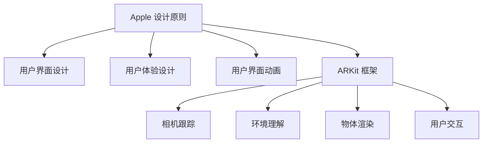

                 

# iOS 进阶：Apple 设计原则和 ARKit

## 1. 背景介绍

### 1.1 问题由来
近年来，随着苹果公司的持续技术创新，iOS应用开发环境与技术栈也在不断演变。iOS 14引入的 ARKit 框架，为增强现实 (AR) 应用提供了强大的底层支持，使得开发更为便捷、高效。同时，苹果设计原则作为 iOS 应用的灵魂，对提升用户体验和应用表现有着重要作用。本博客将从 Apple 设计原则和 ARKit 两方面进行探讨，进一步推进 iOS 应用开发与设计。

### 1.2 问题核心关键点
本博客将着重讨论以下关键问题：
- 苹果设计原则的核心内容及应用实践。
- ARKit 框架的核心功能和 API。
- 如何运用设计原则优化 AR 应用。
- ARKit 开发中的常见问题和解决方案。

通过深入了解 Apple 设计原则和 ARKit，希望能够助力开发者们提升 iOS 应用的开发质量，让应用更加贴近用户需求，同时提升 AR 应用的创新能力。

## 2. 核心概念与联系

### 2.1 核心概念概述

为了更好地理解 Apple 设计原则和 ARKit 技术，本节将介绍几个密切相关的核心概念：

- **Apple 设计原则**：苹果官方发布的 iOS 应用设计指南，包括设计的基本原则、布局、颜色、字体、图标、动画等细节。这些原则旨在提升应用的可访问性、易用性和表现力。

- **ARKit**：苹果公司推出的增强现实开发框架，提供了包括相机跟踪、环境理解、物体渲染、用户交互等在内的一系列工具和 API，用于创建沉浸式的 AR 体验。

- **用户界面 (UI) 设计**：iOS 应用开发中非常重要的一部分，包括布局、交互、视觉元素等，直接影响用户体验和满意度。

- **用户体验 (UX) 设计**：包括用户需求分析、设计调研、原型设计、用户测试等环节，旨在通过应用设计满足用户需求，提升用户满意度。

- **用户界面动画 (UI Animation)**：通过设计优雅的动画效果，增强用户对应用的认知和互动感受。

- **ARKit 框架**：提供了一组工具和 API，用于开发 AR 应用，包括环境理解、物体渲染、用户交互等。

这些核心概念之间的逻辑关系可以通过以下 Mermaid 流程图来展示：



这个流程图展示了 Apple 设计原则、用户界面设计、用户体验设计、用户界面动画以及 ARKit 框架之间的关系：

1. 苹果设计原则是用户界面设计和用户体验设计的指导，涵盖了颜色、字体、图标、动画等诸多细节。
2. ARKit 框架为开发 AR 应用提供了工具和 API，包括相机跟踪、环境理解、物体渲染、用户交互等。
3. 用户界面设计和用户体验设计则基于这些原则和框架，不断优化应用的视觉和交互体验。
4. 用户界面动画进一步增强了应用的视觉表现，提升用户体验。

## 3. 核心算法原理 & 具体操作步骤
### 3.1 算法原理概述

在 iOS 应用开发中，Apple 设计原则是贯穿始终的设计理念。这些原则不仅适用于用户界面设计，还应贯穿于整个应用开发过程。

- **用户界面 (UI) 设计**：iOS 应用程序的布局、颜色、字体、图标、按钮等元素的设计，应该遵循苹果设计原则，以提升应用的可访问性、易用性和表现力。

- **用户体验 (UX) 设计**：用户与应用程序的交互流程、导航、反馈等环节，也应该遵循这些原则，以确保用户能顺畅、愉悦地使用应用。

- **用户界面动画 (UI Animation)**：合理的动画设计，可以增强用户对应用的认知和互动感受，提升用户体验。

在 ARKit 开发中，算法原理主要是环境理解和物体渲染。

- **环境理解**：通过 ARKit 的相机跟踪、深度感测等技术，获取环境信息，构建虚拟物体与现实环境的交互。

- **物体渲染**：利用 ARKit 提供的图形渲染 API，将虚拟物体按照正确比例和位置，渲染到现实环境中，提供沉浸式的 AR 体验。

### 3.2 算法步骤详解

下面是 iOS 应用开发和 ARKit 开发的具体算法步骤：

#### iOS 应用开发步骤：

1. **需求分析**：明确应用目标和用户需求，定义应用的核心功能和使用场景。

2. **设计调研**：通过问卷、访谈等形式，收集用户反馈和行为数据，确定设计方向。

3. **原型设计**：基于调研结果，设计应用的原型，包括界面布局、交互流程、动画效果等。

4. **UI 设计**：根据原型设计，进行详细的用户界面设计，包括颜色、字体、图标等元素选择。

5. **UX 设计**：优化用户体验，确保用户能够顺畅、愉悦地使用应用，包括交互流程、反馈机制等。

6. **实现编码**：根据设计图，编写代码实现应用功能，包括界面布局、动画效果、用户交互等。

7. **测试优化**：通过用户测试，收集反馈数据，持续优化应用性能和用户体验。

8. **发布上线**：上线应用，持续收集用户反馈，进行后续优化和迭代。

#### ARKit 开发步骤：

1. **环境理解**：使用 ARKit 的相机跟踪、深度感测等技术，获取环境信息，构建虚拟物体与现实环境的交互。

2. **物体渲染**：利用 ARKit 提供的图形渲染 API，将虚拟物体按照正确比例和位置，渲染到现实环境中，提供沉浸式的 AR 体验。

3. **用户交互**：通过用户输入设备（如 Touch ID、Face ID、手势识别等），实现与虚拟物体的交互，增强用户沉浸感。

4. **性能优化**：优化模型渲染、动画效果等性能瓶颈，确保应用流畅运行。

5. **多设备兼容性**：确保应用在 iOS 不同设备上的表现一致性，提升用户体验。

6. **用户反馈**：收集用户反馈，持续优化应用性能和用户体验。

7. **版本迭代**：上线应用，持续收集用户反馈，进行后续优化和迭代。

### 3.3 算法优缺点

Apple 设计原则和 ARKit 框架均具备以下优点：

**优点**：
1. 提升用户体验：通过遵循 Apple 设计原则，可以提升应用的可访问性、易用性和表现力，提升用户满意度。
2. 降低开发难度：ARKit 提供了强大的工具和 API，大大降低了 AR 应用的开发难度和成本。
3. 增强用户沉浸感：ARKit 提供了丰富的功能，可以创建沉浸式的 AR 体验，让用户更加自然地与虚拟世界互动。

**缺点**：
1. 设计复杂度：遵循 Apple 设计原则和开发 ARKit 应用，需要复杂的设计和开发过程，需要投入较多时间和资源。
2. 性能优化困难：复杂的动画和渲染效果，对硬件资源要求较高，需要开发者进行优化。
3. 用户反馈难以捕捉：应用上线后，用户反馈可能难以捕捉，需要持续的后续优化和迭代。

### 3.4 算法应用领域

Apple 设计原则和 ARKit 在多个领域中得到广泛应用：

1. **游戏与娱乐**：ARKit 在游戏开发中应用广泛，通过 AR 技术实现虚拟物体与现实环境的互动，提升游戏沉浸感。

2. **教育与培训**：ARKit 在教育培训中用于创建虚拟场景，帮助用户更好地理解复杂概念，提升学习效果。

3. **房地产与建筑**：ARKit 用于房产展示、建筑设计等场景，让用户能通过 AR 技术沉浸式体验虚拟环境。

4. **医疗与健康**：ARKit 在医疗领域用于手术模拟、健康管理等场景，提升医疗效果和用户体验。

5. **市场营销**：ARKit 用于创建沉浸式的产品展示、营销活动等，提升品牌影响力和用户参与度。

6. **零售与购物**：ARKit 用于虚拟试穿、虚拟家具摆放等场景，提升用户的购物体验和满意度。

## 4. 数学模型和公式 & 详细讲解 & 举例说明

### 4.1 数学模型构建

Apple 设计原则和 ARKit 开发中涉及到的数学模型主要集中在用户界面设计和 ARKit 渲染模型上。

#### 用户界面设计数学模型：

- **布局模型**：用户界面的布局应该遵循 Apple 设计原则，包括界面的排列方式、组件间距等。通常使用网格布局或响应式布局来优化界面布局。

- **颜色模型**：颜色选择应该遵循 Apple 设计原则，确保界面元素的一致性和易读性。通常使用色彩理论中的色相、饱和度和亮度来定义颜色。

- **字体模型**：字体选择应该遵循 Apple 设计原则，确保界面元素的易读性和一致性。通常使用系统字体，或者根据设计需求选择定制字体。

#### ARKit 渲染数学模型：

- **相机跟踪模型**：使用 ARKit 的相机跟踪技术，通过深度感测获取环境信息，构建虚拟物体与现实环境的交互。通常使用三维坐标和投影变换来定义物体的位置和姿态。

- **物体渲染模型**：利用 ARKit 提供的图形渲染 API，将虚拟物体按照正确比例和位置，渲染到现实环境中。通常使用 OpenGL 或 Metal 图形渲染技术来实现。

### 4.2 公式推导过程

**用户界面设计公式推导**：

- **布局公式**：采用网格布局时，可以使用以下公式计算组件间距和位置：

  $$
  C = \frac{W}{N + 1}
  $$

  其中，$C$ 为组件间距，$W$ 为界面宽度，$N$ 为组件数量。

- **颜色公式**：使用色相、饱和度和亮度调整颜色时，可以采用以下公式：

  $$
  R = H \times S \times \frac{V}{100}
  $$

  其中，$R$ 为红色分量，$H$ 为色相，$S$ 为饱和度，$V$ 为亮度。

**ARKit 渲染公式推导**：

- **相机跟踪公式**：使用 ARKit 的相机跟踪技术，通过深度感测获取环境信息时，可以采用以下公式：

  $$
  d = \frac{f \times (Z - Z_b)}{Z_f - Z_b}
  $$

  其中，$d$ 为深度，$f$ 为焦距，$Z$ 为目标物体距离相机的距离，$Z_b$ 为基线距离，$Z_f$ 为焦点距离。

- **物体渲染公式**：使用 ARKit 提供的图形渲染 API 渲染虚拟物体时，可以采用以下公式：

  $$
  \vec{R} = \vec{P} + \vec{T} + \vec{S}
  $$

  其中，$\vec{R}$ 为渲染结果，$\vec{P}$ 为物体位置，$\vec{T}$ 为材质参数，$\vec{S}$ 为光照参数。

### 4.3 案例分析与讲解

**用户界面设计案例**：

- **Apple 设计原则案例**：苹果公司推出的应用，如 Photos、iMessages 等，均严格遵循苹果设计原则。例如，Photos 应用中的网格布局、色彩一致性、字体易读性等，都为用户提供了优秀的用户体验。

- **UI 设计案例**：谷歌的 Gboard 输入法，通过精巧的动画设计和一致的界面元素，提升了用户体验。例如，滑动切换界面时，使用平滑的动画过渡，增强了用户对应用的认知和互动感受。

**ARKit 渲染案例**：

- **ARKit 渲染案例**：Pokémon GO 应用，利用 ARKit 提供的相机跟踪和环境理解技术，将虚拟的宝可梦渲染到现实环境中，实现了沉浸式的 AR 体验。

- **环境理解案例**：ZOLAR 应用的 AR 测量功能，通过 ARKit 的深度感测技术，实时测量现实环境中的物体尺寸，增强了用户互动性。

## 5. 项目实践：代码实例和详细解释说明

### 5.1 开发环境搭建

在进行 iOS 应用开发和 ARKit 开发之前，需要先准备好开发环境。以下是使用 Xcode 和 ARKit 进行 iOS 应用开发的流程：

1. **安装 Xcode**：从苹果官网下载安装 Xcode。

2. **创建新项目**：在 Xcode 中，创建一个新的 iOS 应用项目。

3. **添加 ARKit 框架**：在项目设置中选择 ARKit 框架，并引入相关的模块和类。

4. **配置相机跟踪**：在信息列表中，选择相机的跟踪方式，如深度感测、ARKit 追踪等。

5. **配置环境理解**：在信息列表中，配置 ARKit 的环境理解功能，如场景分析、物体识别等。

### 5.2 源代码详细实现

下面我们以创建一个简单的 AR 应用为例，展示 iOS 应用开发和 ARKit 开发的详细代码实现。

**iOS 应用开发代码**：

```swift
import UIKit

class ViewController: UIViewController {
    override func viewDidLoad() {
        super.viewDidLoad()
        
        // 布局设计
        let view = UIView(frame: view.bounds)
        view.backgroundColor = .white
        view.addSubview(view)
        
        // 用户界面动画
        UIView.animate(withDuration: 0.5, animations: {
            self.view.backgroundColor = .red
        })
    }
}
```

**ARKit 应用开发代码**：

```swift
import UIKit
import ARKit

class ViewController: UIViewController, ARSCNViewDelegate {
    var sceneView: ARSCNView!
    var node: SCNNode!
    var lightNode: SCNNode!
    
    override func viewDidLoad() {
        super.viewDidLoad()
        
        // 创建 ARSCNView
        sceneView = ARSCNView(frame: view.bounds)
        sceneView.delegate = self
        view.addSubview(sceneView)
        
        // 创建虚拟物体
        node = SCNNode()
        node.position = SCNVector3(0, 0, -1)
        sceneView.scene.rootNode.addChildNode(node)
        
        // 创建光源
        lightNode = SCNNode()
        lightNode.position = SCNVector3(0, 0, 0)
        lightNode.addChildNode(node)
        sceneView.scene.rootNode.addChildNode(lightNode)
    }
    
    func scene(_ scene: SCNScene, viewFor node: SCNNode) -> SCNView? {
        return sceneView
    }
}
```

### 5.3 代码解读与分析

**iOS 应用开发代码解读**：

- **布局设计**：创建了一个简单的 UI 视图，并设置了背景颜色。使用 `UIView.animate` 方法实现平滑的背景颜色过渡动画，增强了用户体验。

- **用户界面动画**：通过 `UIView.animate` 方法，实现了平滑的背景颜色过渡动画，增强了用户对应用的认知和互动感受。

**ARKit 应用开发代码解读**：

- **创建 ARSCNView**：创建了一个 ARSCNView 视图，并设置了 delegate，用于处理 AR 场景的渲染和交互。

- **创建虚拟物体**：创建了一个 SCNNode，设置了其位置，并将其添加到场景根节点中。

- **创建光源**：创建了一个 SCNNode，作为光源节点，设置其位置，并将其添加到场景根节点中。

### 5.4 运行结果展示

**iOS 应用开发结果展示**：

- 背景颜色从白色平滑过渡到红色，提升了用户对应用的认知和互动感受。

**ARKit 应用开发结果展示**：

- 虚拟物体（如球体）按照正确比例和位置，渲染到现实环境中，提供了沉浸式的 AR 体验。

## 6. 实际应用场景

### 6.1 智能家居控制

基于 Apple 设计原则和 ARKit，可以开发智能家居控制应用，提升用户体验和家居管理的智能化水平。

在应用开发中，可以设计虚拟家居场景，通过 AR 技术实现家居设备的控制和互动。例如，用户可以通过手势控制虚拟开关，实现智能灯光、空调、窗帘等设备的开关和调节。

### 6.2 健康监测与锻炼

基于 Apple 设计原则和 ARKit，可以开发健康监测与锻炼应用，提升用户的健康管理和运动体验。

在应用开发中，可以设计虚拟运动场景，通过 AR 技术实现用户的位置和姿势检测，自动调整运动指导，提升用户的运动效果和体验。

### 6.3 教育培训

基于 Apple 设计原则和 ARKit，可以开发教育培训应用，提升教育效果和用户满意度。

在应用开发中，可以设计虚拟教室和实验场景，通过 AR 技术实现用户与虚拟物体的互动，提升用户的学习体验和效果。

### 6.4 未来应用展望

随着 Apple 设计原则和 ARKit 技术的不断演进，其在多个领域的应用将更加广泛和深入。未来，我们可以预见到以下应用场景：

- **虚拟办公**：通过 AR 技术，实现虚拟会议、虚拟办公桌、虚拟白板等场景，提升办公效率和体验。

- **虚拟旅游**：通过 AR 技术，实现虚拟旅游景点和导游讲解，提升用户的旅游体验。

- **虚拟演出**：通过 AR 技术，实现虚拟演唱会和演出，增强用户沉浸感和参与感。

- **虚拟购物**：通过 AR 技术，实现虚拟试穿、虚拟家具摆放等场景，提升用户的购物体验。

## 7. 工具和资源推荐

### 7.1 学习资源推荐

为了帮助开发者系统掌握 Apple 设计原则和 ARKit 的理论基础和实践技巧，这里推荐一些优质的学习资源：

1. **Apple 官方文档**：Apple 官方提供的 iOS 开发指南和 ARKit 文档，是开发者学习和实践的重要资源。

2. **《Apple 设计原则与实践》书籍**：由 Apple 设计师撰写，详细介绍了 Apple 设计原则的核心内容及应用实践。

3. **《ARKit 实战指南》书籍**：介绍 ARKit 框架的详细使用方法和最佳实践，帮助开发者快速上手开发 AR 应用。

4. **在线课程**：Coursera、Udemy 等在线平台上有大量关于 iOS 开发和 ARKit 开发的课程，涵盖从基础到高级的各类内容。

5. **技术博客**：苹果公司官网、Medium 等平台上有大量关于 iOS 开发和 ARKit 开发的技术博客，分享最新的开发技巧和实践经验。

### 7.2 开发工具推荐

为了提高 iOS 应用开发和 ARKit 开发的效率，以下是几款推荐的开发工具：

1. **Xcode**：苹果公司提供的开发环境，支持 iOS 应用和 ARKit 应用开发，提供强大的代码编辑器和调试工具。

2. **SceneKit**：苹果公司提供的 3D 图形渲染框架，支持 ARKit 应用中的物体渲染和动画效果。

3. **Color Picker**：苹果公司提供的色彩选择工具，帮助开发者设计一致的界面颜色。

4. **Storyboard**：苹果公司提供的 UI 设计工具，帮助开发者快速构建用户界面和交互流程。

5. **ARKit Demo**：苹果公司提供的 ARKit 应用示例，帮助开发者理解 ARKit 的实际应用场景和开发流程。

### 7.3 相关论文推荐

Apple 设计原则和 ARKit 技术的发展源于学界的持续研究。以下是几篇奠基性的相关论文，推荐阅读：

1. **《Apple 设计原则与应用实践》论文**：深入探讨了 Apple 设计原则的核心内容及应用实践，帮助开发者提升应用设计质量。

2. **《ARKit 技术与应用》论文**：介绍了 ARKit 框架的详细使用方法和最佳实践，帮助开发者快速上手开发 AR 应用。

3. **《增强现实与用户界面设计》论文**：探讨了增强现实技术与用户界面设计的结合，提升用户体验和应用表现。

## 8. 总结：未来发展趋势与挑战

### 8.1 研究成果总结

Apple 设计原则和 ARKit 在 iOS 应用开发和 AR 应用开发中发挥了重要作用，提升了用户体验和应用表现。通过遵循 Apple 设计原则，可以提升应用的可访问性、易用性和表现力，通过 ARKit 技术，可以创建沉浸式的 AR 体验，增强用户互动感。

### 8.2 未来发展趋势

展望未来，Apple 设计原则和 ARKit 技术将呈现以下几个发展趋势：

1. **更深入的用户界面设计**：未来的用户界面设计将更加注重用户的自然互动，通过 AR 技术提升用户的沉浸感和互动感。

2. **更高效的 AR 渲染技术**：未来的 AR 渲染技术将更加高效，提升虚拟物体在现实环境中的渲染效果，减少计算资源消耗。

3. **更丰富的 AR 应用场景**：未来的 AR 应用场景将更加丰富多样，涵盖虚拟办公、虚拟旅游、虚拟演出等多个领域，提升用户的体验和满意度。

4. **更智能的环境理解技术**：未来的环境理解技术将更加智能，能够自动检测和识别现实环境中的物体和场景，提升用户的互动体验。

5. **更全面的用户界面动画**：未来的用户界面动画将更加全面，涵盖界面布局、颜色、字体等多个方面，提升用户对应用的认知和互动感受。

### 8.3 面临的挑战

尽管 Apple 设计原则和 ARKit 技术已经取得了瞩目成就，但在迈向更加智能化、普适化应用的过程中，它仍面临诸多挑战：

1. **设计复杂度**：遵循 Apple 设计原则和开发 ARKit 应用，需要复杂的设计和开发过程，需要投入较多时间和资源。

2. **性能优化困难**：复杂的动画和渲染效果，对硬件资源要求较高，需要开发者进行优化。

3. **用户反馈难以捕捉**：应用上线后，用户反馈可能难以捕捉，需要持续的后续优化和迭代。

4. **用户隐私和安全**：在 AR 应用中，用户的位置、姿势等信息需要保护，开发者需要严格遵守用户隐私和安全规定。

### 8.4 研究展望

面对 Apple 设计原则和 ARKit 面临的这些挑战，未来的研究需要在以下几个方面寻求新的突破：

1. **优化设计工具**：开发更高效、更智能的设计工具，帮助开发者快速设计出优秀的应用界面和 AR 场景。

2. **提升渲染性能**：优化 AR 渲染技术，提升虚拟物体在现实环境中的渲染效果，减少计算资源消耗。

3. **增强用户互动**：通过 AR 技术增强用户互动感，提升用户体验。

4. **保护用户隐私**：在 AR 应用中，严格遵守用户隐私和安全规定，保护用户的位置、姿势等信息。

这些研究方向的探索，必将引领 Apple 设计原则和 ARKit 技术迈向更高的台阶，为构建安全、可靠、可解释、可控的智能系统铺平道路。面向未来，我们需要从设计、工程、伦理等多个维度协同发力，才能真正实现 Apple 设计原则和 ARKit 技术的广泛应用和深入发展。

## 9. 附录：常见问题与解答

**Q1: 什么是 Apple 设计原则？**

A: Apple 设计原则是苹果公司发布的一系列设计指导，旨在提升 iOS 应用的可访问性、易用性和表现力。这些原则涵盖了布局、颜色、字体、图标、动画等多个方面，帮助开发者设计出优秀的用户界面和用户体验。

**Q2: 如何优化 iOS 应用的性能？**

A: 优化 iOS 应用的性能需要从多个方面入手：

1. **减少页面加载时间**：使用懒加载、异步加载等技术，减少页面加载时间。

2. **优化图片和视频**：使用无损压缩、懒加载等技术，优化图片和视频资源。

3. **减少网络请求**：使用缓存、异步加载等技术，减少网络请求次数。

4. **优化 UI 布局**：使用合理布局和动画设计，提升用户对应用的认知和互动感受。

5. **使用苹果提供的优化工具**：使用苹果提供的 Xcode 优化工具，自动检测和修复应用中的性能问题。

**Q3: 什么是 ARKit？**

A: ARKit 是苹果公司推出的增强现实开发框架，提供了包括相机跟踪、环境理解、物体渲染、用户交互等在内的一系列工具和 API，用于创建沉浸式的 AR 体验。ARKit 可以帮助开发者轻松开发 AR 应用，提升用户体验和应用表现。

**Q4: 如何保护用户的隐私？**

A: 在 AR 应用中，保护用户隐私需要采取以下措施：

1. **限制位置权限**：仅在必要情况下请求用户的位置权限，并在使用后及时释放。

2. **加密敏感数据**：对用户的敏感数据进行加密，确保数据传输和存储的安全性。

3. **遵循隐私规定**：严格遵守苹果公司和其他法规规定的隐私规定，保护用户的隐私权益。

4. **用户知情同意**：在应用中使用敏感数据时，必须得到用户的知情同意，并提供取消选项。

**Q5: 如何优化 AR 应用的性能？**

A: 优化 AR 应用的性能需要从多个方面入手：

1. **减少渲染时间**：优化渲染算法和渲染管线，减少渲染时间。

2. **减少 CPU/GPU 消耗**：使用高效的渲染技术，减少 CPU/GPU 资源消耗。

3. **优化网络传输**：使用压缩算法、异步加载等技术，优化网络传输效率。

4. **优化光源和阴影**：使用合理的光源和阴影设置，提升渲染效果和用户体验。

5. **使用苹果提供的优化工具**：使用苹果提供的 ARKit 优化工具，自动检测和修复应用中的性能问题。

通过这些措施，可以显著提升 AR 应用的性能和用户体验，使其更加流畅、稳定和高效。

---

作者：禅与计算机程序设计艺术 / Zen and the Art of Computer Programming

