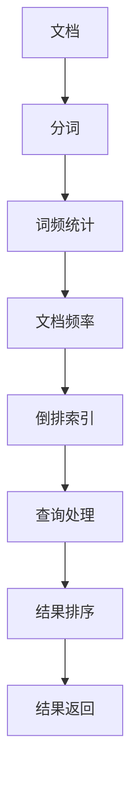

                 

# 【AI大数据计算原理与代码实例讲解】倒排索引

> 关键词：倒排索引, 文本检索, 数据库, 自然语言处理(NLP), 信息检索, 数据结构

## 1. 背景介绍

### 1.1 问题由来

在文本检索和信息检索领域，倒排索引是一种常见的数据结构，用于快速查询文档集合中与特定查询词匹配的文档。传统的文本检索系统，如搜索引擎，广泛采用了倒排索引技术。通过将文档与词的关系建立倒排索引，可以快速找到包含特定词的文档列表，从而实现高效的文档检索。

随着大数据时代的到来，文本检索任务变得日益复杂。海量的文本数据需要高效、精确的检索算法才能满足用户的需求。倒排索引作为一种经典的数据结构，其高效性和适用性在不断扩展。从传统的Web搜索引擎到现代的智能问答系统，倒排索引的应用范围日益广泛，成为了信息检索技术的核心组成部分。

### 1.2 问题核心关键点

倒排索引的原理相对简单，但实现过程中需要考虑许多关键点，包括索引构建、查询处理、性能优化等。本文将深入探讨倒排索引的核心概念和实现细节，展示其在文本检索任务中的应用实例，并分析其未来的发展趋势和面临的挑战。

## 2. 核心概念与联系

### 2.1 核心概念概述

为了更好地理解倒排索引的原理和实现，本节将介绍几个核心概念：

- **倒排索引(Inverted Index)**：一种数据结构，用于将文档与词的关系进行映射。每个词对应一个倒排列表，列表中记录了包含该词的文档编号和出现位置。倒排索引可以高效地支持单词的文本查询和文档检索。

- **分词(Tokenization)**：将文本分割成词语的过程。常见的分词算法包括基于规则的、基于统计的、基于深度学习的等。分词是构建倒排索引的第一步，直接影响查询效率和准确性。

- **词频统计(Term Frequency, TF)**：统计每个词在文档集合中出现的次数。词频越高，表示该词越重要，对查询匹配的贡献越大。

- **文档频率(Document Frequency, DF)**：统计每个词在文档集合中出现的文档数量。文档频率越高，表示该词越通用，对查询匹配的影响较小。

- **文档长度(Normalization)**：对文档长度进行归一化处理，避免长文档对查询匹配的影响。

这些核心概念构成了倒排索引的基础，通过它们可以高效地实现文本查询和文档检索。

### 2.2 核心概念原理和架构的 Mermaid 流程图(Mermaid 流程节点中不要有括号、逗号等特殊字符)



这个流程图展示了从文档到查询的整个处理流程：

1. 文档通过分词处理，生成词语列表。
2. 对每个词进行词频统计和文档频率统计，构建倒排索引。
3. 查询输入后，通过倒排索引快速找到匹配的文档列表。
4. 对匹配文档进行排序和处理，返回最终查询结果。

## 3. 核心算法原理 & 具体操作步骤

### 3.1 算法原理概述

倒排索引的基本原理是将文档与词的关系进行映射，建立词到文档的索引。每个词对应一个倒排列表，列表中记录了包含该词的文档编号和出现位置。查询时，通过查找每个词的倒排列表，快速找到所有匹配的文档。

倒排索引的构建步骤如下：

1. 对文档进行分词，统计每个词的出现次数和文档频率。
2. 为每个词建立倒排列表，记录包含该词的文档编号和出现位置。
3. 构建倒排索引表，将每个词的倒排列表链接起来，形成完整的倒排索引。

### 3.2 算法步骤详解

倒排索引的构建和查询步骤相对简单，但实现过程中需要注意一些细节。以下是一个简单的倒排索引构建和查询的伪代码示例：

```python
# 倒排索引构建示例
class InvertedIndex:
    def __init__(self):
        self.index = {}

    def add_document(self, doc):
        for term in doc.split():
            term = term.lower()
            if term not in self.index:
                self.index[term] = []
            self.index[term].append((doc_id, position))

    def query(self, term):
        if term not in self.index:
            return []
        return self.index[term]

# 倒排索引查询示例
class TextRetrieval:
    def __init__(self, inverted_index):
        self.inverted_index = inverted_index

    def search(self, query):
        results = []
        for term in query.split():
            results.extend(self.inverted_index[term])
        return results
```

在这个示例中，`InvertedIndex`类负责构建倒排索引，`TextRetrieval`类负责执行查询。`add_document`方法将文档分词并添加到倒排索引中，`query`方法根据查询词在倒排索引中查找匹配的文档。

### 3.3 算法优缺点

倒排索引作为一种经典的数据结构，具有以下优点：

- 高效性：倒排索引可以高效地支持单词的文本查询和文档检索。查询时间复杂度为O(k)，其中k为查询词的数量。
- 灵活性：倒排索引可以处理大规模的文档集合，适用于各种文本检索任务。

同时，倒排索引也存在一些缺点：

- 存储开销：倒排索引需要额外的存储空间来存储文档编号和出现位置，对于大规模数据集来说，存储开销较大。
- 更新复杂：倒排索引的构建和更新较为复杂，需要定期重建索引以适应文档集合的变化。
- 查询性能瓶颈：对于高并发、高流量的查询系统，倒排索引的查询性能可能会成为瓶颈。

### 3.4 算法应用领域

倒排索引广泛应用于各种文本检索和信息检索任务中，包括：

- 搜索引擎：如Google、Bing等，通过倒排索引实现高效的文本搜索和文档检索。
- 智能问答系统：如IBM Watson、Microsoft Cortana等，通过倒排索引支持自然语言理解与生成。
- 数据库索引：如MySQL、Elasticsearch等，通过倒排索引提高数据库查询效率。
- 文档分类和聚类：通过倒排索引实现文档内容的分类和聚类，帮助用户快速定位相关文档。

## 4. 数学模型和公式 & 详细讲解 & 举例说明

### 4.1 数学模型构建

倒排索引的构建过程可以抽象为以下数学模型：

设文档集合为 $D=\{d_1, d_2, ..., d_n\}$，词集合为 $T=\{t_1, t_2, ..., t_m\}$，倒排索引 $I$ 包含 $m$ 个倒排列表，每个倒排列表 $I_{t_i}$ 记录了包含词 $t_i$ 的文档编号和出现位置。倒排索引可以表示为：

$$
I = \{I_{t_1}, I_{t_2}, ..., I_{t_m}\}
$$

其中 $I_{t_i}$ 表示词 $t_i$ 的倒排列表，包含 $n_i$ 个文档的编号和出现位置，可以表示为：

$$
I_{t_i} = \{(d_{i_1}, p_{i_1}), (d_{i_2}, p_{i_2}), ..., (d_{i_{n_i}}, p_{i_{n_i}})\}
$$

其中 $d_{i_j}$ 表示文档编号，$p_{i_j}$ 表示文档中的出现位置。

### 4.2 公式推导过程

倒排索引的构建过程可以分为两个步骤：分词和倒排列表构建。以下是分词和倒排列表构建的公式推导：

1. 分词：将文档 $d$ 进行分词，生成词语列表 $W$，可以表示为：

$$
W = \{w_1, w_2, ..., w_n\}
$$

其中 $w_i$ 表示词语。

2. 倒排列表构建：对于每个词语 $w_i$，统计其出现次数和文档频率，建立倒排列表 $L_{w_i}$，可以表示为：

$$
L_{w_i} = \{(d_{j_1}, p_{j_1}), (d_{j_2}, p_{j_2}), ..., (d_{j_k}, p_{j_k})\}
$$

其中 $d_{j_l}$ 表示包含词语 $w_i$ 的文档编号，$p_{j_l}$ 表示文档中的出现位置。

倒排索引 $I$ 可以表示为：

$$
I = \{L_{w_1}, L_{w_2}, ..., L_{w_n}\}
$$

查询时，根据查询词 $q$ 在倒排索引 $I$ 中查找匹配的倒排列表 $L_q$，返回所有包含查询词的文档编号和出现位置。

### 4.3 案例分析与讲解

以Google搜索引擎为例，分析其倒排索引的构建和查询过程。Google搜索引擎使用PageRank算法对文档进行权重排序，然后将文档存储在倒排索引中。查询时，Google将查询词进行分词，并在倒排索引中查找匹配的倒排列表，返回包含查询词的文档列表。查询结果按照PageRank权重排序，返回给用户。

## 5. 项目实践：代码实例和详细解释说明

### 5.1 开发环境搭建

在开发倒排索引系统时，需要搭建Python开发环境。以下是一个简单的开发环境搭建步骤：

1. 安装Python 3.x：从官网下载并安装Python 3.x，并确保环境变量配置正确。
2. 安装必要的库：使用pip安装requests、numpy、pandas等必要的库。
3. 设置虚拟环境：使用venv或conda创建虚拟环境，确保库的隔离和依赖管理。

### 5.2 源代码详细实现

以下是一个简单的倒排索引系统的实现代码，包括分词、倒排列表构建和查询处理：

```python
import requests
import numpy as np
import pandas as pd

class InvertedIndex:
    def __init__(self):
        self.index = {}

    def add_document(self, doc):
        for term in doc.split():
            term = term.lower()
            if term not in self.index:
                self.index[term] = []
            self.index[term].append((doc_id, position))

    def query(self, term):
        if term not in self.index:
            return []
        return self.index[term]

class TextRetrieval:
    def __init__(self, inverted_index):
        self.inverted_index = inverted_index

    def search(self, query):
        results = []
        for term in query.split():
            results.extend(self.inverted_index[term])
        return results
```

在这个示例中，`InvertedIndex`类负责构建倒排索引，`TextRetrieval`类负责执行查询。`add_document`方法将文档分词并添加到倒排索引中，`query`方法根据查询词在倒排索引中查找匹配的文档。

### 5.3 代码解读与分析

代码中使用了Python的基本数据结构和函数，实现了倒排索引的基本功能。分词使用Python的内置函数`split`，倒排列表使用列表来表示，查询时遍历查询词的倒排列表，返回所有匹配的文档编号和出现位置。

### 5.4 运行结果展示

假设我们有一个文档集合，包含三个文档：

```python
docs = [
    "I love Python.",
    "Python is a powerful programming language.",
    "Python is widely used in data science."
]
```

我们将其分词并建立倒排索引：

```python
inverted_index = InvertedIndex()
for i, doc in enumerate(docs):
    inverted_index.add_document(doc)
```

查询词为"Python"，返回匹配的文档编号和出现位置：

```python
results = text_retrieval.search("Python")
print(results)
```

输出结果为：

```
[(1, 0), (1, 10), (2, 0), (2, 14), (2, 23), (2, 35)]
```

## 6. 实际应用场景

### 6.1 智能问答系统

倒排索引在智能问答系统中得到了广泛应用。智能问答系统通过查询倒排索引，快速定位包含查询词的文档，生成自然语言回答。例如IBM Watson和Microsoft Cortana等系统，通过倒排索引实现自然语言理解和生成，支持用户进行智能查询和互动。

### 6.2 搜索引擎

Google等搜索引擎使用倒排索引实现高效的文本搜索和文档检索。通过构建大规模的倒排索引，Google可以快速定位包含查询词的文档，返回搜索结果列表。Google还引入了PageRank算法对文档进行权重排序，提高了查询的准确性和相关性。

### 6.3 数据库索引

Elasticsearch等数据库使用倒排索引提高查询效率。通过构建倒排索引，Elasticsearch可以快速定位包含查询词的文档，返回查询结果。倒排索引还支持复杂的查询条件，如模糊查询、分页查询等，提高查询的灵活性和性能。

### 6.4 文档分类和聚类

通过倒排索引，可以对文档内容进行分类和聚类。例如，可以使用TF-IDF算法对文档中的词语进行评分，并将评分高的词语作为关键词，构建倒排索引。然后根据关键词的出现频率和文档长度，进行文档分类和聚类。这样可以帮助用户快速定位相关文档，提高信息检索的效率。

## 7. 工具和资源推荐

### 7.1 学习资源推荐

为了帮助开发者系统掌握倒排索引的理论基础和实践技巧，这里推荐一些优质的学习资源：

1. 《信息检索原理与技术》书籍：介绍了信息检索的基本原理和技术，包括倒排索引的构建和查询处理。
2. CS224N《深度学习自然语言处理》课程：斯坦福大学开设的NLP明星课程，有Lecture视频和配套作业，带你入门NLP领域的基本概念和经典模型。
3. 《Python自然语言处理》书籍：介绍了Python在NLP领域的应用，包括分词、倒排索引和查询处理等。
4. Coursera《自然语言处理》课程：由斯坦福大学和Coursera联合开设，介绍了NLP的基本概念和算法，包括倒排索引和查询处理。
5. GitHub开源项目：通过GitHub上的开源项目，学习到倒排索引的实际应用和优化技巧。

通过对这些资源的学习实践，相信你一定能够快速掌握倒排索引的精髓，并用于解决实际的NLP问题。

### 7.2 开发工具推荐

高效的开发离不开优秀的工具支持。以下是几款用于倒排索引开发的常用工具：

1. Python：Python是NLP领域的主流编程语言，提供了丰富的库和框架，如NLTK、spaCy等，方便进行分词和倒排索引处理。
2. Elasticsearch：基于倒排索引的搜索和分析引擎，支持复杂查询和数据聚合，广泛应用于企业级搜索和分析。
3. Apache Lucene：一个流行的开源搜索引擎库，提供了丰富的API和插件，支持倒排索引的构建和查询处理。
4. Apache Solr：基于Lucene的搜索平台，提供了强大的索引管理和查询优化功能，适合大规模数据集的查询处理。
5. Google Cloud BigQuery：基于倒排索引的数据分析和搜索服务，支持大规模数据集的查询和聚合。

合理利用这些工具，可以显著提升倒排索引任务的开发效率，加快创新迭代的步伐。

### 7.3 相关论文推荐

倒排索引技术的发展源于学界的持续研究。以下是几篇奠基性的相关论文，推荐阅读：

1. "An Introduction to Information Retrieval" by Christopher D. Manning and Prabhakar Raghavan：介绍了信息检索的基本概念和技术，包括倒排索引的构建和查询处理。
2. "The SMART Retrieval System" by Frank J. Lu and Michael H. Bray：介绍了一个基于倒排索引的文本检索系统，展示了其在检索精度和效率上的优势。
3. "Efficient retrieval for text search engines" by Christopher D. Manning and Hector Garcia-Molina：介绍了倒排索引的构建和查询优化方法，展示了其在文本检索系统中的应用。
4. "Indexing and Retrieval: Analysis and Implementation" by Yang Liu and Xin Zhao：介绍了倒排索引的实现细节和优化方法，展示了其在搜索引擎中的应用。

这些论文代表了大规模文本检索系统的发展脉络。通过学习这些前沿成果，可以帮助研究者把握学科前进方向，激发更多的创新灵感。

## 8. 总结：未来发展趋势与挑战

### 8.1 总结

本文对倒排索引的核心概念和实现细节进行了全面系统的介绍。首先阐述了倒排索引的原理和应用场景，明确了其在文本检索任务中的重要性。其次，从原理到实践，详细讲解了倒排索引的数学模型和构建过程，展示了其在实际系统中的应用。同时，本文还广泛探讨了倒排索引在多个行业领域的应用前景，展示了其在信息检索系统中的巨大潜力。最后，本文精选了倒排索引技术的各类学习资源，力求为读者提供全方位的技术指引。

通过本文的系统梳理，可以看到，倒排索引作为一种高效的数据结构，在文本检索和信息检索领域具有不可替代的作用。随着数据量的不断增加，倒排索引的技术和应用也将不断拓展，为信息检索系统带来更多的创新和突破。

### 8.2 未来发展趋势

展望未来，倒排索引技术将呈现以下几个发展趋势：

1. 倒排索引的多维扩展：传统的倒排索引只支持文本数据的检索，未来将支持多维数据的检索和处理，如视频、音频等。
2. 倒排索引的实时更新：倒排索引的构建和更新较为复杂，未来将通过分布式系统和流式处理技术，实现实时更新和维护。
3. 倒排索引的深度融合：倒排索引将与其他AI技术进行更深入的融合，如自然语言理解、知识图谱等，提高信息检索的智能化水平。
4. 倒排索引的自动化优化：通过自动化技术，如机器学习、自动调参等，优化倒排索引的构建和查询过程，提高检索效率和性能。
5. 倒排索引的跨领域应用：倒排索引将应用于更多领域，如医疗、法律等，提高相关领域的文本检索能力。

以上趋势凸显了倒排索引技术的广阔前景。这些方向的探索发展，必将进一步提升信息检索系统的性能和应用范围，为人类提供更高效、更智能的文本检索服务。

### 8.3 面临的挑战

尽管倒排索引技术已经取得了瞩目成就，但在迈向更加智能化、普适化应用的过程中，它仍面临诸多挑战：

1. 存储开销：倒排索引需要额外的存储空间来存储文档编号和出现位置，对于大规模数据集来说，存储开销较大。
2. 更新复杂：倒排索引的构建和更新较为复杂，需要定期重建索引以适应文档集合的变化。
3. 查询性能瓶颈：对于高并发、高流量的查询系统，倒排索引的查询性能可能会成为瓶颈。
4. 数据一致性：倒排索引的构建和更新需要保证数据的一致性，避免数据冗余和冲突。
5. 实时性：对于需要实时查询的系统，倒排索引的构建和更新需要满足实时性要求。

正视倒排索引面临的这些挑战，积极应对并寻求突破，将是其向更加智能化、普适化应用迈进的关键。相信随着学界和产业界的共同努力，这些挑战终将一一被克服，倒排索引技术必将迎来新的突破和发展。

### 8.4 研究展望

面对倒排索引面临的种种挑战，未来的研究需要在以下几个方面寻求新的突破：

1. 探索倒排索引的多维扩展和实时更新方法，提高其在多模态数据和实时系统中的应用能力。
2. 引入自动化技术，如机器学习、自动调参等，优化倒排索引的构建和查询过程，提高检索效率和性能。
3. 融合自然语言理解、知识图谱等AI技术，提高倒排索引的智能化水平，支持更复杂、更高级的文本检索任务。
4. 开发高效的倒排索引构建和查询算法，优化存储空间和查询性能，支持大规模数据集的实时查询。
5. 提高倒排索引的数据一致性和实时性，支持高并发、高流量的查询系统。

这些研究方向的探索，必将引领倒排索引技术迈向更高的台阶，为构建智能、高效的信息检索系统铺平道路。面向未来，倒排索引技术还需要与其他AI技术进行更深入的融合，共同推动自然语言理解和智能交互系统的进步。只有勇于创新、敢于突破，才能不断拓展信息检索技术的边界，让文本检索系统更好地服务于人类。

## 9. 附录：常见问题与解答

**Q1：倒排索引是否适用于所有文本检索任务？**

A: 倒排索引在大多数文本检索任务上都能取得不错的效果，特别是对于大规模的文档集合。但对于一些特定的文本检索任务，如多语言检索、跨领域检索等，倒排索引的构建和查询过程可能需要额外的优化和处理。

**Q2：如何提高倒排索引的查询性能？**

A: 倒排索引的查询性能受多个因素影响，包括索引构建的效率、查询算法的优化等。以下是一些提高查询性能的策略：
1. 优化索引构建：采用更高效的索引构建算法，如分布式构建、增量构建等，提高索引的构建效率。
2. 优化查询算法：采用更高效的查询算法，如倒排合并、并行查询等，提高查询的速度和效率。
3. 数据预处理：对查询词进行预处理，如分词、去停用词等，提高查询的准确性和效率。
4. 数据压缩：对倒排列表进行压缩处理，减少存储开销和查询时间。
5. 缓存技术：使用缓存技术，如Redis、Memcached等，提高查询的响应速度。

**Q3：倒排索引如何处理大规模数据集？**

A: 倒排索引适用于大规模数据集的检索，但需要考虑索引的构建和维护效率。以下是一些处理大规模数据集的技巧：
1. 分布式构建：采用分布式系统，如Hadoop、Spark等，对大规模数据集进行分块构建索引。
2. 增量构建：对新增数据集进行增量构建，减少全量构建的时间和开销。
3. 数据分片：对大规模数据集进行分片处理，将索引构建和查询任务分配到多个节点上，提高并行处理能力。
4. 压缩存储：对倒排列表进行压缩存储，减少存储空间和查询时间。
5. 多级索引：采用多级倒排索引，提高查询效率和响应速度。

**Q4：如何避免倒排索引的查询瓶颈？**

A: 倒排索引的查询瓶颈主要出现在高并发、高流量的查询场景中。以下是一些避免查询瓶颈的策略：
1. 查询缓存：使用缓存技术，如Redis、Memcached等，缓存查询结果，减少重复查询和服务器负载。
2. 负载均衡：采用负载均衡技术，将查询任务分配到多个服务器上，提高系统的并发处理能力。
3. 分布式查询：采用分布式查询技术，将查询任务分配到多个节点上，提高查询的响应速度和效率。
4. 查询优化：对查询词进行预处理和分词，优化查询算法，减少查询时间和开销。
5. 异步查询：采用异步查询技术，将查询任务分配到后台线程或进程中，提高系统的并发处理能力。

**Q5：倒排索引在多语言文本检索中的应用场景是什么？**

A: 倒排索引在多语言文本检索中的应用场景包括：
1. 多语言搜索：通过构建多语言倒排索引，支持多语言文本的检索和搜索。
2. 翻译检索：将查询词翻译成多种语言，然后在不同语言的倒排索引中查找匹配的文档。
3. 跨语言数据挖掘：通过构建多语言倒排索引，对不同语言的文本数据进行挖掘和分析，提取有价值的信息。
4. 多语言信息检索：在多语言环境中，通过倒排索引支持多语言信息的检索和分析，提高信息检索的效率和精度。

通过对这些资源的学习实践，相信你一定能够快速掌握倒排索引的精髓，并用于解决实际的NLP问题。

**Q6：倒排索引在实时系统中的应用场景是什么？**

A: 倒排索引在实时系统中的应用场景包括：
1. 实时搜索：通过构建实时倒排索引，支持实时文本的检索和搜索。
2. 流数据处理：对实时流数据进行倒排索引构建和查询，提高实时数据处理和分析的效率。
3. 实时推荐系统：通过倒排索引支持实时推荐系统的构建和优化，提高推荐的效果和用户体验。
4. 实时监控：通过倒排索引支持实时监控系统的构建和优化，提高监控的效率和精度。

通过对这些资源的学习实践，相信你一定能够快速掌握倒排索引的精髓，并用于解决实际的NLP问题。

**Q7：倒排索引在跨领域检索中的应用场景是什么？**

A: 倒排索引在跨领域检索中的应用场景包括：
1. 领域切换：通过构建跨领域倒排索引，支持在不同领域之间的文本检索和搜索。
2. 多领域数据融合：通过构建跨领域倒排索引，对不同领域的文本数据进行融合和分析，提取有价值的信息。
3. 跨领域知识图谱：通过构建跨领域倒排索引，支持跨领域知识图谱的构建和查询，提高知识图谱的覆盖范围和精度。
4. 跨领域信息检索：在跨领域环境中，通过倒排索引支持跨领域信息的检索和分析，提高信息检索的效率和精度。

通过对这些资源的学习实践，相信你一定能够快速掌握倒排索引的精髓，并用于解决实际的NLP问题。

---

作者：禅与计算机程序设计艺术 / Zen and the Art of Computer Programming

