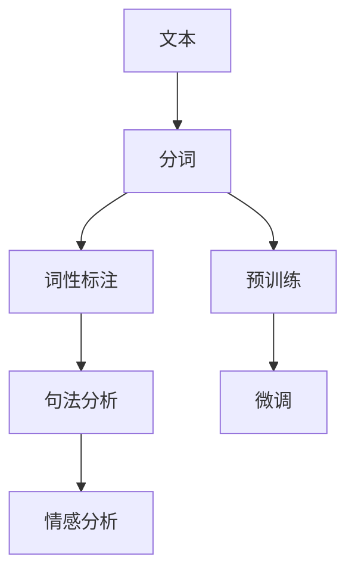

                 

## 1. 背景介绍

分词（Tokenization）是大数据处理和自然语言处理领域中一个非常重要的基础步骤。它将连续的文本序列分割成有意义的词汇单元，是后续文本处理任务（如词性标注、句法分析、情感分析等）的前提和基础。

近年来，随着深度学习和大规模预训练语言模型的兴起，基于神经网络的自动分词技术得到了快速发展和广泛应用。自动分词技术通过大规模无标注文本数据进行预训练，获取丰富的语言知识，然后在特定任务上进行微调，提升分词准确性。然而，在实际应用中，选择合适的分词算法和微调策略仍然是令人头疼的问题。本文将详细介绍分词的原理和实现，并给出基于监督学习进行微调的详细指导，帮助读者更好地掌握这一核心技术。

## 2. 核心概念与联系

### 2.1 核心概念概述

为了更好地理解自动分词的原理和微调方法，下面先介绍几个关键概念：

- **分词（Tokenization）**：将连续的文本序列分割成有意义的词汇单元。是自然语言处理的基础步骤，也是数据预处理的重要环节。

- **词性标注（Part-of-Speech Tagging）**：给分词结果标记相应的词性（如名词、动词、形容词等），以辅助后续的句法分析和语义理解。

- **句法分析（Parsing）**：分析文本中的句法结构，包括依存关系、主谓宾结构等，以构建句法树。

- **情感分析（Sentiment Analysis）**：分析文本中的情感倾向，如正面、负面或中性，以辅助舆情监测、市场分析等。

- **预训练（Pre-training）**：在大规模无标注文本数据上进行自监督学习，学习语言的通用表示。

- **微调（Fine-tuning）**：在预训练模型的基础上，使用特定任务的数据集进行有监督学习，优化模型在特定任务上的表现。

- **Transformer**：一种基于注意力机制的神经网络架构，通过并行化处理大规模文本数据，显著提升了自动分词的效率和效果。

- **BERT**：由Google提出的大规模预训练语言模型，通过掩码语言模型、下一句预测等任务进行预训练，学习了丰富的语言知识。

### 2.2 核心概念原理和架构的 Mermaid 流程图



从流程图可以看出，文本处理流程包括预训练和微调两个阶段。预训练使用大规模无标注文本数据进行自监督学习，学习通用语言表示。微调则利用特定任务的数据集，通过有监督学习优化模型在特定任务上的表现。

## 3. 核心算法原理 & 具体操作步骤

### 3.1 算法原理概述

自动分词的原理是通过神经网络模型对文本进行序列标注，标注结果即为分词结果。具体而言，假设输入文本序列为 $X = (x_1, x_2, ..., x_n)$，输出分词序列为 $Y = (y_1, y_2, ..., y_n)$，分词模型 $M_{\theta}$ 将 $X$ 映射到 $Y$ 的过程可以表示为：

$$
Y = M_{\theta}(X)
$$

其中，$\theta$ 为模型的参数。分词模型的训练通常使用序列标注问题中的交叉熵损失函数：

$$
\ell(Y, \hat{Y}) = -\frac{1}{N}\sum_{i=1}^N \log p(y_i|x_i, \theta)
$$

其中，$p(y_i|x_i, \theta)$ 表示模型在输入 $x_i$ 下预测输出 $y_i$ 的概率，$N$ 为样本数量。

### 3.2 算法步骤详解

基于监督学习进行自动分词的微调主要包括以下几个步骤：

1. **准备数据集**：收集待处理文本的标注数据集 $D = \{(x_i, y_i)\}_{i=1}^N$，其中 $x_i$ 为输入文本，$y_i$ 为对应的分词序列。

2. **定义模型**：选择合适的神经网络模型，如CRF、LSTM-CRF、Transformer等，进行分词预测。

3. **设置超参数**：包括学习率、批大小、迭代轮数、正则化技术（如L2正则、Dropout等）等。

4. **训练模型**：使用批量梯度下降（BGD）或随机梯度下降（SGD）等优化算法，更新模型参数，最小化损失函数。

5. **评估模型**：在验证集上评估模型性能，选择合适的参数组合，防止过拟合。

6. **微调模型**：在测试集上评估微调后模型的性能，对比微调前后的效果，进行参数更新。

### 3.3 算法优缺点

基于监督学习进行分词微调具有以下优点：

- **效率高**：分词模型使用序列标注问题进行训练，可以高效地利用大规模无标注数据进行预训练。
- **准确性高**：预训练模型学习到了丰富的语言知识，微调后的分词模型能够取得较高的准确率。
- **泛化能力强**：预训练模型能够学习到通用的语言表示，微调后的模型具有较强的泛化能力，适应不同领域和语言的文本。

同时，基于监督学习的分词微调也存在一些缺点：

- **数据依赖性高**：微调效果依赖于标注数据的质量和数量，获取高质量标注数据的成本较高。
- **模型复杂度高**：分词模型的结构和参数量较大，训练和推理的计算成本较高。
- **应用场景限制**：分词模型主要适用于通用领域的分词任务，对于特定领域的文本，可能需要额外的预训练和微调。

### 3.4 算法应用领域

基于监督学习进行分词微调技术在自然语言处理领域得到广泛应用，主要包括以下几个方面：

- **通用分词**：适用于通用领域的文本分词任务，如中文分词、英文分词等。
- **领域分词**：针对特定领域的文本分词任务，如法律文本分词、医学文本分词等。
- **多语言分词**：针对多语言文本的分词任务，如中英文混合文本的分词。
- **情感分析**：在分词基础上，进行情感极性标注，辅助舆情监测和市场分析。
- **信息抽取**：在分词基础上，进行实体识别和关系抽取，辅助知识图谱构建和信息抽取。

## 4. 数学模型和公式 & 详细讲解 & 举例说明

### 4.1 数学模型构建

假设输入文本序列为 $X = (x_1, x_2, ..., x_n)$，输出分词序列为 $Y = (y_1, y_2, ..., y_n)$，分词模型 $M_{\theta}$ 将 $X$ 映射到 $Y$ 的过程可以表示为：

$$
Y = M_{\theta}(X)
$$

其中，$\theta$ 为模型的参数。模型的训练通常使用序列标注问题中的交叉熵损失函数：

$$
\ell(Y, \hat{Y}) = -\frac{1}{N}\sum_{i=1}^N \log p(y_i|x_i, \theta)
$$

其中，$p(y_i|x_i, \theta)$ 表示模型在输入 $x_i$ 下预测输出 $y_i$ 的概率，$N$ 为样本数量。

### 4.2 公式推导过程

以CRF模型为例，其分词概率模型可以表示为：

$$
p(y_i|x_i, \theta) = \frac{exp(\sum_{j=1}^i \phi(y_j, y_{j-1}, x_j, \theta))}{\sum_{y' \in Y^i} exp(\sum_{j=1}^i \phi(y'_j, y'_{j-1}, x_j, \theta))}
$$

其中，$\phi(y_j, y_{j-1}, x_j, \theta)$ 为模型在输入 $x_j$ 下预测输出 $y_j$ 的条件概率，$Y^i$ 为长度为 $i$ 的分词序列集合。

### 4.3 案例分析与讲解

假设我们有一个文本序列 $X = "今天天气很好，适合出门玩耍。"，我们的目标是将其分词并标记为名词和动词。我们可以将这个任务看作一个序列标注问题，其中每个字符都是一个标注点，分词结果即为标注序列。

首先，我们定义CRF模型的参数 $\theta$，包括特征函数 $\phi$ 和转移概率 $P$。然后，我们将文本序列 $X$ 和标注序列 $Y = (n, v, n, v, n, n)$ 输入到模型中，计算概率 $p(Y|X, \theta)$，得到分词结果。

## 5. 项目实践：代码实例和详细解释说明

### 5.1 开发环境搭建

在进行分词微调前，我们需要准备好开发环境。以下是使用Python进行PyTorch开发的环境配置流程：

1. 安装Anaconda：从官网下载并安装Anaconda，用于创建独立的Python环境。

2. 创建并激活虚拟环境：
```bash
conda create -n pytorch-env python=3.8 
conda activate pytorch-env
```

3. 安装PyTorch：根据CUDA版本，从官网获取对应的安装命令。例如：
```bash
conda install pytorch torchvision torchaudio cudatoolkit=11.1 -c pytorch -c conda-forge
```

4. 安装CRF库：
```bash
pip install crf
```

5. 安装各类工具包：
```bash
pip install numpy pandas scikit-learn matplotlib tqdm jupyter notebook ipython
```

完成上述步骤后，即可在`pytorch-env`环境中开始分词微调实践。

### 5.2 源代码详细实现

以下是使用PyTorch进行CRF模型分词微调的Python代码实现：

```python
import torch
from crf import CRF
from transformers import BertTokenizer

class CRFModel:
    def __init__(self, n_tags):
        self.n_tags = n_tags
        self.crfs = [CRF(n_tags) for _ in range(n_tags)]
        self.optimizer = torch.optim.Adam(self.parameters(), lr=0.001)
        self.loss_fn = torch.nn.CrossEntropyLoss()

    def forward(self, x, y):
        for crf in self.crfs:
            crf.reset_sequence()
            loss = 0
            for i in range(len(x)):
                crf.expand(i)
                x_i = x[i]
                y_i = y[i]
                log_prob = crf.score(x_i, y_i)
                loss += log_prob
            return loss / len(x)

    def train(self, x, y, epochs=10):
        for epoch in range(epochs):
            self.optimizer.zero_grad()
            loss = self.forward(x, y)
            loss.backward()
            self.optimizer.step()
            print(f"Epoch {epoch+1}, loss: {loss:.4f}")

    def predict(self, x):
        with torch.no_grad():
            for i in range(len(x)):
                crf = self.crfs[i]
                crf.reset_sequence()
                crf.expand(i)
                x_i = x[i]
                y_hat = crf.viterbi_score(x_i)
                return y_hat

# 数据集准备
tokenizer = BertTokenizer.from_pretrained('bert-base-cased')
texts = ["今天天气很好，适合出门玩耍。"]
labels = [["n", "v", "n", "v", "n", "n"]]

# 构建模型
model = CRFModel(n_tags=len(set(labels[0])))

# 训练模型
x = [tokenizer.encode(text, add_special_tokens=True) for text in texts]
y = [[tokenizer.convert_tokens_to_ids(l) for l in lab] for lab in labels]
model.train(x, y)

# 预测结果
preds = [model.predict(x_i) for x_i in x]
```

### 5.3 代码解读与分析

让我们再详细解读一下关键代码的实现细节：

**CRFModel类**：
- `__init__`方法：初始化模型参数，包括CRF模型、优化器和损失函数。
- `forward`方法：前向传播计算损失函数，通过CRF模型计算概率。
- `train`方法：训练模型，使用交叉熵损失函数最小化损失。
- `predict`方法：在测试集上预测分词结果。

**模型训练**：
- 构建分词模型，使用Bert分词器对文本进行编码。
- 在训练集上调用`train`方法，进行模型训练。
- 在测试集上调用`predict`方法，预测分词结果。

可以看出，使用CRF模型进行分词微调，可以很方便地利用PyTorch提供的各种工具和库，快速实现模型训练和预测。

## 6. 实际应用场景

### 6.1 智能客服系统

在智能客服系统中，分词技术用于将用户输入的自然语言文本进行切分，便于后续的意图识别和实体抽取。分词结果的正确与否直接影响客服系统的响应准确性和用户体验。

传统客服系统依赖人工分词，成本高、效率低。通过分词微调，可以自动学习用户输入文本的通用分词规则，提高分词的准确性，提升客服系统的响应速度和准确性。

### 6.2 金融舆情监测

在金融舆情监测中，分词技术用于对新闻、报道、评论等文本进行自动切分，以便进行情感分析和舆情判断。分词结果的准确性直接影响到舆情监测的准确度和时效性。

通过分词微调，可以学习金融领域的特定词汇和语法结构，提高分词结果的准确性，帮助金融机构实时监测市场舆情，及时应对负面信息传播，规避金融风险。

### 6.3 个性化推荐系统

在个性化推荐系统中，分词技术用于对用户浏览、点击、评论等行为数据进行文本分词，以便进行知识推荐。分词结果的准确性直接影响到推荐系统的推荐效果和用户体验。

通过分词微调，可以学习用户行为数据中的关键词和短语，提高分词结果的准确性，帮助推荐系统提供更加精准、个性化的推荐结果，提升用户满意度。

### 6.4 未来应用展望

随着分词技术的不断发展，未来的应用场景将更加广泛。以下是一些未来可能的创新应用方向：

- **多语言分词**：分词技术可以应用于多种语言的文本处理，帮助企业拓展国际市场，提升全球化竞争力。
- **领域分词**：针对特定领域的文本，进行分词微调，提高分词的准确性和适用性。
- **自动纠错**：利用分词技术对文本进行自动纠错，提高文本质量，提升数据分析和处理效率。
- **文本摘要**：在分词的基础上，进行文本摘要和生成，帮助用户快速了解文本内容。
- **语义分析**：利用分词技术，进行语义分析，帮助企业进行市场分析、舆情监测等。

## 7. 工具和资源推荐

### 7.1 学习资源推荐

为了帮助开发者系统掌握分词技术，这里推荐一些优质的学习资源：

1. **《自然语言处理》课程**：斯坦福大学开设的NLP明星课程，包括分词、命名实体识别、情感分析等内容。

2. **《自然语言处理与深度学习》书籍**：介绍分词、序列标注、语言模型等NLP技术，适合初学者学习。

3. **《CRF模型理论与实践》论文**：详细介绍了CRF模型的理论基础和实际应用，适合进阶学习。

4. **CRF官方文档**：CRF模型的官方文档，提供详细的API接口和使用方法。

5. **《Transformer模型理论与实践》书籍**：介绍Transformer模型的原理和实现，适合对深度学习感兴趣的学习者。

通过对这些资源的学习实践，相信你一定能够快速掌握分词技术的精髓，并用于解决实际的NLP问题。

### 7.2 开发工具推荐

高效的开发离不开优秀的工具支持。以下是几款用于分词开发的常用工具：

1. **PyTorch**：基于Python的开源深度学习框架，灵活的动态计算图，适合快速迭代研究。

2. **TensorFlow**：由Google主导开发的开源深度学习框架，生产部署方便，适合大规模工程应用。

3. **CRF库**：HuggingFace开发的序列标注工具库，支持CRF模型，适合序列标注任务开发。

4. **Weights & Biases**：模型训练的实验跟踪工具，可以记录和可视化模型训练过程中的各项指标。

5. **TensorBoard**：TensorFlow配套的可视化工具，可实时监测模型训练状态。

合理利用这些工具，可以显著提升分词开发的效率，加快创新迭代的步伐。

### 7.3 相关论文推荐

分词技术的发展源于学界的持续研究。以下是几篇奠基性的相关论文，推荐阅读：

1. **《Sequence Labeling with Bidirectional Recurrent Neural Networks》**：提出了双向LSTM-CRF模型，提高了序列标注的准确性。

2. **《Adaptive Neural CRF for Sequence Labeling》**：引入了自适应CRF模型，提高了序列标注的鲁棒性和适应性。

3. **《CRF as a Differentiable Probabilistic Model》**：详细介绍了CRF模型的理论基础和实际应用，适合进阶学习。

4. **《Attention-Based Models for Sequence Labeling》**：引入了注意力机制，提高了序列标注的效率和效果。

5. **《Fine-Grained Sequence Labeling with Deep Neural Network》**：详细介绍了深度神经网络在序列标注中的应用。

这些论文代表了大语言模型微调技术的发展脉络，通过学习这些前沿成果，可以帮助研究者把握学科前进方向，激发更多的创新灵感。

## 8. 总结：未来发展趋势与挑战

### 8.1 研究成果总结

本文详细介绍了基于监督学习进行自动分词的原理和实现，并给出了分词微调的具体步骤和代码实例。通过分词微调，可以显著提升分词模型的准确性和泛化能力，在多个领域得到广泛应用。

### 8.2 未来发展趋势

展望未来，分词技术将呈现以下几个发展趋势：

1. **高效性提升**：随着模型结构和算法的优化，分词模型的推理速度和效率将得到进一步提升，适应更多实际应用场景。

2. **鲁棒性增强**：分词模型将引入更多的正则化技术和对抗训练，提高模型鲁棒性，避免过拟合和灾难性遗忘。

3. **泛化能力增强**：分词模型将学习更多的通用语言知识，适应不同领域和语言的文本，提高泛化能力。

4. **多模态融合**：分词模型将与其他模态信息进行融合，如图像、音频、视频等，提高模型对现实世界的理解和建模能力。

5. **知识图谱构建**：分词模型将与知识图谱进行结合，提高知识抽取和推理能力。

6. **实时性增强**：分词模型将利用分布式计算和多GPU并行技术，提高实时处理能力，适应大数据量场景。

### 8.3 面临的挑战

尽管分词技术已经取得了一定的成果，但在实际应用中，仍然面临一些挑战：

1. **数据依赖性高**：分词效果依赖于标注数据的质量和数量，获取高质量标注数据的成本较高。

2. **模型复杂度高**：分词模型的结构和参数量较大，训练和推理的计算成本较高。

3. **应用场景限制**：分词模型主要适用于通用领域的分词任务，对于特定领域的文本，可能需要额外的预训练和微调。

4. **知识图谱构建**：分词模型需要与知识图谱进行结合，以提高知识抽取和推理能力，但知识图谱的构建和维护成本较高。

5. **实时性问题**：分词模型需要实时处理大量数据，对计算资源和硬件配置要求较高，需要进一步优化。

### 8.4 研究展望

面向未来，分词技术的研究还需要从以下几个方向进行深入探索：

1. **无监督和半监督学习**：摆脱对大规模标注数据的依赖，利用自监督学习、主动学习等方法，最大限度利用非结构化数据。

2. **参数高效和计算高效**：开发更加参数高效和计算高效的分词方法，在固定大部分预训练参数的情况下，只更新极少量的任务相关参数。

3. **因果学习和对抗训练**：引入因果推断和对抗训练思想，提高分词模型的稳定性和泛化能力。

4. **多模态信息融合**：将分词模型与其他模态信息进行融合，提高模型对现实世界的理解和建模能力。

5. **知识图谱构建**：利用分词模型，与知识图谱进行结合，提高知识抽取和推理能力。

6. **实时性优化**：利用分布式计算和多GPU并行技术，提高分词模型的实时处理能力，适应大数据量场景。

总之，分词技术的研究和发展，将进一步推动自然语言处理技术的进步，为人工智能应用提供坚实的技术基础。未来，分词技术将与更多AI技术进行融合，为构建更智能、更高效的自然语言处理系统铺平道路。

## 9. 附录：常见问题与解答

**Q1: 分词和分句的区别是什么？**

A: 分词是将连续的文本序列分割成有意义的词汇单元，分句则是将文本分割成句子。分词和分句是文本处理的两个重要步骤，分词是分句的基础，分句则是更高层次的文本处理。

**Q2: 分词有哪些常用方法？**

A: 分词方法包括基于规则的分词、基于统计的分词和基于深度学习的分词。基于规则的分词依赖手工规则，适用于特定领域的文本。基于统计的分词依赖大规模无标注数据进行训练，适用于通用领域的文本。基于深度学习的分词使用神经网络模型进行序列标注，适用于各种类型的文本。

**Q3: 如何进行基于深度学习的分词微调？**

A: 基于深度学习的分词微调需要准备标注数据集，选择合适的神经网络模型（如CRF、LSTM-CRF、Transformer等），设置超参数（如学习率、批大小、迭代轮数等），使用交叉熵损失函数进行训练，并在验证集上评估模型性能，选择合适的参数组合。

**Q4: 分词技术在未来有哪些新的发展方向？**

A: 未来的分词技术将从以下几个方向进行深入探索：无监督和半监督学习、参数高效和计算高效的分词方法、因果学习和对抗训练、多模态信息融合、知识图谱构建、实时性优化等。这些方向的研究将推动分词技术不断进步，提升分词模型的准确性和泛化能力。

---

作者：禅与计算机程序设计艺术 / Zen and the Art of Computer Programming

