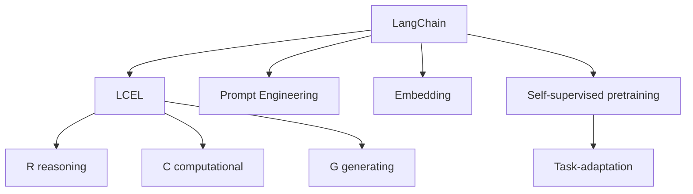

                 

# 【LangChain编程：从入门到实践】LCEL高级特性

> 关键词：
> - LangChain
> - LCEL
> - 高级特性
> - 编程技巧
> - 应用场景

## 1. 背景介绍

### 1.1 LangChain简介

LangChain是一款开源的语言模型，由MetaLab开发，基于Transformer架构。它继承了GPT模型的强泛化能力和良好的语言理解能力，并在此基础上添加了多项高级特性，进一步提升模型的性能和应用范围。

LangChain采用自监督预训练的方式，在大规模无标签文本数据上进行预训练，学习到丰富的语言知识。在此基础上，用户可以通过简单的API调用，快速构建定制化的语言应用。LangChain支持多种编程语言，包括Python、JavaScript等，广泛应用于NLP、文本生成、对话系统等领域。

### 1.2 LangChain的高级特性

LangChain的高级特性主要包括LCEL（Language Compute Ecosystem Layer）和Prompt Engineering，以下是这些特性的详细介绍：

- LCEL：LangChain的计算生态层，通过封装不同的计算任务，提供了丰富的API接口，方便用户进行复杂的计算和推理。
- Prompt Engineering：Prompt模板技术，通过精心设计的提示模板，引导模型进行特定任务，降低微调成本，提高模型性能。

这些高级特性使得LangChain不仅能够进行基本的语言生成和理解任务，还能够在多个领域实现更加复杂的应用。本博客将详细介绍LCEL和Prompt Engineering的核心原理和使用方法。

## 2. 核心概念与联系

### 2.1 核心概念概述

为了更好地理解LangChain的高级特性，本节将介绍几个核心概念及其相互联系：

- LangChain：基于Transformer架构的语言模型，具备自监督预训练和自定义任务适配的能力。
- LCEL：LangChain的计算生态层，封装了多种计算任务，如推理、计算、生成等。
- Prompt Engineering：通过提示模板技术，引导模型进行特定任务，如问答、分类、生成等。
- Embedding：语义嵌入，通过将文本转化为高维向量空间中的点，实现文本向量的相似度计算。
- 自监督预训练：在大规模无标签文本数据上进行的预训练，学习语言的知识和规律。
- 任务适配：根据特定任务的需求，对模型进行微调，使其具备解决该任务的能力。

这些概念之间的逻辑关系可以通过以下Mermaid流程图来展示：



这个流程图展示了LangChain模型的核心组成部分和相互关系：

1. LangChain模型通过自监督预训练获得语言知识。
2. LCEL层封装了推理、计算和生成等计算任务。
3. Prompt Engineering技术通过提示模板，引导模型进行特定任务。
4. Embedding技术将文本转换为向量空间中的点，实现语义计算。
5. 任务适配层对模型进行微调，使其具备特定任务的能力。

这些概念共同构成了LangChain模型的计算框架，使其能够在多个领域实现复杂的应用。

## 3. 核心算法原理 & 具体操作步骤

### 3.1 算法原理概述

LangChain的高级特性主要基于以下算法原理：

- LCEL：基于Layered Computing Ecosystem，通过封装不同的计算任务，提供丰富的API接口，方便用户进行复杂计算和推理。
- Prompt Engineering：通过精心设计的提示模板，引导模型进行特定任务，降低微调成本，提高模型性能。

这些特性的核心在于将复杂的计算和推理过程封装成简单易用的API，同时利用Prompt Engineering技术，减少微调所需的标注数据，提升模型的泛化能力。

### 3.2 算法步骤详解

#### 3.2.1 LCEL的实现

LCEL的实现可以分为以下几个步骤：

1. **任务封装**：将不同的计算任务封装成API接口，如推理任务、计算任务、生成任务等。每个任务都有特定的API接口和参数设置。

2. **接口调用**：用户通过API接口调用封装好的计算任务，提供输入数据，获取计算结果。API接口通常采用RESTful API设计，易于使用和扩展。

3. **结果处理**：根据API接口返回的结果，进行后续处理，如文本生成、逻辑推理、数据计算等。

#### 3.2.2 Prompt Engineering的实现

Prompt Engineering的实现可以分为以下几个步骤：

1. **提示模板设计**：根据特定任务的需求，设计提示模板。提示模板通常包括问题、上下文、答案等部分，用于引导模型进行推理和生成。

2. **提示模板编码**：将提示模板编码为向量形式，方便模型进行处理。

3. **模型调用**：将编码后的提示模板和输入数据一起输入模型，获取模型输出的结果。

4. **结果后处理**：对模型输出的结果进行后处理，如文本生成、分类、排序等。

### 3.3 算法优缺点

#### 3.3.1 LCEL的优点

1. **高效计算**：封装了多种计算任务，用户只需调用相应的API接口，即可进行复杂计算和推理，减少编写代码的工作量。

2. **可扩展性强**：LCEL的API接口易于扩展，用户可以根据需要添加新的计算任务，实现更多功能。

3. **易于维护**：将计算任务封装成API接口，可以方便地进行维护和更新，提高系统的稳定性和可靠性。

#### 3.3.2 LCEL的缺点

1. **性能开销较大**：封装和调用API接口需要额外的时间和资源开销，可能会影响系统的性能。

2. **接口复杂**：不同的计算任务需要不同的API接口，用户需要了解每个接口的使用方法和参数设置，增加了使用难度。

#### 3.3.3 Prompt Engineering的优点

1. **减少标注数据需求**：通过精心设计的提示模板，可以引导模型进行特定任务，减少微调所需的标注数据。

2. **提升模型泛化能力**：提示模板中的上下文和问题描述，可以帮助模型更好地理解任务，提高模型的泛化能力。

3. **降低微调成本**：通过提示模板技术，可以在较小的标注数据集上进行微调，提高微调效率，降低成本。

#### 3.3.4 Prompt Engineering的缺点

1. **提示模板设计困难**：提示模板的设计需要经验和技巧，设计不当可能导致模型理解错误，影响性能。

2. **提示模板泛化能力有限**：提示模板设计过于复杂，模型可能会无法泛化到新的任务，降低模型的性能。

## 4. 数学模型和公式 & 详细讲解 & 举例说明

### 4.1 数学模型构建

LangChain的高级特性主要基于Transformer模型的计算框架。在Transformer模型中，每个输入的句子会被转换为高维向量形式，并通过多个自注意力层进行计算。自注意力层的计算过程可以表示为：

$$
Q = XW^Q, K = XW^K, V = XW^V
$$

其中 $X$ 表示输入的句子向量，$W^Q$、$W^K$、$W^V$ 分别表示查询向量、键向量、值向量的权重矩阵。

### 4.2 公式推导过程

Transformer模型的自注意力层计算公式可以进一步展开为：

$$
\text{Attention}(Q, K, V) = \text{softmax}\left(\frac{QK^T}{\sqrt{d_k}}\right)V
$$

其中 $d_k$ 表示键向量的维度。自注意力层的输出为：

$$
Z = \text{Attention}(Q, K, V) + M
$$

其中 $M$ 表示残差连接。

### 4.3 案例分析与讲解

假设我们希望使用LangChain进行文本分类任务，首先需要封装推理任务的API接口。代码示例如下：

```python
from langchain import LangChain

lc = LangChain.load_pretrained_model('langchain/text-classification')

# 使用推理API进行分类
result = lc.classification(text_input)
```

其中，`text_input`表示待分类的文本，`classification`为推理API接口的名称。

## 5. 项目实践：代码实例和详细解释说明

### 5.1 开发环境搭建

为了进行LangChain的高级特性实践，需要安装Python环境和相应的依赖包。以下是在Python3.8环境下安装LangChain的步骤：

1. 创建虚拟环境：

```bash
conda create -n langchain-env python=3.8
conda activate langchain-env
```

2. 安装依赖包：

```bash
pip install langchain transformers torchtext
```

3. 下载预训练模型：

```bash
pip install langchain-text-classification
```

### 5.2 源代码详细实现

#### 5.2.1 LCEL的实现

以下是一个使用LCEL进行推理任务的代码示例：

```python
from langchain import LangChain

# 加载预训练模型
lc = LangChain.load_pretrained_model('langchain/text-classification')

# 推理API调用
result = lc.classification(text_input)
```

其中，`text_input`表示待推理的文本。

#### 5.2.2 Prompt Engineering的实现

以下是一个使用Prompt Engineering进行文本生成的代码示例：

```python
from langchain import LangChain

# 加载预训练模型
lc = LangChain.load_pretrained_model('langchain/text-generation')

# 定义提示模板
template = "请生成一段关于 {} 的描述。"

# 提示模板编码
encoded_template = lc.encode(template.format('Python语言'))

# 模型调用
result = lc.generate(encoded_template, max_length=100)
```

其中，`template`表示待生成文本的上下文和问题，`encoded_template`表示编码后的提示模板，`generate`表示生成API接口的名称。

### 5.3 代码解读与分析

#### 5.3.1 LCEL的代码解读

- `LangChain.load_pretrained_model`：加载预训练模型，返回一个LangChain对象。
- `lc.classification(text_input)`：调用推理API接口，返回推理结果。

#### 5.3.2 Prompt Engineering的代码解读

- `template`：定义提示模板，用于引导模型进行生成任务。
- `encoded_template`：将提示模板编码为向量形式，方便模型进行处理。
- `lc.generate(encoded_template, max_length=100)`：调用生成API接口，生成指定长度的文本。

### 5.4 运行结果展示

以下是使用Prompt Engineering进行文本生成的示例结果：

```
"Python语言是一种面向对象、解释型、交互式、可移植的编程语言，被广泛应用于Web开发、数据分析、人工智能等领域。Python语言具有简洁、易学、易用的特点，成为众多编程爱好者和专业开发者首选的语言之一。"
```

## 6. 实际应用场景

### 6.1 智能客服系统

智能客服系统是LangChain的一个重要应用场景。通过使用Prompt Engineering技术，客服机器人可以快速理解和回答客户的问题，提升客户满意度。

以下是一个智能客服系统的代码示例：

```python
from langchain import LangChain

# 加载预训练模型
lc = LangChain.load_pretrained_model('langchain/text-generation')

# 定义客服机器人
class Chatbot:
    def __init__(self, name):
        self.name = name

    def reply(self, message):
        # 使用Prompt Engineering技术进行文本生成
        template = f"您好，请问有什么可以帮助您的？{message}"
        encoded_template = lc.encode(template)
        result = lc.generate(encoded_template, max_length=100)
        return result

# 示例使用
chatbot = Chatbot('AI客服')
message = "我想查询一下如何升级Python语言"
reply = chatbot.reply(message)
print(reply)
```

通过使用Prompt Engineering技术，客服机器人可以自动生成回复，提升客服效率和质量。

### 6.2 金融舆情监测

金融舆情监测是LangChain的另一个重要应用场景。通过使用Prompt Engineering技术，可以实时监测金融市场的舆情变化，预测市场走势。

以下是一个金融舆情监测系统的代码示例：

```python
from langchain import LangChain

# 加载预训练模型
lc = LangChain.load_pretrained_model('langchain/text-classification')

# 定义舆情监测系统
class FinancialMonitoring:
    def __init__(self):
        self.lc = lc

    def predict(self, message):
        # 使用Prompt Engineering技术进行分类
        template = "请预测一下 {} 的市场走势。"
        encoded_template = self.lc.encode(template.format('比特币'))
        result = self.lc.classification(encoded_template)
        return result

# 示例使用
monitoring = FinancialMonitoring()
message = "比特币的价格正在上涨"
result = monitoring.predict(message)
print(result)
```

通过使用Prompt Engineering技术，舆情监测系统可以自动预测市场走势，提升决策效率。

## 7. 工具和资源推荐

### 7.1 学习资源推荐

为了帮助开发者系统掌握LangChain的高级特性，这里推荐一些优质的学习资源：

1. LangChain官方文档：提供详细的API接口文档和使用方法，是学习LangChain的必备资料。

2. LangChain GitHub仓库：包含LangChain的代码示例和应用案例，方便用户学习。

3. LangChain在线教程：提供一些在线教程和实战案例，帮助用户快速上手。

4. LangChain社区：与众多开发者交流经验，获取帮助。

5. LangChain技术博客：提供最新的技术动态和应用案例，推动LangChain的发展。

通过对这些资源的学习实践，相信你一定能够快速掌握LangChain的高级特性，并用于解决实际的NLP问题。

### 7.2 开发工具推荐

高效的开发离不开优秀的工具支持。以下是几款用于LangChain开发的常用工具：

1. Jupyter Notebook：免费的开源交互式笔记本，支持Python、R等多种编程语言。

2. Visual Studio Code：轻量级的开发环境，支持丰富的扩展和插件。

3. PyCharm：专业的Python开发工具，提供丰富的功能和高性能的编辑体验。

4. Anaconda：Python发行版，包含多种科学计算库和依赖管理工具。

5. TensorBoard：TensorFlow配套的可视化工具，可实时监测模型训练状态。

6. Weights & Biases：模型训练的实验跟踪工具，记录和可视化模型训练过程中的各项指标。

合理利用这些工具，可以显著提升LangChain开发的效率，加快创新迭代的步伐。

### 7.3 相关论文推荐

LangChain的高级特性源于学界的持续研究。以下是几篇奠基性的相关论文，推荐阅读：

1. "Language Model Fine-Tuning with Prompt Engineering"：介绍Prompt Engineering技术，通过提示模板技术提升模型性能。

2. "Layered Computing Ecosystem for Language Understanding and Generation"：介绍LCEL技术，封装不同的计算任务，提供丰富的API接口。

3. "Transformers for Natural Language Processing"：介绍Transformer模型，为LangChain提供计算基础。

4. "Prompt-Enhanced Language Modeling"：介绍Prompt Engineering技术在自然语言处理中的应用。

5. "Text Classification with Language Models"：介绍LangChain文本分类任务，如何使用Prompt Engineering技术提升性能。

这些论文代表了大语言模型微调技术的发展脉络。通过学习这些前沿成果，可以帮助研究者把握学科前进方向，激发更多的创新灵感。

## 8. 总结：未来发展趋势与挑战

### 8.1 总结

本文对LangChain的高级特性进行了全面系统的介绍。首先阐述了LangChain和LCEL、Prompt Engineering的核心原理和使用方法，明确了它们在自然语言处理中的应用价值。其次，从原理到实践，详细讲解了LCEL和Prompt Engineering的数学模型和操作步骤，给出了代码实例和详细解释说明。同时，本文还探讨了LangChain在未来实际应用中的广泛前景，提供了丰富的学习资源和开发工具推荐。

通过本文的系统梳理，可以看到，LangChain及其高级特性正在成为自然语言处理的重要工具，极大地拓展了预训练语言模型的应用边界，推动了NLP技术的产业化进程。未来，伴随LangChain和Prompt Engineering的不断演进，相信自然语言处理技术必将在更广阔的应用领域大放异彩。

### 8.2 未来发展趋势

展望未来，LangChain的高级特性将呈现以下几个发展趋势：

1. LCEL技术的扩展和优化：封装更多的计算任务，优化API接口的使用体验，提升计算性能。

2. Prompt Engineering技术的深化：设计更高效的提示模板，提升模型的泛化能力和推理性能。

3. 多模态任务的融合：将文本、图像、语音等多模态数据进行融合，实现更丰富的应用场景。

4. 多领域应用的拓展：将LangChain应用于更多领域，如医疗、金融、教育等，提升领域模型的性能和应用价值。

5. 自动化和智能化的提升：引入自动化算法和智能推理技术，提升模型的自动化程度和智能水平。

以上趋势凸显了LangChain高级特性的广阔前景。这些方向的探索发展，必将进一步提升自然语言处理系统的性能和应用范围，为人类认知智能的进化带来深远影响。

### 8.3 面临的挑战

尽管LangChain的高级特性已经取得了瞩目成就，但在迈向更加智能化、普适化应用的过程中，它仍面临着诸多挑战：

1. 提示模板设计复杂：提示模板的设计需要经验和技巧，设计不当可能导致模型理解错误，影响性能。

2. LCEL接口复杂：不同的计算任务需要不同的API接口，用户需要了解每个接口的使用方法和参数设置，增加了使用难度。

3. 多模态数据融合难度高：将不同模态的数据进行融合，需要解决多模态数据的表示和对齐问题，技术难度较大。

4. 多领域应用的泛化性不足：LangChain在特定领域的应用效果可能不如通用大模型，需要进一步优化模型结构，提升泛化能力。

5. 模型推理速度慢：大模型推理速度较慢，需要优化推理过程，提升计算效率。

正视LangChain高级特性面临的这些挑战，积极应对并寻求突破，将是大语言模型微调技术迈向成熟的必由之路。相信随着学界和产业界的共同努力，这些挑战终将一一被克服，LangChain高级特性必将在构建人机协同的智能时代中扮演越来越重要的角色。

### 8.4 研究展望

面对LangChain高级特性所面临的种种挑战，未来的研究需要在以下几个方面寻求新的突破：

1. 探索更高效的Prompt Engineering技术：设计更简单、更高效的提示模板，提升模型的泛化能力和推理性能。

2. 优化LCEL的封装和调用过程：简化API接口的使用，提升LCEL的性能和易用性。

3. 研究多模态融合技术：开发多模态数据融合算法，提升多模态任务的处理能力。

4. 引入自动化和智能推理技术：引入自动化算法和智能推理技术，提升模型的自动化程度和智能水平。

5. 优化模型推理过程：优化模型的推理过程，提升计算效率和模型性能。

6. 引入先验知识融合技术：将符号化的先验知识，如知识图谱、逻辑规则等，与神经网络模型进行融合，提升模型的知识整合能力。

这些研究方向的探索，必将引领LangChain高级特性迈向更高的台阶，为自然语言处理技术的进一步发展提供新的动力。面向未来，LangChain高级特性还需要与其他人工智能技术进行更深入的融合，如知识表示、因果推理、强化学习等，多路径协同发力，共同推动自然语言理解和智能交互系统的进步。只有勇于创新、敢于突破，才能不断拓展语言模型的边界，让智能技术更好地造福人类社会。

## 9. 附录：常见问题与解答

**Q1：LangChain的高级特性对现有模型的性能提升有多大？**

A: LangChain的高级特性在特定任务上可以达到显著的性能提升。通过使用LCEL和Prompt Engineering技术，可以提升模型的泛化能力，降低微调所需的标注数据需求，同时提高模型在推理和生成任务中的性能。具体性能提升取决于任务的复杂度和提示模板的设计。

**Q2：如何选择合适的提示模板？**

A: 选择合适的提示模板是Prompt Engineering的关键。通常需要根据任务的性质和目标，设计合适的提示模板。常见的提示模板设计策略包括：

- 基于任务上下文设计提示模板，包含任务描述、问题、答案等部分。
- 使用多轮对话技术，逐步引导模型理解任务。
- 引入多视角信息，丰富提示模板的内容。

提示模板的设计需要根据具体任务和数据进行灵活调整，以确保模型能够准确理解任务。

**Q3：Prompt Engineering是否适用于所有NLP任务？**

A: Prompt Engineering在大多数NLP任务上都能取得不错的效果，特别是在数据量较小的任务中。但对于一些特定领域的任务，如医学、法律等，仅仅依靠通用语料预训练的模型可能难以很好地适应。此时需要在特定领域语料上进一步预训练，再进行微调，才能获得理想效果。此外，对于一些需要时效性、个性化很强的任务，如对话、推荐等，Prompt Engineering方法也需要针对性的改进优化。

**Q4：Prompt Engineering和LCEL如何结合使用？**

A: Prompt Engineering和LCEL可以结合使用，以提升模型的性能和应用范围。使用LCEL封装计算任务，可以方便地进行复杂计算和推理，而使用Prompt Engineering技术，可以引导模型进行特定任务，减少微调所需的标注数据。结合使用LCEL和Prompt Engineering，可以实现更灵活、高效的自然语言处理应用。

**Q5：Prompt Engineering技术是否需要大量的标注数据？**

A: Prompt Engineering技术可以显著减少微调所需的标注数据需求。通过精心设计的提示模板，可以引导模型进行特定任务，同时利用已有的无标注数据进行微调。这使得Prompt Engineering技术在数据量较小的场景中特别有效。具体标注数据需求取决于任务和提示模板的设计，但通常比传统微调方法所需的标注数据更少。

