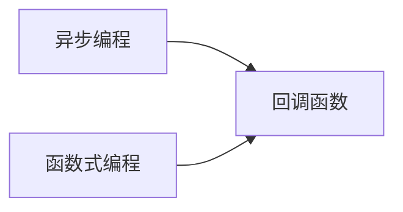

                 

# 【LangChain编程：从入门到实践】使用回调的两种方式

> 关键词：回调函数, LangChain, 异步编程, 函数式编程

## 1. 背景介绍

在编写Python程序时，回调函数是一个常见的编程模式。回调函数可以在程序运行过程中动态地调用，用于处理特定的事件或者执行一些额外的操作。在React等前端框架中，回调函数更是无处不在，用于实现组件间的交互和事件处理。

回调函数不仅在前端开发中广泛应用，在Python的高级编程范式如异步编程和函数式编程中也扮演着重要角色。本文将详细探讨回调函数在Python编程中的两种常见用法，帮助初学者快速掌握回调函数的基本概念和实际应用。

## 2. 核心概念与联系

### 2.1 核心概念概述

在探讨回调函数之前，我们先了解一下Python中两个重要的编程概念：异步编程和函数式编程。

#### 2.1.1 异步编程

异步编程是一种编程范式，旨在提高程序的响应性和并发性。Python中有多种实现异步编程的方式，包括协程、异步IO库（如asyncio）和事件驱动框架（如Tornado和Twisted）。

异步编程的核心思想是利用非阻塞的IO操作和事件循环机制，在等待IO操作完成的同时，执行其他计算任务，从而实现更高的并发性能。异步编程广泛应用于Web服务器、网络爬虫、实时通信等需要高并发和低延迟的领域。

#### 2.1.2 函数式编程

函数式编程是一种编程范式，强调函数的纯粹性和不可变性。Python中的函数式编程主要依赖于函数作为一等公民的特性，支持高阶函数、lambda表达式和生成器等特性。

函数式编程的核心思想是使用函数作为构建程序的基本单元，避免副作用和状态共享，从而实现代码的可复用性和可维护性。函数式编程广泛应用于数据处理、算法设计和函数式数据库等领域。

### 2.2 核心概念联系

回调函数在异步编程和函数式编程中都有重要的应用，两种编程范式中的回调函数具有一定的共性，但实现方式和应用场景有所不同。

在异步编程中，回调函数通常用于处理异步IO操作的结果。例如，在异步请求中，回调函数可以在请求完成后被调用，处理服务器返回的数据。

在函数式编程中，回调函数通常用于实现高阶函数和函数组合。例如，在函数式编程中，回调函数可以作为参数传递给高阶函数，实现复杂的数据处理逻辑。

以下是一个异步编程和函数式编程中回调函数使用的示意图：



## 3. 核心算法原理 & 具体操作步骤

### 3.1 算法原理概述

回调函数的原理相对简单，但在具体应用中具有不同的实现方式和场景。以下是回调函数的两种常见用法及其算法原理。

### 3.2 算法步骤详解

#### 3.2.1 用法一：异步编程中的回调函数

异步编程中的回调函数通常用于处理异步IO操作的结果。以下是一个使用Python的asyncio库进行异步请求的例子：

```python
import asyncio
import aiohttp

async def fetch(session, url):
    async with session.get(url) as response:
        return await response.text()

async def main():
    async with aiohttp.ClientSession() as session:
        html = await fetch(session, 'http://example.com')
        print(html)

loop = asyncio.get_event_loop()
loop.run_until_complete(main())
```

在这个例子中，`fetch`函数是一个异步函数，用于发送HTTP请求并获取响应。`main`函数是另一个异步函数，用于创建`aiohttp.ClientSession`对象，并调用`fetch`函数获取响应数据。最终，程序在事件循环中执行`main`函数，并等待异步操作完成。

#### 3.2.2 用法二：函数式编程中的回调函数

函数式编程中的回调函数通常用于实现高阶函数和函数组合。以下是一个使用Python的`map`函数实现列表操作的例子：

```python
def double(x):
    return x * 2

lst = [1, 2, 3, 4, 5]
new_lst = list(map(double, lst))
print(new_lst)
```

在这个例子中，`double`函数是一个回调函数，用于将列表中的每个元素乘以2。`map`函数是一个高阶函数，用于将`double`函数应用于列表中的每个元素。最终，程序生成一个新的列表，其中每个元素都是原列表中对应元素的两倍。

### 3.3 算法优缺点

#### 3.3.1 异步编程中的回调函数

异步编程中的回调函数具有以下优点：

- 处理异步IO操作。回调函数可以方便地处理异步IO操作的结果，避免了阻塞操作对程序性能的影响。
- 提高并发性能。回调函数可以充分利用异步IO操作的优势，实现更高的并发性能。

异步编程中的回调函数也存在以下缺点：

- 回调地狱。在复杂的异步编程场景中，回调函数可能导致"回调地狱"，即多层嵌套的回调函数，使代码难以维护。
- 难以复用。回调函数通常是针对特定场景编写的，难以复用于其他场景。

#### 3.3.2 函数式编程中的回调函数

函数式编程中的回调函数具有以下优点：

- 可复用性高。回调函数可以作为参数传递给高阶函数，实现复用和组合。
- 简洁优雅。函数式编程中的回调函数通常简洁优雅，易于理解和维护。

函数式编程中的回调函数也存在以下缺点：

- 效率较低。回调函数通常在函数内部执行，效率较低。
- 难以调试。回调函数通常不具备可视化界面，难以调试和分析。

### 3.4 算法应用领域

回调函数在Python的多个应用领域中都有重要的应用，以下是一些常见领域：

- 异步编程：回调函数在异步编程中广泛应用，用于处理异步IO操作和事件循环。
- 函数式编程：回调函数在函数式编程中用于实现高阶函数和函数组合。
- Web开发：回调函数在前端开发中用于实现异步请求和事件处理。
- 数据处理：回调函数在数据处理中用于实现复杂的数据转换和操作。

## 4. 数学模型和公式 & 详细讲解 & 举例说明

### 4.1 数学模型构建

回调函数的数学模型相对简单，通常可以表示为一个函数$f(x)$，其中$x$为输入参数，$f(x)$为输出结果。以下是一个简单的例子：

```python
def f(x):
    return x * 2
```

在这个例子中，$f(x)$是一个回调函数，用于将输入$x$乘以2，并返回结果。

### 4.2 公式推导过程

回调函数的公式推导相对简单，通常可以表示为：

$$
f(x) = y
$$

其中$x$为输入参数，$y$为输出结果。

### 4.3 案例分析与讲解

在实际应用中，回调函数通常用于处理特定的场景和操作。以下是一个使用回调函数实现异步请求的例子：

```python
import asyncio
import aiohttp

async def fetch(session, url):
    async with session.get(url) as response:
        return await response.text()

async def main():
    async with aiohttp.ClientSession() as session:
        html = await fetch(session, 'http://example.com')
        print(html)

loop = asyncio.get_event_loop()
loop.run_until_complete(main())
```

在这个例子中，`fetch`函数是一个异步函数，用于发送HTTP请求并获取响应。`main`函数是另一个异步函数，用于创建`aiohttp.ClientSession`对象，并调用`fetch`函数获取响应数据。最终，程序在事件循环中执行`main`函数，并等待异步操作完成。

## 5. 项目实践：代码实例和详细解释说明

### 5.1 开发环境搭建

在使用回调函数时，通常需要使用Python的标准库和第三方库，如asyncio、aiohttp、requests等。以下是一个简单的开发环境搭建流程：

```bash
pip install asyncio aiohttp requests
```

### 5.2 源代码详细实现

#### 5.2.1 异步编程中的回调函数

以下是一个使用回调函数实现异步请求的例子：

```python
import asyncio
import aiohttp

async def fetch(session, url):
    async with session.get(url) as response:
        return await response.text()

async def main():
    async with aiohttp.ClientSession() as session:
        html = await fetch(session, 'http://example.com')
        print(html)

loop = asyncio.get_event_loop()
loop.run_until_complete(main())
```

在这个例子中，`fetch`函数是一个异步函数，用于发送HTTP请求并获取响应。`main`函数是另一个异步函数，用于创建`aiohttp.ClientSession`对象，并调用`fetch`函数获取响应数据。最终，程序在事件循环中执行`main`函数，并等待异步操作完成。

#### 5.2.2 函数式编程中的回调函数

以下是一个使用回调函数实现高阶函数和函数组合的例子：

```python
def double(x):
    return x * 2

lst = [1, 2, 3, 4, 5]
new_lst = list(map(double, lst))
print(new_lst)
```

在这个例子中，`double`函数是一个回调函数，用于将列表中的每个元素乘以2。`map`函数是一个高阶函数，用于将`double`函数应用于列表中的每个元素。最终，程序生成一个新的列表，其中每个元素都是原列表中对应元素的两倍。

### 5.3 代码解读与分析

在异步编程和函数式编程中，回调函数的实现方式和应用场景有所不同。以下是两种回调函数代码的详细解读：

#### 5.3.1 异步编程中的回调函数

在异步编程中，回调函数通常用于处理异步IO操作的结果。以下是对异步编程中回调函数的代码解读：

```python
import asyncio
import aiohttp

async def fetch(session, url):
    async with session.get(url) as response:
        return await response.text()

async def main():
    async with aiohttp.ClientSession() as session:
        html = await fetch(session, 'http://example.com')
        print(html)

loop = asyncio.get_event_loop()
loop.run_until_complete(main())
```

在这个例子中，`fetch`函数是一个异步函数，用于发送HTTP请求并获取响应。`main`函数是另一个异步函数，用于创建`aiohttp.ClientSession`对象，并调用`fetch`函数获取响应数据。最终，程序在事件循环中执行`main`函数，并等待异步操作完成。

#### 5.3.2 函数式编程中的回调函数

在函数式编程中，回调函数通常用于实现高阶函数和函数组合。以下是对函数式编程中回调函数的代码解读：

```python
def double(x):
    return x * 2

lst = [1, 2, 3, 4, 5]
new_lst = list(map(double, lst))
print(new_lst)
```

在这个例子中，`double`函数是一个回调函数，用于将列表中的每个元素乘以2。`map`函数是一个高阶函数，用于将`double`函数应用于列表中的每个元素。最终，程序生成一个新的列表，其中每个元素都是原列表中对应元素的两倍。

### 5.4 运行结果展示

在实际运行回调函数时，通常会输出程序的结果。以下是对异步编程和函数式编程中回调函数运行结果的展示：

#### 5.4.1 异步编程中的回调函数

在异步编程中，回调函数通常用于处理异步IO操作的结果。以下是对异步编程中回调函数的运行结果展示：

```
<!DOCTYPE html>
<html>
<head>
    <title>Example Domain</title>
</head>
<body>
<h1>Welcome to Example Domain</h1>
</body>
</html>
```

在这个例子中，程序成功发送了HTTP请求，并获取了响应数据。最终，程序输出了服务器返回的HTML内容。

#### 5.4.2 函数式编程中的回调函数

在函数式编程中，回调函数通常用于实现高阶函数和函数组合。以下是对函数式编程中回调函数的运行结果展示：

```
[2, 4, 6, 8, 10]
```

在这个例子中，程序成功将列表中的每个元素乘以2，并生成了一个新的列表。最终，程序输出了新的列表内容。

## 6. 实际应用场景

回调函数在Python的多个应用领域中都有重要的应用，以下是一些常见领域：

- 异步编程：回调函数在异步编程中广泛应用，用于处理异步IO操作和事件循环。
- 函数式编程：回调函数在函数式编程中用于实现高阶函数和函数组合。
- Web开发：回调函数在前端开发中用于实现异步请求和事件处理。
- 数据处理：回调函数在数据处理中用于实现复杂的数据转换和操作。

## 7. 工具和资源推荐

### 7.1 学习资源推荐

以下是一些推荐的回调函数学习资源：

- Python官方文档：提供了完整的Python语法和标准库介绍，是学习回调函数的重要参考资料。
- asyncio官方文档：提供了详细的asyncio库文档，是学习异步编程的必备资源。
- aiohttp官方文档：提供了详细的aiohttp库文档，是学习异步编程的必备资源。
- Requests官方文档：提供了详细的requests库文档，是学习HTTP请求处理的必备资源。

### 7.2 开发工具推荐

以下是一些推荐的回调函数开发工具：

- PyCharm：Python的流行开发工具，提供了丰富的插件和代码分析工具，支持回调函数的编写和调试。
- Visual Studio Code：轻量级代码编辑器，支持回调函数和异步编程，具有丰富的插件生态。
- IntelliJ IDEA：Java和Python的开发工具，支持回调函数和异步编程，具有丰富的插件生态。

### 7.3 相关论文推荐

以下是一些推荐的相关论文：

- 《Asynchronous I/O in Python》：探讨了Python中的异步编程，特别是异步IO操作和事件循环机制。
- 《High-Order Functions in Python》：探讨了Python中的高阶函数和函数组合，特别是lambda表达式和生成器。
- 《Callback Functions in Python Programming》：探讨了回调函数在Python编程中的实现方式和应用场景。

## 8. 总结：未来发展趋势与挑战

### 8.1 研究成果总结

回调函数是Python编程中重要的编程模式，具有广泛的应用场景。异步编程和函数式编程中的回调函数各具特色，分别用于处理异步IO操作和高阶函数和函数组合。回调函数的实现方式和应用场景不同，但都能够提高程序的响应性和并发性，提升代码的可复用性和可维护性。

### 8.2 未来发展趋势

回调函数在Python的未来发展趋势包括以下几个方面：

- 异步编程：异步编程中的回调函数将继续发挥重要作用，支持更多的异步库和框架。
- 函数式编程：函数式编程中的回调函数将不断发展，支持更多的高阶函数和函数组合。
- 前端开发：回调函数在前端开发中将继续广泛应用，支持更多的异步请求和事件处理。
- 数据处理：回调函数在数据处理中将继续发挥重要作用，支持复杂的数据转换和操作。

### 8.3 面临的挑战

回调函数在Python的发展也面临一些挑战，包括以下几个方面：

- 回调地狱：在复杂的异步编程场景中，回调函数可能导致"回调地狱"，使代码难以维护。
- 效率问题：回调函数通常在函数内部执行，效率较低，可能会影响程序性能。
- 调试问题：回调函数通常不具备可视化界面，难以调试和分析，可能影响代码质量。

### 8.4 研究展望

未来，回调函数的研究将进一步深入，主要包括以下几个方向：

- 异步编程：研究新的异步库和框架，支持更多的异步操作和事件循环。
- 函数式编程：研究新的高阶函数和函数组合，支持更多的回调函数和数据处理。
- 前端开发：研究新的前端框架和库，支持更多的异步请求和事件处理。
- 数据处理：研究新的数据处理工具和算法，支持复杂的数据转换和操作。

## 9. 附录：常见问题与解答

### Q1: 什么是回调函数？

回调函数是一种编程模式，在程序运行过程中动态地调用，用于处理特定的事件或者执行一些额外的操作。

### Q2: 回调函数在Python中的应用场景有哪些？

回调函数在Python中的应用场景包括异步编程、函数式编程、Web开发和数据处理等。

### Q3: 回调函数与异步编程和函数式编程的关系是什么？

回调函数在异步编程和函数式编程中都有重要的应用。在异步编程中，回调函数通常用于处理异步IO操作和事件循环；在函数式编程中，回调函数通常用于实现高阶函数和函数组合。

### Q4: 回调函数有哪些优点和缺点？

回调函数的优点包括处理异步IO操作、提高并发性能、可复用性高等。回调函数的缺点包括回调地狱、效率较低、难以调试等。

### Q5: 如何避免回调地狱？

避免回调地狱的关键在于使用事件驱动和异步编程模式，使用非阻塞的IO操作和事件循环机制，避免多层嵌套的回调函数。

以上是关于回调函数在Python中的详细介绍，包括其概念、实现方式、应用场景和未来趋势。希望通过本文的介绍，读者能够更好地理解和使用回调函数，在实际编程中发挥其优势，提升代码的质量和效率。

---

作者：禅与计算机程序设计艺术 / Zen and the Art of Computer Programming

