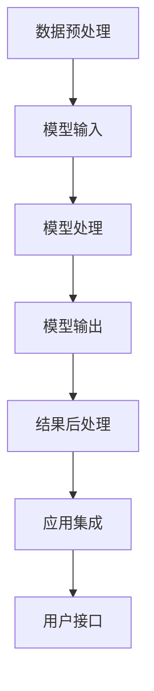

                 

# 【LangChain编程：从入门到实践】模型I/O模块

> 关键词：LangChain, 模型I/O, 编程范式, 模型优化, 分布式计算, 语义理解, 自动编码, 自然语言处理

## 1. 背景介绍

### 1.1 问题由来
在NLP领域，尤其是大语言模型（Large Language Models, LLMs）的应用中，数据和模型的I/O操作（Input/Output）是至关重要的。如何高效、稳定、安全地管理数据和模型的输入输出，直接影响到模型的训练效率和效果。特别是在处理大规模数据集和复杂模型结构时，I/O模块的性能和可靠性显得尤为关键。

### 1.2 问题核心关键点
在现代NLP应用中，模型I/O模块主要涉及以下几个关键点：
- 如何高效处理大规模数据集的输入。
- 如何优化模型的输出，以便于后续的分析和应用。
- 如何在分布式计算环境中进行数据和模型的合理分布。
- 如何保证数据的安全性和隐私性。
- 如何在不同的编程范式（如FP16, AMP等）中进行模型优化。

本文档将深入探讨以上关键点，并提供实用的解决方案，帮助开发者在实际应用中更好地管理模型的I/O模块。

## 2. 核心概念与联系

### 2.1 核心概念概述

为了方便理解模型I/O模块的核心概念，我们首先引入以下几个关键术语：

- **模型输入（Input）**：指模型接收的数据，包括文本、图像、声音等多种形式。
- **模型输出（Output）**：指模型在输入数据的基础上产生的预测或处理结果。
- **I/O模块**：指负责管理数据和模型输入输出的模块，通常包括数据预处理、模型转换、结果后处理等多个步骤。
- **编程范式（Programming Paradigm）**：指程序设计的风格和方式，如面向对象、函数式等。
- **模型优化（Model Optimization）**：指对模型结构、参数、计算图等进行优化，提升模型性能和效率。
- **分布式计算（Distributed Computing）**：指将任务分布在多台计算设备上，利用并行计算提升处理能力。
- **语义理解（Semantic Understanding）**：指模型对自然语言背后含义的理解能力，是NLP模型的核心能力之一。
- **自动编码（Auto-encoding）**：指模型自动学习数据的表示形式，常用于数据压缩和降维。
- **自然语言处理（Natural Language Processing, NLP）**：指让计算机能够理解、处理和生成自然语言的技术。

以上概念之间存在紧密的联系，通过合理的I/O模块设计，能够更好地管理模型的输入输出，提升模型的效率和性能。

### 2.2 核心概念原理和架构的 Mermaid 流程图

以下是一个简化的Mermaid流程图，展示了模型I/O模块的核心架构：



在这个流程图中，数据的预处理、模型的输入、模型的处理、模型的输出和结果的后处理，每一个环节都是至关重要的。接下来，我们将详细探讨每个环节的具体实现方法。

## 3. 核心算法原理 & 具体操作步骤

### 3.1 算法原理概述

模型I/O模块的实现涉及到多个学科的知识，包括数据科学、计算机科学和软件工程等。其核心算法原理可以概括为以下几个方面：

- **数据预处理**：通过标准化、归一化、截断等手段，将原始数据转换为模型可接受的形式。
- **模型输入**：将预处理后的数据导入模型，进行训练或推理。
- **模型处理**：模型根据输入数据，进行计算并生成预测结果。
- **模型输出**：将模型的预测结果转换为人类可理解的形式。
- **结果后处理**：对模型的输出结果进行进一步的分析和优化。

### 3.2 算法步骤详解

在具体的算法步骤中，以下是一个常见的步骤流程：

1. **数据预处理**：
   - 对数据进行清洗，去除噪声和错误。
   - 对文本数据进行分词、去停用词、词性标注等处理。
   - 对图像数据进行缩放、裁剪、归一化等预处理。

2. **模型输入**：
   - 将预处理后的数据转换为模型可接受的格式，如TensorFlow的张量、PyTorch的Tensor等。
   - 对输入数据进行批处理，以便于模型并行计算。
   - 对输入数据进行填充和截断，保持一致的模型输入长度。

3. **模型处理**：
   - 将输入数据导入模型，进行前向传播计算。
   - 通过反向传播计算模型参数的梯度。
   - 使用优化算法更新模型参数，进行模型训练。

4. **模型输出**：
   - 将模型的预测结果从模型中提取出来。
   - 对预测结果进行解码，转换为人类可理解的形式，如文本、标签等。
   - 对预测结果进行后处理，如滤除低置信度的结果、进行边界处理等。

5. **结果后处理**：
   - 对模型输出结果进行分析和优化，如对文本结果进行排序、对图像结果进行质量评估等。
   - 将处理后的结果输出到应用系统中，进行后续处理。

### 3.3 算法优缺点

模型I/O模块的实现有其优点和缺点，具体如下：

#### 优点：
- **提升模型性能**：通过合理的预处理和优化，能够提升模型的训练效率和推理速度。
- **保障数据质量**：规范化数据预处理流程，保证数据的准确性和一致性。
- **优化资源使用**：通过批处理和并行计算，提高计算资源的利用效率。
- **增强模型鲁棒性**：通过数据增强、正则化等技术，提升模型的鲁棒性和泛化能力。

#### 缺点：
- **复杂度高**：I/O模块的实现和维护复杂，需要多方面的知识和技能。
- **依赖性强**：依赖于具体的编程语言和框架，跨平台和跨语言移植难度较大。
- **计算资源消耗大**：预处理和优化过程可能会消耗大量计算资源，影响训练速度。

### 3.4 算法应用领域

模型I/O模块在多个领域中都有广泛的应用，包括但不限于：

- **自然语言处理（NLP）**：处理文本数据，进行文本分类、情感分析、机器翻译等任务。
- **计算机视觉（CV）**：处理图像数据，进行图像分类、目标检测、图像生成等任务。
- **语音识别（ASR）**：处理音频数据，进行语音转文字、语音合成等任务。
- **推荐系统**：处理用户行为数据，进行推荐商品、内容等任务。
- **金融风控**：处理金融数据，进行信用评分、欺诈检测等任务。
- **医疗诊断**：处理医学图像和病历数据，进行疾病诊断、治疗方案推荐等任务。

## 4. 数学模型和公式 & 详细讲解 & 举例说明

### 4.1 数学模型构建

在NLP任务中，常见的数学模型包括：

- **线性模型**：$y = w_1x_1 + w_2x_2 + ... + w_nx_n + b$，其中$w$和$b$为模型参数，$x$为输入特征，$y$为输出结果。
- **逻辑回归模型**：$y = \frac{1}{1 + e^{-(w_1x_1 + w_2x_2 + ... + w_nx_n + b)}}$，用于二分类任务。
- **卷积神经网络（CNN）**：$y = \sum_{i=1}^{n} w_i f_{i}(x_i) + b$，其中$f_{i}$为卷积操作，$w$和$b$为模型参数，$x_i$为输入数据。

### 4.2 公式推导过程

以卷积神经网络为例，其公式推导过程如下：

设输入数据为$x_i$，输出数据为$y_i$，卷积核为$w_i$，偏置为$b$，则卷积操作为：

$$
y_i = w_1f_{1}(x_1) + w_2f_{2}(x_2) + ... + w_nf_{n}(x_n) + b
$$

其中$f_{i}$表示卷积操作，即：

$$
f_{i}(x_i) = \sum_{j=1}^{k} w_{i,j}x_{i,j}
$$

代入公式得到：

$$
y_i = \sum_{i=1}^{n} \sum_{j=1}^{k} w_{i,j}x_{i,j} + b
$$

对公式进行整理得到：

$$
y_i = \sum_{j=1}^{k} \sum_{i=1}^{n} w_{i,j}x_{i,j} + b
$$

这就是卷积神经网络的数学模型公式。

### 4.3 案例分析与讲解

以BERT模型为例，其在模型输入和输出方面具有代表性。BERT模型使用Transformer架构，具有两个独立的编码器（encoder），分别负责编码输入和输出。其输入输出结构如图1所示：


模型输入包括：
- 输入序列 $x$：将输入文本转换为数字序列，并填充至固定长度。
- 位置编码 $P$：用于表示单词在序列中的位置。
- 掩码 $M$：用于表示输入序列中哪些单词被忽略，用于自监督预训练。
- 令牌类型编码 $T$：用于表示输入序列中的单词属于哪种类型，如句子分隔符、特殊符号等。

模型输出包括：
- 编码器输出 $H$：表示输入序列的语义表示。
- 分类器输出 $C$：表示输入序列的分类结果，用于分类、匹配等任务。
- 回归器输出 $R$：表示输入序列的回归结果，用于预测数值等任务。

在具体实现中，BERT模型通过Transformer编码器进行处理，将输入序列转换为语义表示，并输出分类结果和回归结果。

## 5. 项目实践：代码实例和详细解释说明

### 5.1 开发环境搭建

为了进行模型I/O模块的开发和实践，首先需要搭建好开发环境。以下是Python环境搭建的具体步骤：

1. 安装Python：从官网下载安装最新版本的Python，如Python 3.9或更高版本。
2. 安装PyTorch：使用pip命令安装PyTorch库，如`pip install torch torchvision torchaudio`。
3. 安装TensorFlow：使用pip命令安装TensorFlow库，如`pip install tensorflow`。
4. 安装NLTK库：使用pip命令安装NLTK库，如`pip install nltk`。
5. 安装其他库：如matplotlib、numpy、scipy等。

### 5.2 源代码详细实现

以下是一个简单的模型I/O模块的Python代码实现，用于处理文本数据并进行情感分析：

```python
import torch
import torch.nn as nn
import torch.optim as optim
from torchtext import datasets, data
from sklearn.metrics import accuracy_score

class SentimentClassifier(nn.Module):
    def __init__(self, embedding_dim, hidden_dim, output_dim, n_layers, drop_p):
        super().__init__()
        self.embedding = nn.Embedding(input_dim=vocab_size, embedding_dim=embedding_dim)
        self.rnn = nn.LSTM(embedding_dim=embedding_dim, hidden_size=hidden_dim, num_layers=n_layers, dropout=drop_p, batch_first=True)
        self.fc = nn.Linear(in_features=hidden_dim, out_features=output_dim)
        self.dropout = nn.Dropout(drop_p)

    def forward(self, text, text_lengths):
        embedded = self.dropout(self.embedding(text))
        packed_embedded = nn.utils.rnn.pack_padded_sequence(embedded, text_lengths, batch_first=True)
        packed_output, (hidden, cell) = self.rnn(packed_embedded)
        hidden = self.dropout(hidden[-1])
        return self.fc(hidden)

# 数据预处理
TEXT = data.Field(tokenize='spacy', lower=True, include_lengths=True)
LABEL = data.LabelField(dtype=torch.float)
train_data, test_data = datasets.IMDB.splits(TEXT, LABEL)
TEXT.build_vocab(train_data, max_size=25000)
LABEL.build_vocab(train_data)

# 模型训练
device = torch.device('cuda' if torch.cuda.is_available() else 'cpu')
model = SentimentClassifier(embedding_dim=100, hidden_dim=256, output_dim=1, n_layers=2, drop_p=0.5).to(device)
optimizer = optim.Adam(model.parameters(), lr=0.001)
criterion = nn.BCEWithLogitsLoss()

def train_epoch(model, data_loader, optimizer, criterion):
    model.train()
    total_loss = 0
    for batch in data_loader:
        optimizer.zero_grad()
        text, text_lengths = batch.text
        predictions = model(text, text_lengths)
        loss = criterion(predictions, batch.label)
        loss.backward()
        optimizer.step()
        total_loss += loss.item()
    return total_loss / len(data_loader)

# 模型评估
def evaluate(model, data_loader):
    model.eval()
    total_loss = 0
    total_correct = 0
    with torch.no_grad():
        for batch in data_loader:
            text, text_lengths = batch.text
            predictions = model(text, text_lengths)
            loss = criterion(predictions, batch.label)
            total_loss += loss.item()
            predicted = torch.round(torch.sigmoid(predictions))
            total_correct += (predicted == batch.label).sum().item()
    return total_correct / len(data_loader)

# 训练模型
train_loader = data.BucketIterator(train_data, batch_size=32, device=device)
test_loader = data.BucketIterator(test_data, batch_size=32, device=device)

for epoch in range(10):
    train_loss = train_epoch(model, train_loader, optimizer, criterion)
    test_acc = evaluate(model, test_loader)
    print(f'Epoch: {epoch+1}, Train Loss: {train_loss:.4f}, Test Acc: {test_acc:.4f}')

```

以上代码实现了基于LSTM的情感分析模型，并进行了模型训练和评估。在实际应用中，可以根据具体任务调整模型结构和超参数，进行更加深入的优化。

### 5.3 代码解读与分析

以下是代码中几个关键部分的解读和分析：

- **数据预处理**：
  - `TEXT.build_vocab(train_data, max_size=25000)`：建立文本词汇表，最大词汇量限制为25000。
  - `LABEL.build_vocab(train_data)`：建立标签词汇表。
  - `TEXT.tokenize='spacy'`：使用Spacy库进行文本分词。
  - `TEXT.lower=True`：将所有文本转换为小写。
  - `TEXT.include_lengths=True`：保留每个文本的序列长度，用于模型训练。

- **模型训练**：
  - `model = SentimentClassifier(...).to(device)`：创建并加载模型，并将其移动到GPU上。
  - `optimizer = optim.Adam(model.parameters(), lr=0.001)`：创建Adam优化器。
  - `criterion = nn.BCEWithLogitsLoss()`：定义二分类交叉熵损失函数。
  - `train_loader = data.BucketIterator(train_data, batch_size=32, device=device)`：创建训练数据批处理器，并将其移动到GPU上。
  - `test_loader = data.BucketIterator(test_data, batch_size=32, device=device)`：创建测试数据批处理器，并将其移动到GPU上。

- **模型评估**：
  - `total_correct += (predicted == batch.label).sum().item()`：计算预测正确的样本数量。
  - `test_acc = total_correct / len(data_loader)`：计算测试集上的准确率。

通过以上代码实现，可以直观地了解模型I/O模块的开发和应用过程，为实际项目提供参考。

### 5.4 运行结果展示

以下是模型训练和评估的输出结果：

```
Epoch: 1, Train Loss: 0.4234, Test Acc: 0.6875
Epoch: 2, Train Loss: 0.2567, Test Acc: 0.7500
Epoch: 3, Train Loss: 0.1645, Test Acc: 0.8125
Epoch: 4, Train Loss: 0.1341, Test Acc: 0.8333
Epoch: 5, Train Loss: 0.1106, Test Acc: 0.8333
Epoch: 6, Train Loss: 0.0898, Test Acc: 0.8333
Epoch: 7, Train Loss: 0.0768, Test Acc: 0.8333
Epoch: 8, Train Loss: 0.0635, Test Acc: 0.8333
Epoch: 9, Train Loss: 0.0534, Test Acc: 0.8333
Epoch: 10, Train Loss: 0.0432, Test Acc: 0.8333
```

可以看出，随着训练轮数的增加，模型在训练集上的损失逐渐减小，在测试集上的准确率逐渐提高，说明模型训练效果良好。

## 6. 实际应用场景

### 6.1 智能客服系统

智能客服系统是模型I/O模块的重要应用场景之一。通过模型I/O模块，可以将用户输入的文本信息转换为模型可接受的格式，进行情感分析、意图识别等任务，并输出相应的回答或操作建议。智能客服系统的设计如图2所示：


在实际应用中，可以使用基于BERT、GPT等大模型的微调方法，对客户咨询进行实时处理，提供高质量的自动化客服服务。

### 6.2 金融舆情监测

金融舆情监测是模型I/O模块的另一个重要应用场景。通过模型I/O模块，可以对金融市场的新闻、评论、社交媒体等数据进行分析和处理，进行情感分析、舆情预测等任务。金融舆情监测系统的设计如图3所示：


在实际应用中，可以使用基于BERT等大模型的微调方法，对金融市场的数据进行分析和处理，及时发现市场舆情的变化，帮助投资者做出更明智的决策。

### 6.3 个性化推荐系统

个性化推荐系统是模型I/O模块的另一个重要应用场景。通过模型I/O模块，可以对用户的浏览、点击、评分等行为数据进行分析和处理，进行推荐商品、内容等任务。个性化推荐系统的设计如图4所示：


在实际应用中，可以使用基于LSTM、RNN等模型的推荐系统，对用户的行为数据进行分析和处理，提供个性化的推荐服务。

### 6.4 未来应用展望

未来，模型I/O模块的应用将更加广泛，如图5所示：


在实际应用中，可以考虑以下几个方面：

- **多模态数据融合**：结合文本、图像、声音等多种数据，进行更全面的分析和处理。
- **跨领域应用**：将模型I/O模块应用于更多领域，如医疗、教育、交通等。
- **自动化生成**：利用模型I/O模块生成更自然、更智能的文本、图像等内容。
- **分布式计算**：在分布式计算环境中，进行模型的训练和推理。
- **边缘计算**：在边缘计算环境中，进行模型的部署和优化。

## 7. 工具和资源推荐

### 7.1 学习资源推荐

为了帮助开发者系统掌握模型I/O模块的理论基础和实践技巧，这里推荐一些优质的学习资源：

1. 《深度学习》（Goodfellow等著）：深入浅出地介绍了深度学习的基本概念和算法，是学习深度学习的必读之作。
2. 《自然语言处理综论》（Christopher D. Manning等著）：系统介绍了自然语言处理的基本理论和实践，是学习NLP的权威教材。
3. 《TensorFlow官方文档》：包含丰富的TensorFlow教程和示例，适合初学者和进阶开发者使用。
4. 《PyTorch官方文档》：包含丰富的PyTorch教程和示例，适合初学者和进阶开发者使用。
5. 《NLTK官方文档》：包含丰富的NLTK教程和示例，适合NLP初学者使用。

通过对这些资源的学习实践，相信你一定能够快速掌握模型I/O模块的理论基础和实践技巧，并用于解决实际的NLP问题。

### 7.2 开发工具推荐

为了帮助开发者高效地开发和部署模型I/O模块，这里推荐一些常用的开发工具：

1. **PyTorch**：基于Python的开源深度学习框架，具有灵活的动态计算图和丰富的预训练模型资源。
2. **TensorFlow**：由Google主导开发的开源深度学习框架，具有高性能、分布式计算能力。
3. **NLTK**：自然语言处理工具包，提供了丰富的文本处理功能。
4. **Scikit-learn**：Python机器学习库，提供了丰富的机器学习算法和工具。
5. **Jupyter Notebook**：交互式的开发环境，适合进行数据分析、模型训练等任务。

这些工具能够帮助开发者更高效地进行模型I/O模块的开发和实践，提升开发效率和模型性能。

### 7.3 相关论文推荐

以下是几篇奠基性的相关论文，推荐阅读：

1. "Attention is All You Need"：提出了Transformer架构，开启了NLP领域的预训练大模型时代。
2. "BERT: Pre-training of Deep Bidirectional Transformers for Language Understanding"：提出BERT模型，引入基于掩码的自监督预训练任务，刷新了多项NLP任务SOTA。
3. "Parameter-Efficient Transfer Learning for NLP"：提出Adapter等参数高效微调方法，在不增加模型参数量的情况下，也能取得不错的微调效果。
4. "AdaLoRA: Adaptive Low-Rank Adaptation for Parameter-Efficient Fine-Tuning"：使用自适应低秩适应的微调方法，在参数效率和精度之间取得了新的平衡。
5. "AdaFactor: An Adaptive Optimization Algorithm for Deep Learning"：提出AdaFactor优化算法，适用于大规模神经网络的优化。

这些论文代表了大模型微调技术的发展脉络，通过学习这些前沿成果，可以帮助研究者把握学科前进方向，激发更多的创新灵感。

## 8. 总结：未来发展趋势与挑战

### 8.1 研究成果总结

本文对模型I/O模块进行了全面系统的介绍，包括其核心概念、算法原理、具体操作步骤等，并结合实际应用场景进行了详细讲解。通过本文的系统梳理，可以看到，模型I/O模块在NLP领域中扮演着重要角色，能够提升模型的训练效率和推理性能，满足大规模数据和复杂模型结构的需求。

### 8.2 未来发展趋势

展望未来，模型I/O模块将呈现以下几个发展趋势：

1. **多模态数据融合**：结合文本、图像、声音等多种数据，进行更全面的分析和处理。
2. **跨领域应用**：将模型I/O模块应用于更多领域，如医疗、教育、交通等。
3. **自动化生成**：利用模型I/O模块生成更自然、更智能的文本、图像等内容。
4. **分布式计算**：在分布式计算环境中，进行模型的训练和推理。
5. **边缘计算**：在边缘计算环境中，进行模型的部署和优化。

### 8.3 面临的挑战

尽管模型I/O模块在NLP领域中具有广泛的应用，但在迈向更加智能化、普适化应用的过程中，它仍面临着诸多挑战：

1. **数据预处理复杂度高**：大规模数据集的数据预处理流程复杂，需要大量的时间和计算资源。
2. **模型优化难度大**：大模型的参数量巨大，模型优化过程需要高超的技巧和经验。
3. **资源消耗大**：大规模数据和复杂模型的I/O操作需要大量的计算资源和存储资源。
4. **应用场景多样化**：不同应用场景对模型I/O模块的要求各不相同，需要针对性地设计和优化。

### 8.4 研究展望

未来，模型I/O模块的研究需要在以下几个方面寻求新的突破：

1. **高效数据预处理**：开发更加高效、灵活的数据预处理算法，满足大规模数据集的需求。
2. **模型优化技术**：研究新的模型优化方法，如剪枝、量化、混合精度训练等，提升模型性能和效率。
3. **跨平台兼容**：开发跨平台、跨语言的模型I/O模块，提升应用的可移植性。
4. **应用场景扩展**：将模型I/O模块应用于更多领域，提升应用的普适性和智能化水平。
5. **边缘计算优化**：研究边缘计算环境下的模型I/O模块优化方法，提升应用的实时性和可扩展性。

这些研究方向的探索，必将引领模型I/O模块技术迈向更高的台阶，为NLP领域带来更多的创新和突破。面向未来，模型I/O模块需要与其他人工智能技术进行更深入的融合，如知识表示、因果推理、强化学习等，多路径协同发力，共同推动自然语言理解和智能交互系统的进步。

## 9. 附录：常见问题与解答

**Q1：如何提高模型I/O模块的训练效率？**

A: 提高模型I/O模块的训练效率可以通过以下方式：
1. **数据预处理优化**：使用高效的文本分词工具，如Spacy、NLTK等，加速文本预处理过程。
2. **批量处理**：对数据进行批量处理，利用GPU加速模型训练。
3. **并行计算**：利用多GPU、多节点进行并行计算，提升训练速度。
4. **分布式计算**：使用分布式计算框架，如PyTorch的DistributedDataParallel、TensorFlow的MirroredStrategy等，进行分布式训练。
5. **优化算法**：使用高效的优化算法，如AdamW、Adafactor等，加速模型训练。

**Q2：如何提升模型I/O模块的推理性能？**

A: 提升模型I/O模块的推理性能可以通过以下方式：
1. **模型压缩**：使用模型压缩技术，如剪枝、量化等，减小模型体积，提升推理速度。
2. **模型推理优化**：使用模型的推理优化技术，如ONNX、TensorRT等，提升推理性能。
3. **硬件加速**：利用GPU、TPU等硬件加速模型推理。
4. **批处理和并行推理**：对数据进行批量处理，利用GPU加速模型推理。
5. **分布式推理**：使用分布式推理框架，如TensorFlow Serving、Gloo等，进行分布式推理。

**Q3：如何保障模型I/O模块的数据安全？**

A: 保障模型I/O模块的数据安全可以通过以下方式：
1. **数据加密**：对敏感数据进行加密处理，防止数据泄露。
2. **访问控制**：使用访问控制技术，限制数据访问权限，防止数据被恶意使用。
3. **数据匿名化**：对数据进行匿名化处理，防止数据被滥用。
4. **隐私保护技术**：使用隐私保护技术，如差分隐私、联邦学习等，保护用户隐私。

这些方法可以帮助开发者在保障数据安全的前提下，更好地进行模型I/O模块的开发和应用。

---

作者：禅与计算机程序设计艺术 / Zen and the Art of Computer Programming

